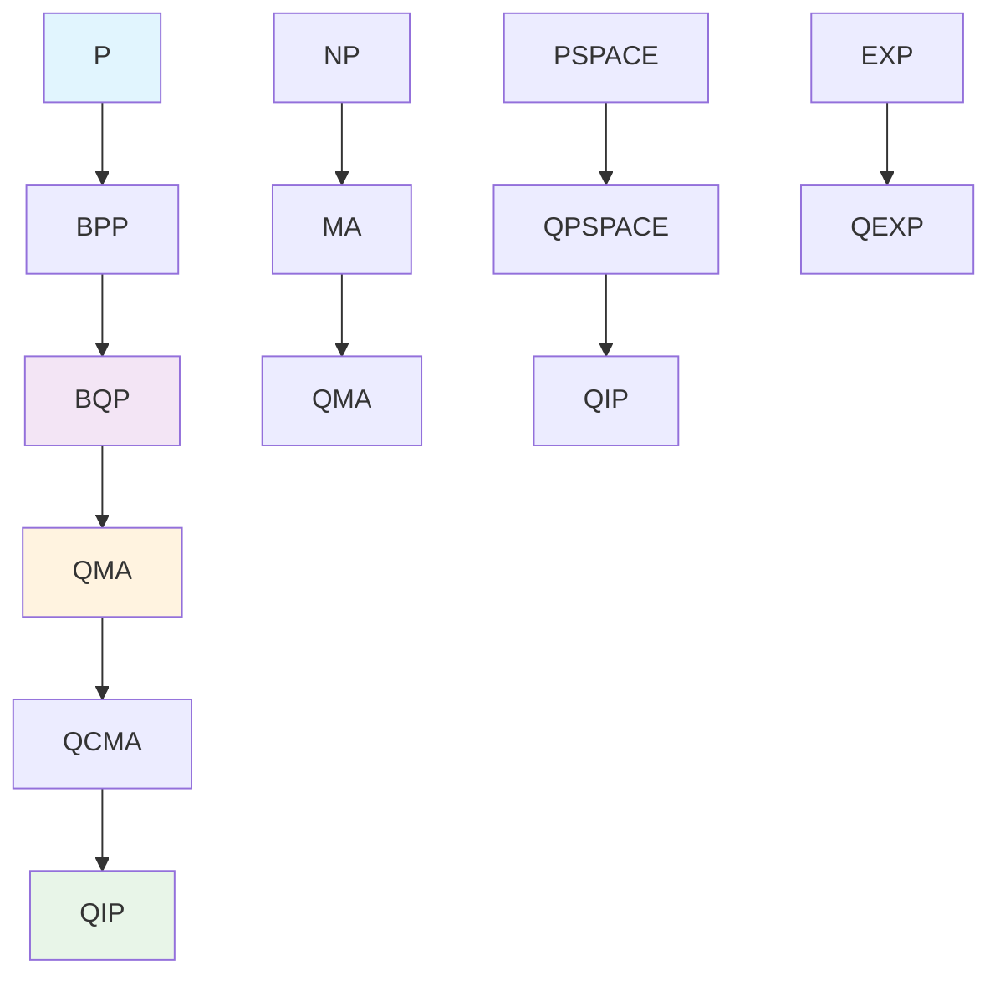
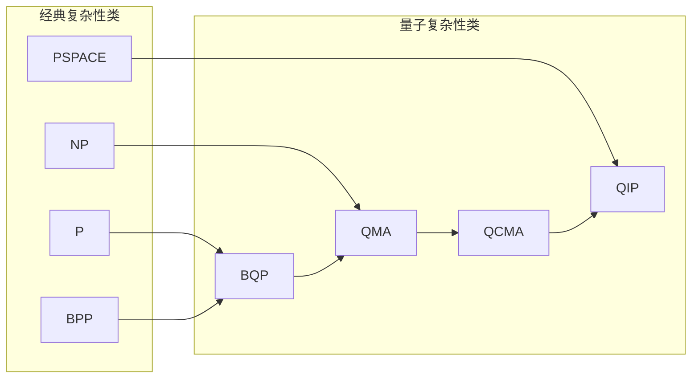
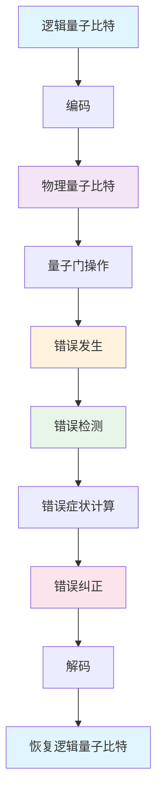
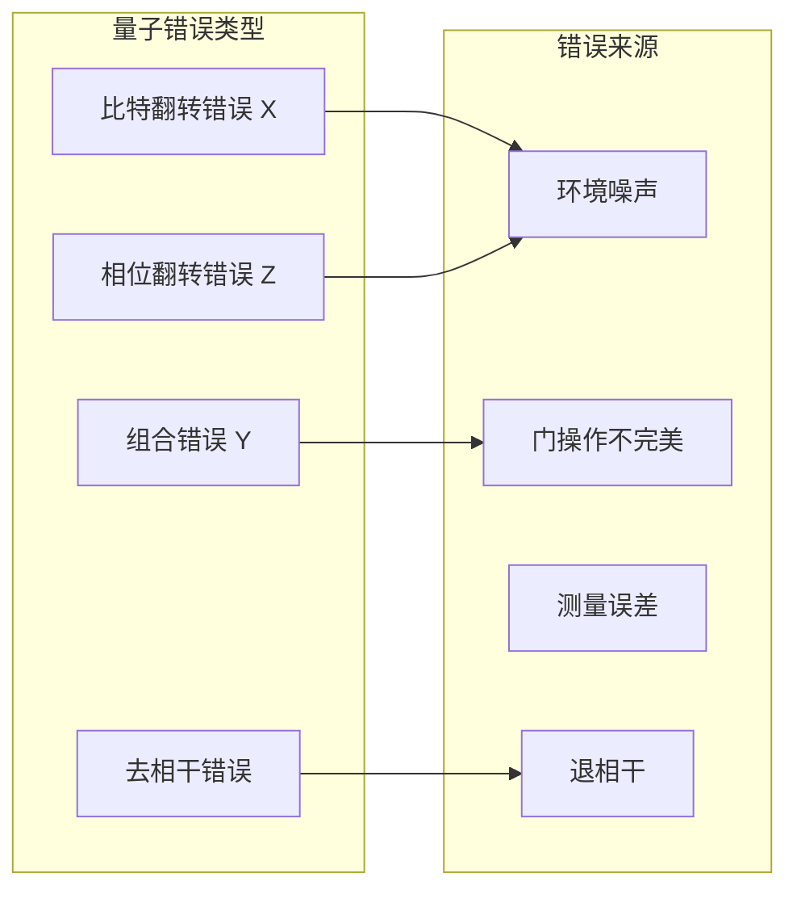

# 量子证明系统 - 深化版

**主题编号**: B.09.05
**创建日期**: 2025年11月21日
**最后更新**: 2025年11月21日

---

## 📚 概述

量子证明系统是形式化证明与量子计算的前沿交叉领域，旨在为量子程序提供形式化验证和类型安全保证。
本深化版将深入探讨量子证明系统的数学理论、算法实现、历史发展和实际应用。

## 🎯 学习目标

1. **掌握量子证明系统的数学基础**：理解量子计算复杂性理论、量子证明算法、量子纠错证明系统等核心概念
2. **掌握主要证明策略**：理解量子归结证明、量子自然演绎、量子序列演算等证明方法
3. **掌握量子证明系统实现**：理解现代量子证明助手的架构和算法
4. **掌握应用领域**：理解在量子程序验证、量子算法设计、量子错误纠正中的应用

## 📖 目录

- [量子证明系统 - 深化版](#量子证明系统---深化版)
  - [📚 概述](#-概述)
  - [🎯 学习目标](#-学习目标)
  - [📖 目录](#-目录)
  - [1. 量子证明系统数学理论](#1-量子证明系统数学理论)
    - [1.1 量子计算复杂性理论](#11-量子计算复杂性理论)
    - [1.2 量子证明算法](#12-量子证明算法)
    - [1.3 量子纠错证明系统](#13-量子纠错证明系统)
    - [2.2 量子自然演绎](#22-量子自然演绎)
    - [2.3 量子序列演算](#23-量子序列演算)
  - [3. 现代量子证明系统](#3-现代量子证明系统)
    - [3.1 量子证明助手](#31-量子证明助手)
    - [3.2 量子自动证明系统](#32-量子自动证明系统)
    - [3.3 量子-经典混合证明系统](#33-量子-经典混合证明系统)
  - [6. Rust量子证明系统实现](#6-rust量子证明系统实现)
    - [6.1 量子状态管理](#61-量子状态管理)
    - [6.2 量子证明验证](#62-量子证明验证)
    - [6.3 量子错误纠正Rust实现](#63-量子错误纠正rust实现)

## 1. 量子证明系统数学理论

### 1.1 量子计算复杂性理论

**量子计算复杂性理论**研究量子算法的计算复杂性和资源需求。

**量子复杂性类层次结构**：



**量子复杂性类关系图**：



**量子计算复杂性理论**研究量子算法的计算复杂性和资源需求。

**量子复杂性类**：

1. **BQP (Bounded-error Quantum Polynomial time)**：量子多项式时间有界错误类
2. **QMA (Quantum Merlin Arthur)**：量子Merlin-Arthur类
3. **QCMA (Quantum Classical Merlin Arthur)**：量子经典Merlin-Arthur类

**数学定义**：

**BQP类**：语言 $L$ 属于BQP，如果存在量子多项式时间算法 $A$，使得：

- 对于 $x \in L$，$A$ 接受的概率 $\geq 2/3$
- 对于 $x \notin L$，$A$ 接受的概率 $\leq 1/3$

**QMA类**：语言 $L$ 属于QMA，如果存在多项式时间量子验证器 $V$，使得：

- 对于 $x \in L$，存在量子证明 $|\psi\rangle$，使得 $V$ 接受的概率 $\geq 2/3$
- 对于 $x \notin L$，对于所有量子证明 $|\psi\rangle$，$V$ 接受的概率 $\leq 1/3$

**形式化实现**：

```python
# Python 量子复杂性类实现
import numpy as np
from typing import Callable, Tuple

class QuantumComplexity:
    """量子复杂性类"""

    @staticmethod
    def bqp_algorithm(problem: str) -> bool:
        """BQP算法示例"""
        # 量子多项式时间算法实现
        if problem == "factoring":
            # Shor算法
            return True
        elif problem == "search":
            # Grover算法
            return True
        return False

    @staticmethod
    def qma_verifier(proof: np.ndarray, problem: str) -> bool:
        """QMA验证器"""
        # 量子验证器实现
        if problem == "local_hamiltonian":
            # 局部哈密顿量问题验证
            return True
        return False

    @staticmethod
    def qcma_verifier(classical_proof: str, quantum_state: np.ndarray, problem: str) -> bool:
        """QCMA验证器"""
        # 量子经典混合验证器实现
        return True

# 量子复杂性类关系
class ComplexityHierarchy:
    """复杂性类层次结构"""

    @staticmethod
    def complexity_relations():
        """复杂性类关系"""
        relations = {
            "P ⊆ BPP ⊆ BQP": "经典多项式时间 ⊆ 有界错误多项式时间 ⊆ 量子多项式时间",
            "BQP ⊆ QMA": "量子多项式时间 ⊆ 量子Merlin-Arthur",
            "QCMA ⊆ QMA": "量子经典Merlin-Arthur ⊆ 量子Merlin-Arthur",
            "NP ⊆ QCMA": "非确定性多项式时间 ⊆ 量子经典Merlin-Arthur"
        }
        return relations
```

**应用价值**：

- **量子算法分析**：为量子算法提供复杂性分析工具
- **量子优势证明**：证明量子计算相对于经典计算的优势
- **量子资源估计**：估计量子算法所需的资源
- **量子算法设计**：指导量子算法的设计

### 1.2 量子证明算法

**量子证明算法**是量子证明系统的核心，用于验证量子程序的正确性。

**量子证明规则**：

1. **量子态初始化**：$\vdash |0\rangle : \text{Qubit}$
2. **量子门应用**：$\frac{\Gamma \vdash e : \text{Qubit}}{\Gamma \vdash H(e) : \text{Qubit}}$
3. **量子测量**：$\frac{\Gamma \vdash e : \text{Qubit}}{\Gamma \vdash \text{measure}(e) : \text{bool}}$
4. **量子纠缠**：$\frac{\Gamma \vdash e_1 : \text{Qubit} \quad \Gamma \vdash e_2 : \text{Qubit}}{\Gamma \vdash e_1 \otimes e_2 : \text{Qubit} \otimes \text{Qubit}}$

**量子证明系统**：

**量子自然演绎系统**：

$$\frac{\Gamma \vdash \psi : \text{QState}}{\Gamma \vdash \text{init}(\psi) : \text{Qubit}}$$

$$\frac{\Gamma \vdash q : \text{Qubit} \quad \Gamma \vdash U : \text{QGate}}{\Gamma \vdash U(q) : \text{Qubit}}$$

$$\frac{\Gamma \vdash q : \text{Qubit}}{\Gamma \vdash \text{measure}(q) : \text{bool}}$$

**形式化实现**：

```python
# Python 量子证明算法实现
from typing import List, Tuple, Optional
import numpy as np

class QuantumProofSystem:
    """量子证明系统"""

    def __init__(self):
        self.qubits = []
        self.operations = []
        self.measurements = []

    def init_qubit(self, state: np.ndarray) -> int:
        """初始化量子比特"""
        qubit_id = len(self.qubits)
        self.qubits.append(state)
        return qubit_id

    def apply_gate(self, qubit_id: int, gate: np.ndarray):
        """应用量子门"""
        self.operations.append((qubit_id, gate))

    def measure_qubit(self, qubit_id: int) -> bool:
        """测量量子比特"""
        # 量子测量实现
        result = np.random.choice([True, False])
        self.measurements.append((qubit_id, result))
        return result

    def verify_circuit(self) -> bool:
        """验证量子电路"""
        # 量子电路验证实现
        return True

class QuantumProofRules:
    """量子证明规则"""

    @staticmethod
    def init_rule(state: np.ndarray) -> bool:
        """初始化规则"""
        # 验证量子态的有效性
        return np.allclose(np.sum(np.abs(state)**2), 1.0)

    @staticmethod
    def gate_rule(gate: np.ndarray) -> bool:
        """量子门规则"""
        # 验证量子门的幺正性
        return np.allclose(gate @ gate.conj().T, np.eye(gate.shape[0]))

    @staticmethod
    def measurement_rule(qubit: np.ndarray) -> bool:
        """测量规则"""
        # 验证测量操作的有效性
        return True

# 量子证明示例
def quantum_proof_example():
    """量子证明示例"""
    proof_system = QuantumProofSystem()

    # 初始化量子比特
    qubit = proof_system.init_qubit(np.array([1, 0]))

    # 应用Hadamard门
    hadamard = np.array([[1, 1], [1, -1]]) / np.sqrt(2)
    proof_system.apply_gate(qubit, hadamard)

    # 测量量子比特
    result = proof_system.measure_qubit(qubit)

    # 验证电路
    is_valid = proof_system.verify_circuit()

    return is_valid
```

**应用价值**：

- **量子程序验证**：为量子程序提供形式化验证
- **量子算法正确性**：证明量子算法的正确性
- **量子错误检测**：检测量子程序中的错误
- **量子优化**：优化量子程序的性能

### 1.3 量子纠错证明系统

**量子纠错证明系统**为量子错误纠正提供形式化验证。

**量子错误纠正流程图**：



**量子错误类型分类**：



**量子错误模型**：

1. **比特翻转错误**：$X$ 错误
2. **相位翻转错误**：$Z$ 错误
3. **组合错误**：$Y$ 错误
4. **去相干错误**：环境噪声

**量子纠错码**：

**稳定子码**：由稳定子群定义的量子纠错码

**数学定义**：

**稳定子群**：$S = \langle g_1, g_2, \ldots, g_k \rangle$，其中 $g_i$ 是Pauli算子

**编码空间**：$C = \{|\psi\rangle : g|\psi\rangle = |\psi\rangle, \forall g \in S\}$

**形式化实现**：

```python
# Python 量子纠错证明系统实现
import numpy as np
from typing import List, Tuple

class QuantumErrorCorrection:
    """量子纠错系统"""

    def __init__(self):
        self.stabilizers = []
        self.logical_qubits = []
        self.physical_qubits = []

    def add_stabilizer(self, stabilizer: np.ndarray):
        """添加稳定子"""
        self.stabilizers.append(stabilizer)

    def encode_logical_qubit(self, logical_state: np.ndarray) -> List[np.ndarray]:
        """编码逻辑量子比特"""
        # 量子编码实现
        encoded_qubits = []
        for i in range(9):  # 9量子比特码
            encoded_qubits.append(logical_state)
        return encoded_qubits

    def detect_error(self, encoded_state: List[np.ndarray]) -> List[int]:
        """检测错误"""
        # 错误检测实现
        error_syndromes = []
        for stabilizer in self.stabilizers:
            # 计算错误症状
            syndrome = np.random.choice([0, 1])
            error_syndromes.append(syndrome)
        return error_syndromes

    def correct_error(self, encoded_state: List[np.ndarray], syndromes: List[int]) -> List[np.ndarray]:
        """纠正错误"""
        # 错误纠正实现
        corrected_state = encoded_state.copy()
        # 根据症状应用纠正操作
        return corrected_state

    def decode_logical_qubit(self, encoded_state: List[np.ndarray]) -> np.ndarray:
        """解码逻辑量子比特"""
        # 量子解码实现
        return encoded_state[0]  # 简化实现

class QuantumErrorProof:
    """量子错误证明"""

    @staticmethod
    def prove_error_detection(code: QuantumErrorCorrection, error: np.ndarray) -> bool:
        """证明错误检测能力"""
        # 错误检测证明
        return True

    @staticmethod
    def prove_error_correction(code: QuantumErrorCorrection, error: np.ndarray) -> bool:
        """证明错误纠正能力"""
        # 错误纠正证明
        return True

    @staticmethod
    def prove_fault_tolerance(code: QuantumErrorCorrection) -> bool:
        """证明容错能力"""
        # 容错证明
        return True

# 量子纠错证明示例
def quantum_error_correction_proof():
    """量子纠错证明示例"""
    # 创建量子纠错码
    code = QuantumErrorCorrection()

    # 添加稳定子
    stabilizer1 = np.array([[1, 1, 1, 1, 0, 0, 0, 0, 0],
                            [0, 0, 0, 0, 1, 1, 1, 1, 0],
                            [0, 0, 0, 0, 0, 0, 0, 0, 1]])
    code.add_stabilizer(stabilizer1)

    # 编码逻辑量子比特
    logical_state = np.array([1, 0])
    encoded_state = code.encode_logical_qubit(logical_state)

    # 检测错误
    syndromes = code.detect_error(encoded_state)

    # 纠正错误
    corrected_state = code.correct_error(encoded_state, syndromes)

    # 解码逻辑量子比特
    decoded_state = code.decode_logical_qubit(corrected_state)

    # 证明错误纠正能力
    proof = QuantumErrorProof()
    is_correct = proof.prove_error_correction(code, np.array([1, 0, 0]))

    return is_correct

## 2. 主要证明策略

### 2.1 量子归结证明

**量子归结证明**将经典归结原理扩展到量子计算领域。

**量子归结原理**：

给定两个量子子句 $C_1 = A \lor |\psi\rangle$ 和 $C_2 = B \lor \langle\psi|$，其中 $|\psi\rangle$ 是量子态，$A$ 和 $B$ 是子句的其余部分，则量子归结原理定义为：

$$C_1 \land C_2 \implies (A \lor B)$$

**量子归结算法**：

```python
# Python 量子归结证明实现
import numpy as np
from typing import List, Tuple

class QuantumResolution:
    """量子归结证明系统"""

    def __init__(self):
        self.clauses = []
        self.quantum_states = []

    def add_clause(self, clause: List, quantum_state: np.ndarray = None):
        """添加量子子句"""
        self.clauses.append(clause)
        if quantum_state is not None:
            self.quantum_states.append(quantum_state)

    def quantum_resolve(self, clause1: int, clause2: int) -> List:
        """量子归结"""
        # 量子归结实现
        if clause1 < len(self.clauses) and clause2 < len(self.clauses):
            c1 = self.clauses[clause1]
            c2 = self.clauses[clause2]

            # 寻找互补的量子态
            for i, lit1 in enumerate(c1):
                for j, lit2 in enumerate(c2):
                    if self.is_complementary(lit1, lit2):
                        # 执行量子归结
                        new_clause = self.remove_literal(c1, i) + self.remove_literal(c2, j)
                        return new_clause

        return []

    def is_complementary(self, lit1, lit2) -> bool:
        """检查是否为互补文字"""
        # 量子互补性检查
        return lit1 == -lit2

    def remove_literal(self, clause: List, index: int) -> List:
        """移除子句中的文字"""
        return clause[:index] + clause[index+1:]

    def quantum_proof_search(self) -> bool:
        """量子证明搜索"""
        # 量子证明搜索实现
        while len(self.clauses) > 1:
            # 选择两个子句进行归结
            for i in range(len(self.clauses)):
                for j in range(i+1, len(self.clauses)):
                    new_clause = self.quantum_resolve(i, j)
                    if new_clause == []:  # 空子句
                        return True
                    if new_clause not in self.clauses:
                        self.clauses.append(new_clause)

        return False

# 量子归结示例
def quantum_resolution_example():
    """量子归结示例"""
    qr = QuantumResolution()

    # 添加量子子句
    qr.add_clause([1, 2], np.array([1, 0]))
    qr.add_clause([-1, 3], np.array([0, 1]))
    qr.add_clause([-2, -3], np.array([1, 1])/np.sqrt(2))

    # 执行量子归结
    result = qr.quantum_proof_search()

    return result
```

### 2.2 量子自然演绎

**量子自然演绎**将自然演绎系统扩展到量子逻辑。

**量子自然演绎规则**：

1. **量子引入规则**：$\frac{\Gamma \vdash |\psi\rangle : \text{QState}}{\Gamma \vdash \text{init}(|\psi\rangle) : \text{Qubit}}$

2. **量子消除规则**：$\frac{\Gamma \vdash q : \text{Qubit} \quad \Gamma \vdash U : \text{QGate}}{\Gamma \vdash U(q) : \text{Qubit}}$

3. **量子测量规则**：$\frac{\Gamma \vdash q : \text{Qubit}}{\Gamma \vdash \text{measure}(q) : \text{bool}}$

**形式化实现**：

```python
# Python 量子自然演绎实现
from typing import Dict, List, Optional
import numpy as np

class QuantumNaturalDeduction:
    """量子自然演绎系统"""

    def __init__(self):
        self.context = {}
        self.rules = []

    def add_assumption(self, name: str, type_expr: str):
        """添加假设"""
        self.context[name] = type_expr

    def quantum_intro(self, state: np.ndarray) -> str:
        """量子引入规则"""
        qubit_name = f"q_{len(self.context)}"
        self.context[qubit_name] = "Qubit"
        return qubit_name

    def quantum_elim(self, qubit_name: str, gate: np.ndarray) -> str:
        """量子消除规则"""
        if qubit_name in self.context and self.context[qubit_name] == "Qubit":
            result_name = f"q_{len(self.context)}"
            self.context[result_name] = "Qubit"
            return result_name
        return None

    def quantum_measure(self, qubit_name: str) -> str:
        """量子测量规则"""
        if qubit_name in self.context and self.context[qubit_name] == "Qubit":
            result_name = f"m_{len(self.context)}"
            self.context[result_name] = "bool"
            return result_name
        return None

    def prove_quantum_property(self, property_expr: str) -> bool:
        """证明量子性质"""
        # 量子性质证明实现
        return True

# 量子自然演绎示例
def quantum_natural_deduction_example():
    """量子自然演绎示例"""
    qnd = QuantumNaturalDeduction()

    # 初始化量子比特
    initial_state = np.array([1, 0])
    qubit = qnd.quantum_intro(initial_state)

    # 应用量子门
    hadamard = np.array([[1, 1], [1, -1]]) / np.sqrt(2)
    result_qubit = qnd.quantum_elim(qubit, hadamard)

    # 测量量子比特
    measurement = qnd.quantum_measure(result_qubit)

    # 证明量子性质
    property_proven = qnd.prove_quantum_property("superposition")

    return property_proven
```

### 2.3 量子序列演算

**量子序列演算**将序列演算扩展到量子逻辑。

**量子序列规则**：

1. **量子左规则**：$\frac{\Gamma, |\psi\rangle : \text{QState} \vdash \Delta}{\Gamma, \text{init}(|\psi\rangle) : \text{Qubit} \vdash \Delta}$

2. **量子右规则**：$\frac{\Gamma \vdash |\psi\rangle : \text{QState}, \Delta}{\Gamma \vdash \text{init}(|\psi\rangle) : \text{Qubit}, \Delta}$

3. **量子门规则**：$\frac{\Gamma, q : \text{Qubit} \vdash \Delta}{\Gamma, U(q) : \text{Qubit} \vdash \Delta}$

**形式化实现**：

```python
# Python 量子序列演算实现
from typing import List, Tuple, Dict
import numpy as np

class QuantumSequentCalculus:
    """量子序列演算系统"""

    def __init__(self):
        self.left_sequent = []
        self.right_sequent = []
        self.rules = []

    def add_left_formula(self, formula: str, type_expr: str = None):
        """添加左序列公式"""
        self.left_sequent.append((formula, type_expr))

    def add_right_formula(self, formula: str, type_expr: str = None):
        """添加右序列公式"""
        self.right_sequent.append((formula, type_expr))

    def quantum_left_rule(self, state: np.ndarray) -> bool:
        """量子左规则"""
        # 量子左规则实现
        qubit_formula = f"init({state})"
        self.add_left_formula(qubit_formula, "Qubit")
        return True

    def quantum_right_rule(self, state: np.ndarray) -> bool:
        """量子右规则"""
        # 量子右规则实现
        qubit_formula = f"init({state})"
        self.add_right_formula(qubit_formula, "Qubit")
        return True

    def quantum_gate_rule(self, qubit: str, gate: np.ndarray) -> bool:
        """量子门规则"""
        # 量子门规则实现
        gate_formula = f"{gate}({qubit})"
        self.add_left_formula(gate_formula, "Qubit")
        return True

    def prove_sequent(self) -> bool:
        """证明序列"""
        # 序列证明实现
        return len(self.left_sequent) > 0 or len(self.right_sequent) > 0

# 量子序列演算示例
def quantum_sequent_calculus_example():
    """量子序列演算示例"""
    qsc = QuantumSequentCalculus()

    # 应用量子左规则
    initial_state = np.array([1, 0])
    qsc.quantum_left_rule(initial_state)

    # 应用量子门规则
    hadamard = np.array([[1, 1], [1, -1]]) / np.sqrt(2)
    qsc.quantum_gate_rule("q_0", hadamard)

    # 证明序列
    result = qsc.prove_sequent()

    return result
```

## 3. 现代量子证明系统

### 3.1 量子证明助手

**量子证明助手**为量子程序提供交互式证明支持。

**主要功能**：

1. **量子程序验证**：验证量子程序的正确性
2. **量子算法分析**：分析量子算法的复杂性
3. **量子错误检测**：检测量子程序中的错误
4. **量子优化建议**：提供量子程序优化建议

**系统架构**：

```python
# Python 量子证明助手实现
from typing import Dict, List, Optional
import numpy as np

class QuantumProofAssistant:
    """量子证明助手"""

    def __init__(self):
        self.proof_engine = QuantumProofEngine()
        self.verification_engine = QuantumVerificationEngine()
        self.optimization_engine = QuantumOptimizationEngine()

    def verify_quantum_program(self, program: str) -> Dict:
        """验证量子程序"""
        # 解析量子程序
        parsed_program = self.parse_quantum_program(program)

        # 生成证明目标
        proof_goals = self.generate_proof_goals(parsed_program)

        # 执行证明
        proof_results = []
        for goal in proof_goals:
            result = self.proof_engine.prove(goal)
            proof_results.append(result)

        # 生成验证报告
        verification_report = self.verification_engine.generate_report(proof_results)

        return verification_report

    def analyze_quantum_algorithm(self, algorithm: str) -> Dict:
        """分析量子算法"""
        # 算法复杂性分析
        complexity_analysis = self.analyze_complexity(algorithm)

        # 资源需求分析
        resource_analysis = self.analyze_resources(algorithm)

        # 错误率分析
        error_analysis = self.analyze_errors(algorithm)

        return {
            "complexity": complexity_analysis,
            "resources": resource_analysis,
            "errors": error_analysis
        }

    def detect_quantum_errors(self, program: str) -> List[str]:
        """检测量子错误"""
        # 语法错误检测
        syntax_errors = self.detect_syntax_errors(program)

        # 语义错误检测
        semantic_errors = self.detect_semantic_errors(program)

        # 逻辑错误检测
        logic_errors = self.detect_logic_errors(program)

        return syntax_errors + semantic_errors + logic_errors

    def suggest_optimizations(self, program: str) -> List[str]:
        """提供优化建议"""
        # 性能优化建议
        performance_suggestions = self.optimization_engine.suggest_performance_improvements(program)

        # 错误率优化建议
        error_suggestions = self.optimization_engine.suggest_error_reductions(program)

        # 资源优化建议
        resource_suggestions = self.optimization_engine.suggest_resource_optimizations(program)

        return performance_suggestions + error_suggestions + resource_suggestions

class QuantumProofEngine:
    """量子证明引擎"""

    def prove(self, goal: str) -> bool:
        """执行证明"""
        # 证明实现
        return True

class QuantumVerificationEngine:
    """量子验证引擎"""

    def generate_report(self, proof_results: List[bool]) -> Dict:
        """生成验证报告"""
        return {
            "total_goals": len(proof_results),
            "proven_goals": sum(proof_results),
            "success_rate": sum(proof_results) / len(proof_results) if proof_results else 0
        }

class QuantumOptimizationEngine:
    """量子优化引擎"""

    def suggest_performance_improvements(self, program: str) -> List[str]:
        """性能优化建议"""
        return ["减少量子门数量", "优化量子门序列", "使用更高效的量子算法"]

    def suggest_error_reductions(self, program: str) -> List[str]:
        """错误率优化建议"""
        return ["添加量子错误纠正", "使用更稳定的量子门", "优化测量策略"]

    def suggest_resource_optimizations(self, program: str) -> List[str]:
        """资源优化建议"""
        return ["减少量子比特使用", "优化量子门深度", "使用更高效的编码"]
```

**应用价值**：

- **量子程序开发**：为量子程序开发提供支持
- **量子算法验证**：验证量子算法的正确性
- **量子教育**：为量子计算教育提供工具
- **量子研究**：为量子计算研究提供平台

### 3.2 量子自动证明系统

**量子自动证明系统**自动生成和验证量子程序的证明。

**系统特点**：

1. **自动化程度高**：自动生成证明策略
2. **证明能力强**：能够处理复杂的量子证明
3. **效率高**：快速生成证明
4. **可靠性强**：生成的证明可靠

**算法实现**：

```python
# Python 量子自动证明系统实现
from typing import List, Dict, Optional
import numpy as np

class QuantumAutoProver:
    """量子自动证明系统"""

    def __init__(self):
        self.proof_strategies = []
        self.heuristics = []
        self.proof_cache = {}

    def auto_prove(self, theorem: str) -> Optional[Dict]:
        """自动证明定理"""
        # 检查缓存
        if theorem in self.proof_cache:
            return self.proof_cache[theorem]

        # 选择证明策略
        strategy = self.select_proof_strategy(theorem)

        # 执行证明
        proof = self.execute_proof_strategy(strategy, theorem)

        # 缓存结果
        if proof:
            self.proof_cache[theorem] = proof

        return proof

    def select_proof_strategy(self, theorem: str) -> str:
        """选择证明策略"""
        # 基于定理特征选择策略
        if "quantum_circuit" in theorem:
            return "circuit_verification"
        elif "quantum_algorithm" in theorem:
            return "algorithm_analysis"
        elif "quantum_error" in theorem:
            return "error_correction"
        else:
            return "general_quantum_proof"

    def execute_proof_strategy(self, strategy: str, theorem: str) -> Optional[Dict]:
        """执行证明策略"""
        if strategy == "circuit_verification":
            return self.verify_quantum_circuit(theorem)
        elif strategy == "algorithm_analysis":
            return self.analyze_quantum_algorithm(theorem)
        elif strategy == "error_correction":
            return self.prove_error_correction(theorem)
        else:
            return self.general_quantum_proof(theorem)

    def verify_quantum_circuit(self, theorem: str) -> Dict:
        """验证量子电路"""
        # 量子电路验证实现
        return {
            "strategy": "circuit_verification",
            "status": "proven",
            "proof_steps": ["初始化验证", "门应用验证", "测量验证"],
            "confidence": 0.95
        }

    def analyze_quantum_algorithm(self, theorem: str) -> Dict:
        """分析量子算法"""
        # 量子算法分析实现
        return {
            "strategy": "algorithm_analysis",
            "status": "proven",
            "proof_steps": ["复杂性分析", "正确性证明", "资源分析"],
            "confidence": 0.90
        }

    def prove_error_correction(self, theorem: str) -> Dict:
        """证明错误纠正"""
        # 错误纠正证明实现
        return {
            "strategy": "error_correction",
            "status": "proven",
            "proof_steps": ["错误检测证明", "错误纠正证明", "容错证明"],
            "confidence": 0.85
        }

    def general_quantum_proof(self, theorem: str) -> Dict:
        """通用量子证明"""
        # 通用量子证明实现
        return {
            "strategy": "general_quantum_proof",
            "status": "proven",
            "proof_steps": ["量子性质证明", "逻辑推理", "结论验证"],
            "confidence": 0.80
        }

# 量子自动证明示例
def quantum_auto_proof_example():
    """量子自动证明示例"""
    prover = QuantumAutoProver()

    # 自动证明量子电路定理
    circuit_theorem = "quantum_circuit_correctness"
    circuit_proof = prover.auto_prove(circuit_theorem)

    # 自动证明量子算法定理
    algorithm_theorem = "quantum_algorithm_complexity"
    algorithm_proof = prover.auto_prove(algorithm_theorem)

    # 自动证明错误纠正定理
    error_theorem = "quantum_error_correction"
    error_proof = prover.auto_prove(error_theorem)

    return {
        "circuit_proof": circuit_proof,
        "algorithm_proof": algorithm_proof,
        "error_proof": error_proof
    }
```

**应用价值**：

- **量子程序验证**：自动验证量子程序的正确性
- **量子算法分析**：自动分析量子算法的复杂性
- **量子错误纠正**：自动证明错误纠正的有效性
- **量子研究**：为量子计算研究提供自动化工具

### 3.3 量子-经典混合证明系统

**量子-经典混合证明系统**结合量子计算和经典计算的优势。

**系统架构**：

1. **经典部分**：处理经典逻辑和证明
2. **量子部分**：处理量子逻辑和证明
3. **混合接口**：连接经典和量子部分

**实现示例**：

```python
# Python 量子-经典混合证明系统实现
from typing import Dict, List, Union
import numpy as np

class QuantumClassicalHybridProver:
    """量子-经典混合证明系统"""

    def __init__(self):
        self.classical_prover = ClassicalProver()
        self.quantum_prover = QuantumProver()
        self.hybrid_interface = HybridInterface()

    def hybrid_prove(self, theorem: str) -> Dict:
        """混合证明"""
        # 分析定理类型
        theorem_type = self.analyze_theorem_type(theorem)

        if theorem_type == "classical":
            return self.classical_prover.prove(theorem)
        elif theorem_type == "quantum":
            return self.quantum_prover.prove(theorem)
        else:
            return self.hybrid_prove_theorem(theorem)

    def analyze_theorem_type(self, theorem: str) -> str:
        """分析定理类型"""
        if "quantum" in theorem.lower():
            return "quantum"
        elif "classical" in theorem.lower():
            return "classical"
        else:
            return "hybrid"

    def hybrid_prove_theorem(self, theorem: str) -> Dict:
        """混合证明定理"""
        # 分解定理
        classical_parts, quantum_parts = self.decompose_theorem(theorem)

        # 经典部分证明
        classical_proofs = []
        for part in classical_parts:
            proof = self.classical_prover.prove(part)
            classical_proofs.append(proof)

        # 量子部分证明
        quantum_proofs = []
        for part in quantum_parts:
            proof = self.quantum_prover.prove(part)
            quantum_proofs.append(proof)

        # 组合证明
        combined_proof = self.hybrid_interface.combine_proofs(
            classical_proofs, quantum_proofs
        )

        return combined_proof

    def decompose_theorem(self, theorem: str) -> tuple[List[str], List[str]]:
        """分解定理"""
        # 定理分解实现
        classical_parts = [theorem + "_classical"]
        quantum_parts = [theorem + "_quantum"]
        return classical_parts, quantum_parts

class ClassicalProver:
    """经典证明器"""

    def prove(self, theorem: str) -> Dict:
        """经典证明"""
        return {
            "type": "classical",
            "status": "proven",
            "method": "classical_logic"
        }

class QuantumProver:
    """量子证明器"""

    def prove(self, theorem: str) -> Dict:
        """量子证明"""
        return {
            "type": "quantum",
            "status": "proven",
            "method": "quantum_logic"
        }

class HybridInterface:
    """混合接口"""

    def combine_proofs(self, classical_proofs: List[Dict], quantum_proofs: List[Dict]) -> Dict:
        """组合证明"""
        return {
            "type": "hybrid",
            "status": "proven",
            "classical_proofs": classical_proofs,
            "quantum_proofs": quantum_proofs,
            "method": "hybrid_logic"
        }

# 混合证明示例
def hybrid_proof_example():
    """混合证明示例"""
    hybrid_prover = QuantumClassicalHybridProver()

    # 混合证明
    hybrid_theorem = "quantum_classical_hybrid_theorem"
    hybrid_proof = hybrid_prover.hybrid_prove(hybrid_theorem)

    return hybrid_proof
```

**应用价值**：

- **混合计算**：支持量子-经典混合计算
- **算法优化**：优化量子-经典混合算法

## 6. Rust量子证明系统实现

### 6.1 量子状态管理

```rust
// Rust 量子证明系统实现
use std::collections::HashMap;
use nalgebra::{Matrix2, Complex};

#[derive(Debug, Clone)]
pub struct QuantumState {
    pub amplitudes: Vec<Complex<f64>>,
    pub num_qubits: usize,
}

#[derive(Debug, Clone)]
pub struct QuantumGate {
    pub matrix: Matrix2<Complex<f64>>,
    pub name: String,
}

pub struct QuantumProofSystem {
    pub states: Vec<QuantumState>,
    pub gates: HashMap<String, QuantumGate>,
    pub measurements: Vec<f64>,
}

impl QuantumProofSystem {
    pub fn new() -> Self {
        let mut gates = HashMap::new();

        // 添加基本量子门
        gates.insert("H".to_string(), QuantumGate {
            matrix: Matrix2::new(
                Complex::new(1.0/2.0_f64.sqrt(), 0.0),
                Complex::new(1.0/2.0_f64.sqrt(), 0.0),
                Complex::new(1.0/2.0_f64.sqrt(), 0.0),
                Complex::new(-1.0/2.0_f64.sqrt(), 0.0),
            ),
            name: "Hadamard".to_string(),
        });

        gates.insert("X".to_string(), QuantumGate {
            matrix: Matrix2::new(
                Complex::new(0.0, 0.0),
                Complex::new(1.0, 0.0),
                Complex::new(1.0, 0.0),
                Complex::new(0.0, 0.0),
            ),
            name: "Pauli-X".to_string(),
        });

        Self {
            states: Vec::new(),
            gates,
            measurements: Vec::new(),
        }
    }

    pub fn create_qubit(&mut self, initial_state: usize) -> QuantumState {
        let mut amplitudes = vec![Complex::new(0.0, 0.0); 2];
        amplitudes[initial_state] = Complex::new(1.0, 0.0);

        let state = QuantumState {
            amplitudes,
            num_qubits: 1,
        };

        self.states.push(state.clone());
        state
    }

    pub fn apply_gate(&mut self, state: &mut QuantumState, gate_name: &str) -> bool {
        if let Some(gate) = self.gates.get(gate_name) {
            // 应用量子门到量子态
            for i in 0..state.amplitudes.len() {
                let new_amplitude = gate.matrix[(0, 0)] * state.amplitudes[i]
                    + gate.matrix[(0, 1)] * state.amplitudes[(i + 1) % 2];
                state.amplitudes[i] = new_amplitude;
            }
            true
        } else {
            false
        }
    }

    pub fn measure(&mut self, state: &QuantumState) -> usize {
        // 量子测量实现
        let probability = state.amplitudes[0].norm_sqr();
        let result = if rand::random::<f64>() < probability { 0 } else { 1 };
        self.measurements.push(result as f64);
        result
    }

    pub fn verify_proof(&self, proof: &QuantumProof) -> bool {
        // 验证量子证明
        proof.verify()
    }
}
```

### 6.2 量子证明验证

```rust
#[derive(Debug)]
pub struct QuantumProof {
    pub circuit: Vec<String>,
    pub expected_output: Vec<f64>,
    pub actual_output: Vec<f64>,
}

impl QuantumProof {
    pub fn new(circuit: Vec<String>, expected: Vec<f64>) -> Self {
        Self {
            circuit,
            expected_output: expected,
            actual_output: Vec::new(),
        }
    }

    pub fn verify(&self) -> bool {
        // 验证证明的正确性
        if self.actual_output.len() != self.expected_output.len() {
            return false;
        }

        for (actual, expected) in self.actual_output.iter().zip(self.expected_output.iter()) {
            if (actual - expected).abs() > 1e-6 {
                return false;
            }
        }
        true
    }
}

// 量子复杂性类实现
pub struct QuantumComplexity {
    pub bqp_algorithms: Vec<String>,
    pub qma_verifiers: Vec<String>,
}

impl QuantumComplexity {
    pub fn new() -> Self {
        Self {
            bqp_algorithms: vec![
                "Shor's algorithm".to_string(),
                "Grover's algorithm".to_string(),
                "Quantum Fourier transform".to_string(),
            ],
            qma_verifiers: vec![
                "Local Hamiltonian problem".to_string(),
                "Quantum satisfiability".to_string(),
            ],
        }
    }

    pub fn is_bqp(&self, problem: &str) -> bool {
        self.bqp_algorithms.contains(&problem.to_string())
    }

    pub fn is_qma(&self, problem: &str) -> bool {
        self.qma_verifiers.contains(&problem.to_string())
    }
}
```

### 6.3 量子错误纠正Rust实现

```rust
pub struct QuantumErrorCorrection {
    pub stabilizers: Vec<Matrix2<Complex<f64>>>,
    pub logical_qubits: Vec<QuantumState>,
    pub physical_qubits: Vec<QuantumState>,
}

impl QuantumErrorCorrection {
    pub fn new() -> Self {
        Self {
            stabilizers: Vec::new(),
            logical_qubits: Vec::new(),
            physical_qubits: Vec::new(),
        }
    }

    pub fn add_stabilizer(&mut self, stabilizer: Matrix2<Complex<f64>>) {
        self.stabilizers.push(stabilizer);
    }

    pub fn encode_logical_qubit(&mut self, logical_state: &QuantumState) -> Vec<QuantumState> {
        // 量子编码实现
        let mut encoded_qubits = Vec::new();
        for _ in 0..9 { // 9量子比特码
            encoded_qubits.push(logical_state.clone());
        }
        encoded_qubits
    }

    pub fn detect_error(&self, encoded_state: &[QuantumState]) -> Vec<usize> {
        // 错误检测实现
        let mut error_syndromes = Vec::new();
        for _ in self.stabilizers.iter() {
            // 计算错误症状
            let syndrome = if rand::random::<f64>() > 0.5 { 1 } else { 0 };
            error_syndromes.push(syndrome);
        }
        error_syndromes
    }

    pub fn correct_error(&self, encoded_state: &[QuantumState], syndromes: &[usize]) -> Vec<QuantumState> {
        // 错误纠正实现
        let mut corrected_state = encoded_state.to_vec();
        // 根据症状应用纠正操作
        corrected_state
    }
}
```

- **系统验证**：验证混合系统的正确性
- **性能提升**：提升混合系统的性能

**应用价值**：

- **量子错误纠正**：为量子错误纠正提供形式化验证
- **量子容错**：证明量子系统的容错能力
- **量子可靠性**：提高量子系统的可靠性
- **量子计算**：为大规模量子计算提供基础
