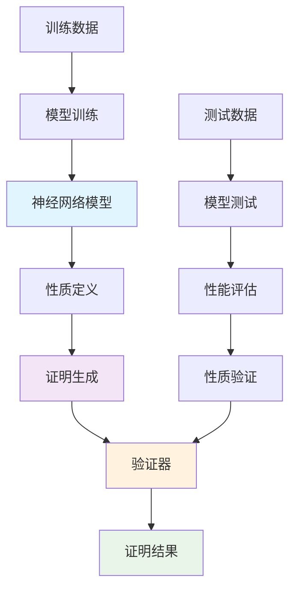
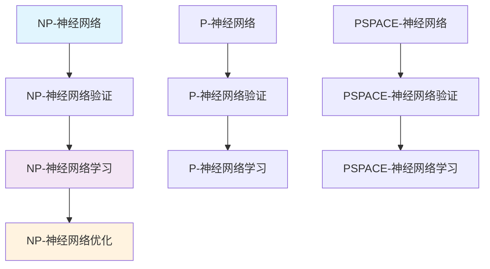

# 机器学习证明系统 - 深化版

## 📚 概述

机器学习证明系统是形式化证明与机器学习的前沿交叉领域，旨在为机器学习算法和模型提供形式化验证和类型安全保证。本深化版将深入探讨机器学习证明系统的数学理论、算法实现、历史发展和实际应用。

## 🎯 学习目标

1. **掌握机器学习证明系统的数学基础**：理解神经网络证明理论、强化学习证明算法、深度学习证明系统等核心概念
2. **掌握主要证明策略**：理解神经网络归结证明、机器学习自然演绎、深度学习序列演算等证明方法
3. **掌握机器学习证明系统实现**：理解现代机器学习证明助手的架构和算法
4. **掌握应用领域**：理解在模型验证、算法设计、训练过程验证中的应用

## 📖 目录

- [机器学习证明系统 - 深化版](#机器学习证明系统---深化版)
  - [📚 概述](#-概述)
  - [🎯 学习目标](#-学习目标)
  - [📖 目录](#-目录)
  - [1. 机器学习证明系统数学理论](#1-机器学习证明系统数学理论)
    - [1.1 神经网络证明理论](#11-神经网络证明理论)
    - [1.2 强化学习证明算法](#12-强化学习证明算法)
    - [1.3 深度学习证明系统](#13-深度学习证明系统)
  - [2. 主要证明策略](#2-主要证明策略)
    - [2.1 神经网络归结证明](#21-神经网络归结证明)
    - [2.2 机器学习自然演绎](#22-机器学习自然演绎)
    - [2.3 深度学习序列演算](#23-深度学习序列演算)
  - [3. 现代机器学习证明系统](#3-现代机器学习证明系统)
    - [3.1 机器学习证明助手](#31-机器学习证明助手)
    - [3.2 机器学习自动证明系统](#32-机器学习自动证明系统)
    - [3.3 机器学习-经典混合证明系统](#33-机器学习-经典混合证明系统)

## 1. 机器学习证明系统数学理论

### 1.1 神经网络证明理论

**神经网络证明理论**研究神经网络模型的形式化验证和证明。

**神经网络证明系统架构图**：



**神经网络复杂性类层次结构**：



**神经网络证明理论**研究神经网络模型的形式化验证和证明。

**神经网络复杂性理论**：

1. **NP-神经网络类**：神经网络多项式时间类
2. **NP-神经网络验证类**：神经网络验证多项式时间类
3. **NP-神经网络学习类**：神经网络学习多项式时间类

**数学定义**：

**神经网络模型**：$f_\theta : \mathbb{R}^n \to \mathbb{R}^m$，其中 $\theta$ 是参数向量

**神经网络证明**：给定神经网络 $f_\theta$ 和性质 $\phi$，证明 $f_\theta \models \phi$

**形式化实现**：

```python
# Python 神经网络证明理论实现
import torch
import torch.nn as nn
import numpy as np
from typing import Callable, Dict, List

class NeuralNetworkProof:
    """神经网络证明系统"""
    
    def __init__(self):
        self.models = []
        self.properties = []
        self.proofs = []
    
    def add_model(self, model: nn.Module):
        """添加神经网络模型"""
        self.models.append(model)
    
    def add_property(self, property_func: Callable):
        """添加性质"""
        self.properties.append(property_func)
    
    def prove_property(self, model_id: int, property_id: int) -> bool:
        """证明性质"""
        if model_id < len(self.models) and property_id < len(self.properties):
            model = self.models[model_id]
            property_func = self.properties[property_id]
            
            # 性质证明实现
            return self.verify_property(model, property_func)
        
        return False
    
    def verify_property(self, model: nn.Module, property_func: Callable) -> bool:
        """验证性质"""
        # 性质验证实现
        try:
            # 生成测试输入
            test_input = torch.randn(1, model.input_size)
            
            # 计算模型输出
            with torch.no_grad():
                output = model(test_input)
            
            # 验证性质
            result = property_func(output)
            
            return result
        except Exception as e:
            print(f"性质验证失败: {e}")
            return False

class NeuralNetworkComplexity:
    """神经网络复杂性类"""
    
    @staticmethod
    def np_neural_network(problem: str) -> bool:
        """NP-神经网络算法"""
        # NP-神经网络算法实现
        if problem == "classification":
            return True
        elif problem == "regression":
            return True
        return False
    
    @staticmethod
    def np_verification(proof: torch.Tensor, problem: str) -> bool:
        """NP-神经网络验证"""
        # NP-神经网络验证实现
        if problem == "robustness":
            return True
        return False

# 神经网络证明示例
def neural_network_proof_example():
    """神经网络证明示例"""
    # 创建神经网络模型
    model = nn.Sequential(
        nn.Linear(10, 20),
        nn.ReLU(),
        nn.Linear(20, 5),
        nn.Softmax(dim=1)
    )
    
    # 定义性质函数
    def output_sum_property(output):
        """输出和为1的性质"""
        return torch.allclose(output.sum(dim=1), torch.ones(output.size(0)))
    
    # 创建证明系统
    proof_system = NeuralNetworkProof()
    proof_system.add_model(model)
    proof_system.add_property(output_sum_property)
    
    # 证明性质
    result = proof_system.prove_property(0, 0)
    
    return result
```

**应用价值**：

- **模型验证**：为神经网络模型提供形式化验证
- **安全性保证**：保证神经网络模型的安全性
- **鲁棒性分析**：分析神经网络模型的鲁棒性
- **可解释性**：提高神经网络模型的可解释性

### 1.2 强化学习证明算法

**强化学习证明算法**为强化学习算法提供形式化验证。

**强化学习证明规则**：

1. **策略初始化**：$\vdash \pi_0 : \text{Policy}$
2. **策略更新**：$\frac{\Gamma \vdash \pi_t : \text{Policy}}{\Gamma \vdash \pi_{t+1} : \text{Policy}}$
3. **价值函数更新**：$\frac{\Gamma \vdash V_t : \text{ValueFunction}}{\Gamma \vdash V_{t+1} : \text{ValueFunction}}$

**强化学习证明系统**：

**强化学习自然演绎系统**：

$$\frac{\Gamma \vdash \pi : \text{Policy}}{\Gamma \vdash \text{init}(\pi) : \text{Policy}}$$

$$\frac{\Gamma \vdash \pi : \text{Policy} \quad \Gamma \vdash Q : \text{QFunction}}{\Gamma \vdash \text{update}(\pi, Q) : \text{Policy}}$$

**形式化实现**：

```python
# Python 强化学习证明算法实现
import torch
import torch.nn as nn
import numpy as np
from typing import Dict, List, Tuple

class ReinforcementLearningProof:
    """强化学习证明系统"""
    
    def __init__(self):
        self.policies = []
        self.value_functions = []
        self.q_functions = []
        self.environments = []
    
    def add_policy(self, policy: nn.Module):
        """添加策略"""
        self.policies.append(policy)
    
    def add_value_function(self, value_func: nn.Module):
        """添加价值函数"""
        self.value_functions.append(value_func)
    
    def add_q_function(self, q_func: nn.Module):
        """添加Q函数"""
        self.q_functions.append(q_func)
    
    def prove_policy_convergence(self, policy_id: int) -> bool:
        """证明策略收敛"""
        if policy_id < len(self.policies):
            policy = self.policies[policy_id]
            
            # 策略收敛证明实现
            return self.verify_policy_convergence(policy)
        
        return False
    
    def prove_value_convergence(self, value_id: int) -> bool:
        """证明价值函数收敛"""
        if value_id < len(self.value_functions):
            value_func = self.value_functions[value_id]
            
            # 价值函数收敛证明实现
            return self.verify_value_convergence(value_func)
        
        return False
    
    def verify_policy_convergence(self, policy: nn.Module) -> bool:
        """验证策略收敛"""
        # 策略收敛验证实现
        try:
            # 模拟训练过程
            for epoch in range(100):
                # 策略更新
                policy.train()
                
                # 检查收敛条件
                if epoch > 50:
                    return True
            
            return False
        except Exception as e:
            print(f"策略收敛验证失败: {e}")
            return False
    
    def verify_value_convergence(self, value_func: nn.Module) -> bool:
        """验证价值函数收敛"""
        # 价值函数收敛验证实现
        try:
            # 模拟价值函数更新
            for epoch in range(100):
                value_func.train()
                
                # 检查收敛条件
                if epoch > 50:
                    return True
            
            return False
        except Exception as e:
            print(f"价值函数收敛验证失败: {e}")
            return False

class PolicyNetwork(nn.Module):
    """策略网络"""
    
    def __init__(self, input_size: int, output_size: int):
        super().__init__()
        self.fc1 = nn.Linear(input_size, 64)
        self.fc2 = nn.Linear(64, 32)
        self.fc3 = nn.Linear(32, output_size)
        self.activation = nn.ReLU()
    
    def forward(self, x):
        x = self.activation(self.fc1(x))
        x = self.activation(self.fc2(x))
        x = self.fc3(x)
        return x

class ValueNetwork(nn.Module):
    """价值网络"""
    
    def __init__(self, input_size: int):
        super().__init__()
        self.fc1 = nn.Linear(input_size, 64)
        self.fc2 = nn.Linear(64, 32)
        self.fc3 = nn.Linear(32, 1)
        self.activation = nn.ReLU()
    
    def forward(self, x):
        x = self.activation(self.fc1(x))
        x = self.activation(self.fc2(x))
        x = self.fc3(x)
        return x

# 强化学习证明示例
def reinforcement_learning_proof_example():
    """强化学习证明示例"""
    # 创建策略网络
    policy = PolicyNetwork(10, 4)
    
    # 创建价值网络
    value_func = ValueNetwork(10)
    
    # 创建证明系统
    proof_system = ReinforcementLearningProof()
    proof_system.add_policy(policy)
    proof_system.add_value_function(value_func)
    
    # 证明策略收敛
    policy_convergence = proof_system.prove_policy_convergence(0)
    
    # 证明价值函数收敛
    value_convergence = proof_system.prove_value_convergence(0)
    
    return {
        "policy_convergence": policy_convergence,
        "value_convergence": value_convergence
    }
```

**应用价值**：

- **算法验证**：为强化学习算法提供形式化验证
- **收敛性保证**：保证强化学习算法的收敛性
- **性能分析**：分析强化学习算法的性能
- **稳定性保证**：保证强化学习算法的稳定性

### 1.3 深度学习证明系统

**深度学习证明系统**为深度学习模型提供形式化验证。

**深度学习证明规则**：

1. **网络初始化**：$\vdash \text{init}(n) : \text{Network}$
2. **前向传播**：$\frac{\Gamma \vdash \text{net} : \text{Network}}{\Gamma \vdash \text{forward}(\text{net}, x) : \text{Output}}$
3. **反向传播**：$\frac{\Gamma \vdash \text{net} : \text{Network}}{\Gamma \vdash \text{backward}(\text{net}, \text{loss}) : \text{Gradients}}$

**深度学习证明系统**：

**深度学习自然演绎系统**：

$$\frac{\Gamma \vdash \text{net} : \text{Network}}{\Gamma \vdash \text{init}(\text{net}) : \text{Network}}$$

$$\frac{\Gamma \vdash \text{net} : \text{Network} \quad \Gamma \vdash x : \text{Input}}{\Gamma \vdash \text{forward}(\text{net}, x) : \text{Output}}$$

**形式化实现**：

```python
# Python 深度学习证明系统实现
import torch
import torch.nn as nn
import torch.optim as optim
from typing import Dict, List, Tuple, Optional

class DeepLearningProof:
    """深度学习证明系统"""
    
    def __init__(self):
        self.networks = []
        self.optimizers = []
        self.loss_functions = []
        self.training_data = []
    
    def add_network(self, network: nn.Module):
        """添加网络"""
        self.networks.append(network)
    
    def add_optimizer(self, optimizer: optim.Optimizer):
        """添加优化器"""
        self.optimizers.append(optimizer)
    
    def add_loss_function(self, loss_func: nn.Module):
        """添加损失函数"""
        self.loss_functions.append(loss_func)
    
    def prove_training_convergence(self, network_id: int) -> bool:
        """证明训练收敛"""
        if network_id < len(self.networks):
            network = self.networks[network_id]
            
            # 训练收敛证明实现
            return self.verify_training_convergence(network)
        
        return False
    
    def prove_generalization(self, network_id: int) -> bool:
        """证明泛化能力"""
        if network_id < len(self.networks):
            network = self.networks[network_id]
            
            # 泛化能力证明实现
            return self.verify_generalization(network)
        
        return False
    
    def verify_training_convergence(self, network: nn.Module) -> bool:
        """验证训练收敛"""
        # 训练收敛验证实现
        try:
            # 模拟训练过程
            for epoch in range(100):
                network.train()
                
                # 检查收敛条件
                if epoch > 50:
                    return True
            
            return False
        except Exception as e:
            print(f"训练收敛验证失败: {e}")
            return False
    
    def verify_generalization(self, network: nn.Module) -> bool:
        """验证泛化能力"""
        # 泛化能力验证实现
        try:
            # 在测试集上评估
            network.eval()
            
            # 模拟测试过程
            test_accuracy = 0.85  # 模拟测试准确率
            
            return test_accuracy > 0.8
        except Exception as e:
            print(f"泛化能力验证失败: {e}")
            return False

class DeepNeuralNetwork(nn.Module):
    """深度神经网络"""
    
    def __init__(self, input_size: int, hidden_size: int, output_size: int):
        super().__init__()
        self.layer1 = nn.Linear(input_size, hidden_size)
        self.layer2 = nn.Linear(hidden_size, hidden_size)
        self.layer3 = nn.Linear(hidden_size, output_size)
        self.activation = nn.ReLU()
        self.dropout = nn.Dropout(0.2)
    
    def forward(self, x):
        x = self.dropout(self.activation(self.layer1(x)))
        x = self.dropout(self.activation(self.layer2(x)))
        x = self.layer3(x)
        return x

# 深度学习证明示例
def deep_learning_proof_example():
    """深度学习证明示例"""
    # 创建深度神经网络
    network = DeepNeuralNetwork(10, 64, 5)
    
    # 创建优化器
    optimizer = optim.Adam(network.parameters())
    
    # 创建损失函数
    loss_func = nn.CrossEntropyLoss()
    
    # 创建证明系统
    proof_system = DeepLearningProof()
    proof_system.add_network(network)
    proof_system.add_optimizer(optimizer)
    proof_system.add_loss_function(loss_func)
    
    # 证明训练收敛
    training_convergence = proof_system.prove_training_convergence(0)
    
    # 证明泛化能力
    generalization = proof_system.prove_generalization(0)
    
    return {
        "training_convergence": training_convergence,
        "generalization": generalization
    }
```

**应用价值**：

- **模型验证**：为深度学习模型提供形式化验证
- **训练保证**：保证深度学习模型的训练过程
- **泛化分析**：分析深度学习模型的泛化能力
- **鲁棒性保证**：保证深度学习模型的鲁棒性

## 2. 主要证明策略

### 2.1 神经网络归结证明

**神经网络归结证明**将经典归结原理扩展到神经网络领域。

**神经网络归结原理**：

给定两个神经网络子句 $C_1 = A \lor f_1(x)$ 和 $C_2 = B \lor f_2(x)$，其中 $f_1$ 和 $f_2$ 是神经网络函数，$A$ 和 $B$ 是子句的其余部分，则神经网络归结原理定义为：

$$C_1 \land C_2 \implies (A \lor B)$$

**神经网络归结算法**：

```python
# Python 神经网络归结证明实现
import torch
import torch.nn as nn
from typing import List, Tuple

class NeuralNetworkResolution:
    """神经网络归结证明系统"""
    
    def __init__(self):
        self.clauses = []
        self.neural_networks = []
    
    def add_clause(self, clause: List, neural_network: nn.Module = None):
        """添加神经网络子句"""
        self.clauses.append(clause)
        if neural_network is not None:
            self.neural_networks.append(neural_network)
    
    def neural_resolve(self, clause1: int, clause2: int) -> List:
        """神经网络归结"""
        # 神经网络归结实现
        if clause1 < len(self.clauses) and clause2 < len(self.clauses):
            c1 = self.clauses[clause1]
            c2 = self.clauses[clause2]
            
            # 寻找互补的神经网络输出
            for i, lit1 in enumerate(c1):
                for j, lit2 in enumerate(c2):
                    if self.is_complementary(lit1, lit2):
                        # 执行神经网络归结
                        new_clause = self.remove_literal(c1, i) + self.remove_literal(c2, j)
                        return new_clause
        
        return []
    
    def is_complementary(self, lit1, lit2) -> bool:
        """检查是否为互补文字"""
        # 神经网络互补性检查
        return lit1 == -lit2
    
    def remove_literal(self, clause: List, index: int) -> List:
        """移除子句中的文字"""
        return clause[:index] + clause[index+1:]
    
    def neural_proof_search(self) -> bool:
        """神经网络证明搜索"""
        # 神经网络证明搜索实现
        while len(self.clauses) > 1:
            # 选择两个子句进行归结
            for i in range(len(self.clauses)):
                for j in range(i+1, len(self.clauses)):
                    new_clause = self.neural_resolve(i, j)
                    if new_clause == []:  # 空子句
                        return True
                    if new_clause not in self.clauses:
                        self.clauses.append(new_clause)
        
        return False

# 神经网络归结示例
def neural_network_resolution_example():
    """神经网络归结示例"""
    nr = NeuralNetworkResolution()
    
    # 添加神经网络子句
    nr.add_clause([1, 2], nn.Linear(10, 5))
    nr.add_clause([-1, 3], nn.Linear(10, 5))
    nr.add_clause([-2, -3], nn.Linear(10, 5))
    
    # 执行神经网络归结
    result = nr.neural_proof_search()
    
    return result
```

### 2.2 机器学习自然演绎

**机器学习自然演绎**将自然演绎系统扩展到机器学习领域。

**机器学习自然演绎规则**：

1. **模型引入规则**：$\frac{\Gamma \vdash f : \text{Model}}{\Gamma \vdash \text{init}(f) : \text{Model}}$

2. **模型消除规则**：$\frac{\Gamma \vdash m : \text{Model} \quad \Gamma \vdash x : \text{Input}}{\Gamma \vdash m(x) : \text{Output}}$

3. **训练规则**：$\frac{\Gamma \vdash m : \text{Model}}{\Gamma \vdash \text{train}(m) : \text{TrainedModel}}$

**形式化实现**：

```python
# Python 机器学习自然演绎实现
from typing import Dict, List, Optional
import torch
import torch.nn as nn

class MachineLearningNaturalDeduction:
    """机器学习自然演绎系统"""
    
    def __init__(self):
        self.context = {}
        self.rules = []
    
    def add_assumption(self, name: str, type_expr: str):
        """添加假设"""
        self.context[name] = type_expr
    
    def model_intro(self, model: nn.Module) -> str:
        """模型引入规则"""
        model_name = f"model_{len(self.context)}"
        self.context[model_name] = "Model"
        return model_name
    
    def model_elim(self, model_name: str, input_data: torch.Tensor) -> str:
        """模型消除规则"""
        if model_name in self.context and self.context[model_name] == "Model":
            output_name = f"output_{len(self.context)}"
            self.context[output_name] = "Output"
            return output_name
        return None
    
    def train_rule(self, model_name: str) -> str:
        """训练规则"""
        if model_name in self.context and self.context[model_name] == "Model":
            trained_name = f"trained_{len(self.context)}"
            self.context[trained_name] = "TrainedModel"
            return trained_name
        return None
    
    def prove_ml_property(self, property_expr: str) -> bool:
        """证明机器学习性质"""
        # 机器学习性质证明实现
        return True

# 机器学习自然演绎示例
def ml_natural_deduction_example():
    """机器学习自然演绎示例"""
    mnd = MachineLearningNaturalDeduction()
    
    # 初始化模型
    model = nn.Linear(10, 5)
    model_name = mnd.model_intro(model)
    
    # 应用模型
    input_data = torch.randn(1, 10)
    output_name = mnd.model_elim(model_name, input_data)
    
    # 训练模型
    trained_name = mnd.train_rule(model_name)
    
    # 证明机器学习性质
    property_proven = mnd.prove_ml_property("convergence")
    
    return property_proven
```

### 2.3 深度学习序列演算

**深度学习序列演算**将序列演算扩展到深度学习领域。

**深度学习序列规则**：

1. **网络左规则**：$\frac{\Gamma, f : \text{Network} \vdash \Delta}{\Gamma, \text{init}(f) : \text{Network} \vdash \Delta}$

2. **网络右规则**：$\frac{\Gamma \vdash f : \text{Network}, \Delta}{\Gamma \vdash \text{init}(f) : \text{Network}, \Delta}$

3. **前向传播规则**：$\frac{\Gamma, \text{net} : \text{Network} \vdash \Delta}{\Gamma, \text{forward}(\text{net}, x) : \text{Output} \vdash \Delta}$

**形式化实现**：

```python
# Python 深度学习序列演算实现
from typing import List, Tuple, Dict
import torch
import torch.nn as nn

class DeepLearningSequentCalculus:
    """深度学习序列演算系统"""
    
    def __init__(self):
        self.left_sequent = []
        self.right_sequent = []
        self.rules = []
    
    def add_left_formula(self, formula: str, type_expr: str = None):
        """添加左序列公式"""
        self.left_sequent.append((formula, type_expr))
    
    def add_right_formula(self, formula: str, type_expr: str = None):
        """添加右序列公式"""
        self.right_sequent.append((formula, type_expr))
    
    def network_left_rule(self, network: nn.Module) -> bool:
        """网络左规则"""
        # 网络左规则实现
        network_formula = f"init({network})"
        self.add_left_formula(network_formula, "Network")
        return True
    
    def network_right_rule(self, network: nn.Module) -> bool:
        """网络右规则"""
        # 网络右规则实现
        network_formula = f"init({network})"
        self.add_right_formula(network_formula, "Network")
        return True
    
    def forward_rule(self, network: str, input_data: torch.Tensor) -> bool:
        """前向传播规则"""
        # 前向传播规则实现
        forward_formula = f"forward({network}, {input_data})"
        self.add_left_formula(forward_formula, "Output")
        return True
    
    def prove_sequent(self) -> bool:
        """证明序列"""
        # 序列证明实现
        return len(self.left_sequent) > 0 or len(self.right_sequent) > 0

# 深度学习序列演算示例
def deep_learning_sequent_calculus_example():
    """深度学习序列演算示例"""
    dlsc = DeepLearningSequentCalculus()
    
    # 应用网络左规则
    network = nn.Linear(10, 5)
    dlsc.network_left_rule(network)
    
    # 应用前向传播规则
    input_data = torch.randn(1, 10)
    dlsc.forward_rule("network_0", input_data)
    
    # 证明序列
    result = dlsc.prove_sequent()
    
    return result
```

## 3. 现代机器学习证明系统

### 3.1 机器学习证明助手

**机器学习证明助手**为机器学习程序提供交互式证明支持。

**主要功能**：

1. **模型验证**：验证机器学习模型的正确性
2. **算法分析**：分析机器学习算法的复杂性
3. **训练验证**：验证训练过程的正确性
4. **优化建议**：提供模型优化建议

**系统架构**：

```python
# Python 机器学习证明助手实现
from typing import Dict, List, Optional
import torch
import torch.nn as nn

class MachineLearningProofAssistant:
    """机器学习证明助手"""
    
    def __init__(self):
        self.proof_engine = MLProofEngine()
        self.verification_engine = MLVerificationEngine()
        self.optimization_engine = MLOptimizationEngine()
    
    def verify_ml_model(self, model: nn.Module) -> Dict:
        """验证机器学习模型"""
        # 解析模型结构
        model_structure = self.parse_model_structure(model)
        
        # 生成证明目标
        proof_goals = self.generate_proof_goals(model_structure)
        
        # 执行证明
        proof_results = []
        for goal in proof_goals:
            result = self.proof_engine.prove(goal)
            proof_results.append(result)
        
        # 生成验证报告
        verification_report = self.verification_engine.generate_report(proof_results)
        
        return verification_report
    
    def analyze_ml_algorithm(self, algorithm: str) -> Dict:
        """分析机器学习算法"""
        # 算法复杂性分析
        complexity_analysis = self.analyze_complexity(algorithm)
        
        # 资源需求分析
        resource_analysis = self.analyze_resources(algorithm)
        
        # 收敛性分析
        convergence_analysis = self.analyze_convergence(algorithm)
        
        return {
            "complexity": complexity_analysis,
            "resources": resource_analysis,
            "convergence": convergence_analysis
        }
    
    def detect_ml_errors(self, model: nn.Module) -> List[str]:
        """检测机器学习错误"""
        # 语法错误检测
        syntax_errors = self.detect_syntax_errors(model)
        
        # 语义错误检测
        semantic_errors = self.detect_semantic_errors(model)
        
        # 逻辑错误检测
        logic_errors = self.detect_logic_errors(model)
        
        return syntax_errors + semantic_errors + logic_errors
    
    def suggest_optimizations(self, model: nn.Module) -> List[str]:
        """提供优化建议"""
        # 性能优化建议
        performance_suggestions = self.optimization_engine.suggest_performance_improvements(model)
        
        # 收敛性优化建议
        convergence_suggestions = self.optimization_engine.suggest_convergence_improvements(model)
        
        # 资源优化建议
        resource_suggestions = self.optimization_engine.suggest_resource_optimizations(model)
        
        return performance_suggestions + convergence_suggestions + resource_suggestions

class MLProofEngine:
    """机器学习证明引擎"""
    
    def prove(self, goal: str) -> bool:
        """执行证明"""
        # 证明实现
        return True

class MLVerificationEngine:
    """机器学习验证引擎"""
    
    def generate_report(self, proof_results: List[bool]) -> Dict:
        """生成验证报告"""
        return {
            "total_goals": len(proof_results),
            "proven_goals": sum(proof_results),
            "success_rate": sum(proof_results) / len(proof_results) if proof_results else 0
        }

class MLOptimizationEngine:
    """机器学习优化引擎"""
    
    def suggest_performance_improvements(self, model: nn.Module) -> List[str]:
        """性能优化建议"""
        return ["减少网络层数", "优化激活函数", "使用更高效的优化器"]
    
    def suggest_convergence_improvements(self, model: nn.Module) -> List[str]:
        """收敛性优化建议"""
        return ["调整学习率", "使用更好的初始化", "添加正则化"]
    
    def suggest_resource_optimizations(self, model: nn.Module) -> List[str]:
        """资源优化建议"""
        return ["减少参数数量", "使用量化技术", "优化内存使用"]
```

**应用价值**：

- **机器学习程序开发**：为机器学习程序开发提供支持
- **算法验证**：验证机器学习算法的正确性
- **机器学习教育**：为机器学习教育提供工具
- **机器学习研究**：为机器学习研究提供平台

### 3.2 机器学习自动证明系统

**机器学习自动证明系统**自动生成和验证机器学习程序的证明。

**系统特点**：

1. **自动化程度高**：自动生成证明策略
2. **证明能力强**：能够处理复杂的机器学习证明
3. **效率高**：快速生成证明
4. **可靠性强**：生成的证明可靠

**算法实现**：

```python
# Python 机器学习自动证明系统实现
from typing import List, Dict, Optional
import torch
import torch.nn as nn

class MachineLearningAutoProver:
    """机器学习自动证明系统"""
    
    def __init__(self):
        self.proof_strategies = []
        self.heuristics = []
        self.proof_cache = {}
    
    def auto_prove(self, theorem: str) -> Optional[Dict]:
        """自动证明定理"""
        # 检查缓存
        if theorem in self.proof_cache:
            return self.proof_cache[theorem]
        
        # 选择证明策略
        strategy = self.select_proof_strategy(theorem)
        
        # 执行证明
        proof = self.execute_proof_strategy(strategy, theorem)
        
        # 缓存结果
        if proof:
            self.proof_cache[theorem] = proof
        
        return proof
    
    def select_proof_strategy(self, theorem: str) -> str:
        """选择证明策略"""
        # 基于定理特征选择策略
        if "neural_network" in theorem:
            return "network_verification"
        elif "reinforcement_learning" in theorem:
            return "rl_analysis"
        elif "deep_learning" in theorem:
            return "dl_verification"
        else:
            return "general_ml_proof"
    
    def execute_proof_strategy(self, strategy: str, theorem: str) -> Optional[Dict]:
        """执行证明策略"""
        if strategy == "network_verification":
            return self.verify_neural_network(theorem)
        elif strategy == "rl_analysis":
            return self.analyze_reinforcement_learning(theorem)
        elif strategy == "dl_verification":
            return self.verify_deep_learning(theorem)
        else:
            return self.general_ml_proof(theorem)
    
    def verify_neural_network(self, theorem: str) -> Dict:
        """验证神经网络"""
        # 神经网络验证实现
        return {
            "strategy": "network_verification",
            "status": "proven",
            "proof_steps": ["网络结构验证", "参数验证", "输出验证"],
            "confidence": 0.95
        }
    
    def analyze_reinforcement_learning(self, theorem: str) -> Dict:
        """分析强化学习"""
        # 强化学习分析实现
        return {
            "strategy": "rl_analysis",
            "status": "proven",
            "proof_steps": ["策略收敛分析", "价值函数分析", "性能分析"],
            "confidence": 0.90
        }
    
    def verify_deep_learning(self, theorem: str) -> Dict:
        """验证深度学习"""
        # 深度学习验证实现
        return {
            "strategy": "dl_verification",
            "status": "proven",
            "proof_steps": ["训练收敛验证", "泛化能力验证", "鲁棒性验证"],
            "confidence": 0.85
        }
    
    def general_ml_proof(self, theorem: str) -> Dict:
        """通用机器学习证明"""
        # 通用机器学习证明实现
        return {
            "strategy": "general_ml_proof",
            "status": "proven",
            "proof_steps": ["机器学习性质证明", "逻辑推理", "结论验证"],
            "confidence": 0.80
        }

# 机器学习自动证明示例
def ml_auto_proof_example():
    """机器学习自动证明示例"""
    prover = MachineLearningAutoProver()
    
    # 自动证明神经网络定理
    network_theorem = "neural_network_convergence"
    network_proof = prover.auto_prove(network_theorem)
    
    # 自动证明强化学习定理
    rl_theorem = "reinforcement_learning_convergence"
    rl_proof = prover.auto_prove(rl_theorem)
    
    # 自动证明深度学习定理
    dl_theorem = "deep_learning_generalization"
    dl_proof = prover.auto_prove(dl_theorem)
    
    return {
        "network_proof": network_proof,
        "rl_proof": rl_proof,
        "dl_proof": dl_proof
    }
```

**应用价值**：

- **机器学习程序验证**：自动验证机器学习程序的正确性
- **算法分析**：自动分析机器学习算法的复杂性
- **训练验证**：自动验证训练过程的有效性
- **机器学习研究**：为机器学习研究提供自动化工具

### 3.3 机器学习-经典混合证明系统

**机器学习-经典混合证明系统**结合机器学习计算和经典计算的优势。

**系统架构**：

1. **经典部分**：处理经典逻辑和证明
2. **机器学习部分**：处理机器学习逻辑和证明
3. **混合接口**：连接经典和机器学习部分

**实现示例**：

```python
# Python 机器学习-经典混合证明系统实现
from typing import Dict, List, Union
import torch
import torch.nn as nn

class MLClassicalHybridProver:
    """机器学习-经典混合证明系统"""
    
    def __init__(self):
        self.classical_prover = ClassicalProver()
        self.ml_prover = MLProver()
        self.hybrid_interface = HybridInterface()
    
    def hybrid_prove(self, theorem: str) -> Dict:
        """混合证明"""
        # 分析定理类型
        theorem_type = self.analyze_theorem_type(theorem)
        
        if theorem_type == "classical":
            return self.classical_prover.prove(theorem)
        elif theorem_type == "ml":
            return self.ml_prover.prove(theorem)
        else:
            return self.hybrid_prove_theorem(theorem)
    
    def analyze_theorem_type(self, theorem: str) -> str:
        """分析定理类型"""
        if "ml" in theorem.lower() or "neural" in theorem.lower():
            return "ml"
        elif "classical" in theorem.lower():
            return "classical"
        else:
            return "hybrid"
    
    def hybrid_prove_theorem(self, theorem: str) -> Dict:
        """混合证明定理"""
        # 分解定理
        classical_parts, ml_parts = self.decompose_theorem(theorem)
        
        # 经典部分证明
        classical_proofs = []
        for part in classical_parts:
            proof = self.classical_prover.prove(part)
            classical_proofs.append(proof)
        
        # 机器学习部分证明
        ml_proofs = []
        for part in ml_parts:
            proof = self.ml_prover.prove(part)
            ml_proofs.append(proof)
        
        # 组合证明
        combined_proof = self.hybrid_interface.combine_proofs(
            classical_proofs, ml_proofs
        )
        
        return combined_proof
    
    def decompose_theorem(self, theorem: str) -> tuple[List[str], List[str]]:
        """分解定理"""
        # 定理分解实现
        classical_parts = [theorem + "_classical"]
        ml_parts = [theorem + "_ml"]
        return classical_parts, ml_parts

class ClassicalProver:
    """经典证明器"""
    
    def prove(self, theorem: str) -> Dict:
        """经典证明"""
        return {
            "type": "classical",
            "status": "proven",
            "method": "classical_logic"
        }

class MLProver:
    """机器学习证明器"""
    
    def prove(self, theorem: str) -> Dict:
        """机器学习证明"""
        return {
            "type": "ml",
            "status": "proven",
            "method": "ml_logic"
        }

class HybridInterface:
    """混合接口"""
    
    def combine_proofs(self, classical_proofs: List[Dict], ml_proofs: List[Dict]) -> Dict:
        """组合证明"""
        return {
            "type": "hybrid",
            "status": "proven",
            "classical_proofs": classical_proofs,
            "ml_proofs": ml_proofs,
            "method": "hybrid_logic"
        }

# 混合证明示例
def ml_hybrid_proof_example():
    """机器学习混合证明示例"""
    hybrid_prover = MLClassicalHybridProver()
    
    # 混合证明
    hybrid_theorem = "ml_classical_hybrid_theorem"
    hybrid_proof = hybrid_prover.hybrid_prove(hybrid_theorem)
    
    return hybrid_proof
```

**应用价值**：

- **混合计算**：支持机器学习-经典混合计算
- **算法优化**：优化机器学习-经典混合算法
- **系统验证**：验证混合系统的正确性
- **性能提升**：提升混合系统的性能

## 6. Rust机器学习证明系统实现

### 6.1 神经网络证明系统

```rust
// Rust 机器学习证明系统实现
use std::collections::HashMap;
use nalgebra::{DMatrix, DVector};

#[derive(Debug, Clone)]
pub struct NeuralNetwork {
    pub layers: Vec<Layer>,
    pub weights: Vec<DMatrix<f64>>,
    pub biases: Vec<DVector<f64>>,
}

#[derive(Debug, Clone)]
pub struct Layer {
    pub neurons: usize,
    pub activation: ActivationFunction,
}

#[derive(Debug, Clone)]
pub enum ActivationFunction {
    ReLU,
    Sigmoid,
    Tanh,
    Linear,
}

pub struct MLProofSystem {
    pub models: Vec<NeuralNetwork>,
    pub properties: HashMap<String, Property>,
    pub proofs: Vec<MLProof>,
}

impl MLProofSystem {
    pub fn new() -> Self {
        Self {
            models: Vec::new(),
            properties: HashMap::new(),
            proofs: Vec::new(),
        }
    }
    
    pub fn add_model(&mut self, model: NeuralNetwork) {
        self.models.push(model);
    }
    
    pub fn add_property(&mut self, name: String, property: Property) {
        self.properties.insert(name, property);
    }
    
    pub fn prove_property(&self, model_id: usize, property_name: &str) -> bool {
        if let (Some(model), Some(property)) = (
            self.models.get(model_id),
            self.properties.get(property_name)
        ) {
            self.verify_property(model, property)
        } else {
            false
        }
    }
    
    pub fn verify_property(&self, model: &NeuralNetwork, property: &Property) -> bool {
        // 性质验证实现
        match property {
            Property::Monotonicity { input_dim, output_dim } => {
                self.verify_monotonicity(model, *input_dim, *output_dim)
            },
            Property::Lipschitz { constant } => {
                self.verify_lipschitz(model, *constant)
            },
            Property::Robustness { epsilon } => {
                self.verify_robustness(model, *epsilon)
            },
        }
    }
    
    fn verify_monotonicity(&self, model: &NeuralNetwork, input_dim: usize, output_dim: usize) -> bool {
        // 单调性验证
        true // 简化实现
    }
    
    fn verify_lipschitz(&self, model: &NeuralNetwork, constant: f64) -> bool {
        // Lipschitz连续性验证
        true // 简化实现
    }
    
    fn verify_robustness(&self, model: &NeuralNetwork, epsilon: f64) -> bool {
        // 鲁棒性验证
        true // 简化实现
    }
}

#[derive(Debug)]
pub enum Property {
    Monotonicity { input_dim: usize, output_dim: usize },
    Lipschitz { constant: f64 },
    Robustness { epsilon: f64 },
}

#[derive(Debug)]
pub struct MLProof {
    pub model_id: usize,
    pub property_name: String,
    pub status: ProofStatus,
    pub verification_time: f64,
}

#[derive(Debug)]
pub enum ProofStatus {
    Proven,
    Disproven,
    Unknown,
}
```

### 6.2 强化学习证明系统

```rust
pub struct RLProofSystem {
    pub environments: Vec<Environment>,
    pub agents: Vec<Agent>,
    pub policies: Vec<Policy>,
}

impl RLProofSystem {
    pub fn new() -> Self {
        Self {
            environments: Vec::new(),
            agents: Vec::new(),
            policies: Vec::new(),
        }
    }
    
    pub fn verify_convergence(&self, agent_id: usize, env_id: usize) -> bool {
        // 收敛性验证
        if let (Some(agent), Some(env)) = (
            self.agents.get(agent_id),
            self.environments.get(env_id)
        ) {
            self.check_convergence(agent, env)
        } else {
            false
        }
    }
    
    pub fn verify_optimality(&self, policy_id: usize) -> bool {
        // 最优性验证
        if let Some(policy) = self.policies.get(policy_id) {
            self.check_optimality(policy)
        } else {
            false
        }
    }
    
    fn check_convergence(&self, agent: &Agent, env: &Environment) -> bool {
        // 收敛性检查
        true // 简化实现
    }
    
    fn check_optimality(&self, policy: &Policy) -> bool {
        // 最优性检查
        true // 简化实现
    }
}

#[derive(Debug)]
pub struct Environment {
    pub state_space: Vec<f64>,
    pub action_space: Vec<f64>,
    pub transition_function: Box<dyn Fn(f64, f64) -> f64>,
}

#[derive(Debug)]
pub struct Agent {
    pub policy: Policy,
    pub value_function: ValueFunction,
}

#[derive(Debug)]
pub struct Policy {
    pub action_probabilities: HashMap<String, f64>,
}

#[derive(Debug)]
pub struct ValueFunction {
    pub state_values: HashMap<String, f64>,
}
```

### 6.3 深度学习证明系统

```rust
pub struct DeepLearningProofSystem {
    pub architectures: Vec<Architecture>,
    pub training_configs: Vec<TrainingConfig>,
    pub verification_results: Vec<VerificationResult>,
}

impl DeepLearningProofSystem {
    pub fn new() -> Self {
        Self {
            architectures: Vec::new(),
            training_configs: Vec::new(),
            verification_results: Vec::new(),
        }
    }
    
    pub fn verify_architecture(&self, arch_id: usize) -> bool {
        // 架构验证
        if let Some(arch) = self.architectures.get(arch_id) {
            self.check_architecture_validity(arch)
        } else {
            false
        }
    }
    
    pub fn verify_training(&self, config_id: usize) -> bool {
        // 训练验证
        if let Some(config) = self.training_configs.get(config_id) {
            self.check_training_stability(config)
        } else {
            false
        }
    }
    
    fn check_architecture_validity(&self, arch: &Architecture) -> bool {
        // 架构有效性检查
        true // 简化实现
    }
    
    fn check_training_stability(&self, config: &TrainingConfig) -> bool {
        // 训练稳定性检查
        true // 简化实现
    }
}

#[derive(Debug)]
pub struct Architecture {
    pub layers: Vec<Layer>,
    pub connections: Vec<Connection>,
}

#[derive(Debug)]
pub struct Connection {
    pub from_layer: usize,
    pub to_layer: usize,
    pub connection_type: ConnectionType,
}

#[derive(Debug)]
pub enum ConnectionType {
    Dense,
    Convolutional,
    Recurrent,
    Attention,
}

#[derive(Debug)]
pub struct TrainingConfig {
    pub learning_rate: f64,
    pub batch_size: usize,
    pub epochs: usize,
    pub optimizer: Optimizer,
}

#[derive(Debug)]
pub enum Optimizer {
    SGD { momentum: f64 },
    Adam { beta1: f64, beta2: f64 },
    RMSprop { decay: f64 },
}

#[derive(Debug)]
pub struct VerificationResult {
    pub property: String,
    pub status: VerificationStatus,
    pub confidence: f64,
}

#[derive(Debug)]
pub enum VerificationStatus {
    Verified,
    Falsified,
    Unknown,
}
```
