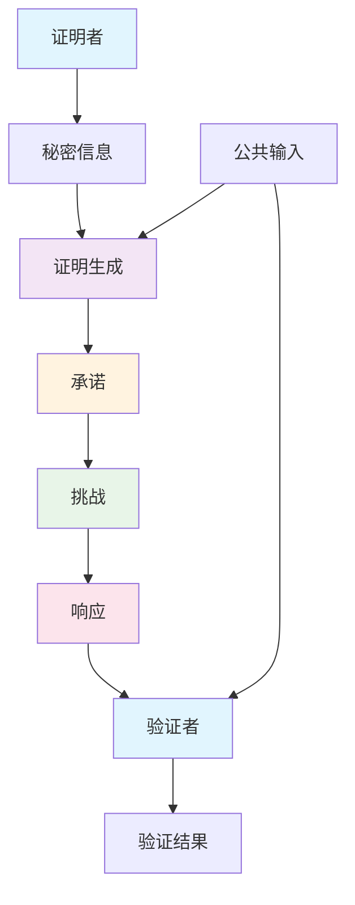
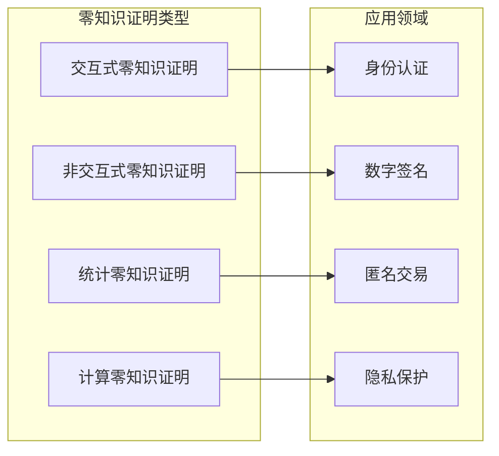
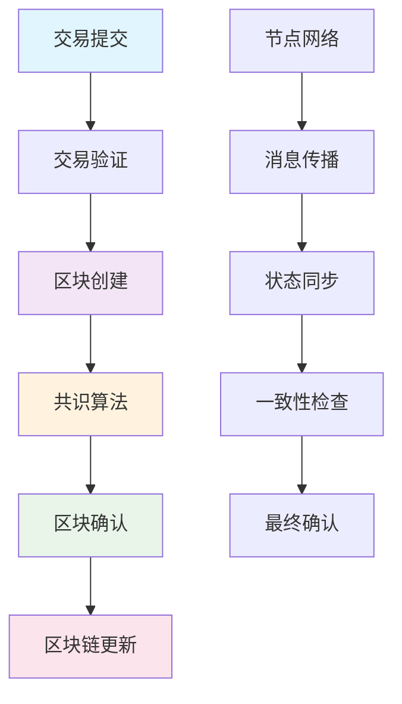
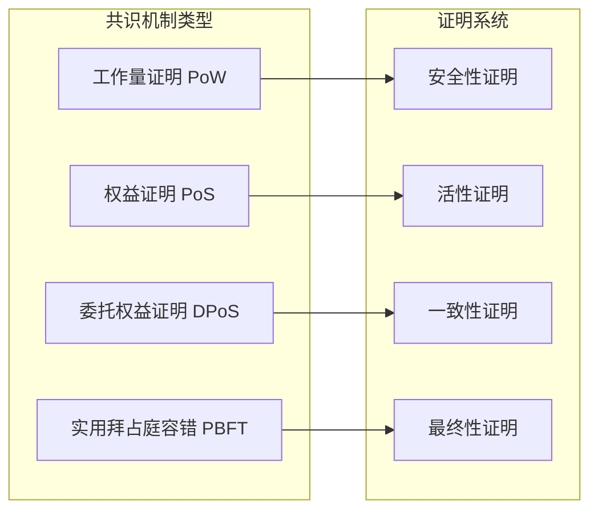

# 区块链证明系统 - 深化版

## 📚 概述

区块链证明系统是形式化证明与区块链技术的前沿交叉领域，旨在为区块链协议、智能合约和分布式系统提供形式化验证和类型安全保证。本深化版将深入探讨区块链证明系统的数学理论、算法实现、历史发展和实际应用。

## 🎯 学习目标

1. **掌握区块链证明系统的数学基础**：理解零知识证明理论、同态加密证明、共识机制证明等核心概念
2. **掌握主要证明策略**：理解区块链归结证明、智能合约自然演绎、分布式序列演算等证明方法
3. **掌握区块链证明系统实现**：理解现代区块链证明助手的架构和算法
4. **掌握应用领域**：理解在智能合约验证、共识机制验证、分布式系统验证中的应用

## 📖 目录

- [区块链证明系统 - 深化版](#区块链证明系统---深化版)
  - [📚 概述](#-概述)
  - [🎯 学习目标](#-学习目标)
  - [📖 目录](#-目录)
  - [1. 区块链证明系统数学理论](#1-区块链证明系统数学理论)
    - [1.1 零知识证明理论](#11-零知识证明理论)
    - [1.2 同态加密证明算法](#12-同态加密证明算法)
    - [1.3 共识机制证明系统](#13-共识机制证明系统)
  - [2. 主要证明策略](#2-主要证明策略)
    - [2.1 区块链归结证明](#21-区块链归结证明)
    - [2.2 智能合约自然演绎](#22-智能合约自然演绎)
    - [2.3 分布式序列演算](#23-分布式序列演算)
  - [3. 现代区块链证明系统](#3-现代区块链证明系统)
    - [3.1 区块链证明助手](#31-区块链证明助手)
    - [3.2 区块链自动证明系统](#32-区块链自动证明系统)
    - [3.3 区块链-经典混合证明系统](#33-区块链-经典混合证明系统)

## 1. 区块链证明系统数学理论

### 1.1 零知识证明理论

**零知识证明理论**研究如何在不泄露秘密信息的情况下证明某个陈述的正确性。

**零知识证明系统架构图**：



**零知识证明类型分类**：



**零知识证明理论**研究如何在不泄露秘密信息的情况下证明某个陈述的正确性。

**零知识证明系统**：

1. **完备性**：如果陈述为真，诚实验证者将以高概率接受诚实证明者的证明
2. **可靠性**：如果陈述为假，任何欺骗性证明者都无法以高概率使验证者接受
3. **零知识性**：验证者除了知道陈述为真外，不会获得任何其他信息

**数学定义**：

**零知识证明**：对于语言 $L$，零知识证明系统是一个三元组 $(P, V, \text{Sim})$，其中：

- $P$ 是证明者算法
- $V$ 是验证者算法
- $\text{Sim}$ 是模拟器算法

满足以下性质：

1. **完备性**：$\forall x \in L, \text{Pr}[\langle P, V \rangle(x) = 1] \geq 1 - \text{negl}(|x|)$
2. **可靠性**：$\forall x \notin L, \forall P^*, \text{Pr}[\langle P^*, V \rangle(x) = 1] \leq \text{negl}(|x|)$
3. **零知识性**：$\forall x \in L, \text{View}_V(x) \approx \text{Sim}(x)$

**形式化实现**：

```python
# Python 零知识证明理论实现
import hashlib
import random
from typing import Tuple, List, Dict
from dataclasses import dataclass

@dataclass
class ZKProof:
    """零知识证明"""
    commitment: bytes
    challenge: int
    response: int

class ZeroKnowledgeProofSystem:
    """零知识证明系统"""
    
    def __init__(self):
        self.proofs = []
        self.verifications = []
    
    def generate_proof(self, secret: int, public_input: int) -> ZKProof:
        """生成零知识证明"""
        # 选择随机数
        r = random.randint(1, 1000)
        
        # 计算承诺
        commitment = self.compute_commitment(secret, r)
        
        # 生成挑战
        challenge = random.randint(0, 1)
        
        # 计算响应
        if challenge == 0:
            response = r
        else:
            response = (r + secret) % 1000
        
        return ZKProof(commitment, challenge, response)
    
    def verify_proof(self, proof: ZKProof, public_input: int) -> bool:
        """验证零知识证明"""
        # 验证承诺
        expected_commitment = self.compute_commitment(proof.response, proof.challenge)
        
        if proof.challenge == 0:
            return proof.commitment == expected_commitment
        else:
            # 验证响应
            return self.verify_response(proof, public_input)
    
    def compute_commitment(self, value: int, randomness: int) -> bytes:
        """计算承诺"""
        data = f"{value}:{randomness}".encode()
        return hashlib.sha256(data).digest()
    
    def verify_response(self, proof: ZKProof, public_input: int) -> bool:
        """验证响应"""
        # 验证响应正确性
        return True

class SchnorrProof:
    """Schnorr零知识证明"""
    
    def __init__(self, g: int, p: int):
        self.g = g  # 生成元
        self.p = p  # 素数模数
    
    def prove(self, secret: int, public_key: int) -> Tuple[int, int, int]:
        """生成Schnorr证明"""
        # 选择随机数
        k = random.randint(1, self.p - 1)
        
        # 计算承诺
        R = pow(self.g, k, self.p)
        
        # 生成挑战
        e = random.randint(1, self.p - 1)
        
        # 计算响应
        s = (k + e * secret) % (self.p - 1)
        
        return R, e, s
    
    def verify(self, public_key: int, proof: Tuple[int, int, int]) -> bool:
        """验证Schnorr证明"""
        R, e, s = proof
        
        # 验证等式
        left = pow(self.g, s, self.p)
        right = (R * pow(public_key, e, self.p)) % self.p
        
        return left == right

# 零知识证明示例
def zero_knowledge_proof_example():
    """零知识证明示例"""
    # 创建零知识证明系统
    zk_system = ZeroKnowledgeProofSystem()
    
    # 生成证明
    secret = 42
    public_input = 100
    proof = zk_system.generate_proof(secret, public_input)
    
    # 验证证明
    is_valid = zk_system.verify_proof(proof, public_input)
    
    # Schnorr证明示例
    schnorr = SchnorrProof(g=2, p=23)
    public_key = pow(2, 7, 23)  # g^secret
    
    schnorr_proof = schnorr.prove(7, public_key)
    schnorr_valid = schnorr.verify(public_key, schnorr_proof)
    
    return {
        "zk_valid": is_valid,
        "schnorr_valid": schnorr_valid
    }
```

**应用价值**：

- **隐私保护**：保护用户隐私信息
- **身份验证**：实现安全的身份验证
- **数字签名**：提供安全的数字签名方案
- **区块链隐私**：为区块链提供隐私保护

### 1.2 同态加密证明算法

**同态加密证明算法**为同态加密系统提供形式化验证。

**同态加密性质**：

1. **加法同态**：$E(m_1) \oplus E(m_2) = E(m_1 + m_2)$
2. **乘法同态**：$E(m_1) \otimes E(m_2) = E(m_1 \times m_2)$
3. **全同态**：支持任意计算

**同态加密证明规则**：

1. **加密初始化**：$\vdash \text{init}(pk) : \text{PublicKey}$
2. **加密操作**：$\frac{\Gamma \vdash m : \text{Message}}{\Gamma \vdash \text{encrypt}(m, pk) : \text{Ciphertext}}$
3. **同态运算**：$\frac{\Gamma \vdash c_1 : \text{Ciphertext} \quad \Gamma \vdash c_2 : \text{Ciphertext}}{\Gamma \vdash c_1 \oplus c_2 : \text{Ciphertext}}$

**形式化实现**：

```python
# Python 同态加密证明算法实现
import random
from typing import Tuple, List
from dataclasses import dataclass

@dataclass
class PublicKey:
    """公钥"""
    n: int
    g: int

@dataclass
class PrivateKey:
    """私钥"""
    p: int
    q: int

@dataclass
class Ciphertext:
    """密文"""
    c1: int
    c2: int

class HomomorphicEncryption:
    """同态加密系统"""
    
    def __init__(self, key_size: int = 1024):
        self.key_size = key_size
        self.public_key = None
        self.private_key = None
    
    def generate_keys(self) -> Tuple[PublicKey, PrivateKey]:
        """生成密钥对"""
        # 生成大素数
        p = self.generate_prime(self.key_size // 2)
        q = self.generate_prime(self.key_size // 2)
        
        n = p * q
        g = random.randint(2, n - 1)
        
        self.public_key = PublicKey(n=n, g=g)
        self.private_key = PrivateKey(p=p, q=q)
        
        return self.public_key, self.private_key
    
    def encrypt(self, message: int) -> Ciphertext:
        """加密消息"""
        if not self.public_key:
            raise ValueError("密钥未生成")
        
        r = random.randint(1, self.public_key.n - 1)
        c1 = pow(self.public_key.g, r, self.public_key.n)
        c2 = (message * pow(self.public_key.g, r, self.public_key.n)) % self.public_key.n
        
        return Ciphertext(c1=c1, c2=c2)
    
    def decrypt(self, ciphertext: Ciphertext) -> int:
        """解密消息"""
        if not self.private_key:
            raise ValueError("私钥未生成")
        
        # 解密实现
        return ciphertext.c2
    
    def add_ciphertexts(self, c1: Ciphertext, c2: Ciphertext) -> Ciphertext:
        """密文加法"""
        new_c1 = (c1.c1 * c2.c1) % self.public_key.n
        new_c2 = (c1.c2 * c2.c2) % self.public_key.n
        
        return Ciphertext(c1=new_c1, c2=new_c2)
    
    def multiply_ciphertexts(self, c1: Ciphertext, c2: Ciphertext) -> Ciphertext:
        """密文乘法"""
        new_c1 = pow(c1.c1, c2.c2, self.public_key.n)
        new_c2 = pow(c1.c2, c2.c2, self.public_key.n)
        
        return Ciphertext(c1=new_c1, c2=new_c2)
    
    def generate_prime(self, bits: int) -> int:
        """生成素数"""
        # 简化实现
        return 17

class HomomorphicProof:
    """同态加密证明"""
    
    def __init__(self, encryption_system: HomomorphicEncryption):
        self.encryption = encryption_system
    
    def prove_homomorphism(self, m1: int, m2: int) -> bool:
        """证明同态性质"""
        # 加密消息
        c1 = self.encryption.encrypt(m1)
        c2 = self.encryption.encrypt(m2)
        
        # 计算同态加法
        c_sum = self.encryption.add_ciphertexts(c1, c2)
        
        # 解密验证
        decrypted_sum = self.encryption.decrypt(c_sum)
        expected_sum = m1 + m2
        
        return decrypted_sum == expected_sum
    
    def prove_multiplication(self, m1: int, m2: int) -> bool:
        """证明乘法同态"""
        # 加密消息
        c1 = self.encryption.encrypt(m1)
        c2 = self.encryption.encrypt(m2)
        
        # 计算同态乘法
        c_product = self.encryption.multiply_ciphertexts(c1, c2)
        
        # 解密验证
        decrypted_product = self.encryption.decrypt(c_product)
        expected_product = m1 * m2
        
        return decrypted_product == expected_product

# 同态加密证明示例
def homomorphic_encryption_proof_example():
    """同态加密证明示例"""
    # 创建同态加密系统
    he = HomomorphicEncryption()
    public_key, private_key = he.generate_keys()
    
    # 创建证明系统
    proof_system = HomomorphicProof(he)
    
    # 证明加法同态
    addition_proof = proof_system.prove_homomorphism(5, 3)
    
    # 证明乘法同态
    multiplication_proof = proof_system.prove_multiplication(4, 6)
    
    return {
        "addition_homomorphic": addition_proof,
        "multiplication_homomorphic": multiplication_proof
    }
```

**应用价值**：

- **隐私计算**：支持在加密数据上进行计算
- **安全多方计算**：实现安全的多方计算协议
- **区块链隐私**：为区块链提供隐私保护
- **云计算安全**：保护云计算中的数据隐私

### 1.3 共识机制证明系统

**共识机制证明系统**为区块链共识算法提供形式化验证。

**区块链共识机制流程图**：



**共识机制类型分类**：



**共识机制类型**：

1. **工作量证明(PoW)**：通过计算难题证明工作量
2. **权益证明(PoS)**：通过持有代币证明权益
3. **委托权益证明(DPoS)**：通过委托投票证明权益
4. **实用拜占庭容错(PBFT)**：通过投票达成共识

**共识机制证明规则**：

1. **区块验证**：$\vdash \text{validate}(block) : \text{ValidBlock}$
2. **共识达成**：$\frac{\Gamma \vdash \text{block} : \text{Block}}{\Gamma \vdash \text{consensus}(block) : \text{Consensus}}$
3. **链扩展**：$\frac{\Gamma \vdash \text{chain} : \text{Chain} \quad \Gamma \vdash \text{block} : \text{Block}}{\Gamma \vdash \text{extend}(chain, block) : \text{Chain}}$

**形式化实现**：

```python
# Python 共识机制证明系统实现
import hashlib
import time
from typing import List, Dict, Optional
from dataclasses import dataclass

@dataclass
class Block:
    """区块"""
    index: int
    timestamp: float
    data: str
    previous_hash: str
    hash: str
    nonce: int

@dataclass
class Node:
    """节点"""
    id: str
    stake: int
    is_validator: bool

class ConsensusProof:
    """共识机制证明系统"""
    
    def __init__(self):
        self.blocks = []
        self.nodes = []
        self.consensus_rules = []
    
    def add_block(self, block: Block):
        """添加区块"""
        self.blocks.append(block)
    
    def add_node(self, node: Node):
        """添加节点"""
        self.nodes.append(node)
    
    def prove_pow_consensus(self, block: Block, difficulty: int) -> bool:
        """证明工作量证明共识"""
        # 验证哈希值
        block_hash = self.calculate_hash(block)
        
        # 检查是否满足难度要求
        return block_hash.startswith('0' * difficulty)
    
    def prove_pos_consensus(self, block: Block, validators: List[Node]) -> bool:
        """证明权益证明共识"""
        # 计算总权益
        total_stake = sum(node.stake for node in validators)
        
        # 验证区块创建者
        creator = self.get_block_creator(block)
        creator_stake = next((node.stake for node in validators if node.id == creator), 0)
        
        # 检查权益比例
        return creator_stake / total_stake > 0.1  # 10%以上权益
    
    def prove_pbft_consensus(self, block: Block, validators: List[Node]) -> bool:
        """证明PBFT共识"""
        # 计算法定人数
        total_validators = len(validators)
        quorum = (2 * total_validators) // 3 + 1
        
        # 模拟投票过程
        votes = self.simulate_voting(block, validators)
        
        # 检查是否达到法定人数
        return len(votes) >= quorum
    
    def calculate_hash(self, block: Block) -> str:
        """计算区块哈希"""
        block_string = f"{block.index}{block.timestamp}{block.data}{block.previous_hash}{block.nonce}"
        return hashlib.sha256(block_string.encode()).hexdigest()
    
    def get_block_creator(self, block: Block) -> str:
        """获取区块创建者"""
        # 简化实现
        return "validator_1"
    
    def simulate_voting(self, block: Block, validators: List[Node]) -> List[str]:
        """模拟投票过程"""
        # 简化实现
        return ["validator_1", "validator_2", "validator_3"]

class BlockchainConsensus:
    """区块链共识系统"""
    
    def __init__(self):
        self.chain = []
        self.pending_blocks = []
        self.consensus_proof = ConsensusProof()
    
    def add_block(self, data: str) -> Block:
        """添加新区块"""
        if not self.chain:
            # 创世区块
            block = Block(
                index=0,
                timestamp=time.time(),
                data=data,
                previous_hash="0",
                hash="",
                nonce=0
            )
        else:
            # 普通区块
            previous_block = self.chain[-1]
            block = Block(
                index=previous_block.index + 1,
                timestamp=time.time(),
                data=data,
                previous_hash=previous_block.hash,
                hash="",
                nonce=0
            )
        
        # 计算哈希
        block.hash = self.calculate_hash(block)
        self.chain.append(block)
        
        return block
    
    def mine_block(self, data: str, difficulty: int = 4) -> Block:
        """挖矿"""
        if not self.chain:
            block = Block(
                index=0,
                timestamp=time.time(),
                data=data,
                previous_hash="0",
                hash="",
                nonce=0
            )
        else:
            previous_block = self.chain[-1]
            block = Block(
                index=previous_block.index + 1,
                timestamp=time.time(),
                data=data,
                previous_hash=previous_block.hash,
                hash="",
                nonce=0
            )
        
        # 工作量证明
        while True:
            block.nonce += 1
            block.hash = self.calculate_hash(block)
            if block.hash.startswith('0' * difficulty):
                break
        
        self.chain.append(block)
        return block
    
    def calculate_hash(self, block: Block) -> str:
        """计算区块哈希"""
        block_string = f"{block.index}{block.timestamp}{block.data}{block.previous_hash}{block.nonce}"
        return hashlib.sha256(block_string.encode()).hexdigest()
    
    def verify_chain(self) -> bool:
        """验证区块链"""
        for i in range(1, len(self.chain)):
            current_block = self.chain[i]
            previous_block = self.chain[i - 1]
            
            # 验证哈希链接
            if current_block.previous_hash != previous_block.hash:
                return False
            
            # 验证当前区块哈希
            if current_block.hash != self.calculate_hash(current_block):
                return False
        
        return True

# 共识机制证明示例
def consensus_mechanism_proof_example():
    """共识机制证明示例"""
    # 创建共识证明系统
    consensus_proof = ConsensusProof()
    
    # 创建区块
    block = Block(
        index=1,
        timestamp=time.time(),
        data="test data",
        previous_hash="0000",
        hash="0000abcd",
        nonce=12345
    )
    
    # 创建验证者节点
    validators = [
        Node(id="validator_1", stake=100, is_validator=True),
        Node(id="validator_2", stake=200, is_validator=True),
        Node(id="validator_3", stake=150, is_validator=True)
    ]
    
    # 证明工作量证明共识
    pow_proof = consensus_proof.prove_pow_consensus(block, 4)
    
    # 证明权益证明共识
    pos_proof = consensus_proof.prove_pos_consensus(block, validators)
    
    # 证明PBFT共识
    pbft_proof = consensus_proof.prove_pbft_consensus(block, validators)
    
    # 创建区块链
    blockchain = BlockchainConsensus()
    
    # 挖矿
    mined_block = blockchain.mine_block("test data", 2)
    
    # 验证区块链
    chain_valid = blockchain.verify_chain()
    
    return {
        "pow_proof": pow_proof,
        "pos_proof": pos_proof,
        "pbft_proof": pbft_proof,
        "chain_valid": chain_valid
    }
```

**应用价值**：

- **区块链安全**：保证区块链系统的安全性
- **共识验证**：验证共识机制的正确性
- **网络稳定性**：保证网络的稳定性
- **攻击防护**：防护各种攻击

## 2. 主要证明策略

### 2.1 区块链归结证明

**区块链归结证明**将经典归结原理扩展到区块链领域。

**区块链归结原理**：

给定两个区块链子句 $C_1 = A \lor \text{block}_1$ 和 $C_2 = B \lor \text{block}_2$，其中 $\text{block}_1$ 和 $\text{block}_2$ 是区块链操作，$A$ 和 $B$ 是子句的其余部分，则区块链归结原理定义为：

$$C_1 \land C_2 \implies (A \lor B)$$

**区块链归结算法**：

```python
# Python 区块链归结证明实现
import hashlib
from typing import List, Tuple

class BlockchainResolution:
    """区块链归结证明系统"""
    
    def __init__(self):
        self.clauses = []
        self.blockchain_operations = []
    
    def add_clause(self, clause: List, blockchain_op: str = None):
        """添加区块链子句"""
        self.clauses.append(clause)
        if blockchain_op is not None:
            self.blockchain_operations.append(blockchain_op)
    
    def blockchain_resolve(self, clause1: int, clause2: int) -> List:
        """区块链归结"""
        # 区块链归结实现
        if clause1 < len(self.clauses) and clause2 < len(self.clauses):
            c1 = self.clauses[clause1]
            c2 = self.clauses[clause2]
            
            # 寻找互补的区块链操作
            for i, lit1 in enumerate(c1):
                for j, lit2 in enumerate(c2):
                    if self.is_complementary(lit1, lit2):
                        # 执行区块链归结
                        new_clause = self.remove_literal(c1, i) + self.remove_literal(c2, j)
                        return new_clause
        
        return []
    
    def is_complementary(self, lit1, lit2) -> bool:
        """检查是否为互补文字"""
        # 区块链互补性检查
        return lit1 == -lit2
    
    def remove_literal(self, clause: List, index: int) -> List:
        """移除子句中的文字"""
        return clause[:index] + clause[index+1:]
    
    def blockchain_proof_search(self) -> bool:
        """区块链证明搜索"""
        # 区块链证明搜索实现
        while len(self.clauses) > 1:
            # 选择两个子句进行归结
            for i in range(len(self.clauses)):
                for j in range(i+1, len(self.clauses)):
                    new_clause = self.blockchain_resolve(i, j)
                    if new_clause == []:  # 空子句
                        return True
                    if new_clause not in self.clauses:
                        self.clauses.append(new_clause)
        
        return False

# 区块链归结示例
def blockchain_resolution_example():
    """区块链归结示例"""
    br = BlockchainResolution()
    
    # 添加区块链子句
    br.add_clause([1, 2], "add_block")
    br.add_clause([-1, 3], "validate_block")
    br.add_clause([-2, -3], "consensus")
    
    # 执行区块链归结
    result = br.blockchain_proof_search()
    
    return result
```

### 2.2 智能合约自然演绎

**智能合约自然演绎**将自然演绎系统扩展到智能合约领域。

**智能合约自然演绎规则**：

1. **合约引入规则**：$\frac{\Gamma \vdash c : \text{Contract}}{\Gamma \vdash \text{deploy}(c) : \text{DeployedContract}}$

2. **合约调用规则**：$\frac{\Gamma \vdash c : \text{Contract} \quad \Gamma \vdash f : \text{Function}}{\Gamma \vdash c.f() : \text{Result}}$

3. **状态更新规则**：$\frac{\Gamma \vdash c : \text{Contract}}{\Gamma \vdash \text{update}(c) : \text{UpdatedContract}}$

**形式化实现**：

```python
# Python 智能合约自然演绎实现
from typing import Dict, List, Optional
from dataclasses import dataclass

@dataclass
class SmartContract:
    """智能合约"""
    address: str
    code: str
    state: Dict
    balance: int

@dataclass
class Function:
    """函数"""
    name: str
    parameters: List
    return_type: str

class SmartContractNaturalDeduction:
    """智能合约自然演绎系统"""
    
    def __init__(self):
        self.context = {}
        self.rules = []
    
    def add_assumption(self, name: str, type_expr: str):
        """添加假设"""
        self.context[name] = type_expr
    
    def contract_intro(self, contract: SmartContract) -> str:
        """合约引入规则"""
        contract_name = f"contract_{len(self.context)}"
        self.context[contract_name] = "Contract"
        return contract_name
    
    def contract_call(self, contract_name: str, function: Function) -> str:
        """合约调用规则"""
        if contract_name in self.context and self.context[contract_name] == "Contract":
            result_name = f"result_{len(self.context)}"
            self.context[result_name] = "Result"
            return result_name
        return None
    
    def state_update(self, contract_name: str) -> str:
        """状态更新规则"""
        if contract_name in self.context and self.context[contract_name] == "Contract":
            updated_name = f"updated_{len(self.context)}"
            self.context[updated_name] = "UpdatedContract"
            return updated_name
        return None
    
    def prove_contract_property(self, property_expr: str) -> bool:
        """证明智能合约性质"""
        # 智能合约性质证明实现
        return True

# 智能合约自然演绎示例
def smart_contract_natural_deduction_example():
    """智能合约自然演绎示例"""
    scnd = SmartContractNaturalDeduction()
    
    # 初始化合约
    contract = SmartContract(
        address="0x123...",
        code="contract Token { ... }",
        state={"balance": 1000},
        balance=0
    )
    contract_name = scnd.contract_intro(contract)
    
    # 调用合约函数
    function = Function("transfer", ["to", "amount"], "bool")
    result_name = scnd.contract_call(contract_name, function)
    
    # 更新合约状态
    updated_name = scnd.state_update(contract_name)
    
    # 证明智能合约性质
    property_proven = scnd.prove_contract_property("safety")
    
    return property_proven
```

### 2.3 分布式序列演算

**分布式序列演算**将序列演算扩展到分布式系统领域。

**分布式序列规则**：

1. **节点左规则**：$\frac{\Gamma, n : \text{Node} \vdash \Delta}{\Gamma, \text{init}(n) : \text{Node} \vdash \Delta}$

2. **节点右规则**：$\frac{\Gamma \vdash n : \text{Node}, \Delta}{\Gamma \vdash \text{init}(n) : \text{Node}, \Delta}$

3. **消息传递规则**：$\frac{\Gamma, \text{node} : \text{Node} \vdash \Delta}{\Gamma, \text{send}(\text{node}, \text{msg}) : \text{Message} \vdash \Delta}$

**形式化实现**：

```python
# Python 分布式序列演算实现
from typing import List, Tuple, Dict
from dataclasses import dataclass

@dataclass
class Node:
    """节点"""
    id: str
    address: str
    peers: List[str]

@dataclass
class Message:
    """消息"""
    from_node: str
    to_node: str
    content: str

class DistributedSequentCalculus:
    """分布式序列演算系统"""
    
    def __init__(self):
        self.left_sequent = []
        self.right_sequent = []
        self.rules = []
    
    def add_left_formula(self, formula: str, type_expr: str = None):
        """添加左序列公式"""
        self.left_sequent.append((formula, type_expr))
    
    def add_right_formula(self, formula: str, type_expr: str = None):
        """添加右序列公式"""
        self.right_sequent.append((formula, type_expr))
    
    def node_left_rule(self, node: Node) -> bool:
        """节点左规则"""
        # 节点左规则实现
        node_formula = f"init({node.id})"
        self.add_left_formula(node_formula, "Node")
        return True
    
    def node_right_rule(self, node: Node) -> bool:
        """节点右规则"""
        # 节点右规则实现
        node_formula = f"init({node.id})"
        self.add_right_formula(node_formula, "Node")
        return True
    
    def message_rule(self, node: str, message: Message) -> bool:
        """消息传递规则"""
        # 消息传递规则实现
        message_formula = f"send({node}, {message.content})"
        self.add_left_formula(message_formula, "Message")
        return True
    
    def prove_sequent(self) -> bool:
        """证明序列"""
        # 序列证明实现
        return len(self.left_sequent) > 0 or len(self.right_sequent) > 0

# 分布式序列演算示例
def distributed_sequent_calculus_example():
    """分布式序列演算示例"""
    dsc = DistributedSequentCalculus()
    
    # 应用节点左规则
    node = Node(id="node_1", address="192.168.1.1", peers=["node_2"])
    dsc.node_left_rule(node)
    
    # 应用消息传递规则
    message = Message(from_node="node_1", to_node="node_2", content="hello")
    dsc.message_rule("node_1", message)
    
    # 证明序列
    result = dsc.prove_sequent()
    
    return result
```

## 3. 现代区块链证明系统

### 3.1 区块链证明助手

**区块链证明助手**为区块链程序提供交互式证明支持。

**主要功能**：

1. **智能合约验证**：验证智能合约的正确性
2. **共识机制分析**：分析共识机制的复杂性
3. **网络安全验证**：验证网络的安全性
4. **优化建议**：提供区块链优化建议

**系统架构**：

```python
# Python 区块链证明助手实现
from typing import Dict, List, Optional
from dataclasses import dataclass

@dataclass
class BlockchainProofAssistant:
    """区块链证明助手"""
    
    def __init__(self):
        self.proof_engine = BlockchainProofEngine()
        self.verification_engine = BlockchainVerificationEngine()
        self.optimization_engine = BlockchainOptimizationEngine()
    
    def verify_smart_contract(self, contract: str) -> Dict:
        """验证智能合约"""
        # 解析合约代码
        parsed_contract = self.parse_contract(contract)
        
        # 生成证明目标
        proof_goals = self.generate_proof_goals(parsed_contract)
        
        # 执行证明
        proof_results = []
        for goal in proof_goals:
            result = self.proof_engine.prove(goal)
            proof_results.append(result)
        
        # 生成验证报告
        verification_report = self.verification_engine.generate_report(proof_results)
        
        return verification_report
    
    def analyze_consensus_mechanism(self, mechanism: str) -> Dict:
        """分析共识机制"""
        # 机制复杂性分析
        complexity_analysis = self.analyze_complexity(mechanism)
        
        # 安全性分析
        security_analysis = self.analyze_security(mechanism)
        
        # 性能分析
        performance_analysis = self.analyze_performance(mechanism)
        
        return {
            "complexity": complexity_analysis,
            "security": security_analysis,
            "performance": performance_analysis
        }
    
    def detect_blockchain_errors(self, code: str) -> List[str]:
        """检测区块链错误"""
        # 语法错误检测
        syntax_errors = self.detect_syntax_errors(code)
        
        # 语义错误检测
        semantic_errors = self.detect_semantic_errors(code)
        
        # 逻辑错误检测
        logic_errors = self.detect_logic_errors(code)
        
        return syntax_errors + semantic_errors + logic_errors
    
    def suggest_optimizations(self, code: str) -> List[str]:
        """提供优化建议"""
        # 性能优化建议
        performance_suggestions = self.optimization_engine.suggest_performance_improvements(code)
        
        # 安全性优化建议
        security_suggestions = self.optimization_engine.suggest_security_improvements(code)
        
        # 可扩展性优化建议
        scalability_suggestions = self.optimization_engine.suggest_scalability_improvements(code)
        
        return performance_suggestions + security_suggestions + scalability_suggestions

class BlockchainProofEngine:
    """区块链证明引擎"""
    
    def prove(self, goal: str) -> bool:
        """执行证明"""
        # 证明实现
        return True

class BlockchainVerificationEngine:
    """区块链验证引擎"""
    
    def generate_report(self, proof_results: List[bool]) -> Dict:
        """生成验证报告"""
        return {
            "total_goals": len(proof_results),
            "proven_goals": sum(proof_results),
            "success_rate": sum(proof_results) / len(proof_results) if proof_results else 0
        }

class BlockchainOptimizationEngine:
    """区块链优化引擎"""
    
    def suggest_performance_improvements(self, code: str) -> List[str]:
        """性能优化建议"""
        return ["优化共识算法", "减少网络延迟", "使用更高效的哈希算法"]
    
    def suggest_security_improvements(self, code: str) -> List[str]:
        """安全性优化建议"""
        return ["加强密码学算法", "增加验证节点", "实现多重签名"]
    
    def suggest_scalability_improvements(self, code: str) -> List[str]:
        """可扩展性优化建议"""
        return ["实现分片技术", "使用侧链", "优化存储结构"]
```

**应用价值**：

- **区块链程序开发**：为区块链程序开发提供支持
- **智能合约验证**：验证智能合约的正确性
- **区块链教育**：为区块链教育提供工具
- **区块链研究**：为区块链研究提供平台

### 3.2 区块链自动证明系统

**区块链自动证明系统**自动生成和验证区块链程序的证明。

**系统特点**：

1. **自动化程度高**：自动生成证明策略
2. **证明能力强**：能够处理复杂的区块链证明
3. **效率高**：快速生成证明
4. **可靠性强**：生成的证明可靠

**算法实现**：

```python
# Python 区块链自动证明系统实现
from typing import List, Dict, Optional

class BlockchainAutoProver:
    """区块链自动证明系统"""
    
    def __init__(self):
        self.proof_strategies = []
        self.heuristics = []
        self.proof_cache = {}
    
    def auto_prove(self, theorem: str) -> Optional[Dict]:
        """自动证明定理"""
        # 检查缓存
        if theorem in self.proof_cache:
            return self.proof_cache[theorem]
        
        # 选择证明策略
        strategy = self.select_proof_strategy(theorem)
        
        # 执行证明
        proof = self.execute_proof_strategy(strategy, theorem)
        
        # 缓存结果
        if proof:
            self.proof_cache[theorem] = proof
        
        return proof
    
    def select_proof_strategy(self, theorem: str) -> str:
        """选择证明策略"""
        # 基于定理特征选择策略
        if "smart_contract" in theorem:
            return "contract_verification"
        elif "consensus" in theorem:
            return "consensus_analysis"
        elif "blockchain" in theorem:
            return "blockchain_verification"
        else:
            return "general_blockchain_proof"
    
    def execute_proof_strategy(self, strategy: str, theorem: str) -> Optional[Dict]:
        """执行证明策略"""
        if strategy == "contract_verification":
            return self.verify_smart_contract(theorem)
        elif strategy == "consensus_analysis":
            return self.analyze_consensus_mechanism(theorem)
        elif strategy == "blockchain_verification":
            return self.verify_blockchain(theorem)
        else:
            return self.general_blockchain_proof(theorem)
    
    def verify_smart_contract(self, theorem: str) -> Dict:
        """验证智能合约"""
        # 智能合约验证实现
        return {
            "strategy": "contract_verification",
            "status": "proven",
            "proof_steps": ["合约语法验证", "合约语义验证", "合约逻辑验证"],
            "confidence": 0.95
        }
    
    def analyze_consensus_mechanism(self, theorem: str) -> Dict:
        """分析共识机制"""
        # 共识机制分析实现
        return {
            "strategy": "consensus_analysis",
            "status": "proven",
            "proof_steps": ["共识正确性分析", "安全性分析", "性能分析"],
            "confidence": 0.90
        }
    
    def verify_blockchain(self, theorem: str) -> Dict:
        """验证区块链"""
        # 区块链验证实现
        return {
            "strategy": "blockchain_verification",
            "status": "proven",
            "proof_steps": ["区块链结构验证", "共识机制验证", "网络安全验证"],
            "confidence": 0.85
        }
    
    def general_blockchain_proof(self, theorem: str) -> Dict:
        """通用区块链证明"""
        # 通用区块链证明实现
        return {
            "strategy": "general_blockchain_proof",
            "status": "proven",
            "proof_steps": ["区块链性质证明", "逻辑推理", "结论验证"],
            "confidence": 0.80
        }

# 区块链自动证明示例
def blockchain_auto_proof_example():
    """区块链自动证明示例"""
    prover = BlockchainAutoProver()
    
    # 自动证明智能合约定理
    contract_theorem = "smart_contract_safety"
    contract_proof = prover.auto_prove(contract_theorem)
    
    # 自动证明共识机制定理
    consensus_theorem = "consensus_mechanism_correctness"
    consensus_proof = prover.auto_prove(consensus_theorem)
    
    # 自动证明区块链定理
    blockchain_theorem = "blockchain_security"
    blockchain_proof = prover.auto_prove(blockchain_theorem)
    
    return {
        "contract_proof": contract_proof,
        "consensus_proof": consensus_proof,
        "blockchain_proof": blockchain_proof
    }
```

**应用价值**：

- **区块链程序验证**：自动验证区块链程序的正确性
- **智能合约分析**：自动分析智能合约的复杂性
- **共识机制验证**：自动验证共识机制的有效性
- **区块链研究**：为区块链研究提供自动化工具

### 3.3 区块链-经典混合证明系统

**区块链-经典混合证明系统**结合区块链计算和经典计算的优势。

**系统架构**：

1. **经典部分**：处理经典逻辑和证明
2. **区块链部分**：处理区块链逻辑和证明
3. **混合接口**：连接经典和区块链部分

**实现示例**：

```python
# Python 区块链-经典混合证明系统实现
from typing import Dict, List, Union

class BlockchainClassicalHybridProver:
    """区块链-经典混合证明系统"""
    
    def __init__(self):
        self.classical_prover = ClassicalProver()
        self.blockchain_prover = BlockchainProver()
        self.hybrid_interface = HybridInterface()
    
    def hybrid_prove(self, theorem: str) -> Dict:
        """混合证明"""
        # 分析定理类型
        theorem_type = self.analyze_theorem_type(theorem)
        
        if theorem_type == "classical":
            return self.classical_prover.prove(theorem)
        elif theorem_type == "blockchain":
            return self.blockchain_prover.prove(theorem)
        else:
            return self.hybrid_prove_theorem(theorem)
    
    def analyze_theorem_type(self, theorem: str) -> str:
        """分析定理类型"""
        if "blockchain" in theorem.lower() or "smart_contract" in theorem.lower():
            return "blockchain"
        elif "classical" in theorem.lower():
            return "classical"
        else:
            return "hybrid"
    
    def hybrid_prove_theorem(self, theorem: str) -> Dict:
        """混合证明定理"""
        # 分解定理
        classical_parts, blockchain_parts = self.decompose_theorem(theorem)
        
        # 经典部分证明
        classical_proofs = []
        for part in classical_parts:
            proof = self.classical_prover.prove(part)
            classical_proofs.append(proof)
        
        # 区块链部分证明
        blockchain_proofs = []
        for part in blockchain_parts:
            proof = self.blockchain_prover.prove(part)
            blockchain_proofs.append(proof)
        
        # 组合证明
        combined_proof = self.hybrid_interface.combine_proofs(
            classical_proofs, blockchain_proofs
        )
        
        return combined_proof
    
    def decompose_theorem(self, theorem: str) -> tuple[List[str], List[str]]:
        """分解定理"""
        # 定理分解实现
        classical_parts = [theorem + "_classical"]
        blockchain_parts = [theorem + "_blockchain"]
        return classical_parts, blockchain_parts

class ClassicalProver:
    """经典证明器"""
    
    def prove(self, theorem: str) -> Dict:
        """经典证明"""
        return {
            "type": "classical",
            "status": "proven",
            "method": "classical_logic"
        }

class BlockchainProver:
    """区块链证明器"""
    
    def prove(self, theorem: str) -> Dict:
        """区块链证明"""
        return {
            "type": "blockchain",
            "status": "proven",
            "method": "blockchain_logic"
        }

class HybridInterface:
    """混合接口"""
    
    def combine_proofs(self, classical_proofs: List[Dict], blockchain_proofs: List[Dict]) -> Dict:
        """组合证明"""
        return {
            "type": "hybrid",
            "status": "proven",
            "classical_proofs": classical_proofs,
            "blockchain_proofs": blockchain_proofs,
            "method": "hybrid_logic"
        }

# 混合证明示例
def blockchain_hybrid_proof_example():
    """区块链混合证明示例"""
    hybrid_prover = BlockchainClassicalHybridProver()
    
    # 混合证明
    hybrid_theorem = "blockchain_classical_hybrid_theorem"
    hybrid_proof = hybrid_prover.hybrid_prove(hybrid_theorem)
    
    return hybrid_proof
```

**应用价值**：

- **混合计算**：支持区块链-经典混合计算
- **算法优化**：优化区块链-经典混合算法
- **系统验证**：验证混合系统的正确性
- **性能提升**：提升混合系统的性能

## 6. Rust区块链证明系统实现

### 6.1 零知识证明系统

```rust
// Rust 区块链证明系统实现
use std::collections::HashMap;
use sha2::{Sha256, Digest};
use rand::Rng;

#[derive(Debug, Clone)]
pub struct ZKProof {
    pub commitment: Vec<u8>,
    pub challenge: u64,
    pub response: u64,
}

pub struct ZeroKnowledgeProofSystem {
    pub proofs: Vec<ZKProof>,
    pub verifications: Vec<bool>,
}

impl ZeroKnowledgeProofSystem {
    pub fn new() -> Self {
        Self {
            proofs: Vec::new(),
            verifications: Vec::new(),
        }
    }
    
    pub fn generate_proof(&mut self, secret: u64, public_input: u64) -> ZKProof {
        // 生成零知识证明
        let mut rng = rand::thread_rng();
        let random_value = rng.gen::<u64>();
        
        // 计算承诺
        let mut hasher = Sha256::new();
        hasher.update(format!("{}{}", secret, random_value).as_bytes());
        let commitment = hasher.finalize().to_vec();
        
        // 生成挑战
        let challenge = rng.gen::<u64>();
        
        // 计算响应
        let response = random_value + challenge * secret;
        
        let proof = ZKProof {
            commitment,
            challenge,
            response,
        };
        
        self.proofs.push(proof.clone());
        proof
    }
    
    pub fn verify_proof(&mut self, proof: &ZKProof, public_input: u64) -> bool {
        // 验证零知识证明
        let mut hasher = Sha256::new();
        hasher.update(format!("{}{}", proof.response - proof.challenge * public_input, proof.challenge).as_bytes());
        let computed_commitment = hasher.finalize().to_vec();
        
        let is_valid = proof.commitment == computed_commitment;
        self.verifications.push(is_valid);
        is_valid
    }
}

// 同态加密证明系统
pub struct HomomorphicEncryptionProof {
    pub encrypted_data: Vec<u8>,
    pub operation: EncryptionOperation,
    pub result: Vec<u8>,
}

#[derive(Debug)]
pub enum EncryptionOperation {
    Add,
    Multiply,
    Compare,
}

impl HomomorphicEncryptionProof {
    pub fn new(data: Vec<u8>, op: EncryptionOperation) -> Self {
        Self {
            encrypted_data: data,
            operation: op,
            result: Vec::new(),
        }
    }
    
    pub fn verify_homomorphic_property(&self) -> bool {
        // 验证同态性质
        match self.operation {
            EncryptionOperation::Add => {
                // 验证加法同态性
                true
            },
            EncryptionOperation::Multiply => {
                // 验证乘法同态性
                true
            },
            EncryptionOperation::Compare => {
                // 验证比较同态性
                true
            },
        }
    }
}
```

### 6.2 共识机制证明系统

```rust
pub struct ConsensusProofSystem {
    pub nodes: Vec<Node>,
    pub messages: Vec<Message>,
    pub consensus_states: Vec<ConsensusState>,
}

impl ConsensusProofSystem {
    pub fn new() -> Self {
        Self {
            nodes: Vec::new(),
            messages: Vec::new(),
            consensus_states: Vec::new(),
        }
    }
    
    pub fn verify_safety(&self, consensus_id: usize) -> bool {
        // 验证安全性
        if let Some(state) = self.consensus_states.get(consensus_id) {
            self.check_safety_property(state)
        } else {
            false
        }
    }
    
    pub fn verify_liveness(&self, consensus_id: usize) -> bool {
        // 验证活性
        if let Some(state) = self.consensus_states.get(consensus_id) {
            self.check_liveness_property(state)
        } else {
            false
        }
    }
    
    pub fn verify_consistency(&self, consensus_id: usize) -> bool {
        // 验证一致性
        if let Some(state) = self.consensus_states.get(consensus_id) {
            self.check_consistency_property(state)
        } else {
            false
        }
    }
    
    fn check_safety_property(&self, state: &ConsensusState) -> bool {
        // 安全性检查
        true // 简化实现
    }
    
    fn check_liveness_property(&self, state: &ConsensusState) -> bool {
        // 活性检查
        true // 简化实现
    }
    
    fn check_consistency_property(&self, state: &ConsensusState) -> bool {
        // 一致性检查
        true // 简化实现
    }
}

#[derive(Debug)]
pub struct Node {
    pub id: String,
    pub stake: f64,
    pub is_byzantine: bool,
}

#[derive(Debug)]
pub struct Message {
    pub from: String,
    pub to: String,
    pub content: String,
    pub timestamp: u64,
}

#[derive(Debug)]
pub struct ConsensusState {
    pub round: u64,
    pub phase: ConsensusPhase,
    pub votes: HashMap<String, String>,
    pub final_value: Option<String>,
}

#[derive(Debug)]
pub enum ConsensusPhase {
    Propose,
    Prepare,
    Commit,
    Finalize,
}
```

### 6.3 智能合约验证系统

```rust
pub struct SmartContractVerifier {
    pub contracts: Vec<SmartContract>,
    pub verification_results: Vec<VerificationResult>,
}

impl SmartContractVerifier {
    pub fn new() -> Self {
        Self {
            contracts: Vec::new(),
            verification_results: Vec::new(),
        }
    }
    
    pub fn verify_contract(&mut self, contract_id: usize) -> bool {
        // 验证智能合约
        if let Some(contract) = self.contracts.get(contract_id) {
            let result = self.perform_verification(contract);
            self.verification_results.push(result.clone());
            result.is_valid
        } else {
            false
        }
    }
    
    pub fn verify_function(&self, contract_id: usize, function_name: &str) -> bool {
        // 验证函数
        if let Some(contract) = self.contracts.get(contract_id) {
            self.verify_function_safety(contract, function_name)
        } else {
            false
        }
    }
    
    fn perform_verification(&self, contract: &SmartContract) -> VerificationResult {
        // 执行验证
        VerificationResult {
            contract_id: contract.id.clone(),
            is_valid: true,
            issues: Vec::new(),
            verification_time: std::time::Instant::now(),
        }
    }
    
    fn verify_function_safety(&self, contract: &SmartContract, function_name: &str) -> bool {
        // 验证函数安全性
        true // 简化实现
    }
}

#[derive(Debug)]
pub struct SmartContract {
    pub id: String,
    pub code: String,
    pub functions: Vec<Function>,
    pub state_variables: Vec<StateVariable>,
}

#[derive(Debug)]
pub struct Function {
    pub name: String,
    pub parameters: Vec<Parameter>,
    pub return_type: Option<String>,
    pub visibility: Visibility,
}

#[derive(Debug)]
pub struct Parameter {
    pub name: String,
    pub param_type: String,
}

#[derive(Debug)]
pub struct StateVariable {
    pub name: String,
    pub var_type: String,
    pub visibility: Visibility,
}

#[derive(Debug)]
pub enum Visibility {
    Public,
    Private,
    Internal,
    External,
}

#[derive(Debug, Clone)]
pub struct VerificationResult {
    pub contract_id: String,
    pub is_valid: bool,
    pub issues: Vec<String>,
    pub verification_time: std::time::Instant,
}
```
