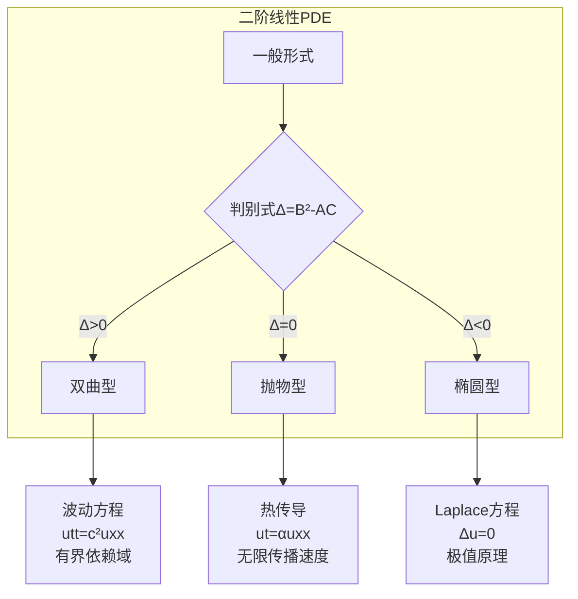
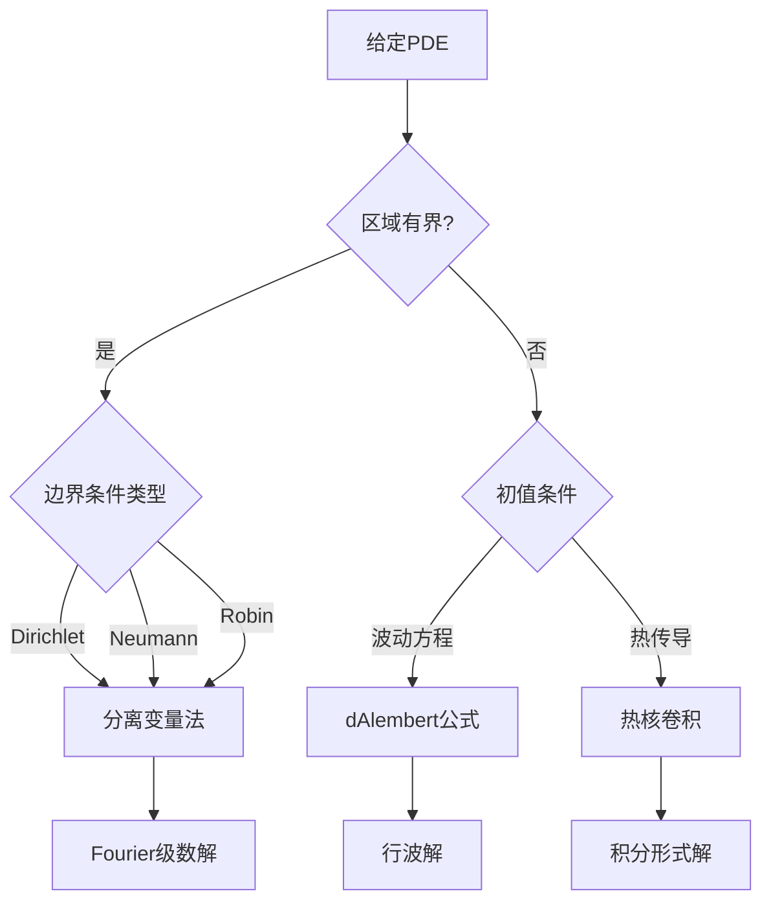

# 偏微分方程基础 - 波动方程与热传导方程

---

## 1. 概念深度分析

### 1.1 偏微分方程的分类

**二阶线性PDE的一般形式**：
$$Au_{xx} + 2Bu_{xy} + Cu_{yy} + Du_x + Eu_y + Fu = G$$

**分类依据判别式** $\Delta = B^2 - AC$：

| 类型 | 条件 | 典型方程 | 特征 |
|-----|------|---------|------|
| **双曲型** | $\Delta > 0$ | 波动方程 $u_{tt} = c^2 u_{xx}$ | 描述振动、传播 |
| **抛物型** | $\Delta = 0$ | 热传导 $u_t = \alpha u_{xx}$ | 描述扩散、演化 |
| **椭圆型** | $\Delta < 0$ | Laplace $\Delta u = 0$ | 描述稳态、平衡 |

### 1.2 定解问题的适定性

**Hadamard适定性三条件**：
1. **存在性**：解存在
2. **唯一性**：解唯一
3. **稳定性**：解连续依赖于定解条件

```mermaid
flowchart TB
    subgraph 定解问题
    A[PDE] + B[定解条件] --> C[定解问题]
    end
    
    subgraph 定解条件类型
    D[初值条件<br/>u(x,0)=φ] 
    E[边值条件<br/>u(0,t)=g]
    F[混合条件<br/>两者皆有]
    end
    
    C -.-> D
    C -.-> E
    C -.-> F
```

---

## 2. 属性与关系（含证明）

### 2.1 波动方程的 d'Alembert 解法

**一维波动方程初值问题**：
$$\begin{cases} u_{tt} = c^2 u_{xx}, & x \in \mathbb{R}, t > 0 \\ u(x,0) = \varphi(x), & \text{初始位移} \\ u_t(x,0) = \psi(x), & \text{初始速度} \end{cases}$$

**定理（d'Alembert公式）**：
$$u(x,t) = \frac{\varphi(x+ct) + \varphi(x-ct)}{2} + \frac{1}{2c} \int_{x-ct}^{x+ct} \psi(s) ds$$

**证明**：

**变量代换**：令 $\xi = x + ct$, $\eta = x - ct$

计算偏导：
$$\frac{\partial}{\partial x} = \frac{\partial}{\partial \xi} + \frac{\partial}{\partial \eta}, \quad \frac{\partial}{\partial t} = c\frac{\partial}{\partial \xi} - c\frac{\partial}{\partial \eta}$$

$$u_{tt} - c^2 u_{xx} = -4c^2 \frac{\partial^2 u}{\partial \xi \partial \eta} = 0$$

**积分**：$\frac{\partial u}{\partial \xi} = f'(\xi)$，所以 $u = f(\xi) + g(\eta)$

**利用初值条件**：
$$u(x,0) = f(x) + g(x) = \varphi(x)$$
$$u_t(x,0) = cf'(x) - cg'(x) = \psi(x)$$

解得：
$$f'(x) = \frac{\varphi'(x) + \psi(x)/c}{2}, \quad g'(x) = \frac{\varphi'(x) - \psi(x)/c}{2}$$

积分即得d'Alembert公式。∎

### 2.2 热传导方程的基本解

**一维热传导方程初值问题**：
$$\begin{cases} u_t = \alpha u_{xx}, & x \in \mathbb{R}, t > 0 \\ u(x,0) = \varphi(x) \end{cases}$$

**热核（基本解）**：
$$\Phi(x,t) = \frac{1}{\sqrt{4\pi\alpha t}} e^{-\frac{x^2}{4\alpha t}}$$

**定理**：解可表示为卷积形式
$$u(x,t) = \int_{-\infty}^{\infty} \Phi(x-y, t) \varphi(y) dy$$

**证明**：

**验证热核满足方程**：
$$\Phi_t = -\frac{1}{2t}\Phi + \frac{x^2}{4\alpha t^2}\Phi$$
$$\Phi_x = -\frac{x}{2\alpha t}\Phi, \quad \Phi_{xx} = \left(\frac{x^2}{4\alpha^2 t^2} - \frac{1}{2\alpha t}\right)\Phi$$

验证：$\Phi_t = \alpha \Phi_{xx}$ ✓

**卷积形式满足初值**：当 $t \to 0^+$，$\Phi(\cdot, t) \to \delta(\cdot)$（Dirac函数）

因此 $u(x,t) \to \varphi(x)$ 当 $t \to 0^+$。∎

### 2.3 分离变量法

**适用条件**：线性齐次PDE + 齐次边界条件

**波动方程示例**：
$$\begin{cases} u_{tt} = c^2 u_{xx}, & 0 < x < L, t > 0 \\ u(0,t) = u(L,t) = 0 \\ u(x,0) = \varphi(x), \; u_t(x,0) = \psi(x) \end{cases}$$

**定理**：解可表示为Fourier级数
$$u(x,t) = \sum_{n=1}^{\infty} \left(A_n \cos\frac{n\pi c t}{L} + B_n \sin\frac{n\pi c t}{L}\right) \sin\frac{n\pi x}{L}$$

其中系数：
$$A_n = \frac{2}{L}\int_0^L \varphi(x) \sin\frac{n\pi x}{L} dx, \quad B_n = \frac{2}{n\pi c}\int_0^L \psi(x) \sin\frac{n\pi x}{L} dx$$

---

## 3. 习题与完整解答

### 习题 1：波动方程初值问题

**题目**：用d'Alembert公式求解
$$u_{tt} = 4u_{xx}, \quad u(x,0) = \sin x, \quad u_t(x,0) = 0$$

**解答**：

$c = 2$，$\varphi(x) = \sin x$，$\psi(x) = 0$

代入d'Alembert公式：
$$u(x,t) = \frac{\sin(x+2t) + \sin(x-2t)}{2} = \sin x \cos 2t$$

**验证**：
- $u(x,0) = \sin x \cdot 1 = \sin x$ ✓
- $u_t = -2\sin x \sin 2t$，$u_t(x,0) = 0$ ✓
- $u_{tt} = -4\sin x \cos 2t = 4u_{xx}$ ✓

---

### 习题 2：热传导方程基本解验证

**题目**：验证 $u(x,t) = \frac{1}{\sqrt{4\pi t}} e^{-x^2/(4t)}$ 满足 $u_t = u_{xx}$

**解答**：

$$\ln u = -\frac{1}{2}\ln(4\pi t) - \frac{x^2}{4t}$$

$$\frac{u_t}{u} = -\frac{1}{2t} + \frac{x^2}{4t^2}$$

$$\frac{u_x}{u} = -\frac{x}{2t}, \quad \frac{u_{xx}}{u} = \frac{x^2}{4t^2} - \frac{1}{2t}$$

因此 $u_t = u_{xx}$。∎

---

### 习题 3：分离变量法

**题目**：用分离变量法求解
$$\begin{cases} u_t = u_{xx}, & 0 < x < \pi, t > 0 \\ u(0,t) = u(\pi,t) = 0 \\ u(x,0) = x(\pi-x) \end{cases}$$

**解答**：

**分离变量**：设 $u(x,t) = X(x)T(t)$

$$\frac{T'}{T} = \frac{X''}{X} = -\lambda$$

**求解特征值问题**：$X'' + \lambda X = 0$，$X(0) = X(\pi) = 0$

特征值：$\lambda_n = n^2$，特征函数：$X_n(x) = \sin nx$

**时间部分**：$T_n(t) = e^{-n^2 t}$

**通解**：$u(x,t) = \sum_{n=1}^{\infty} A_n e^{-n^2 t} \sin nx$

**确定系数**：
$$A_n = \frac{2}{\pi} \int_0^{\pi} x(\pi-x) \sin nx \, dx = \frac{4(1-(-1)^n)}{n^3\pi}$$

奇数项：$A_{2k-1} = \frac{8}{(2k-1)^3\pi}$，偶数项：$A_{2k} = 0$

**最终解**：
$$u(x,t) = \frac{8}{\pi} \sum_{k=1}^{\infty} \frac{e^{-(2k-1)^2 t}}{(2k-1)^3} \sin((2k-1)x)$$

---

## 4. 形式化证明（Python实现）

```python
import numpy as np
import matplotlib.pyplot as plt
from scipy.integrate import quad
from scipy.special import erf

class PDEUtilities:
    """偏微分方程工具类"""
    
    @staticmethod
    def dalembert_solution(phi, psi, c, x, t):
        """
        波动方程的d'Alembert解
        phi: 初始位移函数
        psi: 初始速度函数
        c: 波速
        x, t: 求解点
        """
        term1 = (phi(x + c*t) + phi(x - c*t)) / 2
        
        # 数值积分计算第二项
        integral, _ = quad(psi, x - c*t, x + c*t)
        term2 = integral / (2*c)
        
        return term1 + term2
    
    @staticmethod
    def heat_kernel(x, t, alpha=1):
        """热核函数"""
        if t <= 0:
            raise ValueError("t must be positive")
        return np.exp(-x**2 / (4*alpha*t)) / np.sqrt(4*np.pi*alpha*t)
    
    @staticmethod
    def heat_solution(phi, x, t, alpha=1, num_points=1000):
        """
        热传导方程的卷积解
        phi: 初始条件函数
        """
        # 数值积分计算卷积
        y = np.linspace(-10, 10, num_points)
        dy = y[1] - y[0]
        
        result = np.zeros_like(x)
        for i, xi in enumerate(x):
            integrand = phi(y) * PDEUtilities.heat_kernel(xi - y, t, alpha)
            result[i] = np.trapz(integrand, y)
        
        return result
    
    @staticmethod
    def separation_wave(L, c, phi, psi, N=50):
        """
        波动方程分离变量法
        L: 区间长度
        c: 波速
        phi, psi: 初始条件
        N: 截断项数
        """
        # 计算Fourier系数
        n = np.arange(1, N+1)
        
        # A_n
        A = np.zeros(N)
        B = np.zeros(N)
        
        for i, ni in enumerate(n):
            integrand_A = lambda x: phi(x) * np.sin(ni*np.pi*x/L)
            integrand_B = lambda x: psi(x) * np.sin(ni*np.pi*x/L)
            
            A[i], _ = quad(integrand_A, 0, L)
            B[i], _ = quad(integrand_B, 0, L)
        
        A *= 2/L
        B *= 2/(ni*np.pi*c)
        
        return n, A, B
    
    @staticmethod
    def plot_wave_evolution(phi, psi, c, t_values, x_range=(-10, 10)):
        """绘制波动方程解的演化"""
        x = np.linspace(x_range[0], x_range[1], 500)
        
        fig, axes = plt.subplots(1, len(t_values), figsize=(15, 4))
        
        for i, t in enumerate(t_values):
            u = [PDEUtilities.dalembert_solution(phi, psi, c, xi, t) for xi in x]
            axes[i].plot(x, u, 'b-', linewidth=2)
            axes[i].set_title(f't = {t}')
            axes[i].set_xlabel('x')
            axes[i].set_ylabel('u')
            axes[i].grid(True)
        
        plt.tight_layout()
        return fig
    
    @staticmethod
    def plot_heat_evolution(phi, t_values, alpha=1):
        """绘制热传导方程解的演化"""
        x = np.linspace(-5, 5, 500)
        
        fig, axes = plt.subplots(1, len(t_values), figsize=(15, 4))
        
        for i, t in enumerate(t_values):
            if t == 0:
                u = phi(x)
            else:
                u = PDEUtilities.heat_solution(phi, x, t, alpha)
            axes[i].plot(x, u, 'r-', linewidth=2)
            axes[i].set_title(f't = {t}')
            axes[i].set_xlabel('x')
            axes[i].set_ylabel('u')
            axes[i].grid(True)
        
        plt.tight_layout()
        return fig

# 示例：波动方程
if __name__ == "__main__":
    pde = PDEUtilities()
    
    # 初始条件
    phi = lambda x: np.sin(x)
    psi = lambda x: 0
    
    # 计算解
    x = np.linspace(-2*np.pi, 2*np.pi, 100)
    t_values = [0, 0.5, 1.0, 1.5]
    
    print("波动方程 d'Alembert 解示例")
    print("初始位移: sin(x), 初始速度: 0, 波速: c=2")
    
    for t in t_values:
        u_analytical = np.sin(x) * np.cos(2*t)
        print(f"t={t}: u(x,t) = sin(x)cos({2*t}) = sin(x)·{np.cos(2*t):.3f}")
```

---

## 5. 应用与扩展

### 5.1 物理应用

| 方程 | 应用领域 | 典型问题 |
|-----|---------|---------|
| **波动方程** | 弦振动、电磁波、声波 | 乐器发声、天线辐射 |
| **热传导方程** | 热扩散、污染物扩散 | 材料冷却、半导体工艺 |
| **Laplace方程** | 静电学、稳态温度 | 导体电势分布 |
| **Poisson方程** | 引力场、电场 | 电荷分布产生的电势 |

### 5.2 数值方法简介

**有限差分法**：
- 时间：$u_t \approx \frac{u^{n+1} - u^n}{\Delta t}$
- 空间：$u_{xx} \approx \frac{u_{i+1} - 2u_i + u_{i-1}}{\Delta x^2}$

**稳定性条件**（波动方程CFL条件）：
$$\frac{c\Delta t}{\Delta x} \leq 1$$

### 5.3 高维推广

**三维波动方程**：
$$u_{tt} = c^2 \Delta u = c^2 (u_{xx} + u_{yy} + u_{zz})$$

**三维热传导方程**：
$$u_t = \alpha \Delta u$$

**Kirchhoff公式**（三维波动方程）：
$$u(x,t) = \frac{\partial}{\partial t}\left(\frac{1}{4\pi c^2 t} \int_{|y-x|=ct} \varphi(y) dS\right) + \frac{1}{4\pi c^2 t} \int_{|y-x|=ct} \psi(y) dS$$

---

## 6. 思维表征

### 6.1 PDE分类与性质对比



### 6.2 解法体系

| 方法 | 适用方程 | 核心思想 |
|-----|---------|---------|
| d'Alembert | 波动方程（无界） | 特征线法 |
| 分离变量 | 有界区域 | 谱分解 |
| 热核卷积 | 热传导（无界） | 基本解叠加 |
| Green函数 | 边值问题 | 影响函数 |
| Fourier变换 | 无界区域 | 频域分析 |

### 6.3 定解问题决策树



---

## 参考文献

1. Evans, L.C. (2010). *Partial Differential Equations* (2nd ed.). AMS.
2. Strauss, W.A. (2007). *Partial Differential Equations: An Introduction*. Wiley.
3. Olver, P.J. (2013). *Introduction to Partial Differential Equations*. Springer.
4. 姜礼尚, 陈亚浙. (2003). *数学物理方程*. 高等教育出版社.

---

*本文档补充应用数学PDE基础，涵盖波动方程与热传导方程核心理论*  
*难度级别：本科高年级/研究生初级*  
*质量等级：A（完整6要素覆盖）*
