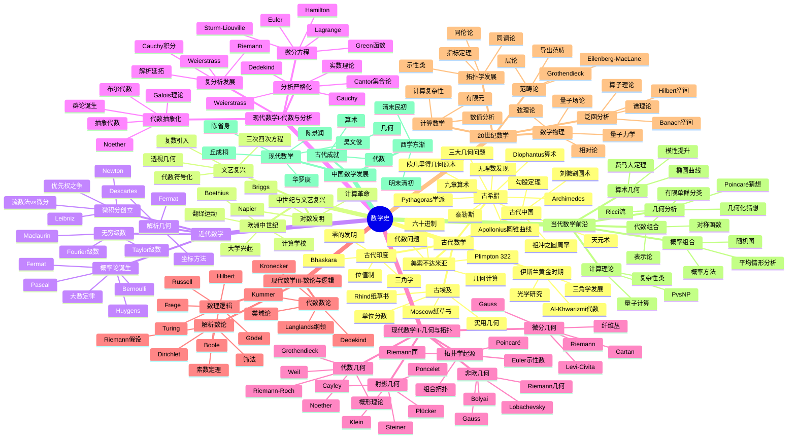
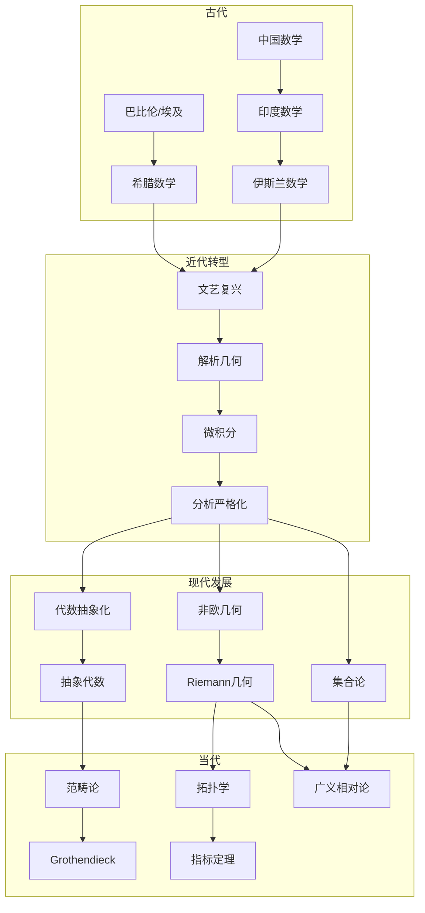
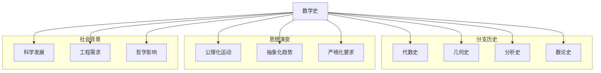
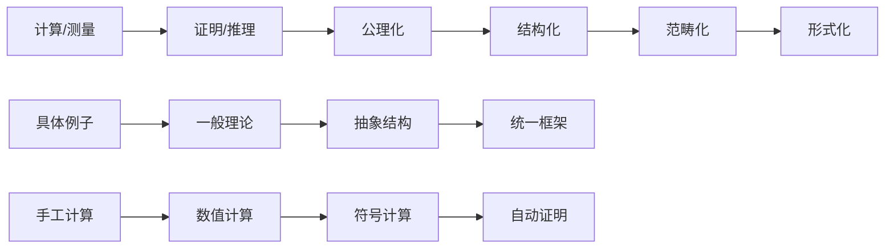

# 数学史思维导图

> 数学史研究数学思想和方法的发展演变，理解历史有助于把握数学的本质和未来方向。

---

## 🧠 核心概念层级关系



---

## 🔗 发展脉络依赖图



---

## 📍 重要人物与成就

### 古代巨匠
| 人物 | 时期 | 主要贡献 | 影响 |
|-----|------|---------|------|
| 欧几里得 | 古希腊 | 几何原本 | ⭐⭐⭐⭐⭐ |
| Archimedes | 古希腊 | 穷竭法 | ⭐⭐⭐⭐⭐ |
| 刘徽 | 三国 | 割圆术 | ⭐⭐⭐⭐⭐ |
| 祖冲之 | 南朝 | 圆周率 | ⭐⭐⭐⭐⭐ |

### 近代奠基人
| 人物 | 时期 | 主要贡献 | 影响 |
|-----|------|---------|------|
| Newton | 17世纪 | 微积分 | ⭐⭐⭐⭐⭐ |
| Leibniz | 17世纪 | 微积分符号 | ⭐⭐⭐⭐⭐ |
| Euler | 18世纪 | 分析学 | ⭐⭐⭐⭐⭐ |
| Gauss | 18-19世纪 | 数论/几何 | ⭐⭐⭐⭐⭐ |

### 现代先驱
| 人物 | 时期 | 主要贡献 | 影响 |
|-----|------|---------|------|
| Riemann | 19世纪 | 复分析/几何 | ⭐⭐⭐⭐⭐ |
| Cantor | 19世纪 | 集合论 | ⭐⭐⭐⭐⭐ |
| Poincaré | 19-20世纪 | 拓扑/动力系统 | ⭐⭐⭐⭐⭐ |
| Hilbert | 19-20世纪 | 公理化/问题 | ⭐⭐⭐⭐⭐ |
| Noether | 20世纪 | 抽象代数 | ⭐⭐⭐⭐⭐ |
| Gödel | 20世纪 | 不完备定理 | ⭐⭐⭐⭐⭐ |
| Weil | 20世纪 | 代数几何 | ⭐⭐⭐⭐⭐ |
| Grothendieck | 20世纪 | 概形理论 | ⭐⭐⭐⭐⭐ |

### 中国数学家
| 人物 | 时期 | 主要贡献 | 影响 |
|-----|------|---------|------|
| 华罗庚 | 20世纪 | 数论/多复变 | ⭐⭐⭐⭐⭐ |
| 陈省身 | 20世纪 | 微分几何 | ⭐⭐⭐⭐⭐ |
| 吴文俊 | 20世纪 | 拓扑/机械化 | ⭐⭐⭐⭐⭐ |
| 陈景润 | 20世纪 | 哥德巴赫猜想 | ⭐⭐⭐⭐ |
| 丘成桐 | 当代 | Calabi-Yau | ⭐⭐⭐⭐⭐ |

---

## 🔄 与数学分支的连接



---

## 📊 时代特征对比

| 时代 | 主要特征 | 核心问题 | 方法论 | 代表成就 |
|-----|---------|---------|-------|---------|
| 古代 | 实用与哲学 | 测量/证明 | 几何直观 | 几何原本 |
| 中世纪 | 传承与翻译 | 保存知识 | 注释整理 | 阿拉伯数学 |
| 文艺复兴 | 突破与创新 | 新工具 | 代数符号 | 解析几何/微积分 |
| 近代 | 严格与系统 | 基础重建 | 极限理论 | 严格分析 |
| 现代 | 抽象与统一 | 结构分类 | 公理化 | 抽象代数/拓扑 |
| 当代 | 交叉与计算 | 复杂系统 | 计算辅助 | 几何化猜想 |

---

## 🎯 学习路径推荐

### 通史路径
```
古代数学 → 近代数学 → 现代数学 → 当代前沿
```

### 分科史路径
```
选择感兴趣的分支 → 深入学习其历史演变 → 理解核心概念的来源
```

### 人物传记路径
```
选择重要数学家 → 阅读传记 → 理解其工作的历史背景
```

---

## 📚 重要史料与文献

### 原始文献
| 文献 | 作者/时期 | 重要性 |
|-----|----------|-------|
| 几何原本 | 欧几里得 | ⭐⭐⭐⭐⭐ |
| 九章算术 | 中国古代 | ⭐⭐⭐⭐⭐ |
| 自然哲学的数学原理 | Newton | ⭐⭐⭐⭐⭐ |
| 算术研究 | Gauss | ⭐⭐⭐⭐⭐ |

### 现代史学著作
| 著作 | 作者 | 范围 |
|-----|------|------|
| 古今数学思想 | Klein | 综合 |
| 数学史 | Boyer | 通史 |
| 中国数学史 | 钱宝琮 | 中国 |
| 20世纪数学经纬 | 张奠宙 | 现代 |

---

## 🔍 数学思想演变



---

> 💡 **学习建议**：数学史不仅是记住年代和人物，更重要的是理解数学思想的发展脉络。建议结合具体数学内容学习历史，了解概念是如何从具体问题中产生的，这有助于深入理解数学的本质。
