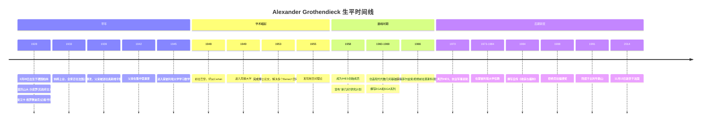
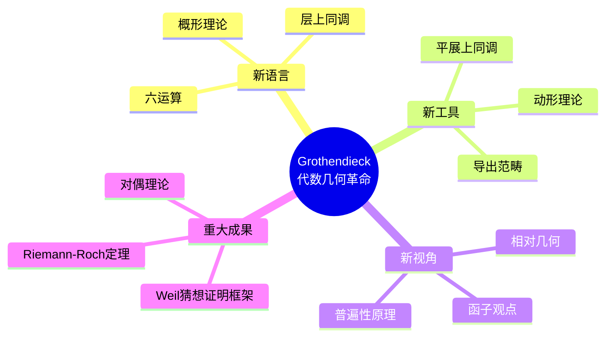
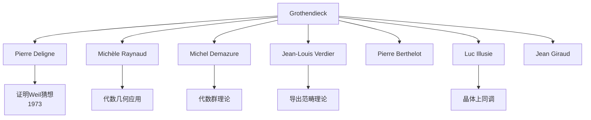
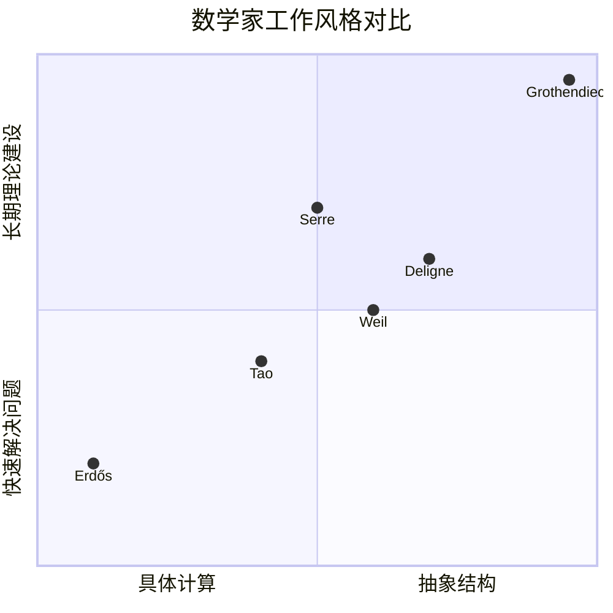

# Alexander Grothendieck 传记

> "数学的主要目的不是发明计算技巧，而是理解数学对象背后的深层结构。"
> —— Alexander Grothendieck

---

## 一、生平时间线

### 早年岁月 (1928-1948)



### 重要生平节点

| 年份 | 年龄 | 事件 | 意义 |
|------|------|------|------|
| 1928 | 0 | 柏林出生 | 俄裔德籍犹太家庭 |
| 1933 | 5 | 移居法国 | 逃避纳粹迫害 |
| 1942 | 14 | 父亲遇害 | 深刻影响其世界观 |
| 1945 | 17 | 进入大学 | 几乎自学成才 |
| 1953 | 25 | 博士学位 | 泛函分析领域突破 |
| 1958 | 30 | IHES创立 | 开始代数几何革命 |
| 1966 | 38 | 菲尔兹奖 | 数学界最高荣誉 |
| 1970 | 42 | 离开IHES | 政治觉醒时期 |
| 1988 | 60 | 拒克拉福德奖 | 反对科学界的等级制度 |
| 2014 | 86 | 逝世 | 留下约2万页手稿 |

---

## 二、主要数学贡献

### 2.1 泛函分析时期 (1949-1953)

**核心贡献：**

1. **核空间理论 (Nuclear Spaces)**
   - 引入核空间概念
   - 解决拓扑张量积问题
   - 为分布理论奠定严格基础

2. **Schwartz核定理的证明**
   - 给出Schwartz核定理的优雅证明
   - 建立泛函分析与分布理论的联系

3. **Grothendieck不等式**
   - 关于有界双线性形式的重要不等式
   - 在量子信息论中有意外应用

### 2.2 代数几何革命 (1958-1970)

**现代代数几何基础：**



#### 核心创新详解

| 概念 | 创新意义 | 应用 |
|------|----------|------|
| **概形 (Scheme)** | 统一代数簇与算术 | 代数几何与数论的统一 |
| **层上同调** | 拓扑不变量的代数计算 | Weil猜想证明 |
| **平展上同调 (Étale Cohomology)** | 特征p几何的Weil上同调 | 最终证明Weil猜想 |
| **动形 (Motif)** | 上同调理论的普适源 | 朗兰兹纲领、Hodge猜想 |
| **六运算形式** | 对偶理论的统一框架 | 现代代数几何和D模理论 |

### 2.3 代表作详解

#### 《代数几何基础》(EGA - Éléments de Géométrie Algébrique)

- **卷数：** 计划13章，完成4章
- **页数：** 约1500页
- **核心内容：** 系统建立概形理论
- **影响：** 成为代数几何的"圣经"

#### 《代数几何研讨班》(SGA - Séminaire de Géométrie Algébrique)

- **卷数：** 7卷
- **内容：** 与IHES研讨班的讲义
- **涵盖：** 平展上同调、挠曲线、对偶理论等

#### 《收获与播种》(Récoltes et Semailles)

- **类型：** 数学自传与反思
- **篇幅：** 约2000页
- **主题：** 数学创作的本质、数学界的评价文化
- **价值：** 数学思想的珍贵文献

---

## 三、学术影响力和传承

### 3.1 直接弟子与影响者



### 3.2 对现代数学的深远影响

| 领域 | 影响 | 具体体现 |
|------|------|----------|
| **代数几何** | 范式转变 | 从簇到概形的转变 |
| **数论** | 统一框架 | 算术几何的诞生 |
| **代数拓扑** | 新工具 | 平展上同调、A¹同伦论 |
| **表示论** | 几何方法 | D模、反常层理论 |
| **数学物理** | 弦论基础 | 镜像对称、导出范畴 |
| **逻辑与基础** | 新视角 | Topos理论、构造主义 |

### 3.3 学术传承链条

```
Cartan → Schwartz → Grothendieck → Deligne → Lafforgue → ...
                              ↓
                         现代代数几何学派
```

---

## 四、个人风格和工作方法

### 4.1 独特的数学视野

**"用普遍性的力量解决具体问题"**

Grothendieck不满足于解决单个问题，而是寻求理解整个问题所在的"景观"。他相信：

> "通过正确的普遍性层次，困难的问题会变得容易。"

### 4.2 工作方法特点

| 特点 | 描述 | 例子 |
|------|------|------|
| **概念先行** | 先建立正确概念，再解决问题 | 先定义概形，再解决Weil猜想 |
| **系统性** | 追求理论的完整和统一 | EGA系列的宏大计划 |
| **几何直观** | 强烈的几何直觉 | 将算术问题几何化 |
| **长期视角** | 不为短期成果所动 | 12年专注于代数几何基础 |
| **孤独工作** | 独自深入思考 | 每天工作10-12小时 |

### 4.3 与其他数学家的对比



---

## 五、历史评价和轶事

### 5.1 同时代人的评价

> "Grothendieck是一位独特的数学家，他不仅解决了问题，而且彻底改变了我们思考问题的方式。"
> —— **Jean-Pierre Serre**

> "Grothendieck的工作代表了代数几何的根本性转变，其影响将持续数百年。"
> —— **Pierre Deligne**

> "他是数学家中最像哲学家的，也是最像建筑师的。"
> —— **David Mumford**

### 5.2 重要轶事

#### 1. 拒绝菲尔兹奖 (1966)

Grothendieck拒绝前往莫斯科参加国际数学家大会接受菲尔兹奖，以抗议苏联的政治迫害。但他最终接受了奖章本身。

#### 2. 拒绝克拉福德奖 (1988)

在给瑞典皇家科学院的信中，他解释了自己的理由：

> "我的教授薪水是我作为数学家时退休金的十倍...这种财富的差异在科学家中创造了一种真正的等级制度，这对科学实践是有害的。"

#### 3. 对数学界的批评

在《收获与播种》中，他深刻批评了数学界的"膜拜"文化和对权力的追求。

#### 4. 隐逸生活

1991年后，他隐居在法国和西班牙边境的比利牛斯山区，断绝与数学界的联系，专注于精神追求。

### 5.3 数学之外的兴趣

- **生态学**：对环境保护有强烈关注
- **和平主义**：积极参与反战运动
- **佛教**：晚年深受佛教影响
- **手稿写作**：留下约2万页未发表手稿

---

## 六、相关数学概念链接

### 6.1 核心概念

- [概形理论](../concept/scheme_theory.md)
- [层上同调](../concept/sheaf_cohomology.md)
- [平展上同调](../concept/etale_cohomology.md)
- [导出范畴](../concept/derived_category.md)
- [Weil猜想](../concept/weil_conjectures.md)

### 6.2 相关数学家

- [Pierre Deligne传记](./11-Pierre_Deligne传记.md)
- [Jean-Pierre Serre传记](./13-Jean-Pierre_Serre传记.md)
- [André Weil传记](./12-André_Weil传记.md)

### 6.3 数学学派

- [布尔巴基学派史](./20-布尔巴基学派史.md)
- [普林斯顿高等研究院数学史](./23-普林斯顿高等研究院数学史.md)

---

## 七、延伸阅读

### 原始文献

1. Grothendieck, A. (1957). "Sur quelques points d'algèbre homologique." *Tôhoku Math. J.*
2. Grothendieck, A. & Dieudonné, J. (1960-1967). *Éléments de Géométrie Algébrique* (EGA)
3. Grothendieck, A. et al. (1962-1974). *Séminaire de Géométrie Algébrique* (SGA)

### 传记与研究

1. Cartier, P. (2001). "A mad day's work: from Grothendieck to Connes and Kontsevich"
2. Jackson, A. (2004). "Comme Appelé du Néant — As If Summoned from the Void"
3. Schneps, L. (编辑). *Grothendieck Circle* 网站

### 哲学反思

- Grothendieck, A. (1986). *Récoltes et Semailles* (收获与播种)

---

**创建日期：** 2026年4月  
**最后更新：** 2026年4月  
**文档类别：** 数学史 - 20世纪数学大师
