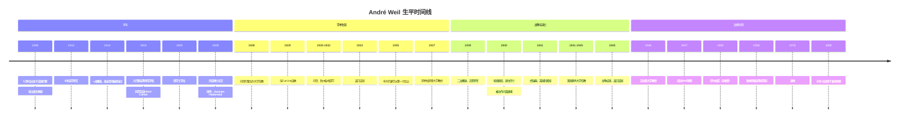
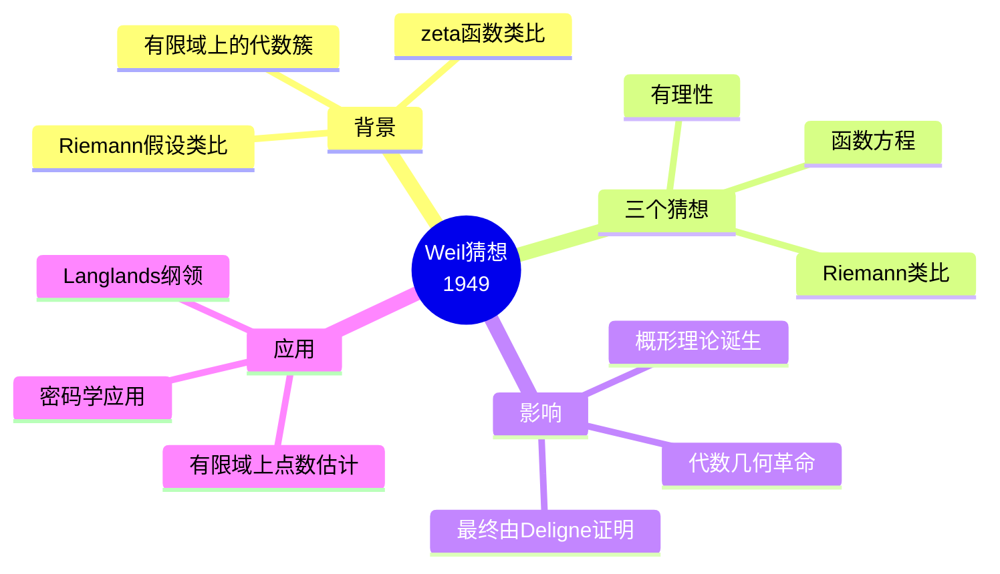
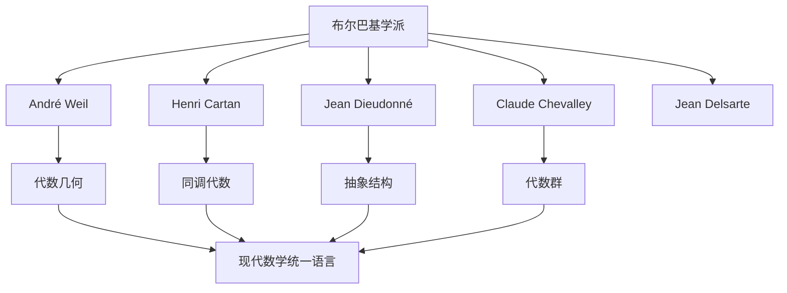
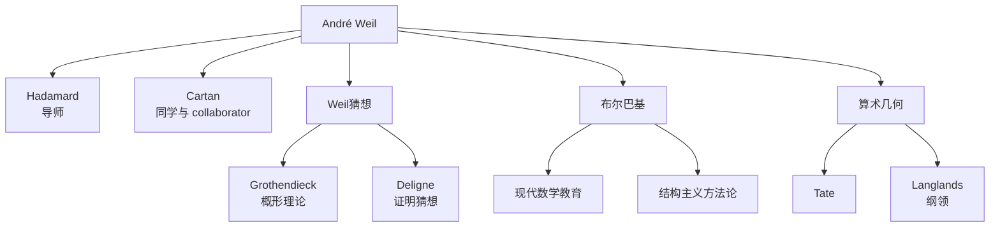

# André Weil 传记

> "上帝之所以存在，是因为数学是一致的；魔鬼之所以存在，是因为我们不能证明数学是一致的。"
> —— André Weil

---

## 一、生平时间线

### 早年与教育 (1906-1928)



### 重要生平节点

| 年份 | 年龄 | 事件 | 意义 |
|------|------|------|------|
| 1906 | 0 | 巴黎出生 | 法国犹太知识精英家庭 |
| 1925 | 19 | 进入巴黎高师 | 结识Cartan，奠定布尔巴基基础 |
| 1928 | 22 | 博士毕业 | 论文研究Diophantine方程 |
| 1935 | 29 | 布尔巴基创立 | 现代数学结构主义运动 |
| 1940 | 34 | 逃往芬兰 | 战争期间惊险经历 |
| 1947 | 41 | Weil猜想 | 代数几何与数论统一纲领 |
| 1950 | 44 | 菲尔兹奖 | 因政治原因未接受 |
| 1979 | 73 | Wolf奖 | 数学终身成就奖 |
| 1998 | 92 | 逝世 | 留下丰富的数学遗产 |

---

## 二、主要数学贡献

### 2.1 数论 (1920s-1940s)

**核心贡献：**

1. **Mordell-Weil定理**
   - 椭圆曲线上有理点构成有限生成Abel群
   - 算术几何的基本定理

2. **Siegel-Weil公式**
   - Theta级数与表示论的联系
   - 数论与调和分析的交汇

3. **局部-整体原理 (Hasse-Weil原理)**
   - 将全局问题约化为局部问题
   - 现代数论的基本哲学

### 2.2 代数几何的算术转向 (1940s-1950s)

**Weil猜想 (1949)**



**Weil猜想详述：**

对于有限域 $\mathbb{F}_q$ 上的光滑射影簇 $X$，定义其zeta函数：

$$Z(X, t) = \exp\left(\sum_{n=1}^{\infty} \frac{N_n}{n} t^n\right)$$

其中 $N_n$ 是 $X$ 在 $\mathbb{F}_{q^n}$ 上的点数。

**三个核心猜想：**

| 猜想 | 内容 | 意义 |
|------|------|------|
| **有理性** | $Z(X, t)$ 是有理函数 | 深刻的几何-算术联系 |
| **函数方程** | 特定的对称性关系 | 对偶理论的体现 |
| **Riemann类比** | 零点的绝对值为 $q^{-i/2}$ | 类似黎曼假设 |

**证明历程：**
- Weil本人证明了曲线情形 (1940s)
- Dwork证明有理性 (1960)
- Grothendieck建立Weil上同调理论框架
- **Deligne完成全部证明 (1973)**，获1978年菲尔兹奖

### 2.3 统一数学 (1930s-1950s)

**布尔巴基学派创始人**



**布尔巴基的贡献：**

1. **《数学原本》(Éléments de Mathématique)**
   - 计划涵盖现代数学所有基础
   - 强调结构和公理化方法
   - 影响了几代数学教育

2. **结构主义数学观**
   - 代数结构、拓扑结构、序结构
   - 数学对象的公理化定义
   - 强调概念间的内在联系

### 2.4 其他重要贡献

**泛函分析：**
- 拓扑群上的积分理论
- 几乎周期函数
- 调和分析的基础工作

**微分几何：**
- Chern-Weil理论（与Chern合作）
- 示性类的微分形式描述
- 几何不变量理论

**李群与李代数：**
- 代数群的算术理论
- 有限单群的分类基础

---

## 三、代表作品分析

### 3.1 《代数几何基础》(1946)

**出版信息：**
- 书名：Foundations of Algebraic Geometry
- 出版：美国数学会Colloquium Publications
- 页数：约300页

**核心创新：**
- 首次用严格的代数方法建立代数几何基础
- 引入"抽象代数簇"概念
- 为Grothendieck的概形理论铺路

**历史评价：**
> "这是代数几何从意大利学派的几何直观向严格代数化转变的关键著作。"

### 3.2 《数论：从Hammurabi到Legendre的历史探讨》

**出版信息：**
- 书名：Number Theory: An Approach Through History
- 出版：1984年
- 体裁：数学史与数学研究的结合

**独特之处：**
- 从古代巴比伦到近代欧洲的数论发展
- 结合历史分析与数学洞察
- 展示数学思想的演变

### 3.3 布尔巴基《数学原本》系列

**参与情况：**
- 布尔巴基最活跃的创始人之一
- 参与撰写多卷本
- 对风格和内容有深远影响

---

## 四、学术影响力和传承

### 4.1 学术传承图谱



### 4.2 对现代数学的深远影响

| 领域 | 影响 | 具体体现 |
|------|------|----------|
| **代数几何** | 算术化转向 | Weil猜想引领代数几何革命 |
| **数论** | 几何方法 | 现代算术几何的诞生 |
| **数学基础** | 结构主义 | 布尔巴基学派的遗产 |
| **数学教育** | 严格公理化 | 现代教材的写作风格 |

### 4.3 数学传承链条

```
Hadamard → Weil → Grothendieck → Deligne → ...
              ↓
         布尔巴基学派 → 现代数学语言
              ↓
         算术几何 → Langlands纲领 → 当代前沿
```

---

## 五、个人风格和工作方法

### 5.1 独特的工作哲学

**"计算具体例子"**

Weil强调通过具体计算来理解抽象理论。他相信：

> "没有例子就没有理论。"

### 5.2 工作方法特点

| 特点 | 描述 | 例子 |
|------|------|------|
| **历史视角** | 从历史发展中理解数学 | 《数论》著作 |
| **具体计算** | 强调显式计算和例子 | Fermat曲线的研究 |
| **统一视野** | 寻求不同领域的联系 | 数论与几何的统一 |
| **严格公理化** | 追求概念的精确定义 | 布尔巴基风格 |
| **优美简洁** | 追求优雅的证明 | Weil猜想的陈述 |

### 5.3 与其他数学家的关系

**与Grothendieck：**
- 最初是Weil激发了Grothendieck对代数几何的兴趣
- Weil猜想直接推动Grothendieck创造概形理论
- 两人风格迥异但相互尊重

**与Serre：**
- 长期通信，深入讨论数学
- Serre完善了Weil的一些想法
- 友谊持续数十年

### 5.4 生活轶事

**语言天赋：**
- 通晓多种语言
- 包括梵文、古希腊文
- 对印度数学史有深入研究

**政治立场：**
- 坚定的和平主义者
- 拒绝二战期间服役
- 因此流亡美国

**晚年：**
- 普林斯顿度过晚年
- 继续数学研究和写作
- 留下大量未发表手稿

---

## 六、历史评价和轶事

### 6.1 同时代人的评价

> "Weil是布尔巴基的灵魂。没有他，布尔巴基不可能存在。"
> —— **Jean Dieudonné**

> "他的数学视野是史诗般的，他能从最高的观点看到最远的风景。"
> —— **Henri Cartan**

> "Weil猜想定义了一个时代。"
> —— **Pierre Deligne**

### 6.2 重要轶事

#### 1. 芬兰历险 (1940)

Weil因拒绝服役而逃往芬兰，被当作苏联间谍逮捕。据说他面临死刑，幸运地被瑞典数学家Rolf Nevanlinna营救。这段经历成为他一生的转折点。

#### 2. 与妹妹Simone的关系

他的妹妹Simone Weil是著名的哲学家和神秘主义者。两人在精神上有很多交流，尽管Simone对数学不感兴趣。

#### 3. 梵文兴趣

年轻时学习梵文，研究印度数学史。他对古代印度数学的洞察显示了他的语言天赋和文化广度。

### 6.3 历史地位

**数学贡献评价：**
- 现代算术几何的奠基人
- 布尔巴基学派的核心人物
- 20世纪最重要的数论学家之一

**奖项与荣誉：**
- 1950年菲尔兹奖（未接受，因已超龄限制）
- 1979年Wolf奖
- 1994年京都奖
- 多国科学院院士

---

## 七、相关数学概念链接

### 7.1 核心概念

- [Weil猜想](../concept/weil_conjectures.md)
- [椭圆曲线](../concept/elliptic_curve.md)
- [代数簇](../concept/algebraic_variety.md)
- [Zeta函数](../concept/zeta_function.md)
- [算术几何](../concept/arithmetic_geometry.md)

### 7.2 相关数学家

- [Alexander Grothendieck传记](./10-Alexander_Grothendieck传记.md)
- [Pierre Deligne传记](./11-Pierre_Deligne传记.md)
- [Jean-Pierre Serre传记](./13-Jean-Pierre_Serre传记.md)
- [Henri Cartan传记](./14-Henri_Cartan传记.md)

### 7.3 相关主题

- [布尔巴基学派史](./20-布尔巴基学派史.md)
- [算术几何发展史](./19-算术几何发展史.md)
- [代数几何革命](./21-代数几何革命.md)

---

## 八、延伸阅读

### 原始文献

1. Weil, A. (1946). *Foundations of Algebraic Geometry*
2. Weil, A. (1949). "Numbers of solutions of equations in finite fields" (Weil猜想)
3. Weil, A. (1984). *Number Theory: An Approach Through History*
4. Bourbaki, N. (多卷). *Éléments de Mathématique* (Weil参与部分)

### 传记与研究

1. Weil, A. (1991). *The Apprenticeship of a Mathematician* (自传)
2. Ouellette, F. (1971). "André Weil" (传记文章)
3. Cartier, P. (1999). "André Weil"
4. Langlands, R. (1999). "Endoscopy and beyond"

---

**创建日期：** 2026年4月  
**最后更新：** 2026年4月  
**文档类别：** 数学史 - 20世纪数学大师
