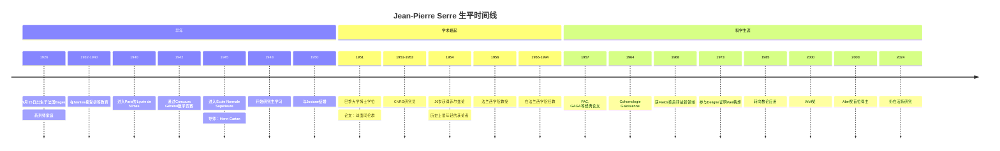
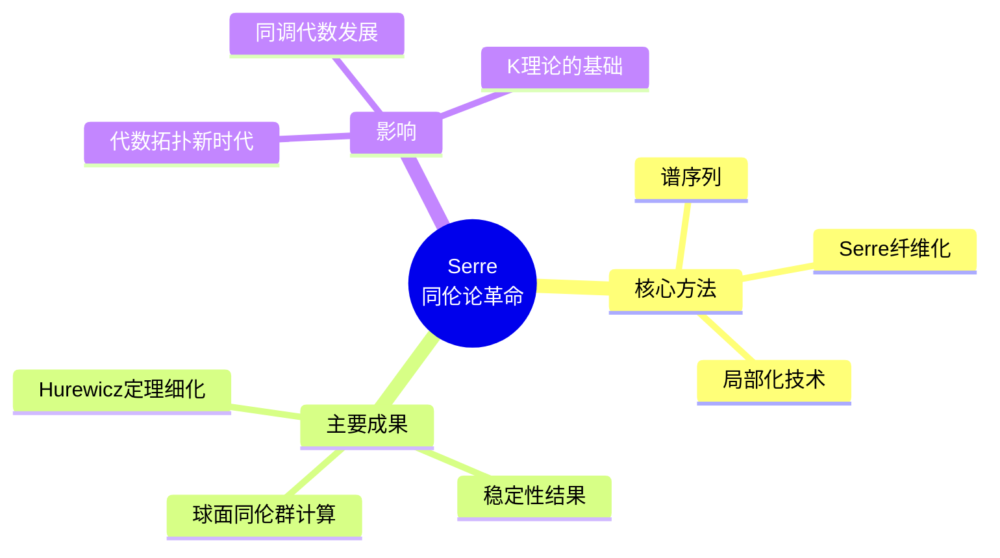
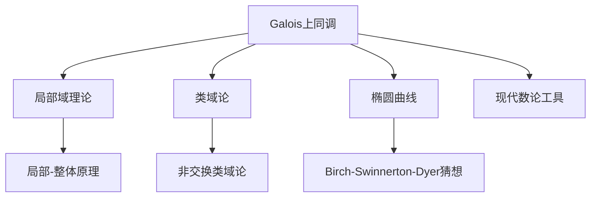
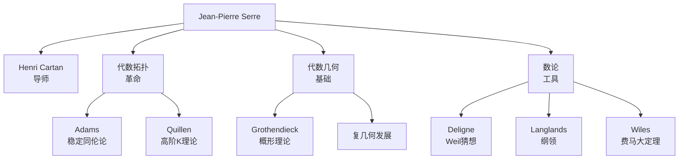

# Jean-Pierre Serre 传记

> "数学的主要目的是证明简单的定理，而不仅仅是证明困难的定理。"
> —— Jean-Pierre Serre

---

## 一、生平时间线

### 早年与教育 (1926-1951)



### 重要生平节点

| 年份 | 年龄 | 事件 | 意义 |
|------|------|------|------|
| 1926 | 0 | Bages出生 | 法国南部小村庄 |
| 1945 | 19 | 进入ENS | 巴黎高师，Cartan门下 |
| 1951 | 25 | 博士毕业 | 论文研究同伦群 |
| 1954 | 28 | **菲尔兹奖** | **史上最年轻获奖者** |
| 1956 | 30 | 法兰西学院教授 | 法国最高学术职位 |
| 1973 | 47 | 参与Weil猜想 | 与Deligne的合作 |
| 2000 | 74 | Wolf奖 | 终身成就奖 |
| 2003 | 77 | **Abel奖首位得主** | 数学最高荣誉之一 |
| 2024 | 98 | 仍在写作 | 数学界的长青树 |

---

## 二、主要数学贡献

### 2.1 同伦论与拓扑学 (1950-1960)

**博士论文突破**

Serre的博士论文《球面的同伦群》 revolutionized 了代数拓扑：



**关键贡献：**

| 概念 | 创新 | 意义 |
|------|------|------|
| **Serre谱序列** | 纤维化中的上同调计算工具 | 同伦论的标准工具 |
| **Serre纤维化** | 弱纤维化概念的精化 | 覆盖广泛的拓扑映射 |
| **局部化** | 在素数处局部化空间 | 稳定同伦论的基石 |
| **同伦群计算** | 球面高维同伦群的结构 | 解决了长期悬案 |

### 2.2 代数几何的复分析转向 (1954-1960)

**GAGA原理**

```
Géométrie Algébrique et Géométrie Analytique
```

Serre证明了在复射影簇上：
- 代数凝聚层 ←→ 解析凝聚层
- 代数上同调 = 解析上同调

**这意味着**：复代数几何可以用复分析的方法研究。

**FAC (Faisceaux Algébriques Cohérents)**

1955年的这篇论文：
- 系统引入层上同调到代数几何
- 为Grothendieck的概形理论铺路
- 现代代数几何的基石之一

### 2.3 同调代数与K理论 (1955-1970)

**Grothendieck群的引入**

Serre与Grothendieck合作发展：

1. **代数K理论的起源**
   - 从向量丛出发
   - Grothendieck群的定义
   - 现代K理论的基础

2. **Serre猜想 (1955)**
   - 多项式环上的投射模是自由的
   - 代数K理论的早期问题
   - 最终由Quillen和Suslin证明 (1976)

3. **Serre对偶性**
   - 复流形上的对偶定理
   - 代数几何与复几何的联系

### 2.4 数论与算术几何 (1960s-1990s)

**Galois上同调**



**Cohomologie Galoisienne (1964)**

- 系统发展Galois上同调理论
- 应用于类域论
- 非交换类域论的基础

**与模形式和Galois表示的联系**

- Serre猜想 (1973)：
  关于模Galois表示的猜想
- 最终在2008-2009年被证明
- 与费马大定理证明相关

### 2.5 代表作详解

#### 《有限群的线性表示》(Représentations Linéaires des Groupes Finis)

- **出版**：1967年
- **内容**：有限群表示论的优雅介绍
- **影响**：成为经典教材，被翻译成多种语言

#### 《算术教程》(Cours d'Arithmétique)

- **出版**：1970年
- **内容**：数论的深入介绍
- **特色**：从二次型到模形式

#### 《局部域》(Local Fields)

- **出版**：1979年
- **内容**：局部域理论及其应用
- **意义**：现代数论的标准参考书

---

## 三、学术影响力和传承

### 3.1 学术传承图谱



### 3.2 对现代数学的深远影响

| 领域 | 影响 | 具体体现 |
|------|------|----------|
| **代数拓扑** | 同伦论复兴 | Serre谱序列成为标准工具 |
| **代数几何** | 层上同调引入 | FAC, GAGA论文 |
| **数论** | Galois上同调 | 现代算术几何的语言 |
| **表示论** | 经典教材 | 影响几代数学家 |
| **同调代数** | K理论起源 | Grothendieck群 |

### 3.3 教学与写作风格

**Serre的写作特点：**

> "他的论文是数学写作的典范：清晰、简洁、没有多余之词。"

- **优雅简洁**：每个证明都经过精心打磨
- **具体例子**：总是用具体例子说明抽象概念
- **历史视野**：了解数学思想的发展脉络

---

## 四、个人风格和工作方法

### 4.1 独特的数学视野

**"简洁是智慧的灵魂"**

Serre相信：

> "一个定理的价值不仅在于它的难度，而在于它揭示的简单性。"

### 4.2 工作方法特点

| 特点 | 描述 | 例子 |
|------|------|------|
| **优雅简洁** | 追求清晰的证明 | 所有论文都是写作范本 |
| **深度思考** | 不急于发表 | 反复打磨每个结果 |
| **跨领域** | 在多个领域做出贡献 | 拓扑、几何、数论 |
| **具体计算** | 通过计算理解结构 | 球面同伦群的计算 |
| **教学热情** | 杰出的讲师和作家 | 多本经典教材 |

### 4.3 与其他数学家的关系

**与Grothendieck：**
- 密切的合作关系
- 相互激发思想
- Grothendieck称Serre是"唯一理解他的人"

**与Cartan：**
- 导师与学生的典范关系
- Cartan对Serre影响深远
- 传承了法国数学传统

**通信的价值：**

Serre与Grothendieck的通信被出版为《Grothendieck-Serre通信集》，是数学史上的珍贵文献。

### 4.4 生活态度

**对数学的态度：**
- 终身热爱数学
- 即使在98岁高龄仍在写作
- 数学是他生活的中心

**对荣誉的态度：**
- 谦逊，专注于数学本身
- 批评过度的政治化
- 反对数学界的"等级制度"

---

## 五、历史评价和轶事

### 5.1 同时代人的评价

> "Serre是我认识的数学家中最全面的一个。他在每个他触及的领域都做出了基础性的贡献。"
> —— **Alexander Grothendieck**

> "Serre的论文是数学写作的典范。他的《有限群的线性表示》是学习数学写作的必读之作。"
> —— **Terence Tao**

> "他是我们这个时代最伟大的数学家之一，也是一个极好的人。"
> —— **Pierre Deligne**

### 5.2 重要轶事

#### 1. 最年轻菲尔兹奖得主

1954年，28岁的Serre获得菲尔兹奖，是当时最年轻的获奖者。这个记录保持了多年。

#### 2. 菲尔兹奖演说

他的菲尔兹奖演说"代数拓扑中的同调与同伦"成为该领域的经典综述。

#### 3. Abel奖首位得主

2003年，首届Abel奖授予Serre，这是数学界最高荣誉之一（与菲尔兹奖齐名）。

#### 4. 长寿的数学生涯

从1950年代至今，Serre的数学生涯已超过70年，是数学界的长青树。即使在98岁，他仍在发表文章和书籍。

### 5.3 历史地位

**主要荣誉：**
- 1954年：菲尔兹奖（最年轻得主）
- 2000年：Wolf奖
- 2003年：Abel奖首位得主
- 多国科学院院士

**学术地位：**
- 20世纪最伟大的数学家之一
- 在拓扑、几何、数论都有奠基性贡献
- 数学写作的典范

---

## 六、相关数学概念链接

### 6.1 核心概念

- [Serre谱序列](../concept/serre_spectral_sequence.md)
- [Serre纤维化](../concept/serre_fibration.md)
- [层上同调](../concept/sheaf_cohomology.md)
- [GAGA原理](../concept/gaga_principle.md)
- [Galois上同调](../concept/galois_cohomology.md)
- [Serre对偶性](../concept/serre_duality.md)

### 6.2 相关数学家

- [Alexander Grothendieck传记](./10-Alexander_Grothendieck传记.md)
- [Pierre Deligne传记](./11-Pierre_Deligne传记.md)
- [Henri Cartan传记](./14-Henri_Cartan传记.md)

### 6.3 相关主题

- [代数拓扑史](./16-代数拓扑史.md)
- [代数几何革命](./21-代数几何革命.md)
- [同调代数发展](./22-同调代数发展.md)

---

## 七、延伸阅读

### 原始文献

1. Serre, J-P. (1951). "Homologie singulière des espaces fibrés"
2. Serre, J-P. (1955). "Faisceaux algébriques cohérents" (FAC)
3. Serre, J-P. (1956). "Géométrie algébrique et géométrie analytique" (GAGA)
4. Serre, J-P. (1964). *Cohomologie Galoisienne*
5. Serre, J-P. (1967). *Représentations Linéaires des Groupes Finis*
6. Serre, J-P. (1970). *Cours d'Arithmétique*

### 传记与研究

1. Serre, J-P. & Grothendieck, A. (2001). *Correspondance Grothendieck-Serre*
2. Gray, J. (2006). "The Life and Work of Jean-Pierre Serre"
3. Raussen, M. & Skau, C. (2004). "Interview with Jean-Pierre Serre" (Abel奖访谈)
4. Kong, E. et al. (2016). "Jean-Pierre Serre: A Mathematical Pioneer"

---

**创建日期：** 2026年4月  
**最后更新：** 2026年4月  
**文档类别：** 数学史 - 20世纪数学大师
