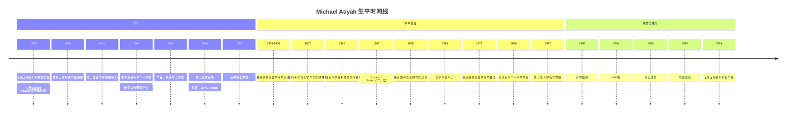
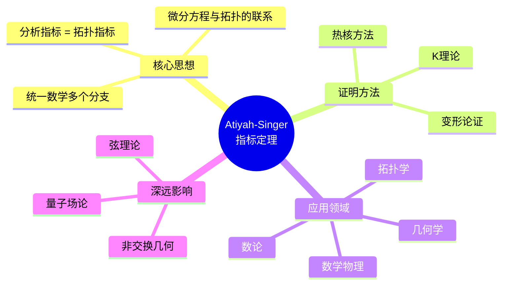
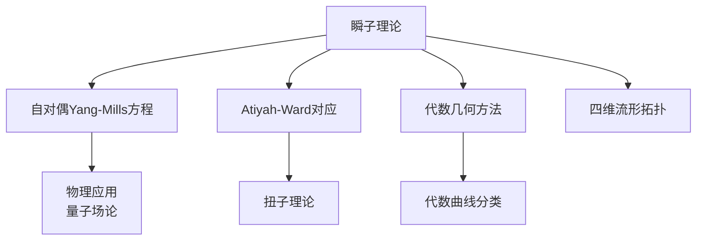
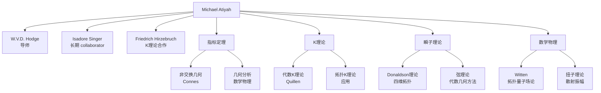

# Michael Atiyah 传记

> "数学是一门艺术，而不是科学。数学家是被某种内在美驱动的艺术家。"
> —— Michael Atiyah

---

## 一、生平时间线

### 早年与教育 (1929-1955)



### 重要生平节点

| 年份 | 年龄 | 事件 | 意义 |
|------|------|------|------|
| 1929 | 0 | 伦敦出生 | 黎巴嫩裔英国人 |
| 1947 | 18 | 进入剑桥 | 三一学院，Hodge门下 |
| 1954 | 25 | 博士毕业 | 代数几何研究 |
| 1961 | 32 | 牛津教授 | 萨维利亚几何学讲席 |
| 1963 | 34 | Atiyah-Singer合作 | 指标定理的开端 |
| 1966 | 37 | **菲尔兹奖** | 数学最高荣誉 |
| 2004 | 75 | **Abel奖** | 与Singer共享 |
| 2019 | 89 | 逝世 | 留下丰富的数学遗产 |

---

## 二、主要数学贡献

### 2.1 Atiyah-Singer指标定理 (1963-1984)

**定理概述**

Atiyah-Singer指标定理是20世纪数学最重要的成就之一：

```
对于椭圆微分算子 D，其解析指标等于拓扑指标：
index(D) = dim ker D - dim coker D = ∫_M Â(M) ∧ ch(E)
```



**历史意义：**

| 方面 | 影响 | 具体 |
|------|------|------|
| **数学统一** | 连接分析、拓扑、几何 | 高斯-博内-陈定理的推广 |
| **物理学** | 规范理论、反常 | 瞬子计算、指标定理应用 |
| **数论** | 算术几何 | 与BSD猜想的联系 |

### 2.2 K理论的发展 (1959-1970)

**拓扑K理论的创立**

与Friedrich Hirzebruch合作：

1. **K理论的公理化**
   - 从向量丛出发
   - Bott周期性
   - 广义上同调理论

2. **应用**
   - 指标定理的基础
   - 代数拓扑的新工具
   - 非交换K理论的起源

### 2.3 瞬子与规范理论 (1970s-1980s)

**瞬子理论**

与Richard Ward合作，研究Yang-Mills方程的自对偶解：



**Atiyah-Ward对应：**
- 将物理中的瞬子与代数几何中的向量丛联系
- 开创了用代数几何研究物理的新途径
- 对后来的弦理论有深远影响

### 2.4 几何与物理的统一 (1980s-2000s)

**数学物理的桥梁**

Atiyah晚年致力于数学与物理的统一：

1. **拓扑量子场论**
   - 与Witten的合作
   - 几何不变量的物理意义
   - Witten猜想的提出

2. **弦理论与几何**
   - Calabi-Yau流形
   - 镜像对称
   - 对偶性

3. **扭子理论**
   - 与Penrose的合作
   - 时空的替代描述
   - 散射振幅的新方法

### 2.5 其他重要贡献

**代数几何：**
- 向量丛的模空间
- 代数曲线的几何
- 与Hirzebruch的Riemann-Roch定理工作

**李群表示论：**
- 等变K理论
- 凸多面体的组合学
- 与Duistermaat-Heckman定理的联系

---

## 三、代表作品分析

### 3.1 《K理论》(K-Theory)

**出版信息：**
- 1967年首次出版
- 多次重印和修订
- 经典教材和参考书

**核心内容：**
- K理论的系统介绍
- Bott周期性定理
- 指标定理的K理论证明

**历史地位：**
> "这是学习K理论的必读之作。"

### 3.2 《交换代数引论》(Introduction to Commutative Algebra)

**出版信息：**
- 与Ian Macdonald合著
- 1969年出版

**特色：**
- 简洁优雅的写作风格
- 现代交换代数的基础
- 影响了几代代数几何学家

### 3.3 《几何与物理》(Geometry and Physics)

**出版信息：**
- 多篇综述文章的合集
- 涵盖Atiyah晚年的数学物理工作

**内容涵盖：**
- 规范理论
- 拓扑量子场论
- 扭子理论

---

## 四、学术影响力和传承

### 4.1 学术传承图谱



### 4.2 对现代数学的深远影响

| 领域 | 影响 | 具体体现 |
|------|------|----------|
| **微分几何** | 指标定理 | 微分算子与拓扑的联系 |
| **代数拓扑** | K理论 | 广义上同调理论 |
| **数学物理** | 规范理论 | 瞬子、拓扑量子场论 |
| **代数几何** | 向量丛 | 模空间理论 |
| **弦理论** | 数学基础 | Calabi-Yau、镜像对称 |

### 4.3 学术传承链条

```
Hodge → Atiyah → Donaldson, Witten, ...
             ↓
        数学物理统一
             ↓
        现代几何、物理、数学的交汇
```

---

## 五、个人风格和工作方法

### 5.1 独特的数学视野

**"统一与优雅"**

Atiyah相信：

> "数学的本质是发现不同领域之间隐藏的联系。"

### 5.2 工作方法特点

| 特点 | 描述 | 例子 |
|------|------|------|
| **寻求联系** | 发现不同领域间的桥梁 | 指标定理、瞬子理论 |
| **几何直观** | 强烈的几何直觉 | K理论的拓扑意义 |
| **物理洞察** | 将物理思想引入数学 | 规范理论的应用 |
| **优雅简洁** | 追求优美的证明 | 写作风格 |
| **合作精神** | 大量合作工作 | 与Singer、Ward等 |

### 5.3 与其他数学家的关系

**与Isadore Singer：**
- 长达40年的合作
- 共同获得2004年Abel奖
- 指标定理是数学史上最伟大的合作之一

**与Edward Witten：**
- 激发Witten对数学的兴趣
- 共同工作于拓扑量子场论
- Witten称Atiyah为导师和朋友

**与Friedrich Hirzebruch：**
- K理论的合作者
- 共同举办多次会议
- 深厚的友谊

### 5.4 公共角色与科学政策

**三一学院院长 (1990-1997)：**
- 领导世界上最古老的学院之一
- 推动科学与社会的联系

**公共角色：**
- 英国皇家学会主席 (1990-1995)
- 欧洲数学学会主席
- 积极参与科学政策制定

**数学推广：**
- 撰写大量科普文章
- 向公众解释数学之美
- 相信数学教育的重要性

---

## 六、历史评价和轶事

### 6.1 同时代人的评价

> "Atiyah是数学的统一者。他看到了别人看不到的联系。"
> —— **Edward Witten** (菲尔兹奖得主)

> "指标定理是20世纪数学的巅峰之一。"
> —— **Raoul Bott** (数学家)

> "Atiyah有一种独特的魅力，他能让数学听起来既深刻又有趣。"
> —— **Sir Roger Penrose**

### 6.2 重要轶事

#### 1. Abel奖感言

2004年与Singer共享Abel奖时，Atiyah说：

> "数学是永恒的，而我们的生命是短暂的。能留下一些永恒的东西是一种荣幸。"

#### 2. 对黎曼猜想的尝试

2018年，Atiyah在一次演讲中声称证明了黎曼猜想，但这一证明未得到数学界认可。这显示了他即使在高龄仍保持的数学热情，也引发了关于老年数学家角色的讨论。

#### 3. 演讲风格

Atiyah以精彩的演讲著称。他能用简单的语言解释复杂的数学，让听众感受到数学之美。

### 6.3 历史地位

**主要荣誉：**
- 1966年：菲尔兹奖
- 1968年：皇家奖章
- 1983年：骑士勋章
- 1987年：De Morgan奖章
- 2004年：Abel奖（与Singer共享）
- 2010年：大英帝国勋章

**学术地位：**
- 20世纪最伟大的几何学家之一
- 数学与物理统一运动的领袖
- 数学教育的倡导者

---

## 七、相关数学概念链接

### 7.1 核心概念

- [Atiyah-Singer指标定理](../concept/atiyah_singer_index_theorem.md)
- [K理论](../concept/k_theory.md)
- [瞬子](../concept/instanton.md)
- [Yang-Mills理论](../concept/yang_mills_theory.md)
- [拓扑量子场论](../concept/topological_quantum_field_theory.md)
- [扭子理论](../concept/twistor_theory.md)

### 7.2 相关数学家

- [Isadore Singer传记](./20-Isadore_Singer传记.md)
- [Edward Witten传记](./21-Edward_Witten传记.md)
- [Simon Donaldson传记](./15-Simon_Donaldson传记.md)

### 7.3 相关主题

- [微分几何史](./17-微分几何史.md)
- [数学物理史](./26-数学物理史.md)
- [指标定理发展](./27-指标定理发展.md)

---

## 八、延伸阅读

### 原始文献

1. Atiyah, M.F. & Singer, I.M. (1963). "The Index of Elliptic Operators on Compact Manifolds"
2. Atiyah, M.F. & Hirzebruch, F. (1959). "Riemann-Roch Theorems for Differentiable Manifolds"
3. Atiyah, M.F. & Ward, R.S. (1977). "Instantons and Algebraic Geometry"
4. Atiyah, M.F. (1967). *K-Theory*
5. Atiyah, M.F. & Macdonald, I.G. (1969). *Introduction to Commutative Algebra*

### 传记与研究

1. Atiyah, M.F. (1988). *Collected Works* (5卷)
2. Atiyah, M.F. (2014). "Fruitful Interactions between Geometry and Physics"
3. Hitchin, N.J. (2020). "Michael Atiyah: A Personal Tribute"
4. Abel奖委员会 (2004). "The Abel Prize Citation for Michael Atiyah and Isadore Singer"

---

**创建日期：** 2026年4月  
**最后更新：** 2026年4月  
**文档类别：** 数学史 - 20世纪数学大师
