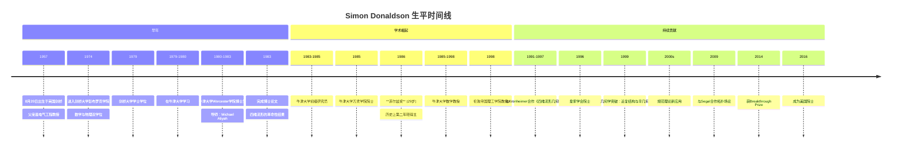
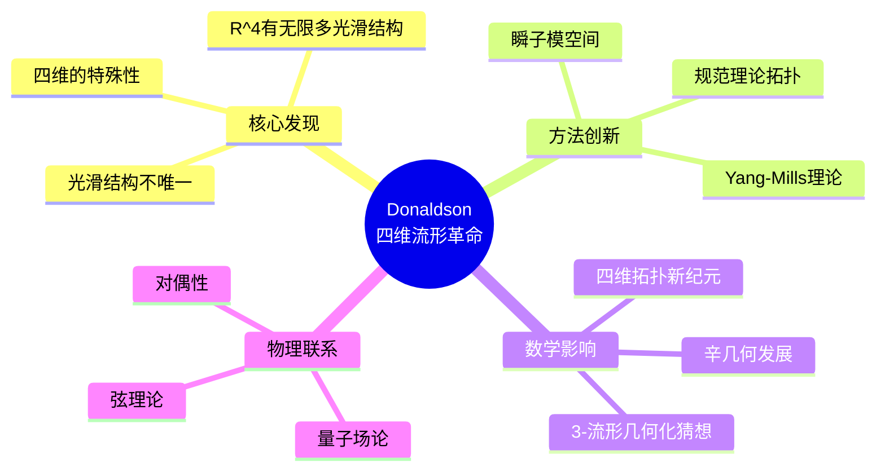
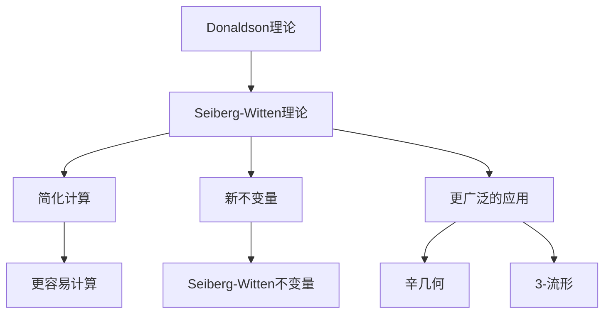
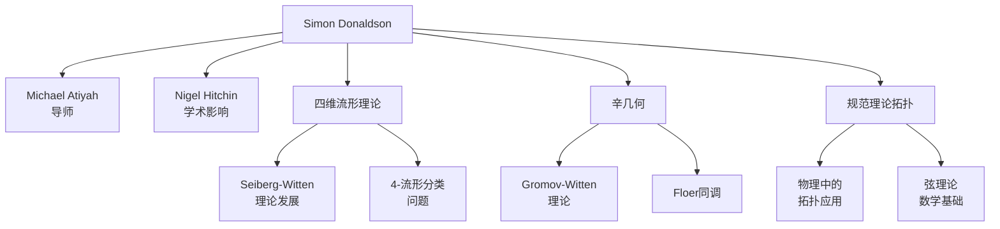

# Simon Donaldson 传记

> "四维流形的拓扑学揭示了数学中最深刻的结构之一。"
> —— Simon Donaldson

---

## 一、生平时间线

### 早年与教育 (1957-1983)



### 重要生平节点

| 年份 | 年龄 | 事件 | 意义 |
|------|------|------|------|
| 1957 | 0 | 剑桥出生 | 数学世家背景 |
| 1979 | 22 | 剑桥毕业 | 进入牛津深造 |
| 1983 | 26 | 博士毕业 | 四维流形突破性结果 |
| 1986 | 29 | **菲尔兹奖** | **史上第二年轻得主** |
| 1996 | 39 | 皇家学会院士 | 英国科学最高荣誉 |
| 2014 | 57 | Breakthrough Prize | 300万美元奖金 |
| 2016 | 59 | 美国院士 | 国际学术地位认可 |

---

## 二、主要数学贡献

### 2.1 四维流形革命 (1982-1986)

**Donaldson定理 (1983)**

这是微分拓扑学最重要的突破之一：



**Donaldson定理详述：**

**定理陈述：**

对于单连通光滑4-流形 $M$，若其交截形式是正定的，则该形式必为标准的对角形式 $\langle 1 \rangle \oplus \cdots \oplus \langle 1 \rangle$。

**革命性意义：**

| 发现 | 影响 | 具体 |
|------|------|------|
| **光滑结构的丰富性** | 四维与其他维度根本不同 | 存在"怪异的" $\mathbb{R}^4$ |
| **拓扑与微分结构的分离** | 同一拓扑流形有多种光滑结构 | 四维流形的不变量理论 |
| **规范理论的应用** | 物理理论解决数学问题 | 数学物理新纪元 |

### 2.2 Donaldson不变量 (1985-1990)

**四维流形的微分不变量**

Donaldson构造了四维流形的微分不变量：

$$D_M: H_*(M) \to \mathbb{Q}$$

这些不变量：
- 区分同胚但不微分同胚的四维流形
- 需要光滑结构的存在
- 由瞬子模空间定义

**计算方法的发展：**
- Uhlenbeck紧致化
- 模空间的拓扑性质
- 与代数几何的联系

### 2.3 Seiberg-Witten理论的启发 (1994)

**理论的转变**

1994年，Seiberg-Witten方程的引入 revolutionized 了四维流形的研究：



**Donaldson的贡献：**
- 认识到Seiberg-Witten理论的重要性
- 帮助建立两个理论的联系
- 推动了现代辛几何的发展

### 2.4 辛几何与复几何 (1999-2010)

**近复结构的存在性**

Donaldson证明了：
- 四维辛流形存在 compatible 的近复结构
- 建立了辛几何与复几何的联系
- 开创了辛拓扑的新方向

**Lefschetz纤维化理论**
- 四维流形的分解
- 与Lefschetz超曲面定理的联系
- 3-流形的几何化应用

### 2.5 其他重要贡献

**Kähler几何：**
- 极化流形的稳定性
- 与规范理论的联系
- K-稳定性的研究

**代数几何方法：**
- 代数曲面的模空间
- 向量丛的几何
- 与弦理论的联系

---

## 三、代表作品分析

### 3.1 博士论文 (1983)

**标题：** "The Yang-Mills equations on Kähler manifolds"

**革命性贡献：**
- 引入Yang-Mills理论到四维流形拓扑
- 证明光滑结构的不唯一性
- 开启了数学物理在拓扑中的应用新纪元

### 3.2 《四维流形的几何学》(1990)

**出版信息：**
- 与Peter Kronheimer合著
- 牛津大学出版社
- 经典参考书

**核心内容：**
- Yang-Mills方程的几何
- 瞬子模空间的结构
- Donaldson不变量的构造

**历史地位：**
> "这是四维流形研究的圣经。"

### 3.3 其他重要著作

**《黎曼曲面》(2011)**
- 本科生教材
- 优雅的写作风格
- 结合现代观点

**《辛几何讲义》(2002)**
- 与Kronheimer合作
- 辛几何的标准参考

---

## 四、学术影响力和传承

### 4.1 学术传承图谱



### 4.2 对现代数学的深远影响

| 领域 | 影响 | 具体体现 |
|------|------|----------|
| **四维拓扑** | 范式转变 | 从组合拓扑到规范理论 |
| **数学物理** | 桥梁建设 | 物理理论解决数学问题 |
| **辛几何** | 现代发展 | Lefschetz纤维化理论 |
| **代数几何** | 新工具 | 向量丛的模空间 |
| **3-流形** | 几何化猜想 | Donaldson-Thurston联系 |

### 4.3 学术传承链条

```
Atiyah → Donaldson → 现代四维拓扑
                 ↓
           Seiberg-Witten理论
                 ↓
           现代辛几何与低维拓扑
```

---

## 五、个人风格和工作方法

### 5.1 独特的数学视野

**"物理洞察与严格证明的结合"**

Donaldson相信：

> "物理理论能提供数学洞察，但需要数学的严格性来确认。"

### 5.2 工作方法特点

| 特点 | 描述 | 例子 |
|------|------|------|
| **物理洞察** | 从物理理论获得数学启发 | Yang-Mills理论的应用 |
| **几何直观** | 强烈的空间直觉 | 四维流形的理解 |
| **技术精湛** | 深入的技术细节掌握 | 瞬子模空间的分析 |
| **优雅简洁** | 追求清晰的论证 | 写作风格 |
| **耐心坚持** | 长期专注于困难问题 | 四维流形理论的发展 |

### 5.3 与其他数学家的关系

**与Michael Atiyah：**
- 导师与学生的关系
- Atiyah的指标定理思想深刻影响Donaldson
- 从Atiyah那里学到数学物理的结合

**与Peter Kronheimer：**
- 长期合作者
- 共同撰写《四维流形的几何学》
- 辛几何方面的合作

**与Edward Witten：**
- 相互影响
- Witten的物理洞察启发了Donaldson
- 共同推动数学物理的发展

### 5.4 教学与写作

**写作风格：**
- 清晰严谨
- 注重动机和直观
- 经典教材《黎曼曲面》体现了这种风格

**教学理念：**
- 重视基础
- 鼓励学生独立思考
- 在帝国理工培养了众多学生

---

## 六、历史评价和轶事

### 6.1 同时代人的评价

> "Donaldson的工作彻底改变了我们对四维流形的理解。这是20世纪拓扑学最重要的突破之一。"
> —— **Michael Atiyah**

> "四维流形是物理和数学交汇的最美丽的地方，Donaldson首先揭示了这一点。"
> —— **Edward Witten**

> "Donaldson的工作展示了数学物理在纯粹数学中的强大力量。"
> —— **Shing-Tung Yau**

### 6.2 重要轶事

#### 1. 博士论文的突破

1982年，Donaldson还是研究生时，在访问纽约期间突然想到了证明的关键。他在短时间内完成了证明，震惊了整个数学界。

#### 2. 菲尔兹奖演讲

1986年的菲尔兹奖演讲中，Donaldson展示了四维流形的复杂性，许多数学家第一次意识到四维的特殊性。

#### 3. Breakthrough Prize

2014年，获得Breakthrough Prize时，Donaldson将部分奖金捐给了数学教育项目。

### 6.3 历史地位

**主要荣誉：**
- 1986年：菲尔兹奖（29岁，史上第二年轻）
- 1991年：Royal Medal
- 1996年：Crafoord Prize（与Dixmier共享）
- 2014年：Breakthrough Prize in Mathematics
- 2016年：美国国家科学院外籍院士

**学术地位：**
- 四维流形拓扑的奠基人
- 数学物理在拓扑中应用的先驱
- 现代辛几何的重要贡献者

---

## 七、相关数学概念链接

### 7.1 核心概念

- [Donaldson不变量](../concept/donaldson_invariants.md)
- [Yang-Mills理论](../concept/yang_mills_theory.md)
- [瞬子](../concept/instanton.md)
- [四维流形](../concept/four_manifold.md)
- [辛几何](../concept/symplectic_geometry.md)
- [Seiberg-Witten理论](../concept/seiberg_witten_theory.md)

### 7.2 相关数学家

- [Michael Atiyah传记](./14-Michael_Atiyah传记.md)
- [Edward Witten传记](./21-Edward_Witten传记.md)
- [Andreas Floer传记](./22-Andreas_Floer传记.md)

### 7.3 相关主题

- [四维流形拓扑史](./28-四维流形拓扑史.md)
- [规范理论发展史](./29-规范理论发展史.md)
- [数学物理在几何中的应用](./30-数学物理几何应用.md)

---

## 八、延伸阅读

### 原始文献

1. Donaldson, S.K. (1983). "An application of gauge theory to four-dimensional topology"
2. Donaldson, S.K. & Kronheimer, P.B. (1990). *The Geometry of Four-Manifolds*
3. Donaldson, S.K. (1996). "The Seiberg-Witten equations and 4-manifold topology"
4. Donaldson, S.K. (2011). *Riemann Surfaces*

### 传记与研究

1. Donaldson, S.K. (1987). "The work of Simon Donaldson" (Fields奖解说)
2. Atiyah, M.F. (1986). "On the work of Simon Donaldson"
3. Morgan, J.W. (1996). *The Seiberg-Witten Equations and Applications to the Topology of Smooth Four-Manifolds*
4. Breakthrough Prize (2014). "Simon Donaldson Citation"

---

**创建日期：** 2026年4月  
**最后更新：** 2026年4月  
**文档类别：** 数学史 - 20世纪数学大师
