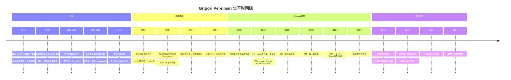
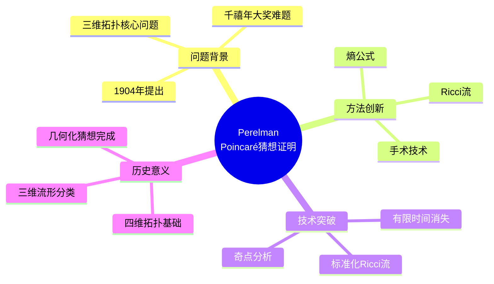
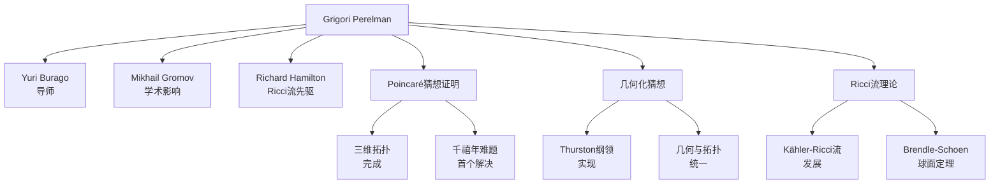

# Grigori Perelman 传记

> "我不是数学的英雄。我只是一个做数学的人。"
> —— Grigori Perelman

---

## 一、生平时间线

### 早年与教育 (1966-1995)



### 重要生平节点

| 年份 | 年龄 | 事件 | 意义 |
|------|------|------|------|
| 1966 | 0 | 列宁格勒出生 | 数学天才家庭 |
| 1982 | 16 | IMO金牌 | 满分天才 |
| 1990 | 24 | 博士毕业 | Alexandrov空间专家 |
| 1992 | 26 | 灵魂猜想 | 微分几何突破 |
| 2002 | 36 | Ricci流文章 | Poincaré猜想证明开端 |
| 2003 | 37 | 完成证明 | 三维庞加莱猜想解决 |
| 2006 | 40 | **拒绝菲尔兹奖** | 数学史上首次 |
| 2010 | 44 | **拒绝Clay奖** | 100万美元 |
| 2010+ | - | 隐居 | 与世隔绝 |

---

## 二、主要数学贡献

### 2.1 Poincaré猜想的证明 (2002-2003)

**千年难题的解决**



**Poincaré猜想陈述：**

```
每个单连通的三维闭流形同胚于三维球面 S³。
```

**证明思路：**

1. **Ricci流 (Hamilton)**
   - 类似于热方程平滑度量
   - 演化曲率，趋向"标准"几何

2. **奇点分析**
   - 研究Ricci流中的奇点形成
   - Perelman引入新的单调量

3. **手术技术**
   - 在奇点处"切除"并"缝合"
   - 继续进行Ricci流

4. **标准化Ricci流**
   - 最终收敛到标准几何
   - 证明流形的结构

### 2.2 几何化猜想 (2003)

**Thurston猜想的证明**

Perelman不仅证明了Poincaré猜想，还证明了更广泛的**几何化猜想**：

```
每个三维流形都可以分解为若干部分，
每部分都允许八种标准几何结构之一。
```

**八种几何结构：**
1. 球面几何 S³
2. 欧氏几何 E³
3. 双曲几何 H³
4. S² × R
5. H² × R
6. SL(2,R)的通用覆盖
7. Nil几何
8. Sol几何

**历史意义：**

| 方面 | 影响 | 具体 |
|------|------|------|
| **三维拓扑** | 完全分类 | 所有三维流形的结构理解 |
| **几何学** | 统一视角 | 几何与拓扑的深刻联系 |
| **物理学** | 宇宙学应用 | 三维空间的分类 |

### 2.3 早期贡献：灵魂猜想 (1992)

**Cheeger-Gromoll猜想的解决**

**灵魂猜想陈述：**

```
对于具有非负截面曲率的完备开黎曼流形，
如果某点的所有射线都相交，则该点就是灵魂。
```

**Perelman的简洁证明：**
- 仅用4页纸
- 优雅的论证
- 展示了非凡的技术能力

### 2.4 其他重要工作

**Alexandrov空间：**
- 博士论文研究
- 广义曲率空间
- 与比较几何的联系

**比较几何：**
- 曲率与拓扑的关系
- 体积比较定理
- 几何不等式

---

## 三、代表作品分析

### 3.1 Ricci流三部曲 (2002-2003)

**第一篇文章：** "The entropy formula for the Ricci flow and its geometric applications"

- **arXiv:** math.DG/0211159
- **核心贡献：** Perelman熵公式
- **技术突破：** W-泛函的单调性

**第二篇文章：** "Ricci flow with surgery on three-manifolds"

- **arXiv:** math.DG/0303109
- **核心贡献：** 手术技术的严格化
- **技术突破：** 有限时间内的手术控制

**第三篇文章：** "Finite extinction time for the solutions to the Ricci flow on certain three-manifolds"

- **arXiv:** math.DG/0307245
- **核心贡献：** 有限消亡时间
- **技术突破：** 完成证明的最后一步

### 3.2 写作风格特点

**Perelman的写作特点：**

- **极简主义**：没有多余的解释
- **技术密集**：每个细节都有证明
- **没有动机**：不解释为什么这样做
- **严格性**：每一步都严格验证

这使得他的文章极难阅读，但也极其精确。

---

## 四、学术影响力和传承

### 4.1 学术传承图谱



### 4.2 对现代数学的深远影响

| 领域 | 影响 | 具体体现 |
|------|------|----------|
| **三维拓扑** | 完全分类 | 几何化定理 |
| **微分几何** | Ricci流成熟 | 几何分析新工具 |
| **数学物理** | 宇宙学应用 | 空间结构分类 |
| **几何分析** | 奇点分析 | 新的技术方法 |
| **数学文化** | 拒绝荣誉 | 引发广泛讨论 |

### 4.3 证明的验证过程

**验证时间线：**

- **2003：** Kleiner-Lott开始撰写详细笔记
- **2004-2005：** 多个团队独立验证
- **2006：** 科学界确认证明正确
- **2006：** Cao-Zhu的详细阐述发表
- **2008：** Kleiner-Lott完整笔记完成

**验证的困难：**
- Perelman的文章极简
- 需要补充许多细节
- 但核心思想完全正确

---

## 五、个人风格和工作方法

### 5.1 独特的数学视野

**"纯粹的数学追求"**

Perelman相信：

> "数学本身就是奖励，不需要外在的荣誉。"

### 5.2 工作方法特点

| 特点 | 描述 | 例子 |
|------|------|------|
| **独立思考** | 长时间独自工作 | 7年专注Poincaré猜想 |
| **技术精湛** | 非凡的技术能力 | 灵魂猜想的简洁证明 |
| **极简主义** | 追求最简洁的论证 | Ricci流三部曲 |
| **严格性** | 每个细节都验证 | 文章的精确性 |
| **隔离状态** | 远离数学界 | 拒绝会议和交流 |

### 5.3 与其他数学家的关系

**与Richard Hamilton：**
- 高度尊重Hamilton的开创工作
- 认为Hamilton应该分享荣誉
- 这也是他拒绝菲尔兹奖的原因之一

**与数学界：**
- 逐渐疏远
- 不信任评审体系
- 认为数学界有"不诚实"行为

### 5.4 隐居与拒绝

**拒绝菲尔兹奖 (2006)：**

> "我对金钱或 fame 不感兴趣。我不想要在数学界的任何奖项。我已经证明了我想证明的，这就是全部。"

**拒绝Clay奖 (2010)：**

完全无视Clay数学研究所的邀请，最终正式拒绝100万美元奖金。

**原因分析：**
- 对数学界"不诚实"的失望
- 认为荣誉应该是数学本身
- 可能的心理因素
- 纯粹的个人选择

---

## 六、历史评价和轶事

### 6.1 同时代人的评价

> "Perelman的工作是数学史上最伟大的成就之一。他解决了Poincaré猜想，这是数学的核心问题。"
> —— **Richard Hamilton**

> "Perelman不仅证明了Poincaré猜想，还证明了几何化猜想。这是三维拓扑的完整解决。"
> —— **William Thurston**

> "他的拒绝让我们反思数学界的价值观。也许我们确实过于关注荣誉而不是数学本身。"
> —— **Shing-Tung Yau**

### 6.2 重要轶事

#### 1. IMO满分

1982年，16岁的Perelman代表苏联参加国际数学奥林匹克，获得满分。这是他天才的早期证明。

#### 2. 灵魂猜想的证明

1992年，Perelman用一个4页的证明解决了灵魂猜想，令几何学界震惊。这个证明的优雅展示了他的非凡才能。

#### 3. 2003年MIT演讲

2003年，Perelman在MIT进行了关于他证明的一系列演讲。这是他最后一次公开数学演讲。演讲后，他逐渐退出公众视野。

#### 4. 2010年后的生活

据传Perelman目前居住在圣彼得堡，与父母一起生活。他拒绝了所有采访请求，过着与世隔绝的生活。

### 6.3 历史地位

**主要成就：**
- 2002-2003年：Poincaré猜想证明
- 2003年：几何化猜想证明
- 1992年：灵魂猜想证明

**荣誉（全部拒绝）：**
- 2006年：菲尔兹奖（拒绝）
- 2010年：Clay千禧年大奖（拒绝，100万美元）

**学术地位：**
- 20世纪最伟大的数学家之一
- 解决了数学史上最著名的问题之一
- 数学史上最具争议的人物之一

---

## 七、相关数学概念链接

### 7.1 核心概念

- [Poincaré猜想](../concept/poincare_conjecture.md)
- [几何化猜想](../concept/geometrization_conjecture.md)
- [Ricci流](../concept/ricci_flow.md)
- [Perelman熵](../concept/perelman_entropy.md)
- [手术理论](../concept/surgery_theory.md)
- [Alexandrov空间](../concept/alexandrov_space.md)

### 7.2 相关数学家

- [Richard Hamilton传记](./27-Richard_Hamilton传记.md)
- [William Thurston传记](./28-William_Thurston传记.md)
- [丘成桐传记](./16-丘成桐传记.md)

### 7.3 相关主题

- [三维流形拓扑史](./36-三维流形拓扑史.md)
- [Ricci流发展史](./37-ricci流发展史.md)
- [千禧年大奖难题](./38-千禧年大奖难题.md)

---

## 八、延伸阅读

### 原始文献

1. Perelman, G. (2002). "The entropy formula for the Ricci flow and its geometric applications" (arXiv:math.DG/0211159)
2. Perelman, G. (2003). "Ricci flow with surgery on three-manifolds" (arXiv:math.DG/0303109)
3. Perelman, G. (2003). "Finite extinction time for the solutions to the Ricci flow on certain three-manifolds" (arXiv:math.DG/0307245)
4. Perelman, G. (1994). "Proof of the soul conjecture of Cheeger and Gromoll"

### 传记与研究

1. Gessen, M. (2009). *Perfect Rigor: A Genius and the Mathematical Breakthrough of the Century*
2. Cao, H.-D. & Zhu, X.-P. (2006). "A Complete Proof of the Poincaré and Geometrization Conjectures"
3. Kleiner, B. & Lott, J. (2008). "Notes on Perelman's Papers"
4. Morgan, J. & Tian, G. (2007). *Ricci Flow and the Poincaré Conjecture*

---

**创建日期：** 2026年4月  
**最后更新：** 2026年4月  
**文档类别：** 数学史 - 20世纪数学大师
