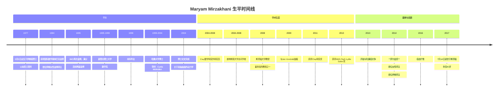
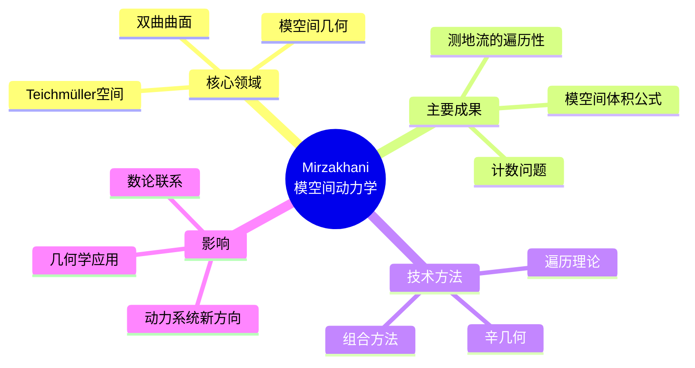
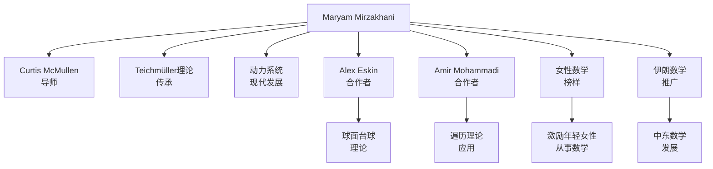

# Maryam Mirzakhani 传记

> "数学之美，只有那些坚持的人才能够发现。"
> —— Maryam Mirzakhani

---

## 一、生平时间线

### 早年与教育 (1977-2004)



### 重要生平节点

| 年份 | 年龄 | 事件 | 意义 |
|------|------|------|------|
| 1977 | 0 | 德黑兰出生 | 伊朗女性数学家的先驱 |
| 1994 | 17 | IMO金牌 | 伊朗女性首金 |
| 1995 | 18 | IMO满分 | 连续两届金牌 |
| 1999 | 22 | 哈佛博士项目 | McMullen门下 |
| 2004 | 27 | 博士毕业 | 动力学与几何 |
| 2008 | 31 | 斯坦福教授 | 年轻有为 |
| 2014 | 37 | **菲尔兹奖** | **首位女性得主** |
| 2017 | 40 | 英年早逝 | 数学界的巨大损失 |

---

## 二、主要数学贡献

### 2.1 模空间动力学 (2004-2010)

**Teichmüller空间与模空间**

Mirzakhani研究了双曲曲面上的动力学：



**主要贡献：**

| 成果 | 描述 | 意义 |
|------|------|------|
| **测地流遍历性** | 证明了Teichmüller测地流的遍历性 | 动力系统里程碑 |
| **模空间体积** | 闭合曲面的模空间体积公式 | 枚举几何基础 |
| **简单闭曲线** | 计数简单闭曲线的渐近公式 | 拓扑学突破 |

### 2.2 双曲曲面的计数几何 (2010-2014)

**Mirzakhani公式**

她发现了计算双曲曲面上测地线数量的公式：

```
在亏格为g的曲面上，长度为L的
简单闭测地线数量的渐近公式。
```

**应用：**
- 弦理论的数学基础
- 枚举几何的新工具
- 与随机矩阵理论的联系

### 2.3 球面台球与动力系统 (2011-2017)

**球面上的台球动力学**

与Eskin、Mohammadi合作：

**主要成果：**
- 证明了球面台球系统的复杂动力学行为
- 解决了长期悬而未决的问题
- 应用遍历理论方法

**技术突破：**
- SL(2,R)作用的分类
- 仿射不变子流形的结构
- 测地流的刚性

### 2.4 与其他领域的联系

**数学物理：**
- 弦理论中的计数问题
- 量子混沌的联系
- 随机几何

**数论：**
- 模形式的联系
- 算术几何
- 分歧覆盖

---

## 三、代表作品分析

### 3.1 博士论文 (2004)

**标题：** "Simple geodesics and Weil-Petersson volumes of moduli spaces of bordered Riemann surfaces"

**核心贡献：**
- 边界的Riemann曲面的模空间体积
- 简单测地线的计数
- 递推公式的发展

**历史地位：**
> "这篇论文开创了模空间计数几何的新方向。"

### 3.2 《Weil-Petersson体积与简单闭测地线》(2007)

**Inventiones Mathematicae发表**

**主要内容：**
- Weil-Petersson体积的计算
- 简单测地线的渐近计数
- 与随机矩阵理论的联系

### 3.3 与Eskin合作系列 (2012-2017)

**球面台球系列论文**

- "Isolation, equidistribution, and orbit closures for the SL(2,R) action on moduli space"
- "Invariant and stationary measures for the SL(2,R) action on moduli space"
- "Orbit closures for the SL(2,R) action on moduli space"

**历史意义：**
- 解决了长期悬案
- 建立了新的理论框架
- 展示了强大的技术能力

---

## 四、学术影响力和传承

### 4.1 学术传承图谱



### 4.2 对现代数学的深远影响

| 领域 | 影响 | 具体体现 |
|------|------|----------|
| **动力系统** | Teichmüller动力学 | 新的研究分支 |
| **几何学** | 模空间几何 | 计数几何工具 |
| **遍历理论** | 新应用 | 台球系统研究 |
| **数学物理** | 弦理论 | 枚举几何应用 |
| **女性数学** | 榜样作用 | 打破性别壁垒 |

### 4.3 学术传承链条

```
Thurston → McMullen → Mirzakhani → Teichmüller动力学
                              ↓
                        现代模空间理论
                              ↓
                        动力系统与几何的交汇
```

---

## 五、个人风格和工作方法

### 5.1 独特的数学视野

**"几何与动力学的结合"**

Mirzakhani相信：

> "理解几何对象的动态行为是理解其结构的最好方式。"

### 5.2 工作方法特点

| 特点 | 描述 | 例子 |
|------|------|------|
| **几何直观** | 强烈的几何直觉 | 双曲曲面的理解 |
| **耐心计算** | 细致的计算能力 | 模空间体积公式 |
| **跨领域** | 结合多个领域 | 遍历理论与几何 |
| **坚持不懈** | 长期专注困难问题 | 台球问题多年研究 |
| **合作精神** | 重要的合作工作 | 与Eskin的合作 |

### 5.3 与女性的数学

**榜样的力量：**

- 首位女性菲尔兹奖得主
- 激励了无数年轻女性追求数学
- 证明了女性在数学最高水平的成就

**Mirzakhani的影响：**

> "她向世界证明，女性可以在数学最高领域取得卓越成就。"

**国际数学妇女节：**

- 2018年起，每年5月12日（她的生日）庆祝
- 全球数学界纪念她的贡献
- 推广女性参与数学

### 5.4 个性与品质

**谦逊：**
- 始终谦虚对待自己的成就
- 强调合作的重要性
- 鼓励年轻数学家

**坚韧：**
- 与癌症抗争多年
- 即使在治疗期间仍坚持研究
- 展示了非凡的勇气

**热情：**
- 对数学的纯粹热爱
- 经常画图辅助思考
- 被称为"数学的涂鸦者"

---

## 六、历史评价和轶事

### 6.1 同时代人的评价

> "Mirzakhani的工作是模空间理论的真正突破。她将动力系统、几何和拓扑完美地结合在一起。"
> —— **Curtis McMullen**

> "她的去世是数学界的巨大损失。她是这一代最杰出的数学家之一。"
> —— **Iranian President Hassan Rouhani**

> "Mirzakhani不仅是一位杰出的数学家，她还激励了世界各地的年轻女性追求数学和科学。"
> —— **Stanford President Marc Tessier-Lavigne**

### 6.2 重要轶事

#### 1. IMO金牌之路

1994年，17岁的Mirzakhani获得IMO金牌，成为首位获得此荣誉的伊朗女性。1995年，她再次获得金牌，且是满分。这开启了她的数学传奇。

#### 2. 菲尔兹奖演讲

2014年在首尔国际数学家大会上，Mirzakhani获得菲尔兹奖。她在演讲中强调了合作的重要性，并鼓励年轻数学家保持好奇心。

#### 3. 涂鸦式工作

Mirzakhani以在超大纸张上画图和涂鸦著称。她的办公室布满手绘的曲面和复杂的图表。她认为画图是理解数学的最好方式。

#### 4. 与病魔的抗争

2013年被诊断出乳腺癌后，Mirzakhani继续她的研究工作。即使在癌症扩散到骨髓后，她仍坚持数学研究，直到生命的最后。

### 6.3 历史地位

**主要荣誉：**
- 1994-1995年：IMO两枚金牌
- 2009年：AMS Ruth Lyttle Satter奖
- 2013年：Clay Research奖
- **2014年：菲尔兹奖（首位女性得主）**

**学术地位：**
- Teichmüller动力学的领军人物
- 模空间几何的开拓者
- 女性数学家的榜样
- 英年早逝的悲剧

---

## 七、相关数学概念链接

### 7.1 核心概念

- [Teichmüller空间](../concept/teichmuller_space.md)
- [模空间](../concept/moduli_space.md)
- [双曲几何](../concept/hyperbolic_geometry.md)
- [遍历理论](../concept/ergodic_theory.md)
- [Weil-Petersson度量](../concept/weil_petersson_metric.md)
- [台球动力系统](../concept/billiard_dynamics.md)

### 7.2 相关数学家

- [Curtis McMullen传记](./29-Curtis_McMullen传记.md)
- [William Thurston传记](./28-William_Thurston传记.md)
- [Alex Eskin传记](./30-Alex_Eskin传记.md)

### 7.3 相关主题

- [Teichmüller理论史](./39-teichmuller理论史.md)
- [模空间几何发展](./40-模空间几何发展.md)
- [女性数学家史](./41-女性数学家史.md)

---

## 八、延伸阅读

### 原始文献

1. Mirzakhani, M. (2007). "Simple geodesics and Weil-Petersson volumes of moduli spaces of bordered Riemann surfaces"
2. Mirzakhani, M. (2007). "Weil-Petersson volumes and intersection theory on the moduli space of curves"
3. Eskin, A. & Mirzakhani, M. (2013). "Invariant and stationary measures for the SL(2,R) action on moduli space"
4. Eskin, A., Mirzakhani, M. & Mohammadi, A. (2015). "Isolation, equidistribution, and orbit closures for the SL(2,R) action on moduli space"

### 传记与研究

1. Stanford University (2017). "Maryam Mirzakhani, Stanford mathematician and Fields Medal winner, dies"
2. IMU (2014). "Fields Medal Citation for Maryam Mirzakhani"
3. Gessen, M. (2017). "The Beautiful Mind of Maryam Mirzakhani" (New York Times)
4. Various (2017). "Remembering Maryam Mirzakhani" (AMS Notices)

---

**创建日期：** 2026年4月  
**最后更新：** 2026年4月  
**文档类别：** 数学史 - 20世纪数学大师
