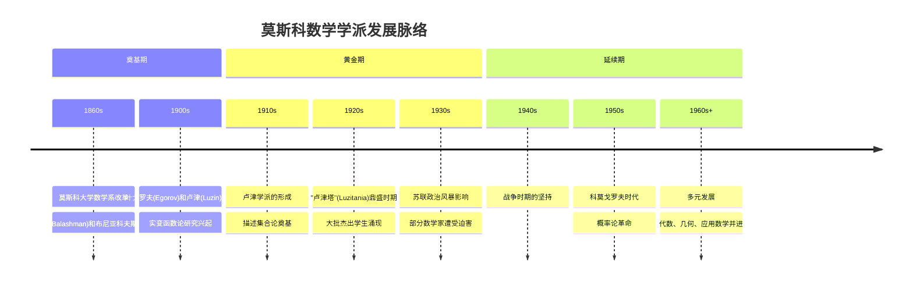
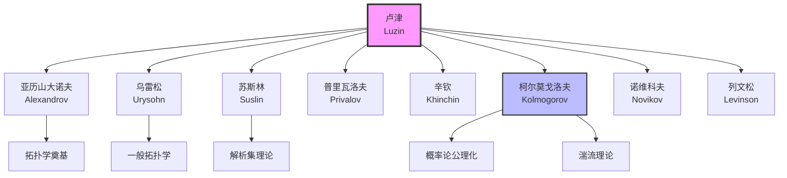
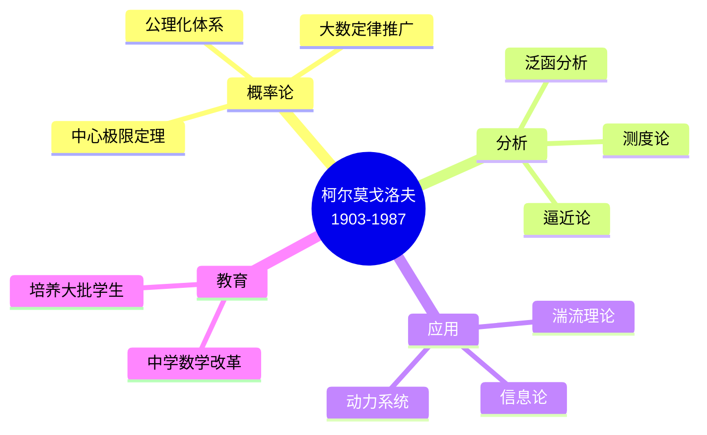
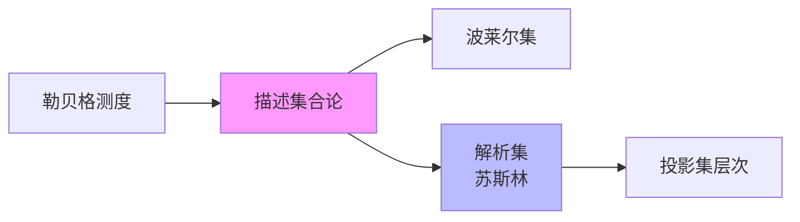
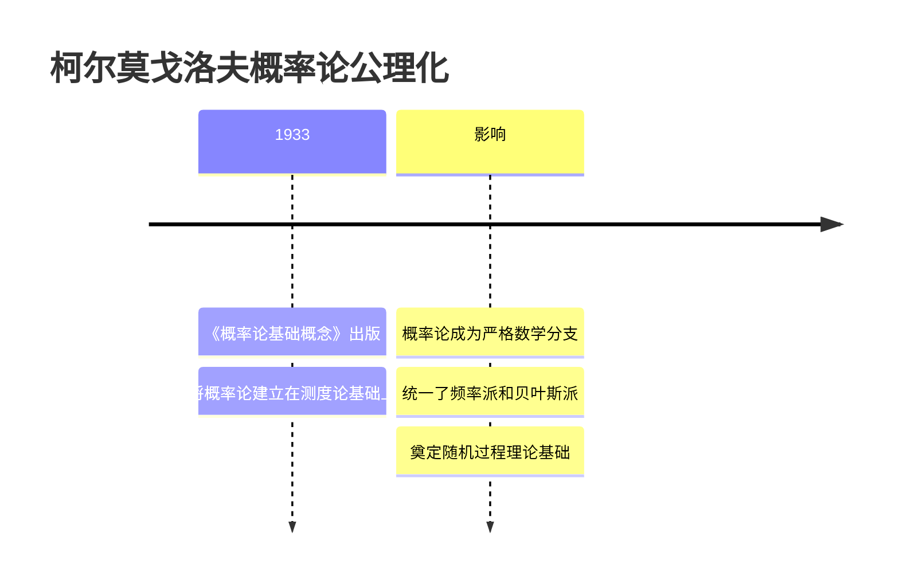
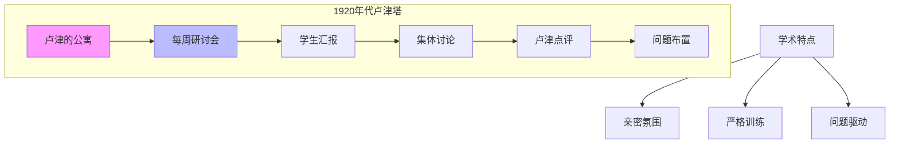
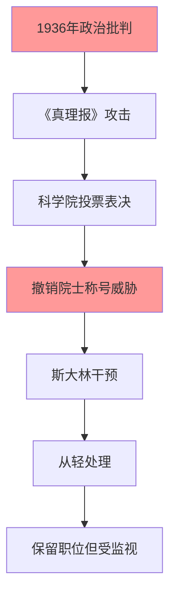

# 莫斯科数学学派史

## 概述

莫斯科数学学派（Moscow Mathematical School）是20世纪上半叶形成的最重要的数学学派之一，在实分析、描述集合论、拓扑学和概率论等领域做出了开创性贡献。该学派以莫斯科大学为中心，形成了独特的数学传统和研究风格。

---

## 历史形成

### 时代背景

### 形成因素

1. **德国数学影响**：特别是魏尔斯特拉斯学派的严格分析传统
2. **法国函数论**：勒贝格积分理论的引入
3. **本土传统**：俄罗斯数学的深厚积累
4. **学术环境**：莫斯科大学的自由学术氛围（1920年代前）

---

## 核心人物

### 奠基者

#### 德米特里·叶戈罗夫 (Dmitri Egorov, 1869-1931)

| 方面 | 内容 |
|------|------|
| **职位** | 莫斯科大学教授 |
| **主要贡献** | 叶戈罗夫定理（关于可测函数序列的收敛） |
| **影响** | 卢津的导师，莫斯科分析学派的直接奠基人 |
| **悲剧** | 因宗教原因遭受政治迫害，死于流放中 |

**叶戈罗夫定理**：
> 若可测函数序列 $f_n$ 几乎处处收敛于 $f$，则在除去一个任意小测度的集合外，收敛是一致收敛。

#### 尼古拉·卢津 (Nikolai Luzin, 1883-1950)

| 方面 | 内容 |
|------|------|
| **昵称** | "教父"（卢津塔时期） |
| **主要贡献** | 描述集合论、解析集合理论 |
| **教学** | 培养了大批著名数学家 |
| **争议** | 1936年遭受政治批判（"卢津案"） |

### 黄金一代学生

### 主要成员详细介绍

#### 1. 帕维尔·亚历山大诺夫 (Pavel Alexandrov, 1896-1982)

- **贡献**：一般拓扑学奠基人之一
- **成就**：紧致化理论、同调拓扑
- **合作**：与乌雷松共同建立点集拓扑基础
- **地位**：苏联数学家协会主席

#### 2. 帕维尔·乌雷松 (Pavel Urysohn, 1898-1924)

- **贡献**：度量空间理论、维数理论
- **悲剧**：26岁溺亡于法国布列塔尼海岸
- **遗产**：乌雷松引理（拓扑学基本定理）

**乌雷松引理**：
> 在正规空间中，任意两个不相交闭集可以被连续函数分离。

#### 3. 米哈伊尔·苏斯林 (Mikhail Suslin, 1894-1919)

- **贡献**：解析集合理论（A-集合）
- **悲剧**：25岁因斑疹伤寒去世
- **遗产**：苏斯林定理、苏斯林假设（集合论）

#### 4. 安德烈·柯尔莫戈洛夫 (Andrei Kolmogorov, 1903-1987)

| 成就 | 描述 |
|------|------|
| **1933** | 建立概率论公理化体系 |
| **1941** | 湍流理论的局部各向同性理论 |
| **1950s** | 动力系统与信息论 |
| **教育** | 推动苏联数学教育改革 |

---

## 主要数学贡献

### 1. 实分析与描述集合论

**核心成就**：
- 建立了分析集合（Analytic Sets）的理论
- 研究了投影集层次结构
- 证明了卢津第一原理和第二原理

### 2. 一般拓扑学

**莫斯科拓扑学派的贡献**：

| 概念 | 贡献者 | 意义 |
|------|--------|------|
| 紧致性 | 亚历山大诺夫 | 一般拓扑核心概念 |
| 连通性 | 亚历山大诺夫-乌雷松 | 拓扑空间基本性质 |
| 维数理论 | 乌雷松 | 拓扑不变量 |
| 一致空间 | 韦伊（受影响） | 拓扑与度量之间的结构 |

### 3. 概率论

**柯尔莫戈洛夫革命**（1933）：

**主要贡献**：
- 概率空间的形式化定义 $(\Omega, \mathcal{F}, P)$
- 条件期望的严格定义
- 大数定律和中心极限定理的一般形式
- 马尔可夫过程理论

### 4. 其他领域

- **解析函数论**：普里瓦洛夫、戈卢别夫
- **数论**：辛钦（丢番图逼近）、盖尔方德（超越数论）
- **泛函分析**：盖尔范德学派的发展
- **微分方程**：彼得罗夫斯基、庞特里亚金

---

## 学术特色

### 莫斯科风格的特点

1. **问题导向**：重视具体问题的求解
2. **理论深度**：追求概念的本质理解
3. **严格与直观并重**：既有严格证明，又重视几何直观
4. **学派传承**：师徒制度，集体讨论

### "卢津塔"（Luzitania）

- **会议形式**：卢津家中每周聚会
- **学习方式**：学生轮流报告，集体讨论
- **研究氛围**：亲密但严格的师徒关系
- **培养成果**：培养了数十名著名数学家

---

## 历史影响

### 对世界数学的影响

| 方面 | 影响 |
|------|------|
| **分析学** | 现代实变函数论的基础 |
| **拓扑学** | 点集拓扑的奠基性工作 |
| **概率论** | 公理化体系影响至今 |
| **集合论** | 描述集合论的重要贡献 |

### 与中国数学的联系

- **华罗庚**：受维诺格拉多夫影响，但间接受到莫斯科学派影响
- **吴文俊**：拓扑学研究受益于亚历山大诺夫的著作
- **关肇直**：在莫斯科大学学习，带回泛函分析
- **中国科学院**：1950年代学习苏联，莫斯科教材广泛使用

---

## 政治风暴与悲剧

### 叶戈罗夫案（1930）

- **原因**：虔诚的宗教信仰，反对苏联教育政策
- **结果**：被剥夺教职，流放至喀山，1931年去世

### 卢津案（1936）

- **指控**：学术剽窃、亲西方、反苏维埃
- **背景**：大清洗时期的政治氛围
- **结果**：卢津认错，保留职位但不再活跃

### 学派的延续

尽管政治迫害造成损失，莫斯科数学学派仍延续并发展：
- 柯尔莫戈洛夫成为新领袖
- 盖尔范德建立新的代数-分析学派
- 数学教育传统保持

---

## 相关概念链接

- [测度论](../40-分析学/02-测度论.md)
- [概率论基础](../60-概率统计/01-概率论基础.md)
- [点集拓扑](../30-几何拓扑/01-拓扑学基础.md)
- [集合论](../00-基础/02-集合论进阶.md)
- [描述集合论](../00-基础/04-描述集合论.md)
- [泛函分析](../40-分析学/06-泛函分析.md)

---

## 参考文献

1. Graham, L. R., & Kantor, J.-M. (2009). *Naming Infinity*. Harvard University Press.
2. Kutateladze, S. S. (2007). "The Tragedy of Mathematics in Russia". *Siberian Electronic Mathematical Reports*.
3. Lorentz, G. G. (2002). "Mathematics and Politics in the Soviet Union from 1928 to 1953". *Journal of Approximation Theory*.
4. 亚历山大洛夫等. 《数学：它的内容、方法和意义》. 科学出版社.
5. 柯尔莫戈洛夫. 《概率论基础》. 莫斯科，1933.

---

*文档创建时间：2026年4月*  
*最后更新：2026年4月*  
*分类：数学史 / 数学学派 / 俄罗斯数学*
