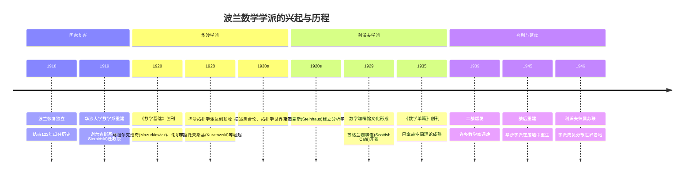
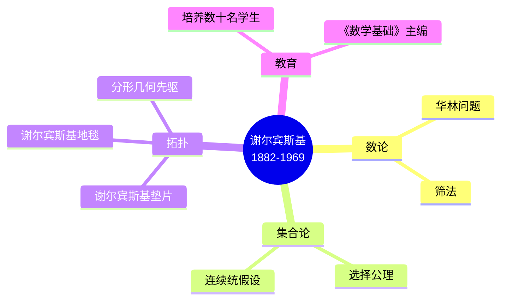
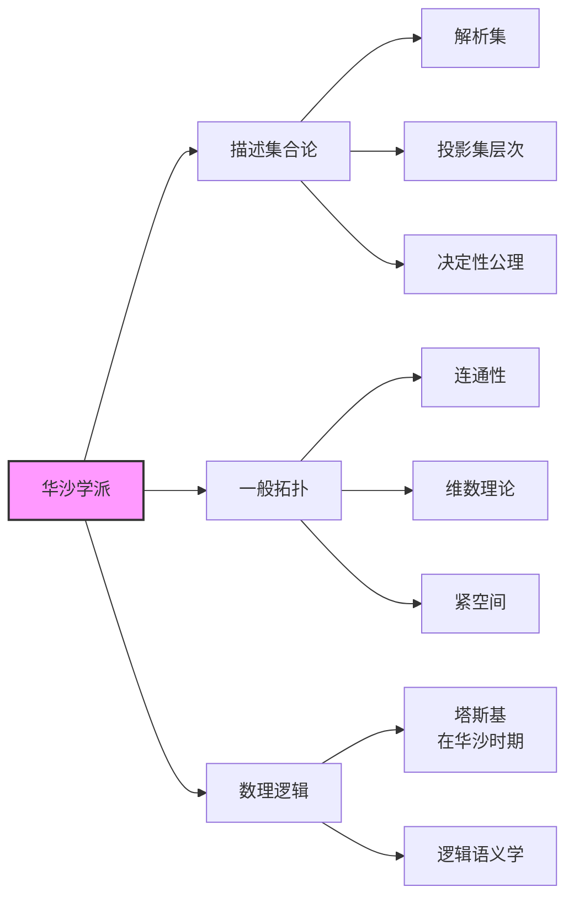
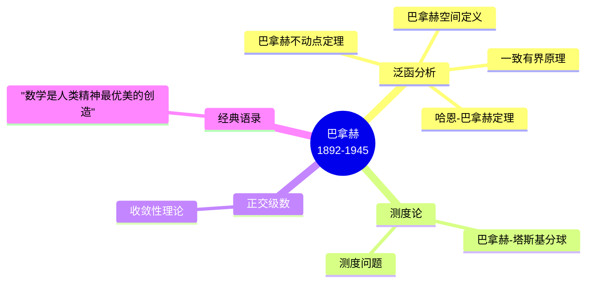
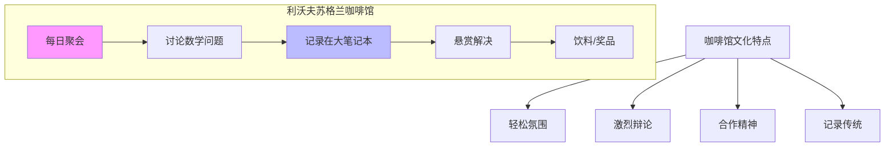
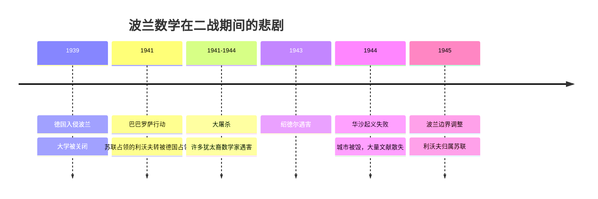
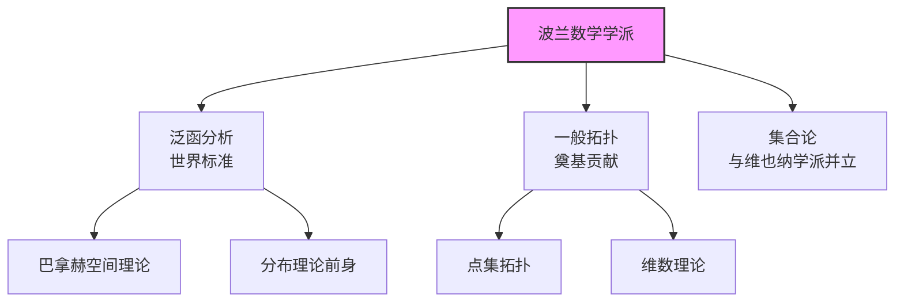

# 波兰数学学派史

## 概述

波兰数学学派（Polish School of Mathematics）是两次世界大战之间（1918-1939）最辉煌的数学学派之一，在拓扑学、集合论、泛函分析等领域做出了奠基性贡献。该学派以华沙和利沃夫为中心，形成了独特的数学文化和研究传统。

---

## 历史背景

### 民族复兴与数学崛起

### 复兴背景

1. **国家独立**（1918）：结束被俄、普、奥瓜分的历史
2. **学术传统**：19世纪已有扎雷姆巴(Zaremba)等优秀数学家
3. **德国影响**：部分学者在德国学习，带回严格数学传统
4. **期刊创办**：国际数学期刊的创立提升国际地位

---

## 华沙学派

### 核心人物

#### 瓦茨瓦夫·谢尔宾斯基 (Wacław Sierpiński, 1882-1969)

| 方面 | 详情 |
|------|------|
| **职位** | 华沙大学教授，波兰数学界领袖 |
| **研究** | 数论、集合论、拓扑学 |
| **代表成果** | 谢尔宾斯基三角形/垫片（分形经典） |
| **教育贡献** | 培养了库拉托夫斯基等大批学生 |

#### 卡齐米日·库拉托夫斯基 (Kazimierz Kuratowski, 1896-1980)

- **贡献**：一般拓扑学、集合论
- **定理**：库拉托夫斯基闭包-补集定理（14集定理）
- **教材**：《拓扑学》成为经典
- **管理**：战后波兰数学的重建者

**库拉托夫斯基14集定理**：
> 在拓扑空间中，由一个集合出发，反复应用闭包和补集运算，最多只能得到14个不同的集合。

#### 斯特凡·马祖尔克维奇 (Stefan Mazurkiewicz, 1888-1945)

- **贡献**：拓扑学、概率论
- **成就**：连续统的拓扑刻画
- **悲剧**：二战期间在华沙去世

### 华沙学派的研究领域

### 期刊：《数学基础》

- **创刊**：1920年
- **主编**：谢尔宾斯基、马祖尔克维奇
- **特色**：专注于集合论、拓扑学、数理逻辑
- **影响**：世界范围内这些领域的顶级期刊

---

## 利沃夫学派

### 核心人物

#### 斯坦尼斯瓦夫·斯坦豪斯 (Stanisław Steinhaus, 1887-1972)

| 方面 | 详情 |
|------|------|
| **经历** | 哥廷根学习，受希尔伯特影响 |
| **贡献** | 将泛函分析引入波兰 |
| **发现** | "发现"巴拿赫（见下文轶事） |
| **兴趣** | 应用数学、概率论、博弈论 |

**发现巴拿赫的轶事**：
> 1916年，斯坦豪斯在克拉科夫的公园里听到两个年轻人在讨论数学问题。他加入讨论，发现其中一人（巴拿赫）有非凡天赋。斯坦豪斯将巴拿赫带到利沃夫，开启了他的学术生涯。

#### 斯特凡·巴拿赫 (Stefan Banach, 1892-1945)

**巴拿赫主要定理**：

| 定理 | 内容 | 重要性 |
|------|------|--------|
| **哈恩-巴拿赫定理** | 范数空间上线性泛函的延拓 | 泛函分析基石 |
| **巴拿赫不动点定理** | 压缩映射有唯一不动点 | 微分方程、数值分析 |
| **一致有界原理** | 逐点有界则一致有界 | 强大分析工具 |
| **开映射定理** | 满射连续线性算子是开映射 | 泛函分析基本 |

### 数学咖啡馆文化

#### 苏格兰咖啡馆 (Scottish Café)

- **地点**：利沃夫苏格兰咖啡馆（Kawiarnia Szkocka）
- **时间**：1930年代，每天下午
- **活动**：数学家聚会，讨论问题，记录在大笔记本
- **特色**：提出问题的数学家往往提供奖品（香槟、咖啡等）

#### 《苏格兰书》(The Scottish Book)

| 属性 | 详情 |
|------|------|
| **内容** | 收录1935-1941年间提出的数学问题 |
| **数量** | 约200个问题 |
| **悬赏** | 从一杯咖啡到活鹅不等 |
| **命运** | 战前由巴拿赫夫人保存，战后由乌拉姆带到美国 |
| **出版** | 1957年以英文出版 |

**著名问题示例**：
- **问题153**：巴拿赫本人提出的问题（关于巴拿赫空间）
- **问题1**：马祖尔提出，悬赏一瓶红酒（已解决）
- **关于活鹅的悬赏**：马祖尔为某个泛函分析问题悬赏一只活鹅，40年后瑞典数学家解决后真的收到了活鹅

### 其他重要成员

#### 胡戈·施泰因豪斯 (Hugo Steinhaus)

与斯坦尼斯瓦夫·斯坦豪斯（同名）共同工作，但主要指上述的斯坦豪斯。

#### 马切伊·马祖尔 (Stanisław Mazur, 1905-1981)

- 巴拿赫的学生
- 在局部凸空间方面的工作
- 《苏格兰书》的主要贡献者

#### 胡利安·绍德尔 (Juliusz Schauder, 1899-1943)

- **贡献**：非线性泛函分析
- **定理**：绍德尔不动点定理、勒雷-绍度
- **悲剧**：二战期间被纳粹杀害

---

## 主要数学贡献

### 1. 泛函分析的诞生

**波兰学派的独特贡献**：
- 巴拿赫空间的系统理论
- 线性算子谱理论
- 对偶空间和对偶算子
- 不动点理论

### 2. 拓扑学

| 领域 | 贡献者 | 成果 |
|------|--------|------|
| **维数理论** | 马祖尔克维奇 | 拓扑维数的刻画 |
| **连通性** | 库拉托夫斯基 | 图论和拓扑的深刻联系 |
| **收缩核** | 波尔苏克(Borsuk) | 收缩核理论 |
| **纤维空间** | 波尔苏克 | 形状理论的先驱 |

### 3. 集合论与逻辑

- **描述集合论**：华沙学派与莫斯科学派平行发展
- **塔斯基的语义学**：在华沙时期奠定基础
- **选择公理**：谢尔宾斯基深入研究

### 4. 其他领域

- **概率论**：斯坦豪斯的公理化尝试
- **博弈论**：早期贡献
- **逼近论**：巴拿赫空间中的应用

---

## 学术特色

### 波兰数学的特点

1. **集中策略**：专注于少数几个领域，做到世界顶尖
2. **国际合作**：积极吸收德、法、俄等国的先进成果
3. **期刊导向**：通过高质量期刊建立国际声誉
4. **集体讨论**：咖啡馆文化促进合作

### 战略选择

> 谢尔宾斯基等人的战略决策：
> "由于波兰数学家人数有限，不应试图在所有领域竞争，而应选择少数几个有传统、有天赋的领域，集中力量做到世界最好。"

**选择的领域**：
- 集合论、拓扑学（华沙）
- 泛函分析（利沃夫）
- 避开：代数、数论等传统强国占优的领域

---

## 悲剧与延续

### 二战期间的损失

### 遇难的数学家

| 数学家 | 生卒年 | 命运 |
|--------|--------|------|
| 胡利安·绍德尔 | 1899-1943 | 被纳粹杀害 |
| 斯塔尼斯拉夫·萨克斯 | 1897-1942 | 被纳粹杀害 |
| 其他人 | ... | 大量犹太裔数学家遇难 |

### 战后重建

#### 华沙学派的重生

- **库拉托夫斯基的领导**：战后数学的重建者
- **新期刊**：继续《数学基础》
- **新领域**：代数拓扑、范畴论等

#### 利沃夫学派的分散

- **斯坦豪斯**：在弗罗茨瓦夫重建
- **乌拉姆**：移民美国，参与曼哈顿计划
- **卡茨**：移民美国，概率论贡献
- **巴拿赫**：1945年因肺癌去世，年仅53岁

---

## 世界影响

### 对美国数学的影响

许多波兰数学家移民美国：
- **斯塔尼斯拉夫·乌拉姆 (Ulam)**：参与曼哈顿计划，提出氢弹设计
- **马克·卡茨 (Kac)**：概率论、统计物理
- **安托尼·齐格蒙特 (Zygmund)**：芝加哥大学，调和分析学派

### 国际声誉

---

## 相关概念链接

- [泛函分析基础](../40-分析学/06-泛函分析.md)
- [拓扑学基础](../30-几何拓扑/01-拓扑学基础.md)
- [集合论](../00-基础/02-集合论进阶.md)
- [测度论](../40-分析学/02-测度论.md)
- [巴拿赫空间](../40-分析学/07-巴拿赫空间.md)
- [分形几何](../30-几何拓扑/30-分形几何.md)
- [数理逻辑](../00-基础/03-数理逻辑.md)

---

## 参考文献

1. Kahane, J.-P. (1991). "Polish Mathematics Between the Wars". *Proceedings of the International Conference on Complex Analysis and Applications*.
2. Kaluza, R. (1996). *The Life of Stefan Banach*. Birkhäuser.
3. Mauldin, R. D. (Ed.). (1981). *The Scottish Book*. Birkhäuser.
4. Ulam, S. M. (1976). *Adventures of a Mathematician*. Scribner.
5. 巴拿赫 (1932). *Théorie des Opérations Linéaires*. 华沙.

---

*文档创建时间：2026年4月*  
*最后更新：2026年4月*  
*分类：数学史 / 数学学派 / 波兰数学*
