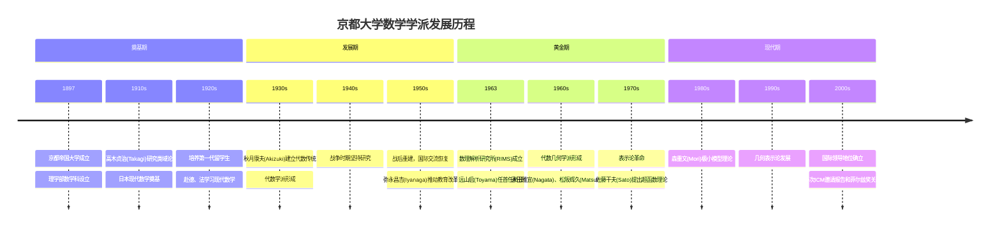
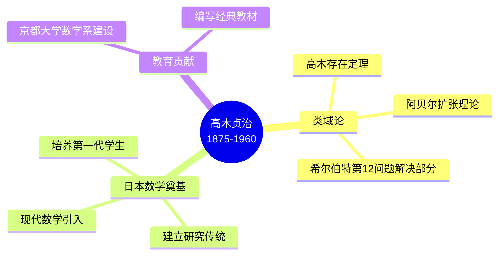
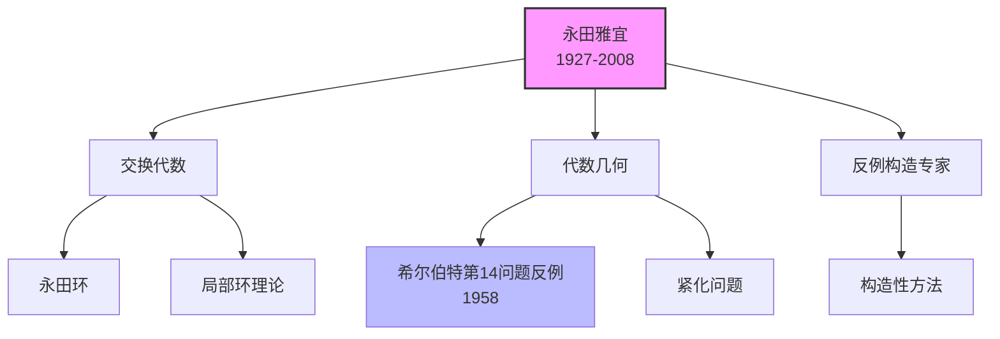
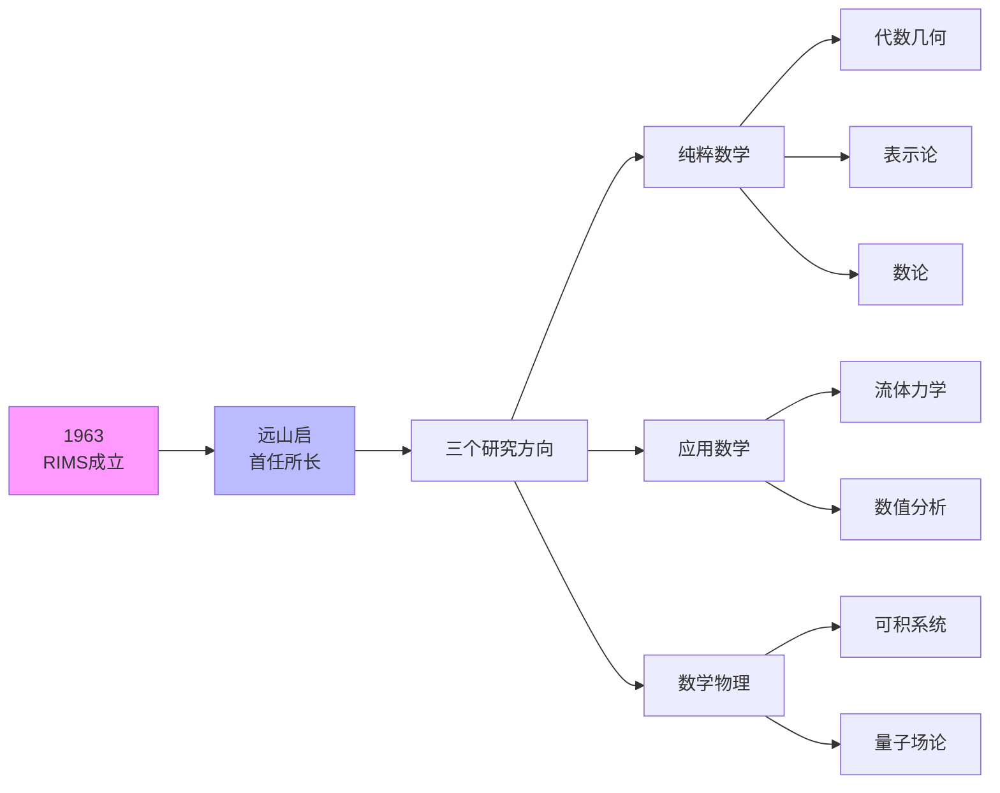
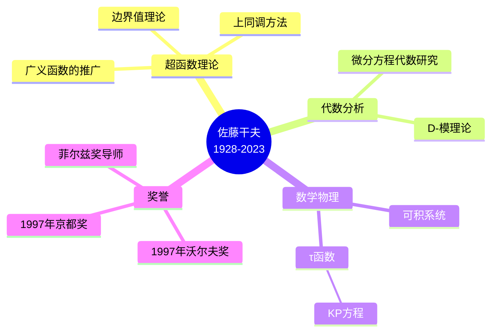
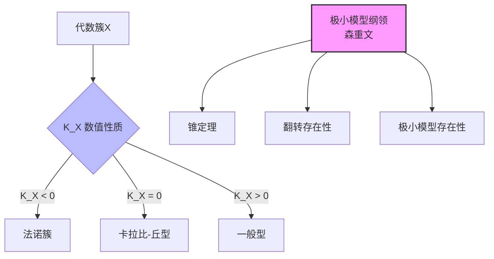
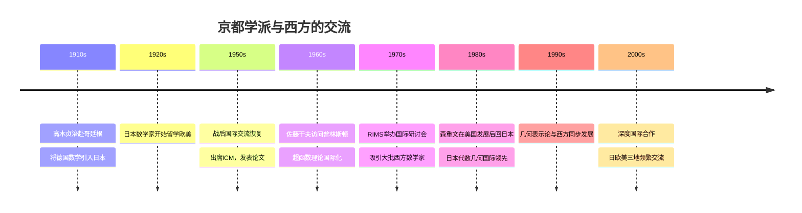
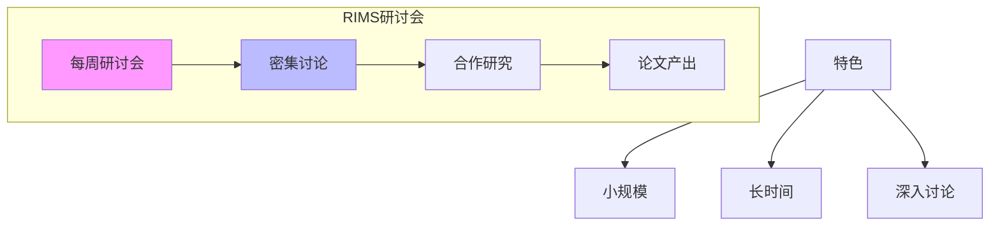
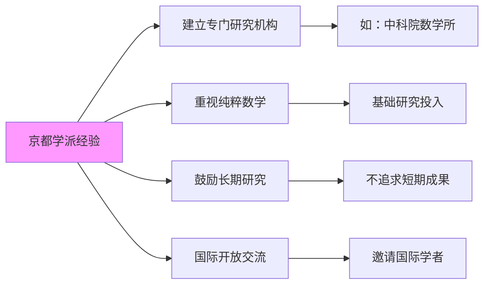

# 京都大学数学学派史

## 概述

京都大学数学学派是20世纪日本现代数学的代表，在代数几何、表示论、数论等领域取得了世界级成就。以京都大学数理解析研究所（RIMS）为核心，该学派形成了独特的数学风格，在日本数学现代化进程中发挥了关键作用，并与西方数学界建立了深度交流。

---

## 历史发展

### 形成脉络

---

## 奠基人物

### 高木贞治 (Teiji Takagi, 1875-1960)

| 方面 | 详情 |
|------|------|
| **学习经历** | 德国哥廷根，受希尔伯特影响 |
| **主要贡献** | 类域论（1920）：描述阿贝尔扩张 |
| **历史地位** | 日本现代数学之父 |
| **代表成果** | 高木存在定理、高木群 |

**类域论的意义**：
> 高木贞治在1920年解决了希尔伯特第9问题的一部分，建立了类域论的基本框架。这一理论描述了数域的阿贝尔扩张，被韦伊誉为"数学史上最优美的理论之一"。

---

## 代数几何学派

### 早期发展

#### 秋月康夫 (Yasuo Akizuki, 1902-1984)

- **贡献**：日本交换代数奠基
- **成就**：秋月-柯恩定理（关于诺特环）
- **影响**：培养了日本第一代代数几何学家

#### 永田雅宜 (Masayoshi Nagata, 1927-2008)

**主要成就**：
- 希尔伯特第14问题的反例（1958年ICM报告）
- 永田紧化、永田环
- 代数几何中的构造性方法

### 松阪辉久 (Tatsuo Matsusaka, 1926-2006)

- **贡献**：代数簇的理论
- **成就**：松阪判别法、皮卡簇理论
- **经历**：美国普渡大学教授，架起美日数学桥梁

---

## 数理解析研究所 (RIMS)

### 成立与发展

### RIMS的特色

| 特色 | 说明 |
|------|------|
| **综合研究** | 纯粹与应用数学并重 |
| **访问学者** | 大量国际交流 |
| **研讨会** | 持续的专业研讨会制度 |
| **出版物** | *Publications of RIMS* |

---

## 革命性突破

### 1. 佐藤超函数理论

#### 佐藤干夫 (Mikio Sato, 1928-2023)

**超函数理论**（1958）：

> 佐藤干夫将超函数定义为全纯函数的边界值，这一概念统一了广义函数和解析函数论。他发展了一套完整的代数分析学框架，将微分方程的研究提升到上同调代数的高度。

**代数分析学**：
- D-模理论（与柏原正树共同）
- 微局部分析
- 联系层理论

### 2. 森重文的极小模型纲领

#### 森重文 (Shigefumi Mori, 1951-)

| 方面 | 详情 |
|------|------|
| **主要贡献** | 三维代数簇的极小模型理论 |
| **年份** | 1980年代 |
| **荣誉** | 1990年菲尔兹奖 |
| **方法** | 锥定理、翻转、翻转手术 |

**极小模型纲领**：

**历史意义**：
- 完成了代数曲面分类到三维的推广
- 建立了高维双有理几何的框架
- 影响了代数几何数十年的发展

### 3. 几何表示论

#### 林节夫、中岛启等

- **发展**：1980年代至今
- **特点**：用几何方法研究表示论
- **核心**： Nakajima quiver variety（中岛箭图簇）
- **应用**：李理论、统计力学、量子场论

---

## 与西方数学的交流

### 国际影响

### 重要交流事件

| 时间 | 事件 | 意义 |
|------|------|------|
| **1920** | 高木报告类域论 | 日本数学首次世界级贡献 |
| **1955** | 小平邦彦获菲尔兹奖 | 日本首个菲尔兹奖（虽非京都出身） |
| **1970** | 广中平祐获菲尔兹奖 | 奇点消解理论 |
| **1990** | 森重文获菲尔兹奖 | 京都学派首次菲尔兹奖 |
| **2003** | 谷崎让获菲尔兹奖（部分贡献） | 几何表示论 |

### 国际数学家大会(ICM)报告

京都学派数学家在ICM的报告：
- **1970年（尼斯）**：佐藤干夫（邀请报告）
- **1978年（赫尔辛基）**：永田雅宜（邀请报告）
- **1990年（京都）**：森重文（全会报告，菲尔兹奖）
- **2018年（里约）**： 佐佐木洋（邀请报告）

---

## 学术特色

### 京都风格的特点

1. **抽象与具体结合**：既重视抽象理论，又关注具体例子
2. **代数方法**：善于用代数工具解决几何问题
3. **长期深入**：一个问题可以研究数十年
4. **师徒传承**：严格的师徒制度

### RIMS研讨会文化

---

## 当代中国数学的联系

### 学术交流

- **留日学习**：中国早期数学家多留日学习
  - 陈建功：东北帝国大学
  - 苏步青：东北帝国大学
  - 江泽涵：哈佛大学，但受日本影响

- **现代交流**：
  - 中日数学会议
  - 代数几何、表示论领域的合作
  - 学生交换项目

### 影响与启发

---

## 传承与当代

### 第三代及以后

| 代际 | 代表数学家 | 研究领域 |
|------|-----------|---------|
| **第一代** | 高木贞治 | 类域论 |
| **第二代** | 秋月康夫、弥永昌吉 | 代数、代数几何 |
| **第三代** | 佐藤干夫、永田雅宜 | 代数分析、代数几何 |
| **第四代** | 森重文、中岛启 | 双有理几何、表示论 |
| **第五代** | 川又雄二郎、坂井秀隆 | 导出范畴、计数几何 |

### 当代研究方向

- **双有理几何**：森重文延续研究
- **导出代数几何**：桥本、川又
- **几何表示论**：中岛学派
- **数学物理**：可积系统、超弦理论
- **算术几何**：数论与代数几何交叉

---

## 相关概念链接

- [代数几何基础](../20-代数学/10-代数几何.md)
- [双有理几何](../20-代数学/12-双有理几何.md)
- [表示论](../20-代数学/04-表示论.md)
- [类域论](../20-代数学/14-类域论.md)
- [代数曲面](../20-代数学/11-代数曲面.md)
- [D-模理论](../20-代数学/15-D-模.md)
- [高木贞治](../10-数学家/10-高木贞治.md)
- [森重文](../10-数学家/10-森重文.md)

---

## 参考文献

1. Mori, S. (1988). "Flip theorem and the existence of minimal models for 3-folds". *Journal of the AMS*.
2. Sato, M. (1959). "Theory of hyperfunctions". *Journal of the Faculty of Science, University of Tokyo*.
3. Takagi, T. (1920). "Über eine Theorie des relativ-Abelschen Zahlkörpers". *Journal of the College of Science, Imperial University of Tokyo*.
4. Nagata, M. (1960). "On the fourteenth problem of Hilbert". *Proceedings of the International Congress of Mathematicians*.
5. 日本数学会 (编). 《数学史研究》. 各期.
6. 弥永昌吉、小平邦彦 (1961). 《现代数学の展望》. 岩波书店.

---

*文档创建时间：2026年4月*  
*最后更新：2026年4月*  
*分类：数学史 / 数学学派 / 日本数学*
