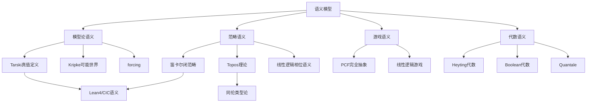

---
msc_primary:
  - 00A99
  - 03C90
  - 03B35
title: 语义模型
processed_at: '2026-04-05'
---

# 语义模型

**最后更新**: 2026年4月20日

---

## 1. 引言与动机

语义模型（Semantic Models）是数理逻辑、理论计算机科学与数学基础的交叉核心领域。它研究形式语言、逻辑系统与计算过程的**意义赋予机制**——即如何从抽象的句法结构过渡到具体的数学解释。从Tarski的真值定义到Scott的域理论，从Kripke的可能世界语义到Girard的线性逻辑相位语义，语义模型为我们理解"证明即程序、公式即类型"的深刻同构提供了坚实的数学基础。

语义模型不仅是逻辑学的理论工具，更是现代程序验证、类型系统设计、函数式语言实现以及形式化数学的基石。在Lean4、Coq等定理证明器中，CIC（Calculus of Inductive Constructions）的语义解释直接决定了其表达能力与可靠性边界。

---

## 2. 严格数学定义

### 2.1 一阶结构的Tarski语义

**定义 2.1（一阶结构）**
设 $\mathcal{L}$ 为一阶语言，其符号集包含函数符号 $\mathcal{F}$、关系符号 $\mathcal{R}$ 和常数符号 $\mathcal{C}$。一个 $\mathcal{L}$**-结构** $\mathfrak{A}$ 是一个二元组 $(A, \mathcal{I})$，其中：

- $A$ 为非空集合，称为**论域**（domain）
- $\mathcal{I}$ 为**解释函数**，满足：
  - 对每个 $n$ 元函数符号 $f \in \mathcal{F}$，$\mathcal{I}(f): A^n \to A$
  - 对每个 $n$ 元关系符号 $R \in \mathcal{R}$，$\mathcal{I}(R) \subseteq A^n$
  - 对每个常数符号 $c \in \mathcal{C}$，$\mathcal{I}(c) \in A$

**定义 2.2（变量赋值与项解释）**
设 $\mathfrak{A} = (A, \mathcal{I})$ 为 $\mathcal{L}$-结构，变量赋值函数 $\sigma: \text{Var} \to A$。项 $t$ 在赋值 $\sigma$ 下的解释 $t^{\mathfrak{A},\sigma}$ 递归定义为：

- 若 $t = x$ 为变量，则 $t^{\mathfrak{A},\sigma} = \sigma(x)$
- 若 $t = c$ 为常数，则 $t^{\mathfrak{A},\sigma} = \mathcal{I}(c)$
- 若 $t = f(t_1, \ldots, t_n)$，则 $t^{\mathfrak{A},\sigma} = \mathcal{I}(f)(t_1^{\mathfrak{A},\sigma}, \ldots, t_n^{\mathfrak{A},\sigma})$

**定义 2.3（满足关系）**
公式 $\varphi$ 在结构 $\mathfrak{A}$ 与赋值 $\sigma$ 下**满足**，记作 $\mathfrak{A} \models \varphi[\sigma]$，递归定义如下：

- $\mathfrak{A} \models R(t_1, \ldots, t_n)[\sigma]$ 当且仅当 $(t_1^{\mathfrak{A},\sigma}, \ldots, t_n^{\mathfrak{A},\sigma}) \in \mathcal{I}(R)$
- $\mathfrak{A} \models (t_1 = t_2)[\sigma]$ 当且仅当 $t_1^{\mathfrak{A},\sigma} = t_2^{\mathfrak{A},\sigma}$
- $\mathfrak{A} \models (\varphi \wedge \psi)[\sigma]$ 当且仅当两者皆满足
- $\mathfrak{A} \models (\neg \varphi)[\sigma]$ 当且仅当不满足 $\varphi$
- $\mathfrak{A} \models (\forall x \, \varphi)[\sigma]$ 当且仅当对所有 $a \in A$，$\mathfrak{A} \models \varphi[\sigma[x/a]]$

其中 $\sigma[x/a]$ 表示将 $x$ 映射到 $a$、其余与 $\sigma$ 相同的赋值。

### 2.2 类型论语义：范畴语义

**定义 2.4（笛卡尔闭范畴，CCC）**
一个范畴 $\mathcal{C}$ 称为**笛卡尔闭范畴**，如果：

1. 存在终对象 $\mathbf{1}$
2. 任意对象 $A, B$ 存在乘积 $A \times B$ 及投射 $\pi_1: A \times B \to A$，$\pi_2: A \times B \to B$
3. 任意对象 $A, B$ 存在指数对象 $B^A$（亦记 $A \Rightarrow B$）及求值态射 $\text{ev}: B^A \times A \to B$

指数对象满足泛性质：对任意 $f: C \times A \to B$，存在唯一的 $\lambda f: C \to B^A$ 使得下图交换：

$$
\begin{array}{ccc}
B^A \times A & \xrightarrow{\text{ev}} & B \\
\lambda f \times \text{id}_A \uparrow & & \uparrow f \\
C \times A & = & C \times A
\end{array}
$$

**定义 2.5（简单类型 $\lambda$ 演算的语义）**
设 $\mathcal{C}$ 为CCC。一个**解释** $[-]$ 将类型与项映到 $\mathcal{C}$ 的对象与态射：

- 基本类型 $b$ 对应对象 $[b]$
- 函数类型：$[A \to B] = [B]^{[A]}$
- 积类型：$[A \times B] = [A] \times [B]$
- 变量上下文：$[\Gamma] = [A_1] \times \cdots \times [A_n]$（对 $\Gamma = x_1:A_1, \ldots, x_n:A_n$）
- $\lambda$-抽象：$[\Gamma \vdash \lambda x:A.\, M : A \to B] = \lambda([\Gamma, x:A \vdash M : B])$
- 应用：$[\Gamma \vdash M\,N : B] = \text{ev} \circ \langle [M], [N] \rangle$

---

## 3. 核心定理与证明

### 定理 3.1（Tarski真值定义的唯一性）

对任意一阶结构 $\mathfrak{A}$、赋值 $\sigma$ 和公式 $\varphi$，满足关系 $\mathfrak{A} \models \varphi[\sigma]$ 被唯一确定。

**证明**：我们通过对公式 $\varphi$ 的结构进行归纳证明。

**基例**：若 $\varphi$ 为原子公式 $R(t_1, \ldots, t_n)$ 或等式 $t_1 = t_2$，定义2.3已直接给出唯一判定条件，取决于项解释的唯一性（由定义2.2递归唯一确定）。

**归纳步骤**：假设对复杂度小于 $\varphi$ 的所有公式，满足关系唯一确定。

- 若 $\varphi = \neg \psi$，则 $\mathfrak{A} \models \varphi[\sigma]$ 当且仅当 $\mathfrak{A} \not\models \psi[\sigma]$。由归纳假设，右侧条件唯一确定，故左侧亦然。
- 若 $\varphi = \psi \wedge \chi$，则 $\mathfrak{A} \models \varphi[\sigma]$ 当且仅当两者同时满足，由归纳假设唯一确定。
- 若 $\varphi = \forall x \, \psi$，则 $\mathfrak{A} \models \varphi[\sigma]$ 当且仅当对所有 $a \in A$，$\mathfrak{A} \models \psi[\sigma[x/a]]$。每个子条件由归纳假设唯一确定，而 $A$ 是给定的论域，故整体条件唯一确定。

由结构归纳法，定理得证。$\square$

### 定理 3.2（Curry-Howard-Lambek 对应）

简单类型 $\lambda$ 演算中的类型、项与等式分别对应：
- **命题逻辑**中的公式、证明与证明等价
- **笛卡尔闭范畴**中的对象、态射与态射相等

即三者构成一个**三同构**（triple isomorphism）。

**证明概要**：

**(1) 类型 $\leftrightarrow$ 公式**：将函数类型 $A \to B$ 映为蕴含 $A \supset B$，积类型 $A \times B$ 映为合取 $A \wedge B$，单位类型 $\mathbf{1}$ 映为真 $\top$。

**(2) 项 $\leftrightarrow$ 证明**：
- 变量假设 $x:A$ 对应逻辑假设
- $\lambda$-抽象对应 $(\supset I)$ 规则：若从假设 $A$ 可证 $B$，则可证 $A \supset B$
- 应用对应 $(\supset E)$ 规则：从 $A \supset B$ 和 $A$ 可得 $B$
- 对偶构造对应 $(\wedge I)$ 与 $(\wedge E)$ 规则

**(3) 项 $\leftrightarrow$ CCC态射**：
- 上下文 $\Gamma \vdash M: A$ 对应态射 $[\Gamma] \to [A]$
- $\beta$-归约对应CCC中指数对象的泛性质等式
- $\eta$-扩张对应 $\lambda(\text{ev}) = \text{id}_{B^A}$

三个方向的一致性由归纳法验证，形成封闭的等价范畴。$\square$

---

## 4. 详细例子

### 例 4.1：群论的一阶语义解释

设 $\mathcal{L}_{\text{grp}} = \{\cdot, e, {}^{-1}\}$ 为群论语言。群 $\mathfrak{G} = (G, \cdot^G, e^G, {}^{-1G})$ 是满足以下公式的 $\mathcal{L}_{\text{grp}}$-结构：

1. **结合律**：$\forall x \forall y \forall z \, (x \cdot y) \cdot z = x \cdot (y \cdot z)$
2. **单位元**：$\forall x \, (x \cdot e = x \wedge e \cdot x = x)$
3. **逆元**：$\forall x \, (x \cdot x^{-1} = e \wedge x^{-1} \cdot x = e)$

取具体结构 $\mathfrak{S}_3 = (S_3, \circ, \text{id}, {}^{-1})$，即3次对称群。

验证结合律：对任意 $\sigma, \tau, \rho \in S_3$，
$$S_3 \models (x \cdot y) \cdot z = x \cdot (y \cdot z)[\sigma, \tau, \rho]$$
因为置换复合天然满足结合律，即 $(\sigma \circ \tau) \circ \rho = \sigma \circ (\tau \circ \rho)$。故 $\mathfrak{S}_3$ 满足群论公理，是一个群结构。

### 例 4.2：简单类型 $\lambda$ 演算的范畴语义

考虑类型 $A \to (B \to A)$（对应命题 $A \supset (B \supset A)$，即逻辑公理K）。在任意CCC中构造其解释：

$$
\begin{aligned}
[A \to (B \to A)] &= [B \to A]^{[A]} = ([A]^{[B]})^{[A]} \\
&\cong [A]^{[B] \times [A]} \cong [A]^{[A] \times [B]} \cong ([A]^{[A]})^{[B]}
\end{aligned}
$$

对应的 $\lambda$-项为 $K = \lambda x:A.\, \lambda y:B.\, x$。其语义态射为：

$$[K] = \lambda(\lambda(\pi_1)) : \mathbf{1} \to ([A]^{[B]})^{[A]}$$

具体地，$\pi_1: [A] \times [B] \to [A]$ 是第一投射，$\lambda(\pi_1): [A] \to [A]^{[B]}$ 是其Currying，再Currying一次得到 $[K]$。

验证：对任意 $a: \mathbf{1} \to [A]$ 和 $b: \mathbf{1} \to [B]$，
$$\text{ev}(\text{ev}([K], a), b) = a$$
这恰好对应 $K\,a\,b \to_\beta a$ 的语义对应。

---

## 5. 进阶主题与关联网络

### 5.1 游戏语义（Game Semantics）

Abramsky、Hyland与Ong发展的游戏语义将类型解释为**博弈**（game），将程序解释为**策略**（strategy）。在 arena game 框架中：

- 类型 $A$ 是一个 arena（带标签的根植树）
- 项 $M: A$ 是玩家P在 arena $A$ 上的获胜策略
- 函数类型 $A \to B$ 对应 arena 的线性 implication

此语义给出了 PCF（可计算函数编程语言）的**完全抽象模型**——两个程序在上下文中的观察等价当且仅当它们在博弈语义中表示相同策略。

### 5.2 Kripke-Joyal 语义

在Topos理论中，Kripke-Joyal语义将一阶逻辑的满足关系推广到层Topos $\mathbf{Sh}(\mathcal{C}, J)$ 中。公式 $\varphi$ 在阶段 $U$ 被满足，意味着 $\varphi$ 在 $U$ 的某个覆盖的每个成员上"局部"成立。这给出了直觉主义高阶逻辑的**完全代数语义**。

### 5.3 依赖类型的语义

Lean4与Coq基于依赖类型理论，其标准语义是**范畴论中的局部笛卡尔闭范畴**（LCCC）或** comprehension category**。在LCCC中：

- 上下文 $\Gamma$ 是范畴中的对象
- 依赖类型 $\Gamma \vdash A \, \text{type}$ 是 $\Gamma$ 上的对象（即纤维化）
- 依赖函数 $\Pi x:A.\, B(x)$ 对应依赖积的右伴随

Martin-Löf类型论的标准模型是**集合论模型**与**组构造模型**（groupoid model），后者启发了同伦类型论（HoTT）中无限层组构造（∞-groupoid）的语义。

---

## 6. 思维表征与知识关联

---

**维护者**: FormalMath项目组  
**创建日期**: 2026年4月20日  
**难度等级**: ⭐⭐⭐⭐
