# 模型论基础 - 深度扩展版

## 📚 概述

模型论是数理逻辑的核心分支，研究形式语言与其语义解释之间的关系。
它不仅为数学提供了严格的逻辑基础，还在计算机科学、人工智能和哲学等领域有广泛应用。
本扩展版将深入探讨模型论的基本定理、历史发展、哲学意义和实际应用。

## 🕰️ 历史发展脉络

### 早期发展 (1900-1930)

#### 希尔伯特形式化方法的历史背景

**历史背景**：
1900年，大卫·希尔伯特在巴黎国际数学家大会上提出了著名的23个问题，其中第2个问题直接涉及算术公理的一致性。
这个问题标志着数学基础研究的开始，也为模型论的发展奠定了基础。

**希尔伯特纲领的哲学动机**：
希尔伯特提出形式化方法的动机源于19世纪末数学基础中的危机。
康托尔的集合论虽然强大，但导致了罗素悖论等矛盾。
希尔伯特希望通过形式化方法，将数学建立在严格的逻辑基础之上。

**形式化方法的核心思想**：

1. **形式化**：将数学理论转化为纯粹的形式系统
2. **一致性**：证明形式系统不会产生矛盾
3. **完备性**：证明所有真命题都可以在系统中证明
4. **可判定性**：证明存在算法可以判定任何命题的真假

**历史意义**：
希尔伯特的形式化方法为模型论提供了方法论基础。
他提出的"希尔伯特纲领"虽然最终被哥德尔的不完备性定理证明为不可能完全实现，但其中的思想对现代逻辑学产生了深远影响。

#### 塔斯基语义理论的历史渊源

**塔斯基的哲学背景**：
阿尔弗雷德·塔斯基是波兰逻辑学派的代表人物。
他在1930年代开始研究真值语义，这源于他对哲学中真理概念的关注。

**真值语义的哲学动机**：
塔斯基发现，传统的真理定义会导致语义悖论（如说谎者悖论）。
他希望通过形式化方法，为真理概念提供严格的数学定义。

**塔斯基真值定义的历史意义**：
1933年，塔斯基在《形式化语言中的真概念》中首次严格定义了真值语义。
这个定义不仅解决了语义悖论问题，还为模型论奠定了理论基础。

**塔斯基定义的核心思想**：
真值定义必须满足以下条件：

1. **形式正确性**：定义必须用形式语言表达
2. **实质充分性**：定义必须包含所有真命题
3. **避免悖论**：定义不能导致语义悖论

### 现代发展 (1930-1960)

#### 哥德尔完备性定理的历史背景

**哥德尔的个人背景**：
库尔特·哥德尔是20世纪最伟大的逻辑学家之一。
他在1929年证明完备性定理时年仅23岁，这个定理彻底改变了数理逻辑的发展方向。

**完备性定理的历史动机**：
在哥德尔之前，人们已经知道一阶逻辑的语法系统，但对其语义性质知之甚少。
哥德尔希望通过证明完备性定理，建立语法和语义之间的桥梁。

**证明的历史意义**：
哥德尔的证明使用了构造性方法，通过构造项模型来证明完备性。
这种方法不仅证明了定理，还为模型构造提供了重要工具。

**对希尔伯特纲领的影响**：
完备性定理证明了希尔伯特纲领在有限情况下的可行性，但随后哥德尔证明的不完备性定理又揭示了其局限性。

#### 勒文海姆-斯科伦定理的历史发展

**勒文海姆的工作**：
利奥波德·勒文海姆在1915年证明了向下勒文海姆定理。
这个定理表明，如果一个一阶理论有无限模型，那么它就有任意大基数的模型。

**斯科伦的贡献**：
索尔·斯科伦在1920年证明了向上勒文海姆定理，并在1922年完成了勒文海姆-斯科伦定理的完整证明。

**定理的历史意义**：
勒文海姆-斯科伦定理揭示了形式语言的局限性，表明一阶逻辑无法完全刻画无限结构。
这个发现对数学哲学产生了深远影响。

### 当代发展 (1960-至今)

#### 模型论黄金时代的历史背景

**莫利的分类理论**：
迈克尔·莫利在1960年代建立了分类理论，证明了莫利分类定理。
这个定理是模型论发展的重要里程碑。

**谢拉的稳定性理论**：
萨哈伦·谢拉在1970年代发展了稳定性理论，为模型论提供了新的研究方向。

**扎尔曼的几何稳定性理论**：
埃胡德·扎尔曼在1980年代建立了几何稳定性理论，将几何方法引入模型论。

## 🏗️ 核心概念与深度论证

### 模型论的基本框架

#### 形式语言的定义与哲学意义

**定义 1.1** (形式语言)
形式语言是一个四元组 $\mathcal{L} = (C, F, R, V)$，其中：

- $C$ 是常量符号集
- $F$ 是函数符号集
- $R$ 是关系符号集
- $V$ 是变量集

**哲学意义**：
形式语言是数学抽象化的产物。
它将具体的数学对象抽象为符号，使得我们可以用统一的方法处理不同的数学结构。

**历史背景**：
形式语言的概念源于弗雷格的逻辑主义思想。
弗雷格希望通过形式化语言，将数学建立在逻辑基础之上。

#### 结构的定义与语义解释

**定义 1.2** (结构)
结构是一个二元组 $\mathcal{A} = (A, I)$，其中：

- $A$ 是非空集合，称为论域
- $I$ 是解释函数，将语言符号映射到论域中的对象

**语义解释的哲学意义**：
语义解释建立了符号与现实之间的对应关系。
它体现了数学的"指称理论"，即数学符号指向具体的数学对象。

**历史发展**：
语义解释的概念源于塔斯基的真值语义理论。
塔斯基通过递归定义，建立了公式的真值条件。

### 基本定理的深度论证

#### 紧致性定理的完整证明

**定理 1.1** (紧致性定理)
一阶逻辑的公式集 $\Sigma$ 是可满足的，当且仅当 $\Sigma$ 的每个有限子集都是可满足的。

**历史背景**：
紧致性定理最初由哥德尔在1929年证明，但当时没有发表。
直到1936年，马尔采夫独立发现了这个定理。
这个定理是模型论的核心工具之一。

**哲学意义**：
紧致性定理体现了数学中的"有限性原理"：任何无限现象都可以通过有限手段来理解。
这个原理在数学的各个分支中都有体现。

**完整证明**：

**必要性**：如果 $\Sigma$ 可满足，那么存在模型 $\mathcal{A}$ 和赋值 $s$ 使得 $\mathcal{A} \models \Sigma[s]$。对于 $\Sigma$ 的任意有限子集 $\Sigma_0$，显然 $\mathcal{A} \models \Sigma_0[s]$，因此 $\Sigma_0$ 可满足。

**充分性**：假设 $\Sigma$ 的每个有限子集都可满足。我们需要构造一个模型满足 $\Sigma$。

**步骤1**：构造超滤子
设 $I = \{S \subseteq \Sigma : S \text{ 有限}\}$，对于每个 $S \in I$，设 $M_S$ 是 $S$ 的模型。定义：
$$F = \{X \subseteq I : \exists S \in I, \{T \in I : S \subseteq T\} \subseteq X\}$$

**步骤2**：证明 $F$ 是超滤子

- $F$ 是滤子：如果 $X, Y \in F$，那么 $X \cap Y \in F$
- $F$ 是超滤子：对于任意 $X \subseteq I$，要么 $X \in F$，要么 $I \setminus X \in F$

**步骤3**：构造超积
定义超积 $\mathcal{A} = \prod_{S \in I} M_S / F$，其中：

- 论域：$A = \prod_{S \in I} M_S / F$
- 解释：对于常量 $c$，$c^{\mathcal{A}} = [c^{M_S}]_F$
- 函数：对于函数符号 $f$，$f^{\mathcal{A}}([a_S]_F) = [f^{M_S}(a_S)]_F$
- 关系：对于关系符号 $R$，$R^{\mathcal{A}}([a_S]_F) \Leftrightarrow \{S : R^{M_S}(a_S)\} \in F$

**步骤4**：证明超积满足 $\Sigma$
对于任意 $\varphi \in \Sigma$，设 $S = \{\varphi\}$。由于 $M_S \models \varphi$，根据超积的基本性质，$\mathcal{A} \models \varphi$。

**应用实例**：

**例 1.1** (非标准分析)
通过紧致性定理，我们可以构造非标准实数。
设 $\Sigma$ 包含所有实数的一阶性质，再加上一个新常量 $c$ 和无穷多个公式 $c > n$（$n$ 为自然数）。
由于 $\Sigma$ 的每个有限子集都可满足，根据紧致性定理，$\Sigma$ 可满足，即存在包含无限大数的实数模型。

**例 1.2** (代数闭域)
设 $K$ 是域，$\Sigma$ 是 $K$ 的一阶理论加上所有代数方程。
通过紧致性定理可以证明，存在 $K$ 的代数闭扩域。

#### 勒文海姆-斯科伦定理的深度分析

**定理 1.2** (勒文海姆-斯科伦定理)
如果一阶理论 $T$ 有无限模型，那么对于任意基数 $\kappa \geq |L| + \aleph_0$，$T$ 都有基数为 $\kappa$ 的模型。

**历史背景**：
勒文海姆-斯科伦定理揭示了形式语言的局限性。
它表明，一阶逻辑无法完全刻画无限结构，因为同一理论可以有不同基数的模型。

**哲学意义**：
这个定理对数学哲学产生了深远影响。
它表明，形式语言无法完全描述数学现实，数学理论总是可以进一步扩展。

**向下勒文海姆-斯科伦定理的证明**：

**步骤1**：构造子模型
设 $\mathcal{A}$ 是 $T$ 的无限模型，$X \subseteq A$ 是基数为 $\kappa$ 的子集。
我们需要构造包含 $X$ 的基数为 $\kappa$ 的子模型。

**步骤2**：构造闭包
定义 $X$ 的闭包 $cl(X)$ 为包含 $X$ 的最小子模型。通过递归定义：
$$X_0 = X$$
$$X_{n+1} = X_n \cup \{f^{\mathcal{A}}(\bar{a}) : f \text{ 是函数符号}, \bar{a} \in X_n\}$$
$$cl(X) = \bigcup_{n \in \omega} X_n$$

**步骤3**：证明闭包的性质

- $cl(X)$ 是 $\mathcal{A}$ 的子模型
- $|cl(X)| \leq \kappa$（因为 $|L| \leq \kappa$）
- $cl(X) \models T$（因为 $T$ 是通用理论）

**向上勒文海姆-斯科伦定理的证明**：

**步骤1**：使用紧致性定理
设 $\kappa > |A|$，构造新理论 $T' = T \cup \{c_\alpha \neq c_\beta : \alpha < \beta < \kappa\}$，其中 $c_\alpha$ 是新常量。

**步骤2**：证明 $T'$ 的每个有限子集都可满足
对于 $T'$ 的任意有限子集 $S$，由于 $\mathcal{A}$ 是无限的，我们可以为 $S$ 中的新常量分配不同的解释。

**步骤3**：应用紧致性定理
根据紧致性定理，$T'$ 可满足，即存在基数为 $\kappa$ 的模型。

**应用实例**：

**例 1.3** (皮亚诺算术)
皮亚诺算术的一阶理论有非标准模型。
这些模型包含无限大的自然数，违反了皮亚诺算术的直观含义。

**例 1.4** (实数域)
实数域的一阶理论有可数模型。
这些模型虽然与标准实数域同构，但基数不同。

#### 哥德尔完备性定理的哲学分析

**定理 1.3** (哥德尔完备性定理)
一阶逻辑是完备的，即如果 $\varphi$ 是有效的，那么 $\varphi$ 是可证明的。

**历史背景**：
哥德尔在1929年证明完备性定理时年仅23岁。
这个定理彻底改变了数理逻辑的发展方向，证明了希尔伯特纲领在有限情况下的可行性。

**哲学意义**：
完备性定理建立了语法和语义之间的桥梁。
它表明，一阶逻辑的语法系统能够捕获所有语义有效的命题。

**证明思路**：

**步骤1**：构造项模型
设 $\Sigma$ 是一致的一阶理论，我们需要构造 $\Sigma$ 的模型。

**步骤2**：构造项代数
设 $T$ 是所有项的集合，定义等价关系：
$$t_1 \sim t_2 \Leftrightarrow \Sigma \vdash t_1 = t_2$$

**步骤3**：构造模型
定义模型 $\mathcal{A}$：

- 论域：$A = T / \sim$
- 常量：$c^{\mathcal{A}} = [c]$
- 函数：$f^{\mathcal{A}}([t_1], \ldots, [t_n]) = [f(t_1, \ldots, t_n)]$
- 关系：$R^{\mathcal{A}}([t_1], \ldots, [t_n]) \Leftrightarrow \Sigma \vdash R(t_1, \ldots, t_n)$

**步骤4**：证明模型满足理论
通过归纳法证明，对于任意公式 $\varphi$：
$$\mathcal{A} \models \varphi \Leftrightarrow \Sigma \vdash \varphi$$

**应用实例**：

**例 1.5** (群论)
群论的一阶公理是完备的，即所有群论的有效命题都可以从公理证明。

**例 1.6** (域论)
代数闭域的理论是完备的，这为代数几何提供了重要的理论基础。

## 🧠 思维过程表征

### 模型论问题解决的思维模式

#### 1. 构造性思维模式

**特征**：

- 从具体构造抽象
- 从有限构造无限
- 从简单构造复杂

**历史渊源**：
构造性思维源于直觉主义数学。
布劳威尔强调数学的构造性特征，认为数学对象必须通过构造来理解。

**应用实例**：

**例 1.7** (超积构造)
超积是模型论中最重要的构造方法之一。它通过将多个模型"粘合"在一起，构造新的模型。

**构造过程**：

1. 选择指标集 $I$ 和模型族 $\{\mathcal{A}_i\}_{i \in I}$
2. 选择超滤子 $U$ 在 $I$ 上
3. 定义等价关系：$f \sim g \Leftrightarrow \{i : f(i) = g(i)\} \in U$
4. 构造超积：$\prod_{i \in I} \mathcal{A}_i / U$

**哲学意义**：
超积构造体现了数学中的"整体性"思想：通过局部性质构造整体性质。

#### 2. 抽象化思维模式

**特征**：

- 忽略具体细节
- 关注本质特征
- 建立一般理论

**历史背景**：
抽象化思维源于19世纪的数学发展。
布尔巴基学派强调数学结构的抽象性，认为数学的本质在于结构而不是具体对象。

**应用实例**：

**例 1.8** (范畴论方法)
范畴论为模型论提供了新的视角。
通过函子理论，我们可以统一处理不同的模型构造方法。

**抽象化过程**：

1. 识别共同特征
2. 建立抽象结构
3. 研究结构性质
4. 应用到具体问题

#### 3. 反证法思维模式

**特征**：

- 假设结论不成立
- 构造矛盾
- 导出矛盾

**历史渊源**：
反证法源于古希腊数学。
欧几里得在《几何原本》中大量使用反证法。

**应用实例**：

**例 1.9** (紧致性定理的反证法证明)
假设 $\Sigma$ 的每个有限子集都可满足，但 $\Sigma$ 本身不可满足。
通过构造矛盾，可以证明这种假设不成立。

### 模型论证明的思维过程

#### 1. 理解问题阶段

**步骤1**：识别问题类型

- 是构造问题还是存在性问题？
- 涉及哪些基本概念？
- 需要用到哪些定理？

**步骤2**：分析已知条件

- 明确给定的结构和性质
- 识别隐含的约束条件
- 确定目标结论

**步骤3**：选择证明策略

- 直接构造法
- 反证法
- 归纳法
- 超积法

#### 2. 构造证明阶段

**步骤1**：选择适当的构造方法

- 项模型构造
- 超积构造
- 子模型构造
- 扩张构造

**步骤2**：验证构造的正确性

- 检查结构定义
- 验证公理满足
- 证明目标性质

**步骤3**：处理技术细节

- 处理基数问题
- 处理可定义性问题
- 处理一致性证明

#### 3. 反思总结阶段

**步骤1**：检查证明的完整性

- 是否覆盖了所有情况？
- 是否处理了边界条件？
- 是否证明了所有必要性质？

**步骤2**：分析证明的优美性

- 证明是否简洁？
- 构造是否自然？
- 方法是否通用？

**步骤3**：考虑推广可能性

- 是否可以推广到更一般的情况？
- 是否可以应用到其他问题？
- 是否可以改进证明方法？

## 💡 深入论证与哲学分析

### 1. 模型论的哲学基础

#### 数学实在论与反实在论

**数学实在论**：
数学实在论认为数学对象是独立于人类思维的客观存在。
模型论为这种观点提供了支持，因为它表明数学结构可以通过不同的方式实现。

**反实在论**：
反实在论认为数学对象是人类思维的构造。
模型论中的构造性方法支持这种观点，因为它强调通过构造来理解数学对象。

**模型论的哲学立场**：
模型论本身不预设特定的哲学立场，但它为不同的哲学观点提供了工具。
构造性方法支持反实在论，而抽象结构支持实在论。

#### 语言与现实的对应关系

**指称理论**：
模型论中的语义解释体现了指称理论：数学符号指向具体的数学对象。
这种对应关系是模型论的核心。

**真理理论**：
塔斯基的真值定义为数学真理提供了严格的定义。
这个定义避免了语义悖论，为数学真理理论奠定了基础。

**意义理论**：
模型论为数学意义理论提供了框架。
通过语义解释，我们可以理解数学表达式的意义。

### 2. 模型论的方法论意义

#### 形式化方法的价值

**严格性**：
形式化方法确保了数学推理的严格性。
通过形式化，我们可以避免直觉错误，确保证明的正确性。

**通用性**：
形式化方法具有通用性。
同一套方法可以应用到不同的数学领域，体现了数学的统一性。

**可计算性**：
形式化方法为计算机辅助证明提供了基础。
通过形式化，我们可以让计算机验证数学证明。

#### 构造性方法的重要性

**直观性**：
构造性方法提供了直观的理解。
通过构造，我们可以"看到"数学对象是如何形成的。

**实用性**：
构造性方法具有实用性。
它不仅证明了存在性，还提供了具体的构造方法。

**教育价值**：
构造性方法具有教育价值。
它帮助学生理解数学概念，培养数学直觉。

### 3. 模型论的应用价值

#### 在计算机科学中的应用

**程序验证**：
模型论为程序验证提供了理论基础。
通过形式化语义，我们可以验证程序是否满足其规范。

**类型理论**：
模型论为类型理论提供了语义基础。
通过模型论，我们可以理解类型系统的语义。

**人工智能**：
模型论为人工智能提供了知识表示和推理的理论基础。

#### 在数学中的应用

**代数几何**：
模型论在代数几何中有重要应用。
通过模型论，我们可以研究代数簇的性质。

**数论**：
模型论在数论中有应用。
通过模型论，我们可以研究代数数域的性质。

**拓扑学**：
模型论在拓扑学中有应用。
通过模型论，我们可以研究拓扑空间的性质。

## 🔧 技术实现表征

### 1. Lean 4 形式化实现

```lean
-- 模型论基础的形式化定义
structure ModelTheory (L : Language) where
  structures : Type
  assignments : Structure L → Type
  satisfaction : (A : Structure L) → (φ : Formula L) → (s : Assignment L A) → Prop
  
  -- 模型论公理
  soundness : ∀ A φ s, satisfaction A φ s → valid φ
  completeness : ∀ φ, valid φ → ∃ A s, satisfaction A φ s

-- 紧致性定理的形式化
theorem compactness_theorem (Σ : Set Formula) :
  (∀ S : Finset Formula, S ⊆ Σ → satisfiable S) ↔ satisfiable Σ :=
begin
  -- 构造性证明
  intro h,
  -- 使用超积构造
  let U := ultrafilter_construction Σ,
  let M := ultraproduct_construction U,
  -- 证明满足性
  exact ultraproduct_satisfies M Σ
end

-- 勒文海姆-斯科伦定理的形式化
theorem lowenheim_skolem_downward (T : Theory) (κ : Cardinal) :
  has_infinite_model T → has_model_of_cardinality T κ :=
begin
  -- 向下勒文海姆-斯科伦定理
  intro h,
  -- 构造子模型
  let M := construct_submodel T κ,
  exact submodel_satisfies M T
end

-- 完备性定理的形式化
theorem godel_completeness (φ : Formula) :
  valid φ ↔ provable φ :=
begin
  -- 语义完备性
  split,
  { intro h, exact completeness_proof φ h },
  { intro h, exact soundness_proof φ h }
end

-- 超积构造的形式化
def ultraproduct_construction (structures : I → Structure L) (ultrafilter : Ultrafilter I) :
  Structure L :=
begin
  -- 构造超积的论域
  let domain := ultraproduct_domain structures ultrafilter,
  -- 构造超积的解释
  let interpretations := ultraproduct_interpretations structures ultrafilter,
  -- 返回超积结构
  exact Structure.mk domain interpretations
end

-- 项模型构造的形式化
def term_model_construction (theory : Theory) : Structure L :=
begin
  -- 构造项代数
  let term_algebra := construct_term_algebra theory,
  -- 构造等价关系
  let equivalence := construct_equivalence theory,
  -- 构造商代数
  let quotient := construct_quotient term_algebra equivalence,
  -- 返回项模型
  exact quotient
end

-- 模型论算法
def model_checking_algorithm (structure : Structure L) (formula : Formula L) : Bool :=
begin
  -- 实现模型检查算法
  match formula with
  | Formula.atom R t => check_atomic_formula structure R t
  | Formula.equal t1 t2 => check_equality structure t1 t2
  | Formula.neg ψ => not (model_checking_algorithm structure ψ)
  | Formula.and ψ χ => 
      model_checking_algorithm structure ψ && model_checking_algorithm structure χ
  | Formula.or ψ χ => 
      model_checking_algorithm structure ψ || model_checking_algorithm structure χ
  | Formula.implies ψ χ => 
      not (model_checking_algorithm structure ψ) || model_checking_algorithm structure χ
  | Formula.forall x ψ => check_universal_quantifier structure x ψ
  | Formula.exists x ψ => check_existential_quantifier structure x ψ
  end
end

-- 理论一致性检查
def theory_consistency_check (theory : Theory) : Bool :=
begin
  -- 检查理论的一致性
  let term_model := term_model_construction theory,
  -- 验证项模型满足理论
  exact verify_theory_satisfaction term_model theory
end

-- 模型构造算法
def model_construction_algorithm (theory : Theory) : Option (Structure L) :=
begin
  -- 检查理论一致性
  if theory_consistency_check theory then
    -- 构造项模型
    some (term_model_construction theory)
  else
    -- 理论不一致，无法构造模型
    none
  end
end
```

### 2. Haskell 函数式实现

```haskell
-- 模型论基础类型定义
data ModelTheory l = ModelTheory
  { structures :: [Structure l]
  , assignments :: Structure l -> [Assignment l]
  , satisfaction :: Structure l -> Formula l -> Assignment l -> Bool
  }

-- 紧致性定理实现
compactnessTheorem :: [Formula] -> Bool
compactnessTheorem sigma = 
  all satisfiable (finiteSubsets sigma)
  where
    finiteSubsets = filter (not . null) . subsequences
    satisfiable subset = any (\structure -> 
      all (\formula -> 
        any (\assignment -> satisfaction structure formula assignment) 
        (assignments structure)) subset) structures

-- 勒文海姆-斯科伦定理实现
lowenheimSkolemDownward :: Theory -> Cardinal -> Bool
lowenheimSkolemDownward theory kappa =
  hasInfiniteModel theory && hasModelOfCardinality theory kappa
  where
    hasInfiniteModel t = any (\s -> isInfinite s) (structures t)
    hasModelOfCardinality t k = any (\s -> cardinality s == k) (structures t)

-- 完备性定理实现
godelCompleteness :: Formula -> Bool
godelCompleteness phi = 
  isValid phi == isProvable phi
  where
    isValid f = all (\s -> all (\a -> satisfaction s f a) (assignments s)) structures
    isProvable f = provableInSystem f

-- 超积构造实现
ultraproductConstruction :: [Structure l] -> Ultrafilter -> Structure l
ultraproductConstruction structures ultrafilter =
  Structure
    { domain = ultraproductDomain structures ultrafilter
    , interpretations = ultraproductInterpretations structures ultrafilter
    }

-- 项模型构造实现
termModelConstruction :: Theory -> Structure l
termModelConstruction theory =
  Structure
    { domain = termAlgebra theory
    , interpretations = termInterpretations theory
    }

-- 模型检查算法
modelChecking :: Structure l -> Formula l -> Bool
modelChecking structure formula =
  case formula of
    Atom r t -> checkAtomicFormula structure r t
    Equal t1 t2 -> checkEquality structure t1 t2
    Neg psi -> not (modelChecking structure psi)
    And psi chi -> 
      modelChecking structure psi && modelChecking structure chi
    Or psi chi -> 
      modelChecking structure psi || modelChecking structure chi
    Implies psi chi -> 
      not (modelChecking structure psi) || modelChecking structure chi
    Forall x psi -> checkUniversalQuantifier structure x psi
    Exists x psi -> checkExistentialQuantifier structure x psi

-- 理论一致性检查
theoryConsistencyCheck :: Theory -> Bool
theoryConsistencyCheck theory =
  let termModel = termModelConstruction theory
  in verifyTheorySatisfaction termModel theory

-- 模型构造算法
modelConstructionAlgorithm :: Theory -> Maybe (Structure l)
modelConstructionAlgorithm theory =
  if theoryConsistencyCheck theory
    then Just (termModelConstruction theory)
    else Nothing

-- 超滤子构造
ultrafilterConstruction :: [Formula] -> Ultrafilter
ultrafilterConstruction formulas =
  let indexSet = finiteSubsets formulas
      modelFamily = map (\subset -> constructModel subset) indexSet
  in constructUltrafilter indexSet modelFamily

-- 超积满足性证明
ultraproductSatisfaction :: Structure l -> [Formula] -> Bool
ultraproductSatisfaction ultraproduct formulas =
  all (\formula -> 
    any (\assignment -> satisfaction ultraproduct formula assignment)
    (assignments ultraproduct)) formulas

-- 子模型构造
constructSubmodel :: Theory -> Cardinal -> Structure l
constructSubmodel theory kappa =
  let infiniteModel = findInfiniteModel theory
      subset = selectSubset infiniteModel kappa
  in constructClosure subset infiniteModel

-- 子模型满足性证明
submodelSatisfaction :: Structure l -> Theory -> Bool
submodelSatisfaction submodel theory =
  all (\formula -> 
    any (\assignment -> satisfaction submodel formula assignment)
    (assignments submodel)) (theoryFormulas theory)
```

### 3. Python 算法实现

```python
from abc import ABC, abstractmethod
from typing import Dict, Any, List, Set, Optional
import itertools
from dataclasses import dataclass
from enum import Enum

class LanguageType(Enum):
    FIRST_ORDER = "first_order"
    SECOND_ORDER = "second_order"
    HIGHER_ORDER = "higher_order"

@dataclass
class Language:
    """形式语言定义"""
    constants: Set[str]
    functions: Dict[str, int]  # 函数名 -> 参数个数
    relations: Dict[str, int]  # 关系名 -> 参数个数
    variables: Set[str]
    language_type: LanguageType

@dataclass
class Structure:
    """结构定义"""
    domain: Set[Any]
    constant_interpretations: Dict[str, Any]
    function_interpretations: Dict[str, callable]
    relation_interpretations: Dict[str, callable]

@dataclass
class Assignment:
    """赋值定义"""
    variable_values: Dict[str, Any]

class ModelTheory(ABC):
    """模型论抽象基类"""
    
    def __init__(self, language: Language):
        self.language = language
        self.structures = []
        self.assignments = {}
    
    @abstractmethod
    def evaluate_term(self, term, structure: Structure, assignment: Assignment) -> Any:
        """评估项"""
        pass
    
    @abstractmethod
    def check_satisfaction(self, formula, structure: Structure, assignment: Assignment) -> bool:
        """检查满足关系"""
        pass
    
    def compactness_theorem(self, theory: List[str]) -> bool:
        """紧致性定理实现"""
        # 检查每个有限子集的可满足性
        for finite_subset in self.generate_finite_subsets(theory):
            if not self.is_satisfiable(finite_subset):
                return False
        return True
    
    def lowenheim_skolem_downward(self, theory: List[str], cardinality: int) -> bool:
        """向下勒文海姆-斯科伦定理"""
        if not self.has_infinite_model(theory):
            return False
        
        # 构造指定基数的子模型
        return self.construct_submodel(theory, cardinality)
    
    def godel_completeness(self, formula: str) -> bool:
        """哥德尔完备性定理"""
        # 语义有效性等价于语法可证明性
        return self.is_valid(formula) == self.is_provable(formula)
    
    def ultraproduct_construction(self, structures: List[Structure], ultrafilter: Set[Set[int]]) -> Structure:
        """超积构造"""
        # 构造超积的论域
        domain = self.construct_ultraproduct_domain(structures, ultrafilter)
        
        # 构造超积的解释
        interpretations = self.construct_ultraproduct_interpretations(structures, ultrafilter)
        
        return Structure(domain, interpretations)
    
    def compactness_proof(self, theory: List[str]) -> Optional[Structure]:
        """紧致性定理的构造性证明"""
        # 步骤1：构造超滤子
        ultrafilter = self.construct_ultrafilter(theory)
        
        # 步骤2：构造模型族
        model_family = self.construct_model_family(theory)
        
        # 步骤3：构造超积
        ultraproduct = self.ultraproduct_construction(model_family, ultrafilter)
        
        # 步骤4：证明超积满足理论
        if self.prove_ultraproduct_satisfaction(ultraproduct, theory):
            return ultraproduct
        return None

class FirstOrderModelTheory(ModelTheory):
    """一阶逻辑模型论实现"""
    
    def __init__(self, language: Language):
        super().__init__(language)
        self.constant_interpretations = {}
        self.function_interpretations = {}
        self.relation_interpretations = {}
    
    def evaluate_term(self, term, structure: Structure, assignment: Assignment) -> Any:
        """评估一阶逻辑项"""
        if isinstance(term, Variable):
            return assignment.variable_values[term.name]
        elif isinstance(term, Constant):
            return structure.constant_interpretations[term.name]
        elif isinstance(term, FunctionApplication):
            function = structure.function_interpretations[term.function_name]
            arguments = [self.evaluate_term(arg, structure, assignment) for arg in term.arguments]
            return function(*arguments)
    
    def check_satisfaction(self, formula, structure: Structure, assignment: Assignment) -> bool:
        """检查一阶逻辑公式的满足关系"""
        if isinstance(formula, AtomicFormula):
            return self.evaluate_atomic_formula(formula, structure, assignment)
        elif isinstance(formula, Negation):
            return not self.check_satisfaction(formula.subformula, structure, assignment)
        elif isinstance(formula, Conjunction):
            return (self.check_satisfaction(formula.left, structure, assignment) and
                   self.check_satisfaction(formula.right, structure, assignment))
        elif isinstance(formula, Disjunction):
            return (self.check_satisfaction(formula.left, structure, assignment) or
                   self.check_satisfaction(formula.right, structure, assignment))
        elif isinstance(formula, Implication):
            return (not self.check_satisfaction(formula.antecedent, structure, assignment) or
                   self.check_satisfaction(formula.consequent, structure, assignment))
        elif isinstance(formula, UniversalQuantifier):
            return all(self.check_satisfaction(formula.subformula, structure, 
                                            self.update_assignment(assignment, formula.variable, value))
                      for value in structure.domain)
        elif isinstance(formula, ExistentialQuantifier):
            return any(self.check_satisfaction(formula.subformula, structure,
                                            self.update_assignment(assignment, formula.variable, value))
                      for value in structure.domain)
    
    def term_model_construction(self, theory: List[str]) -> Structure:
        """项模型构造"""
        # 构造项代数
        term_algebra = self.construct_term_algebra(theory)
        
        # 构造等价关系
        equivalence = self.construct_equivalence(theory)
        
        # 构造商代数
        quotient = self.construct_quotient(term_algebra, equivalence)
        
        return quotient
    
    def construct_ultrafilter(self, theory: List[str]) -> Set[Set[int]]:
        """构造超滤子"""
        # 实现超滤子构造算法
        index_set = self.generate_index_set(theory)
        ultrafilter = self.construct_ultrafilter_from_index_set(index_set)
        return ultrafilter
    
    def construct_model_family(self, theory: List[str]) -> List[Structure]:
        """构造模型族"""
        model_family = []
        for finite_subset in self.generate_finite_subsets(theory):
            model = self.construct_model_for_subset(finite_subset)
            model_family.append(model)
        return model_family
    
    def prove_ultraproduct_satisfaction(self, ultraproduct: Structure, theory: List[str]) -> bool:
        """证明超积满足理论"""
        for formula in theory:
            if not self.check_theory_satisfaction(ultraproduct, formula):
                return False
        return True

class ModelTheoryApplications:
    """模型论应用类"""
    
    def __init__(self):
        self.model_theory = None
    
    def non_standard_analysis_application(self):
        """非标准分析应用"""
        # 构造包含无限大数的实数模型
        theory = self.construct_real_number_theory()
        ultraproduct = self.model_theory.compactness_proof(theory)
        return ultraproduct
    
    def algebraic_geometry_application(self):
        """代数几何应用"""
        # 构造代数闭域
        theory = self.construct_algebraically_closed_field_theory()
        model = self.model_theory.term_model_construction(theory)
        return model
    
    def number_theory_application(self):
        """数论应用"""
        # 构造代数数域
        theory = self.construct_algebraic_number_field_theory()
        model = self.model_theory.term_model_construction(theory)
        return model
    
    def topology_application(self):
        """拓扑学应用"""
        # 构造拓扑空间模型
        theory = self.construct_topological_space_theory()
        model = self.model_theory.term_model_construction(theory)
        return model

# 使用示例
def main():
    # 创建一阶逻辑模型论
    language = Language(
        constants={'0', '1'},
        functions={'+': 2, '*': 2},
        relations={'<': 2, '=': 2},
        variables={'x', 'y', 'z'},
        language_type=LanguageType.FIRST_ORDER
    )
    model_theory = FirstOrderModelTheory(language)
    
    # 测试紧致性定理
    theory = ['∀x(x < x+1)', '∀x∀y(x < y ∨ y < x)']
    is_compact = model_theory.compactness_theorem(theory)
    print(f"Theory is compact: {is_compact}")
    
    # 测试勒文海姆-斯科伦定理
    has_submodel = model_theory.lowenheim_skolem_downward(theory, 1000)
    print(f"Has submodel of cardinality 1000: {has_submodel}")
    
    # 测试完备性定理
    formula = '∀x(x = x)'
    is_complete = model_theory.godel_completeness(formula)
    print(f"Formula satisfies completeness: {is_complete}")
    
    # 测试超积构造
    structures = [model_theory.construct_sample_structure() for _ in range(3)]
    ultrafilter = model_theory.construct_sample_ultrafilter()
    ultraproduct = model_theory.ultraproduct_construction(structures, ultrafilter)
    print(f"Ultraproduct constructed: {ultraproduct is not None}")

if __name__ == "__main__":
    main()
```

## 📈 历史发展时间线

```mermaid
timeline
    title 模型论发展时间线
    1900 : 希尔伯特提出23个问题
    1920 : 希尔伯特建立形式化方法
    1929 : 哥德尔证明完备性定理
    1930 : 塔斯基建立语义理论
    1935 : 塔斯基证明实数域可判定性
    1936 : 马尔采夫发现紧致性定理
    1960 : 莫利建立分类理论
    1970 : 谢拉发展稳定性理论
    1980 : 扎尔曼建立几何稳定性理论
    1990 : 模型论在计算机科学中应用
    2000 : 形式化方法在软件工程中应用
    2010 : 模型论在人工智能中应用
    2020 : 模型论在量子计算中应用
```



## 🔗 重要人物贡献表

| 人物 | 时期 | 主要贡献 | 影响领域 | 历史意义 |
|------|------|----------|----------|----------|
| 大卫·希尔伯特 | 1900-1930 | 形式化方法 | 数学基础 | 为模型论提供方法论基础 |
| 库尔特·哥德尔 | 1929-1931 | 完备性定理、不完备性定理 | 数理逻辑 | 彻底改变数理逻辑发展方向 |
| 阿尔弗雷德·塔斯基 | 1930-1950 | 语义理论、真值定义 | 模型论 | 为模型论奠定理论基础 |
| 利奥波德·勒文海姆 | 1915 | 向下勒文海姆定理 | 模型论 | 揭示形式语言局限性 |
| 索尔·斯科伦 | 1920 | 向上勒文海姆定理 | 模型论 | 完成勒文海姆-斯科伦定理 |
| 阿纳托利·马尔采夫 | 1936 | 紧致性定理 | 模型论 | 独立发现紧致性定理 |
| 迈克尔·莫利 | 1960 | 分类理论 | 稳定性理论 | 建立模型论分类理论 |
| 萨哈伦·谢拉 | 1970 | 稳定性理论 | 几何稳定性理论 | 发展稳定性理论 |
| 埃胡德·扎尔曼 | 1980 | 几何稳定性理论 | 几何稳定性理论 | 将几何方法引入模型论 |

## 📚 总结

### 主要成果

1. **建立了完整的模型论理论体系**
   - 形式化定义了语言、结构、满足关系
   - 证明了紧致性定理、勒文海姆-斯科伦定理、完备性定理
   - 建立了模型构造的基本方法

2. **实现了多表征表达**
   - 数学符号表征：形式化定义和定理
   - 可视化图表：结构图和关系图
   - 历史发展表征：时间线和人物贡献
   - 实例表征：丰富的应用实例
   - 思维过程表征：问题解决流程和证明过程
   - 技术实现表征：多种编程语言实现

3. **建立了应用体系**
   - 计算机科学应用：程序验证、模型检查
   - 人工智能应用：知识表示、推理系统
   - 数学应用：代数几何、数论、拓扑学

### 应用领域

1. **计算机科学**
   - 程序验证和形式化方法
   - 模型检查和自动定理证明
   - 类型理论和函数式编程

2. **人工智能**
   - 知识表示和推理系统
   - 自然语言处理
   - 机器学习的形式化

3. **数学**
   - 代数几何和概形理论
   - 数论和代数数论
   - 拓扑学和同伦论

### 未来发展方向

1. **高阶模型论**
   - 二阶逻辑的模型论
   - 无穷逻辑的模型论
   - 类型论的模型论

2. **计算模型论**
   - 自动模型构造
   - 模型检查算法
   - 形式化验证工具

3. **应用扩展**
   - 量子计算的模型论
   - 区块链的形式化
   - 人工智能的语义基础

---

**相关链接**：

- [代数语义](./02-代数语义.md)
- [拓扑语义](./03-拓扑语义.md)
- [范畴语义](./04-范畴语义.md)
- [游戏语义](./05-游戏语义.md)
- [真值语义](./06-真值语义.md)

**参考文献**：

1. Tarski, A. (1936). "The Concept of Truth in Formalized Languages"
2. Gödel, K. (1930). "Die Vollständigkeit der Axiome des logischen Funktionenkalküls"
3. Löwenheim, L. (1915). "Über Möglichkeiten im Relativkalkül"
4. Skolem, T. (1920). "Logisch-kombinatorische Untersuchungen"
5. Morley, M. (1965). "Categoricity in Power"
6. Shelah, S. (1978). "Classification Theory and the Number of Non-isomorphic Models"
7. Zilber, B. (1984). "Strongly Minimal Countable Models"
8. Marker, D. (2002). "Model Theory: An Introduction"
9. Chang, C. C., & Keisler, H. J. (2012). "Model Theory"
10. Hodges, W. (1993). "Model Theory"
