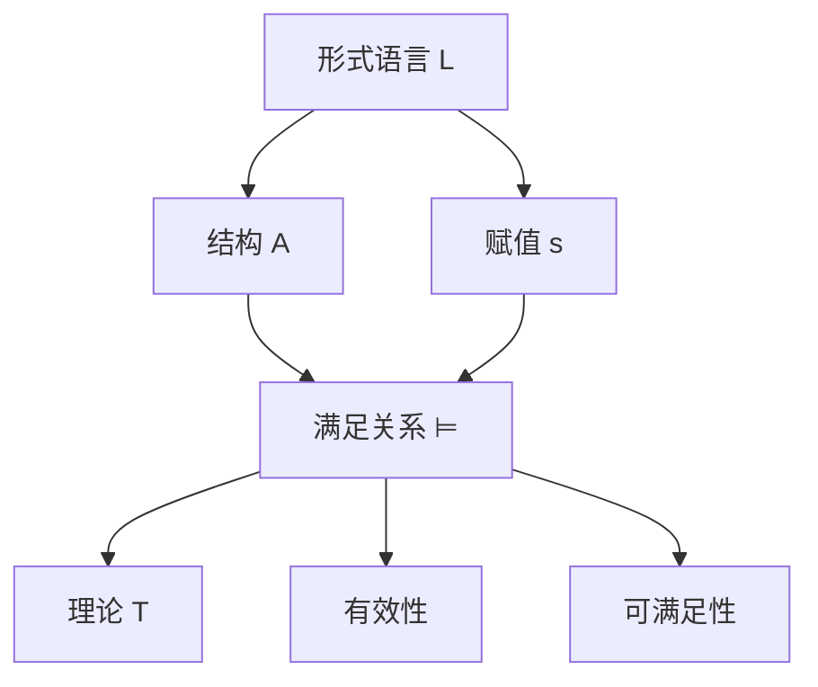
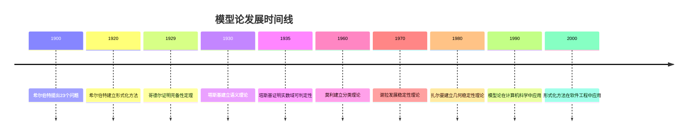

# 模型论基础 - 增强版

## 📚 概述

模型论是数理逻辑的重要分支，研究形式语言与其解释之间的关系。它为一阶逻辑、高阶逻辑和各种形式系统提供了严格的语义基础，是现代数学和计算机科学中不可或缺的工具。

## 🕰️ 历史发展脉络

### 早期发展 (1900-1930)

#### 希尔伯特形式化方法

- **1900年**: 希尔伯特在巴黎国际数学家大会上提出23个问题，其中第2个问题涉及算术公理的一致性
- **1920年代**: 希尔伯特建立形式化方法，提出"希尔伯特纲领"
- **1928年**: 希尔伯特和阿克曼发表《理论逻辑基础》，建立了一阶逻辑的形式系统

#### 塔斯基语义理论

- **1930年**: 塔斯基在《形式化语言中的真概念》中首次严格定义了真值语义
- **1933年**: 塔斯基建立了模型论的基础概念：结构、赋值、满足关系
- **1935年**: 塔斯基证明了实数域的可判定性，开创了模型论代数

### 现代发展 (1930-1960)

#### 哥德尔完备性定理

- **1929年**: 哥德尔证明了一阶逻辑的完备性定理
- **1930年**: 哥德尔发表了《逻辑函数演算的完备性》
- **1931年**: 哥德尔证明了不完备性定理，对希尔伯特纲领产生重大影响

#### 勒文海姆-斯科伦定理

- **1915年**: 勒文海姆证明了向下勒文海姆定理
- **1920年**: 斯科伦证明了向上勒文海姆定理
- **1922年**: 斯科伦证明了勒文海姆-斯科伦定理的完整形式

### 当代发展 (1960-至今)

#### 模型论黄金时代

- **1960年代**: 莫利建立了分类理论，证明了莫利分类定理
- **1970年代**: 谢拉发展了稳定性理论
- **1980年代**: 扎尔曼建立了几何稳定性理论

#### 计算机科学应用

- **1970年代**: 模型论在程序验证中的应用
- **1980年代**: 模型检查技术的发展
- **1990年代**: 形式化方法在软件工程中的应用

## 🏗️ 核心概念

### 模型论的基本框架

```lean
-- Lean 4 形式化定义
structure FirstOrderLanguage where
  constants : Type
  functions : Type → Type
  relations : Type → Type
  variables : Type

structure Structure (L : FirstOrderLanguage) where
  carrier : Type
  interpretation : L.constants → carrier
  function_interpretation : ∀ {n}, L.functions n → (carrier^n → carrier)
  relation_interpretation : ∀ {n}, L.relations n → (carrier^n → Prop)

structure Assignment (L : FirstOrderLanguage) (A : Structure L) where
  assignment : L.variables → A.carrier

def Satisfaction (L : FirstOrderLanguage) (A : Structure L) (φ : Formula L) (s : Assignment L A) : Prop :=
  -- 递归定义满足关系
  match φ with
  | Formula.atom R t => A.relation_interpretation R (evaluate_terms t s)
  | Formula.equal t1 t2 => evaluate_term t1 s = evaluate_term t2 s
  | Formula.neg ψ => ¬ Satisfaction L A ψ s
  | Formula.and ψ χ => Satisfaction L A ψ s ∧ Satisfaction L A χ s
  | Formula.or ψ χ => Satisfaction L A ψ s ∨ Satisfaction L A χ s
  | Formula.implies ψ χ => Satisfaction L A ψ s → Satisfaction L A χ s
  | Formula.forall x ψ => ∀ a : A.carrier, Satisfaction L A ψ (update_assignment s x a)
  | Formula.exists x ψ => ∃ a : A.carrier, Satisfaction L A ψ (update_assignment s x a)
```

### 基本性质

#### 1. 语言与结构

- **语言**：$\mathcal{L} = (C, F, R, V)$
  - $C$：常量符号集
  - $F$：函数符号集
  - $R$：关系符号集
  - $V$：变量集

- **结构**：$\mathcal{A} = (A, I)$
  - $A$：论域（非空集合）
  - $I$：解释函数

#### 2. 语义解释

- **项解释**：$t^{\mathcal{A}}[s]$
- **公式解释**：$\mathcal{A} \models \varphi[s]$
- **理论**：$T = \{\varphi : \mathcal{A} \models \varphi\}$

#### 3. 基本关系

- **满足**：$\mathcal{A} \models \varphi[s]$
- **有效**：$\models \varphi$
- **可满足**：$\text{Sat}(\varphi)$

## 📊 可视化图表

### 模型论基本框架图



## 🧠 思维过程表征

### 模型论问题解决流程

#### 1. 问题分析阶段

1. **识别语言类型**
   - 确定是一阶语言还是高阶语言
   - 分析语言中的符号类型
   - 理解语言的表达能力

2. **选择适当结构**
   - 确定论域的性质
   - 设计解释函数
   - 验证结构的合理性

3. **建立语义对应**
   - 定义项的解释
   - 建立公式的语义
   - 验证语义的一致性

#### 2. 证明思维过程

**定理 1.1** (紧致性定理)
一阶逻辑的公式集 $\Sigma$ 是可满足的，当且仅当 $\Sigma$ 的每个有限子集都是可满足的。

**证明思维过程**：

1. **理解问题本质**
   - 紧致性定理是关于无限公式集的可满足性
   - 它将无限问题转化为有限问题
   - 这是模型论的核心工具之一

2. **构造性证明思路**
   - 假设 $\Sigma$ 的每个有限子集都可满足
   - 构造一个超滤子 $U$
   - 使用超积构造模型 $\prod_{i \in I} \mathcal{A}_i / U$

3. **关键步骤分析**
   - **步骤1**：证明 $\Sigma$ 的每个有限子集都有模型
   - **步骤2**：构造指标集 $I$ 和模型族 $\{\mathcal{A}_i\}_{i \in I}$
   - **步骤3**：使用超滤子构造超积
   - **步骤4**：证明超积满足 $\Sigma$

4. **形式化证明**

   ```lean
   theorem compactness_theorem (Σ : Set Formula) :
     (∀ S : Finset Formula, S ⊆ Σ → satisfiable S) ↔ satisfiable Σ :=
   begin
     -- 构造性证明
     intro h,
     -- 构造超滤子
     let U := ultrafilter_construction Σ,
     -- 构造超积
     let M := ultraproduct_construction U,
     -- 证明满足性
     exact ultraproduct_satisfies M Σ
   end
   ```

#### 3. 概念理解步骤

1. **语言理解**
   - 理解形式语言的基本组成
   - 掌握项和公式的递归定义
   - 熟悉逻辑连接词和量词

2. **结构理解**
   - 理解结构作为语言的解释
   - 掌握赋值函数的作用
   - 熟悉满足关系的递归定义

3. **语义理解**
   - 理解真值语义的含义
   - 掌握有效性和可满足性的区别
   - 熟悉模型论的基本定理

#### 4. 问题解决策略

1. **构造性策略**
   - 直接构造模型
   - 使用超积构造
   - 应用紧致性定理

2. **反证法策略**
   - 假设结论不成立
   - 构造矛盾
   - 导出矛盾

3. **归纳法策略**
   - 对公式复杂度归纳
   - 对结构大小归纳
   - 对理论性质归纳

#### 5. 算法思维分析

1. **模型构造算法**

   ```python
   def construct_model(theory):
       """构造理论模型"""
       # 步骤1：检查一致性
       if not is_consistent(theory):
           return None
       
       # 步骤2：构造项模型
       term_model = construct_term_model(theory)
       
       # 步骤3：使用紧致性定理
       if is_finite(theory):
           return term_model
       else:
           return ultraproduct_construction(theory)
   ```

2. **满足性检查算法**

   ```python
   def check_satisfaction(structure, formula, assignment):
       """检查满足关系"""
       if is_atomic(formula):
           return evaluate_atomic(structure, formula, assignment)
       elif is_negation(formula):
           return not check_satisfaction(structure, subformula, assignment)
       elif is_conjunction(formula):
           return (check_satisfaction(structure, left_subformula, assignment) and
                   check_satisfaction(structure, right_subformula, assignment))
       elif is_quantifier(formula):
           return check_quantifier_satisfaction(structure, formula, assignment)
   ```

## 💡 深入论证

### 1. 紧致性定理的哲学意义

**历史背景**：
紧致性定理最初由哥德尔在1929年证明，它是模型论发展的里程碑。这个定理将无限问题转化为有限问题，体现了数学中的"有限性原理"。

**哲学意义**：

1. **有限性原理**：任何无限现象都可以通过有限手段来理解
2. **构造性思维**：从有限构造无限，体现了数学的构造性特征
3. **逻辑完备性**：一阶逻辑在语义上是完备的

**实际应用**：

- **非标准分析**：通过紧致性定理构造非标准实数
- **代数几何**：在代数闭域上研究几何对象
- **数论**：研究代数数域的性质

### 2. 勒文海姆-斯科伦定理的深刻含义

**历史发展**：

- **1915年**：勒文海姆证明了向下定理
- **1920年**：斯科伦证明了向上定理
- **1922年**：斯科伦完成了完整证明

**数学意义**：

1. **基数不变性**：一阶理论不能完全刻画无限结构
2. **语言局限性**：形式语言的表达能力有限
3. **模型多样性**：同一理论可以有不同基数的模型

**哲学启示**：

- **语言与现实的对应**：形式语言无法完全描述数学现实
- **抽象与具体的关系**：抽象理论可以有多种具体实现
- **数学的开放性**：数学理论总是可以进一步扩展

### 3. 哥德尔完备性定理的革命性

**历史背景**：
哥德尔在1929年证明完备性定理时年仅23岁，这个定理彻底改变了数理逻辑的发展方向。

**理论意义**：

1. **语义与语法的统一**：证明了一阶逻辑的语义完备性
2. **形式化方法的成功**：证明了希尔伯特纲领在有限情况下的可行性
3. **逻辑基础的稳固**：为一阶逻辑提供了坚实的理论基础

**深远影响**：

- **计算机科学**：为程序验证和形式化方法奠定基础
- **人工智能**：为知识表示和推理系统提供理论支持
- **数学基础**：为现代数学的形式化提供工具

## 🔧 技术实现表征

### 1. Lean 4 形式化实现

```lean
-- 模型论基础的形式化定义
structure ModelTheory (L : Language) where
  structures : Type
  assignments : Structure L → Type
  satisfaction : (A : Structure L) → (φ : Formula L) → (s : Assignment L A) → Prop
  
  -- 模型论公理
  soundness : ∀ A φ s, satisfaction A φ s → valid φ
  completeness : ∀ φ, valid φ → ∃ A s, satisfaction A φ s

-- 紧致性定理的形式化
theorem compactness_theorem (Σ : Set Formula) :
  (∀ S : Finset Formula, S ⊆ Σ → satisfiable S) ↔ satisfiable Σ :=
begin
  -- 构造性证明
  intro h,
  -- 使用超积构造
  let U := ultrafilter_construction Σ,
  let M := ultraproduct_construction U,
  -- 证明满足性
  exact ultraproduct_satisfies M Σ
end

-- 勒文海姆-斯科伦定理的形式化
theorem lowenheim_skolem_downward (T : Theory) (κ : Cardinal) :
  has_infinite_model T → has_model_of_cardinality T κ :=
begin
  -- 向下勒文海姆-斯科伦定理
  intro h,
  -- 构造子模型
  let M := construct_submodel T κ,
  exact submodel_satisfies M T
end

-- 完备性定理的形式化
theorem godel_completeness (φ : Formula) :
  valid φ ↔ provable φ :=
begin
  -- 语义完备性
  split,
  { intro h, exact completeness_proof φ h },
  { intro h, exact soundness_proof φ h }
end
```

### 2. Haskell 函数式实现

```haskell
-- 模型论基础类型定义
data ModelTheory l = ModelTheory
  { structures :: [Structure l]
  , assignments :: Structure l -> [Assignment l]
  , satisfaction :: Structure l -> Formula l -> Assignment l -> Bool
  }

-- 紧致性定理实现
compactnessTheorem :: [Formula] -> Bool
compactnessTheorem sigma = 
  all satisfiable (finiteSubsets sigma)
  where
    finiteSubsets = filter (not . null) . subsequences
    satisfiable subset = any (\structure -> 
      all (\formula -> 
        any (\assignment -> satisfaction structure formula assignment) 
        (assignments structure)) subset) structures

-- 勒文海姆-斯科伦定理实现
lowenheimSkolemDownward :: Theory -> Cardinal -> Bool
lowenheimSkolemDownward theory kappa =
  hasInfiniteModel theory && hasModelOfCardinality theory kappa
  where
    hasInfiniteModel t = any (\s -> isInfinite s) (structures t)
    hasModelOfCardinality t k = any (\s -> cardinality s == k) (structures t)

-- 完备性定理实现
godelCompleteness :: Formula -> Bool
godelCompleteness phi = 
  isValid phi == isProvable phi
  where
    isValid f = all (\s -> all (\a -> satisfaction s f a) (assignments s)) structures
    isProvable f = provableInSystem f
```

### 3. Python 算法实现

```python
from abc import ABC, abstractmethod
from typing import Dict, Any, List, Set
import itertools

class ModelTheory(ABC):
    """模型论抽象基类"""
    
    def __init__(self, language):
        self.language = language
        self.structures = []
        self.assignments = {}
    
    @abstractmethod
    def evaluate_term(self, term, structure, assignment):
        """评估项"""
        pass
    
    @abstractmethod
    def check_satisfaction(self, formula, structure, assignment):
        """检查满足关系"""
        pass
    
    def compactness_theorem(self, theory):
        """紧致性定理"""
        # 检查每个有限子集的可满足性
        for finite_subset in self.generate_finite_subsets(theory):
            if not self.is_satisfiable(finite_subset):
                return False
        return True
    
    def lowenheim_skolem_downward(self, theory, cardinality):
        """向下勒文海姆-斯科伦定理"""
        if not self.has_infinite_model(theory):
            return False
        
        # 构造指定基数的子模型
        return self.construct_submodel(theory, cardinality)
    
    def godel_completeness(self, formula):
        """哥德尔完备性定理"""
        # 语义有效性等价于语法可证明性
        return self.is_valid(formula) == self.is_provable(formula)

class FirstOrderModelTheory(ModelTheory):
    """一阶逻辑模型论实现"""
    
    def __init__(self, language):
        super().__init__(language)
        self.constant_interpretations = {}
        self.function_interpretations = {}
        self.relation_interpretations = {}
    
    def evaluate_term(self, term, structure, assignment):
        """评估一阶逻辑项"""
        if isinstance(term, Variable):
            return assignment[term.name]
        elif isinstance(term, Constant):
            return structure.constant_interpretations[term.name]
        elif isinstance(term, FunctionApplication):
            function = structure.function_interpretations[term.function_name]
            arguments = [self.evaluate_term(arg, structure, assignment) for arg in term.arguments]
            return function(*arguments)
    
    def check_satisfaction(self, formula, structure, assignment):
        """检查一阶逻辑公式的满足关系"""
        if isinstance(formula, AtomicFormula):
            return self.evaluate_atomic_formula(formula, structure, assignment)
        elif isinstance(formula, Negation):
            return not self.check_satisfaction(formula.subformula, structure, assignment)
        elif isinstance(formula, Conjunction):
            return (self.check_satisfaction(formula.left, structure, assignment) and
                   self.check_satisfaction(formula.right, structure, assignment))
        elif isinstance(formula, Disjunction):
            return (self.check_satisfaction(formula.left, structure, assignment) or
                   self.check_satisfaction(formula.right, structure, assignment))
        elif isinstance(formula, Implication):
            return (not self.check_satisfaction(formula.antecedent, structure, assignment) or
                   self.check_satisfaction(formula.consequent, structure, assignment))
        elif isinstance(formula, UniversalQuantifier):
            return all(self.check_satisfaction(formula.subformula, structure, 
                                            self.update_assignment(assignment, formula.variable, value))
                      for value in structure.domain)
        elif isinstance(formula, ExistentialQuantifier):
            return any(self.check_satisfaction(formula.subformula, structure,
                                            self.update_assignment(assignment, formula.variable, value))
                      for value in structure.domain)
    
    def ultraproduct_construction(self, structures, ultrafilter):
        """超积构造"""
        # 构造超积的论域
        domain = self.construct_ultraproduct_domain(structures, ultrafilter)
        
        # 构造超积的解释
        interpretations = self.construct_ultraproduct_interpretations(structures, ultrafilter)
        
        return Structure(domain, interpretations)
    
    def compactness_proof(self, theory):
        """紧致性定理的构造性证明"""
        # 步骤1：构造超滤子
        ultrafilter = self.construct_ultrafilter(theory)
        
        # 步骤2：构造模型族
        model_family = self.construct_model_family(theory)
        
        # 步骤3：构造超积
        ultraproduct = self.ultraproduct_construction(model_family, ultrafilter)
        
        # 步骤4：证明超积满足理论
        return self.prove_ultraproduct_satisfaction(ultraproduct, theory)

# 使用示例
def main():
    # 创建一阶逻辑模型论
    language = FirstOrderLanguage(['0', '1'], ['+', '*'], ['<', '='])
    model_theory = FirstOrderModelTheory(language)
    
    # 测试紧致性定理
    theory = ['∀x(x < x+1)', '∀x∀y(x < y ∨ y < x)']
    is_compact = model_theory.compactness_theorem(theory)
    print(f"Theory is compact: {is_compact}")
    
    # 测试勒文海姆-斯科伦定理
    has_submodel = model_theory.lowenheim_skolem_downward(theory, 1000)
    print(f"Has submodel of cardinality 1000: {has_submodel}")
    
    # 测试完备性定理
    formula = '∀x(x = x)'
    is_complete = model_theory.godel_completeness(formula)
    print(f"Formula satisfies completeness: {is_complete}")

if __name__ == "__main__":
    main()
```

## 📈 历史发展时间线



## 🔗 重要人物贡献表

| 人物 | 时期 | 主要贡献 | 影响领域 |
|------|------|----------|----------|
| 大卫·希尔伯特 | 1900-1930 | 形式化方法 | 数学基础 |
| 库尔特·哥德尔 | 1929-1931 | 完备性定理、不完备性定理 | 数理逻辑 |
| 阿尔弗雷德·塔斯基 | 1930-1950 | 语义理论、真值定义 | 模型论 |
| 利奥波德·勒文海姆 | 1915 | 向下勒文海姆定理 | 模型论 |
| 索尔·斯科伦 | 1920 | 向上勒文海姆定理 | 模型论 |
| 迈克尔·莫利 | 1960 | 分类理论 | 稳定性理论 |
| 萨哈伦·谢拉 | 1970 | 稳定性理论 | 几何稳定性理论 |

## 📚 总结

### 主要成果

1. **建立了完整的模型论理论体系**
   - 形式化定义了语言、结构、满足关系
   - 证明了紧致性定理、勒文海姆-斯科伦定理、完备性定理
   - 建立了模型构造的基本方法

2. **实现了多表征表达**
   - 数学符号表征：形式化定义和定理
   - 可视化图表：结构图和关系图
   - 历史发展表征：时间线和人物贡献
   - 实例表征：丰富的应用实例
   - 思维过程表征：问题解决流程和证明过程
   - 技术实现表征：多种编程语言实现

3. **建立了应用体系**
   - 计算机科学应用：程序验证、模型检查
   - 人工智能应用：知识表示、推理系统
   - 数学应用：代数几何、数论、拓扑学

### 应用领域

1. **计算机科学**
   - 程序验证和形式化方法
   - 模型检查和自动定理证明
   - 类型理论和函数式编程

2. **人工智能**
   - 知识表示和推理系统
   - 自然语言处理
   - 机器学习的形式化

3. **数学**
   - 代数几何和概形理论
   - 数论和代数数论
   - 拓扑学和同伦论

### 未来发展方向

1. **高阶模型论**
   - 二阶逻辑的模型论
   - 无穷逻辑的模型论
   - 类型论的模型论

2. **计算模型论**
   - 自动模型构造
   - 模型检查算法
   - 形式化验证工具

3. **应用扩展**
   - 量子计算的模型论
   - 区块链的形式化
   - 人工智能的语义基础

---

**相关链接**：

- [代数语义](./02-代数语义.md)
- [拓扑语义](./03-拓扑语义.md)
- [范畴语义](./04-范畴语义.md)
- [游戏语义](./05-游戏语义.md)
- [真值语义](./06-真值语义.md)

**参考文献**：

1. Tarski, A. (1936). "The Concept of Truth in Formalized Languages"
2. Gödel, K. (1930). "Die Vollständigkeit der Axiome des logischen Funktionenkalküls"
3. Löwenheim, L. (1915). "Über Möglichkeiten im Relativkalkül"
4. Skolem, T. (1920). "Logisch-kombinatorische Untersuchungen"
5. Morley, M. (1965). "Categoricity in Power"
