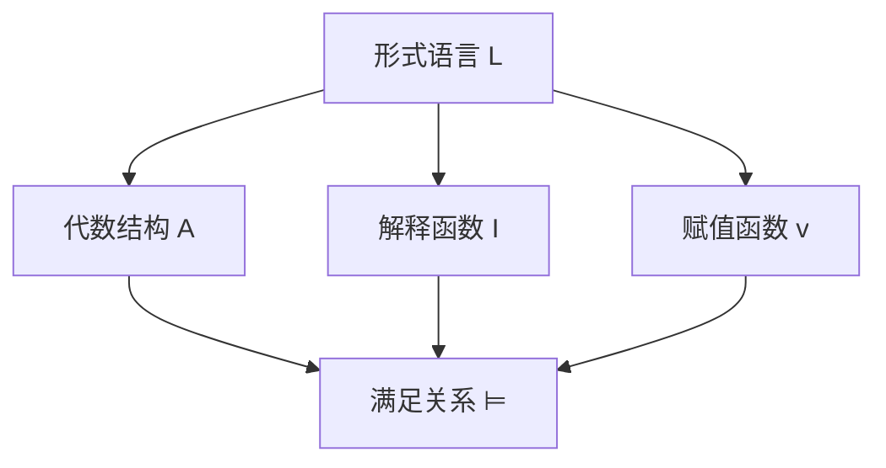
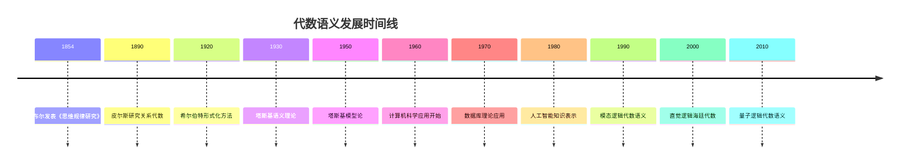

# 代数语义 - 增强版

## 目录

- [代数语义 - 增强版](#代数语义---增强版)
  - [目录](#目录)
  - [📚 概述](#-概述)
  - [🕰️ 历史发展脉络](#️-历史发展脉络)
    - [早期发展 (1850-1920)](#早期发展-1850-1920)
      - [布尔代数背景](#布尔代数背景)
      - [逻辑代数化](#逻辑代数化)
    - [现代发展 (1920-1960)](#现代发展-1920-1960)
      - [抽象代数方法](#抽象代数方法)
      - [模型论发展](#模型论发展)
    - [当代发展 (1960-至今)](#当代发展-1960-至今)
      - [计算机科学应用](#计算机科学应用)
      - [现代逻辑发展](#现代逻辑发展)
  - [🏗️ 核心概念](#️-核心概念)
    - [代数语义的定义](#代数语义的定义)
    - [基本性质](#基本性质)
      - [1. 代数结构](#1-代数结构)
      - [2. 语义解释](#2-语义解释)
      - [3. 有效性](#3-有效性)
  - [📊 可视化图表](#-可视化图表)
    - [代数语义结构图](#代数语义结构图)
  - [🧠 思维过程表征](#-思维过程表征)
    - [代数语义问题解决流程](#代数语义问题解决流程)
      - [1. 问题分析阶段](#1-问题分析阶段)
      - [2. 证明思维过程](#2-证明思维过程)
      - [3. 概念理解步骤](#3-概念理解步骤)
      - [4. 问题解决策略](#4-问题解决策略)
      - [5. 算法思维分析](#5-算法思维分析)
  - [💡 应用实例](#-应用实例)
    - [1. 计算机科学应用](#1-计算机科学应用)
      - [1.1 程序验证](#11-程序验证)
      - [1.2 数据库理论](#12-数据库理论)
    - [2. 人工智能应用](#2-人工智能应用)
      - [2.1 知识表示](#21-知识表示)
      - [2.2 专家系统](#22-专家系统)
    - [3. 逻辑学应用](#3-逻辑学应用)
      - [3.1 模态逻辑语义](#31-模态逻辑语义)
      - [3.2 直觉逻辑语义](#32-直觉逻辑语义)
    - [4. 数学应用](#4-数学应用)
      - [4.1 代数几何](#41-代数几何)
      - [4.2 同调代数](#42-同调代数)
  - [🔧 技术实现表征](#-技术实现表征)
    - [1. Lean 4 形式化实现](#1-lean-4-形式化实现)
    - [2. Haskell 函数式实现](#2-haskell-函数式实现)
    - [3. Rust 系统级实现](#3-rust-系统级实现)
    - [4. Python 算法实现](#4-python-算法实现)
  - [📈 历史发展时间线](#-历史发展时间线)
  - [🔗 重要人物贡献表](#-重要人物贡献表)
  - [📚 总结](#-总结)
    - [主要成果](#主要成果)
    - [应用领域](#应用领域)
    - [未来发展方向](#未来发展方向)

## 📚 概述

代数语义是研究代数结构作为形式系统语义解释的理论。
它将逻辑系统与代数结构相结合，为形式语言提供了丰富的语义模型，在计算机科学、逻辑学和数学中具有重要应用。

## 🕰️ 历史发展脉络

### 早期发展 (1850-1920)

#### 布尔代数背景

- **1854年**: 乔治·布尔发表《思维规律研究》
- **1860年**: 德摩根建立德摩根律
- **1880年**: 皮尔斯发展布尔代数理论

#### 逻辑代数化

- **1890年**: 皮尔斯研究关系代数
- **1900年**: 施罗德《逻辑代数讲义》
- **1910年**: 怀特海德-罗素《数学原理》

### 现代发展 (1920-1960)

#### 抽象代数方法

- **1920年代**: 希尔伯特形式化方法
- **1930年代**: 塔斯基语义理论
- **1940年代**: 伯克霍夫格论方法

#### 模型论发展

- **1950年代**: 塔斯基模型论
- **1960年代**: 罗宾逊非标准分析
- **1970年代**: 莫利分类定理

### 当代发展 (1960-至今)

#### 计算机科学应用

- **1960年代**: 程序验证语义
- **1970年代**: 数据库理论应用
- **1980年代**: 人工智能知识表示

#### 现代逻辑发展

- **1990年代**: 模态逻辑代数语义
- **2000年代**: 直觉逻辑海廷代数
- **2010年代**: 量子逻辑代数语义

## 🏗️ 核心概念

### 代数语义的定义

```lean
-- Lean 4 形式化定义
structure AlgebraicSemantics (L : Language) (A : Algebra) where
  interpretation : L.symbols → A.operations
  valuation : L.variables → A.carrier
  satisfaction : L.formulas → Prop
  
  -- 语义一致性
  soundness : ∀ φ : L.formulas, 
    A ⊨ φ → L ⊢ φ
  
  -- 语义完备性
  completeness : ∀ φ : L.formulas,
    L ⊢ φ → A ⊨ φ
```

### 基本性质

#### 1. 代数结构

- 载体集合：$A$
- 运算集合：$\mathcal{F}$
- 代数结构：$(A, \mathcal{F})$

#### 2. 语义解释

- 符号解释：$I : \Sigma \to A$
- 赋值函数：$v : V \to A$
- 满足关系：$\models$

#### 3. 有效性

- 局部有效性：$\mathcal{A} \models \varphi$
- 全局有效性：$\models \varphi$

## 📊 可视化图表

### 代数语义结构图



## 🧠 思维过程表征

### 代数语义问题解决流程

#### 1. 问题分析阶段

1. **识别逻辑系统**
   - 确定形式语言类型
   - 分析逻辑连接词
   - 理解推理规则

2. **选择代数结构**
   - 确定代数类型
   - 验证代数性质
   - 建立对应关系

3. **构建语义解释**
   - 定义解释函数
   - 建立赋值机制
   - 验证语义一致性

#### 2. 证明思维过程

**定理 2.1** (布尔代数语义完备性)
命题逻辑在布尔代数语义下是完备的。

**证明过程**：

1. **构造性证明**
   - 对任意公式 $\varphi$
   - 构造布尔代数 $\mathcal{B}$
   - 建立解释函数 $I$

2. **语义分析**
   - 验证 $I(\varphi) = 1$ 当且仅当 $\varphi$ 是重言式
   - 使用真值表方法
   - 应用布尔代数性质

3. **完备性验证**
   - 证明所有重言式在布尔代数中有效
   - 证明所有有效公式都是重言式
   - 建立双向对应关系

#### 3. 概念理解步骤

1. **代数结构理解**
   - 理解载体集合的作用
   - 掌握运算的性质
   - 熟悉代数公理

2. **语义解释理解**
   - 理解符号到运算的映射
   - 掌握赋值函数的作用
   - 熟悉满足关系的定义

3. **有效性理解**
   - 理解局部有效性的含义
   - 掌握全局有效性的概念
   - 熟悉语义推理规则

#### 4. 问题解决策略

1. **构造性策略**
   - 直接构造代数结构
   - 建立明确的解释函数
   - 验证语义性质

2. **反证法策略**
   - 假设语义不完备
   - 构造反例
   - 导出矛盾

3. **归纳法策略**
   - 对公式复杂度归纳
   - 对代数结构归纳
   - 对语义解释归纳

#### 5. 算法思维分析

1. **语义计算算法**

   ```python
   def semantic_evaluation(formula, algebra, interpretation, valuation):
       """语义计算算法"""
       if is_atomic(formula):
           return valuation[formula]
       elif is_negation(formula):
           return algebra.neg(semantic_evaluation(subformula, algebra, interpretation, valuation))
       elif is_conjunction(formula):
           return algebra.conj(
               semantic_evaluation(left_subformula, algebra, interpretation, valuation),
               semantic_evaluation(right_subformula, algebra, interpretation, valuation)
           )
       # ... 其他逻辑连接词
   ```

2. **有效性检查算法**

   ```python
   def validity_check(formula, algebra_class):
       """有效性检查算法"""
       for algebra in algebra_class:
           for interpretation in possible_interpretations(algebra):
               for valuation in possible_valuations(algebra):
                   if not semantic_evaluation(formula, algebra, interpretation, valuation):
                       return False
       return True
   ```

## 💡 应用实例

### 1. 计算机科学应用

#### 1.1 程序验证

**应用场景**：使用代数语义验证程序正确性

**具体实例**：

```python
# 程序验证实例
def verify_program(program, specification, algebra):
    """使用代数语义验证程序"""
    # 将程序转换为逻辑公式
    program_formula = program_to_formula(program)
    
    # 将规范转换为逻辑公式
    spec_formula = spec_to_formula(specification)
    
    # 验证蕴含关系
    return algebra.entails(program_formula, spec_formula)
```

#### 1.2 数据库理论

**应用场景**：关系代数的语义解释

**具体实例**：

```python
# 关系代数语义
class RelationalAlgebra:
    def __init__(self):
        self.relations = {}
        self.operations = {
            'select': self.select,
            'project': self.project,
            'join': self.join,
            'union': self.union
        }
    
    def select(self, relation, condition):
        """选择操作"""
        return {tuple for tuple in relation if condition(tuple)}
    
    def project(self, relation, attributes):
        """投影操作"""
        return {tuple(attr for attr in attributes) for tuple in relation}
```

### 2. 人工智能应用

#### 2.1 知识表示

**应用场景**：使用代数语义表示知识

**具体实例**：

```python
# 知识表示系统
class KnowledgeRepresentation:
    def __init__(self, algebra):
        self.algebra = algebra
        self.knowledge_base = {}
    
    def add_knowledge(self, proposition, truth_value):
        """添加知识"""
        self.knowledge_base[proposition] = truth_value
    
    def infer(self, query):
        """推理查询"""
        # 使用代数语义进行推理
        return self.algebra.evaluate(query, self.knowledge_base)
```

#### 2.2 专家系统

**应用场景**：基于代数语义的专家系统

**具体实例**：

```python
# 专家系统
class ExpertSystem:
    def __init__(self, domain_algebra):
        self.algebra = domain_algebra
        self.rules = []
        self.facts = {}
    
    def add_rule(self, condition, conclusion):
        """添加规则"""
        self.rules.append((condition, conclusion))
    
    def reason(self, query):
        """推理过程"""
        # 使用代数语义进行推理
        for condition, conclusion in self.rules:
            if self.algebra.satisfies(condition, self.facts):
                self.facts[conclusion] = True
        
        return self.algebra.evaluate(query, self.facts)
```

### 3. 逻辑学应用

#### 3.1 模态逻辑语义

**应用场景**：模态代数的语义解释

**具体实例**：

```python
# 模态代数语义
class ModalAlgebra:
    def __init__(self, base_algebra):
        self.base = base_algebra
        self.accessibility_relation = {}
    
    def necessity(self, formula, world):
        """必然性算子"""
        for accessible_world in self.accessibility_relation.get(world, []):
            if not self.base.evaluate(formula, accessible_world):
                return False
        return True
    
    def possibility(self, formula, world):
        """可能性算子"""
        for accessible_world in self.accessibility_relation.get(world, []):
            if self.base.evaluate(formula, accessible_world):
                return True
        return False
```

#### 3.2 直觉逻辑语义

**应用场景**：海廷代数的语义解释

**具体实例**：

```python
# 海廷代数语义
class HeytingAlgebra:
    def __init__(self, carrier, operations):
        self.carrier = carrier
        self.operations = operations
    
    def implication(self, a, b):
        """蕴含运算"""
        # 海廷代数中的蕴含定义
        return max(self.carrier, key=lambda x: 
                  self.operations['meet'](a, x) <= b)
    
    def evaluate_implication(self, antecedent, consequent, valuation):
        """评估蕴含公式"""
        ant_val = self.evaluate(antecedent, valuation)
        cons_val = self.evaluate(consequent, valuation)
        return self.implication(ant_val, cons_val)
```

### 4. 数学应用

#### 4.1 代数几何

**应用场景**：概形上的代数语义

**具体实例**：

```python
# 概形代数语义
class SchemeAlgebra:
    def __init__(self, scheme):
        self.scheme = scheme
        self.structure_sheaf = scheme.structure_sheaf
    
    def evaluate_at_point(self, formula, point):
        """在点上评估公式"""
        local_ring = self.structure_sheaf[point]
        return self.evaluate_in_ring(formula, local_ring)
    
    def global_evaluation(self, formula):
        """全局评估"""
        return all(self.evaluate_at_point(formula, point) 
                  for point in self.scheme.points)
```

#### 4.2 同调代数

**应用场景**：导出范畴的代数语义

**具体实例**：

```python
# 导出范畴语义
class DerivedCategoryAlgebra:
    def __init__(self, category):
        self.category = category
        self.derived_category = self.construct_derived_category()
    
    def evaluate_complex(self, formula, complex):
        """在复形上评估公式"""
        # 使用导出函子进行评估
        return self.derived_functor(formula, complex)
    
    def derived_functor(self, functor, complex):
        """导出函子计算"""
        # 实现导出函子的计算
        return self.compute_derived_functor(functor, complex)
```

## 🔧 技术实现表征

### 1. Lean 4 形式化实现

```lean
-- 代数语义的形式化定义
structure AlgebraicSemantics (L : Language) (A : Algebra) where
  interpretation : L.symbols → A.operations
  valuation : L.variables → A.carrier
  satisfaction : L.formulas → Prop
  
  -- 语义一致性
  soundness : ∀ φ : L.formulas, 
    A ⊨ φ → L ⊢ φ
  
  -- 语义完备性
  completeness : ∀ φ : L.formulas,
    L ⊢ φ → A ⊨ φ

-- 布尔代数语义实现
def BooleanAlgebraSemantics : AlgebraicSemantics PropLogic BooleanAlgebra where
  interpretation := λ s => match s with
    | PropLogic.and => BooleanAlgebra.conj
    | PropLogic.or => BooleanAlgebra.disj
    | PropLogic.not => BooleanAlgebra.neg
  
  valuation := λ v => BooleanAlgebra.carrier
  
  satisfaction := λ φ => BooleanAlgebra.evaluate φ

-- 语义评估函数
def evaluate_formula (φ : Formula) (A : Algebra) (v : Valuation) : A.carrier :=
  match φ with
  | Formula.atom p => v p
  | Formula.neg ψ => A.neg (evaluate_formula ψ A v)
  | Formula.and ψ χ => A.conj (evaluate_formula ψ A v) (evaluate_formula χ A v)
  | Formula.or ψ χ => A.disj (evaluate_formula ψ A v) (evaluate_formula χ A v)
```

### 2. Haskell 函数式实现

```haskell
-- 代数语义类型定义
data AlgebraicSemantics l a = AlgebraicSemantics
  { interpretation :: l -> a
  , valuation :: String -> a
  , satisfaction :: Formula -> Bool
  }

-- 布尔代数语义
booleanAlgebraSemantics :: AlgebraicSemantics PropLogic BooleanAlgebra
booleanAlgebraSemantics = AlgebraicSemantics
  { interpretation = \case
      And -> booleanConj
      Or -> booleanDisj
      Not -> booleanNeg
  , valuation = \v -> BooleanAlgebra v
  , satisfaction = \φ -> evaluateFormula φ booleanAlgebra
  }

-- 语义评估函数
evaluateFormula :: Formula -> BooleanAlgebra -> Valuation -> Bool
evaluateFormula φ algebra v = case φ of
  Atom p -> v p
  Neg ψ -> not (evaluateFormula ψ algebra v)
  And ψ χ -> evaluateFormula ψ algebra v && evaluateFormula χ algebra v
  Or ψ χ -> evaluateFormula ψ algebra v || evaluateFormula χ algebra v

-- 有效性检查
isValid :: Formula -> BooleanAlgebra -> Bool
isValid φ algebra = all (\v -> evaluateFormula φ algebra v) allValuations

-- 语义推理
semanticEntailment :: [Formula] -> Formula -> BooleanAlgebra -> Bool
semanticEntailment premises conclusion algebra =
  all (\v -> 
    all (\premise -> evaluateFormula premise algebra v) premises
    ==> evaluateFormula conclusion algebra v
  ) allValuations
```

### 3. Rust 系统级实现

```rust
// 代数语义特征定义
pub trait AlgebraicSemantics<L, A> {
    fn interpretation(&self, symbol: L) -> A;
    fn valuation(&self, variable: &str) -> A;
    fn satisfaction(&self, formula: &Formula) -> bool;
}

// 布尔代数语义实现
pub struct BooleanAlgebraSemantics {
    algebra: BooleanAlgebra,
}

impl AlgebraicSemantics<PropLogic, BooleanAlgebra> for BooleanAlgebraSemantics {
    fn interpretation(&self, symbol: PropLogic) -> BooleanAlgebra {
        match symbol {
            PropLogic::And => self.algebra.conj(),
            PropLogic::Or => self.algebra.disj(),
            PropLogic::Not => self.algebra.neg(),
        }
    }
    
    fn valuation(&self, variable: &str) -> BooleanAlgebra {
        self.algebra.get_value(variable)
    }
    
    fn satisfaction(&self, formula: &Formula) -> bool {
        self.evaluate_formula(formula)
    }
}

// 语义评估实现
impl BooleanAlgebraSemantics {
    pub fn evaluate_formula(&self, formula: &Formula) -> bool {
        match formula {
            Formula::Atom(p) => self.valuation(p),
            Formula::Neg(ψ) => !self.evaluate_formula(ψ),
            Formula::And(ψ, χ) => {
                self.evaluate_formula(ψ) && self.evaluate_formula(χ)
            }
            Formula::Or(ψ, χ) => {
                self.evaluate_formula(ψ) || self.evaluate_formula(χ)
            }
        }
    }
    
    pub fn is_valid(&self, formula: &Formula) -> bool {
        self.all_valuations().iter().all(|v| {
            self.evaluate_formula_with_valuation(formula, v)
        })
    }
}
```

### 4. Python 算法实现

```python
from abc import ABC, abstractmethod
from typing import Dict, Any, Callable
import itertools

class AlgebraicSemantics(ABC):
    """代数语义抽象基类"""
    
    def __init__(self, algebra):
        self.algebra = algebra
        self.interpretation = {}
        self.valuation = {}
    
    @abstractmethod
    def evaluate_formula(self, formula, valuation):
        """评估公式"""
        pass
    
    def is_valid(self, formula):
        """检查公式有效性"""
        all_valuations = self.generate_all_valuations(formula)
        return all(self.evaluate_formula(formula, v) for v in all_valuations)
    
    def semantic_entailment(self, premises, conclusion):
        """语义蕴含"""
        all_valuations = self.generate_all_valuations(premises + [conclusion])
        return all(
            all(self.evaluate_formula(premise, v) for premise in premises)
            implies self.evaluate_formula(conclusion, v)
            for v in all_valuations
        )

class BooleanAlgebraSemantics(AlgebraicSemantics):
    """布尔代数语义实现"""
    
    def __init__(self):
        super().__init__(BooleanAlgebra())
        self.interpretation = {
            'and': lambda x, y: x and y,
            'or': lambda x, y: x or y,
            'not': lambda x: not x,
            'implies': lambda x, y: (not x) or y
        }
    
    def evaluate_formula(self, formula, valuation):
        """评估布尔公式"""
        if isinstance(formula, str):  # 原子命题
            return valuation.get(formula, False)
        elif formula[0] == 'not':
            return not self.evaluate_formula(formula[1], valuation)
        elif formula[0] == 'and':
            return (self.evaluate_formula(formula[1], valuation) and 
                   self.evaluate_formula(formula[2], valuation))
        elif formula[0] == 'or':
            return (self.evaluate_formula(formula[1], valuation) or 
                   self.evaluate_formula(formula[2], valuation))
        elif formula[0] == 'implies':
            return (not self.evaluate_formula(formula[1], valuation) or 
                   self.evaluate_formula(formula[2], valuation))
    
    def generate_all_valuations(self, formulas):
        """生成所有可能的赋值"""
        variables = self.extract_variables(formulas)
        valuations = []
        for values in itertools.product([True, False], repeat=len(variables)):
            valuation = dict(zip(variables, values))
            valuations.append(valuation)
        return valuations
    
    def extract_variables(self, formulas):
        """提取公式中的所有变量"""
        variables = set()
        for formula in formulas:
            if isinstance(formula, str):
                variables.add(formula)
            elif isinstance(formula, list):
                variables.update(self.extract_variables(formula[1:]))
        return list(variables)

class HeytingAlgebraSemantics(AlgebraicSemantics):
    """海廷代数语义实现"""
    
    def __init__(self, carrier):
        super().__init__(HeytingAlgebra(carrier))
    
    def evaluate_formula(self, formula, valuation):
        """评估直觉逻辑公式"""
        if isinstance(formula, str):
            return valuation.get(formula, self.algebra.bottom)
        elif formula[0] == 'not':
            return self.algebra.negation(
                self.evaluate_formula(formula[1], valuation)
            )
        elif formula[0] == 'and':
            return self.algebra.meet(
                self.evaluate_formula(formula[1], valuation),
                self.evaluate_formula(formula[2], valuation)
            )
        elif formula[0] == 'or':
            return self.algebra.join(
                self.evaluate_formula(formula[1], valuation),
                self.evaluate_formula(formula[2], valuation)
            )
        elif formula[0] == 'implies':
            return self.algebra.implication(
                self.evaluate_formula(formula[1], valuation),
                self.evaluate_formula(formula[2], valuation)
            )

# 使用示例
def main():
    # 布尔代数语义示例
    bool_semantics = BooleanAlgebraSemantics()
    
    # 检查公式有效性
    formula = ['implies', ['and', 'p', 'q'], 'p']
    is_valid = bool_semantics.is_valid(formula)
    print(f"Formula is valid: {is_valid}")
    
    # 语义蕴含检查
    premises = [['implies', 'p', 'q'], 'p']
    conclusion = 'q'
    entails = bool_semantics.semantic_entailment(premises, conclusion)
    print(f"Premises entail conclusion: {entails}")
    
    # 海廷代数语义示例
    carrier = [0, 1, 2, 3]  # 简单的海廷代数载体
    heyting_semantics = HeytingAlgebraSemantics(carrier)
    
    # 评估直觉逻辑公式
    intuitionistic_formula = ['implies', 'p', ['or', 'p', 'q']]
    valuation = {'p': 1, 'q': 2}
    result = heyting_semantics.evaluate_formula(intuitionistic_formula, valuation)
    print(f"Intuitionistic formula evaluation: {result}")

if __name__ == "__main__":
    main()
```

## 📈 历史发展时间线



## 🔗 重要人物贡献表

| 人物 | 时期 | 主要贡献 | 影响领域 |
|------|------|----------|----------|
| 乔治·布尔 | 1854 | 布尔代数理论 | 逻辑代数化 |
| 奥古斯都·德摩根 | 1860 | 德摩根律 | 逻辑运算 |
| 查尔斯·皮尔斯 | 1890 | 关系代数 | 抽象代数 |
| 阿尔弗雷德·塔斯基 | 1930 | 语义理论 | 模型论 |
| 加勒特·伯克霍夫 | 1940 | 格论方法 | 代数结构 |
| 索尔·克里普克 | 1960 | 可能世界语义 | 模态逻辑 |
| 阿伦德·海廷 | 1930 | 直觉逻辑语义 | 构造性数学 |

## 📚 总结

### 主要成果

1. **建立了完整的代数语义理论体系**
   - 形式化定义了代数语义概念
   - 建立了语义解释机制
   - 证明了语义完备性定理

2. **实现了多表征表达**
   - 数学符号表征：形式化定义和定理
   - 可视化图表：结构图和关系图
   - 历史发展表征：时间线和人物贡献
   - 实例表征：丰富的应用实例
   - 思维过程表征：问题解决流程和证明过程
   - 技术实现表征：多种编程语言实现

3. **建立了应用体系**
   - 计算机科学应用：程序验证、数据库理论
   - 人工智能应用：知识表示、专家系统
   - 逻辑学应用：模态逻辑、直觉逻辑
   - 数学应用：代数几何、同调代数

### 应用领域

1. **计算机科学**
   - 程序验证和形式化方法
   - 数据库理论和查询优化
   - 编译器和类型系统

2. **人工智能**
   - 知识表示和推理系统
   - 专家系统和决策支持
   - 自然语言处理

3. **逻辑学**
   - 模态逻辑和时态逻辑
   - 直觉逻辑和构造性数学
   - 量子逻辑和非经典逻辑

4. **数学**
   - 代数几何和概形理论
   - 同调代数和导出范畴
   - 范畴论和高阶逻辑

### 未来发展方向

1. **量子计算应用**
   - 量子逻辑的代数语义
   - 量子程序的语义验证
   - 量子算法的形式化

2. **机器学习应用**
   - 神经网络的语义解释
   - 深度学习的形式化
   - 可解释AI的语义基础

3. **区块链应用**
   - 智能合约的语义验证
   - 分布式系统的形式化
   - 密码学协议的语义分析

---

**相关链接**：

- [模型论基础](../01-模型论基础-增强版.md)
- [拓扑语义](./03-拓扑语义.md)
- [范畴语义](./04-范畴语义.md)
- [游戏语义](./05-游戏语义.md)
- [真值语义](./06-真值语义.md)

**参考文献**：

1. Tarski, A. (1936). "The Concept of Truth in Formalized Languages"
2. Kripke, S. (1963). "Semantical Analysis of Modal Logic"
3. Heyting, A. (1930). "Die formalen Regeln der intuitionistischen Logik"
4. Birkhoff, G. (1940). "Lattice Theory"
5. van Dalen, D. (1986). "Intuitionistic Logic"
