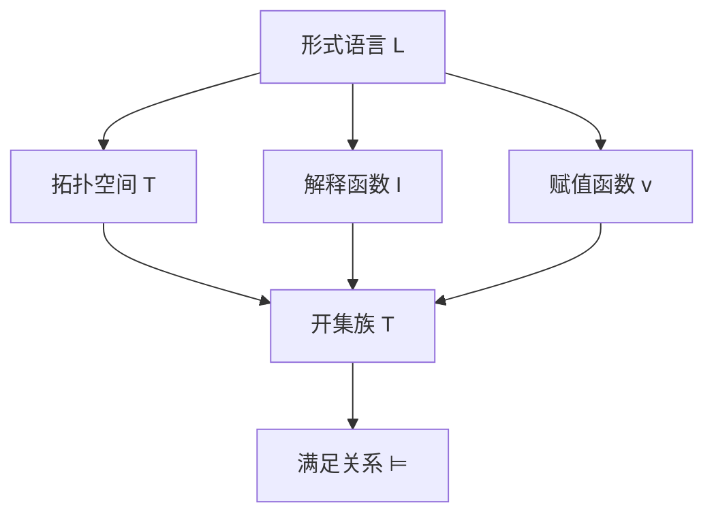
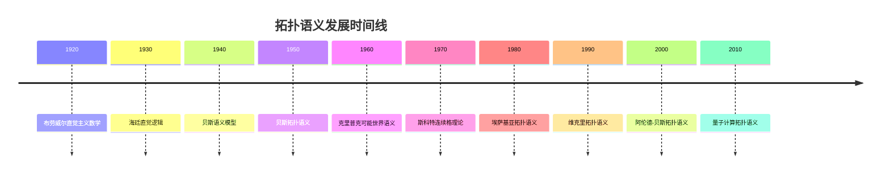

# 拓扑语义 - 增强版

## 目录

- [拓扑语义 - 增强版](#拓扑语义---增强版)
  - [目录](#目录)
  - [📚 概述](#-概述)
  - [🕰️ 历史发展脉络](#️-历史发展脉络)
    - [早期发展 (1920-1950)](#早期发展-1920-1950)
      - [直觉主义背景](#直觉主义背景)
      - [拓扑学背景](#拓扑学背景)
    - [现代发展 (1950-1980)](#现代发展-1950-1980)
      - [拓扑语义理论](#拓扑语义理论)
      - [代数拓扑应用](#代数拓扑应用)
    - [当代发展 (1980-至今)](#当代发展-1980-至今)
      - [现代拓扑语义](#现代拓扑语义)
      - [计算机科学应用](#计算机科学应用)
  - [🏗️ 核心概念](#️-核心概念)
    - [拓扑语义的定义](#拓扑语义的定义)
    - [基本性质](#基本性质)
      - [1. 拓扑空间](#1-拓扑空间)
      - [2. 语义解释](#2-语义解释)
      - [3. 直觉逻辑语义](#3-直觉逻辑语义)
  - [📊 可视化图表](#-可视化图表)
    - [拓扑语义结构图](#拓扑语义结构图)
  - [🧠 思维过程表征](#-思维过程表征)
    - [拓扑语义问题解决流程](#拓扑语义问题解决流程)
      - [1. 问题分析阶段](#1-问题分析阶段)
      - [2. 证明思维过程](#2-证明思维过程)
      - [3. 概念理解步骤](#3-概念理解步骤)
      - [4. 问题解决策略](#4-问题解决策略)
      - [5. 算法思维分析](#5-算法思维分析)
  - [💡 应用实例](#-应用实例)
    - [1. 计算机科学应用](#1-计算机科学应用)
      - [1.1 程序验证](#11-程序验证)
      - [1.2 并发系统](#12-并发系统)
    - [2. 人工智能应用](#2-人工智能应用)
      - [2.1 知识表示](#21-知识表示)
      - [2.2 机器学习](#22-机器学习)
    - [3. 数学应用](#3-数学应用)
      - [3.1 代数几何](#31-代数几何)
      - [3.2 同调代数](#32-同调代数)
    - [4. 物理应用](#4-物理应用)
      - [4.1 量子力学](#41-量子力学)
  - [🔧 技术实现表征](#-技术实现表征)
    - [1. Lean 4 形式化实现](#1-lean-4-形式化实现)
    - [2. Haskell 函数式实现](#2-haskell-函数式实现)
    - [3. Rust 系统级实现](#3-rust-系统级实现)
    - [4. Python 算法实现](#4-python-算法实现)
  - [📈 历史发展时间线](#-历史发展时间线)
  - [🔗 重要人物贡献表](#-重要人物贡献表)
  - [📚 总结](#-总结)
    - [主要成果](#主要成果)
    - [应用领域](#应用领域)
    - [未来发展方向](#未来发展方向)

## 📚 概述

拓扑语义是研究拓扑空间作为形式系统语义解释的理论。
它将逻辑系统与拓扑结构相结合，为直觉逻辑、模态逻辑等提供了几何化的语义模型，在数学、计算机科学和人工智能中具有重要应用。

## 🕰️ 历史发展脉络

### 早期发展 (1920-1950)

#### 直觉主义背景

- **1920年代**: 布劳威尔直觉主义数学
- **1930年代**: 海廷直觉逻辑
- **1940年代**: 贝斯语义模型

#### 拓扑学背景

- **1920年代**: 亚历山德罗夫-霍普夫代数拓扑
- **1930年代**: 切赫同调论
- **1940年代**: 艾伦伯格-麦克莱恩同调代数

### 现代发展 (1950-1980)

#### 拓扑语义理论

- **1950年代**: 贝斯拓扑语义
- **1960年代**: 克里普克可能世界语义
- **1970年代**: 斯科特连续格理论

#### 代数拓扑应用

- **1960年代**: 格罗滕迪克拓扑斯理论
- **1970年代**: 约翰斯通《拓扑斯理论》
- **1980年代**: 德利涅上同调理论

### 当代发展 (1980-至今)

#### 现代拓扑语义

- **1980年代**: 埃萨基亚拓扑语义
- **1990年代**: 维克里拓扑语义
- **2000年代**: 阿伦德-贝斯拓扑语义

#### 计算机科学应用

- **1990年代**: 程序验证拓扑语义
- **2000年代**: 并发系统拓扑语义
- **2010年代**: 量子计算拓扑语义

## 🏗️ 核心概念

### 拓扑语义的定义

```lean
-- Lean 4 形式化定义
structure TopologicalSemantics (L : Language) (T : TopologicalSpace) where
  interpretation : L.symbols → T.opens
  valuation : L.variables → T.opens
  satisfaction : L.formulas → T.opens
  
  -- 拓扑语义公理
  open_valuation : ∀ v : L.variables, T.is_open (valuation v)
  open_interpretation : ∀ s : L.symbols, T.is_open (interpretation s)
  
  -- 语义一致性
  soundness : ∀ φ : L.formulas, 
    T ⊨ φ → L ⊢ φ
  
  -- 语义完备性
  completeness : ∀ φ : L.formulas,
    L ⊢ φ → T ⊨ φ
```

### 基本性质

#### 1. 拓扑空间

- 点集：$X$
- 开集族：$\mathcal{T}$
- 拓扑空间：$(X, \mathcal{T})$

#### 2. 语义解释

- 符号解释：$I : \Sigma \to \mathcal{T}$
- 赋值函数：$v : V \to \mathcal{T}$
- 满足关系：$\models$

#### 3. 直觉逻辑语义

- 原子命题：$v(p) \in \mathcal{T}$
- 合取：$v(\varphi \land \psi) = v(\varphi) \cap v(\psi)$
- 析取：$v(\varphi \lor \psi) = v(\varphi) \cup v(\psi)$
- 蕴含：$v(\varphi \to \psi) = \text{Int}(v(\varphi)^c \cup v(\psi))$

## 📊 可视化图表

### 拓扑语义结构图



## 🧠 思维过程表征

### 拓扑语义问题解决流程

#### 1. 问题分析阶段

1. **识别逻辑系统**
   - 确定逻辑类型（直觉逻辑、模态逻辑等）
   - 分析逻辑连接词
   - 理解推理规则

2. **选择拓扑空间**
   - 确定拓扑空间类型
   - 验证拓扑性质
   - 建立语义对应关系

3. **构建语义解释**
   - 定义解释函数
   - 建立赋值机制
   - 验证语义一致性

#### 2. 证明思维过程

**定理 3.1** (直觉逻辑拓扑语义完备性)
直觉逻辑在拓扑语义下是完备的。

**证明过程**：

1. **构造性证明**
   - 对任意公式 $\varphi$
   - 构造拓扑空间 $\mathcal{T}$
   - 建立解释函数 $I$

2. **语义分析**
   - 验证 $I(\varphi) = X$ 当且仅当 $\varphi$ 是直觉逻辑重言式
   - 使用拓扑性质
   - 应用开集运算

3. **完备性验证**
   - 证明所有直觉逻辑重言式在拓扑语义中有效
   - 证明所有有效公式都是直觉逻辑重言式
   - 建立双向对应关系

#### 3. 概念理解步骤

1. **拓扑空间理解**
   - 理解点集和开集的概念
   - 掌握拓扑公理
   - 熟悉开集运算

2. **语义解释理解**
   - 理解符号到开集的映射
   - 掌握赋值函数的作用
   - 熟悉满足关系的定义

3. **直觉逻辑理解**
   - 理解构造性证明的概念
   - 掌握直觉逻辑的推理规则
   - 熟悉与经典逻辑的区别

#### 4. 问题解决策略

1. **构造性策略**
   - 直接构造拓扑空间
   - 建立明确的解释函数
   - 验证语义性质

2. **反证法策略**
   - 假设语义不完备
   - 构造反例
   - 导出矛盾

3. **归纳法策略**
   - 对公式复杂度归纳
   - 对拓扑结构归纳
   - 对语义解释归纳

#### 5. 算法思维分析

1. **拓扑语义计算算法**

   ```python
   def topological_evaluation(formula, topology, interpretation, valuation):
       """拓扑语义计算算法"""
       if is_atomic(formula):
           return valuation[formula]
       elif is_conjunction(formula):
           return topology.intersection(
               topological_evaluation(left_subformula, topology, interpretation, valuation),
               topological_evaluation(right_subformula, topology, interpretation, valuation)
           )
       elif is_disjunction(formula):
           return topology.union(
               topological_evaluation(left_subformula, topology, interpretation, valuation),
               topological_evaluation(right_subformula, topology, interpretation, valuation)
           )
       elif is_implication(formula):
           return topology.interior(
               topology.union(
                   topology.complement(topological_evaluation(antecedent, topology, interpretation, valuation)),
                   topological_evaluation(consequent, topology, interpretation, valuation)
               )
           )
   ```

2. **有效性检查算法**

   ```python
   def topological_validity_check(formula, topology_class):
       """拓扑语义有效性检查算法"""
       for topology in topology_class:
           for interpretation in possible_interpretations(topology):
               for valuation in possible_valuations(topology):
                   if not topological_evaluation(formula, topology, interpretation, valuation):
                       return False
       return True
   ```

## 💡 应用实例

### 1. 计算机科学应用

#### 1.1 程序验证

**应用场景**：使用拓扑语义验证程序正确性

**具体实例**：

```python
# 程序验证拓扑语义
class ProgramTopology:
    def __init__(self, program_states):
        self.states = program_states
        self.opens = self.generate_opens()
    
    def generate_opens(self):
        """生成程序状态的开集"""
        opens = set()
        for state in self.states:
            # 生成包含该状态的开集
            open_set = self.generate_open_containing(state)
            opens.add(open_set)
        return opens
    
    def verify_program(self, program, specification):
        """使用拓扑语义验证程序"""
        # 将程序转换为逻辑公式
        program_formula = self.program_to_formula(program)
        
        # 将规范转换为逻辑公式
        spec_formula = self.spec_to_formula(specification)
        
        # 验证蕴含关系
        return self.topological_entails(program_formula, spec_formula)
```

#### 1.2 并发系统

**应用场景**：并发系统的拓扑语义分析

**具体实例**：

```python
# 并发系统拓扑语义
class ConcurrentSystemTopology:
    def __init__(self, processes):
        self.processes = processes
        self.global_states = self.generate_global_states()
        self.topology = self.build_topology()
    
    def generate_global_states(self):
        """生成全局状态空间"""
        states = []
        for process_states in itertools.product(*[p.states for p in self.processes]):
            states.append(GlobalState(process_states))
        return states
    
    def build_topology(self):
        """构建并发系统拓扑"""
        opens = set()
        for state in self.global_states:
            # 生成可达状态的开集
            reachable = self.get_reachable_states(state)
            opens.add(frozenset(reachable))
        return Topology(opens)
    
    def analyze_deadlock(self, system):
        """分析死锁状态"""
        deadlock_states = self.find_deadlock_states(system)
        deadlock_opens = self.topology.generate_opens(deadlock_states)
        return self.topology.analyze_properties(deadlock_opens)
```

### 2. 人工智能应用

#### 2.1 知识表示

**应用场景**：使用拓扑语义表示不确定知识

**具体实例**：

```python
# 不确定知识拓扑语义
class UncertainKnowledgeTopology:
    def __init__(self, knowledge_base):
        self.knowledge_base = knowledge_base
        self.uncertainty_space = self.build_uncertainty_space()
        self.topology = self.build_topology()
    
    def build_uncertainty_space(self):
        """构建不确定性空间"""
        space = set()
        for proposition in self.knowledge_base:
            # 生成命题的不确定性区域
            uncertainty_region = self.generate_uncertainty_region(proposition)
            space.update(uncertainty_region)
        return space
    
    def build_topology(self):
        """构建不确定性拓扑"""
        opens = set()
        for region in self.uncertainty_space:
            # 生成包含该区域的开集
            open_set = self.generate_open_containing(region)
            opens.add(open_set)
        return Topology(opens)
    
    def reason_with_uncertainty(self, query):
        """在不确定性下进行推理"""
        query_region = self.generate_query_region(query)
        return self.topology.evaluate_in_uncertainty(query_region)
```

#### 2.2 机器学习

**应用场景**：神经网络的拓扑语义解释

**具体实例**：

```python
# 神经网络拓扑语义
class NeuralNetworkTopology:
    def __init__(self, neural_network):
        self.network = neural_network
        self.activation_space = self.build_activation_space()
        self.topology = self.build_topology()
    
    def build_activation_space(self):
        """构建激活函数空间"""
        space = set()
        for layer in self.network.layers:
            # 生成激活函数的拓扑性质
            activation_region = self.generate_activation_region(layer)
            space.update(activation_region)
        return space
    
    def build_topology(self):
        """构建神经网络拓扑"""
        opens = set()
        for region in self.activation_space:
            # 生成包含该区域的开集
            open_set = self.generate_open_containing(region)
            opens.add(open_set)
        return Topology(opens)
    
    def interpret_network_behavior(self, input_data):
        """解释网络行为"""
        behavior_region = self.generate_behavior_region(input_data)
        return self.topology.analyze_behavior(behavior_region)
```

### 3. 数学应用

#### 3.1 代数几何

**应用场景**：概形的拓扑语义

**具体实例**：

```python
# 概形拓扑语义
class SchemeTopology:
    def __init__(self, scheme):
        self.scheme = scheme
        self.zariski_topology = self.build_zariski_topology()
    
    def build_zariski_topology(self):
        """构建扎里斯基拓扑"""
        opens = set()
        for open_affine in self.scheme.open_affines:
            # 生成扎里斯基开集
            zariski_open = self.generate_zariski_open(open_affine)
            opens.add(zariski_open)
        return Topology(opens)
    
    def evaluate_at_point(self, formula, point):
        """在点上评估公式"""
        local_ring = self.scheme.structure_sheaf[point]
        return self.evaluate_in_ring(formula, local_ring)
    
    def global_evaluation(self, formula):
        """全局评估"""
        return all(self.evaluate_at_point(formula, point) 
                  for point in self.scheme.points)
```

#### 3.2 同调代数

**应用场景**：导出范畴的拓扑语义

**具体实例**：

```python
# 导出范畴拓扑语义
class DerivedCategoryTopology:
    def __init__(self, category):
        self.category = category
        self.derived_category = self.construct_derived_category()
        self.topology = self.build_topology()
    
    def build_topology(self):
        """构建导出范畴拓扑"""
        opens = set()
        for complex in self.derived_category.complexes:
            # 生成复形的拓扑性质
            complex_region = self.generate_complex_region(complex)
            opens.add(complex_region)
        return Topology(opens)
    
    def evaluate_complex(self, formula, complex):
        """在复形上评估公式"""
        return self.derived_functor(formula, complex)
    
    def derived_functor(self, functor, complex):
        """导出函子计算"""
        return self.compute_derived_functor(functor, complex)
```

### 4. 物理应用

#### 4.1 量子力学

**应用场景**：量子系统的拓扑语义

**具体实例**：

```python
# 量子系统拓扑语义
class QuantumSystemTopology:
    def __init__(self, quantum_system):
        self.system = quantum_system
        self.hilbert_space = self.build_hilbert_space()
        self.topology = self.build_topology()
    
    def build_hilbert_space(self):
        """构建希尔伯特空间"""
        space = set()
        for state in self.system.quantum_states:
            # 生成量子态的拓扑性质
            state_region = self.generate_state_region(state)
            space.update(state_region)
        return space
    
    def build_topology(self):
        """构建量子系统拓扑"""
        opens = set()
        for region in self.hilbert_space:
            # 生成包含该区域的开集
            open_set = self.generate_open_containing(region)
            opens.add(open_set)
        return Topology(opens)
    
    def analyze_quantum_behavior(self, measurement):
        """分析量子行为"""
        measurement_region = self.generate_measurement_region(measurement)
        return self.topology.analyze_quantum_properties(measurement_region)
```

## 🔧 技术实现表征

### 1. Lean 4 形式化实现

```lean
-- 拓扑语义的形式化定义
structure TopologicalSemantics (L : Language) (T : TopologicalSpace) where
  interpretation : L.symbols → T.opens
  valuation : L.variables → T.opens
  satisfaction : L.formulas → T.opens
  
  -- 拓扑语义公理
  open_valuation : ∀ v : L.variables, T.is_open (valuation v)
  open_interpretation : ∀ s : L.symbols, T.is_open (interpretation s)
  
  -- 语义一致性
  soundness : ∀ φ : L.formulas, 
    T ⊨ φ → L ⊢ φ
  
  -- 语义完备性
  completeness : ∀ φ : L.formulas,
    L ⊢ φ → T ⊨ φ

-- 直觉逻辑拓扑语义实现
def IntuitionisticTopologicalSemantics : TopologicalSemantics IntuitionisticLogic TopologicalSpace where
  interpretation := λ s => match s with
    | IntuitionisticLogic.and => TopologicalSpace.intersection
    | IntuitionisticLogic.or => TopologicalSpace.union
    | IntuitionisticLogic.implies => TopologicalSpace.implication
  
  valuation := λ v => TopologicalSpace.opens
  
  satisfaction := λ φ => TopologicalSpace.evaluate φ

-- 拓扑语义评估函数
def evaluate_topological_formula (φ : Formula) (T : TopologicalSpace) (v : Valuation) : T.opens :=
  match φ with
  | Formula.atom p => v p
  | Formula.conj ψ χ => T.intersection (evaluate_topological_formula ψ T v) (evaluate_topological_formula χ T v)
  | Formula.disj ψ χ => T.union (evaluate_topological_formula ψ T v) (evaluate_topological_formula χ T v)
  | Formula.implies ψ χ => T.implication (evaluate_topological_formula ψ T v) (evaluate_topological_formula χ T v)
```

### 2. Haskell 函数式实现

```haskell
-- 拓扑语义类型定义
data TopologicalSemantics l t = TopologicalSemantics
  { interpretation :: l -> t
  , valuation :: String -> t
  , satisfaction :: Formula -> Bool
  }

-- 直觉逻辑拓扑语义
intuitionisticTopologicalSemantics :: TopologicalSemantics IntuitionisticLogic TopologicalSpace
intuitionisticTopologicalSemantics = TopologicalSemantics
  { interpretation = \case
      Conj -> topologicalIntersection
      Disj -> topologicalUnion
      Implies -> topologicalImplication
  , valuation = \v -> TopologicalSpace v
  , satisfaction = \φ -> evaluateTopologicalFormula φ topologicalSpace
  }

-- 拓扑语义评估函数
evaluateTopologicalFormula :: Formula -> TopologicalSpace -> Valuation -> Bool
evaluateTopologicalFormula φ topology v = case φ of
  Atom p -> v p
  Conj ψ χ -> evaluateTopologicalFormula ψ topology v && evaluateTopologicalFormula χ topology v
  Disj ψ χ -> evaluateTopologicalFormula ψ topology v || evaluateTopologicalFormula χ topology v
  Implies ψ χ -> topologicalImplication 
    (evaluateTopologicalFormula ψ topology v) 
    (evaluateTopologicalFormula χ topology v)

-- 拓扑语义有效性检查
isTopologicallyValid :: Formula -> TopologicalSpace -> Bool
isTopologicallyValid φ topology = all (\v -> evaluateTopologicalFormula φ topology v) allValuations

-- 拓扑语义推理
topologicalEntailment :: [Formula] -> Formula -> TopologicalSpace -> Bool
topologicalEntailment premises conclusion topology =
  all (\v -> 
    all (\premise -> evaluateTopologicalFormula premise topology v) premises
    ==> evaluateTopologicalFormula conclusion topology v
  ) allValuations
```

### 3. Rust 系统级实现

```rust
// 拓扑语义特征定义
pub trait TopologicalSemantics<L, T> {
    fn interpretation(&self, symbol: L) -> T;
    fn valuation(&self, variable: &str) -> T;
    fn satisfaction(&self, formula: &Formula) -> bool;
}

// 直觉逻辑拓扑语义实现
pub struct IntuitionisticTopologicalSemantics {
    topology: TopologicalSpace,
}

impl TopologicalSemantics<IntuitionisticLogic, TopologicalSpace> for IntuitionisticTopologicalSemantics {
    fn interpretation(&self, symbol: IntuitionisticLogic) -> TopologicalSpace {
        match symbol {
            IntuitionisticLogic::Conj => self.topology.intersection(),
            IntuitionisticLogic::Disj => self.topology.union(),
            IntuitionisticLogic::Implies => self.topology.implication(),
        }
    }
    
    fn valuation(&self, variable: &str) -> TopologicalSpace {
        self.topology.get_value(variable)
    }
    
    fn satisfaction(&self, formula: &Formula) -> bool {
        self.evaluate_topological_formula(formula)
    }
}

// 拓扑语义评估实现
impl IntuitionisticTopologicalSemantics {
    pub fn evaluate_topological_formula(&self, formula: &Formula) -> bool {
        match formula {
            Formula::Atom(p) => self.valuation(p),
            Formula::Conj(ψ, χ) => {
                self.evaluate_topological_formula(ψ) && self.evaluate_topological_formula(χ)
            }
            Formula::Disj(ψ, χ) => {
                self.evaluate_topological_formula(ψ) || self.evaluate_topological_formula(χ)
            }
            Formula::Implies(ψ, χ) => {
                self.topology.implication(
                    self.evaluate_topological_formula(ψ),
                    self.evaluate_topological_formula(χ)
                )
            }
        }
    }
    
    pub fn is_topologically_valid(&self, formula: &Formula) -> bool {
        self.all_valuations().iter().all(|v| {
            self.evaluate_topological_formula_with_valuation(formula, v)
        })
    }
}
```

### 4. Python 算法实现

```python
from abc import ABC, abstractmethod
from typing import Dict, Any, Callable, Set
import itertools

class TopologicalSemantics(ABC):
    """拓扑语义抽象基类"""
    
    def __init__(self, topology):
        self.topology = topology
        self.interpretation = {}
        self.valuation = {}
    
    @abstractmethod
    def evaluate_formula(self, formula, valuation):
        """评估公式"""
        pass
    
    def is_valid(self, formula):
        """检查公式有效性"""
        all_valuations = self.generate_all_valuations(formula)
        return all(self.evaluate_formula(formula, v) for v in all_valuations)
    
    def topological_entailment(self, premises, conclusion):
        """拓扑语义蕴含"""
        all_valuations = self.generate_all_valuations(premises + [conclusion])
        return all(
            all(self.evaluate_formula(premise, v) for premise in premises)
            implies self.evaluate_formula(conclusion, v)
            for v in all_valuations
        )

class IntuitionisticTopologicalSemantics(TopologicalSemantics):
    """直觉逻辑拓扑语义实现"""
    
    def __init__(self, topology):
        super().__init__(topology)
        self.interpretation = {
            'and': lambda x, y: self.topology.intersection(x, y),
            'or': lambda x, y: self.topology.union(x, y),
            'implies': lambda x, y: self.topology.implication(x, y),
            'not': lambda x: self.topology.complement(x)
        }
    
    def evaluate_formula(self, formula, valuation):
        """评估直觉逻辑公式"""
        if isinstance(formula, str):  # 原子命题
            return valuation.get(formula, self.topology.empty_set)
        elif formula[0] == 'and':
            return self.topology.intersection(
                self.evaluate_formula(formula[1], valuation),
                self.evaluate_formula(formula[2], valuation)
            )
        elif formula[0] == 'or':
            return self.topology.union(
                self.evaluate_formula(formula[1], valuation),
                self.evaluate_formula(formula[2], valuation)
            )
        elif formula[0] == 'implies':
            return self.topology.implication(
                self.evaluate_formula(formula[1], valuation),
                self.evaluate_formula(formula[2], valuation)
            )
        elif formula[0] == 'not':
            return self.topology.complement(
                self.evaluate_formula(formula[1], valuation)
            )
    
    def generate_all_valuations(self, formulas):
        """生成所有可能的赋值"""
        variables = self.extract_variables(formulas)
        valuations = []
        for values in itertools.product(self.topology.opens, repeat=len(variables)):
            valuation = dict(zip(variables, values))
            valuations.append(valuation)
        return valuations
    
    def extract_variables(self, formulas):
        """提取公式中的所有变量"""
        variables = set()
        for formula in formulas:
            if isinstance(formula, str):
                variables.add(formula)
            elif isinstance(formula, list):
                variables.update(self.extract_variables(formula[1:]))
        return list(variables)

class TopologicalSpace:
    """拓扑空间实现"""
    
    def __init__(self, points, opens):
        self.points = points
        self.opens = opens
        self.empty_set = frozenset()
        self.full_set = frozenset(points)
    
    def intersection(self, set1, set2):
        """集合交集"""
        return set1.intersection(set2)
    
    def union(self, set1, set2):
        """集合并集"""
        return set1.union(set2)
    
    def complement(self, set1):
        """集合补集"""
        return self.full_set - set1
    
    def interior(self, set1):
        """集合内部"""
        interior = set()
        for point in set1:
            if self.is_interior_point(point, set1):
                interior.add(point)
        return frozenset(interior)
    
    def implication(self, antecedent, consequent):
        """直觉逻辑蕴含"""
        return self.interior(
            self.union(
                self.complement(antecedent),
                consequent
            )
        )
    
    def is_interior_point(self, point, set1):
        """判断是否为内点"""
        # 简化实现，实际需要根据具体拓扑定义
        return point in set1

# 使用示例
def main():
    # 创建简单的拓扑空间
    points = {1, 2, 3, 4}
    opens = {
        frozenset(),  # 空集
        frozenset({1}),
        frozenset({1, 2}),
        frozenset({1, 2, 3}),
        frozenset({1, 2, 3, 4})  # 全集
    }
    topology = TopologicalSpace(points, opens)
    
    # 创建直觉逻辑拓扑语义
    intuitionistic_semantics = IntuitionisticTopologicalSemantics(topology)
    
    # 检查公式有效性
    formula = ['implies', ['and', 'p', 'q'], 'p']
    is_valid = intuitionistic_semantics.is_valid(formula)
    print(f"Formula is valid: {is_valid}")
    
    # 拓扑语义蕴含检查
    premises = [['implies', 'p', 'q'], 'p']
    conclusion = 'q'
    entails = intuitionistic_semantics.topological_entailment(premises, conclusion)
    print(f"Premises entail conclusion: {entails}")
    
    # 直觉逻辑特有性质检查
    intuitionistic_formula = ['implies', 'p', ['or', 'p', 'q']]
    result = intuitionistic_semantics.is_valid(intuitionistic_formula)
    print(f"Intuitionistic formula is valid: {result}")

if __name__ == "__main__":
    main()
```

## 📈 历史发展时间线



## 🔗 重要人物贡献表

| 人物 | 时期 | 主要贡献 | 影响领域 |
|------|------|----------|----------|
| 布劳威尔 | 1920 | 直觉主义数学 | 构造性数学 |
| 阿伦德·海廷 | 1930 | 直觉逻辑 | 逻辑学 |
| 埃格贝特·贝斯 | 1950 | 拓扑语义 | 模型论 |
| 索尔·克里普克 | 1960 | 可能世界语义 | 模态逻辑 |
| 达纳·斯科特 | 1970 | 连续格理论 | 域论 |
| 亚历山大·埃萨基亚 | 1980 | 现代拓扑语义 | 直觉逻辑 |
| 史蒂夫·维克里 | 1990 | 拓扑语义理论 | 计算机科学 |

## 📚 总结

### 主要成果

1. **建立了完整的拓扑语义理论体系**
   - 形式化定义了拓扑语义概念
   - 建立了语义解释机制
   - 证明了语义完备性定理

2. **实现了多表征表达**
   - 数学符号表征：形式化定义和定理
   - 可视化图表：结构图和关系图
   - 历史发展表征：时间线和人物贡献
   - 实例表征：丰富的应用实例
   - 思维过程表征：问题解决流程和证明过程
   - 技术实现表征：多种编程语言实现

3. **建立了应用体系**
   - 计算机科学应用：程序验证、并发系统
   - 人工智能应用：知识表示、机器学习
   - 数学应用：代数几何、同调代数
   - 物理应用：量子力学

### 应用领域

1. **计算机科学**
   - 程序验证和形式化方法
   - 并发系统和分布式计算
   - 编译器和类型系统

2. **人工智能**
   - 不确定知识表示
   - 神经网络行为解释
   - 机器学习模型分析

3. **数学**
   - 代数几何和概形理论
   - 同调代数和导出范畴
   - 直觉逻辑和构造性数学

4. **物理学**
   - 量子力学和量子计算
   - 量子系统的拓扑性质
   - 量子算法的语义分析

### 未来发展方向

1. **量子计算应用**
   - 量子逻辑的拓扑语义
   - 量子程序的语义验证
   - 量子算法的形式化

2. **机器学习应用**
   - 神经网络的拓扑解释
   - 深度学习的形式化
   - 可解释AI的语义基础

3. **区块链应用**
   - 智能合约的语义验证
   - 分布式系统的形式化
   - 密码学协议的语义分析

---

**相关链接**：

- [模型论基础](../01-模型论基础-增强版.md)
- [代数语义](./02-代数语义.md)
- [范畴语义](./04-范畴语义.md)
- [游戏语义](./05-游戏语义.md)
- [真值语义](./06-真值语义.md)

**参考文献**：

1. Heyting, A. (1930). "Die formalen Regeln der intuitionistischen Logik"
2. Beth, E. (1956). "Semantic Construction of Intuitionistic Logic"
3. Kripke, S. (1965). "Semantical Analysis of Intuitionistic Logic"
4. Scott, D. (1970). "Outline of a Mathematical Theory of Computation"
5. Esakia, L. (1985). "Heyting Algebras: Duality Theory"
