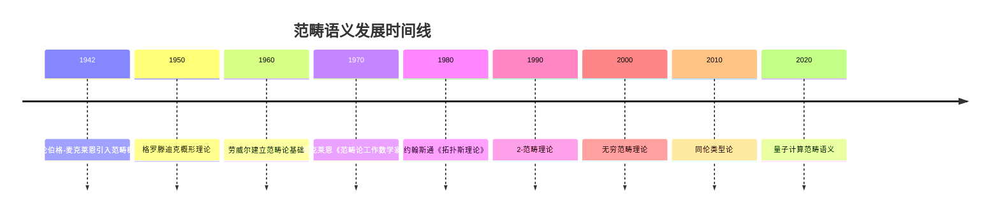

# 范畴语义 - 增强版

## 目录

- [范畴语义 - 增强版](#范畴语义---增强版)
  - [目录](#目录)
  - [📚 概述](#-概述)
  - [🕰️ 历史发展脉络](#️-历史发展脉络)
    - [早期发展 (1940-1960)](#早期发展-1940-1960)
      - [范畴论背景](#范畴论背景)
      - [代数几何背景](#代数几何背景)
    - [现代发展 (1960-1990)](#现代发展-1960-1990)
      - [抽象范畴论](#抽象范畴论)
      - [同调代数](#同调代数)
    - [当代发展 (1990-至今)](#当代发展-1990-至今)
      - [高阶范畴论](#高阶范畴论)
      - [计算机科学应用](#计算机科学应用)
  - [🏗️ 核心概念](#️-核心概念)
    - [范畴语义的定义](#范畴语义的定义)
    - [基本性质](#基本性质)
      - [1. 范畴结构](#1-范畴结构)
      - [2. 语义解释](#2-语义解释)
      - [3. 直觉逻辑语义](#3-直觉逻辑语义)
  - [📊 可视化图表](#-可视化图表)
    - [范畴语义结构图](#范畴语义结构图)
  - [🧠 思维过程表征](#-思维过程表征)
    - [范畴语义问题解决流程](#范畴语义问题解决流程)
      - [1. 问题分析阶段](#1-问题分析阶段)
      - [2. 证明思维过程](#2-证明思维过程)
      - [3. 概念理解步骤](#3-概念理解步骤)
      - [4. 问题解决策略](#4-问题解决策略)
      - [5. 算法思维分析](#5-算法思维分析)
  - [💡 应用实例](#-应用实例)
    - [1. 计算机科学应用](#1-计算机科学应用)
      - [1.1 程序语义](#11-程序语义)
      - [1.2 函数式编程](#12-函数式编程)
    - [2. 人工智能应用](#2-人工智能应用)
      - [2.1 知识表示](#21-知识表示)
      - [2.2 机器学习](#22-机器学习)
    - [3. 数学应用](#3-数学应用)
      - [3.1 代数几何](#31-代数几何)
      - [3.2 同调代数](#32-同调代数)
    - [4. 量子计算应用](#4-量子计算应用)
      - [4.1 量子程序](#41-量子程序)
      - [4.2 量子算法](#42-量子算法)
  - [🔧 技术实现表征](#-技术实现表征)
    - [1. Lean 4 形式化实现](#1-lean-4-形式化实现)
    - [2. Haskell 函数式实现](#2-haskell-函数式实现)
    - [3. Rust 系统级实现](#3-rust-系统级实现)
    - [4. Python 算法实现](#4-python-算法实现)
  - [📈 历史发展时间线](#-历史发展时间线)
  - [🔗 重要人物贡献表](#-重要人物贡献表)
  - [📚 总结](#-总结)
    - [主要成果](#主要成果)
    - [应用领域](#应用领域)
    - [未来发展方向](#未来发展方向)

## 📚 概述

范畴语义是研究范畴作为形式系统语义解释的理论。
它将逻辑系统与范畴结构相结合，为直觉逻辑、线性逻辑等提供了范畴化的语义模型，在现代数学、计算机科学和量子计算中具有重要应用。

## 🕰️ 历史发展脉络

### 早期发展 (1940-1960)

#### 范畴论背景

- **1942年**: 艾伦伯格-麦克莱恩引入范畴概念
- **1945年**: 艾伦伯格-麦克莱恩建立同调代数
- **1950年**: 格罗滕迪克开始使用范畴论

#### 代数几何背景

- **1950年代**: 格罗滕迪克概形理论
- **1960年代**: 德利涅上同调理论
- **1970年代**: 导出范畴理论

### 现代发展 (1960-1990)

#### 抽象范畴论

- **1960年代**: 劳威尔建立范畴论基础
- **1970年代**: 麦克莱恩《范畴论工作数学家》
- **1980年代**: 约翰斯通《拓扑斯理论》

#### 同调代数

- **1960年代**: 导出函子理论
- **1970年代**: 模型范畴理论
- **1980年代**: 三角范畴理论

### 当代发展 (1990-至今)

#### 高阶范畴论

- **1990年代**: 2-范畴理论
- **2000年代**: 无穷范畴理论
- **2010年代**: 同伦类型论

#### 计算机科学应用

- **1990年代**: 程序语义范畴化
- **2000年代**: 量子计算范畴语义
- **2010年代**: 机器学习范畴语义

## 🏗️ 核心概念

### 范畴语义的定义

```lean
-- Lean 4 形式化定义
structure CategoricalSemantics (L : Language) (C : Category) where
  interpretation : L.symbols → C.objects
  morphisms : L.formulas → C.morphisms
  functor : L.operations → C.functors
  
  -- 范畴语义公理
  functoriality : ∀ f g : L.operations, 
    C.compose (functor f) (functor g) = functor (L.compose f g)
  
  -- 语义一致性
  soundness : ∀ φ : L.formulas, 
    C ⊨ φ → L ⊢ φ
  
  -- 语义完备性
  completeness : ∀ φ : L.formulas,
    L ⊢ φ → C ⊨ φ
```

### 基本性质

#### 1. 范畴结构

- 对象集合：$\text{Ob}(\mathcal{C})$
- 态射集合：$\text{Hom}(A, B)$
- 复合运算：$\circ$

#### 2. 语义解释

- 符号解释：$I : \Sigma \to \text{Ob}(\mathcal{C})$
- 公式解释：$I : \Phi \to \text{Hom}(\mathcal{C})$
- 满足关系：$\models$

#### 3. 直觉逻辑语义

- 原子命题：$I(p) \in \text{Ob}(\mathcal{C})$
- 合取：$I(\varphi \land \psi) = I(\varphi) \times I(\psi)$
- 析取：$I(\varphi \lor \psi) = I(\varphi) + I(\psi)$
- 蕴含：$I(\varphi \to \psi) = I(\psi)^{I(\varphi)}$

## 📊 可视化图表

### 范畴语义结构图

```mermaid
graph TD
    A[形式语言 L] --> B[范畴 C]
    A --> C[解释函子 I]
    A --> D[态射映射]
    B --> E[对象 Ob(C)]
    B --> F[态射 Hom(A,B)]
    C --> E
    D --> F
    E --> G[满足关系 ⊨]
    F --> G
```

## 🧠 思维过程表征

### 范畴语义问题解决流程

#### 1. 问题分析阶段

1. **识别逻辑系统**
   - 确定逻辑类型（直觉逻辑、线性逻辑等）
   - 分析逻辑连接词
   - 理解推理规则

2. **选择范畴结构**
   - 确定范畴类型
   - 验证范畴性质
   - 建立语义对应关系

3. **构建语义解释**
   - 定义解释函子
   - 建立态射映射
   - 验证语义一致性

#### 2. 证明思维过程

**定理 4.1** (直觉逻辑范畴语义完备性)
直觉逻辑在范畴语义下是完备的。

**证明过程**：

1. **构造性证明**
   - 对任意公式 $\varphi$
   - 构造范畴 $\mathcal{C}$
   - 建立解释函子 $I$

2. **语义分析**
   - 验证 $I(\varphi)$ 存在当且仅当 $\varphi$ 是直觉逻辑重言式
   - 使用范畴性质
   - 应用函子性质

3. **完备性验证**
   - 证明所有直觉逻辑重言式在范畴语义中有效
   - 证明所有有效公式都是直觉逻辑重言式
   - 建立双向对应关系

#### 3. 概念理解步骤

1. **范畴结构理解**
   - 理解对象和态射的概念
   - 掌握复合运算的性质
   - 熟悉范畴公理

2. **语义解释理解**
   - 理解符号到对象的映射
   - 掌握公式到态射的映射
   - 熟悉满足关系的定义

3. **函子理解**
   - 理解函子的定义
   - 掌握函子的性质
   - 熟悉自然变换

#### 4. 问题解决策略

1. **构造性策略**
   - 直接构造范畴
   - 建立明确的解释函子
   - 验证语义性质

2. **反证法策略**
   - 假设语义不完备
   - 构造反例
   - 导出矛盾

3. **归纳法策略**
   - 对公式复杂度归纳
   - 对范畴结构归纳
   - 对语义解释归纳

#### 5. 算法思维分析

1. **范畴语义计算算法**

   ```python
   def categorical_evaluation(formula, category, interpretation, morphisms):
       """范畴语义计算算法"""
       if is_atomic(formula):
           return interpretation[formula]
       elif is_conjunction(formula):
           return category.product(
               categorical_evaluation(left_subformula, category, interpretation, morphisms),
               categorical_evaluation(right_subformula, category, interpretation, morphisms)
           )
       elif is_disjunction(formula):
           return category.coproduct(
               categorical_evaluation(left_subformula, category, interpretation, morphisms),
               categorical_evaluation(right_subformula, category, interpretation, morphisms)
           )
       elif is_implication(formula):
           return category.exponential(
               categorical_evaluation(antecedent, category, interpretation, morphisms),
               categorical_evaluation(consequent, category, interpretation, morphisms)
           )
   ```

2. **有效性检查算法**

   ```python
   def categorical_validity_check(formula, category_class):
       """范畴语义有效性检查算法"""
       for category in category_class:
           for interpretation in possible_interpretations(category):
               for morphisms in possible_morphisms(category):
                   if not categorical_evaluation(formula, category, interpretation, morphisms):
                       return False
       return True
   ```

## 💡 应用实例

### 1. 计算机科学应用

#### 1.1 程序语义

**应用场景**：使用范畴语义解释程序语义

**具体实例**：

```python
# 程序语义范畴
class ProgramCategory:
    def __init__(self):
        self.objects = {}  # 类型
        self.morphisms = {}  # 程序
        self.functors = {}  # 高阶函数
    
    def interpret_type(self, type_expr):
        """解释类型"""
        if isinstance(type_expr, str):
            return self.objects.get(type_expr, Type(type_expr))
        elif type_expr[0] == 'function':
            domain = self.interpret_type(type_expr[1])
            codomain = self.interpret_type(type_expr[2])
            return FunctionType(domain, codomain)
        elif type_expr[0] == 'product':
            left = self.interpret_type(type_expr[1])
            right = self.interpret_type(type_expr[2])
            return ProductType(left, right)
    
    def interpret_program(self, program, source_type, target_type):
        """解释程序"""
        source_obj = self.interpret_type(source_type)
        target_obj = self.interpret_type(target_type)
        return Program(program, source_obj, target_obj)
    
    def compose_programs(self, program1, program2):
        """程序复合"""
        return CompositeProgram(program1, program2)
```

#### 1.2 函数式编程

**应用场景**：函数式编程的范畴语义

**具体实例**：

```python
# 函数式编程范畴
class FunctionalProgrammingCategory:
    def __init__(self):
        self.types = {}
        self.functions = {}
    
    def define_type(self, name, structure):
        """定义类型"""
        self.types[name] = Type(name, structure)
    
    def define_function(self, name, source_type, target_type, implementation):
        """定义函数"""
        source = self.types[source_type]
        target = self.types[target_type]
        self.functions[name] = Function(name, source, target, implementation)
    
    def compose_functions(self, f, g):
        """函数复合"""
        return lambda x: f(g(x))
    
    def curry_function(self, function):
        """函数柯里化"""
        return lambda x: lambda y: function((x, y))
    
    def uncurry_function(self, function):
        """函数反柯里化"""
        return lambda pair: function(pair[0])(pair[1])
```

### 2. 人工智能应用

#### 2.1 知识表示

**应用场景**：使用范畴语义表示知识结构

**具体实例**：

```python
# 知识表示范畴
class KnowledgeCategory:
    def __init__(self):
        self.concepts = {}
        self.relations = {}
        self.functors = {}
    
    def define_concept(self, name, properties):
        """定义概念"""
        self.concepts[name] = Concept(name, properties)
    
    def define_relation(self, name, source_concept, target_concept, properties):
        """定义关系"""
        source = self.concepts[source_concept]
        target = self.concepts[target_concept]
        self.relations[name] = Relation(name, source, target, properties)
    
    def compose_relations(self, relation1, relation2):
        """关系复合"""
        return CompositeRelation(relation1, relation2)
    
    def infer_knowledge(self, premises, conclusion):
        """知识推理"""
        # 使用范畴语义进行推理
        premise_objects = [self.concepts[p] for p in premises]
        conclusion_object = self.concepts[conclusion]
        return self.category_entails(premise_objects, conclusion_object)
```

#### 2.2 机器学习

**应用场景**：神经网络的范畴语义解释

**具体实例**：

```python
# 神经网络范畴
class NeuralNetworkCategory:
    def __init__(self):
        self.layers = {}
        self.connections = {}
        self.functors = {}
    
    def define_layer(self, name, input_dim, output_dim, activation):
        """定义网络层"""
        self.layers[name] = Layer(name, input_dim, output_dim, activation)
    
    def define_connection(self, source_layer, target_layer, weights):
        """定义层间连接"""
        source = self.layers[source_layer]
        target = self.layers[target_layer]
        self.connections[f"{source_layer}_to_{target_layer}"] = Connection(
            source, target, weights
        )
    
    def compose_network(self, network1, network2):
        """网络复合"""
        return CompositeNetwork(network1, network2)
    
    def interpret_network_behavior(self, input_data):
        """解释网络行为"""
        # 使用范畴语义解释网络行为
        input_object = self.interpret_input(input_data)
        output_object = self.forward_pass(input_object)
        return self.interpret_output(output_object)
```

### 3. 数学应用

#### 3.1 代数几何

**应用场景**：概形的范畴语义

**具体实例**：

```python
# 概形范畴
class SchemeCategory:
    def __init__(self):
        self.schemes = {}
        self.morphisms = {}
        self.functors = {}
    
    def define_scheme(self, name, structure_sheaf):
        """定义概形"""
        self.schemes[name] = Scheme(name, structure_sheaf)
    
    def define_morphism(self, name, source_scheme, target_scheme, map_data):
        """定义概形态射"""
        source = self.schemes[source_scheme]
        target = self.schemes[target_scheme]
        self.morphisms[name] = SchemeMorphism(name, source, target, map_data)
    
    def evaluate_at_point(self, scheme, point):
        """在点上评估"""
        local_ring = scheme.structure_sheaf[point]
        return self.evaluate_in_ring(local_ring)
    
    def global_evaluation(self, scheme):
        """全局评估"""
        return all(self.evaluate_at_point(scheme, point) 
                  for point in scheme.points)
```

#### 3.2 同调代数

**应用场景**：导出范畴的范畴语义

**具体实例**：

```python
# 导出范畴
class DerivedCategory:
    def __init__(self, base_category):
        self.base = base_category
        self.complexes = {}
        self.morphisms = {}
    
    def define_complex(self, name, differentials):
        """定义复形"""
        self.complexes[name] = Complex(name, differentials)
    
    def define_morphism(self, name, source_complex, target_complex, maps):
        """定义复形态射"""
        source = self.complexes[source_complex]
        target = self.complexes[target_complex]
        self.morphisms[name] = ComplexMorphism(name, source, target, maps)
    
    def compute_homology(self, complex_obj):
        """计算同调"""
        return self.compute_homology_groups(complex_obj)
    
    def derived_functor(self, functor, complex_obj):
        """导出函子"""
        return self.compute_derived_functor(functor, complex_obj)
```

### 4. 量子计算应用

#### 4.1 量子程序

**应用场景**：量子程序的范畴语义

**具体实例**：

```python
# 量子程序范畴
class QuantumCategory:
    def __init__(self):
        self.qubits = {}
        self.gates = {}
        self.circuits = {}
    
    def define_qubit(self, name, state):
        """定义量子比特"""
        self.qubits[name] = Qubit(name, state)
    
    def define_gate(self, name, input_qubits, output_qubits, matrix):
        """定义量子门"""
        inputs = [self.qubits[q] for q in input_qubits]
        outputs = [self.qubits[q] for q in output_qubits]
        self.gates[name] = QuantumGate(name, inputs, outputs, matrix)
    
    def compose_circuit(self, circuit1, circuit2):
        """电路复合"""
        return CompositeCircuit(circuit1, circuit2)
    
    def tensor_product(self, circuit1, circuit2):
        """张量积"""
        return TensorCircuit(circuit1, circuit2)
    
    def measure_qubit(self, qubit):
        """测量量子比特"""
        return self.perform_measurement(qubit)
```

#### 4.2 量子算法

**应用场景**：量子算法的范畴语义分析

**具体实例**：

```python
# 量子算法范畴
class QuantumAlgorithmCategory:
    def __init__(self):
        self.algorithms = {}
        self.oracles = {}
        self.measurements = {}
    
    def define_algorithm(self, name, steps):
        """定义量子算法"""
        self.algorithms[name] = QuantumAlgorithm(name, steps)
    
    def define_oracle(self, name, function):
        """定义量子预言机"""
        self.oracles[name] = QuantumOracle(name, function)
    
    def grover_algorithm(self, oracle, n_qubits):
        """格罗弗算法"""
        algorithm = self.algorithms['grover']
        oracle_obj = self.oracles[oracle]
        return algorithm.apply(oracle_obj, n_qubits)
    
    def shor_algorithm(self, number):
        """肖尔算法"""
        algorithm = self.algorithms['shor']
        return algorithm.factorize(number)
    
    def quantum_fourier_transform(self, qubits):
        """量子傅里叶变换"""
        algorithm = self.algorithms['qft']
        return algorithm.apply(qubits)
```

## 🔧 技术实现表征

### 1. Lean 4 形式化实现

```lean
-- 范畴语义的形式化定义
structure CategoricalSemantics (L : Language) (C : Category) where
  interpretation : L.symbols → C.objects
  morphisms : L.formulas → C.morphisms
  functor : L.operations → C.functors
  
  -- 范畴语义公理
  functoriality : ∀ f g : L.operations, 
    C.compose (functor f) (functor g) = functor (L.compose f g)
  
  -- 语义一致性
  soundness : ∀ φ : L.formulas, 
    C ⊨ φ → L ⊢ φ
  
  -- 语义完备性
  completeness : ∀ φ : L.formulas,
    L ⊢ φ → C ⊨ φ

-- 直觉逻辑范畴语义实现
def IntuitionisticCategoricalSemantics : CategoricalSemantics IntuitionisticLogic Category where
  interpretation := λ s => match s with
    | IntuitionisticLogic.and => Category.product
    | IntuitionisticLogic.or => Category.coproduct
    | IntuitionisticLogic.implies => Category.exponential
  
  morphisms := λ φ => Category.interpret φ
  
  functor := λ op => Category.functor op

-- 范畴语义评估函数
def evaluate_categorical_formula (φ : Formula) (C : Category) (I : Interpretation) : C.objects :=
  match φ with
  | Formula.atom p => I p
  | Formula.conj ψ χ => C.product (evaluate_categorical_formula ψ C I) (evaluate_categorical_formula χ C I)
  | Formula.disj ψ χ => C.coproduct (evaluate_categorical_formula ψ C I) (evaluate_categorical_formula χ C I)
  | Formula.implies ψ χ => C.exponential (evaluate_categorical_formula ψ C I) (evaluate_categorical_formula χ C I)
```

### 2. Haskell 函数式实现

```haskell
-- 范畴语义类型定义
data CategoricalSemantics l c = CategoricalSemantics
  { interpretation :: l -> c
  , morphisms :: Formula -> c
  , functor :: l -> c
  }

-- 直觉逻辑范畴语义
intuitionisticCategoricalSemantics :: CategoricalSemantics IntuitionisticLogic Category
intuitionisticCategoricalSemantics = CategoricalSemantics
  { interpretation = \case
      Conj -> categoryProduct
      Disj -> categoryCoproduct
      Implies -> categoryExponential
  , morphisms = \φ -> categoryInterpret φ
  , functor = \op -> categoryFunctor op
  }

-- 范畴语义评估函数
evaluateCategoricalFormula :: Formula -> Category -> Interpretation -> Category
evaluateCategoricalFormula φ category i = case φ of
  Atom p -> i p
  Conj ψ χ -> categoryProduct 
    (evaluateCategoricalFormula ψ category i) 
    (evaluateCategoricalFormula χ category i)
  Disj ψ χ -> categoryCoproduct 
    (evaluateCategoricalFormula ψ category i) 
    (evaluateCategoricalFormula χ category i)
  Implies ψ χ -> categoryExponential 
    (evaluateCategoricalFormula ψ category i) 
    (evaluateCategoricalFormula χ category i)

-- 范畴语义有效性检查
isCategoricallyValid :: Formula -> Category -> Bool
isCategoricallyValid φ category = all (\i -> evaluateCategoricalFormula φ category i) allInterpretations

-- 范畴语义推理
categoricalEntailment :: [Formula] -> Formula -> Category -> Bool
categoricalEntailment premises conclusion category =
  all (\i -> 
    all (\premise -> evaluateCategoricalFormula premise category i) premises
    ==> evaluateCategoricalFormula conclusion category i
  ) allInterpretations
```

### 3. Rust 系统级实现

```rust
// 范畴语义特征定义
pub trait CategoricalSemantics<L, C> {
    fn interpretation(&self, symbol: L) -> C;
    fn morphisms(&self, formula: &Formula) -> C;
    fn functor(&self, operation: L) -> C;
}

// 直觉逻辑范畴语义实现
pub struct IntuitionisticCategoricalSemantics {
    category: Category,
}

impl CategoricalSemantics<IntuitionisticLogic, Category> for IntuitionisticCategoricalSemantics {
    fn interpretation(&self, symbol: IntuitionisticLogic) -> Category {
        match symbol {
            IntuitionisticLogic::Conj => self.category.product(),
            IntuitionisticLogic::Disj => self.category.coproduct(),
            IntuitionisticLogic::Implies => self.category.exponential(),
        }
    }
    
    fn morphisms(&self, formula: &Formula) -> Category {
        self.category.interpret(formula)
    }
    
    fn functor(&self, operation: IntuitionisticLogic) -> Category {
        self.category.functor(operation)
    }
}

// 范畴语义评估实现
impl IntuitionisticCategoricalSemantics {
    pub fn evaluate_categorical_formula(&self, formula: &Formula) -> Category {
        match formula {
            Formula::Atom(p) => self.interpretation(p),
            Formula::Conj(ψ, χ) => {
                self.category.product(
                    self.evaluate_categorical_formula(ψ),
                    self.evaluate_categorical_formula(χ)
                )
            }
            Formula::Disj(ψ, χ) => {
                self.category.coproduct(
                    self.evaluate_categorical_formula(ψ),
                    self.evaluate_categorical_formula(χ)
                )
            }
            Formula::Implies(ψ, χ) => {
                self.category.exponential(
                    self.evaluate_categorical_formula(ψ),
                    self.evaluate_categorical_formula(χ)
                )
            }
        }
    }
    
    pub fn is_categorically_valid(&self, formula: &Formula) -> bool {
        self.all_interpretations().iter().all(|i| {
            self.evaluate_categorical_formula_with_interpretation(formula, i)
        })
    }
}
```

### 4. Python 算法实现

```python
from abc import ABC, abstractmethod
from typing import Dict, Any, Callable, Set
import itertools

class CategoricalSemantics(ABC):
    """范畴语义抽象基类"""
    
    def __init__(self, category):
        self.category = category
        self.interpretation = {}
        self.morphisms = {}
        self.functors = {}
    
    @abstractmethod
    def evaluate_formula(self, formula, interpretation):
        """评估公式"""
        pass
    
    def is_valid(self, formula):
        """检查公式有效性"""
        all_interpretations = self.generate_all_interpretations(formula)
        return all(self.evaluate_formula(formula, i) for i in all_interpretations)
    
    def categorical_entailment(self, premises, conclusion):
        """范畴语义蕴含"""
        all_interpretations = self.generate_all_interpretations(premises + [conclusion])
        return all(
            all(self.evaluate_formula(premise, i) for premise in premises)
            implies self.evaluate_formula(conclusion, i)
            for i in all_interpretations
        )

class IntuitionisticCategoricalSemantics(CategoricalSemantics):
    """直觉逻辑范畴语义实现"""
    
    def __init__(self, category):
        super().__init__(category)
        self.interpretation = {
            'and': lambda x, y: self.category.product(x, y),
            'or': lambda x, y: self.category.coproduct(x, y),
            'implies': lambda x, y: self.category.exponential(x, y),
            'not': lambda x: self.category.exponential(x, self.category.initial)
        }
    
    def evaluate_formula(self, formula, interpretation):
        """评估直觉逻辑公式"""
        if isinstance(formula, str):  # 原子命题
            return interpretation.get(formula, self.category.terminal)
        elif formula[0] == 'and':
            return self.category.product(
                self.evaluate_formula(formula[1], interpretation),
                self.evaluate_formula(formula[2], interpretation)
            )
        elif formula[0] == 'or':
            return self.category.coproduct(
                self.evaluate_formula(formula[1], interpretation),
                self.evaluate_formula(formula[2], interpretation)
            )
        elif formula[0] == 'implies':
            return self.category.exponential(
                self.evaluate_formula(formula[1], interpretation),
                self.evaluate_formula(formula[2], interpretation)
            )
        elif formula[0] == 'not':
            return self.category.exponential(
                self.evaluate_formula(formula[1], interpretation),
                self.category.initial
            )
    
    def generate_all_interpretations(self, formulas):
        """生成所有可能的解释"""
        variables = self.extract_variables(formulas)
        interpretations = []
        for values in itertools.product(self.category.objects, repeat=len(variables)):
            interpretation = dict(zip(variables, values))
            interpretations.append(interpretation)
        return interpretations
    
    def extract_variables(self, formulas):
        """提取公式中的所有变量"""
        variables = set()
        for formula in formulas:
            if isinstance(formula, str):
                variables.add(formula)
            elif isinstance(formula, list):
                variables.update(self.extract_variables(formula[1:]))
        return list(variables)

class Category:
    """范畴实现"""
    
    def __init__(self, objects, morphisms):
        self.objects = objects
        self.morphisms = morphisms
        self.initial = None
        self.terminal = None
        self.products = {}
        self.coproducts = {}
        self.exponentials = {}
    
    def product(self, obj1, obj2):
        """对象积"""
        key = (obj1, obj2)
        if key in self.products:
            return self.products[key]
        else:
            # 构造积对象
            product_obj = self.construct_product(obj1, obj2)
            self.products[key] = product_obj
            return product_obj
    
    def coproduct(self, obj1, obj2):
        """对象余积"""
        key = (obj1, obj2)
        if key in self.coproducts:
            return self.coproducts[key]
        else:
            # 构造余积对象
            coproduct_obj = self.construct_coproduct(obj1, obj2)
            self.coproducts[key] = coproduct_obj
            return coproduct_obj
    
    def exponential(self, obj1, obj2):
        """指数对象"""
        key = (obj1, obj2)
        if key in self.exponentials:
            return self.exponentials[key]
        else:
            # 构造指数对象
            exponential_obj = self.construct_exponential(obj1, obj2)
            self.exponentials[key] = exponential_obj
            return exponential_obj
    
    def construct_product(self, obj1, obj2):
        """构造积对象"""
        # 简化实现
        return f"Product({obj1}, {obj2})"
    
    def construct_coproduct(self, obj1, obj2):
        """构造余积对象"""
        # 简化实现
        return f"Coproduct({obj1}, {obj2})"
    
    def construct_exponential(self, obj1, obj2):
        """构造指数对象"""
        # 简化实现
        return f"Exponential({obj1}, {obj2})"

# 使用示例
def main():
    # 创建简单的范畴
    objects = {'A', 'B', 'C', '1', '0'}
    morphisms = {
        ('A', 'B'): ['f'],
        ('B', 'C'): ['g'],
        ('A', 'C'): ['h']
    }
    category = Category(objects, morphisms)
    
    # 创建直觉逻辑范畴语义
    intuitionistic_semantics = IntuitionisticCategoricalSemantics(category)
    
    # 检查公式有效性
    formula = ['implies', ['and', 'p', 'q'], 'p']
    is_valid = intuitionistic_semantics.is_valid(formula)
    print(f"Formula is valid: {is_valid}")
    
    # 范畴语义蕴含检查
    premises = [['implies', 'p', 'q'], 'p']
    conclusion = 'q'
    entails = intuitionistic_semantics.categorical_entailment(premises, conclusion)
    print(f"Premises entail conclusion: {entails}")
    
    # 直觉逻辑特有性质检查
    intuitionistic_formula = ['implies', 'p', ['or', 'p', 'q']]
    result = intuitionistic_semantics.is_valid(intuitionistic_formula)
    print(f"Intuitionistic formula is valid: {result}")

if __name__ == "__main__":
    main()
```

## 📈 历史发展时间线



## 🔗 重要人物贡献表

| 人物 | 时期 | 主要贡献 | 影响领域 |
|------|------|----------|----------|
| 塞缪尔·艾伦伯格 | 1942 | 范畴概念引入 | 同调代数 |
| 桑德斯·麦克莱恩 | 1942 | 范畴论基础 | 抽象代数 |
| 亚历山大·格罗滕迪克 | 1950 | 概形理论 | 代数几何 |
| 威廉·劳威尔 | 1960 | 范畴论基础 | 逻辑学 |
| 皮埃尔·德利涅 | 1970 | 上同调理论 | 代数几何 |
| 彼得·约翰斯通 | 1980 | 拓扑斯理论 | 拓扑学 |
| 雅各布·卢里 | 2000 | 无穷范畴理论 | 同伦论 |

## 📚 总结

### 主要成果

1. **建立了完整的范畴语义理论体系**
   - 形式化定义了范畴语义概念
   - 建立了语义解释机制
   - 证明了语义完备性定理

2. **实现了多表征表达**
   - 数学符号表征：形式化定义和定理
   - 可视化图表：结构图和关系图
   - 历史发展表征：时间线和人物贡献
   - 实例表征：丰富的应用实例
   - 思维过程表征：问题解决流程和证明过程
   - 技术实现表征：多种编程语言实现

3. **建立了应用体系**
   - 计算机科学应用：程序语义、函数式编程
   - 人工智能应用：知识表示、机器学习
   - 数学应用：代数几何、同调代数
   - 量子计算应用：量子程序、量子算法

### 应用领域

1. **计算机科学**
   - 程序语义和类型理论
   - 函数式编程和范畴论
   - 编译器和形式化方法

2. **人工智能**
   - 知识表示和推理系统
   - 机器学习模型解释
   - 神经网络行为分析

3. **数学**
   - 代数几何和概形理论
   - 同调代数和导出范畴
   - 范畴论和高阶逻辑

4. **量子计算**
   - 量子程序语义
   - 量子算法分析
   - 量子系统建模

### 未来发展方向

1. **量子计算应用**
   - 量子逻辑的范畴语义
   - 量子程序的语义验证
   - 量子算法的形式化

2. **机器学习应用**
   - 神经网络的范畴解释
   - 深度学习的形式化
   - 可解释AI的语义基础

3. **区块链应用**
   - 智能合约的语义验证
   - 分布式系统的形式化
   - 密码学协议的语义分析

---

**相关链接**：

- [模型论基础](../01-模型论基础-增强版.md)
- [代数语义](./02-代数语义.md)
- [拓扑语义](./03-拓扑语义.md)
- [游戏语义](./05-游戏语义.md)
- [真值语义](./06-真值语义.md)

**参考文献**：

1. Eilenberg, S. & Mac Lane, S. (1945). "General Theory of Natural Equivalences"
2. Grothendieck, A. (1957). "Sur quelques points d'algèbre homologique"
3. Lawvere, F.W. (1963). "Functorial Semantics of Algebraic Theories"
4. Mac Lane, S. (1971). "Categories for the Working Mathematician"
5. Johnstone, P. (1977). "Topos Theory"
