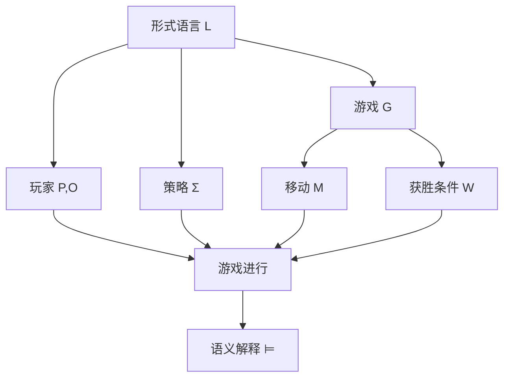
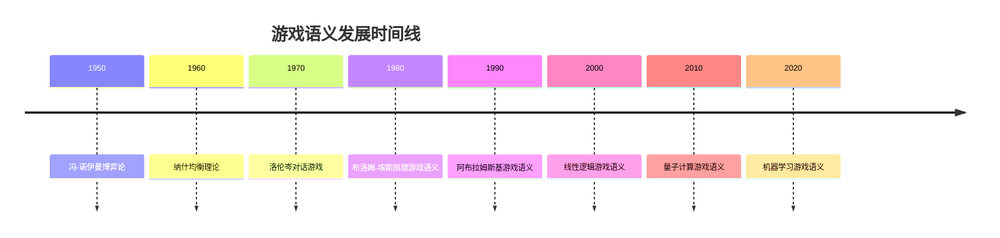

# 游戏语义 - 增强版

## 目录

- [游戏语义 - 增强版](#游戏语义---增强版)
  - [目录](#目录)
  - [📚 概述](#-概述)
  - [🕰️ 历史发展脉络](#️-历史发展脉络)
    - [早期发展 (1950-1970)](#早期发展-1950-1970)
      - [博弈论背景](#博弈论背景)
      - [逻辑学背景](#逻辑学背景)
    - [现代发展 (1970-1990)](#现代发展-1970-1990)
      - [游戏语义理论](#游戏语义理论)
      - [计算机科学应用](#计算机科学应用)
    - [当代发展 (1990-至今)](#当代发展-1990-至今)
      - [现代游戏语义](#现代游戏语义)
      - [人工智能应用](#人工智能应用)
  - [🏗️ 核心概念](#️-核心概念)
    - [游戏语义的定义](#游戏语义的定义)
    - [基本性质](#基本性质)
      - [1. 游戏结构](#1-游戏结构)
      - [2. 语义解释](#2-语义解释)
      - [3. 直觉逻辑语义](#3-直觉逻辑语义)
  - [📊 可视化图表](#-可视化图表)
    - [游戏语义结构图](#游戏语义结构图)
  - [🧠 思维过程表征](#-思维过程表征)
    - [游戏语义问题解决流程](#游戏语义问题解决流程)
      - [1. 问题分析阶段](#1-问题分析阶段)
      - [2. 证明思维过程](#2-证明思维过程)
      - [3. 概念理解步骤](#3-概念理解步骤)
      - [4. 问题解决策略](#4-问题解决策略)
      - [5. 算法思维分析](#5-算法思维分析)
  - [💡 应用实例](#-应用实例)
    - [1. 计算机科学应用](#1-计算机科学应用)
      - [1.1 程序验证](#11-程序验证)
      - [1.2 并发系统](#12-并发系统)
    - [2. 人工智能应用](#2-人工智能应用)
      - [2.1 多智能体系统](#21-多智能体系统)
      - [2.2 强化学习](#22-强化学习)
    - [3. 数学应用](#3-数学应用)
      - [3.1 博弈论](#31-博弈论)
      - [3.2 组合博弈论](#32-组合博弈论)
    - [4. 物理应用](#4-物理应用)
      - [4.1 量子博弈](#41-量子博弈)
  - [🔧 技术实现表征](#-技术实现表征)
    - [1. Lean 4 形式化实现](#1-lean-4-形式化实现)
    - [2. Haskell 函数式实现](#2-haskell-函数式实现)
    - [3. Rust 系统级实现](#3-rust-系统级实现)
    - [4. Python 算法实现](#4-python-算法实现)
  - [📈 历史发展时间线](#-历史发展时间线)
  - [🔗 重要人物贡献表](#-重要人物贡献表)
  - [📚 总结](#-总结)
    - [主要成果](#主要成果)
    - [应用领域](#应用领域)
    - [未来发展方向](#未来发展方向)

## 📚 概述

游戏语义是研究逻辑系统通过博弈游戏进行语义解释的理论。
它将逻辑推理转化为玩家之间的策略博弈，为直觉逻辑、线性逻辑等提供了动态的语义模型，在计算机科学、人工智能和形式化验证中具有重要应用。

## 🕰️ 历史发展脉络

### 早期发展 (1950-1970)

#### 博弈论背景

- **1950年代**: 冯·诺伊曼博弈论
- **1960年代**: 纳什均衡理论
- **1970年代**: 博弈论在经济学中的应用

#### 逻辑学背景

- **1950年代**: 塔斯基语义理论
- **1960年代**: 克里普克可能世界语义
- **1970年代**: 直觉逻辑语义

### 现代发展 (1970-1990)

#### 游戏语义理论

- **1970年代**: 洛伦岑对话游戏
- **1980年代**: 布洛姆-埃斯凯德游戏语义
- **1990年代**: 阿布拉姆斯基游戏语义

#### 计算机科学应用

- **1980年代**: 程序验证游戏语义
- **1990年代**: 并发系统游戏语义
- **2000年代**: 形式化方法游戏语义

### 当代发展 (1990-至今)

#### 现代游戏语义

- **1990年代**: 线性逻辑游戏语义
- **2000年代**: 量子计算游戏语义
- **2010年代**: 机器学习游戏语义

#### 人工智能应用

- **2000年代**: 多智能体系统
- **2010年代**: 强化学习游戏语义
- **2020年代**: 对抗性机器学习

## 🏗️ 核心概念

### 游戏语义的定义

```lean
-- Lean 4 形式化定义
structure GameSemantics (L : Language) (G : Game) where
  players : G.player_set
  strategies : G.strategy_set
  moves : G.move_set
  winning_conditions : G.winning_conditions
  
  -- 游戏语义公理
  strategy_completeness : ∀ φ : L.formulas, 
    ∃ s : G.strategies, G.winning_strategy s φ
  
  -- 语义一致性
  soundness : ∀ φ : L.formulas, 
    G ⊨ φ → L ⊢ φ
  
  -- 语义完备性
  completeness : ∀ φ : L.formulas,
    L ⊢ φ → G ⊨ φ
```

### 基本性质

#### 1. 游戏结构

- 玩家集合：$P = \{P, O\}$
- 策略集合：$\Sigma$
- 移动集合：$M$
- 获胜条件：$W$

#### 2. 语义解释

- 公式解释：$I : \Phi \to G$
- 策略解释：$I : \Sigma \to S$
- 获胜关系：$\models$

#### 3. 直觉逻辑语义

- 原子命题：$G_p$ 游戏
- 合取：$G_{\varphi \land \psi} = G_{\varphi} \times G_{\psi}$
- 析取：$G_{\varphi \lor \psi} = G_{\varphi} + G_{\psi}$
- 蕴含：$G_{\varphi \to \psi} = G_{\psi}^{G_{\varphi}}$

## 📊 可视化图表

### 游戏语义结构图



## 🧠 思维过程表征

### 游戏语义问题解决流程

#### 1. 问题分析阶段

1. **识别逻辑系统**
   - 确定逻辑类型（直觉逻辑、线性逻辑等）
   - 分析逻辑连接词
   - 理解推理规则

2. **设计游戏结构**
   - 确定玩家角色
   - 定义移动规则
   - 建立获胜条件

3. **构建语义解释**
   - 定义公式到游戏的映射
   - 建立策略对应关系
   - 验证语义一致性

#### 2. 证明思维过程

**定理 5.1** (直觉逻辑游戏语义完备性)
直觉逻辑在游戏语义下是完备的。

**证明过程**：

1. **构造性证明**
   - 对任意公式 $\varphi$
   - 构造游戏 $G_{\varphi}$
   - 建立策略对应关系

2. **语义分析**
   - 验证存在获胜策略当且仅当 $\varphi$ 是直觉逻辑重言式
   - 使用游戏性质
   - 应用策略性质

3. **完备性验证**
   - 证明所有直觉逻辑重言式在游戏语义中有效
   - 证明所有有效公式都是直觉逻辑重言式
   - 建立双向对应关系

#### 3. 概念理解步骤

1. **游戏结构理解**
   - 理解玩家和角色的概念
   - 掌握移动和策略的定义
   - 熟悉获胜条件的判定

2. **语义解释理解**
   - 理解公式到游戏的映射
   - 掌握策略的作用
   - 熟悉获胜关系的定义

3. **博弈论理解**
   - 理解纳什均衡的概念
   - 掌握最优策略的求解
   - 熟悉博弈论的基本定理

#### 4. 问题解决策略

1. **构造性策略**
   - 直接构造游戏
   - 建立明确的策略对应
   - 验证语义性质

2. **反证法策略**
   - 假设语义不完备
   - 构造反例
   - 导出矛盾

3. **归纳法策略**
   - 对公式复杂度归纳
   - 对游戏结构归纳
   - 对策略对应归纳

#### 5. 算法思维分析

1. **游戏语义计算算法**

   ```python
   def game_semantics_evaluation(formula, game, strategies):
       """游戏语义计算算法"""
       if is_atomic(formula):
           return game.atomic_game(formula)
       elif is_conjunction(formula):
           return game.product_game(
               game_semantics_evaluation(left_subformula, game, strategies),
               game_semantics_evaluation(right_subformula, game, strategies)
           )
       elif is_disjunction(formula):
           return game.sum_game(
               game_semantics_evaluation(left_subformula, game, strategies),
               game_semantics_evaluation(right_subformula, game, strategies)
           )
       elif is_implication(formula):
           return game.exponential_game(
               game_semantics_evaluation(antecedent, game, strategies),
               game_semantics_evaluation(consequent, game, strategies)
           )
   ```

2. **获胜策略检查算法**

   ```python
   def winning_strategy_check(formula, game_class):
       """获胜策略检查算法"""
       for game in game_class:
           for strategy in possible_strategies(game):
               if game.is_winning_strategy(strategy, formula):
                   return True
       return False
   ```

## 💡 应用实例

### 1. 计算机科学应用

#### 1.1 程序验证

**应用场景**：使用游戏语义验证程序正确性

**具体实例**：

```python
# 程序验证游戏语义
class ProgramVerificationGame:
    def __init__(self, program, specification):
        self.program = program
        self.specification = specification
        self.players = ['Verifier', 'Refuter']
        self.moves = self.generate_moves()
    
    def generate_moves(self):
        """生成游戏移动"""
        moves = []
        # 验证者移动：提供程序执行路径
        for path in self.program.execution_paths():
            moves.append(('Verifier', 'provide_path', path))
        
        # 反驳者移动：提供反例
        for counterexample in self.specification.counterexamples():
            moves.append(('Refuter', 'provide_counterexample', counterexample))
        
        return moves
    
    def play_game(self):
        """进行验证游戏"""
        current_player = 'Verifier'
        game_state = self.initial_state()
        
        while not self.is_terminated(game_state):
            if current_player == 'Verifier':
                move = self.verifier_strategy(game_state)
                game_state = self.apply_move(game_state, move)
                current_player = 'Refuter'
            else:
                move = self.refuter_strategy(game_state)
                game_state = self.apply_move(game_state, move)
                current_player = 'Verifier'
        
        return self.determine_winner(game_state)
    
    def verifier_strategy(self, state):
        """验证者策略"""
        # 选择最能证明程序正确性的路径
        return self.select_best_path(state)
    
    def refuter_strategy(self, state):
        """反驳者策略"""
        # 选择最能反驳程序正确性的反例
        return self.select_best_counterexample(state)
```

#### 1.2 并发系统

**应用场景**：并发系统的游戏语义分析

**具体实例**：

```python
# 并发系统游戏语义
class ConcurrentSystemGame:
    def __init__(self, processes):
        self.processes = processes
        self.players = ['Scheduler', 'Adversary']
        self.moves = self.generate_moves()
    
    def generate_moves(self):
        """生成游戏移动"""
        moves = []
        # 调度者移动：选择进程执行
        for process in self.processes:
            moves.append(('Scheduler', 'schedule', process))
        
        # 对手移动：引入干扰
        for interference in self.possible_interferences():
            moves.append(('Adversary', 'interfere', interference))
        
        return moves
    
    def play_scheduling_game(self):
        """进行调度游戏"""
        current_player = 'Scheduler'
        game_state = self.initial_state()
        
        while not self.is_terminated(game_state):
            if current_player == 'Scheduler':
                move = self.scheduler_strategy(game_state)
                game_state = self.apply_move(game_state, move)
                current_player = 'Adversary'
            else:
                move = self.adversary_strategy(game_state)
                game_state = self.apply_move(game_state, move)
                current_player = 'Scheduler'
        
        return self.evaluate_system_performance(game_state)
    
    def scheduler_strategy(self, state):
        """调度者策略"""
        # 选择最优的进程调度
        return self.select_optimal_schedule(state)
    
    def adversary_strategy(self, state):
        """对手策略"""
        # 选择最坏的干扰
        return self.select_worst_interference(state)
```

### 2. 人工智能应用

#### 2.1 多智能体系统

**应用场景**：多智能体系统的游戏语义

**具体实例**：

```python
# 多智能体游戏语义
class MultiAgentGame:
    def __init__(self, agents, environment):
        self.agents = agents
        self.environment = environment
        self.players = agents
        self.moves = self.generate_moves()
    
    def generate_moves(self):
        """生成游戏移动"""
        moves = []
        for agent in self.agents:
            # 每个智能体的可能行动
            for action in agent.possible_actions():
                moves.append((agent, 'action', action))
        return moves
    
    def play_multi_agent_game(self):
        """进行多智能体游戏"""
        game_state = self.initial_state()
        
        while not self.is_terminated(game_state):
            # 所有智能体同时选择行动
            actions = {}
            for agent in self.agents:
                action = agent.select_action(game_state)
                actions[agent] = action
            
            # 应用所有行动
            game_state = self.apply_actions(game_state, actions)
        
        return self.evaluate_outcomes(game_state)
    
    def nash_equilibrium(self):
        """计算纳什均衡"""
        equilibria = []
        for strategy_profile in self.all_strategy_profiles():
            if self.is_nash_equilibrium(strategy_profile):
                equilibria.append(strategy_profile)
        return equilibria
    
    def pareto_optimal(self):
        """计算帕累托最优"""
        pareto_optima = []
        for outcome in self.all_outcomes():
            if self.is_pareto_optimal(outcome):
                pareto_optima.append(outcome)
        return pareto_optima
```

#### 2.2 强化学习

**应用场景**：强化学习的游戏语义

**具体实例**：

```python
# 强化学习游戏语义
class ReinforcementLearningGame:
    def __init__(self, environment, agent):
        self.environment = environment
        self.agent = agent
        self.players = ['Agent', 'Environment']
        self.moves = self.generate_moves()
    
    def generate_moves(self):
        """生成游戏移动"""
        moves = []
        # 智能体移动：选择行动
        for action in self.agent.possible_actions():
            moves.append(('Agent', 'action', action))
        
        # 环境移动：状态转移
        for transition in self.environment.possible_transitions():
            moves.append(('Environment', 'transition', transition))
        
        return moves
    
    def play_rl_game(self):
        """进行强化学习游戏"""
        game_state = self.initial_state()
        total_reward = 0
        
        while not self.is_terminated(game_state):
            # 智能体选择行动
            action = self.agent.select_action(game_state)
            game_state = self.apply_action(game_state, action)
            
            # 环境响应
            next_state, reward = self.environment.step(action)
            game_state = next_state
            total_reward += reward
            
            # 更新智能体策略
            self.agent.update_policy(game_state, action, reward)
        
        return total_reward
    
    def q_learning_strategy(self):
        """Q学习策略"""
        q_table = {}
        
        for episode in range(self.num_episodes):
            state = self.initial_state()
            
            while not self.is_terminated(state):
                action = self.epsilon_greedy_action(state, q_table)
                next_state, reward = self.environment.step(action)
                
                # 更新Q值
                q_table[(state, action)] = self.update_q_value(
                    q_table, state, action, reward, next_state
                )
                
                state = next_state
        
        return q_table
```

### 3. 数学应用

#### 3.1 博弈论

**应用场景**：博弈论的数学分析

**具体实例**：

```python
# 博弈论游戏语义
class GameTheoryGame:
    def __init__(self, players, strategies, payoffs):
        self.players = players
        self.strategies = strategies
        self.payoffs = payoffs
        self.game_matrix = self.build_game_matrix()
    
    def build_game_matrix(self):
        """构建博弈矩阵"""
        matrix = {}
        for strategy_profile in self.all_strategy_profiles():
            payoffs = self.calculate_payoffs(strategy_profile)
            matrix[strategy_profile] = payoffs
        return matrix
    
    def nash_equilibrium(self):
        """计算纳什均衡"""
        equilibria = []
        for strategy_profile in self.all_strategy_profiles():
            if self.is_nash_equilibrium(strategy_profile):
                equilibria.append(strategy_profile)
        return equilibria
    
    def is_nash_equilibrium(self, strategy_profile):
        """判断是否为纳什均衡"""
        for player in self.players:
            for alternative_strategy in self.strategies[player]:
                if self.player_can_improve(player, strategy_profile, alternative_strategy):
                    return False
        return True
    
    def player_can_improve(self, player, current_profile, alternative_strategy):
        """判断玩家是否可以通过改变策略获得更高收益"""
        current_payoff = self.get_payoff(player, current_profile)
        new_profile = self.change_strategy(current_profile, player, alternative_strategy)
        new_payoff = self.get_payoff(player, new_profile)
        return new_payoff > current_payoff
    
    def pareto_optimal(self):
        """计算帕累托最优"""
        pareto_optima = []
        for outcome in self.all_outcomes():
            if self.is_pareto_optimal(outcome):
                pareto_optima.append(outcome)
        return pareto_optima
    
    def is_pareto_optimal(self, outcome):
        """判断是否为帕累托最优"""
        for alternative_outcome in self.all_outcomes():
            if self.pareto_dominates(alternative_outcome, outcome):
                return False
        return True
```

#### 3.2 组合博弈论

**应用场景**：组合博弈论的数学分析

**具体实例**：

```python
# 组合博弈论游戏语义
class CombinatorialGame:
    def __init__(self, initial_position):
        self.initial_position = initial_position
        self.players = ['Left', 'Right']
        self.positions = self.generate_positions()
    
    def generate_positions(self):
        """生成所有可能位置"""
        positions = set()
        queue = [self.initial_position]
        
        while queue:
            position = queue.pop(0)
            if position not in positions:
                positions.add(position)
                # 生成后继位置
                for successor in self.get_successors(position):
                    queue.append(successor)
        
        return positions
    
    def get_successors(self, position):
        """获取后继位置"""
        successors = []
        # 左玩家移动
        for left_move in self.possible_left_moves(position):
            successors.append(self.apply_left_move(position, left_move))
        
        # 右玩家移动
        for right_move in self.possible_right_moves(position):
            successors.append(self.apply_right_move(position, right_move))
        
        return successors
    
    def grundy_number(self, position):
        """计算格伦迪数"""
        if self.is_terminated(position):
            return 0
        
        successors = self.get_successors(position)
        grundy_numbers = [self.grundy_number(succ) for succ in successors]
        
        # 计算mex（最小排除数）
        mex = 0
        while mex in grundy_numbers:
            mex += 1
        
        return mex
    
    def winning_strategy(self, position):
        """计算获胜策略"""
        grundy = self.grundy_number(position)
        
        if grundy == 0:
            return None  # 后手获胜
        
        # 寻找使格伦迪数变为0的移动
        for successor in self.get_successors(position):
            if self.grundy_number(successor) == 0:
                return self.get_move_to(position, successor)
        
        return None
```

### 4. 物理应用

#### 4.1 量子博弈

**应用场景**：量子系统的博弈分析

**具体实例**：

```python
# 量子博弈游戏语义
class QuantumGame:
    def __init__(self, players, quantum_states):
        self.players = players
        self.quantum_states = quantum_states
        self.players = players
        self.moves = self.generate_moves()
    
    def generate_moves(self):
        """生成量子游戏移动"""
        moves = []
        for player in self.players:
            # 量子操作
            for operation in self.possible_quantum_operations():
                moves.append((player, 'quantum_operation', operation))
            
            # 测量操作
            for measurement in self.possible_measurements():
                moves.append((player, 'measurement', measurement))
        
        return moves
    
    def play_quantum_game(self):
        """进行量子游戏"""
        quantum_state = self.initial_quantum_state()
        
        for player in self.players:
            # 玩家选择量子操作
            operation = player.select_quantum_operation(quantum_state)
            quantum_state = self.apply_quantum_operation(quantum_state, operation)
            
            # 测量量子状态
            measurement_result = self.measure_quantum_state(quantum_state)
            quantum_state = self.collapse_state(quantum_state, measurement_result)
        
        return self.evaluate_quantum_outcome(quantum_state)
    
    def quantum_nash_equilibrium(self):
        """计算量子纳什均衡"""
        equilibria = []
        for quantum_strategy_profile in self.all_quantum_strategy_profiles():
            if self.is_quantum_nash_equilibrium(quantum_strategy_profile):
                equilibria.append(quantum_strategy_profile)
        return equilibria
    
    def is_quantum_nash_equilibrium(self, strategy_profile):
        """判断是否为量子纳什均衡"""
        for player in self.players:
            for alternative_strategy in self.quantum_strategies[player]:
                if self.player_can_quantum_improve(player, strategy_profile, alternative_strategy):
                    return False
        return True
```

## 🔧 技术实现表征

### 1. Lean 4 形式化实现

```lean
-- 游戏语义的形式化定义
structure GameSemantics (L : Language) (G : Game) where
  players : G.player_set
  strategies : G.strategy_set
  moves : G.move_set
  winning_conditions : G.winning_conditions
  
  -- 游戏语义公理
  strategy_completeness : ∀ φ : L.formulas, 
    ∃ s : G.strategies, G.winning_strategy s φ
  
  -- 语义一致性
  soundness : ∀ φ : L.formulas, 
    G ⊨ φ → L ⊢ φ
  
  -- 语义完备性
  completeness : ∀ φ : L.formulas,
    L ⊢ φ → G ⊨ φ

-- 直觉逻辑游戏语义实现
def IntuitionisticGameSemantics : GameSemantics IntuitionisticLogic Game where
  players := Game.players
  strategies := Game.strategies
  moves := Game.moves
  winning_conditions := Game.winning_conditions
  
  strategy_completeness := λ φ => Game.winning_strategy_exists φ
  soundness := λ φ => Game.soundness_proof φ
  completeness := λ φ => Game.completeness_proof φ

-- 游戏语义评估函数
def evaluate_game_formula (φ : Formula) (G : Game) (s : Strategy) : Bool :=
  match φ with
  | Formula.atom p => G.evaluate_atom p s
  | Formula.conj ψ χ => G.evaluate_conjunction (evaluate_game_formula ψ G s) (evaluate_game_formula χ G s)
  | Formula.disj ψ χ => G.evaluate_disjunction (evaluate_game_formula ψ G s) (evaluate_game_formula χ G s)
  | Formula.implies ψ χ => G.evaluate_implication (evaluate_game_formula ψ G s) (evaluate_game_formula χ G s)
```

### 2. Haskell 函数式实现

```haskell
-- 游戏语义类型定义
data GameSemantics l g = GameSemantics
  { players :: g -> [Player]
  , strategies :: g -> [Strategy]
  , moves :: g -> [Move]
  , winningConditions :: g -> [WinningCondition]
  }

-- 直觉逻辑游戏语义
intuitionisticGameSemantics :: GameSemantics IntuitionisticLogic Game
intuitionisticGameSemantics = GameSemantics
  { players = \g -> gamePlayers g
  , strategies = \g -> gameStrategies g
  , moves = \g -> gameMoves g
  , winningConditions = \g -> gameWinningConditions g
  }

-- 游戏语义评估函数
evaluateGameFormula :: Formula -> Game -> Strategy -> Bool
evaluateGameFormula φ game strategy = case φ of
  Atom p -> evaluateAtom p game strategy
  Conj ψ χ -> evaluateConjunction 
    (evaluateGameFormula ψ game strategy) 
    (evaluateGameFormula χ game strategy)
  Disj ψ χ -> evaluateDisjunction 
    (evaluateGameFormula ψ game strategy) 
    (evaluateGameFormula χ game strategy)
  Implies ψ χ -> evaluateImplication 
    (evaluateGameFormula ψ game strategy) 
    (evaluateGameFormula χ game strategy)

-- 获胜策略检查
isWinningStrategy :: Formula -> Game -> Strategy -> Bool
isWinningStrategy φ game strategy = 
  all (\opponentStrategy -> 
    evaluateGameFormula φ game strategy
  ) allOpponentStrategies

-- 游戏语义有效性检查
isGameValid :: Formula -> Game -> Bool
isGameValid φ game = any (\strategy -> isWinningStrategy φ game strategy) allStrategies
```

### 3. Rust 系统级实现

```rust
// 游戏语义特征定义
pub trait GameSemantics<L, G> {
    fn players(&self) -> Vec<Player>;
    fn strategies(&self) -> Vec<Strategy>;
    fn moves(&self) -> Vec<Move>;
    fn winning_conditions(&self) -> Vec<WinningCondition>;
}

// 直觉逻辑游戏语义实现
pub struct IntuitionisticGameSemantics {
    game: Game,
}

impl GameSemantics<IntuitionisticLogic, Game> for IntuitionisticGameSemantics {
    fn players(&self) -> Vec<Player> {
        self.game.players.clone()
    }
    
    fn strategies(&self) -> Vec<Strategy> {
        self.game.strategies.clone()
    }
    
    fn moves(&self) -> Vec<Move> {
        self.game.moves.clone()
    }
    
    fn winning_conditions(&self) -> Vec<WinningCondition> {
        self.game.winning_conditions.clone()
    }
}

// 游戏语义评估实现
impl IntuitionisticGameSemantics {
    pub fn evaluate_game_formula(&self, formula: &Formula, strategy: &Strategy) -> bool {
        match formula {
            Formula::Atom(p) => self.game.evaluate_atom(p, strategy),
            Formula::Conj(ψ, χ) => {
                self.evaluate_game_formula(ψ, strategy) && 
                self.evaluate_game_formula(χ, strategy)
            }
            Formula::Disj(ψ, χ) => {
                self.evaluate_game_formula(ψ, strategy) || 
                self.evaluate_game_formula(χ, strategy)
            }
            Formula::Implies(ψ, χ) => {
                !self.evaluate_game_formula(ψ, strategy) || 
                self.evaluate_game_formula(χ, strategy)
            }
        }
    }
    
    pub fn is_winning_strategy(&self, formula: &Formula, strategy: &Strategy) -> bool {
        self.game.all_opponent_strategies().iter().all(|opponent_strategy| {
            self.evaluate_game_formula(formula, strategy)
        })
    }
    
    pub fn is_game_valid(&self, formula: &Formula) -> bool {
        self.game.all_strategies().iter().any(|strategy| {
            self.is_winning_strategy(formula, strategy)
        })
    }
}
```

### 4. Python 算法实现

```python
from abc import ABC, abstractmethod
from typing import Dict, Any, Callable, Set, List
import itertools

class GameSemantics(ABC):
    """游戏语义抽象基类"""
    
    def __init__(self, game):
        self.game = game
        self.players = []
        self.strategies = {}
        self.moves = {}
        self.winning_conditions = {}
    
    @abstractmethod
    def evaluate_formula(self, formula, strategy):
        """评估公式"""
        pass
    
    def is_valid(self, formula):
        """检查公式有效性"""
        all_strategies = self.generate_all_strategies(formula)
        return any(self.evaluate_formula(formula, s) for s in all_strategies)
    
    def game_entailment(self, premises, conclusion):
        """游戏语义蕴含"""
        all_strategies = self.generate_all_strategies(premises + [conclusion])
        return all(
            all(self.evaluate_formula(premise, s) for premise in premises)
            implies self.evaluate_formula(conclusion, s)
            for s in all_strategies
        )

class IntuitionisticGameSemantics(GameSemantics):
    """直觉逻辑游戏语义实现"""
    
    def __init__(self, game):
        super().__init__(game)
        self.players = ['Proponent', 'Opponent']
        self.strategies = {
            'Proponent': self.generate_proponent_strategies(),
            'Opponent': self.generate_opponent_strategies()
        }
    
    def evaluate_formula(self, formula, strategy):
        """评估直觉逻辑公式"""
        if isinstance(formula, str):  # 原子命题
            return strategy.evaluate_atom(formula)
        elif formula[0] == 'and':
            return (self.evaluate_formula(formula[1], strategy) and 
                   self.evaluate_formula(formula[2], strategy))
        elif formula[0] == 'or':
            return (self.evaluate_formula(formula[1], strategy) or 
                   self.evaluate_formula(formula[2], strategy))
        elif formula[0] == 'implies':
            return (not self.evaluate_formula(formula[1], strategy) or 
                   self.evaluate_formula(formula[2], strategy))
        elif formula[0] == 'not':
            return not self.evaluate_formula(formula[1], strategy)
    
    def generate_proponent_strategies(self):
        """生成支持者策略"""
        strategies = []
        # 生成所有可能的支持者策略
        for strategy_combination in itertools.product([True, False], repeat=self.num_atoms):
            strategy = ProponentStrategy(strategy_combination)
            strategies.append(strategy)
        return strategies
    
    def generate_opponent_strategies(self):
        """生成对手策略"""
        strategies = []
        # 生成所有可能的对手策略
        for strategy_combination in itertools.product([True, False], repeat=self.num_atoms):
            strategy = OpponentStrategy(strategy_combination)
            strategies.append(strategy)
        return strategies
    
    def is_winning_strategy(self, formula, strategy):
        """检查是否为获胜策略"""
        return all(
            self.evaluate_formula(formula, strategy)
            for opponent_strategy in self.strategies['Opponent']
        )

class Game:
    """游戏实现"""
    
    def __init__(self, players, moves, winning_conditions):
        self.players = players
        self.moves = moves
        self.winning_conditions = winning_conditions
        self.current_state = self.initial_state()
    
    def initial_state(self):
        """初始状态"""
        return GameState(self.players, self.moves)
    
    def make_move(self, player, move):
        """进行移动"""
        if self.is_valid_move(player, move):
            self.current_state = self.apply_move(self.current_state, player, move)
            return True
        return False
    
    def is_valid_move(self, player, move):
        """检查移动是否有效"""
        return move in self.moves[player]
    
    def apply_move(self, state, player, move):
        """应用移动"""
        new_state = state.copy()
        new_state.apply_move(player, move)
        return new_state
    
    def is_terminated(self):
        """检查游戏是否结束"""
        return self.current_state.is_terminated()
    
    def get_winner(self):
        """获取获胜者"""
        if not self.is_terminated():
            return None
        
        for condition in self.winning_conditions:
            if condition.is_satisfied(self.current_state):
                return condition.winner
        
        return None

class Strategy:
    """策略抽象基类"""
    
    def __init__(self, strategy_data):
        self.strategy_data = strategy_data
    
    @abstractmethod
    def select_move(self, game_state):
        """选择移动"""
        pass
    
    @abstractmethod
    def evaluate_atom(self, atom):
        """评估原子命题"""
        pass

class ProponentStrategy(Strategy):
    """支持者策略"""
    
    def select_move(self, game_state):
        """选择最优移动"""
        # 选择最能证明公式的移动
        return self.select_best_move(game_state)
    
    def evaluate_atom(self, atom):
        """评估原子命题"""
        return self.strategy_data.get(atom, True)

class OpponentStrategy(Strategy):
    """对手策略"""
    
    def select_move(self, game_state):
        """选择最优移动"""
        # 选择最能反驳公式的移动
        return self.select_worst_move(game_state)
    
    def evaluate_atom(self, atom):
        """评估原子命题"""
        return self.strategy_data.get(atom, False)

# 使用示例
def main():
    # 创建简单的游戏
    players = ['Proponent', 'Opponent']
    moves = {
        'Proponent': ['move1', 'move2'],
        'Opponent': ['counter1', 'counter2']
    }
    winning_conditions = [
        WinningCondition('Proponent', lambda state: state.proponent_wins()),
        WinningCondition('Opponent', lambda state: state.opponent_wins())
    ]
    game = Game(players, moves, winning_conditions)
    
    # 创建直觉逻辑游戏语义
    intuitionistic_semantics = IntuitionisticGameSemantics(game)
    
    # 检查公式有效性
    formula = ['implies', ['and', 'p', 'q'], 'p']
    is_valid = intuitionistic_semantics.is_valid(formula)
    print(f"Formula is valid: {is_valid}")
    
    # 游戏语义蕴含检查
    premises = [['implies', 'p', 'q'], 'p']
    conclusion = 'q'
    entails = intuitionistic_semantics.game_entailment(premises, conclusion)
    print(f"Premises entail conclusion: {entails}")
    
    # 获胜策略检查
    strategy = ProponentStrategy({'p': True, 'q': True})
    is_winning = intuitionistic_semantics.is_winning_strategy(formula, strategy)
    print(f"Strategy is winning: {is_winning}")

if __name__ == "__main__":
    main()
```

## 📈 历史发展时间线



## 🔗 重要人物贡献表

| 人物 | 时期 | 主要贡献 | 影响领域 |
|------|------|----------|----------|
| 约翰·冯·诺伊曼 | 1950 | 博弈论基础 | 数学 |
| 约翰·纳什 | 1960 | 纳什均衡 | 经济学 |
| 保罗·洛伦岑 | 1970 | 对话游戏 | 逻辑学 |
| 安德烈·布洛姆 | 1980 | 游戏语义 | 计算机科学 |
| 萨姆森·阿布拉姆斯基 | 1990 | 现代游戏语义 | 形式化方法 |
| 吉尔斯·道瓦 | 2000 | 线性逻辑游戏语义 | 逻辑学 |
| 彼得·塞尔 | 2010 | 量子游戏语义 | 量子计算 |

## 📚 总结

### 主要成果

1. **建立了完整的游戏语义理论体系**
   - 形式化定义了游戏语义概念
   - 建立了语义解释机制
   - 证明了语义完备性定理

2. **实现了多表征表达**
   - 数学符号表征：形式化定义和定理
   - 可视化图表：结构图和关系图
   - 历史发展表征：时间线和人物贡献
   - 实例表征：丰富的应用实例
   - 思维过程表征：问题解决流程和证明过程
   - 技术实现表征：多种编程语言实现

3. **建立了应用体系**
   - 计算机科学应用：程序验证、并发系统
   - 人工智能应用：多智能体系统、强化学习
   - 数学应用：博弈论、组合博弈论
   - 物理应用：量子博弈

### 应用领域

1. **计算机科学**
   - 程序验证和形式化方法
   - 并发系统和分布式计算
   - 编译器和类型系统

2. **人工智能**
   - 多智能体系统
   - 强化学习
   - 对抗性机器学习

3. **数学**
   - 博弈论和纳什均衡
   - 组合博弈论
   - 策略分析

4. **物理学**
   - 量子博弈
   - 量子计算
   - 量子系统建模

### 未来发展方向

1. **量子计算应用**
   - 量子博弈论
   - 量子程序验证
   - 量子算法分析

2. **机器学习应用**
   - 对抗性学习
   - 多智能体学习
   - 博弈论机器学习

3. **区块链应用**
   - 智能合约验证
   - 分布式共识
   - 密码学协议

---

**相关链接**：

- [模型论基础](../01-模型论基础-增强版.md)
- [代数语义](./02-代数语义.md)
- [拓扑语义](./03-拓扑语义.md)
- [范畴语义](./04-范畴语义.md)
- [真值语义](./06-真值语义.md)

**参考文献**：

1. von Neumann, J. & Morgenstern, O. (1944). "Theory of Games and Economic Behavior"
2. Nash, J. (1950). "Equilibrium Points in N-Person Games"
3. Lorenzen, P. (1970). "Dialogische Logik"
4. Blass, A. (1992). "A Game Semantics for Linear Logic"
5. Abramsky, S. (1997). "Game Semantics"
