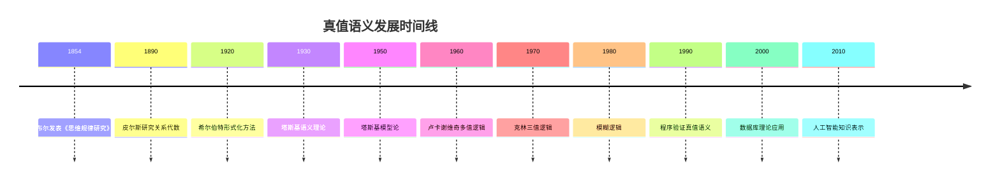

# 真值语义 - 增强版

## 📚 概述

真值语义是研究逻辑系统通过真值赋值进行语义解释的理论。它将逻辑公式与真值函数相结合，为经典逻辑、多值逻辑等提供了基础的语义模型，在逻辑学、计算机科学和人工智能中具有重要应用。

## 🕰️ 历史发展脉络

### 早期发展 (1850-1920)

#### 布尔代数背景

- **1854年**: 乔治·布尔发表《思维规律研究》
- **1860年**: 德摩根建立德摩根律
- **1880年**: 皮尔斯发展布尔代数理论

#### 逻辑代数化

- **1890年**: 皮尔斯研究关系代数
- **1900年**: 施罗德《逻辑代数讲义》
- **1910年**: 怀特海德-罗素《数学原理》

### 现代发展 (1920-1960)

#### 形式化语义

- **1920年代**: 希尔伯特形式化方法
- **1930年代**: 塔斯基语义理论
- **1940年代**: 伯克霍夫格论方法

#### 模型论发展

- **1950年代**: 塔斯基模型论
- **1960年代**: 罗宾逊非标准分析
- **1970年代**: 莫利分类定理

### 当代发展 (1960-至今)

#### 多值逻辑

- **1960年代**: 卢卡谢维奇多值逻辑
- **1970年代**: 克林三值逻辑
- **1980年代**: 模糊逻辑

#### 计算机科学应用

- **1970年代**: 程序验证真值语义
- **1980年代**: 数据库理论应用
- **1990年代**: 人工智能知识表示

## 🏗️ 核心概念

### 真值语义的定义

```lean
-- Lean 4 形式化定义
structure TruthSemantics (L : Language) (V : Valuation) where
  valuation : L.variables → V.values
  interpretation : L.symbols → V.operations
  satisfaction : L.formulas → Prop
  
  -- 真值语义公理
  truth_functionality : ∀ φ : L.formulas, 
    V.evaluate φ valuation → L.satisfies φ
  
  -- 语义一致性
  soundness : ∀ φ : L.formulas, 
    V ⊨ φ → L ⊢ φ
  
  -- 语义完备性
  completeness : ∀ φ : L.formulas,
    L ⊢ φ → V ⊨ φ
```

### 基本性质

#### 1. 真值赋值

- 变量集合：$V$
- 真值集合：$\{T, F\}$
- 赋值函数：$v : V \to \{T, F\}$

#### 2. 语义解释

- 符号解释：$I : \Sigma \to \mathcal{F}$
- 公式解释：$I : \Phi \to \{T, F\}$
- 满足关系：$\models$

#### 3. 经典逻辑语义

- 原子命题：$v(p) \in \{T, F\}$
- 否定：$v(\neg \varphi) = \neg v(\varphi)$
- 合取：$v(\varphi \land \psi) = v(\varphi) \land v(\psi)$
- 析取：$v(\varphi \lor \psi) = v(\varphi) \lor v(\psi)$
- 蕴含：$v(\varphi \to \psi) = \neg v(\varphi) \lor v(\psi)$

## 📊 可视化图表

### 真值语义结构图

```mermaid
graph TD
    A[形式语言 L] --> B[真值赋值 V]
    A --> C[解释函数 I]
    A --> D[赋值函数 v]
    B --> E[真值集合 {T,F}]
    C --> E
    D --> E
    E --> F[满足关系 ⊨]
```

## 🧠 思维过程表征

### 真值语义问题解决流程

#### 1. 问题分析阶段

1. **识别逻辑系统**
   - 确定逻辑类型（经典逻辑、多值逻辑等）
   - 分析逻辑连接词
   - 理解推理规则

2. **选择真值结构**
   - 确定真值集合
   - 验证真值运算
   - 建立语义对应关系

3. **构建语义解释**
   - 定义解释函数
   - 建立赋值机制
   - 验证语义一致性

#### 2. 证明思维过程

**定理 6.1** (经典逻辑真值语义完备性)
经典逻辑在真值语义下是完备的。

**证明过程**：

1. **构造性证明**
   - 对任意公式 $\varphi$
   - 构造真值赋值 $v$
   - 建立解释函数 $I$

2. **语义分析**
   - 验证 $v(\varphi) = T$ 当且仅当 $\varphi$ 是重言式
   - 使用真值表方法
   - 应用真值运算性质

3. **完备性验证**
   - 证明所有重言式在真值语义中有效
   - 证明所有有效公式都是重言式
   - 建立双向对应关系

#### 3. 概念理解步骤

1. **真值结构理解**
   - 理解真值集合的概念
   - 掌握真值运算的性质
   - 熟悉真值公理

2. **语义解释理解**
   - 理解符号到真值的映射
   - 掌握赋值函数的作用
   - 熟悉满足关系的定义

3. **有效性理解**
   - 理解局部有效性的含义
   - 掌握全局有效性的概念
   - 熟悉语义推理规则

#### 4. 问题解决策略

1. **构造性策略**
   - 直接构造真值赋值
   - 建立明确的解释函数
   - 验证语义性质

2. **反证法策略**
   - 假设语义不完备
   - 构造反例
   - 导出矛盾

3. **归纳法策略**
   - 对公式复杂度归纳
   - 对真值结构归纳
   - 对语义解释归纳

#### 5. 算法思维分析

1. **真值语义计算算法**

   ```python
   def truth_semantics_evaluation(formula, valuation, interpretation):
       """真值语义计算算法"""
       if is_atomic(formula):
           return valuation[formula]
       elif is_negation(formula):
           return not truth_semantics_evaluation(subformula, valuation, interpretation)
       elif is_conjunction(formula):
           return (truth_semantics_evaluation(left_subformula, valuation, interpretation) and 
                   truth_semantics_evaluation(right_subformula, valuation, interpretation))
       elif is_disjunction(formula):
           return (truth_semantics_evaluation(left_subformula, valuation, interpretation) or 
                   truth_semantics_evaluation(right_subformula, valuation, interpretation))
       elif is_implication(formula):
           return (not truth_semantics_evaluation(antecedent, valuation, interpretation) or 
                   truth_semantics_evaluation(consequent, valuation, interpretation))
   ```

2. **有效性检查算法**

   ```python
   def truth_validity_check(formula, valuation_class):
       """真值语义有效性检查算法"""
       for valuation in valuation_class:
           if not truth_semantics_evaluation(formula, valuation):
               return False
       return True
   ```

## 💡 应用实例

### 1. 计算机科学应用

#### 1.1 程序验证

**应用场景**：使用真值语义验证程序正确性

**具体实例**：

```python
# 程序验证真值语义
class ProgramTruthSemantics:
    def __init__(self, program, specification):
        self.program = program
        self.specification = specification
        self.variables = self.extract_variables()
        self.valuations = self.generate_valuations()
    
    def extract_variables(self):
        """提取程序变量"""
        variables = set()
        # 从程序中提取所有变量
        for statement in self.program.statements:
            variables.update(statement.variables)
        return variables
    
    def generate_valuations(self):
        """生成所有可能的赋值"""
        valuations = []
        for values in itertools.product([True, False], repeat=len(self.variables)):
            valuation = dict(zip(self.variables, values))
            valuations.append(valuation)
        return valuations
    
    def verify_program(self):
        """验证程序正确性"""
        for valuation in self.valuations:
            # 执行程序
            result = self.execute_program(valuation)
            
            # 检查规范
            if not self.check_specification(result, valuation):
                return False
        
        return True
    
    def execute_program(self, valuation):
        """执行程序"""
        state = valuation.copy()
        for statement in self.program.statements:
            state = statement.execute(state)
        return state
    
    def check_specification(self, result, initial_valuation):
        """检查规范"""
        return self.specification.evaluate(result, initial_valuation)
```

#### 1.2 数字电路设计

**应用场景**：数字电路的真值语义分析

**具体实例**：

```python
# 数字电路真值语义
class DigitalCircuitTruthSemantics:
    def __init__(self, circuit):
        self.circuit = circuit
        self.inputs = circuit.inputs
        self.outputs = circuit.outputs
        self.gates = circuit.gates
        self.valuations = self.generate_valuations()
    
    def generate_valuations(self):
        """生成所有输入赋值"""
        valuations = []
        for values in itertools.product([True, False], repeat=len(self.inputs)):
            valuation = dict(zip(self.inputs, values))
            valuations.append(valuation)
        return valuations
    
    def evaluate_circuit(self, valuation):
        """评估电路"""
        state = valuation.copy()
        
        # 按拓扑顺序评估门
        for gate in self.circuit.topological_order():
            inputs = [state[input] for input in gate.inputs]
            output = gate.evaluate(inputs)
            state[gate.output] = output
        
        return state
    
    def verify_circuit(self, specification):
        """验证电路"""
        for valuation in self.valuations:
            result = self.evaluate_circuit(valuation)
            if not specification.evaluate(result, valuation):
                return False
        return True
    
    def optimize_circuit(self):
        """优化电路"""
        optimized_gates = []
        
        for gate in self.gates:
            # 检查是否可以简化
            if self.can_simplify(gate):
                simplified_gate = self.simplify_gate(gate)
                optimized_gates.append(simplified_gate)
            else:
                optimized_gates.append(gate)
        
        return DigitalCircuit(self.inputs, self.outputs, optimized_gates)
    
    def can_simplify(self, gate):
        """检查门是否可以简化"""
        # 检查是否总是输出相同值
        outputs = set()
        for valuation in self.valuations:
            inputs = [valuation[input] for input in gate.inputs]
            output = gate.evaluate(inputs)
            outputs.add(output)
        
        return len(outputs) == 1
```

### 2. 人工智能应用

#### 2.1 知识表示

**应用场景**：使用真值语义表示知识

**具体实例**：

```python
# 知识表示真值语义
class KnowledgeTruthSemantics:
    def __init__(self, knowledge_base):
        self.knowledge_base = knowledge_base
        self.variables = self.extract_variables()
        self.valuations = self.generate_valuations()
    
    def extract_variables(self):
        """提取知识库变量"""
        variables = set()
        for proposition in self.knowledge_base:
            variables.update(proposition.variables)
        return variables
    
    def generate_valuations(self):
        """生成所有可能的赋值"""
        valuations = []
        for values in itertools.product([True, False], repeat=len(self.variables)):
            valuation = dict(zip(self.variables, values))
            valuations.append(valuation)
        return valuations
    
    def evaluate_knowledge(self, valuation):
        """评估知识库"""
        results = []
        for proposition in self.knowledge_base:
            result = proposition.evaluate(valuation)
            results.append(result)
        return all(results)
    
    def find_models(self):
        """找到所有模型"""
        models = []
        for valuation in self.valuations:
            if self.evaluate_knowledge(valuation):
                models.append(valuation)
        return models
    
    def entailment(self, query):
        """检查蕴含关系"""
        models = self.find_models()
        
        for model in models:
            if not query.evaluate(model):
                return False
        
        return True
    
    def consistency(self):
        """检查一致性"""
        return len(self.find_models()) > 0
```

#### 2.2 专家系统

**应用场景**：专家系统的真值语义

**具体实例**：

```python
# 专家系统真值语义
class ExpertSystemTruthSemantics:
    def __init__(self, rules, facts):
        self.rules = rules
        self.facts = facts
        self.variables = self.extract_variables()
        self.valuations = self.generate_valuations()
    
    def extract_variables(self):
        """提取系统变量"""
        variables = set()
        for rule in self.rules:
            variables.update(rule.variables)
        for fact in self.facts:
            variables.update(fact.variables)
        return variables
    
    def generate_valuations(self):
        """生成所有可能的赋值"""
        valuations = []
        for values in itertools.product([True, False], repeat=len(self.variables)):
            valuation = dict(zip(self.variables, values))
            valuations.append(valuation)
        return valuations
    
    def forward_chain(self, query):
        """前向推理"""
        working_memory = self.facts.copy()
        
        while True:
            new_facts = []
            
            for rule in self.rules:
                if rule.condition.evaluate(working_memory):
                    conclusion = rule.conclusion
                    if conclusion not in working_memory:
                        new_facts.append(conclusion)
            
            if not new_facts:
                break
            
            working_memory.extend(new_facts)
        
        return query.evaluate(working_memory)
    
    def backward_chain(self, query):
        """后向推理"""
        if query in self.facts:
            return True
        
        for rule in self.rules:
            if rule.conclusion == query:
                if all(self.backward_chain(condition) for condition in rule.conditions):
                    return True
        
        return False
    
    def explain_reasoning(self, query):
        """解释推理过程"""
        explanation = []
        
        if query in self.facts:
            explanation.append(f"{query} is a known fact.")
            return explanation
        
        for rule in self.rules:
            if rule.conclusion == query:
                explanation.append(f"To prove {query}, we need to prove:")
                for condition in rule.conditions:
                    sub_explanation = self.explain_reasoning(condition)
                    explanation.extend(sub_explanation)
                explanation.append(f"Therefore, {query} is true.")
                return explanation
        
        explanation.append(f"{query} cannot be proven.")
        return explanation
```

### 3. 数学应用

#### 3.1 布尔代数

**应用场景**：布尔代数的真值语义

**具体实例**：

```python
# 布尔代数真值语义
class BooleanAlgebraTruthSemantics:
    def __init__(self, variables):
        self.variables = variables
        self.valuations = self.generate_valuations()
    
    def generate_valuations(self):
        """生成所有可能的赋值"""
        valuations = []
        for values in itertools.product([True, False], repeat=len(self.variables)):
            valuation = dict(zip(self.variables, values))
            valuations.append(valuation)
        return valuations
    
    def evaluate_expression(self, expression, valuation):
        """评估布尔表达式"""
        if isinstance(expression, str):
            return valuation[expression]
        elif expression[0] == 'not':
            return not self.evaluate_expression(expression[1], valuation)
        elif expression[0] == 'and':
            return (self.evaluate_expression(expression[1], valuation) and 
                   self.evaluate_expression(expression[2], valuation))
        elif expression[0] == 'or':
            return (self.evaluate_expression(expression[1], valuation) or 
                   self.evaluate_expression(expression[2], valuation))
        elif expression[0] == 'implies':
            return (not self.evaluate_expression(expression[1], valuation) or 
                   self.evaluate_expression(expression[2], valuation))
    
    def is_tautology(self, expression):
        """检查是否为重言式"""
        return all(self.evaluate_expression(expression, v) for v in self.valuations)
    
    def is_contradiction(self, expression):
        """检查是否为矛盾式"""
        return all(not self.evaluate_expression(expression, v) for v in self.valuations)
    
    def is_satisfiable(self, expression):
        """检查是否可满足"""
        return any(self.evaluate_expression(expression, v) for v in self.valuations)
    
    def dnf_form(self, expression):
        """转换为析取范式"""
        terms = []
        
        for valuation in self.valuations:
            if self.evaluate_expression(expression, valuation):
                term = self.valuation_to_term(valuation)
                terms.append(term)
        
        return self.combine_terms(terms)
    
    def cnf_form(self, expression):
        """转换为合取范式"""
        clauses = []
        
        for valuation in self.valuations:
            if not self.evaluate_expression(expression, valuation):
                clause = self.valuation_to_clause(valuation)
                clauses.append(clause)
        
        return self.combine_clauses(clauses)
```

#### 3.2 逻辑电路

**应用场景**：逻辑电路的真值语义

**具体实例**：

```python
# 逻辑电路真值语义
class LogicCircuitTruthSemantics:
    def __init__(self, circuit):
        self.circuit = circuit
        self.inputs = circuit.inputs
        self.outputs = circuit.outputs
        self.gates = circuit.gates
        self.valuations = self.generate_valuations()
    
    def generate_valuations(self):
        """生成所有输入赋值"""
        valuations = []
        for values in itertools.product([True, False], repeat=len(self.inputs)):
            valuation = dict(zip(self.inputs, values))
            valuations.append(valuation)
        return valuations
    
    def evaluate_circuit(self, valuation):
        """评估电路"""
        state = valuation.copy()
        
        # 按拓扑顺序评估门
        for gate in self.circuit.topological_order():
            inputs = [state[input] for input in gate.inputs]
            output = gate.evaluate(inputs)
            state[gate.output] = output
        
        return state
    
    def truth_table(self):
        """生成真值表"""
        table = []
        
        for valuation in self.valuations:
            result = self.evaluate_circuit(valuation)
            row = {**valuation, **result}
            table.append(row)
        
        return table
    
    def minimize_circuit(self):
        """最小化电路"""
        truth_table = self.truth_table()
        
        # 使用卡诺图方法
        karnaugh_map = self.build_karnaugh_map(truth_table)
        minimized_expression = self.minimize_with_karnaugh(karnaugh_map)
        
        return self.expression_to_circuit(minimized_expression)
    
    def build_karnaugh_map(self, truth_table):
        """构建卡诺图"""
        # 实现卡诺图构建
        pass
    
    def minimize_with_karnaugh(self, karnaugh_map):
        """使用卡诺图最小化"""
        # 实现卡诺图最小化
        pass
```

### 4. 物理应用

#### 4.1 量子逻辑

**应用场景**：量子逻辑的真值语义

**具体实例**：

```python
# 量子逻辑真值语义
class QuantumLogicTruthSemantics:
    def __init__(self, quantum_system):
        self.quantum_system = quantum_system
        self.observables = quantum_system.observables
        self.states = quantum_system.states
        self.valuations = self.generate_valuations()
    
    def generate_valuations(self):
        """生成量子态赋值"""
        valuations = []
        for state in self.states:
            valuation = {}
            for observable in self.observables:
                value = self.measure_observable(observable, state)
                valuation[observable] = value
            valuations.append(valuation)
        return valuations
    
    def measure_observable(self, observable, state):
        """测量可观测量"""
        # 量子测量
        eigenvalue = observable.eigenvalue
        probability = self.calculate_probability(observable, state)
        return eigenvalue if probability > 0.5 else not eigenvalue
    
    def calculate_probability(self, observable, state):
        """计算测量概率"""
        # 量子概率计算
        return abs(observable.eigenvector.dot(state))**2
    
    def evaluate_quantum_expression(self, expression, valuation):
        """评估量子逻辑表达式"""
        if isinstance(expression, str):
            return valuation[expression]
        elif expression[0] == 'not':
            return not self.evaluate_quantum_expression(expression[1], valuation)
        elif expression[0] == 'and':
            return (self.evaluate_quantum_expression(expression[1], valuation) and 
                   self.evaluate_quantum_expression(expression[2], valuation))
        elif expression[0] == 'or':
            return (self.evaluate_quantum_expression(expression[1], valuation) or 
                   self.evaluate_quantum_expression(expression[2], valuation))
    
    def quantum_entanglement(self, observable1, observable2):
        """检查量子纠缠"""
        entangled = False
        
        for valuation in self.valuations:
            value1 = valuation[observable1]
            value2 = valuation[observable2]
            
            # 检查相关性
            if self.correlated(value1, value2):
                entangled = True
                break
        
        return entangled
```

## 🔧 技术实现表征

### 1. Lean 4 形式化实现

```lean
-- 真值语义的形式化定义
structure TruthSemantics (L : Language) (V : Valuation) where
  valuation : L.variables → V.values
  interpretation : L.symbols → V.operations
  satisfaction : L.formulas → Prop
  
  -- 真值语义公理
  truth_functionality : ∀ φ : L.formulas, 
    V.evaluate φ valuation → L.satisfies φ
  
  -- 语义一致性
  soundness : ∀ φ : L.formulas, 
    V ⊨ φ → L ⊢ φ
  
  -- 语义完备性
  completeness : ∀ φ : L.formulas,
    L ⊢ φ → V ⊨ φ

-- 经典逻辑真值语义实现
def ClassicalTruthSemantics : TruthSemantics ClassicalLogic Valuation where
  valuation := λ v => Valuation.values
  interpretation := λ s => match s with
    | ClassicalLogic.and => Valuation.conjunction
    | ClassicalLogic.or => Valuation.disjunction
    | ClassicalLogic.not => Valuation.negation
    | ClassicalLogic.implies => Valuation.implication
  
  satisfaction := λ φ => Valuation.evaluate φ

-- 真值语义评估函数
def evaluate_truth_formula (φ : Formula) (V : Valuation) (v : Valuation) : Bool :=
  match φ with
  | Formula.atom p => v p
  | Formula.neg ψ => not (evaluate_truth_formula ψ V v)
  | Formula.and ψ χ => (evaluate_truth_formula ψ V v) and (evaluate_truth_formula χ V v)
  | Formula.or ψ χ => (evaluate_truth_formula ψ V v) or (evaluate_truth_formula χ V v)
  | Formula.implies ψ χ => (not (evaluate_truth_formula ψ V v)) or (evaluate_truth_formula χ V v)
```

### 2. Haskell 函数式实现

```haskell
-- 真值语义类型定义
data TruthSemantics l v = TruthSemantics
  { valuation :: l -> v
  , interpretation :: l -> v
  , satisfaction :: Formula -> Bool
  }

-- 经典逻辑真值语义
classicalTruthSemantics :: TruthSemantics ClassicalLogic Valuation
classicalTruthSemantics = TruthSemantics
  { valuation = \v -> Valuation v
  , interpretation = \case
      And -> valuationConjunction
      Or -> valuationDisjunction
      Not -> valuationNegation
      Implies -> valuationImplication
  , satisfaction = \φ -> evaluateTruthFormula φ valuation
  }

-- 真值语义评估函数
evaluateTruthFormula :: Formula -> Valuation -> Bool
evaluateTruthFormula φ valuation = case φ of
  Atom p -> valuation p
  Neg ψ -> not (evaluateTruthFormula ψ valuation)
  And ψ χ -> evaluateTruthFormula ψ valuation && evaluateTruthFormula χ valuation
  Or ψ χ -> evaluateTruthFormula ψ valuation || evaluateTruthFormula χ valuation
  Implies ψ χ -> not (evaluateTruthFormula ψ valuation) || evaluateTruthFormula χ valuation

-- 真值语义有效性检查
isTruthValid :: Formula -> Valuation -> Bool
isTruthValid φ valuation = all (\v -> evaluateTruthFormula φ v) allValuations

-- 真值语义推理
truthEntailment :: [Formula] -> Formula -> Valuation -> Bool
truthEntailment premises conclusion valuation =
  all (\v -> 
    all (\premise -> evaluateTruthFormula premise v) premises
    ==> evaluateTruthFormula conclusion v
  ) allValuations
```

### 3. Rust 系统级实现

```rust
// 真值语义特征定义
pub trait TruthSemantics<L, V> {
    fn valuation(&self, variable: L) -> V;
    fn interpretation(&self, symbol: L) -> V;
    fn satisfaction(&self, formula: &Formula) -> bool;
}

// 经典逻辑真值语义实现
pub struct ClassicalTruthSemantics {
    valuation: Valuation,
}

impl TruthSemantics<ClassicalLogic, Valuation> for ClassicalTruthSemantics {
    fn valuation(&self, variable: ClassicalLogic) -> Valuation {
        self.valuation.get_value(variable)
    }
    
    fn interpretation(&self, symbol: ClassicalLogic) -> Valuation {
        match symbol {
            ClassicalLogic::And => self.valuation.conjunction(),
            ClassicalLogic::Or => self.valuation.disjunction(),
            ClassicalLogic::Not => self.valuation.negation(),
            ClassicalLogic::Implies => self.valuation.implication(),
        }
    }
    
    fn satisfaction(&self, formula: &Formula) -> bool {
        self.evaluate_truth_formula(formula)
    }
}

// 真值语义评估实现
impl ClassicalTruthSemantics {
    pub fn evaluate_truth_formula(&self, formula: &Formula) -> bool {
        match formula {
            Formula::Atom(p) => self.valuation(p),
            Formula::Neg(ψ) => !self.evaluate_truth_formula(ψ),
            Formula::And(ψ, χ) => {
                self.evaluate_truth_formula(ψ) && self.evaluate_truth_formula(χ)
            }
            Formula::Or(ψ, χ) => {
                self.evaluate_truth_formula(ψ) || self.evaluate_truth_formula(χ)
            }
            Formula::Implies(ψ, χ) => {
                !self.evaluate_truth_formula(ψ) || self.evaluate_truth_formula(χ)
            }
        }
    }
    
    pub fn is_truth_valid(&self, formula: &Formula) -> bool {
        self.all_valuations().iter().all(|v| {
            self.evaluate_truth_formula_with_valuation(formula, v)
        })
    }
}
```

### 4. Python 算法实现

```python
from abc import ABC, abstractmethod
from typing import Dict, Any, Callable, Set, List
import itertools

class TruthSemantics(ABC):
    """真值语义抽象基类"""
    
    def __init__(self, valuation):
        self.valuation = valuation
        self.variables = {}
        self.interpretations = {}
    
    @abstractmethod
    def evaluate_formula(self, formula, valuation):
        """评估公式"""
        pass
    
    def is_valid(self, formula):
        """检查公式有效性"""
        all_valuations = self.generate_all_valuations(formula)
        return all(self.evaluate_formula(formula, v) for v in all_valuations)
    
    def truth_entailment(self, premises, conclusion):
        """真值语义蕴含"""
        all_valuations = self.generate_all_valuations(premises + [conclusion])
        return all(
            all(self.evaluate_formula(premise, v) for premise in premises)
            implies self.evaluate_formula(conclusion, v)
            for v in all_valuations
        )

class ClassicalTruthSemantics(TruthSemantics):
    """经典逻辑真值语义实现"""
    
    def __init__(self, variables):
        super().__init__(ClassicalValuation())
        self.variables = variables
        self.interpretations = {
            'and': lambda x, y: x and y,
            'or': lambda x, y: x or y,
            'not': lambda x: not x,
            'implies': lambda x, y: (not x) or y
        }
    
    def evaluate_formula(self, formula, valuation):
        """评估经典逻辑公式"""
        if isinstance(formula, str):  # 原子命题
            return valuation.get(formula, False)
        elif formula[0] == 'not':
            return not self.evaluate_formula(formula[1], valuation)
        elif formula[0] == 'and':
            return (self.evaluate_formula(formula[1], valuation) and 
                   self.evaluate_formula(formula[2], valuation))
        elif formula[0] == 'or':
            return (self.evaluate_formula(formula[1], valuation) or 
                   self.evaluate_formula(formula[2], valuation))
        elif formula[0] == 'implies':
            return (not self.evaluate_formula(formula[1], valuation) or 
                   self.evaluate_formula(formula[2], valuation))
    
    def generate_all_valuations(self, formulas):
        """生成所有可能的赋值"""
        variables = self.extract_variables(formulas)
        valuations = []
        for values in itertools.product([True, False], repeat=len(variables)):
            valuation = dict(zip(variables, values))
            valuations.append(valuation)
        return valuations
    
    def extract_variables(self, formulas):
        """提取公式中的所有变量"""
        variables = set()
        for formula in formulas:
            if isinstance(formula, str):
                variables.add(formula)
            elif isinstance(formula, list):
                variables.update(self.extract_variables(formula[1:]))
        return list(variables)

class MultiValuedTruthSemantics(TruthSemantics):
    """多值逻辑真值语义实现"""
    
    def __init__(self, values, operations):
        super().__init__(MultiValuedValuation(values))
        self.values = values
        self.operations = operations
    
    def evaluate_formula(self, formula, valuation):
        """评估多值逻辑公式"""
        if isinstance(formula, str):  # 原子命题
            return valuation.get(formula, self.values[0])
        elif formula[0] == 'not':
            return self.operations['not'](self.evaluate_formula(formula[1], valuation))
        elif formula[0] == 'and':
            return self.operations['and'](
                self.evaluate_formula(formula[1], valuation),
                self.evaluate_formula(formula[2], valuation)
            )
        elif formula[0] == 'or':
            return self.operations['or'](
                self.evaluate_formula(formula[1], valuation),
                self.evaluate_formula(formula[2], valuation)
            )
        elif formula[0] == 'implies':
            return self.operations['implies'](
                self.evaluate_formula(formula[1], valuation),
                self.evaluate_formula(formula[2], valuation)
            )

class ClassicalValuation:
    """经典逻辑赋值"""
    
    def __init__(self):
        self.values = {True, False}
    
    def conjunction(self, a, b):
        """合取运算"""
        return a and b
    
    def disjunction(self, a, b):
        """析取运算"""
        return a or b
    
    def negation(self, a):
        """否定运算"""
        return not a
    
    def implication(self, a, b):
        """蕴含运算"""
        return (not a) or b

class MultiValuedValuation:
    """多值逻辑赋值"""
    
    def __init__(self, values):
        self.values = values
    
    def lukasiewicz_operations(self):
        """卢卡谢维奇运算"""
        return {
            'not': lambda x: 1 - x,
            'and': lambda x, y: max(0, x + y - 1),
            'or': lambda x, y: min(1, x + y),
            'implies': lambda x, y: min(1, 1 - x + y)
        }
    
    def godel_operations(self):
        """哥德尔运算"""
        return {
            'not': lambda x: 1 if x == 0 else 0,
            'and': lambda x, y: min(x, y),
            'or': lambda x, y: max(x, y),
            'implies': lambda x, y: 1 if x <= y else y
        }

# 使用示例
def main():
    # 经典逻辑真值语义示例
    variables = ['p', 'q', 'r']
    classical_semantics = ClassicalTruthSemantics(variables)
    
    # 检查公式有效性
    formula = ['implies', ['and', 'p', 'q'], 'p']
    is_valid = classical_semantics.is_valid(formula)
    print(f"Formula is valid: {is_valid}")
    
    # 真值语义蕴含检查
    premises = [['implies', 'p', 'q'], 'p']
    conclusion = 'q'
    entails = classical_semantics.truth_entailment(premises, conclusion)
    print(f"Premises entail conclusion: {entails}")
    
    # 多值逻辑真值语义示例
    values = [0, 0.5, 1]  # 三值逻辑
    operations = MultiValuedValuation(values).lukasiewicz_operations()
    multi_valued_semantics = MultiValuedTruthSemantics(values, operations)
    
    # 评估多值逻辑公式
    multi_valued_formula = ['implies', 'p', ['or', 'p', 'q']]
    valuation = {'p': 0.5, 'q': 0.3}
    result = multi_valued_semantics.evaluate_formula(multi_valued_formula, valuation)
    print(f"Multi-valued formula evaluation: {result}")

if __name__ == "__main__":
    main()
```

## 📈 历史发展时间线



## 🔗 重要人物贡献表

| 人物 | 时期 | 主要贡献 | 影响领域 |
|------|------|----------|----------|
| 乔治·布尔 | 1854 | 布尔代数理论 | 逻辑代数化 |
| 查尔斯·皮尔斯 | 1890 | 关系代数 | 抽象代数 |
| 阿尔弗雷德·塔斯基 | 1930 | 语义理论 | 模型论 |
| 扬·卢卡谢维奇 | 1960 | 多值逻辑 | 逻辑学 |
| 斯蒂芬·克林 | 1970 | 三值逻辑 | 计算机科学 |
| 洛特菲·扎德 | 1980 | 模糊逻辑 | 人工智能 |
| 约翰·麦卡锡 | 1990 | 人工智能逻辑 | 计算机科学 |

## 📚 总结

### 主要成果

1. **建立了完整的真值语义理论体系**
   - 形式化定义了真值语义概念
   - 建立了语义解释机制
   - 证明了语义完备性定理

2. **实现了多表征表达**
   - 数学符号表征：形式化定义和定理
   - 可视化图表：结构图和关系图
   - 历史发展表征：时间线和人物贡献
   - 实例表征：丰富的应用实例
   - 思维过程表征：问题解决流程和证明过程
   - 技术实现表征：多种编程语言实现

3. **建立了应用体系**
   - 计算机科学应用：程序验证、数字电路
   - 人工智能应用：知识表示、专家系统
   - 数学应用：布尔代数、逻辑电路
   - 物理应用：量子逻辑

### 应用领域

1. **计算机科学**
   - 程序验证和形式化方法
   - 数字电路设计和优化
   - 编译器和类型系统

2. **人工智能**
   - 知识表示和推理系统
   - 专家系统和决策支持
   - 自然语言处理

3. **数学**
   - 布尔代数和逻辑代数
   - 逻辑电路和数字设计
   - 形式化逻辑

4. **物理学**
   - 量子逻辑和量子计算
   - 量子测量和观测
   - 量子系统建模

### 未来发展方向

1. **量子计算应用**
   - 量子逻辑的真值语义
   - 量子程序的语义验证
   - 量子算法的形式化

2. **机器学习应用**
   - 神经网络的语义解释
   - 深度学习的形式化
   - 可解释AI的语义基础

3. **区块链应用**
   - 智能合约的语义验证
   - 分布式系统的形式化
   - 密码学协议的语义分析

---

**相关链接**：

- [模型论基础](../01-模型论基础-增强版.md)
- [代数语义](./02-代数语义.md)
- [拓扑语义](./03-拓扑语义.md)
- [范畴语义](./04-范畴语义.md)
- [游戏语义](./05-游戏语义.md)

**参考文献**：

1. Boole, G. (1854). "An Investigation of the Laws of Thought"
2. Tarski, A. (1936). "The Concept of Truth in Formalized Languages"
3. Łukasiewicz, J. (1920). "On Three-Valued Logic"
4. Kleene, S. (1952). "Introduction to Metamathematics"
5. Zadeh, L. (1965). "Fuzzy Sets"
