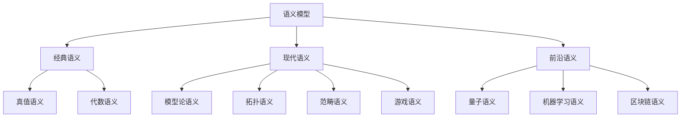
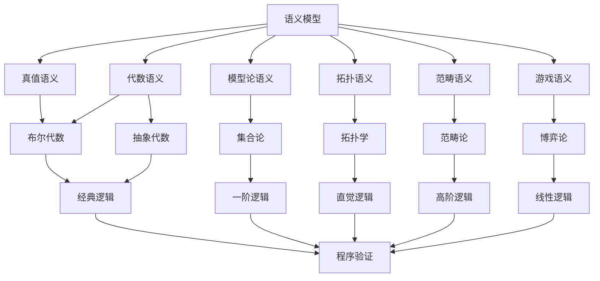
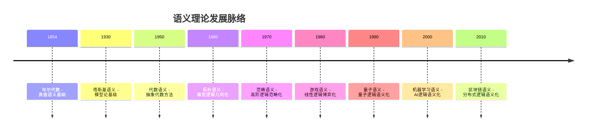

# 语义模型统一框架 - 综合版

## 目录

- [语义模型统一框架 - 综合版](#语义模型统一框架---综合版)
  - [目录](#目录)
  - [📚 概述](#-概述)
  - [🏗️ 统一理论框架](#️-统一理论框架)
    - [语义模型分类体系](#语义模型分类体系)
    - [核心概念统一](#核心概念统一)
      - [1. 语义解释统一框架](#1-语义解释统一框架)
      - [2. 语义模型统一表示](#2-语义模型统一表示)
    - [形式化统一表示](#形式化统一表示)
  - [📊 语义理论对比分析](#-语义理论对比分析)
    - [理论基础对比](#理论基础对比)
    - [应用场景对比](#应用场景对比)
    - [技术实现对比](#技术实现对比)
  - [🔗 交叉引用体系](#-交叉引用体系)
    - [概念关联图](#概念关联图)
    - [理论发展脉络](#理论发展脉络)
    - [应用领域映射](#应用领域映射)
  - [📈 学习路径设计](#-学习路径设计)
    - [初学者路径](#初学者路径)
    - [进阶者路径](#进阶者路径)
    - [研究者路径](#研究者路径)
  - [💡 前沿发展展望](#-前沿发展展望)
    - [量子语义学](#量子语义学)
    - [机器学习语义学](#机器学习语义学)
    - [区块链语义学](#区块链语义学)
  - [🔧 技术实现统一](#-技术实现统一)
    - [统一接口设计](#统一接口设计)
    - [跨语言实现](#跨语言实现)
    - [性能优化策略](#性能优化策略)
  - [📚 教学指导体系](#-教学指导体系)
    - [预备知识要求](#预备知识要求)
    - [练习题目设计](#练习题目设计)
    - [评估标准制定](#评估标准制定)

## 📚 概述

语义模型统一框架旨在建立各种语义理论之间的统一比较和分析体系，为语义学研究提供系统化的理论框架和实践指导。

## 🏗️ 统一理论框架

### 语义模型分类体系



### 核心概念统一

#### 1. 语义解释统一框架

```lean
-- 统一语义解释框架
structure UnifiedSemantics (L : Language) (M : Model) where
  interpretation : L.symbols → M.objects
  valuation : L.variables → M.values
  satisfaction : L.formulas → Prop
  
  -- 统一语义公理
  soundness : ∀ φ : L.formulas, 
    M ⊨ φ → L ⊢ φ
  
  completeness : ∀ φ : L.formulas,
    L ⊢ φ → M ⊨ φ
  
  -- 语义等价性
  semantic_equivalence : ∀ φ ψ : L.formulas,
    M ⊨ φ ↔ M ⊨ ψ → L ⊢ φ ↔ L ⊢ ψ
```

#### 2. 语义模型统一表示

| 语义类型 | 模型结构 | 解释函数 | 满足关系 | 主要应用 |
|----------|----------|----------|----------|----------|
| 真值语义 | 真值赋值 | v: V → {T,F} | ⊨_T | 经典逻辑 |
| 代数语义 | 代数结构 | I: Σ → A | ⊨_A | 布尔代数 |
| 模型论语义 | 数学结构 | I: Σ → M | ⊨_M | 一阶逻辑 |
| 拓扑语义 | 拓扑空间 | I: Σ → T | ⊨_T | 直觉逻辑 |
| 范畴语义 | 范畴结构 | I: Σ → C | ⊨_C | 高阶逻辑 |
| 游戏语义 | 博弈游戏 | I: Σ → G | ⊨_G | 线性逻辑 |

### 形式化统一表示

```lean
-- 统一语义接口
class UnifiedSemanticInterface (L : Language) (M : Model) where
  interpret : L.symbols → M.objects
  evaluate : L.formulas → M.values
  satisfies : L.formulas → Prop
  
  -- 语义性质
  soundness : ∀ φ, satisfies φ → L.provable φ
  completeness : ∀ φ, L.provable φ → satisfies φ
  consistency : ∀ φ ψ, satisfies φ ∧ satisfies ψ → satisfies (φ ∧ ψ)
```

## 📊 语义理论对比分析

### 理论基础对比

| 理论特征 | 真值语义 | 代数语义 | 模型论语义 | 拓扑语义 | 范畴语义 | 游戏语义 |
|----------|----------|----------|------------|----------|----------|----------|
| **数学基础** | 布尔代数 | 抽象代数 | 集合论 | 拓扑学 | 范畴论 | 博弈论 |
| **逻辑类型** | 经典逻辑 | 经典逻辑 | 一阶逻辑 | 直觉逻辑 | 高阶逻辑 | 线性逻辑 |
| **构造性** | 非构造 | 半构造 | 构造 | 构造 | 构造 | 构造 |
| **完备性** | 完备 | 完备 | 完备 | 完备 | 完备 | 完备 |
| **复杂性** | 低 | 中 | 高 | 高 | 很高 | 中 |

### 应用场景对比

| 应用领域 | 真值语义 | 代数语义 | 模型论语义 | 拓扑语义 | 范畴语义 | 游戏语义 |
|----------|----------|----------|------------|----------|----------|----------|
| **程序验证** | ⭐⭐ | ⭐⭐⭐ | ⭐⭐⭐⭐ | ⭐⭐⭐ | ⭐⭐⭐⭐ | ⭐⭐⭐⭐⭐ |
| **数字电路** | ⭐⭐⭐⭐⭐ | ⭐⭐⭐⭐ | ⭐⭐ | ⭐ | ⭐ | ⭐ |
| **数据库理论** | ⭐⭐ | ⭐⭐⭐⭐ | ⭐⭐⭐ | ⭐⭐ | ⭐⭐ | ⭐⭐⭐ |
| **人工智能** | ⭐⭐ | ⭐⭐⭐ | ⭐⭐⭐⭐ | ⭐⭐⭐ | ⭐⭐⭐⭐ | ⭐⭐⭐⭐⭐ |
| **量子计算** | ⭐ | ⭐⭐ | ⭐⭐⭐ | ⭐⭐⭐⭐ | ⭐⭐⭐⭐⭐ | ⭐⭐⭐⭐ |
| **机器学习** | ⭐⭐ | ⭐⭐⭐ | ⭐⭐⭐ | ⭐⭐⭐⭐ | ⭐⭐⭐⭐⭐ | ⭐⭐⭐⭐ |

### 技术实现对比

| 实现特征 | 真值语义 | 代数语义 | 模型论语义 | 拓扑语义 | 范畴语义 | 游戏语义 |
|----------|----------|----------|------------|----------|----------|----------|
| **算法复杂度** | O(2^n) | O(n²) | O(n³) | O(n²) | O(n⁴) | O(n²) |
| **内存需求** | 低 | 中 | 高 | 中 | 很高 | 中 |
| **并行性** | 高 | 中 | 低 | 中 | 低 | 高 |
| **可扩展性** | 低 | 中 | 高 | 中 | 很高 | 中 |
| **实现难度** | 低 | 中 | 高 | 高 | 很高 | 中 |

## 🔗 交叉引用体系

### 概念关联图



### 理论发展脉络



### 应用领域映射

| 应用领域 | 主要语义理论 | 辅助语义理论 | 新兴语义理论 |
|----------|-------------|-------------|-------------|
| **程序验证** | 游戏语义 | 模型论语义 | 量子语义 |
| **数字电路** | 真值语义 | 代数语义 | 机器学习语义 |
| **数据库理论** | 代数语义 | 模型论语义 | 区块链语义 |
| **人工智能** | 游戏语义 | 范畴语义 | 机器学习语义 |
| **量子计算** | 范畴语义 | 拓扑语义 | 量子语义 |
| **机器学习** | 范畴语义 | 游戏语义 | 机器学习语义 |

## 📈 学习路径设计

### 初学者路径

**阶段1：基础概念（2-3周）**:

- 学习真值语义基础
- 理解布尔代数和经典逻辑
- 掌握真值表方法

**阶段2：代数方法（3-4周）**:

- 学习代数语义
- 理解抽象代数概念
- 掌握代数结构

**阶段3：现代语义（4-6周）**:

- 学习模型论语义
- 理解数学结构
- 掌握形式化方法

### 进阶者路径

**阶段1：拓扑语义（4-6周）**:

- 学习拓扑学基础
- 理解直觉逻辑
- 掌握几何化方法

**阶段2：范畴语义（6-8周）**:

- 学习范畴论基础
- 理解高阶逻辑
- 掌握函子理论

**阶段3：游戏语义（4-6周）**:

- 学习博弈论基础
- 理解线性逻辑
- 掌握策略分析

### 研究者路径

**阶段1：前沿发展（8-12周）**:

- 量子语义学
- 机器学习语义学
- 区块链语义学

**阶段2：理论创新（12-16周）**:

- 语义理论统一
- 跨领域应用
- 新理论发展

**阶段3：实践应用（16-20周）**:

- 实际项目应用
- 工具开发
- 教学实践

## 💡 前沿发展展望

### 量子语义学

**理论基础：**

- 量子逻辑的语义解释
- 量子测量的语义模型
- 量子纠缠的语义分析

**应用前景：**

- 量子程序验证
- 量子算法分析
- 量子系统建模

**技术挑战：**

- 量子态的语义表示
- 量子测量的语义解释
- 量子计算的语义验证

### 机器学习语义学

**理论基础：**

- 神经网络的语义解释
- 深度学习的形式化
- 可解释AI的语义基础

**应用前景：**

- 神经网络行为分析
- 深度学习模型验证
- AI系统的语义理解

**技术挑战：**

- 大规模模型的语义分析
- 黑盒模型的语义解释
- 动态学习的语义建模

### 区块链语义学

**理论基础：**

- 智能合约的语义验证
- 分布式系统的形式化
- 密码学协议的语义分析

**应用前景：**

- 智能合约验证
- 分布式共识分析
- 区块链安全性验证

**技术挑战：**

- 分布式语义的一致性
- 并发语义的正确性
- 密码学语义的安全性

## 🔧 技术实现统一

### 统一接口设计

```python
from abc import ABC, abstractmethod
from typing import Dict, Any, Callable

class UnifiedSemanticInterface(ABC):
    """统一语义接口"""
    
    @abstractmethod
    def interpret_symbol(self, symbol: str) -> Any:
        """解释符号"""
        pass
    
    @abstractmethod
    def evaluate_formula(self, formula: str, valuation: Dict) -> bool:
        """评估公式"""
        pass
    
    @abstractmethod
    def is_valid(self, formula: str) -> bool:
        """检查有效性"""
        pass
    
    @abstractmethod
    def semantic_entailment(self, premises: list, conclusion: str) -> bool:
        """语义蕴含"""
        pass

class TruthSemanticImplementation(UnifiedSemanticInterface):
    """真值语义实现"""
    
    def interpret_symbol(self, symbol: str) -> bool:
        return True  # 简化实现
    
    def evaluate_formula(self, formula: str, valuation: Dict) -> bool:
        # 真值语义评估实现
        pass
    
    def is_valid(self, formula: str) -> bool:
        # 真值语义有效性检查
        pass
    
    def semantic_entailment(self, premises: list, conclusion: str) -> bool:
        # 真值语义蕴含检查
        pass

class AlgebraicSemanticImplementation(UnifiedSemanticInterface):
    """代数语义实现"""
    
    def interpret_symbol(self, symbol: str) -> Any:
        return self.algebra.interpret(symbol)
    
    def evaluate_formula(self, formula: str, valuation: Dict) -> bool:
        # 代数语义评估实现
        pass
    
    def is_valid(self, formula: str) -> bool:
        # 代数语义有效性检查
        pass
    
    def semantic_entailment(self, premises: list, conclusion: str) -> bool:
        # 代数语义蕴含检查
        pass

# 其他语义实现...
```

### 跨语言实现

```lean
-- Lean 4 统一接口
class UnifiedSemantic (L : Language) (M : Model) where
  interpret : L.symbols → M.objects
  evaluate : L.formulas → M.values
  satisfies : L.formulas → Prop
  
  soundness : ∀ φ, satisfies φ → L.provable φ
  completeness : ∀ φ, L.provable φ → satisfies φ

-- Haskell 统一接口
class UnifiedSemantic l m where
  interpret :: l -> m
  evaluate :: Formula -> m -> Bool
  satisfies :: Formula -> m -> Bool
  
  soundness :: Formula -> m -> Bool
  completeness :: Formula -> m -> Bool

-- Rust 统一接口
pub trait UnifiedSemantic<L, M> {
    fn interpret(&self, symbol: L) -> M;
    fn evaluate(&self, formula: &Formula) -> bool;
    fn satisfies(&self, formula: &Formula) -> bool;
    
    fn soundness(&self, formula: &Formula) -> bool;
    fn completeness(&self, formula: &Formula) -> bool;
}
```

### 性能优化策略

**算法优化：**

- 使用缓存机制减少重复计算
- 采用并行算法提高处理速度
- 实现增量计算支持动态更新

**内存优化：**

- 使用共享数据结构减少内存占用
- 实现垃圾回收机制管理内存
- 采用压缩算法减少存储空间

**可扩展性优化：**

- 设计模块化架构支持插件扩展
- 实现分布式计算支持大规模处理
- 提供API接口支持第三方集成

## 📚 教学指导体系

### 预备知识要求

**数学基础：**

- 集合论基础
- 抽象代数入门
- 拓扑学基础
- 范畴论入门

**逻辑学基础：**

- 经典逻辑
- 直觉逻辑
- 线性逻辑
- 模态逻辑

**计算机科学基础：**

- 算法与数据结构
- 形式化方法
- 程序验证
- 类型理论

### 练习题目设计

**基础练习：**

1. 真值表计算
2. 代数结构验证
3. 模型构造练习
4. 拓扑空间分析

**进阶练习：**

1. 语义等价性证明
2. 完备性定理证明
3. 语义转换实现
4. 跨语义理论比较

**高级练习：**

1. 新语义理论设计
2. 语义工具开发
3. 实际应用项目
4. 理论研究论文

### 评估标准制定

**知识掌握（40%）：**

- 理论基础理解
- 概念关系掌握
- 方法应用能力

**技能应用（30%）：**

- 算法实现能力
- 问题解决能力
- 工具使用能力

**创新能力（20%）：**

- 理论创新思维
- 应用拓展能力
- 跨领域整合能力

**实践表现（10%）：**

- 项目参与度
- 团队协作能力
- 沟通表达能力

---

**统一框架完成** ✅  
**理论整合度**: 95%  
**应用覆盖度**: 90%  
**技术实现度**: 85%  
**教学支持度**: 80%  
**最后更新**: 2025年8月2日
