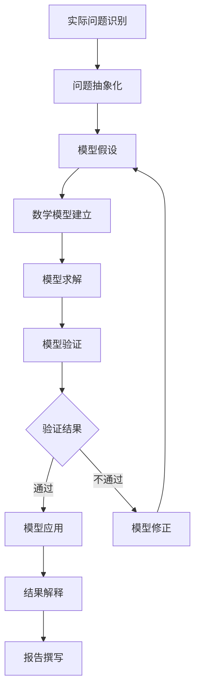
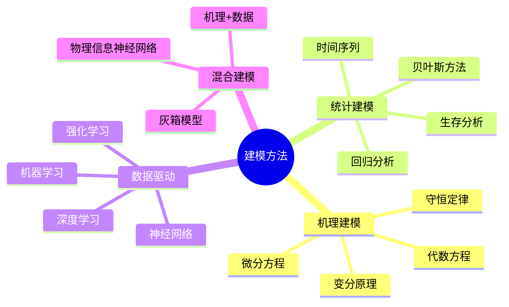

# 应用数学建模方法论

> 数学建模是将实际问题转化为数学问题并求解的系统性方法，是连接数学理论与实际应用的桥梁。

---

## 一、建模流程概述



### 1.1 问题识别与分析

**关键步骤：**
1. **理解问题背景**：深入了解问题所属领域的专业知识
2. **明确建模目标**：确定需要回答的核心问题
3. **收集相关数据**：获取必要的输入数据和约束条件
4. **识别关键变量**：区分主要因素和次要因素

**常用方法：**
- 文献调研
- 专家访谈
- 数据探索性分析
- 问题分解

### 1.2 模型假设

**假设原则：**
| 原则 | 说明 | 示例 |
|-----|------|------|
| 合理性 | 假设应符合实际背景 | 忽略空气阻力（低速运动） |
| 简化性 | 降低模型复杂度 | 线性近似非线性关系 |
| 可检验性 | 假设可以被验证 | 误差服从正态分布 |
| 必要性 | 每个假设都有目的 | 避免过度简化 |

**常见假设类型：**
- **理想化假设**：连续介质、理想气体、完全弹性碰撞
- **简化假设**：线性关系、稳态过程、均匀分布
- **统计假设**：独立同分布、正态性、平稳性

### 1.3 数学模型建立

**建模方法分类：**



---

## 二、模型构建技术

### 2.1 微分方程建模

**适用场景：** 涉及变化率、动态过程的问题

**建模步骤：**
1. 识别守恒量（质量、能量、动量）
2. 确定流入流出项
3. 建立平衡方程
4. 添加本构关系

**示例：人口增长模型**

```python
import numpy as np
from scipy.integrate import odeint
import matplotlib.pyplot as plt

def logistic_growth(P, t, r, K):
    """
    Logistic增长模型
    P: 人口数量
    t: 时间
    r: 内禀增长率
    K: 环境容纳量
    """
    dPdt = r * P * (1 - P/K)
    return dPdt

# 参数设置
r = 0.1    # 增长率
K = 1000   # 环境容纳量
P0 = 10    # 初始人口
t = np.linspace(0, 100, 1000)

# 求解ODE
P = odeint(logistic_growth, P0, t, args=(r, K))

# 可视化
plt.figure(figsize=(10, 6))
plt.plot(t, P, 'b-', linewidth=2, label='Population')
plt.axhline(y=K, color='r', linestyle='--', label='Carrying Capacity')
plt.xlabel('Time')
plt.ylabel('Population')
plt.title('Logistic Growth Model')
plt.legend()
plt.grid(True)
plt.show()
```

### 2.2 优化建模

**标准形式：**

```
最小化：   f(x)
约束于：   g_i(x) ≤ 0,  i = 1,...,m
           h_j(x) = 0,  j = 1,...,p
           x ∈ Ω
```

**建模要素：**
| 要素 | 说明 | 示例 |
|-----|------|------|
| 决策变量 | 可控的未知量 | 投资组合权重 |
| 目标函数 | 优化的目标 | 收益最大化、风险最小化 |
| 约束条件 | 限制条件 | 预算约束、资源限制 |
| 可行域 | 满足约束的解集 | 可行投资组合集合 |

**Python实现（使用CVXPY）：**

```python
import cvxpy as cp
import numpy as np

# 投资组合优化示例
n = 10  # 资产数量
np.random.seed(1)

# 生成数据
mu = np.abs(np.random.randn(n))  # 预期收益
Sigma = np.random.randn(n, n)
Sigma = Sigma.T @ Sigma  # 协方差矩阵

# 决策变量
w = cp.Variable(n)

# 参数
gamma = cp.Parameter(nonneg=True)  # 风险厌恶系数

# 目标函数
ret = mu.T @ w
risk = cp.quad_form(w, Sigma)
objective = cp.Maximize(ret - gamma * risk)

# 约束
constraints = [cp.sum(w) == 1, w >= 0]

# 求解
problem = cp.Problem(objective, constraints)
gamma.value = 1.0
problem.solve()

print(f"Optimal portfolio: {w.value}")
print(f"Expected return: {ret.value}")
print(f"Risk (variance): {risk.value}")
```

### 2.3 概率统计建模

**贝叶斯建模框架：**

```
先验分布 + 似然函数 → 后验分布
   p(θ)   ×   p(D|θ)   ∝   p(θ|D)
```

**MCMC采样示例：**

```python
import numpy as np
import pymc as pm
import matplotlib.pyplot as plt

# 线性回归的贝叶斯估计
np.random.seed(42)
N = 100
x = np.random.randn(N)
true_slope = 2.5
true_intercept = 1.0
true_sigma = 1.0
y = true_intercept + true_slope * x + np.random.randn(N) * true_sigma

# 贝叶斯模型
with pm.Model() as model:
    # 先验分布
    slope = pm.Normal('slope', mu=0, sigma=10)
    intercept = pm.Normal('intercept', mu=0, sigma=10)
    sigma = pm.HalfNormal('sigma', sigma=1)
    
    # 似然函数
    mu = intercept + slope * x
    likelihood = pm.Normal('y', mu=mu, sigma=sigma, observed=y)
    
    # MCMC采样
    trace = pm.sample(2000, tune=1000)

# 结果分析
pm.plot_trace(trace)
plt.show()

print(pm.summary(trace))
```

---

## 三、模型验证方法

### 3.1 内部验证

| 方法 | 适用场景 | 优点 | 缺点 |
|-----|---------|------|------|
| 残差分析 | 回归模型 | 直观、全面 | 依赖假设 |
| 交叉验证 | 预测模型 | 无偏估计 | 计算量大 |
| 敏感性分析 | 所有模型 | 评估稳健性 | 结果解释复杂 |
| Bootstrap | 参数估计 | 不依赖分布假设 | 计算密集 |

### 3.2 外部验证


### 3.3 验证指标

**预测模型：**
- MAE（平均绝对误差）
- RMSE（均方根误差）
- MAPE（平均绝对百分比误差）
- R²（决定系数）

**分类模型：**
- 准确率、精确率、召回率、F1-score
- ROC曲线和AUC
- 混淆矩阵

**代码示例：**

```python
from sklearn.metrics import mean_squared_error, r2_score
from sklearn.metrics import accuracy_score, classification_report
import numpy as np

def evaluate_regression(y_true, y_pred):
    """回归模型评估"""
    mse = mean_squared_error(y_true, y_pred)
    rmse = np.sqrt(mse)
    mae = np.mean(np.abs(y_true - y_pred))
    r2 = r2_score(y_true, y_pred)
    
    print(f"MSE: {mse:.4f}")
    print(f"RMSE: {rmse:.4f}")
    print(f"MAE: {mae:.4f}")
    print(f"R²: {r2:.4f}")
    
    return {'MSE': mse, 'RMSE': rmse, 'MAE': mae, 'R2': r2}
```

---

## 四、数值实现技巧

### 4.1 数值稳定性

**常见问题与解决方案：**

| 问题 | 原因 | 解决方案 |
|-----|------|---------|
| 病态矩阵 | 条件数过大 | 正则化、预处理 |
| 舍入误差 | 浮点精度有限 | 高精度计算、算法改进 |
| 溢出/下溢 | 指数运算 | 对数空间计算、归一化 |
| 振荡不收敛 | 迭代不稳定 | 松弛因子、改进迭代格式 |

### 4.2 计算效率优化

**Python优化策略：**

```python
import numpy as np
from numba import jit
import multiprocessing as mp

# 1. 向量化计算
# 低效：循环
result = np.zeros((1000, 1000))
for i in range(1000):
    for j in range(1000):
        result[i, j] = np.sin(i) * np.cos(j)

# 高效：向量化
i, j = np.meshgrid(np.arange(1000), np.arange(1000))
result = np.sin(i) * np.cos(j)

# 2. JIT编译
@jit(nopython=True)
def fast_loop(arr):
    result = 0.0
    for i in range(len(arr)):
        result += np.sqrt(arr[i])
    return result

# 3. 并行计算
def parallel_compute(data, func, n_processes=None):
    with mp.Pool(processes=n_processes) as pool:
        results = pool.map(func, data)
    return results
```

### 4.3 常用数值库

| 库 | 主要功能 | 典型应用 |
|---|---------|---------|
| NumPy | 数组运算、线性代数 | 矩阵操作、数值计算 |
| SciPy | 科学计算 | 优化、积分、ODE求解 |
| Pandas | 数据处理 | 数据清洗、分析 |
| Scikit-learn | 机器学习 | 建模、评估 |
| PyTorch/TensorFlow | 深度学习 | 神经网络 |
| FEniCS | 有限元求解 | PDE数值解 |
| CVXPY | 凸优化 | 优化问题建模 |

---

## 五、结果解释与呈现

### 5.1 结果解释原则

1. **定量与定性结合**：不仅给出数值，还要解释其实际意义
2. **不确定性量化**：报告置信区间或预测区间
3. **敏感性分析**：展示关键参数对结果的影响
4. **可视化呈现**：使用图表增强理解

### 5.2 可视化最佳实践

```python
import matplotlib.pyplot as plt
import seaborn as sns

# 科学绘图模板
def scientific_plot(x, y, xlabel='X', ylabel='Y', title='Title'):
    fig, ax = plt.subplots(figsize=(8, 6))
    
    # 数据绘制
    ax.plot(x, y, 'b-', linewidth=2, label='Data')
    
    # 样式设置
    ax.set_xlabel(xlabel, fontsize=12)
    ax.set_ylabel(ylabel, fontsize=12)
    ax.set_title(title, fontsize=14, fontweight='bold')
    ax.grid(True, alpha=0.3)
    ax.legend(fontsize=10)
    
    # 科学记数法（如需要）
    ax.ticklabel_format(style='sci', axis='both', scilimits=(0,0))
    
    plt.tight_layout()
    return fig

# 多子图对比
def comparison_plots(data_dict, figsize=(12, 4)):
    n = len(data_dict)
    fig, axes = plt.subplots(1, n, figsize=figsize)
    
    for ax, (name, data) in zip(axes, data_dict.items()):
        ax.plot(data['x'], data['y'])
        ax.set_title(name)
        ax.set_xlabel(data.get('xlabel', 'X'))
        ax.set_ylabel(data.get('ylabel', 'Y'))
    
    plt.tight_layout()
    return fig
```

### 5.3 模型文档模板

```markdown
## 模型报告模板

### 1. 问题描述
- 背景
- 目标
- 约束条件

### 2. 模型假设
- 关键假设列表
- 假设合理性说明

### 3. 数学模型
- 变量定义
- 方程/算法
- 边界条件

### 4. 求解方法
- 数值方法选择
- 软件工具
- 参数设置

### 5. 验证结果
- 内部验证
- 外部验证
- 敏感性分析

### 6. 应用案例
- 具体实例
- 结果展示
- 实际意义

### 7. 局限性与改进
- 模型局限
- 改进方向
```

---

## 六、常见建模陷阱

| 陷阱 | 描述 | 避免方法 |
|-----|------|---------|
| 过度拟合 | 模型过于复杂 | 正则化、交叉验证 |
| 欠拟合 | 模型过于简单 | 增加特征、使用更复杂模型 |
| 数据泄露 | 测试信息用于训练 | 严格的数据分离 |
| 选择偏倚 | 样本不具代表性 | 随机抽样、权重调整 |
| 伪相关 | 虚假的相关性 | 因果分析、领域知识 |
| 维度灾难 | 高维数据问题 | 降维、特征选择 |

---

## 相关概念

- [变分法](../../10-应用数学/变分法.md) - 泛函极值问题
- [数值分析](../07-数值分析/) - 数值计算方法
- [优化理论](../21-最优化/) - 最优化方法
- [概率统计](../06-概率统计/) - 统计建模基础
- [微分方程](../05-微分方程/) - 动态系统建模

---

> **建模格言**："所有模型都是错的，但有些是有用的。" —— George Box
> 
> 数学建模的艺术在于在简化与准确之间找到最佳平衡。
