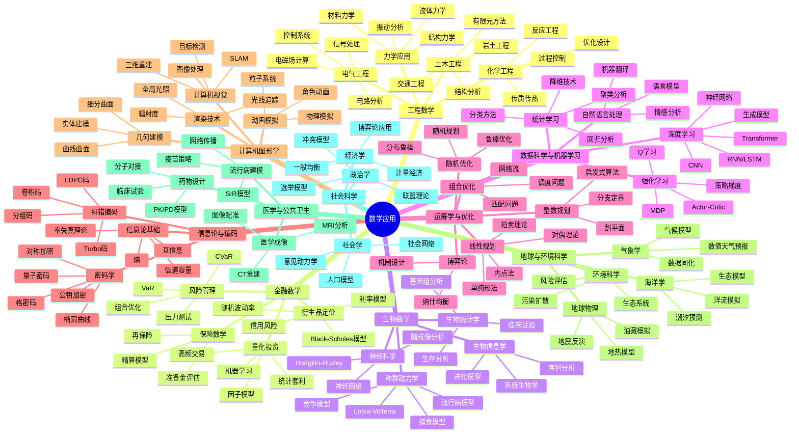
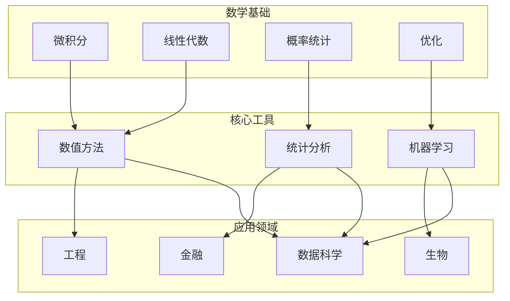
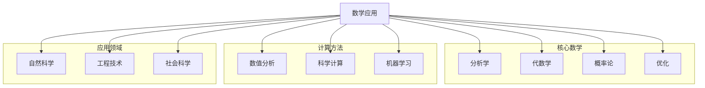

# 数学应用思维导图

> 数学应用将数学工具和方法应用于各领域的实际问题，从工程到金融，展现了数学的强大威力。

---

## 🧠 核心概念层级关系



---

## 🔗 应用领域依赖图



---

## 📍 重要应用案例

### 工程应用
| 应用 | 数学工具 | 重要性 | 效果 |
|-----|---------|-------|------|
| 飞机设计 | CFD | ⭐⭐⭐⭐⭐ | 效率提升 |
| 桥梁结构 | FEM | ⭐⭐⭐⭐⭐ | 安全设计 |
| 电路设计 | 线性代数 | ⭐⭐⭐⭐ | 自动优化 |

### 金融应用
| 应用 | 数学工具 | 重要性 | 效果 |
|-----|---------|-------|------|
| 期权定价 | 随机分析 | ⭐⭐⭐⭐⭐ | 风险管理 |
| 投资组合 | 优化 | ⭐⭐⭐⭐⭐ | 收益优化 |
| 高频交易 | 统计套利 | ⭐⭐⭐⭐ | 市场效率 |

### 生物应用
| 应用 | 数学工具 | 重要性 | 效果 |
|-----|---------|-------|------|
| 疫情预测 | ODE/PDE | ⭐⭐⭐⭐⭐ | 公共卫生 |
| 基因组分析 | 统计/ML | ⭐⭐⭐⭐⭐ | 精准医疗 |
| 神经网络 | 动力系统 | ⭐⭐⭐⭐ | 脑科学 |

### 数据科学应用
| 应用 | 数学工具 | 重要性 | 效果 |
|-----|---------|-------|------|
| 推荐系统 | 矩阵分解 | ⭐⭐⭐⭐⭐ | 个性化 |
| 图像识别 | CNN | ⭐⭐⭐⭐⭐ | 自动化 |
| 语言模型 | Transformer | ⭐⭐⭐⭐⭐ | NLP突破 |

---

## 🔄 与数学分支的连接



---

## 📊 应用成熟度评估

| 应用领域 | 数学成熟度 | 计算成熟度 | 实际影响 | 未来潜力 |
|---------|----------|----------|---------|---------|
| 工程计算 | ⭐⭐⭐⭐⭐ | ⭐⭐⭐⭐⭐ | ⭐⭐⭐⭐⭐ | ⭐⭐⭐⭐ |
| 金融工程 | ⭐⭐⭐⭐⭐ | ⭐⭐⭐⭐⭐ | ⭐⭐⭐⭐⭐ | ⭐⭐⭐⭐ |
| 生物信息 | ⭐⭐⭐⭐ | ⭐⭐⭐⭐ | ⭐⭐⭐⭐ | ⭐⭐⭐⭐⭐ |
| 数据科学 | ⭐⭐⭐⭐ | ⭐⭐⭐⭐⭐ | ⭐⭐⭐⭐⭐ | ⭐⭐⭐⭐⭐ |
| 优化决策 | ⭐⭐⭐⭐⭐ | ⭐⭐⭐⭐ | ⭐⭐⭐⭐⭐ | ⭐⭐⭐⭐ |

---

## 🎯 学习路径推荐

### 工程应用路径
```
工程基础 → 数学建模 → 数值方法 → 专业软件 → 实际项目
```

### 金融数学路径
```
概率论 → 随机分析 → 衍生品定价 → 风险管理 → 量化策略
```

### 数据科学路径
```
统计基础 → 机器学习 → 深度学习 → 领域应用 → 系统部署
```

### 生物数学路径
```
生物基础 → 动力系统 → 统计方法 → 生物信息 → 系统建模
```

---

## 📚 核心方法与工具

### 建模方法
1. **机理建模**：基于物理/生物/经济规律
2. **数据驱动**：统计/机器学习方法
3. **混合方法**：机理+数据结合

### 计算工具
| 类型 | 代表工具 | 应用领域 |
|-----|---------|---------|
| 通用 | MATLAB/Python | 通用 |
| PDE求解 | COMSOL/FEniCS | 工程 |
| 优化 | Gurobi/CPLEX | 运筹 |
| 统计 | R/SAS | 统计 |
| 深度学习 | PyTorch/TensorFlow | AI |

---

## 🔍 应用方法论


---

> 💡 **学习建议**：数学应用需要数学基础与领域知识的结合。建议选择一个应用领域深入钻研，同时保持数学工具的广度。实际问题往往没有标准答案，培养建模能力和解决复杂问题的能力是关键。
