# 数学应用跨学科图谱

> 数学作为科学的语言，与各学科领域形成紧密的知识网络，为解决复杂问题提供强大工具。

---

## 一、数学与各学科关系总图

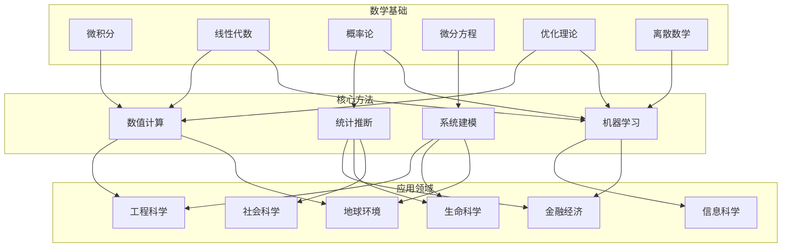

---

## 二、核心数学工具对应表

### 2.1 按数学分支分类

| 数学分支 | 核心工具 | 典型应用 | 难度等级 |
|---------|---------|---------|---------|
| **微积分** | 导数、积分、级数 | 物理定律、变化率分析 | ⭐⭐ |
| **线性代数** | 矩阵、特征值、SVD | 数据结构、降维、推荐系统 | ⭐⭐⭐ |
| **微分方程** | ODE、PDE、边界值问题 | 动态系统、流体力学、电路 | ⭐⭐⭐⭐ |
| **概率统计** | 分布、假设检验、贝叶斯 | 风险评估、实验设计、AI | ⭐⭐⭐ |
| **优化理论** | 线性规划、凸优化、启发式 | 资源配置、路径规划、调度 | ⭐⭐⭐⭐ |
| **数值分析** | 插值、积分、方程求解 | 科学计算、工程仿真 | ⭐⭐⭐ |
| **离散数学** | 图论、组合、逻辑 | 算法设计、网络分析、密码学 | ⭐⭐⭐ |
| **泛函分析** | 函数空间、算子理论 | 量子力学、控制理论、PDE | ⭐⭐⭐⭐⭐ |

### 2.2 按应用领域分类

#### 工程科学

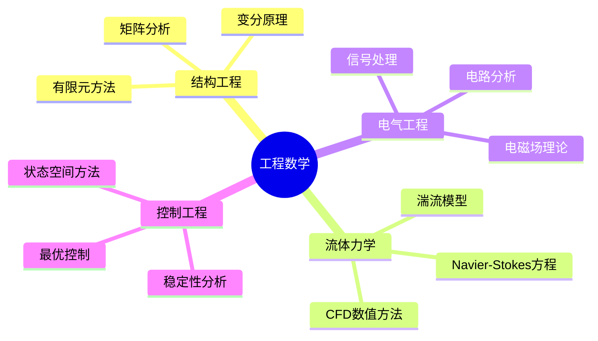

| 工程领域 | 主要数学工具 | 核心方程/方法 | 软件工具 |
|---------|------------|--------------|---------|
| 结构力学 | 变分法、线性代数 | 虚功原理、刚度矩阵 | ANSYS, ABAQUS |
| 流体力学 | PDE、数值分析 | Navier-Stokes方程 | Fluent, OpenFOAM |
| 信号处理 | 傅里叶分析、滤波器设计 | FFT、Z变换 | MATLAB, Python |
| 控制系统 | ODE、优化、线性代数 | 状态空间、LQR | MATLAB/Simulink |
| 热传导 | PDE、数值积分 | 热传导方程、有限差分 | COMSOL |

#### 金融经济

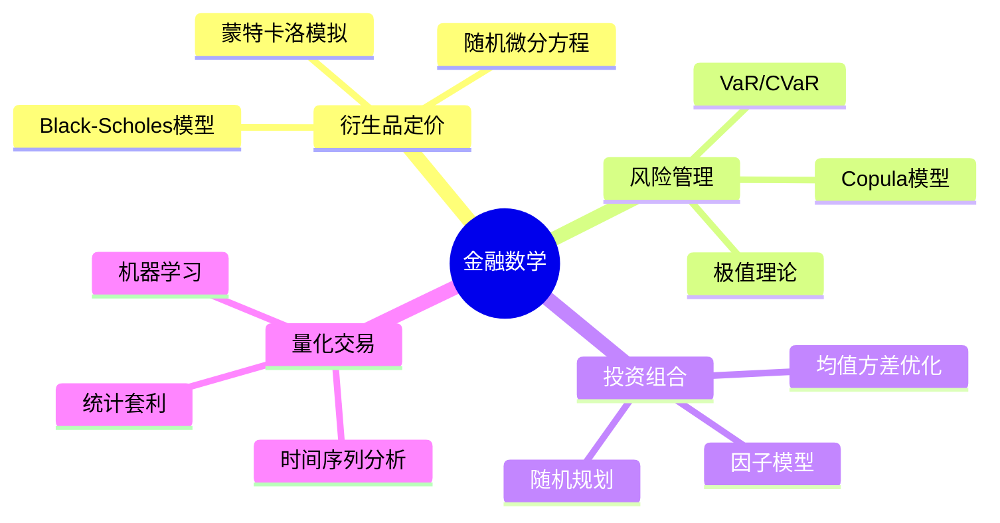

| 金融应用 | 数学基础 | 关键模型 | 风险指标 |
|---------|---------|---------|---------|
| 期权定价 | 随机分析、PDE | Black-Scholes、Heston | 希腊字母 |
| 风险管理 | 极值理论、统计 | GARCH、极值分布 | VaR、CVaR、ES |
| 资产配置 | 优化、随机过程 | Markowitz、Black-Litterman | 夏普比率 |
| 利率模型 | 随机微分方程 | Vasicek、CIR、HJM | 久期、凸性 |
| 信用风险 |  copula、概率 | CreditMetrics、KMV | 违约概率 |

#### 生命科学

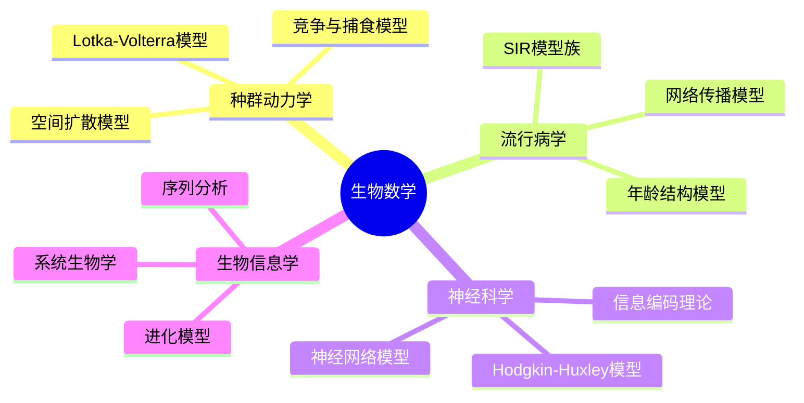

| 生物领域 | 数学模型 | 计算方法 | 数据来源 |
|---------|---------|---------|---------|
| 种群生态 | ODE/PDE、动力系统 | 数值积分、分岔分析 | 野外调查 |
| 流行病学 | 隔室模型、网络模型 | ODE求解、模拟 | 公共卫生数据 |
| 神经科学 | 微分方程、统计 | 数值模拟、机器学习 | 电生理记录 |
| 基因组学 | 概率图模型、统计检验 | 序列比对、聚类 | 测序数据 |
| 药代动力学 | ODE、随机模型 | 参数估计、模拟 | 临床试验 |

#### 信息科学

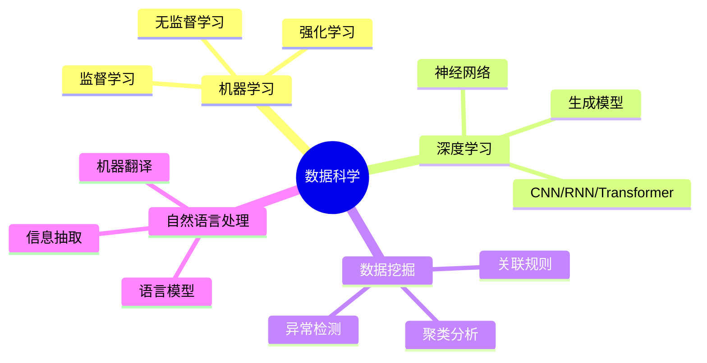

| 数据科学应用 | 核心算法 | 数学基础 | 框架工具 |
|------------|---------|---------|---------|
| 预测建模 | 回归、决策树、集成 | 统计、优化 | Scikit-learn |
| 图像识别 | CNN、ResNet、ViT | 卷积、反向传播 | PyTorch, TF |
| 自然语言 | Transformer、BERT、GPT | 注意力机制、概率 | Hugging Face |
| 推荐系统 | 矩阵分解、深度学习 | 线性代数、优化 | Surprise, LightFM |
| 图分析 | GNN、谱图理论 | 图论、线性代数 | PyG, DGL |

#### 社会科学

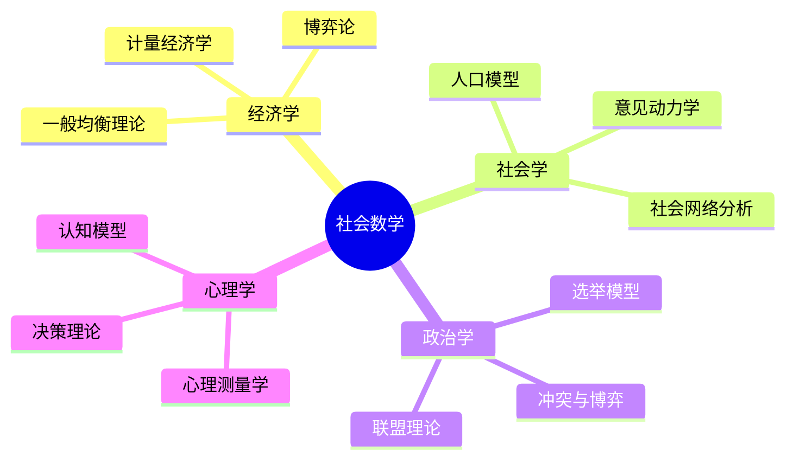

| 社会领域 | 数学方法 | 典型模型 | 数据来源 |
|---------|---------|---------|---------|
| 经济学 | 计量经济、优化 | DSGE、CGE模型 | 宏观统计数据 |
| 社会学 | 网络分析、统计 | 小世界网络、意见演化 | 社会调查 |
| 政治学 | 博弈论、选择模型 | 空间投票模型 | 选举数据 |
| 心理学 | 统计、信号检测论 | IRT模型、认知模型 | 实验数据 |

#### 地球与环境科学

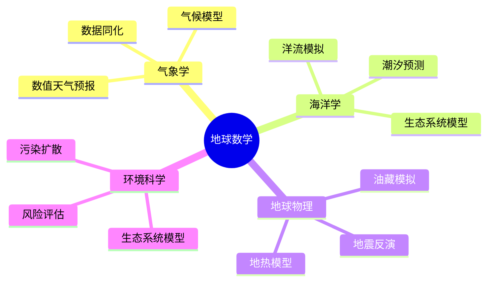

| 环境领域 | 数学模型 | 数值方法 | 应用实例 |
|---------|---------|---------|---------|
| 气象预报 | PDE、谱方法 | 有限差分、谱元法 | 天气预报系统 |
| 海洋模拟 | 浅水方程、环流模型 | 有限体积法 | 潮汐预测 |
| 地震研究 | 波动方程、反演 | 有限差分、遗传算法 | 地震预警 |
| 环境评估 | 扩散方程、统计 | 拉格朗日轨迹 | 污染评估 |

---

## 三、跨学科连接详解

### 3.1 数学物理与工程

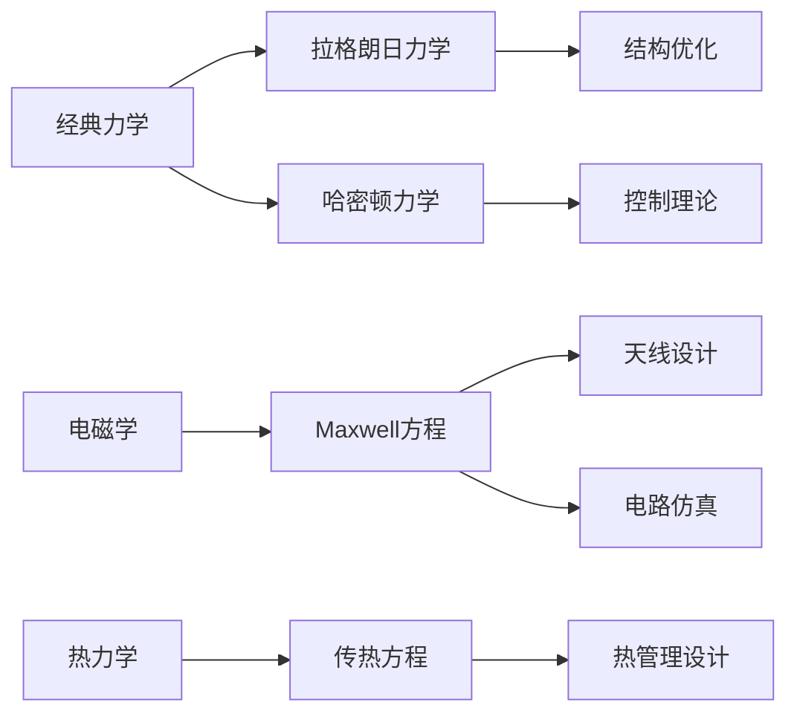

**核心连接：**
- **变分原理** → 工程优化 → 结构设计
- **对称性与守恒律** → 数值方法 → 计算力学
- **谱理论** → 模态分析 → 振动控制

### 3.2 概率论与机器学习

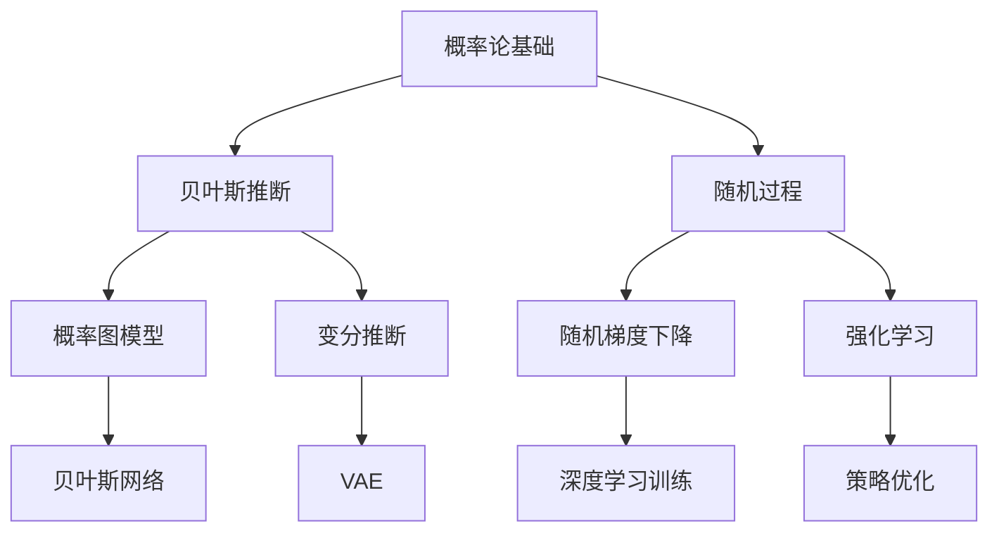

**核心连接：**
- **贝叶斯定理** → 参数估计 → 模型不确定性量化
- **信息论** → 损失函数设计 → 模型训练
- **随机逼近** → 优化算法 → 大规模学习

### 3.3 图论与网络科学

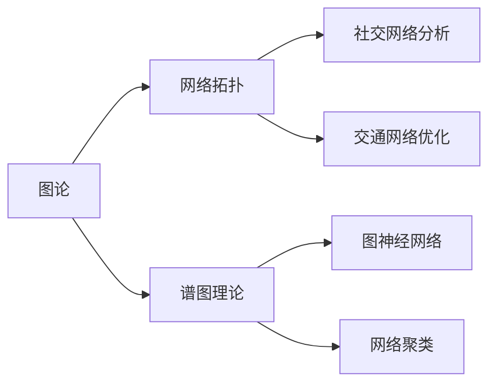

**核心连接：**
- **图拉普拉斯** → 谱聚类 → 社区发现
- **随机图** → 网络演化 → 传播动力学
- **网络流** → 优化问题 → 资源分配

---

## 四、数学工具选择指南

### 4.1 问题类型与工具匹配

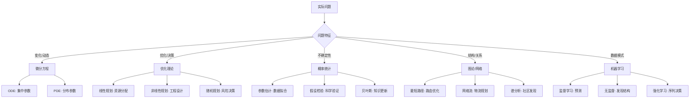

### 4.2 选择决策矩阵

| 如果问题涉及... | 考虑使用... | 典型方法 |
|--------------|------------|---------|
| 连续变化过程 | 微积分/微分方程 | Euler法、Runge-Kutta |
| 离散状态转移 | 差分方程/马尔可夫链 | 状态转移矩阵 |
| 资源优化配置 | 数学规划 | 单纯形法、内点法 |
| 不确定性量化 | 概率统计/随机过程 | MCMC、Bootstrap |
| 高维数据分析 | 线性代数/统计学习 | PCA、SVD、降维 |
| 关系结构分析 | 图论/网络科学 | 中心性、聚类算法 |
| 复杂模式识别 | 机器学习/深度学习 | CNN、Transformer |
| 动态系统控制 | 控制理论/优化 | LQR、MPC |

---

## 五、应用领域概览

### 5.1 应用领域成熟度评估

| 应用领域 | 数学成熟度 | 计算成熟度 | 实际影响 | 发展潜力 |
|---------|----------|----------|---------|---------|
| 计算力学 | ⭐⭐⭐⭐⭐ | ⭐⭐⭐⭐⭐ | ⭐⭐⭐⭐⭐ | ⭐⭐⭐ |
| 金融工程 | ⭐⭐⭐⭐⭐ | ⭐⭐⭐⭐⭐ | ⭐⭐⭐⭐⭐ | ⭐⭐⭐⭐ |
| 信号处理 | ⭐⭐⭐⭐⭐ | ⭐⭐⭐⭐⭐ | ⭐⭐⭐⭐⭐ | ⭐⭐⭐ |
| 数据科学 | ⭐⭐⭐⭐ | ⭐⭐⭐⭐⭐ | ⭐⭐⭐⭐⭐ | ⭐⭐⭐⭐⭐ |
| 生物信息 | ⭐⭐⭐⭐ | ⭐⭐⭐⭐ | ⭐⭐⭐⭐ | ⭐⭐⭐⭐⭐ |
| 气候模拟 | ⭐⭐⭐⭐ | ⭐⭐⭐⭐ | ⭐⭐⭐⭐⭐ | ⭐⭐⭐⭐ |
| 量子计算 | ⭐⭐⭐⭐ | ⭐⭐⭐ | ⭐⭐⭐ | ⭐⭐⭐⭐⭐ |
| 神经科学 | ⭐⭐⭐⭐ | ⭐⭐⭐⭐ | ⭐⭐⭐⭐ | ⭐⭐⭐⭐⭐ |

### 5.2 新兴交叉领域

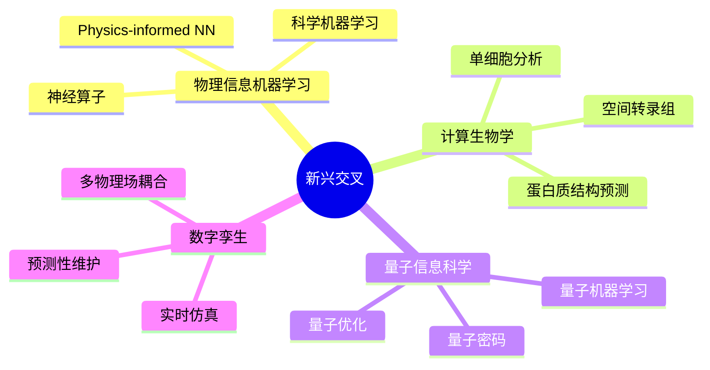

---

## 六、学习路径推荐

### 6.1 工程应用路径

```
数学基础 → 专业核心 → 计算方法 → 软件工具 → 项目实践
   ↓          ↓          ↓          ↓          ↓
微积分    工程力学    有限元法    ANSYS/    实际工程
线性代数   流体力学    CFD方法    MATLAB     项目
数值分析   热传导     优化算法   COMSOL
```

### 6.2 数据科学路径

```
统计基础 → 机器学习 → 深度学习 → 领域应用 → 系统部署
   ↓          ↓          ↓          ↓          ↓
概率论    监督学习    神经网络   NLP/CV    模型服务
假设检验   无监督     CNN/RNN   推荐系统   实时推理
回归分析   集成学习   Transformer 图网络   A/B测试
```

### 6.3 金融数学路径

```
概率论 → 随机过程 → 衍生品定价 → 风险管理 → 量化策略
  ↓         ↓          ↓           ↓          ↓
分布理论  Brown运动  Black-Scholes VaR/CVaR  统计套利
极限定理  鞅理论    利率模型    压力测试   高频交易
中心极限  Itô积分   信用模型    组合优化   机器学习
```

---

## 相关资源

- [应用数学建模方法论](./00-应用数学建模方法论.md) - 系统建模方法
- [数值分析](../07-数值分析/) - 数值计算方法
- [优化理论](../21-最优化/) - 最优化技术
- [概率统计](../06-概率统计/) - 统计建模基础
- [机器学习](../29-数据科学/) - 数据驱动方法

---

> **核心洞见**：数学的跨学科应用展现了其作为"科学语言"的统一性。不同领域的问题往往可以归结为相似的数学结构，这使得数学工具和知识可以在学科间迁移和复用。
