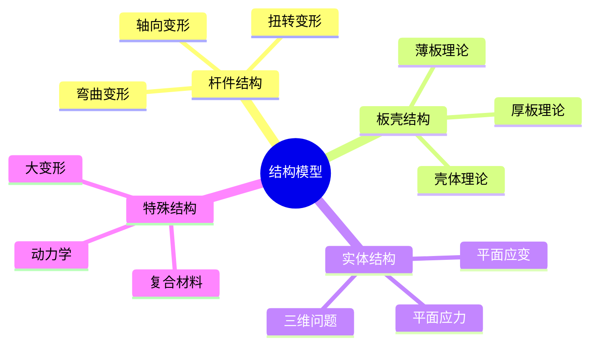
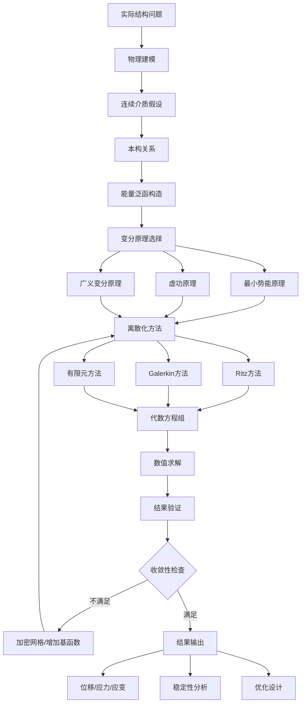

# 结构力学中的变分方法

> 变分法是结构力学的数学基础，通过能量原理将力学问题转化为泛函极值问题，为有限元方法奠定了理论基础。

---

## 一、问题背景

### 1.1 工程需求

结构力学研究工程结构在外力作用下的响应，包括：
- **变形分析**：结构的位移和应变分布
- **应力计算**：内部应力状态评估
- **稳定性判断**：临界荷载和屈曲分析
- **优化设计**：材料最优配置

### 1.2 变分法的优势

| 传统方法 | 变分方法 |
|---------|---------|
| 微分方程+边界条件 | 统一的泛函极值 |
| 复杂边界处理困难 | 自然边界条件自动满足 |
| 近似解难以系统构造 | Ritz/Galerkin系统近似 |
| 多物理场耦合复杂 | 能量泛函统一表达 |

---

## 二、数学模型建立

### 2.1 最小势能原理

**基本形式：**

对于线弹性体，总势能泛函为：

$$\Pi(u) = U - W = \int_\Omega \frac{1}{2}\sigma_{ij}\varepsilon_{ij} d\Omega - \int_\Omega f_i u_i d\Omega - \int_{\Gamma_t} t_i u_i d\Gamma$$

**平衡条件：**

$$\delta \Pi = 0 \quad \Leftrightarrow \quad \text{平衡方程} + \text{力边界条件}$$

### 2.2 虚功原理

**虚位移原理：**

$$\int_\Omega \sigma_{ij} \delta\varepsilon_{ij} d\Omega = \int_\Omega f_i \delta u_i d\Omega + \int_{\Gamma_t} t_i \delta u_i d\Gamma$$

**物理意义**：外力虚功 = 内力虚功

### 2.3 结构模型分类



---

## 三、理论分析与推导

### 3.1 Euler-Bernoulli梁理论

**问题描述**：细长梁在横向荷载下的弯曲

**控制方程：**

$$\frac{d^2}{dx^2}\left(EI\frac{d^2w}{dx^2}\right) = q(x)$$

**能量泛函：**

$$\Pi(w) = \int_0^L \left[\frac{1}{2}EI\left(\frac{d^2w}{dx^2}\right)^2 - qw\right]dx$$

**变分推导：**

```
δΠ = ∫[EI·w''·δw'' - q·δw]dx = 0

分部积分两次：
= [EI·w''·δw']₀ᴸ - [EI·w'''·δw]₀ᴸ + ∫[EI·w'''' - q]δw dx = 0

由δw任意性：
→ EI·w'''' = q  （平衡方程）
→ 边界条件：
   位移边界：w = ŵ 或 δw = 0
   力边界：EIw'' = M̄ 或 EIw''' = V̄
```

### 3.2 Rayleigh-Ritz方法

**近似解形式：**

$$w(x) \approx \sum_{i=1}^{n} a_i \phi_i(x)$$

其中 $\phi_i(x)$ 满足几何边界条件的基函数。

**求解步骤：**

1. 将近似解代入能量泛函
2. 对参数求极值：$\frac{\partial \Pi}{\partial a_i} = 0$
3. 解线性方程组得到系数

**Python实现：**

```python
import numpy as np
from scipy.integrate import quad
import matplotlib.pyplot as plt

class RayleighRitzBeam:
    """Rayleigh-Ritz方法求解简支梁弯曲问题"""
    
    def __init__(self, L, EI, q_func):
        """
        L: 梁长度
        EI: 抗弯刚度
        q_func: 分布荷载函数
        """
        self.L = L
        self.EI = EI
        self.q_func = q_func
    
    def basis_function(self, x, i):
        """简支梁基函数: sin(iπx/L)"""
        return np.sin(i * np.pi * x / self.L)
    
    def basis_derivative2(self, x, i):
        """基函数二阶导数"""
        return -(i * np.pi / self.L)**2 * np.sin(i * np.pi * x / self.L)
    
    def assemble_system(self, n_terms):
        """组装刚度矩阵和荷载向量"""
        K = np.zeros((n_terms, n_terms))
        F = np.zeros(n_terms)
        
        for i in range(1, n_terms + 1):
            for j in range(1, n_terms + 1):
                # 刚度矩阵元素
                integrand = lambda x: (self.EI * 
                    self.basis_derivative2(x, i) * 
                    self.basis_derivative2(x, j))
                K[i-1, j-1], _ = quad(integrand, 0, self.L)
            
            # 荷载向量元素
            integrand = lambda x: self.q_func(x) * self.basis_function(x, i)
            F[i-1], _ = quad(integrand, 0, self.L)
        
        return K, F
    
    def solve(self, n_terms=5):
        """求解系数"""
        K, F = self.assemble_system(n_terms)
        a = np.linalg.solve(K, F)
        self.coefficients = a
        self.n_terms = n_terms
        return a
    
    def displacement(self, x):
        """计算位移"""
        w = np.zeros_like(x)
        for i, coeff in enumerate(self.coefficients, 1):
            w += coeff * self.basis_function(x, i)
        return w
    
    def bending_moment(self, x):
        """计算弯矩 M = -EI·w''"""
        M = np.zeros_like(x)
        for i, coeff in enumerate(self.coefficients, 1):
            M += coeff * (-self.EI * self.basis_derivative2(x, i))
        return M

# 使用示例：简支梁均布荷载
L = 10.0  # 梁长10m
EI = 1e7  # 抗弯刚度
q0 = 1000  # 均布荷载

# 定义荷载函数
q_func = lambda x: q0

# 创建求解器
beam = RayleighRitzBeam(L, EI, q_func)
coefficients = beam.solve(n_terms=5)

# 计算结果
x = np.linspace(0, L, 100)
w = beam.displacement(x)
M = beam.bending_moment(x)

# 与解析解比较
w_exact = q0 * x * (L**3 - 2*L*x**2 + x**3) / (24 * EI)
M_exact = q0 * x * (L - x) / 2

# 可视化
fig, (ax1, ax2) = plt.subplots(2, 1, figsize=(10, 8))

ax1.plot(x, w, 'b-', label='Ritz近似', linewidth=2)
ax1.plot(x, w_exact, 'r--', label='精确解', linewidth=2)
ax1.set_xlabel('位置 x (m)')
ax1.set_ylabel('挠度 w (m)')
ax1.set_title('简支梁挠度分布')
ax1.legend()
ax1.grid(True)

ax2.plot(x, M, 'b-', label='Ritz近似', linewidth=2)
ax2.plot(x, M_exact, 'r--', label='精确解', linewidth=2)
ax2.set_xlabel('位置 x (m)')
ax2.set_ylabel('弯矩 M (N·m)')
ax2.set_title('简支梁弯矩分布')
ax2.legend()
ax2.grid(True)

plt.tight_layout()
plt.savefig('beam_analysis.png', dpi=150)
plt.show()

print(f"最大挠度: 近似={np.max(np.abs(w)):.6f}, 精确={np.max(np.abs(w_exact)):.6f}")
print(f"最大弯矩: 近似={np.max(np.abs(M)):.2f}, 精确={np.max(np.abs(M_exact)):.2f}")
```

### 3.3 Galerkin方法

**弱形式：**

对于一般微分方程 $Lu = f$，弱形式为：

$$\int_\Omega (Lu - f)v \, d\Omega = 0, \quad \forall v \in V$$

其中 $V$ 是适当的试探函数空间。

**有限元实现要点：**

```python
import numpy as np
from scipy.sparse import csr_matrix
from scipy.sparse.linalg import spsolve

class FEM1D:
    """一维有限元求解器"""
    
    def __init__(self, nodes, E, A):
        """
        nodes: 节点坐标数组
        E: 弹性模量（可以是数组）
        A: 截面积（可以是数组）
        """
        self.nodes = nodes
        self.E = E
        self.A = A
        self.n_nodes = len(nodes)
        self.n_elements = self.n_nodes - 1
    
    def element_stiffness(self, e):
        """计算单元刚度矩阵"""
        x1, x2 = self.nodes[e], self.nodes[e+1]
        Le = x2 - x1
        EA = self.E[e] * self.A[e]
        
        k_e = (EA / Le) * np.array([[1, -1], [-1, 1]])
        return k_e
    
    def assemble_global(self):
        """组装全局刚度矩阵"""
        K = np.zeros((self.n_nodes, self.n_nodes))
        
        for e in range(self.n_elements):
            k_e = self.element_stiffness(e)
            # 组装到全局矩阵
            K[e:e+2, e:e+2] += k_e
        
        return K
    
    def solve(self, fixed_dofs, F_global):
        """
        求解系统
        fixed_dofs: 约束自由度列表
        F_global: 全局节点力向量
        """
        K = self.assemble_global()
        
        # 处理边界条件（置1法）
        free_dofs = [i for i in range(self.n_nodes) if i not in fixed_dofs]
        
        # 提取子矩阵
        K_ff = K[np.ix_(free_dofs, free_dofs)]
        F_f = F_global[free_dofs]
        
        # 求解
        u_f = np.linalg.solve(K_ff, F_f)
        
        # 组装完整位移向量
        u = np.zeros(self.n_nodes)
        u[free_dofs] = u_f
        
        # 计算反力
        reactions = K[fixed_dofs, :].dot(u)
        
        return u, reactions
```

---

## 四、数值实验

### 4.1 悬臂梁端部受载

```python
import numpy as np
import matplotlib.pyplot as plt
from matplotlib.patches import FancyArrowPatch

def cantilever_beam(L, EI, P, nelements=20):
    """悬臂梁端部受集中力 - 有限差分法"""
    
    x = np.linspace(0, L, nelements + 1)
    h = L / nelements
    
    # 构建有限差分矩阵（中心差分）
    # w'''' = 0, 边界条件：w(0)=0, w'(0)=0, w''(L)=0, w'''(L)=P/EI
    
    n = nelements - 1
    A = np.zeros((n, n))
    b = np.zeros(n)
    
    # 构建四阶差分矩阵
    for i in range(n):
        if i == 0:
            A[i, i] = 6
            A[i, i+1] = -4
            A[i, i+2] = 1
            b[i] = -2*0 + 0  # 边界条件
        elif i == n-1:
            A[i, i-2] = 1
            A[i, i-1] = -4
            A[i, i] = 5
            b[i] = h**3 * P / EI
        elif i == n-2:
            A[i, i-1] = -4
            A[i, i] = 6
            A[i, i+1] = -4
            A[i, i+2] = 1
        else:
            A[i, i-2] = 1
            A[i, i-1] = -4
            A[i, i] = 6
            A[i, i+1] = -4
            A[i, i+2] = 1
    
    # 求解
    w_interior = np.linalg.solve(A, b * h**4 / EI)
    
    # 添加边界节点
    w = np.concatenate([[0, 0], w_interior])
    
    return x, w

# 参数
L = 5.0
E = 200e9  # 钢
I = 1e-4   # 截面惯性矩
EI = E * I
P = 10000  # 端部荷载

# 求解
x, w = cantilever_beam(L, EI, P, nelements=50)

# 解析解
w_exact = P * x**2 * (3*L - x) / (6 * EI)

# 可视化
fig, ax = plt.subplots(figsize=(12, 5))

# 变形图（放大）
scale = 1000  # 放大系数
deflected_shape = w * scale

ax.plot(x, deflected_shape, 'b-', linewidth=2, label='变形后形状')
ax.axhline(y=0, color='gray', linestyle='--', alpha=0.5, label='原始形状')

# 添加端部力箭头
ax.annotate('', xy=(L, deflected_shape[-1]), xytext=(L, deflected_shape[-1] + 0.5),
            arrowprops=dict(arrowstyle='->', color='red', lw=2))
ax.text(L + 0.2, deflected_shape[-1] + 0.25, f'P={P}N', fontsize=10)

ax.set_xlabel('位置 x (m)')
ax.set_ylabel(f'挠度 w × {scale}')
ax.set_title('悬臂梁端部受载变形图')
ax.legend()
ax.grid(True)
ax.set_aspect('equal', adjustable='datalim')

plt.tight_layout()
plt.savefig('cantilever_beam.png', dpi=150)
plt.show()

print(f"端部挠度: 数值={w[-1]:.6f}m, 精确={P*L**3/(3*EI):.6f}m")
```

### 4.2 模态分析

```python
import numpy as np
from scipy.linalg import eigh
import matplotlib.pyplot as plt

def beam_modal_analysis(L, EI, rhoA, n_modes=5, nelements=50):
    """Euler-Bernoulli梁模态分析"""
    
    x = np.linspace(0, L, nelements + 1)
    h = L / nelements
    n = nelements - 1
    
    # 组装质量矩阵和刚度矩阵（集中质量简化）
    M = np.eye(n) * rhoA * h
    
    K = np.zeros((n, n))
    factor = EI / h**3
    
    for i in range(n):
        if i == 0:
            K[i, i:i+3] = factor * np.array([6, -4, 1])
        elif i == n-1:
            K[i, i-2:i+1] = factor * np.array([1, -4, 6])
        elif i == 1 or i == n-2:
            K[i, max(0,i-2):min(n,i+3)] = factor * np.array([0, -4, 6, -4, 1][:min(5, n-i+2)])[max(0,2-i):]
        else:
            K[i, i-2:i+3] = factor * np.array([1, -4, 6, -4, 1])
    
    # 求解特征值问题
    eigenvalues, eigenvectors = eigh(K, M)
    
    # 计算频率
    omega = np.sqrt(eigenvalues)
    f = omega / (2 * np.pi)
    
    return f[:n_modes], eigenvectors[:, :n_modes], x

# 参数
L = 10.0
E = 200e9
I = 2e-4
rho = 7850
A = 0.01
EI = E * I
rhoA = rho * A

# 模态分析
f, modes, x = beam_modal_analysis(L, EI, rhoA, n_modes=4, nelements=100)

# 可视化
fig, axes = plt.subplots(2, 2, figsize=(12, 8))
axes = axes.flatten()

for i, ax in enumerate(axes):
    # 添加边界节点
    mode_shape = np.concatenate([[0], modes[:, i], [0]])
    x_full = np.concatenate([[0], x[1:-1], [L]])
    
    ax.plot(x_full, mode_shape, 'b-', linewidth=2)
    ax.axhline(y=0, color='gray', linestyle='--', alpha=0.5)
    ax.fill_between(x_full, 0, mode_shape, alpha=0.3)
    ax.set_xlabel('位置 x (m)')
    ax.set_ylabel('模态振幅')
    ax.set_title(f'第{i+1}阶模态, f = {f[i]:.2f} Hz')
    ax.grid(True)
    ax.set_xlim([0, L])

plt.suptitle('简支梁模态形状', fontsize=14)
plt.tight_layout()
plt.savefig('beam_modes.png', dpi=150)
plt.show()

print("前4阶固有频率:")
for i, freq in enumerate(f):
    print(f"  第{i+1}阶: {freq:.2f} Hz")
```

---

## 五、模型结构流程图



---

## 六、相关数学概念

- [变分法](../10-应用数学/变分法.md) - 泛函极值理论基础
- [微分方程](../05-微分方程/常微分方程.md) - 结构控制方程
- [线性代数](../02-代数学/线性代数基础.md) - 有限元矩阵运算
- [数值分析](../07-数值分析/) - 数值求解方法
- [有限元方法](../08-计算数学/有限元方法.md) - 工程计算方法
- [弹性力学](../08-数学物理/连续介质力学.md) - 连续介质理论基础

---

> **工程实践提示**：
> - 选择适当的单元类型和网格密度是关键
> - 边界条件的准确施加直接影响结果可靠性
> - 对于非线性问题（大变形、材料非线性），需要迭代求解
> - 验证模型时可使用收敛性测试和与解析解对比
