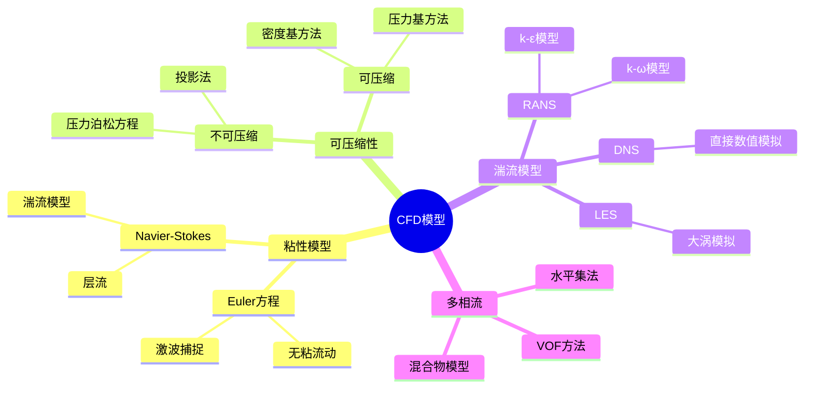
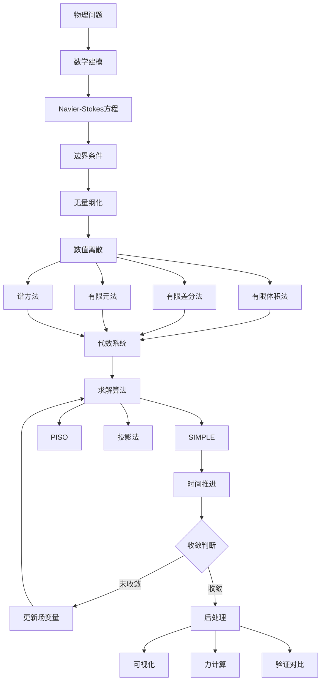

# 流体力学数值模拟案例

> 计算流体力学(CFD)利用数值方法求解Navier-Stokes方程，在航空航天、汽车工程、气象预测等领域有广泛应用。

---

## 一、问题背景

### 1.1 流体力学的重要性

流体力学研究流体（液体和气体）的运动规律，应用领域包括：
- **航空航天**：飞机气动外形设计
- **汽车工业**：风阻优化、发动机冷却
- **能源工程**：风力发电、水轮机设计
- **环境科学**：污染物扩散、气候模拟
- **生物医学**：血液流动、呼吸气流

### 1.2 数值模拟的优势

| 方法 | 成本 | 周期 | 信息完整度 | 适用场景 |
|-----|------|------|-----------|---------|
| 理论分析 | 低 | 短 | 有限 | 简单几何 |
| 实验测试 | 高 | 长 | 局部 | 验证、复杂现象 |
| 数值模拟 | 中 | 中 | 全面 | 设计优化 |

---

## 二、数学模型建立

### 2.1 控制方程

**Navier-Stokes方程（不可压缩流动）：**

连续性方程：
$$\nabla \cdot \mathbf{u} = 0$$

动量方程：
$$\frac{\partial \mathbf{u}}{\partial t} + (\mathbf{u} \cdot \nabla)\mathbf{u} = -\frac{1}{\rho}\nabla p + \nu \nabla^2 \mathbf{u} + \mathbf{f}$$

**无量纲形式（Reynolds数）：**

$$\frac{\partial \mathbf{u}}{\partial t} + (\mathbf{u} \cdot \nabla)\mathbf{u} = -\nabla p + \frac{1}{Re}\nabla^2 \mathbf{u}$$

其中 $Re = \frac{UL}{\nu}$ 为Reynolds数，表征惯性力与粘性力之比。

### 2.2 模型分类



---

## 三、理论分析与推导

### 3.1 有限体积法离散

**基本思想：** 在控制体上积分守恒方程

$$\int_V \frac{\partial \phi}{\partial t} dV + \int_S \mathbf{J} \cdot d\mathbf{S} = \int_V S_\phi dV$$

**离散格式：**

| 格式 | 特性 | 适用条件 |
|-----|------|---------|
| 一阶迎风 | 稳定、有耗散 | 初始计算 |
| 二阶中心 | 精度高、可能振荡 | 低Peclet数 |
| QUICK | 三阶精度 | 工程计算 |
| TVD | 无振荡、高精度 | 激波捕捉 |

### 3.2 压力-速度耦合

**SIMPLE算法流程：**

```
1. 初始化速度场u*, v*和压力场p*
2. 求解动量方程得到中间速度u', v'
3. 求解压力修正方程得到p'
4. 修正速度：u = u' + u_corr
5. 修正压力：p = p* + α_p·p'
6. 检查收敛，若不收敛返回步骤2
```

### 3.3 边界条件处理

```python
class BoundaryConditions:
    """CFD边界条件处理"""
    
    def __init__(self, nx, ny):
        self.nx = nx
        self.ny = ny
    
    def inlet(self, u, v, U_in):
        """入口边界 - 给定速度"""
        u[0, :] = U_in  # x方向速度
        v[0, :] = 0     # y方向速度
        return u, v
    
    def outlet(self, u, v):
        """出口边界 - 零梯度（充分发展）"""
        u[-1, :] = u[-2, :]
        v[-1, :] = v[-2, :]
        return u, v
    
    def wall(self, u, v):
        """固壁边界 - 无滑移"""
        u[:, 0] = 0     # 下壁面
        u[:, -1] = 0    # 上壁面
        v[:, 0] = 0
        v[:, -1] = 0
        return u, v
    
    def periodic(self, phi):
        """周期性边界"""
        phi[0, :] = phi[-2, :]
        phi[-1, :] = phi[1, :]
        return phi
```

---

## 四、数值实验

### 4.1 二维层流圆柱绕流

```python
import numpy as np
import matplotlib.pyplot as plt
from matplotlib.patches import Circle

class LidDrivenCavity:
    """
    顶盖驱动方腔流
    标准CFD验证案例
    """
    
    def __init__(self, N=41, Re=100, dt=0.001, nit=50):
        """
        N: 网格数
        Re: Reynolds数
        dt: 时间步长
        nit: 每个时间步压力迭代次数
        """
        self.N = N
        self.Re = Re
        self.dt = dt
        self.nit = nit
        
        # 网格
        self.x = np.linspace(0, 1, N)
        self.y = np.linspace(0, 1, N)
        self.dx = self.x[1] - self.x[0]
        self.dy = self.y[1] - self.y[0]
        
        # 初始化场
        self.u = np.zeros((N, N))  # x速度
        self.v = np.zeros((N, N))  # y速度
        self.p = np.zeros((N, N))  # 压力
        
    def build_up_b(self, b, rho, dt, u, v, dx, dy):
        """构建压力Poisson方程右端项"""
        b[1:-1, 1:-1] = (rho * (1 / dt * 
            ((u[1:-1, 2:] - u[1:-1, 0:-2]) / (2 * dx) + 
             (v[2:, 1:-1] - v[0:-2, 1:-1]) / (2 * dy)) -
            ((u[1:-1, 2:] - u[1:-1, 0:-2]) / (2 * dx))**2 -
            2 * ((u[2:, 1:-1] - u[0:-2, 1:-1]) / (2 * dy) *
                 (v[1:-1, 2:] - v[1:-1, 0:-2]) / (2 * dx)) -
            ((v[2:, 1:-1] - v[0:-2, 1:-1]) / (2 * dy))**2))
        return b
    
    def pressure_poisson(self, p, dx, dy, b):
        """求解压力Poisson方程"""
        pn = np.empty_like(p)
        
        for q in range(self.nit):
            pn = p.copy()
            p[1:-1, 1:-1] = (((pn[1:-1, 2:] + pn[1:-1, 0:-2]) * dy**2 + 
                              (pn[2:, 1:-1] + pn[0:-2, 1:-1]) * dx**2) /
                             (2 * (dx**2 + dy**2)) -
                             dx**2 * dy**2 / (2 * (dx**2 + dy**2)) * 
                             b[1:-1, 1:-1])
            
            # 压力边界条件
            p[:, -1] = p[:, -2]  # dp/dy = 0 at y = 2
            p[0, :] = p[1, :]    # dp/dy = 0 at y = 0
            p[:, 0] = p[:, 1]    # dp/dx = 0 at x = 0
            p[-1, :] = 0         # p = 0 at x = 2
            
        return p
    
    def step(self):
        """时间推进一步"""
        un = self.u.copy()
        vn = self.v.copy()
        
        b = np.zeros((self.N, self.N))
        rho = 1
        nu = 1 / self.Re
        
        # 构建压力源项
        b = self.build_up_b(b, rho, self.dt, un, vn, self.dx, self.dy)
        
        # 求解压力
        self.p = self.pressure_poisson(self.p, self.dx, self.dy, b)
        
        # 求解速度
        self.u[1:-1, 1:-1] = (un[1:-1, 1:-1] -
            un[1:-1, 1:-1] * self.dt / self.dx * 
            (un[1:-1, 1:-1] - un[1:-1, 0:-2]) -
            vn[1:-1, 1:-1] * self.dt / self.dy * 
            (un[1:-1, 1:-1] - un[0:-2, 1:-1]) -
            self.dt / (2 * rho * self.dx) * 
            (self.p[1:-1, 2:] - self.p[1:-1, 0:-2]) +
            nu * (self.dt / self.dx**2 * 
            (un[1:-1, 2:] - 2 * un[1:-1, 1:-1] + un[1:-1, 0:-2]) +
            self.dt / self.dy**2 * 
            (un[2:, 1:-1] - 2 * un[1:-1, 1:-1] + un[0:-2, 1:-1])))
        
        self.v[1:-1, 1:-1] = (vn[1:-1, 1:-1] -
            un[1:-1, 1:-1] * self.dt / self.dx * 
            (vn[1:-1, 1:-1] - vn[1:-1, 0:-2]) -
            vn[1:-1, 1:-1] * self.dt / self.dy * 
            (vn[1:-1, 1:-1] - vn[0:-2, 1:-1]) -
            self.dt / (2 * rho * self.dy) * 
            (self.p[2:, 1:-1] - self.p[0:-2, 1:-1]) +
            nu * (self.dt / self.dx**2 * 
            (vn[1:-1, 2:] - 2 * vn[1:-1, 1:-1] + vn[1:-1, 0:-2]) +
            self.dt / self.dy**2 * 
            (vn[2:, 1:-1] - 2 * vn[1:-1, 1:-1] + vn[0:-2, 1:-1])))
        
        # 边界条件
        self.u[0, :] = 0      # 底边
        self.u[:, 0] = 0      # 左边
        self.u[:, -1] = 0     # 右边
        self.u[-1, :] = 1     # 顶盖
        
        self.v[0, :] = 0
        self.v[:, 0] = 0
        self.v[:, -1] = 0
        self.v[-1, :] = 0
        
    def solve(self, nt=1000):
        """求解到稳态"""
        for n in range(nt):
            self.step()
            if n % 100 == 0:
                print(f"Step {n}/{nt}")
        return self.u, self.v, self.p
    
    def plot_results(self):
        """可视化结果"""
        fig, axes = plt.subplots(1, 3, figsize=(15, 5))
        
        # 速度矢量图
        X, Y = np.meshgrid(self.x, self.y)
        axes[0].quiver(X[::2, ::2], Y[::2, ::2], 
                       self.u[::2, ::2], self.v[::2, ::2])
        axes[0].set_xlabel('X')
        axes[0].set_ylabel('Y')
        axes[0].set_title(f'Velocity Field (Re={self.Re})')
        axes[0].set_aspect('equal')
        
        # 压力分布
        im1 = axes[1].contourf(X, Y, self.p, alpha=0.5, cmap='viridis')
        axes[1].set_xlabel('X')
        axes[1].set_ylabel('Y')
        axes[1].set_title('Pressure')
        plt.colorbar(im1, ax=axes[1])
        axes[1].set_aspect('equal')
        
        # 流线
        axes[2].streamplot(X, Y, self.u, self.v, density=2)
        axes[2].set_xlabel('X')
        axes[2].set_ylabel('Y')
        axes[2].set_title('Streamlines')
        axes[2].set_aspect('equal')
        
        plt.tight_layout()
        plt.savefig('cavity_flow.png', dpi=150)
        plt.show()

# 运行模拟
cavity = LidDrivenCavity(N=41, Re=100, dt=0.001)
u, v, p = cavity.solve(nt=2000)
cavity.plot_results()
```

### 4.2 涡量-流函数法

```python
import numpy as np
import matplotlib.pyplot as plt
from scipy.sparse import diags
from scipy.sparse.linalg import spsolve

class VorticityStreamFunction:
    """涡量-流函数法求解二维不可压缩流动"""
    
    def __init__(self, nx, ny, Lx, Ly, Re):
        self.nx = nx
        self.ny = ny
        self.Lx = Lx
        self.Ly = Ly
        self.Re = Re
        
        self.dx = Lx / (nx - 1)
        self.dy = Ly / (ny - 1)
        
        # 初始化场
        self.omega = np.zeros((ny, nx))  # 涡量
        self.psi = np.zeros((ny, nx))    # 流函数
        
    def solve_stream_function(self):
        """求解流函数Poisson方程: ∇²ψ = -ω"""
        n = self.nx * self.ny
        
        # 构建离散Laplace矩阵
        main_diag = -2 * (1/self.dx**2 + 1/self.dy**2) * np.ones(n)
        x_diag = 1/self.dx**2 * np.ones(n-1)
        y_diag = 1/self.dy**2 * np.ones(n-self.nx)
        
        # 处理边界
        for i in range(self.ny):
            for j in range(self.nx):
                idx = i * self.nx + j
                if i == 0 or i == self.ny-1 or j == 0 or j == self.nx-1:
                    main_diag[idx] = 1
                    if idx > 0:
                        x_diag[idx-1] = 0
                    if idx < n-1:
                        x_diag[idx] = 0
                    if idx >= self.nx:
                        y_diag[idx-self.nx] = 0
                    if idx < n - self.nx:
                        y_diag[idx] = 0
        
        A = diags([y_diag, x_diag, main_diag, x_diag, y_diag],
                  [-self.nx, -1, 0, 1, self.nx], format='csr')
        
        # 右端项
        b = -self.omega.flatten()
        
        # 边界条件
        for i in range(self.ny):
            for j in range(self.nx):
                idx = i * self.nx + j
                if i == 0 or i == self.ny-1 or j == 0 or j == self.nx-1:
                    b[idx] = 0  # ψ = 0 on walls
        
        # 求解
        psi_flat = spsolve(A, b)
        self.psi = psi_flat.reshape((self.ny, self.nx))
        
    def update_vorticity(self, dt):
        """更新涡量（显式时间推进）"""
        omega_old = self.omega.copy()
        
        # 计算速度
        u = (self.psi[2:, 1:-1] - self.psi[:-2, 1:-1]) / (2 * self.dy)
        v = -(self.psi[1:-1, 2:] - self.psi[1:-1, :-2]) / (2 * self.dx)
        
        # 涡量输运方程
        domega_dx = (omega_old[1:-1, 2:] - omega_old[1:-1, :-2]) / (2 * self.dx)
        domega_dy = (omega_old[2:, 1:-1] - omega_old[:-2, 1:-1]) / (2 * self.dy)
        
        laplacian_omega = (
            (omega_old[1:-1, 2:] - 2*omega_old[1:-1, 1:-1] + omega_old[1:-1, :-2]) / self.dx**2 +
            (omega_old[2:, 1:-1] - 2*omega_old[1:-1, 1:-1] + omega_old[:-2, 1:-1]) / self.dy**2
        )
        
        self.omega[1:-1, 1:-1] = (omega_old[1:-1, 1:-1] - 
            dt * (u * domega_dx + v * domega_dy) + 
            dt / self.Re * laplacian_omega)
        
        # 壁面涡量边界条件
        self.omega[0, :] = -2 * self.psi[1, :] / self.dy**2   # 底边
        self.omega[-1, :] = -2 * self.psi[-2, :] / self.dy**2  # 顶边
        self.omega[:, 0] = -2 * self.psi[:, 1] / self.dx**2   # 左边
        self.omega[:, -1] = -2 * self.psi[:, -2] / self.dx**2  # 右边
        
    def solve(self, dt=0.001, n_steps=5000):
        """求解到稳态"""
        for step in range(n_steps):
            self.solve_stream_function()
            self.update_vorticity(dt)
            
            if step % 500 == 0:
                print(f"Step {step}/{n_steps}")
        
        return self.omega, self.psi

# 运行模拟
ns = VorticityStreamFunction(nx=65, ny=65, Lx=1.0, Ly=1.0, Re=100)
omega, psi = ns.solve(dt=0.001, n_steps=5000)

# 可视化
fig, axes = plt.subplots(1, 2, figsize=(12, 5))

x = np.linspace(0, 1, ns.nx)
y = np.linspace(0, 1, ns.ny)
X, Y = np.meshgrid(x, y)

# 涡量分布
im1 = axes[0].contourf(X, Y, omega, levels=20, cmap='RdBu_r')
axes[0].set_xlabel('X')
axes[0].set_ylabel('Y')
axes[0].set_title('Vorticity')
plt.colorbar(im1, ax=axes[0])

# 流函数/流线
im2 = axes[1].contour(X, Y, psi, levels=20, colors='black', linewidths=0.5)
axes[1].contourf(X, Y, psi, levels=20, cmap='viridis', alpha=0.7)
axes[1].set_xlabel('X')
axes[1].set_ylabel('Y')
axes[1].set_title('Stream Function')
plt.colorbar(im2, ax=axes[1])

plt.tight_layout()
plt.savefig('vorticity_streamfunction.png', dpi=150)
plt.show()
```

---

## 五、模型结构流程图



---

## 六、相关数学概念

- [偏微分方程](../05-微分方程/偏微分方程.md) - 流体控制方程
- [数值分析](../07-数值分析/) - 离散与求解方法
- [有限元方法](../08-计算数学/有限元方法.md) - 工程数值方法
- [偏微分方程数值解](../08-计算数学/偏微分方程数值解.md) - PDE数值解法
- [变分法](../10-应用数学/变分法.md) - 变分原理
- [张量分析](../04-几何与拓扑/张量分析.md) - 连续介质描述

---

> **CFD实践建议**：
> - 网格质量对结果影响巨大，注意边界层加密
> - 时间步长需满足CFL稳定性条件
> - 湍流模型选择需根据流动特征确定
> - 结果需与实验数据或DNS结果对比验证
