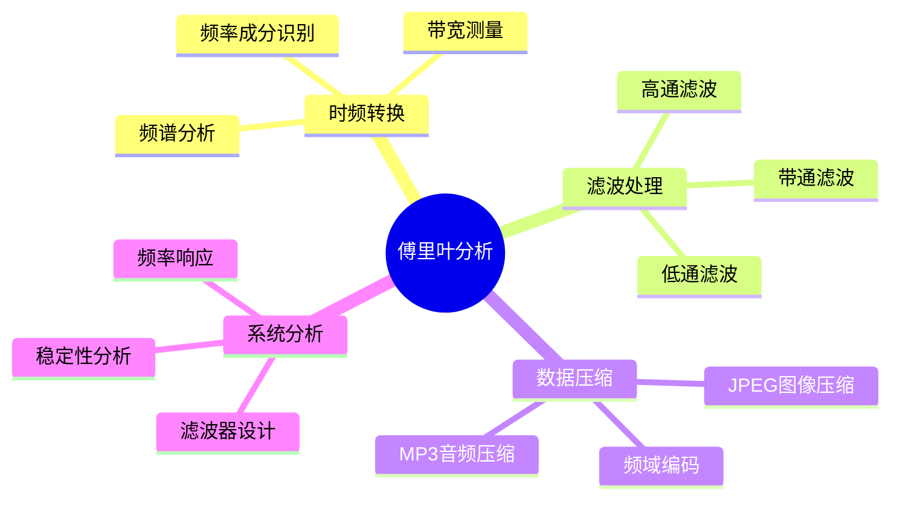
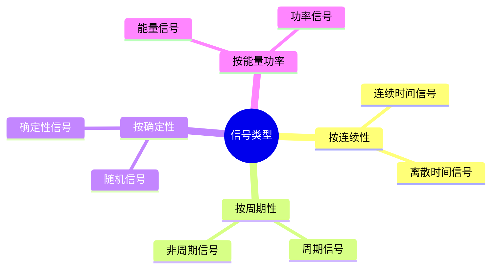

# 信号处理中的傅里叶分析

> 傅里叶分析是信号处理的数学基础，通过将信号分解为不同频率的正弦分量，实现滤波、频谱分析、压缩等核心功能。

---

## 一、问题背景

### 1.1 信号处理的应用领域

| 领域 | 应用 | 典型信号 |
|-----|------|---------|
| 通信系统 | 调制解调、信道均衡 | 射频信号、基带信号 |
| 音频处理 | 降噪、均衡、压缩 | 语音、音乐 |
| 图像处理 | 压缩、增强、特征提取 | 图像、视频 |
| 医学信号 | 心电图、脑电图分析 | ECG、EEG |
| 雷达系统 | 目标检测、成像 | 回波信号 |
| 地震勘探 | 地层成像 | 地震波 |

### 1.2 傅里叶分析的核心价值



---

## 二、数学模型建立

### 2.1 连续傅里叶变换

**定义：**

正变换：
$$X(f) = \mathcal{F}\{x(t)\} = \int_{-\infty}^{\infty} x(t) e^{-j2\pi ft} dt$$

逆变换：
$$x(t) = \mathcal{F}^{-1}\{X(f)\} = \int_{-\infty}^{\infty} X(f) e^{j2\pi ft} df$$

**基本性质：**

| 性质 | 时域 | 频域 |
|-----|------|------|
| 线性 | $ax_1(t) + bx_2(t)$ | $aX_1(f) + bX_2(f)$ |
| 时移 | $x(t-t_0)$ | $X(f)e^{-j2\pi ft_0}$ |
| 频移 | $x(t)e^{j2\pi f_0t}$ | $X(f-f_0)$ |
| 尺度 | $x(at)$ | $\frac{1}{|a|}X(\frac{f}{a})$ |
| 卷积 | $x_1(t) * x_2(t)$ | $X_1(f)X_2(f)$ |
| 乘积 | $x_1(t)x_2(t)$ | $X_1(f) * X_2(f)$ |

### 2.2 离散傅里叶变换(DFT)

**定义：**

$$X[k] = \sum_{n=0}^{N-1} x[n] e^{-j\frac{2\pi}{N}kn}, \quad k = 0, 1, ..., N-1$$

$$x[n] = \frac{1}{N}\sum_{k=0}^{N-1} X[k] e^{j\frac{2\pi}{N}kn}, \quad n = 0, 1, ..., N-1$$

**快速傅里叶变换(FFT)：**

复杂度从 $O(N^2)$ 降低到 $O(N\log N)$

### 2.3 信号模型分类



---

## 三、理论分析与推导

### 3.1 采样定理

**Nyquist-Shannon采样定理：**

若连续信号 $x(t)$ 的最高频率为 $f_{max}$，则当采样频率满足：

$$f_s > 2f_{max}$$

时，信号可以从采样值完全重建。

**混叠现象：**

当 $f_s < 2f_{max}$ 时，高频分量会"折叠"到低频区域，造成频谱重叠。

```python
import numpy as np
import matplotlib.pyplot as plt

def demonstrate_aliasing():
    """演示混叠现象"""
    
    # 原始信号频率
    f_true = 8  # Hz
    
    # 时间轴
    t_fine = np.linspace(0, 1, 1000)
    t_coarse = np.linspace(0, 1, 16)  # fs = 16 Hz < 2*8 = 16 Hz (临界)
    
    # 原始信号
    x_fine = np.sin(2 * np.pi * f_true * t_fine)
    x_coarse = np.sin(2 * np.pi * f_true * t_coarse)
    
    # 混叠信号（看起来是低频）
    f_alias = 16 - 8  # 混叠频率
    x_alias = np.sin(2 * np.pi * f_alias * t_fine)
    
    # 可视化
    fig, axes = plt.subplots(2, 1, figsize=(12, 6))
    
    # 时域
    axes[0].plot(t_fine, x_fine, 'b-', label=f'原始信号 (f={f_true}Hz)', alpha=0.7)
    axes[0].plot(t_fine, x_alias, 'r--', label=f'混叠信号 (f={f_alias}Hz)', alpha=0.7)
    axes[0].stem(t_coarse, x_coarse, linefmt='g-', markerfmt='go', basefmt=' ', label='采样点 (fs=16Hz)')
    axes[0].set_xlabel('时间 (s)')
    axes[0].set_ylabel('幅值')
    axes[0].set_title('混叠现象演示')
    axes[0].legend()
    axes[0].grid(True)
    
    # 频域
    N = 256
    x_sampled = np.sin(2 * np.pi * f_true * np.arange(N) / 32)
    X = np.fft.fft(x_sampled)
    freqs = np.fft.fftfreq(N, 1/32)
    
    axes[1].stem(freqs[:N//2], np.abs(X)[:N//2], basefmt=' ')
    axes[1].set_xlabel('频率 (Hz)')
    axes[1].set_ylabel('|X(f)|')
    axes[1].set_title('混叠后的频谱')
    axes[1].grid(True)
    
    plt.tight_layout()
    plt.savefig('aliasing_demo.png', dpi=150)
    plt.show()

demonstrate_aliasing()
```

### 3.2 窗函数与频谱泄漏

**问题来源：**

有限长采样等效于加矩形窗，时域乘积对应频域卷积，导致频谱展宽（泄漏）。

**常用窗函数：**

| 窗函数 | 主瓣宽度 | 旁瓣衰减 | 适用场景 |
|-------|---------|---------|---------|
| 矩形窗 | $2\Delta f$ | -13 dB | 频率分辨率高 |
| Hanning | $4\Delta f$ | -31 dB | 一般用途 |
| Hamming | $4\Delta f$ | -41 dB | 语音处理 |
| Blackman | $6\Delta f$ | -57 dB | 弱信号检测 |
| Kaiser | 可调 | 可调 | 灵活设计 |

### 3.3 数字滤波器设计

**FIR滤波器：**

$$y[n] = \sum_{k=0}^{N-1} h[k] x[n-k]$$

**IIR滤波器：**

$$y[n] = \sum_{k=0}^{N} b_k x[n-k] - \sum_{k=1}^{M} a_k y[n-k]$$

**设计方法对比：**

| 特性 | FIR | IIR |
|-----|-----|-----|
| 稳定性 | 无条件稳定 | 可能不稳定 |
| 线性相位 | 容易实现 | 难以实现 |
| 阶数 | 较高 | 较低 |
| 计算量 | 较大 | 较小 |
| 设计复杂度 | 简单 | 较复杂 |

---

## 四、数值实验

### 4.1 频谱分析与滤波

```python
import numpy as np
import matplotlib.pyplot as plt
from scipy import signal

def signal_analysis_demo():
    """信号频谱分析与滤波演示"""
    
    # 生成测试信号
    fs = 1000  # 采样频率
    t = np.arange(0, 1, 1/fs)
    
    # 信号成分
    f1, f2, f3 = 50, 120, 200  # Hz
    A1, A2, A3 = 1.0, 0.5, 0.3
    
    # 合成信号
    x_clean = A1 * np.sin(2*np.pi*f1*t) + A2 * np.sin(2*np.pi*f2*t) + A3 * np.sin(2*np.pi*f3*t)
    
    # 添加噪声
    noise = 0.5 * np.random.randn(len(t))
    x_noisy = x_clean + noise
    
    # 计算FFT
    N = len(t)
    X = np.fft.fft(x_noisy)
    freqs = np.fft.fftfreq(N, 1/fs)
    
    # 只取正频率部分
    X_pos = X[:N//2]
    freqs_pos = freqs[:N//2]
    
    # 设计滤波器 - 带通滤波器(保留50Hz和120Hz)
    nyquist = fs / 2
    low, high = 30 / nyquist, 150 / nyquist
    b, a = signal.butter(4, [low, high], btype='band')
    
    # 应用滤波器
    x_filtered = signal.filtfilt(b, a, x_noisy)
    
    # 可视化
    fig, axes = plt.subplots(3, 2, figsize=(14, 10))
    
    # 时域信号
    axes[0, 0].plot(t[:200], x_clean[:200], 'b-', label='原始信号')
    axes[0, 0].set_xlabel('时间 (s)')
    axes[0, 0].set_ylabel('幅值')
    axes[0, 0].set_title('原始信号')
    axes[0, 0].legend()
    axes[0, 0].grid(True)
    
    axes[0, 1].plot(t[:200], x_noisy[:200], 'r-', alpha=0.7, label='含噪信号')
    axes[0, 1].plot(t[:200], x_clean[:200], 'b--', alpha=0.7, label='原始信号')
    axes[0, 1].set_xlabel('时间 (s)')
    axes[0, 1].set_ylabel('幅值')
    axes[0, 1].set_title('含噪信号')
    axes[0, 1].legend()
    axes[0, 1].grid(True)
    
    # 频域分析
    axes[1, 0].stem(freqs_pos[:100], np.abs(X_pos)[:100], basefmt=' ')
    axes[1, 0].set_xlabel('频率 (Hz)')
    axes[1, 0].set_ylabel('|X(f)|')
    axes[1, 0].set_title('频谱（含噪）')
    axes[1, 0].grid(True)
    
    # 滤波器频率响应
    w, h = signal.freqz(b, a, worN=8000)
    axes[1, 1].plot((w/np.pi)*nyquist, 20*np.log10(np.abs(h)), 'b-')
    axes[1, 1].axvline(f1, color='r', linestyle='--', alpha=0.5, label='f1=50Hz')
    axes[1, 1].axvline(f2, color='g', linestyle='--', alpha=0.5, label='f2=120Hz')
    axes[1, 1].set_xlabel('频率 (Hz)')
    axes[1, 1].set_ylabel('增益 (dB)')
    axes[1, 1].set_title('带通滤波器频率响应')
    axes[1, 1].legend()
    axes[1, 1].grid(True)
    axes[1, 1].set_xlim([0, 250])
    
    # 滤波后信号
    axes[2, 0].plot(t[:200], x_filtered[:200], 'g-', label='滤波后')
    axes[2, 0].plot(t[:200], x_clean[:200], 'b--', alpha=0.5, label='原始信号')
    axes[2, 0].set_xlabel('时间 (s)')
    axes[2, 0].set_ylabel('幅值')
    axes[2, 0].set_title('滤波后信号（时域）')
    axes[2, 0].legend()
    axes[2, 0].grid(True)
    
    # 滤波后频谱
    X_filtered = np.fft.fft(x_filtered)
    axes[2, 1].stem(freqs_pos[:100], np.abs(X_filtered[:N//2])[:100], basefmt=' ', linefmt='g-')
    axes[2, 1].set_xlabel('频率 (Hz)')
    axes[2, 1].set_ylabel('|X(f)|')
    axes[2, 1].set_title('滤波后频谱')
    axes[2, 1].grid(True)
    
    plt.tight_layout()
    plt.savefig('signal_analysis.png', dpi=150)
    plt.show()
    
    # 计算SNR
    snr_before = 10 * np.log10(np.sum(x_clean**2) / np.sum((x_noisy - x_clean)**2))
    snr_after = 10 * np.log10(np.sum(x_clean**2) / np.sum((x_filtered - x_clean)**2))
    
    print(f"滤波前 SNR: {snr_before:.2f} dB")
    print(f"滤波后 SNR: {snr_after:.2f} dB")

signal_analysis_demo()
```

### 4.2 短时傅里叶变换(STFT)

```python
import numpy as np
import matplotlib.pyplot as plt
from scipy import signal

def stft_demo():
    """短时傅里叶变换演示 - 时频分析"""
    
    fs = 1000
    t = np.linspace(0, 2, 2*fs)
    
    # 生成非平稳信号（频率随时间变化）
    # 啁啾信号 + 瞬态脉冲
    f0, f1 = 10, 100
    chirp = signal.chirp(t, f0, t[-1], f1, method='linear')
    
    # 添加瞬态信号
    pulse_time = 1.0
    pulse_width = 0.05
    pulse = np.exp(-((t - pulse_time)/pulse_width)**2) * np.sin(2*np.pi*200*t)
    
    x = chirp + pulse
    
    # 计算STFT
    f, t_stft, Zxx = signal.stft(x, fs, nperseg=256, noverlap=200)
    
    # 可视化
    fig, axes = plt.subplots(3, 1, figsize=(12, 10))
    
    # 时域信号
    axes[0].plot(t, x, 'b-', linewidth=0.5)
    axes[0].set_xlabel('时间 (s)')
    axes[0].set_ylabel('幅值')
    axes[0].set_title('非平稳信号（啁啾+脉冲）')
    axes[0].grid(True)
    
    # 时频谱图
    im = axes[1].pcolormesh(t_stft, f, np.abs(Zxx), shading='gouraud', cmap='jet')
    axes[1].set_xlabel('时间 (s)')
    axes[1].set_ylabel('频率 (Hz)')
    axes[1].set_title('STFT时频谱图')
    axes[1].set_ylim([0, 250])
    plt.colorbar(im, ax=axes[1], label='幅值')
    
    # 与FFT对比（整个信号的平均频谱）
    X = np.fft.fft(x)
    freqs = np.fft.fftfreq(len(x), 1/fs)
    axes[2].plot(freqs[:len(freqs)//2], np.abs(X)[:len(freqs)//2], 'b-')
    axes[2].set_xlabel('频率 (Hz)')
    axes[2].set_ylabel('|X(f)|')
    axes[2].set_title('全局FFT频谱（丢失时域信息）')
    axes[2].set_xlim([0, 250])
    axes[2].grid(True)
    
    plt.tight_layout()
    plt.savefig('stft_analysis.png', dpi=150)
    plt.show()

stft_demo()
```

### 4.3 图像二维傅里叶变换

```python
import numpy as np
import matplotlib.pyplot as plt
from scipy import ndimage

def image_fourier_demo():
    """图像二维傅里叶变换演示"""
    
    # 创建测试图像
    size = 256
    x, y = np.meshgrid(np.arange(size), np.arange(size))
    
    # 合成图像：不同频率和方向的条纹
    image = np.zeros((size, size))
    image += np.sin(2*np.pi*x/32)  # 水平条纹
    image += np.sin(2*np.pi*y/16)  # 垂直条纹
    image += np.sin(2*np.pi*(x+y)/40)  # 对角条纹
    
    # 添加圆形
    center = size // 2
    radius = 50
    circle = ((x - center)**2 + (y - center)**2) < radius**2
    image = image * 0.5 + circle * 0.5
    
    # 二维FFT
    F = np.fft.fft2(image)
    Fshift = np.fft.fftshift(F)
    magnitude = np.log(1 + np.abs(Fshift))
    
    # 低通滤波
    # 创建圆形掩膜
    cutoff = 30
    H = np.sqrt((x - center)**2 + (y - center)**2) < cutoff
    F_filtered = Fshift * H
    image_filtered = np.real(np.fft.ifft2(np.fft.ifftshift(F_filtered)))
    
    # 高通滤波
    H_high = np.sqrt((x - center)**2 + (y - center)**2) > cutoff
    F_high = Fshift * H_high
    image_high = np.real(np.fft.ifft2(np.fft.ifftshift(F_high)))
    
    # 可视化
    fig, axes = plt.subplots(2, 3, figsize=(14, 9))
    
    # 原始图像
    axes[0, 0].imshow(image, cmap='gray')
    axes[0, 0].set_title('原始图像')
    axes[0, 0].axis('off')
    
    # 频谱
    axes[0, 1].imshow(magnitude, cmap='jet')
    axes[0, 1].set_title('频谱（对数尺度）')
    axes[0, 1].axis('off')
    
    # 低通滤波器
    axes[0, 2].imshow(H, cmap='gray')
    axes[0, 2].set_title(f'低通滤波器 (截止={cutoff})')
    axes[0, 2].axis('off')
    
    # 低通滤波结果
    axes[1, 0].imshow(image_filtered, cmap='gray')
    axes[1, 0].set_title('低通滤波结果')
    axes[1, 0].axis('off')
    
    # 高通滤波结果
    axes[1, 1].imshow(image_high, cmap='gray')
    axes[1, 1].set_title('高通滤波结果')
    axes[1, 1].axis('off')
    
    # 高通滤波器
    axes[1, 2].imshow(H_high, cmap='gray')
    axes[1, 2].set_title(f'高通滤波器 (截止={cutoff})')
    axes[1, 2].axis('off')
    
    plt.tight_layout()
    plt.savefig('image_fourier.png', dpi=150)
    plt.show()
    
    print("图像傅里叶变换分析完成")

image_fourier_demo()
```

---

## 五、模型结构流程图

```mermaid
flowchart TD
    A[连续信号x(t)] --> B{采样}
    B -->|fs > 2fmax| C[离散信号x[n]]
    B -->|fs ≤ 2fmax| D[混叠失真]
    
    C --> E[预处理]
    E --> E1[去趋势]
    E --> E2[加窗]
    E --> E3[归一化]
    
    E --> F[傅里叶变换]
    F --> F1[DFT/FFT]
    F --> F2[STFT]
    F --> F3[小波变换]
    
    F1 --> G[频域分析]
    G --> G1[频谱分析]
    G --> G2[滤波设计]
    G --> G3[特征提取]
    
    G2 --> H[滤波处理]
    H --> H1[低通滤波]
    H --> H2[高通滤波]
    H --> H3[带通滤波]
    
    H --> I[逆变换]
    I --> J[输出信号]
    
    G1 --> K[频谱解释]
    K --> K1[主频识别]
    K --> K2[带宽测量]
    K --> K3[谐波分析]
```

---

## 六、相关数学概念

- [傅里叶分析](../03-分析学/傅里叶分析.md) - 傅里叶变换理论基础
- [复分析](../03-分析学/复分析.md) - 频域分析的复数表示
- [线性代数](../02-代数学/线性代数基础.md) - DFT的矩阵表示
- [泛函分析](../03-分析学/泛函分析.md) - 函数空间的严格处理
- [信号与系统](../23-信息论/信号与系统.md) - 系统分析理论
- [数字信号处理](../23-信息论/数字信号处理.md) - 离散信号处理

---

> **工程实践提示**：
> - 采样频率应至少为信号最高频率的2.5-5倍（留安全裕度）
> - 窗函数选择需要在频率分辨率和频谱泄漏间权衡
> - FIR滤波器适合需要线性相位的应用
> - IIR滤波器适合计算资源受限的情况
> - STFT适合分析缓变非平稳信号，小波变换更适合瞬态信号
