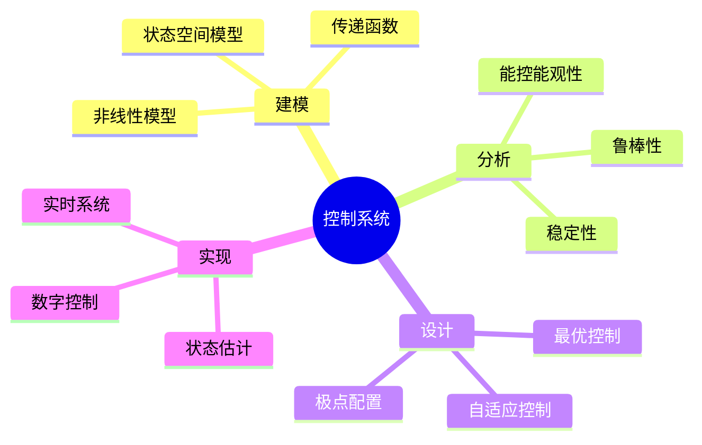
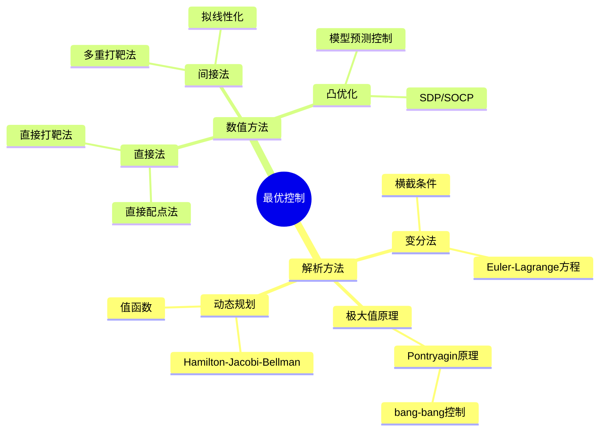
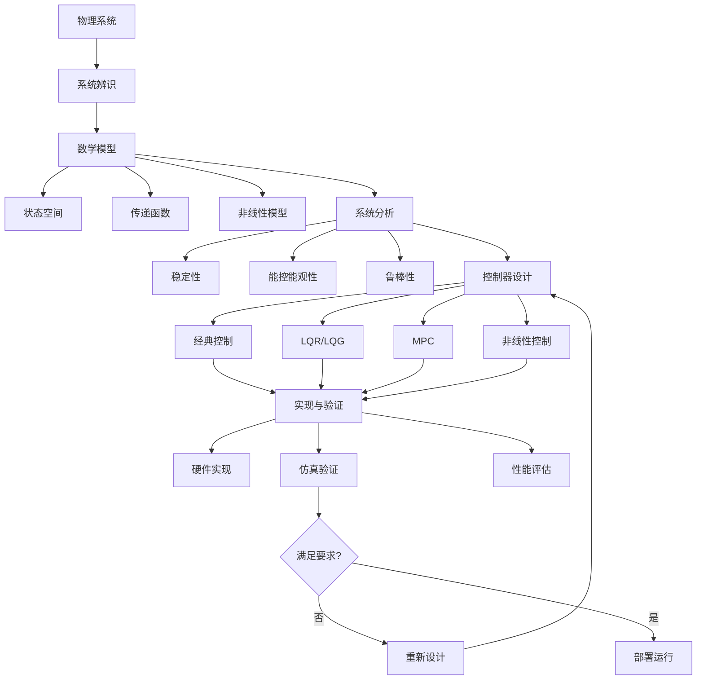

# 控制论与最优控制实例

> 控制论研究系统的调节与控制，最优控制则在满足约束条件下寻找使性能指标最优的控制策略，广泛应用于航天、机器人、过程控制等领域。

---

## 一、问题背景

### 1.1 控制系统的应用领域

| 领域 | 典型应用 | 控制目标 |
|-----|---------|---------|
| 航空航天 | 飞行器姿态控制、轨道转移 | 稳定性、精度、燃料最优 |
| 机器人 | 轨迹跟踪、力控制 | 快速响应、精确跟踪 |
| 过程工业 | 化工过程、电力系统 | 稳态优化、扰动抑制 |
| 自动驾驶 | 路径规划、车辆控制 | 安全性、舒适性 |
| 生物医学 | 人工心脏、药物输注 | 生命体征稳定 |

### 1.2 控制问题的数学本质



---

## 二、数学模型建立

### 2.1 状态空间表示

**连续时间线性系统：**

$$\dot{x}(t) = Ax(t) + Bu(t)$$
$$y(t) = Cx(t) + Du(t)$$

其中：
- $x \in \mathbb{R}^n$：状态向量
- $u \in \mathbb{R}^m$：控制输入
- $y \in \mathbb{R}^p$：输出
- $A, B, C, D$：系统矩阵

**离散时间系统：**

$$x_{k+1} = Ax_k + Bu_k$$
$$y_k = Cx_k + Du_k$$

### 2.2 最优控制问题

**Bolza问题：**

最小化性能指标：
$$J = \Phi(x(t_f), t_f) + \int_{t_0}^{t_f} L(x(t), u(t), t) dt$$

约束于：
$$\dot{x} = f(x, u, t), \quad x(t_0) = x_0$$

**常见性能指标：**

| 类型 | 数学形式 | 应用场景 |
|-----|---------|---------|
| 最短时间 | $\int dt$ | 紧急控制 |
| 最小能量 | $\int u^2 dt$ | 燃料/电力优化 |
| 跟踪误差 | $\int (x-x_d)^2 + ru^2 dt$ | 轨迹跟踪 |
| 终端约束 | $\Phi(x(t_f))$ | 精确到达目标 |

### 2.3 最优控制方法分类



---

## 三、理论分析与推导

### 3.1 线性二次调节器(LQR)

**问题描述：**

最小化：
$$J = \int_0^{\infty} (x^T Q x + u^T R u) dt$$

约束于：
$$\dot{x} = Ax + Bu$$

**最优解：**

状态反馈控制律：
$$u^* = -Kx = -R^{-1}B^T P x$$

其中 $P$ 满足代数Riccati方程：
$$A^T P + PA - PBR^{-1}B^T P + Q = 0$$

**Python实现：**

```python
import numpy as np
from scipy.linalg import solve_continuous_are, eig
import matplotlib.pyplot as plt

class LQRController:
    """线性二次调节器"""
    
    def __init__(self, A, B, Q, R):
        """
        A, B: 系统矩阵
        Q: 状态权重矩阵（半正定）
        R: 控制权重矩阵（正定）
        """
        self.A = A
        self.B = B
        self.Q = Q
        self.R = R
        
        # 求解代数Riccati方程
        self.P = solve_continuous_are(A, B, Q, R)
        
        # 计算最优增益
        self.K = np.linalg.solve(R, B.T @ self.P)
        
        # 闭环系统矩阵
        self.A_cl = A - B @ self.K
        
    def control(self, x):
        """计算最优控制输入"""
        return -self.K @ x
    
    def simulate(self, x0, t_span, dt=0.01):
        """仿真闭环系统响应"""
        t = np.arange(0, t_span, dt)
        n_steps = len(t)
        n_states = len(x0)
        
        x = np.zeros((n_steps, n_states))
        u = np.zeros((n_steps, self.B.shape[1]))
        
        x[0] = x0
        
        for i in range(n_steps - 1):
            u[i] = self.control(x[i])
            # Euler积分
            x[i+1] = x[i] + dt * (self.A @ x[i] + self.B @ u[i])
        
        u[-1] = self.control(x[-1])
        
        return t, x, u
    
    def analyze(self):
        """分析闭环系统特性"""
        eigenvalues = eig(self.A_cl)[0]
        
        print("=== LQR分析结果 ===")
        print(f"最优增益 K:\n{self.K}")
        print(f"\nRiccati方程解 P:\n{self.P}")
        print(f"\n闭环特征值:")
        for i, ev in enumerate(eigenvalues):
            print(f"  λ{i+1} = {ev:.4f}")
        print(f"\n闭环系统{'稳定' if np.all(np.real(eigenvalues) < 0) else '不稳定'}")
        
        return eigenvalues

# 示例：倒立摆控制
# 线性化后的倒立摆模型
m = 0.5  # 质量
l = 0.3  # 摆长
g = 9.81  # 重力加速度

# 状态: [角度, 角速度]
A = np.array([[0, 1],
              [g/l, 0]])
B = np.array([[0],
              [1/(m*l**2)]])

# 权重矩阵
Q = np.array([[10, 0],   # 角度误差权重
              [0, 1]])   # 角速度误差权重
R = np.array([[0.1]])    # 控制输入权重

# 创建LQR控制器
lqr = LQRController(A, B, Q, R)
eigenvalues = lqr.analyze()

# 仿真
x0 = np.array([np.pi/6, 0])  # 初始偏转30度
t, x, u = lqr.simulate(x0, t_span=5.0, dt=0.001)

# 可视化
fig, axes = plt.subplots(2, 1, figsize=(10, 8))

axes[0].plot(t, x[:, 0] * 180/np.pi, 'b-', label='角度')
axes[0].axhline(y=0, color='r', linestyle='--', alpha=0.5, label='目标')
axes[0].set_xlabel('时间 (s)')
axes[0].set_ylabel('角度 (度)')
axes[0].set_title('倒立摆角度响应')
axes[0].legend()
axes[0].grid(True)

axes[1].plot(t, u[:, 0], 'g-', label='控制力矩')
axes[1].set_xlabel('时间 (s)')
axes[1].set_ylabel('力矩 (N·m)')
axes[1].set_title('最优控制输入')
axes[1].legend()
axes[1].grid(True)

plt.tight_layout()
plt.savefig('lqr_response.png', dpi=150)
plt.show()
```

### 3.2 模型预测控制(MPC)

**基本思想：** 在每个采样时刻求解开环最优控制问题，但只执行第一个控制量，然后重新测量状态并重复优化。

**优化问题：**

$$\min_{u_0, ..., u_{N-1}} \sum_{k=0}^{N-1} (x_k^T Q x_k + u_k^T R u_k) + x_N^T P x_N$$

约束于：
$$x_{k+1} = Ax_k + Bu_k$$
$$x_k \in \mathcal{X}, \quad u_k \in \mathcal{U}$$

**Python实现（使用CVXPY）：**

```python
import numpy as np
import cvxpy as cp
import matplotlib.pyplot as plt

class MPCController:
    """线性MPC控制器"""
    
    def __init__(self, A, B, Q, R, P, N, x_min=None, x_max=None, u_min=None, u_max=None):
        """
        N: 预测时域
        x_min, x_max: 状态约束
        u_min, u_max: 输入约束
        """
        self.A = A
        self.B = B
        self.Q = Q
        self.R = R
        self.P = P
        self.N = N
        self.nx = A.shape[0]
        self.nu = B.shape[1]
        self.x_min = x_min
        self.x_max = x_max
        self.u_min = u_min
        self.u_max = u_max
        
    def solve(self, x0):
        """求解MPC优化问题"""
        # 决策变量
        x = cp.Variable((self.nx, self.N + 1))
        u = cp.Variable((self.nu, self.N))
        
        # 成本函数
        cost = 0
        for k in range(self.N):
            cost += cp.quad_form(x[:, k], self.Q) + cp.quad_form(u[:, k], self.R)
        cost += cp.quad_form(x[:, self.N], self.P)
        
        # 约束
        constraints = [x[:, 0] == x0]
        
        for k in range(self.N):
            # 动态约束
            constraints += [x[:, k+1] == self.A @ x[:, k] + self.B @ u[:, k]]
            
            # 状态约束
            if self.x_min is not None:
                constraints += [x[:, k] >= self.x_min]
            if self.x_max is not None:
                constraints += [x[:, k] <= self.x_max]
            
            # 输入约束
            if self.u_min is not None:
                constraints += [u[:, k] >= self.u_min]
            if self.u_max is not None:
                constraints += [u[:, k] <= self.u_max]
        
        # 求解
        problem = cp.Problem(cp.Minimize(cost), constraints)
        problem.solve()
        
        if problem.status == 'optimal':
            return u[:, 0].value, x.value, u.value
        else:
            print(f"MPC求解失败: {problem.status}")
            return None, None, None
    
    def simulate(self, x0, T, dt=0.01):
        """仿真MPC闭环系统"""
        n_steps = int(T / dt)
        x = np.zeros((n_steps + 1, self.nx))
        u = np.zeros((n_steps, self.nu))
        
        x[0] = x0
        
        for i in range(n_steps):
            u_opt, _, _ = self.solve(x[i])
            if u_opt is None:
                break
            u[i] = u_opt
            # 仿真一个步长（使用离散时间模型）
            x[i+1] = self.A @ x[i] + self.B @ u[i]
        
        t = np.arange(0, T + dt, dt)
        return t[:len(x)], x, u

# 示例：双积分器系统（位置控制）
dt = 0.1
A = np.array([[1, dt],
              [0, 1]])
B = np.array([[0.5*dt**2],
              [dt]])

Q = np.array([[1, 0],
              [0, 0.1]])
R = np.array([[0.1]])
P = Q  # 终端成本

N = 20  # 预测时域

# 约束
u_max = np.array([1.0])   # 最大加速度
u_min = np.array([-1.0])  # 最小加速度

mpc = MPCController(A, B, Q, R, P, N, u_min=u_min, u_max=u_max)

# 仿真
x0 = np.array([10, 0])  # 初始位置10，速度0
t, x, u = mpc.simulate(x0, T=10.0, dt=dt)

# 可视化
fig, axes = plt.subplots(3, 1, figsize=(10, 9))

axes[0].plot(t, x[:, 0], 'b-', label='位置')
axes[0].axhline(y=0, color='r', linestyle='--', alpha=0.5, label='目标')
axes[0].set_ylabel('位置')
axes[0].set_title('MPC轨迹跟踪')
axes[0].legend()
axes[0].grid(True)

axes[1].plot(t, x[:, 1], 'g-', label='速度')
axes[1].set_ylabel('速度')
axes[1].legend()
axes[1].grid(True)

axes[2].step(t[:-1], u[:, 0], 'r-', where='post', label='加速度')
axes[2].axhline(y=u_max[0], color='orange', linestyle='--', alpha=0.5, label='约束')
axes[2].axhline(y=u_min[0], color='orange', linestyle='--', alpha=0.5)
axes[2].set_xlabel('时间 (s)')
axes[2].set_ylabel('加速度')
axes[2].legend()
axes[2].grid(True)

plt.tight_layout()
plt.savefig('mpc_response.png', dpi=150)
plt.show()
```

### 3.3 Pontryagin极大值原理

**Hamilton函数：**

$$H(x, u, p, t) = L(x, u, t) + p^T f(x, u, t)$$

**最优性条件：**

1. **状态方程：** $\dot{x} = \frac{\partial H}{\partial p} = f(x, u, t)$
2. **协态方程：** $\dot{p} = -\frac{\partial H}{\partial x}$
3. **极值条件：** $H(x^*, u^*, p^*, t) \leq H(x^*, u, p^*, t), \quad \forall u \in \mathcal{U}$
4. **横截条件：** $p(t_f) = \frac{\partial \Phi}{\partial x(t_f)}$

**bang-bang控制示例：**

```python
import numpy as np
from scipy.integrate import solve_bvp
import matplotlib.pyplot as plt

def bang_bang_control():
    """最短时间控制问题 - bang-bang控制"""
    
    # 问题：双积分器系统，从初始状态到原点，最短时间
    # 系统：dx1/dt = x2, dx2/dt = u, |u| ≤ 1
    
    def ode(t, y):
        """状态与协态方程"""
        x1, x2, p1, p2 = y
        
        # bang-bang控制律
        u = -np.sign(p2)
        
        dx1 = x2
        dx2 = u
        dp1 = 0
        dp2 = -p1
        
        return np.vstack((dx1, dx2, dp1, dp2))
    
    def bc(ya, yb):
        """边界条件"""
        # 初始条件
        x1_0, x2_0 = 1, 0  # 从(1, 0)出发
        # 终端条件
        x1_f, x2_f = 0, 0  # 到达原点
        
        return np.array([
            ya[0] - x1_0,
            ya[1] - x2_0,
            yb[0] - x1_f,
            yb[1] - x2_f
        ])
    
    # 初始猜测
    t = np.linspace(0, 2, 100)
    y_guess = np.zeros((4, t.size))
    y_guess[0] = np.linspace(1, 0, t.size)
    
    # 求解边值问题
    sol = solve_bvp(ode, bc, t, y_guess, verbose=2)
    
    if sol.success:
        t_plot = np.linspace(0, sol.x[-1], 500)
        y_plot = sol.sol(t_plot)
        
        x1, x2, p1, p2 = y_plot
        u = -np.sign(p2)
        
        # 可视化
        fig, axes = plt.subplots(2, 2, figsize=(12, 8))
        
        # 状态轨迹
        axes[0, 0].plot(t_plot, x1, 'b-', label='x1 (位置)')
        axes[0, 0].plot(t_plot, x2, 'r-', label='x2 (速度)')
        axes[0, 0].set_xlabel('时间')
        axes[0, 0].set_ylabel('状态')
        axes[0, 0].set_title('状态响应')
        axes[0, 0].legend()
        axes[0, 0].grid(True)
        
        # 相平面
        axes[0, 1].plot(x1, x2, 'b-', linewidth=2)
        axes[0, 1].plot(x1[0], x2[0], 'go', markersize=10, label='初始')
        axes[0, 1].plot(x1[-1], x2[-1], 'r*', markersize=15, label='目标')
        axes[0, 1].set_xlabel('x1 (位置)')
        axes[0, 1].set_ylabel('x2 (速度)')
        axes[0, 1].set_title('相轨迹')
        axes[0, 1].legend()
        axes[0, 1].grid(True)
        
        # 控制输入
        axes[1, 0].plot(t_plot, u, 'g-', linewidth=2)
        axes[1, 0].set_xlabel('时间')
        axes[1, 0].set_ylabel('u')
        axes[1, 0].set_title('Bang-Bang控制输入')
        axes[1, 0].grid(True)
        axes[1, 0].set_ylim([-1.5, 1.5])
        
        # 协态变量
        axes[1, 1].plot(t_plot, p1, 'm-', label='p1')
        axes[1, 1].plot(t_plot, p2, 'c-', label='p2')
        axes[1, 1].set_xlabel('时间')
        axes[1, 1].set_ylabel('协态')
        axes[1, 1].set_title('协态变量')
        axes[1, 1].legend()
        axes[1, 1].grid(True)
        
        plt.tight_layout()
        plt.savefig('bang_bang_control.png', dpi=150)
        plt.show()
        
        print(f"最短时间: {sol.x[-1]:.4f}")
    else:
        print("求解失败")

bang_bang_control()
```

---

## 四、数值实验

### 4.1 鲁棒控制分析

```python
import numpy as np
from scipy.linalg import norm, eig
import matplotlib.pyplot as plt

def robustness_analysis():
    """控制系统鲁棒性分析"""
    
    # 标称系统
    A = np.array([[-1, 0.5],
                  [0, -2]])
    B = np.array([[1],
                  [1]])
    
    # LQR设计
    Q = np.eye(2)
    R = np.array([[1]])
    
    from scipy.linalg import solve_continuous_are
    P = solve_continuous_are(A, B, Q, R)
    K = np.linalg.solve(R, B.T @ P)
    A_cl = A - B @ K
    
    # 不确定性分析
    delta_range = np.linspace(-0.5, 0.5, 100)
    stable = []
    
    for delta in delta_range:
        # 参数摄动
        A_perturbed = A + delta * np.array([[1, 0], [0, 0]])
        A_cl_perturbed = A_perturbed - B @ K
        
        # 检查稳定性
        eigenvalues = eig(A_cl_perturbed)[0]
        is_stable = np.all(np.real(eigenvalues) < 0)
        stable.append(is_stable)
    
    # 计算鲁棒稳定裕度
    stable_deltas = delta_range[np.array(stable)]
    if len(stable_deltas) > 0:
        robust_margin = min(abs(stable_deltas[0]), abs(stable_deltas[-1]))
    else:
        robust_margin = 0
    
    # 可视化
    fig, ax = plt.subplots(figsize=(10, 6))
    
    ax.fill_between(delta_range, 0, 1, where=np.array(stable), 
                     alpha=0.3, color='green', label='稳定区域')
    ax.plot(delta_range, np.array(stable).astype(int), 'b-', linewidth=2)
    ax.axvline(x=0, color='r', linestyle='--', label='标称参数')
    ax.set_xlabel('参数摄动 δ')
    ax.set_ylabel('稳定性')
    ax.set_title(f'鲁棒稳定性分析 (稳定裕度: {robust_margin:.3f})')
    ax.legend()
    ax.grid(True)
    ax.set_ylim([-0.1, 1.1])
    
    plt.tight_layout()
    plt.savefig('robustness_analysis.png', dpi=150)
    plt.show()
    
    print(f"鲁棒稳定裕度: {robust_margin:.4f}")
    
    return robust_margin

robustness_analysis()
```

---

## 五、模型结构流程图



---

## 六、相关数学概念

- [微分方程](../05-微分方程/) - 系统动态模型
- [线性代数](../02-代数学/线性代数基础.md) - 状态空间方法
- [优化理论](../21-最优化/) - 最优控制求解
- [变分法](../10-应用数学/变分法.md) - 最优性条件
- [泛函分析](../03-分析学/泛函分析.md) - 无限维优化
- [数值分析](../07-数值分析/) - 数值求解方法

---

> **控制工程实践提示**：
> - 建模精度直接影响控制性能，需要在复杂度和精度间权衡
> - LQR适合线性系统，对于非线性系统可考虑线性化或反馈线性化
> - MPC可以显式处理约束，但计算量较大，需权衡预测时域长度
> - 实际系统存在不确定性，鲁棒控制设计很重要
> - 状态估计（Kalman滤波）在输出反馈控制中必不可少
