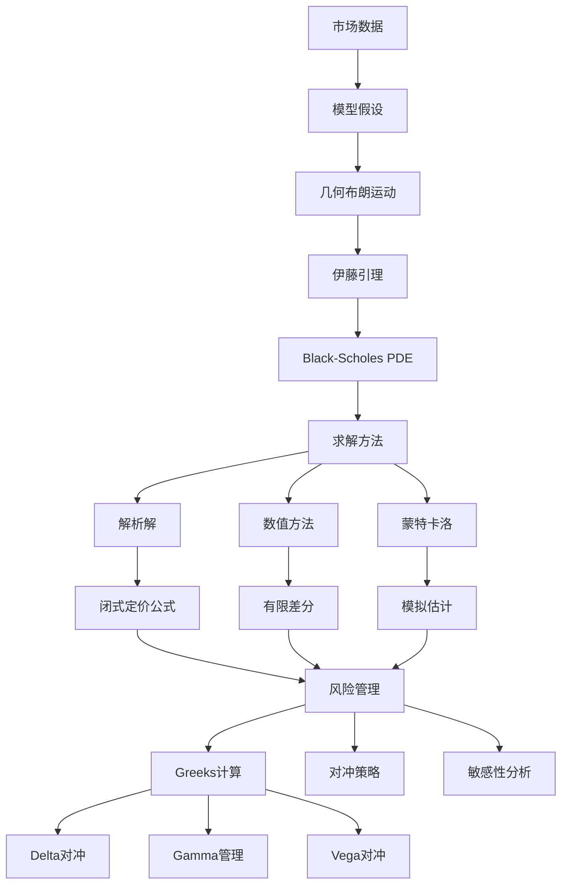

# 期权定价Black-Scholes模型详解

> Black-Scholes模型是现代金融工程的基石，通过随机微分方程和偏微分方程为欧式期权提供了闭式定价公式，彻底改变了衍生品定价和风险管理的方式。

---

## 一、问题背景

### 1.1 期权的基本概念

**期权**是一种金融衍生品，赋予持有者在特定时间以特定价格买入（看涨期权）或卖出（看跌期权）标的资产的权利。

| 期权类型 | 定义 | 收益函数 |
|---------|------|---------|
| 欧式看涨 | 到期日T以价格K买入 | $C = \max(S_T - K, 0)$ |
| 欧式看跌 | 到期日T以价格K卖出 | $P = \max(K - S_T, 0)$ |
| 美式看涨 | 到期前任何时间买入 | 路径依赖 |
| 美式看跌 | 到期前任何时间卖出 | 路径依赖 |

### 1.2 Black-Scholes的历史意义

- **1973年**：Black和Scholes发表论文
- **1997年**：Merton和Scholes获诺贝尔经济学奖
- **革命性影响**：
  - 为期权定价提供理论基础
  - 促进了期权市场的繁荣
  - 开创了金融数学的新纪元


---

## 二、数学模型建立

### 2.1 标的资产动态

**几何布朗运动(GBM)：**

$$dS_t = \mu S_t dt + \sigma S_t dW_t$$

其中：
- $S_t$：标的资产价格
- $\mu$：预期收益率（漂移项）
- $\sigma$：波动率
- $W_t$：标准布朗运动

**解析解：**

$$S_t = S_0 \exp\left[\left(\mu - \frac{\sigma^2}{2}\right)t + \sigma W_t\right]$$

**对数收益率服从正态分布：**

$$\ln(S_t/S_0) \sim N\left(\left(\mu - \frac{\sigma^2}{2}\right)t, \sigma^2 t\right)$$

### 2.2 Black-Scholes PDE

**推导思路：**
1. 构造包含期权和标的资产的无风险组合
2. 应用伊藤引理
3. 利用无套利条件

**Black-Scholes方程：**

$$\frac{\partial V}{\partial t} + \frac{1}{2}\sigma^2 S^2 \frac{\partial^2 V}{\partial S^2} + rS\frac{\partial V}{\partial S} - rV = 0$$

**边界条件（欧式看涨期权）：**
- 到期条件：$V(S, T) = \max(S - K, 0)$
- 边界条件：$V(0, t) = 0$, $V(S, t) \sim S$ 当 $S \to \infty$

### 2.3 风险中性定价

**核心思想：** 在风险中性测度 $\mathbb{Q}$ 下，所有资产的预期收益率都等于无风险利率 $r$。

**期权定价公式：**

$$V(S, t) = e^{-r(T-t)} \mathbb{E}^\mathbb{Q}[\text{Payoff}(S_T)]$$

---

## 三、理论分析与推导

### 3.1 Black-Scholes公式

**欧式看涨期权：**

$$C(S, t) = S N(d_1) - K e^{-r(T-t)} N(d_2)$$

其中：
$$d_1 = \frac{\ln(S/K) + (r + \sigma^2/2)(T-t)}{\sigma\sqrt{T-t}}$$
$$d_2 = d_1 - \sigma\sqrt{T-t}$$

**欧式看跌期权（通过Put-Call平价）：**

$$P(S, t) = K e^{-r(T-t)} N(-d_2) - S N(-d_1)$$

**Put-Call平价关系：**

$$C - P = S - K e^{-r(T-t)}$$

### 3.2 Greeks（敏感度分析）

| Greek | 定义 | 公式 | 意义 |
|-------|------|------|------|
| Delta ($\Delta$) | $\frac{\partial V}{\partial S}$ | $N(d_1)$ | 股价变化1单位，期权价值变化 |
| Gamma ($\Gamma$) | $\frac{\partial^2 V}{\partial S^2}$ | $\frac{N'(d_1)}{S\sigma\sqrt{T-t}}$ | Delta的变化率 |
| Theta ($\Theta$) | $\frac{\partial V}{\partial t}$ | $-\frac{SN'(d_1)\sigma}{2\sqrt{T-t}} - rKe^{-r(T-t)}N(d_2)$ | 时间衰减 |
| Vega | $\frac{\partial V}{\partial \sigma}$ | $S\sqrt{T-t}N'(d_1)$ | 波动率敏感度 |
| Rho ($\rho$) | $\frac{\partial V}{\partial r}$ | $K(T-t)e^{-r(T-t)}N(d_2)$ | 利率敏感度 |

### 3.3 Python实现

```python
import numpy as np
from scipy.stats import norm
import matplotlib.pyplot as plt

class BlackScholes:
    """Black-Scholes期权定价模型"""
    
    def __init__(self, S, K, T, r, sigma, q=0):
        """
        S: 标的资产现价
        K: 执行价格
        T: 到期时间（年）
        r: 无风险利率
        sigma: 波动率
        q: 连续红利收益率
        """
        self.S = S
        self.K = K
        self.T = T
        self.r = r
        self.sigma = sigma
        self.q = q
        
        # 计算d1和d2
        self.d1 = (np.log(S/K) + (r - q + 0.5*sigma**2)*T) / (sigma*np.sqrt(T))
        self.d2 = self.d1 - sigma*np.sqrt(T)
    
    def call_price(self):
        """欧式看涨期权价格"""
        return (self.S * np.exp(-self.q*self.T) * norm.cdf(self.d1) - 
                self.K * np.exp(-self.r*self.T) * norm.cdf(self.d2))
    
    def put_price(self):
        """欧式看跌期权价格"""
        return (self.K * np.exp(-self.r*self.T) * norm.cdf(-self.d2) - 
                self.S * np.exp(-self.q*self.T) * norm.cdf(-self.d1))
    
    def call_delta(self):
        """看涨期权Delta"""
        return np.exp(-self.q*self.T) * norm.cdf(self.d1)
    
    def put_delta(self):
        """看跌期权Delta"""
        return np.exp(-self.q*self.T) * (norm.cdf(self.d1) - 1)
    
    def gamma(self):
        """Gamma（看涨看跌相同）"""
        return (np.exp(-self.q*self.T) * norm.pdf(self.d1) / 
                (self.S * self.sigma * np.sqrt(self.T)))
    
    def call_theta(self):
        """看涨期权Theta（每日）"""
        theta = (-(self.S * np.exp(-self.q*self.T) * norm.pdf(self.d1) * self.sigma) / 
                 (2 * np.sqrt(self.T)) -
                 self.r * self.K * np.exp(-self.r*self.T) * norm.cdf(self.d2) +
                 self.q * self.S * np.exp(-self.q*self.T) * norm.cdf(self.d1))
        return theta / 365  # 转换为日Theta
    
    def vega(self):
        """Vega（波动率变化1%）"""
        return (self.S * np.exp(-self.q*self.T) * norm.pdf(self.d1) * 
                np.sqrt(self.T)) / 100
    
    def call_rho(self):
        """看涨期权Rho（利率变化1%）"""
        return (self.K * self.T * np.exp(-self.r*self.T) * 
                norm.cdf(self.d2)) / 100
    
    def implied_volatility(self, market_price, option_type='call', tol=1e-6, max_iter=100):
        """用牛顿法计算隐含波动率"""
        sigma = 0.2  # 初始猜测
        
        for i in range(max_iter):
            self.sigma = sigma
            self.d1 = (np.log(self.S/self.K) + (self.r - self.q + 0.5*sigma**2)*self.T) / (sigma*np.sqrt(self.T))
            self.d2 = self.d1 - sigma*np.sqrt(self.T)
            
            if option_type == 'call':
                price = self.call_price()
            else:
                price = self.put_price()
            
            diff = price - market_price
            
            if abs(diff) < tol:
                return sigma
            
            # Vega作为导数
            vega = self.S * np.exp(-self.q*self.T) * norm.pdf(self.d1) * np.sqrt(self.T)
            sigma = sigma - diff / vega
        
        return sigma

# 示例计算
bs = BlackScholes(S=100, K=100, T=1.0, r=0.05, sigma=0.2)

print("=== Black-Scholes 期权定价 ===")
print(f"参数: S={bs.S}, K={bs.K}, T={bs.T}, r={bs.r}, σ={bs.sigma}")
print(f"\n欧式看涨期权价格: ${bs.call_price():.4f}")
print(f"欧式看跌期权价格: ${bs.put_price():.4f}")
print(f"\n验证Put-Call平价: C-P={bs.call_price()-bs.put_price():.4f}, S-Ke^(-rT)={bs.S-bs.K*np.exp(-bs.r*bs.T):.4f}")
print(f"\n=== Greeks ===")
print(f"Call Delta: {bs.call_delta():.4f}")
print(f"Put Delta: {bs.put_delta():.4f}")
print(f"Gamma: {bs.gamma():.6f}")
print(f"Call Theta (每日): ${bs.call_theta():.4f}")
print(f"Vega (1%波动率): ${bs.vega():.4f}")
print(f"Call Rho (1%利率): ${bs.call_rho():.4f}")
```

### 3.4 蒙特卡洛模拟

```python
import numpy as np
import matplotlib.pyplot as plt

def monte_carlo_option_pricing(S0, K, T, r, sigma, n_simulations=100000, n_steps=252, option_type='call'):
    """
    用蒙特卡洛方法定价欧式期权
    """
    dt = T / n_steps
    
    # 生成随机路径
    Z = np.random.standard_normal((n_simulations, n_steps))
    
    # 计算股价路径
    S = np.zeros((n_simulations, n_steps + 1))
    S[:, 0] = S0
    
    for t in range(1, n_steps + 1):
        S[:, t] = S[:, t-1] * np.exp((r - 0.5 * sigma**2) * dt + sigma * np.sqrt(dt) * Z[:, t-1])
    
    # 到期收益
    if option_type == 'call':
        payoff = np.maximum(S[:, -1] - K, 0)
    else:
        payoff = np.maximum(K - S[:, -1], 0)
    
    # 折现
    price = np.exp(-r * T) * np.mean(payoff)
    std_error = np.exp(-r * T) * np.std(payoff) / np.sqrt(n_simulations)
    
    return price, std_error, S

# 与解析解对比
S0, K, T, r, sigma = 100, 100, 1.0, 0.05, 0.2

mc_price, mc_error, paths = monte_carlo_option_pricing(S0, K, T, r, sigma, n_simulations=100000)
bs_price = BlackScholes(S0, K, T, r, sigma).call_price()

print(f"\n=== 蒙特卡洛 vs 解析解 ===")
print(f"蒙特卡洛价格: ${mc_price:.4f} ± ${mc_error:.4f}")
print(f"BS解析解价格: ${bs_price:.4f}")
print(f"相对误差: {abs(mc_price-bs_price)/bs_price*100:.2f}%")

# 可视化路径
plt.figure(figsize=(10, 6))
for i in range(min(100, paths.shape[0])):
    plt.plot(paths[i], alpha=0.3, linewidth=0.5)
plt.axhline(y=K, color='r', linestyle='--', label=f'Strike K={K}')
plt.xlabel('时间步')
plt.ylabel('股价')
plt.title(f'蒙特卡洛模拟股价路径 (n={paths.shape[0]})')
plt.legend()
plt.grid(True)
plt.savefig('mc_paths.png', dpi=150)
plt.show()
```

---

## 四、数值实验

### 4.1 Greeks可视化分析

```python
import numpy as np
import matplotlib.pyplot as plt
from scipy.stats import norm

def plot_greeks_analysis():
    """可视化分析期权Greeks"""
    
    S_range = np.linspace(50, 150, 100)
    K = 100
    T = 1.0
    r = 0.05
    sigma = 0.2
    
    # 计算不同参数下的Greeks
    deltas_c, deltas_p, gammas, vegas, thetas = [], [], [], [], []
    
    for S in S_range:
        bs = BlackScholes(S, K, T, r, sigma)
        deltas_c.append(bs.call_delta())
        deltas_p.append(bs.put_delta())
        gammas.append(bs.gamma())
        vegas.append(bs.vega() * 100)  # 缩放以便观察
        thetas.append(bs.call_theta() * 100)  # 缩放
    
    fig, axes = plt.subplots(2, 2, figsize=(12, 10))
    
    # Delta
    axes[0, 0].plot(S_range, deltas_c, 'b-', label='Call Delta', linewidth=2)
    axes[0, 0].plot(S_range, deltas_p, 'r-', label='Put Delta', linewidth=2)
    axes[0, 0].axvline(x=K, color='g', linestyle='--', alpha=0.5, label=f'Strike K={K}')
    axes[0, 0].set_xlabel('股价 S')
    axes[0, 0].set_ylabel('Delta')
    axes[0, 0].set_title('Delta vs 股价')
    axes[0, 0].legend()
    axes[0, 0].grid(True)
    
    # Gamma
    axes[0, 1].plot(S_range, gammas, 'g-', linewidth=2)
    axes[0, 1].axvline(x=K, color='r', linestyle='--', alpha=0.5)
    axes[0, 1].set_xlabel('股价 S')
    axes[0, 1].set_ylabel('Gamma')
    axes[0, 1].set_title('Gamma vs 股价')
    axes[0, 1].grid(True)
    
    # Vega
    axes[1, 0].plot(S_range, vegas, 'm-', linewidth=2)
    axes[1, 0].axvline(x=K, color='r', linestyle='--', alpha=0.5)
    axes[1, 0].set_xlabel('股价 S')
    axes[1, 0].set_ylabel('Vega')
    axes[1, 0].set_title('Vega vs 股价')
    axes[1, 0].grid(True)
    
    # Theta
    axes[1, 1].plot(S_range, thetas, 'orange', linewidth=2)
    axes[1, 1].axvline(x=K, color='r', linestyle='--', alpha=0.5)
    axes[1, 1].set_xlabel('股价 S')
    axes[1, 1].set_ylabel('Theta (×100)')
    axes[1, 1].set_title('Theta vs 股价')
    axes[1, 1].grid(True)
    
    plt.suptitle('Black-Scholes Greeks分析', fontsize=14)
    plt.tight_layout()
    plt.savefig('greeks_analysis.png', dpi=150)
    plt.show()

plot_greeks_analysis()
```

### 4.2 波动率微笑

```python
def plot_volatility_smile():
    """绘制波动率微笑曲线"""
    
    # 假设市场数据
    S0 = 100
    strikes = np.linspace(80, 120, 20)
    T = 0.5
    r = 0.05
    
    # 假设的市场价格（模拟波动率微笑）
    np.random.seed(42)
    true_sigma = 0.2
    market_prices = []
    
    for K in strikes:
        # 模拟带有波动率偏斜的市场价格
        skew = 0.1 * ((K - S0) / 100) ** 2
        implied_sigma = true_sigma + skew
        bs = BlackScholes(S0, K, T, r, implied_sigma)
        market_prices.append(bs.call_price())
    
    # 反解隐含波动率
    implied_vols = []
    for K, market_price in zip(strikes, market_prices):
        bs = BlackScholes(S0, K, T, r, 0.2)
        iv = bs.implied_volatility(market_price, option_type='call')
        implied_vols.append(iv)
    
    # 可视化
    fig, axes = plt.subplots(1, 2, figsize=(14, 5))
    
    # 期权价格曲线
    axes[0].plot(strikes, market_prices, 'bo-', label='市场价格')
    axes[0].axvline(x=S0, color='r', linestyle='--', alpha=0.5, label='ATM')
    axes[0].set_xlabel('执行价格 K')
    axes[0].set_ylabel('期权价格')
    axes[0].set_title('期权价格 vs 执行价格')
    axes[0].legend()
    axes[0].grid(True)
    
    # 波动率微笑
    axes[1].plot(strikes, implied_vols, 'rs-', label='隐含波动率')
    axes[1].axvline(x=S0, color='g', linestyle='--', alpha=0.5, label='ATM')
    axes[1].axhline(y=true_sigma, color='orange', linestyle='--', alpha=0.5, label=f'ATM IV ≈ {true_sigma:.1%}')
    axes[1].set_xlabel('执行价格 K')
    axes[1].set_ylabel('隐含波动率')
    axes[1].set_title('波动率微笑')
    axes[1].legend()
    axes[1].grid(True)
    
    plt.tight_layout()
    plt.savefig('volatility_smile.png', dpi=150)
    plt.show()

plot_volatility_smile()
```

---

## 五、模型结构流程图



---

## 六、相关数学概念

- [随机微分方程](../06-概率统计/随机微分方程.md) - 资产价格建模
- [偏微分方程](../05-微分方程/偏微分方程.md) - Black-Scholes方程
- [概率论](../06-概率统计/) - 风险中性定价
- [数值分析](../07-数值分析/) - PDE数值求解
- [鞅论](../06-概率统计/鞅论.md) - 风险中性测度
- [伊藤微积分](../06-概率统计/随机分析.md) - 随机微积分基础

---

> **金融工程实践提示**：
> - Black-Scholes模型的假设（常数波动率、无摩擦市场）在现实中不完全成立
> - 波动率微笑现象表明需要更复杂的模型（如随机波动率模型）
> - Delta对冲需要频繁再平衡，交易成本不可忽视
> - 隐含波动率是市场情绪的重要指标
> - 模型风险是衍生品交易的重要考量因素
