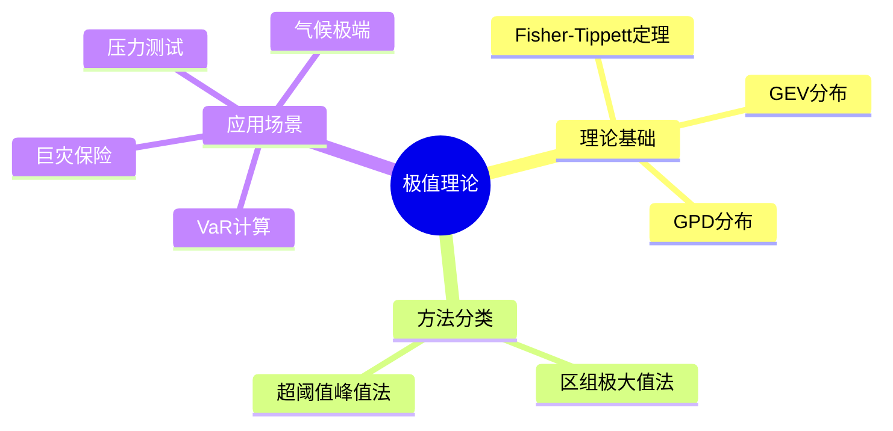
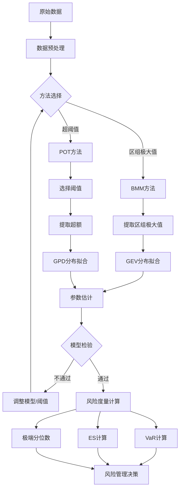

# 风险管理中的极值理论

> 极值理论(Extreme Value Theory, EVT)研究极端事件的概率分布，为金融风险管理提供了严格的数学框架，特别是在计算风险价值(VaR)和预期损失(ES)时具有独特优势。

---

## 一、问题背景

### 1.1 极端风险的重要性

| 极端事件 | 影响 | 管理需求 |
|---------|------|---------|
| 金融危机 | 系统性风险 | 资本充足率 |
| 自然灾害 | 保险赔付 | 巨灾准备金 |
| 市场崩盘 | 投资组合损失 | 风险限额 |
| 操作风险 | 重大损失 | 应急预案 |

### 1.2 传统方法的局限

**中心极限定理的不足：**
- 关注均值附近的分布
- 对尾部（极端事件）估计不足
- 正态分布假设低估极端损失

**极值理论的优势：**
- 专门建模尾部行为
- 基于极端数据而非全部数据
- 可外推超出样本范围的极端分位数



---

## 二、数学模型建立

### 2.1 极值类型定理

**Fisher-Tippett-Gnedenko定理：**

设 $X_1, X_2, ..., X_n$ 是i.i.d.随机变量，$M_n = \max(X_1, ..., X_n)$。若存在规范化常数 $a_n > 0$, $b_n$ 使得：

$$P\left(\frac{M_n - b_n}{a_n} \leq z\right) \to G(z), \quad n \to \infty$$

则 $G$ 必属于以下三种类型之一：

**Gumbel分布（类型I）：**
$$G(z) = \exp\left(-e^{-z}\right), \quad z \in \mathbb{R}$$

**Fréchet分布（类型II）：**
$$G(z) = \exp\left(-z^{-\alpha}\right), \quad z > 0, \alpha > 0$$

**Weibull分布（类型III）：**
$$G(z) = \exp\left(-(-z)^{\alpha}\right), \quad z < 0, \alpha > 0$$

### 2.2 广义极值分布(GEV)

统一表示：

$$G_{\xi,\mu,\sigma}(x) = \exp\left\{-\left[1 + \xi\frac{x-\mu}{\sigma}\right]^{-1/\xi}\right\}$$

其中：
- $\xi$：形状参数（极值指数）
- $\mu$：位置参数
- $\sigma$：尺度参数

**形状参数的意义：**
- $\xi > 0$：Fréchet型（厚尾，如金融收益）
- $\xi = 0$：Gumbel型（指数尾，如正态分布）
- $\xi < 0$：Weibull型（有限上界）

### 2.3 广义Pareto分布(GPD)

**超阈值峰值(POT)方法：**

设 $X$ 超过阈值 $u$，超额 $Y = X - u | X > u$ 服从：

$$H_{\xi,\sigma}(y) = 1 - \left(1 + \frac{\xi y}{\sigma}\right)^{-1/\xi}, \quad y \geq 0$$

**与GEV的关系：**
- 超过阈值的超额分布收敛于GPD
- 适用于高阈值数据
- 数据利用效率更高

---

## 三、理论分析与推导

### 3.1 VaR与ES计算

**风险价值(VaR)：**

$$\text{VaR}_\alpha = \inf\{x: P(X \leq x) \geq \alpha\}$$

**使用GPD计算：**

$$\text{VaR}_\alpha = u + \frac{\sigma}{\xi}\left[\left(\frac{1-\alpha}{\bar{F}(u)}\right)^{-\xi} - 1\right]$$

**预期损失(ES/Conditional VaR)：**

$$\text{ES}_\alpha = E[X | X > \text{VaR}_\alpha]$$

$$\text{ES}_\alpha = \frac{\text{VaR}_\alpha}{1-\xi} + \frac{\sigma - \xi u}{1-\xi}$$

### 3.2 Python实现

```python
import numpy as np
from scipy.optimize import minimize
from scipy.stats import genextreme, genpareto
import matplotlib.pyplot as plt

class ExtremeValueAnalysis:
    """极值分析类"""
    
    def __init__(self, data):
        """
        data: 观测数据（如负收益，确保极值为正）
        """
        self.data = np.array(data)
        self.n = len(data)
    
    def block_maxima(self, block_size=252):
        """
        区组极大值法
        block_size: 每个区组的观测数（如252个交易日/年）
        """
        n_blocks = self.n // block_size
        maxima = []
        
        for i in range(n_blocks):
            block = self.data[i*block_size:(i+1)*block_size]
            maxima.append(np.max(block))
        
        self.maxima = np.array(maxima)
        self.block_size = block_size
        return self.maxima
    
    def fit_gev(self):
        """拟合GEV分布"""
        if not hasattr(self, 'maxima'):
            raise ValueError("先调用block_maxima方法")
        
        # 使用scipy拟合
        shape, loc, scale = genextreme.fit(self.maxima)
        
        self.gev_params = {'shape': shape, 'loc': loc, 'scale': scale}
        return self.gev_params
    
    def plot_gev_fit(self):
        """可视化GEV拟合"""
        if not hasattr(self, 'gev_params'):
            self.fit_gev()
        
        fig, axes = plt.subplots(1, 2, figsize=(12, 5))
        
        # 直方图与拟合密度
        axes[0].hist(self.maxima, bins=15, density=True, alpha=0.7, label='观测数据')
        
        x = np.linspace(self.maxima.min(), self.maxima.max(), 100)
        pdf = genextreme.pdf(x, **self.gev_params)
        axes[0].plot(x, pdf, 'r-', linewidth=2, label='GEV拟合')
        axes[0].set_xlabel('区组极大值')
        axes[0].set_ylabel('密度')
        axes[0].set_title('GEV分布拟合')
        axes[0].legend()
        axes[0].grid(True)
        
        # QQ图
        theoretical = genextreme.ppf(np.linspace(0.01, 0.99, len(self.maxima)), **self.gev_params)
        sorted_data = np.sort(self.maxima)
        
        axes[1].scatter(theoretical, sorted_data, alpha=0.6)
        min_val = min(theoretical.min(), sorted_data.min())
        max_val = max(theoretical.max(), sorted_data.max())
        axes[1].plot([min_val, max_val], [min_val, max_val], 'r--', linewidth=2)
        axes[1].set_xlabel('理论分位数')
        axes[1].set_ylabel('样本分位数')
        axes[1].set_title('QQ图')
        axes[1].grid(True)
        
        plt.tight_layout()
        plt.savefig('gev_fit.png', dpi=150)
        plt.show()
    
    def pot_analysis(self, threshold_quantile=0.95):
        """
        超阈值峰值分析(POT)
        threshold_quantile: 阈值分位数
        """
        # 确定阈值
        self.threshold = np.percentile(self.data, threshold_quantile * 100)
        
        # 提取超额
        exceedances = self.data[self.data > self.threshold] - self.threshold
        self.exceedances = exceedances
        self.n_exceedances = len(exceedances)
        
        # 拟合GPD
        shape, loc, scale = genpareto.fit(exceedances, floc=0)
        self.gpd_params = {'shape': shape, 'loc': loc, 'scale': scale}
        
        return self.gpd_params, self.threshold
    
    def var_evt(self, confidence=0.99):
        """
        使用EVT计算VaR
        """
        if not hasattr(self, 'gpd_params'):
            raise ValueError("先调用pot_analysis方法")
        
        xi = self.gpd_params['shape']
        sigma = self.gpd_params['scale']
        u = self.threshold
        
        # 超过阈值的概率
        pu = self.n_exceedances / self.n
        
        # EVT VaR公式
        var = u + (sigma / xi) * (((1 - confidence) / pu) ** (-xi) - 1)
        
        return var
    
    def es_evt(self, confidence=0.99):
        """
        使用EVT计算预期损失(ES)
        """
        var = self.var_evt(confidence)
        xi = self.gpd_params['shape']
        sigma = self.gpd_params['scale']
        u = self.threshold
        
        # EVT ES公式
        es = var / (1 - xi) + (sigma - xi * u) / (1 - xi)
        
        return es

# 示例：股票收益极值分析
np.random.seed(42)

# 生成模拟收益数据（厚尾分布）
n_days = 2520  # 10年数据
returns = np.random.standard_t(5, n_days) * 0.02  # t分布，厚尾

# 使用负收益进行极值分析（关注损失端）
losses = -returns

evt = ExtremeValueAnalysis(losses)

# 区组极大值法
maxima = evt.block_maxima(block_size=252)
print(f"区组数: {len(maxima)}")
print(f"极大值均值: {np.mean(maxima):.4f}")
print(f"极大值标准差: {np.std(maxima):.4f}")

# 拟合GEV
gev_params = evt.fit_gev()
print(f"\nGEV参数:")
print(f"  形状参数 ξ: {gev_params['shape']:.4f}")
print(f"  位置参数 μ: {gev_params['loc']:.4f}")
print(f"  尺度参数 σ: {gev_params['scale']:.4f}")

evt.plot_gev_fit()

# POT分析
gpd_params, threshold = evt.pot_analysis(threshold_quantile=0.95)
print(f"\nPOT分析:")
print(f"  阈值: {threshold:.4f}")
print(f"  超过次数: {evt.n_exceedances}")
print(f"  GPD形状参数 ξ: {gpd_params['shape']:.4f}")
print(f"  GPD尺度参数 σ: {gpd_params['scale']:.4f}")

# 计算VaR和ES
confidence_levels = [0.95, 0.99, 0.999]
print(f"\n风险管理指标:")
print(f"{'置信度':<10} {'VaR':<12} {'ES':<12}")
print("-" * 34)

for conf in confidence_levels:
    var = evt.var_evt(conf)
    es = evt.es_evt(conf)
    print(f"{conf*100:.1f}%{'':<5} {var:.4f}{'':<5} {es:.4f}")

# 与传统方法对比
print(f"\n传统方法对比 (历史模拟):")
for conf in confidence_levels:
    var_hist = np.percentile(losses, conf * 100)
    print(f"  VaR@{conf*100:.0f}% = {var_hist:.4f}")
```

### 3.3 Hill估计量

```python
def hill_estimator(data, k):
    """
    Hill估计量 - 估计尾部指数
    data: 数据（已排序）
    k: 使用的极值个数
    """
    sorted_data = np.sort(data)[::-1]  # 降序排列
    
    # 取最大的k个观测值
    X_k = sorted_data[k-1]
    
    # Hill估计
    hill_sum = np.sum(np.log(sorted_data[:k] / X_k))
    xi = hill_sum / k
    
    return xi

def hill_plot(data, max_k=None):
    """
    绘制Hill图以选择适当的k值
    """
    sorted_data = np.sort(data)[::-1]
    n = len(sorted_data)
    
    if max_k is None:
        max_k = n // 10
    
    k_values = range(10, max_k)
    xi_estimates = [hill_estimator(data, k) for k in k_values]
    
    plt.figure(figsize=(10, 6))
    plt.plot(k_values, xi_estimates, 'b-', linewidth=1.5)
    plt.xlabel('k (极值个数)')
    plt.ylabel('Hill估计量 ξ')
    plt.title('Hill图 - 尾部指数估计')
    plt.grid(True)
    plt.savefig('hill_plot.png', dpi=150)
    plt.show()
    
    return k_values, xi_estimates

# Hill估计示例
k_vals, xi_vals = hill_plot(losses, max_k=200)
print(f"\nHill估计量（稳定区域均值）: ξ ≈ {np.mean(xi_vals[50:100]):.4f}")
```

---

## 四、数值实验

### 4.1 金融数据极值分析

```python
def comprehensive_evt_analysis():
    """综合极值分析示例"""
    
    np.random.seed(123)
    
    # 生成不同分布的数据
    n = 5000
    distributions = {
        '正态分布': np.random.normal(0, 1, n),
        't分布(ν=3)': np.random.standard_t(3, n),
        '指数分布': np.random.exponential(1, n)
    }
    
    fig, axes = plt.subplots(2, 3, figsize=(15, 10))
    axes = axes.flatten()
    
    for idx, (name, data) in enumerate(distributions.items()):
        # 标准化
        data = (data - np.mean(data)) / np.std(data)
        
        # EVT分析
        evt = ExtremeValueAnalysis(data)
        
        # POT分析
        gpd_params, threshold = evt.pot_analysis(threshold_quantile=0.95)
        
        # 绘制尾部分布
        exceedances_sorted = np.sort(evt.exceedances)
        empirical_survival = 1 - np.arange(1, len(exceedances_sorted)+1) / len(exceedances_sorted)
        
        # GPD理论生存函数
        xi = gpd_params['shape']
        sigma = gpd_params['scale']
        y_range = np.linspace(0, max(exceedances_sorted), 100)
        if xi != 0:
            gpd_survival = (1 + xi * y_range / sigma) ** (-1/xi)
        else:
            gpd_survival = np.exp(-y_range / sigma)
        
        ax = axes[idx]
        ax.loglog(exceedances_sorted, empirical_survival, 'bo', markersize=4, alpha=0.6, label='经验尾部')
        ax.loglog(y_range, gpd_survival, 'r-', linewidth=2, label='GPD拟合')
        ax.set_xlabel('超额')
        ax.set_ylabel('生存概率')
        ax.set_title(f'{name}\nξ = {xi:.3f}')
        ax.legend()
        ax.grid(True, which='both', linestyle='--', alpha=0.5)
    
    # 第4个图：VaR比较
    ax_var = axes[3]
    conf_levels = np.linspace(0.9, 0.999, 20)
    
    for name, data in distributions.items():
        data = (data - np.mean(data)) / np.std(data)
        evt = ExtremeValueAnalysis(data)
        evt.pot_analysis(threshold_quantile=0.95)
        
        vars_evt = [evt.var_evt(c) for c in conf_levels]
        ax_var.plot(conf_levels, vars_evt, label=name, linewidth=2)
    
    ax_var.set_xlabel('置信水平')
    ax_var.set_ylabel('VaR')
    ax_var.set_title('不同分布的VaR曲线')
    ax_var.legend()
    ax_var.grid(True)
    
    # 第5个图：形状参数对比
    ax_shape = axes[4]
    shapes = []
    names = []
    for name, data in distributions.items():
        data = (data - np.mean(data)) / np.std(data)
        evt = ExtremeValueAnalysis(data)
        evt.pot_analysis(threshold_quantile=0.95)
        shapes.append(evt.gpd_params['shape'])
        names.append(name)
    
    ax_shape.bar(names, shapes, color=['blue', 'orange', 'green'])
    ax_shape.axhline(y=0, color='r', linestyle='--')
    ax_shape.set_ylabel('形状参数 ξ')
    ax_shape.set_title('GPD形状参数对比')
    ax_shape.tick_params(axis='x', rotation=15)
    
    # 第6个图：说明
    ax_text = axes[5]
    ax_text.axis('off')
    text = """
    极值理论要点：
    
    1. GPD形状参数ξ：
       - ξ > 0：厚尾（Fréchet型）
       - ξ = 0：指数尾（Gumbel型）
       - ξ < 0：薄尾（Weibull型）
    
    2. 尾部指数：
       - ξ越大，尾部越厚
       - 极端事件概率越高
    
    3. 应用：
       - VaR/ES计算
       - 压力测试
       - 资本充足率
    """
    ax_text.text(0.1, 0.5, text, fontsize=11, verticalalignment='center', 
                 fontfamily='monospace', bbox=dict(boxstyle='round', facecolor='wheat', alpha=0.5))
    
    plt.tight_layout()
    plt.savefig('comprehensive_evt.png', dpi=150)
    plt.show()

comprehensive_evt_analysis()
```

---

## 五、模型结构流程图



---

## 六、相关数学概念

- [概率论](../06-概率统计/) - 极值分布理论
- [统计推断](../06-概率统计/统计推断.md) - 参数估计
- [随机过程](../06-概率统计/随机过程.md) - 极端事件建模
- [分位数回归](../06-概率统计/回归分析.md) - 条件风险度量
- [金融风险管理](../25-金融数学/金融风险管理.md) - 风险度量体系
- [重尾分布](../06-概率统计/重尾分布.md) - 极端事件统计特性

---

> **风险管理实践提示**：
> - EVT需要足够大的样本量，尤其是尾部数据
> - 阈值选择需要在偏差和方差间权衡（通常5%-10%的数据点）
> - 金融时间序列常有时变波动率，可考虑结合GARCH-EVT方法
> - EVT估计的极值外推存在模型风险，应结合情景分析
> - 压力测试应结合历史极端事件和EVT外推结果
