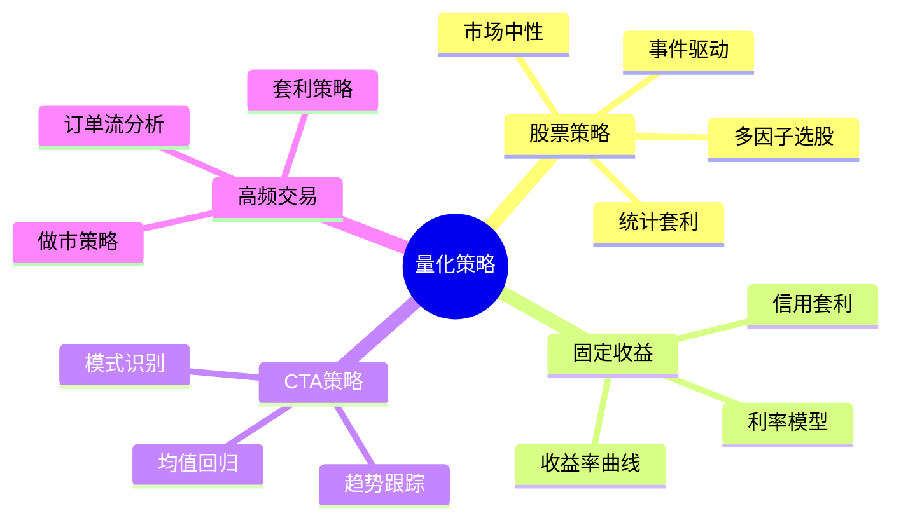
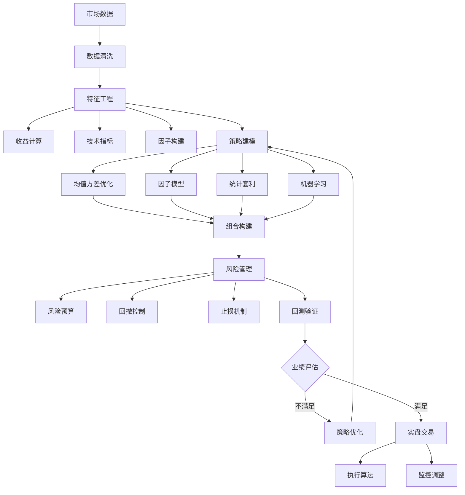

# 量化投资策略数学原理

> 量化投资运用数学模型和计算机算法进行投资决策，结合统计学、机器学习、优化理论等方法，在控制风险的前提下追求超额收益。

---

## 一、问题背景

### 1.1 量化投资的发展历程

| 阶段 | 时间 | 特征 |
|-----|------|------|
| 早期 | 1970s-1980s | 指数跟踪、简单套利 |
| 成熟期 | 1990s-2000s | 统计套利、因子模型 |
| 现代 | 2010s至今 | 机器学习、高频交易、另类数据 |

### 1.2 量化策略分类



---

## 二、数学模型建立

### 2.1 现代投资组合理论

**Markowitz均值-方差模型：**

最小化组合风险：
$$\min_w \quad w^T \Sigma w$$

约束于：
$$w^T \mu = R_{target}$$
$$\mathbf{1}^T w = 1$$

**有效前沿：**

```python
import numpy as np
from scipy.optimize import minimize
import matplotlib.pyplot as plt

class PortfolioOptimizer:
    """投资组合优化器"""
    
    def __init__(self, returns, cov_matrix, risk_free_rate=0.02):
        """
        returns: 预期收益率向量
        cov_matrix: 协方差矩阵
        risk_free_rate: 无风险利率
        """
        self.returns = returns
        self.cov_matrix = cov_matrix
        self.rf = risk_free_rate
        self.n_assets = len(returns)
        
    def portfolio_performance(self, weights):
        """计算组合收益和风险"""
        port_return = np.dot(weights, self.returns)
        port_std = np.sqrt(np.dot(weights.T, np.dot(self.cov_matrix, weights)))
        sharpe = (port_return - self.rf) / port_std
        return port_return, port_std, sharpe
    
    def min_variance_portfolio(self, allow_short=False):
        """最小方差组合"""
        constraints = [{'type': 'eq', 'fun': lambda x: np.sum(x) - 1}]
        bounds = [(None, None) if allow_short else (0, 1) for _ in range(self.n_assets)]
        
        result = minimize(lambda x: self.portfolio_performance(x)[1]**2,
                         x0=np.ones(self.n_assets)/self.n_assets,
                         method='SLSQP',
                         bounds=bounds,
                         constraints=constraints)
        return result.x
    
    def max_sharpe_portfolio(self, allow_short=False):
        """最大夏普比率组合"""
        def neg_sharpe(weights):
            return -self.portfolio_performance(weights)[2]
        
        constraints = [{'type': 'eq', 'fun': lambda x: np.sum(x) - 1}]
        bounds = [(None, None) if allow_short else (0, 1) for _ in range(self.n_assets)]
        
        result = minimize(neg_sharpe,
                         x0=np.ones(self.n_assets)/self.n_assets,
                         method='SLSQP',
                         bounds=bounds,
                         constraints=constraints)
        return result.x
    
    def efficient_frontier(self, n_points=50, allow_short=False):
        """计算有效前沿"""
        min_ret = np.min(self.returns)
        max_ret = np.max(self.returns)
        target_returns = np.linspace(min_ret, max_ret, n_points)
        
        efficient_portfolios = []
        
        for target in target_returns:
            constraints = [
                {'type': 'eq', 'fun': lambda x: np.sum(x) - 1},
                {'type': 'eq', 'fun': lambda x: np.dot(x, self.returns) - target}
            ]
            bounds = [(None, None) if allow_short else (0, 1) for _ in range(self.n_assets)]
            
            result = minimize(lambda x: self.portfolio_performance(x)[1]**2,
                            x0=np.ones(self.n_assets)/self.n_assets,
                            method='SLSQP',
                            bounds=bounds,
                            constraints=constraints)
            
            if result.success:
                efficient_portfolios.append(result.x)
        
        return efficient_portfolios
    
    def plot_efficient_frontier(self, n_points=50):
        """绘制有效前沿"""
        portfolios = self.efficient_frontier(n_points)
        
        risks = []
        rets = []
        for w in portfolios:
            r, s, _ = self.portfolio_performance(w)
            risks.append(s)
            rets.append(r)
        
        # 最大夏普组合
        w_sharpe = self.max_sharpe_portfolio()
        r_sharpe, s_sharpe, sharpe_sharpe = self.portfolio_performance(w_sharpe)
        
        # 最小方差组合
        w_minvar = self.min_variance_portfolio()
        r_minvar, s_minvar, _ = self.portfolio_performance(w_minvar)
        
        plt.figure(figsize=(10, 6))
        plt.plot(risks, rets, 'b-', linewidth=2, label='有效前沿')
        plt.scatter(s_sharpe, r_sharpe, marker='*', color='r', s=200, label=f'最大夏普 (SR={sharpe_sharpe:.2f})')
        plt.scatter(s_minvar, r_minvar, marker='o', color='g', s=100, label='最小方差')
        
        # 资本市场线
        x_cml = np.linspace(0, max(risks), 100)
        y_cml = self.rf + sharpe_sharpe * x_cml
        plt.plot(x_cml, y_cml, 'r--', alpha=0.5, label='资本市场线')
        
        plt.xlabel('风险 (标准差)')
        plt.ylabel('预期收益')
        plt.title('有效前沿与最优组合')
        plt.legend()
        plt.grid(True)
        plt.savefig('efficient_frontier.png', dpi=150)
        plt.show()

# 示例数据
np.random.seed(42)
n_assets = 5
returns = np.array([0.10, 0.12, 0.08, 0.15, 0.11])  # 预期年化收益

# 生成协方差矩阵
corr = np.random.uniform(-0.3, 0.8, (n_assets, n_assets))
corr = (corr + corr.T) / 2  # 对称化
np.fill_diagonal(corr, 1)
vols = np.array([0.15, 0.20, 0.12, 0.25, 0.18])
cov_matrix = np.outer(vols, vols) * corr

# 优化
optimizer = PortfolioOptimizer(returns, cov_matrix, risk_free_rate=0.02)
optimizer.plot_efficient_frontier()

# 输出最优组合
w_opt = optimizer.max_sharpe_portfolio()
print("最大夏普比率组合权重:")
for i, w in enumerate(w_opt):
    print(f"  资产{i+1}: {w:.2%}")
r, s, sr = optimizer.portfolio_performance(w_opt)
print(f"\n组合收益: {r:.2%}")
print(f"组合风险: {s:.2%}")
print(f"夏普比率: {sr:.3f}")
```

### 2.2 多因子模型

**Fama-French三因子模型：**

$$R_i - R_f = \alpha_i + \beta_i^{MKT}(R_M - R_f) + \beta_i^{SMB}SMB + \beta_i^{HML}HML + \epsilon_i$$

**因子定义：**
- **MKT**：市场因子（市场组合超额收益）
- **SMB** (Small Minus Big)：规模因子（小市值-大市值）
- **HML** (High Minus Low)：价值因子（高账面市值比-低账面市值比）

**五因子模型扩展：**
添加盈利因子(RMW)和投资因子(CMA)

### 2.3 均值回归策略

**Ornstein-Uhlenbeck过程：**

$$dx_t = \theta(\mu - x_t)dt + \sigma dW_t$$

**半衰期：**

$$\tau_{1/2} = \frac{\ln 2}{\theta}$$

```python
class MeanReversionStrategy:
    """均值回归策略"""
    
    def __init__(self, price_series):
        self.prices = price_series
        self.returns = np.diff(np.log(price_series))
    
    def estimate_ou_params(self):
        """估计Ornstein-Uhlenbeck参数"""
        x = self.prices[:-1]
        y = self.prices[1:]
        
        # 回归: y = a + b*x
        n = len(x)
        b = (n*np.sum(x*y) - np.sum(x)*np.sum(y)) / (n*np.sum(x**2) - np.sum(x)**2)
        a = (np.sum(y) - b*np.sum(x)) / n
        
        # OU参数
        dt = 1  # 假设日数据
        theta = -np.log(b) / dt
        mu = a / (1 - b)
        sigma_ou = np.std(y - a - b*x) * np.sqrt(2*theta / (1 - b**2))
        
        # 半衰期
        half_life = np.log(2) / theta if theta > 0 else np.inf
        
        return {
            'theta': theta,
            'mu': mu,
            'sigma': sigma_ou,
            'half_life': half_life
        }
    
    def generate_signals(self, entry_z=2, exit_z=0.5):
        """生成交易信号"""
        params = self.estimate_ou_params()
        mu = params['mu']
        sigma = params['sigma']
        
        # Z-score
        z_scores = (self.prices - mu) / sigma
        
        signals = np.zeros(len(z_scores))
        position = 0
        
        for i in range(len(z_scores)):
            if position == 0:
                if z_scores[i] > entry_z:  # 超卖，做多
                    position = 1
                    signals[i] = 1
                elif z_scores[i] < -entry_z:  # 超买，做空
                    position = -1
                    signals[i] = -1
            elif position == 1:
                if z_scores[i] < exit_z:  # 平仓
                    position = 0
                    signals[i] = 0
                else:
                    signals[i] = 1
            elif position == -1:
                if z_scores[i] > -exit_z:  # 平仓
                    position = 0
                    signals[i] = 0
                else:
                    signals[i] = -1
        
        return signals, z_scores, params
```

---

## 三、理论分析与推导

### 3.1 资本资产定价模型(CAPM)

**理论关系：**

$$E[R_i] = R_f + \beta_i (E[R_M] - R_f)$$

$$\beta_i = \frac{\text{Cov}(R_i, R_M)}{\text{Var}(R_M)}$$

**Python实现：**

```python
import numpy as np
from scipy import stats
import pandas as pd

class CAPMAnalysis:
    """CAPM分析"""
    
    def __init__(self, stock_returns, market_returns, risk_free_rate=0.02):
        self.stock = stock_returns
        self.market = market_returns
        self.rf = risk_free_rate
        
    def calculate_beta(self):
        """计算Beta系数"""
        # 超额收益
        stock_excess = self.stock - self.rf/252  # 假设日数据
        market_excess = self.market - self.rf/252
        
        # 回归估计Beta
        slope, intercept, r_value, p_value, std_err = stats.linregress(market_excess, stock_excess)
        
        return {
            'beta': slope,
            'alpha': intercept,
            'r_squared': r_value**2,
            'p_value': p_value
        }
    
    def expected_return(self, market_return):
        """计算预期收益"""
        beta = self.calculate_beta()['beta']
        return self.rf + beta * (market_return - self.rf)
    
    def security_market_line(self, market_returns_range):
        """证券市场线"""
        beta = self.calculate_beta()['beta']
        return [self.rf + beta * (mr - self.rf) for mr in market_returns_range]

# 示例：生成模拟数据
np.random.seed(42)
n_days = 252

# 市场收益
market_ret = np.random.normal(0.0005, 0.015, n_days)  # 日收益

# 股票收益 (Beta = 1.2)
stock_ret = 0.0002 + 1.2 * market_ret + np.random.normal(0, 0.008, n_days)

capm = CAPMAnalysis(stock_ret, market_ret)
results = capm.calculate_beta()

print("CAPM分析结果:")
print(f"  Beta: {results['beta']:.3f}")
print(f"  Alpha (日): {results['alpha']:.6f}")
print(f"  Alpha (年化): {results['alpha']*252:.2%}")
print(f"  R²: {results['r_squared']:.3f}")
print(f"  P值: {results['p_value']:.4f}")
```

### 3.2 风险平价策略

**风险贡献均衡：**

$$RC_i = \frac{w_i (\Sigma w)_i}{w^T \Sigma w} = \frac{1}{n}$$

**优化目标：**

$$\min_w \sum_{i=1}^n \left(w_i (\Sigma w)_i - \frac{w^T \Sigma w}{n}\right)^2$$

```python
class RiskParity:
    """风险平价策略"""
    
    def __init__(self, cov_matrix):
        self.cov = cov_matrix
        self.n = cov_matrix.shape[0]
    
    def risk_contribution(self, weights):
        """计算各资产风险贡献"""
        port_var = weights.T @ self.cov @ weights
        marginal_risk = self.cov @ weights
        rc = weights * marginal_risk / port_var
        return rc
    
    def optimize(self):
        """优化风险平价组合"""
        target_rc = np.ones(self.n) / self.n
        
        def objective(w):
            rc = self.risk_contribution(w)
            return np.sum((rc - target_rc)**2)
        
        constraints = {'type': 'eq', 'fun': lambda w: np.sum(w) - 1}
        bounds = [(0, 1) for _ in range(self.n)]
        
        result = minimize(objective,
                         x0=np.ones(self.n)/self.n,
                         method='SLSQP',
                         bounds=bounds,
                         constraints=constraints)
        
        return result.x
```

---

## 四、数值实验

### 4.1 配对交易策略

```python
import numpy as np
import matplotlib.pyplot as plt
from scipy import stats

class PairsTrading:
    """配对交易策略"""
    
    def __init__(self, stock_a, stock_b):
        self.a = stock_a
        self.b = stock_b
    
    def cointegration_test(self):
        """协整检验"""
        # 简化版：检验残差平稳性
        slope, intercept, r_value, p_value, std_err = stats.linregress(self.b, self.a)
        spread = self.a - (intercept + slope * self.b)
        
        # 计算半衰期（OU过程）
        spread_lag = spread[:-1]
        spread_diff = np.diff(spread)
        
        beta, alpha = np.polyfit(spread_lag, spread_diff, 1)
        half_life = -np.log(2) / beta if beta < 0 else np.inf
        
        return {
            'hedge_ratio': slope,
            'intercept': intercept,
            'half_life': half_life,
            'spread': spread,
            'correlation': r_value
        }
    
    def generate_signals(self, entry_threshold=2, exit_threshold=0.5):
        """生成交易信号"""
        coint = self.cointegration_test()
        spread = coint['spread']
        
        # 标准化
        z_score = (spread - np.mean(spread)) / np.std(spread)
        
        signals = np.zeros(len(z_score))
        position = 0
        
        for i in range(1, len(z_score)):
            if position == 0:
                if z_score[i] > entry_threshold:
                    signals[i] = -1  # 做空价差
                    position = -1
                elif z_score[i] < -entry_threshold:
                    signals[i] = 1   # 做多价差
                    position = 1
            elif position == 1 and z_score[i] > -exit_threshold:
                position = 0
            elif position == -1 and z_score[i] < exit_threshold:
                position = 0
            else:
                signals[i] = position
        
        return signals, z_score, coint
    
    def backtest(self, signals):
        """简单回测"""
        coint = self.cointegration_test()
        hedge_ratio = coint['hedge_ratio']
        
        # 计算组合收益
        returns_a = np.diff(self.a) / self.a[:-1]
        returns_b = np.diff(self.b) / self.b[:-1]
        
        # 配对收益 (做多A，做空B)
        pair_returns = returns_a - hedge_ratio * returns_b
        
        # 策略收益
        strategy_returns = signals[1:] * pair_returns
        cumulative = np.cumprod(1 + strategy_returns)
        
        return strategy_returns, cumulative

# 示例：生成配对数据
np.random.seed(42)
n_days = 500
t = np.arange(n_days)

# 协整关系
common_factor = np.cumsum(np.random.normal(0, 0.01, n_days))
stock_a = 100 * np.exp(0.001*t + common_factor + np.random.normal(0, 0.02, n_days))
stock_b = 100 * np.exp(0.0008*t + 0.8*common_factor + np.random.normal(0, 0.025, n_days))

# 策略分析
pairs = PairsTrading(stock_a, stock_b)
signals, z_score, coint = pairs.generate_signals()
strategy_ret, cumulative = pairs.backtest(signals)

print("配对交易分析:")
print(f"  对冲比率: {coint['hedge_ratio']:.3f}")
print(f"  相关系数: {coint['correlation']:.3f}")
print(f"  半衰期: {coint['half_life']:.1f} 天")
print(f"  策略年化收益: {np.mean(strategy_ret)*252:.2%}")
print(f"  策略年化波动: {np.std(strategy_ret)*np.sqrt(252):.2%}")

# 可视化
fig, axes = plt.subplots(3, 1, figsize=(12, 10))

# 股价
axes[0].plot(stock_a, label='Stock A')
axes[0].plot(stock_b, label='Stock B')
axes[0].set_ylabel('价格')
axes[0].set_title('配对股票价格')
axes[0].legend()
axes[0].grid(True)

# Z-score和信号
axes[1].plot(z_score, 'b-', label='Z-score')
axes[1].axhline(y=2, color='r', linestyle='--', alpha=0.5)
axes[1].axhline(y=-2, color='r', linestyle='--', alpha=0.5)
axes[1].axhline(y=0.5, color='g', linestyle='--', alpha=0.5)
axes[1].axhline(y=-0.5, color='g', linestyle='--', alpha=0.5)
axes[1].set_ylabel('Z-score')
axes[1].set_title('交易信号生成')
axes[1].legend()
axes[1].grid(True)

# 累计收益
axes[2].plot(cumulative, 'g-', linewidth=2)
axes[2].set_xlabel('时间')
axes[2].set_ylabel('累计收益')
axes[2].set_title('策略累计收益')
axes[2].grid(True)

plt.tight_layout()
plt.savefig('pairs_trading.png', dpi=150)
plt.show()
```

### 4.2 动量策略回测

```python
def momentum_backtest(returns, lookback=252, hold=63):
    """
    简单动量策略回测
    lookback: 回看期
    hold: 持有期
    """
    n_periods = len(returns) // hold
    portfolio_returns = []
    
    for i in range(n_periods - 1):
        start = i * hold
        end = start + lookback
        
        if end >= len(returns):
            break
        
        # 计算动量（过去收益）
        momentum = np.sum(returns[start:end])
        
        # 简单规则：正动量持有，负动空仓
        signal = 1 if momentum > 0 else 0
        
        # 持有期收益
        hold_return = np.sum(returns[end:end+hold])
        portfolio_returns.append(signal * hold_return)
    
    return np.array(portfolio_returns)

# 示例
momentum_returns = momentum_backtest(market_ret)
print(f"\n动量策略年化收益: {np.mean(momentum_returns)*4:.2%}")
print(f"动量策略胜率: {np.mean(momentum_returns > 0):.2%}")
```

---

## 五、模型结构流程图



---

## 六、相关数学概念

- [概率统计](../06-概率统计/) - 收益率建模
- [优化理论](../21-最优化/) - 组合优化
- [时间序列分析](../06-概率统计/时间序列分析.md) - 收益预测
- [随机过程](../06-概率统计/随机过程.md) - 价格动态
- [机器学习](../29-数据科学/) - 模式识别
- [金融风险管理](../25-金融数学/金融风险管理.md) - 风险控制

---

> **量化投资实践提示**：
> - 过拟合是量化策略的主要风险，需进行样本外测试
> - 交易成本会显著影响策略收益，需在回测中考虑
> - 市场结构变化可能导致策略失效，需持续监控
> - 多策略组合可降低单一策略风险
> - 严格执行风险管理纪律是长期生存的关键
