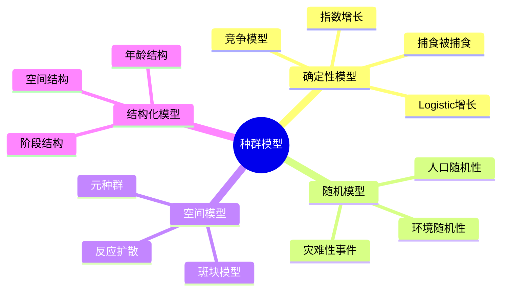
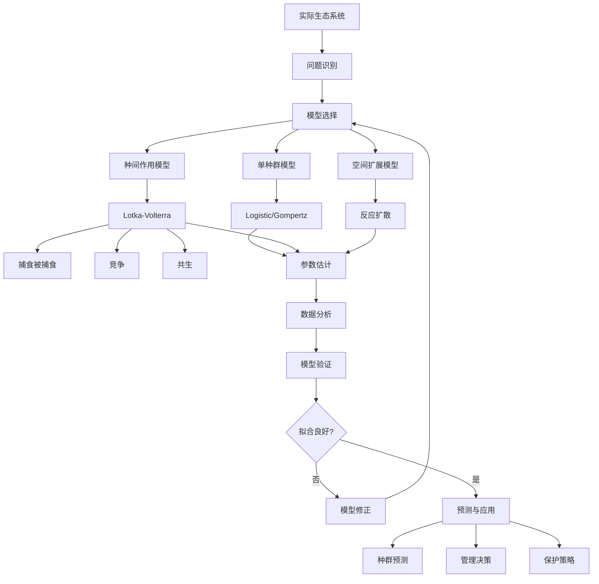

# 种群动力学模型

> 种群动力学研究生物种群数量随时间的变化规律，是数学生态学的核心内容，在生态保护、渔业管理、病虫害控制等领域有广泛应用。

---

## 一、问题背景

### 1.1 研究意义

| 应用领域 | 具体问题 | 数学工具 |
|---------|---------|---------|
| 生态保护 | 濒危物种保护策略 | 随机种群模型 |
| 渔业管理 | 最优捕捞配额 | 最优控制理论 |
| 农业害虫 | 生物防治策略 | 捕食-被捕食模型 |
| 传染病 | 疫情预测与控制 | SIR模型族 |
| 入侵物种 | 扩散与控制 | 反应-扩散方程 |

### 1.2 模型分类



---

## 二、数学模型建立

### 2.1 单种群模型

**指数增长模型(Malthus, 1798)：**

$$\frac{dN}{dt} = rN$$

解：$N(t) = N_0 e^{rt}$

**Logistic增长模型(Verhulst, 1838)：**

$$\frac{dN}{dt} = rN\left(1 - \frac{N}{K}\right)$$

其中：
- $r$：内禀增长率
- $K$：环境容纳量（carrying capacity）

**解析解：**

$$N(t) = \frac{K}{1 + \left(\frac{K-N_0}{N_0}\right)e^{-rt}}$$

**Gompertz增长模型：**

$$\frac{dN}{dt} = rN\ln\left(\frac{K}{N}\right)$$

适用于肿瘤生长等场景。

### 2.2 多种群相互作用模型

**Lotka-Volterra捕食-被捕食模型(1925-1926)：**

$$\frac{dx}{dt} = ax - bxy$$
$$\frac{dy}{dt} = -cy + dxy$$

其中：
- $x$：猎物（prey）数量
- $y$：捕食者（predator）数量
- $a$：猎物自然增长率
- $b$：捕食率
- $c$：捕食者死亡率
- $d$：捕食转化为捕食者增长的效率

**竞争模型：**

$$\frac{dN_1}{dt} = r_1N_1\left(1 - \frac{N_1 + \alpha_{12}N_2}{K_1}\right)$$
$$\frac{dN_2}{dt} = r_2N_2\left(1 - \frac{N_2 + \alpha_{21}N_1}{K_2}\right)$$

**共生模型：**

$$\frac{dN_1}{dt} = r_1N_1\left(1 - \frac{N_1}{K_1} + \frac{\alpha N_2}{K_1}\right)$$
$$\frac{dN_2}{dt} = r_2N_2\left(1 - \frac{N_2}{K_2} + \frac{\beta N_1}{K_2}\right)$$

---

## 三、理论分析与推导

### 3.1 Logistic模型的性质

**平衡点分析：**

令 $\frac{dN}{dt} = 0$，得：
- $N^* = 0$（不稳定）
- $N^* = K$（稳定）

**稳定性判据：**

Jacobian：$J = r - \frac{2rN}{K}$
- $J(0) = r > 0$：不稳定
- $J(K) = -r < 0$：渐近稳定

**非维度化：**

令 $u = N/K$, $\tau = rt$：

$$\frac{du}{d\tau} = u(1 - u)$$

### 3.2 Lotka-Volterra模型分析

**平衡点：**

1. $(0, 0)$：灭绝（鞍点）
2. $(c/d, a/b)$：共存（中心点）

**首次积分：**

$$H(x, y) = dx + by - c\ln x - a\ln y = \text{常数}$$

**周期解：**

模型存在周期振荡解，周期近似为 $T \approx 2\pi / \sqrt{ac}$。

### 3.3 Python实现

```python
import numpy as np
from scipy.integrate import odeint
import matplotlib.pyplot as plt
from matplotlib.patches import FancyArrowPatch

class PopulationDynamics:
    """种群动力学模型"""
    
    def __init__(self):
        pass
    
    @staticmethod
    def logistic_growth(N, t, r, K):
        """Logistic增长"""
        return r * N * (1 - N/K)
    
    @staticmethod
    def lotka_volterra(Z, t, a, b, c, d):
        """Lotka-Volterra模型"""
        x, y = Z
        dxdt = a*x - b*x*y
        dydt = -c*y + d*x*y
        return [dxdt, dydt]
    
    @staticmethod
    def competition(N, t, r1, r2, K1, K2, alpha12, alpha21):
        """竞争模型"""
        N1, N2 = N
        dN1dt = r1*N1*(1 - (N1 + alpha12*N2)/K1)
        dN2dt = r2*N2*(1 - (N2 + alpha21*N1)/K2)
        return [dN1dt, dN2dt]
    
    def solve_logistic(self, N0, t, r, K):
        """求解Logistic方程"""
        solution = odeint(self.logistic_growth, N0, t, args=(r, K))
        return solution.flatten()
    
    def solve_lv(self, x0, y0, t, a, b, c, d):
        """求解Lotka-Volterra方程"""
        solution = odeint(self.lotka_volterra, [x0, y0], t, args=(a, b, c, d))
        return solution

# 示例1：Logistic增长
pd_model = PopulationDynamics()

# 参数
r = 0.5  # 增长率
K = 1000  # 环境容纳量
N0 = 50   # 初始种群

t = np.linspace(0, 20, 1000)
N = pd_model.solve_logistic(N0, t, r, K)

# 解析解
N_exact = K / (1 + ((K-N0)/N0) * np.exp(-r*t))

# 可视化
fig, axes = plt.subplots(1, 2, figsize=(14, 5))

# Logistic增长曲线
axes[0].plot(t, N, 'b-', linewidth=2, label='数值解')
axes[0].plot(t, N_exact, 'r--', linewidth=1.5, alpha=0.7, label='解析解')
axes[0].axhline(y=K, color='g', linestyle='--', alpha=0.5, label=f'K={K}')
axes[0].set_xlabel('时间')
axes[0].set_ylabel('种群数量')
axes[0].set_title('Logistic增长模型')
axes[0].legend()
axes[0].grid(True)

# 增长速率
axes[1].plot(N, r*N*(1-N/K), 'purple', linewidth=2)
axes[1].set_xlabel('种群数量 N')
axes[1].set_ylabel('增长速率 dN/dt')
axes[1].set_title('增长速率 vs 种群数量')
axes[1].grid(True)
axes[1].axvline(x=K/2, color='r', linestyle='--', alpha=0.5, label='最大增长速率点')
axes[1].legend()

plt.tight_layout()
plt.savefig('logistic_growth.png', dpi=150)
plt.show()

print(f"Logistic模型分析:")
print(f"  环境容纳量 K = {K}")
print(f"  内禀增长率 r = {r}")
print(f"  最大增长速率出现在 N = K/2 = {K/2}")
print(f"  最大增长速率 = {r*K/4:.2f}")

# 示例2：Lotka-Volterra
a, b, c, d = 1.0, 0.1, 1.5, 0.075
x0, y0 = 10, 5
t_lv = np.linspace(0, 15, 1000)

solution_lv = pd_model.solve_lv(x0, y0, t_lv, a, b, c, d)
x, y = solution_lv[:, 0], solution_lv[:, 1]

# 可视化Lotka-Volterra
fig, axes = plt.subplots(1, 2, figsize=(14, 5))

# 时序图
axes[0].plot(t_lv, x, 'b-', label='猎物 (x)', linewidth=2)
axes[0].plot(t_lv, y, 'r-', label='捕食者 (y)', linewidth=2)
axes[0].set_xlabel('时间')
axes[0].set_ylabel('种群数量')
axes[0].set_title('Lotka-Volterra模型时序')
axes[0].legend()
axes[0].grid(True)

# 相平面图
axes[1].plot(x, y, 'g-', linewidth=1.5)
axes[1].plot(c/d, a/b, 'r*', markersize=15, label=f'平衡点 ({c/d:.1f}, {a/b:.1f})')
axes[1].plot(x0, y0, 'bo', markersize=10, label='初始点')
axes[1].set_xlabel('猎物数量 x')
axes[1].set_ylabel('捕食者数量 y')
axes[1].set_title('相轨迹图')
axes[1].legend()
axes[1].grid(True)
axes[1].set_aspect('equal')

plt.tight_layout()
plt.savefig('lotka_volterra.png', dpi=150)
plt.show()

print(f"\nLotka-Volterra模型分析:")
print(f"  平衡点: ({c/d:.2f}, {a/b:.2f})")
print(f"  猎物周期: 约 {2*np.pi/np.sqrt(a*c):.2f}")
```

---

## 四、数值实验

### 4.1 竞争排斥原理

```python
def competition_analysis():
    """分析竞争模型的不同结果"""
    
    scenarios = [
        {'name': '物种1占优', 'r1': 0.8, 'r2': 0.5, 'K1': 1000, 'K2': 800, 
         'alpha12': 0.3, 'alpha21': 1.5},
        {'name': '物种2占优', 'r1': 0.5, 'r2': 0.8, 'K1': 800, 'K2': 1000,
         'alpha12': 1.5, 'alpha21': 0.3},
        {'name': '稳定共存', 'r1': 0.6, 'r2': 0.6, 'K1': 1000, 'K2': 1000,
         'alpha12': 0.5, 'alpha21': 0.5},
        {'name': '双稳态', 'r1': 0.7, 'r2': 0.7, 'K1': 1000, 'K2': 1000,
         'alpha12': 1.2, 'alpha21': 1.2}
    ]
    
    fig, axes = plt.subplots(2, 2, figsize=(14, 12))
    axes = axes.flatten()
    
    for idx, params in enumerate(scenarios):
        pd_model = PopulationDynamics()
        t = np.linspace(0, 50, 1000)
        
        # 不同初始条件的轨迹
        initial_conditions = [(100, 100), (800, 200), (200, 800)]
        colors = ['blue', 'green', 'purple']
        
        ax = axes[idx]
        
        for (N10, N20), color in zip(initial_conditions, colors):
            solution = odeint(pd_model.competition, [N10, N20], t,
                            args=(params['r1'], params['r2'], params['K1'], params['K2'],
                                  params['alpha12'], params['alpha21']))
            N1, N2 = solution[:, 0], solution[:, 1]
            ax.plot(N1, N2, color=color, alpha=0.7, linewidth=1.5)
            ax.plot(N10, N20, 'o', color=color, markersize=6)
        
        # 绘制零斜线
        N1_range = np.linspace(0, params['K1']*1.2, 100)
        N2_range = np.linspace(0, params['K2']*1.2, 100)
        
        # 物种1的零斜线: N1 + alpha12*N2 = K1
        ax.plot(N1_range, (params['K1'] - N1_range)/params['alpha12'], 'b--', alpha=0.5, label='物种1零斜线')
        # 物种2的零斜线: N2 + alpha21*N1 = K2  
        ax.plot(N1_range, params['K2'] - params['alpha21']*N1_range, 'r--', alpha=0.5, label='物种2零斜线')
        
        ax.set_xlabel('物种1数量 N1')
        ax.set_ylabel('物种2数量 N2')
        ax.set_title(params['name'])
        ax.grid(True)
        ax.set_xlim([0, max(params['K1'], params['K2'])*1.2])
        ax.set_ylim([0, max(params['K1'], params['K2'])*1.2])
        
        if idx == 0:
            ax.legend(loc='upper right')
    
    plt.tight_layout()
    plt.savefig('competition_scenarios.png', dpi=150)
    plt.show()

competition_analysis()
```

### 4.2 参数敏感性分析

```python
def sensitivity_analysis():
    """分析Logistic模型参数敏感性"""
    
    K_base = 1000
    r_base = 0.5
    N0 = 50
    t = np.linspace(0, 20, 1000)
    
    fig, axes = plt.subplots(1, 2, figsize=(14, 5))
    
    # r的敏感性
    r_values = [0.2, 0.5, 1.0, 2.0]
    for r in r_values:
        pd_model = PopulationDynamics()
        N = pd_model.solve_logistic(N0, t, r, K_base)
        axes[0].plot(t, N, linewidth=2, label=f'r={r}')
    
    axes[0].axhline(y=K_base, color='k', linestyle='--', alpha=0.3)
    axes[0].set_xlabel('时间')
    axes[0].set_ylabel('种群数量')
    axes[0].set_title(f'增长率r的敏感性 (K={K_base})')
    axes[0].legend()
    axes[0].grid(True)
    
    # K的敏感性
    K_values = [500, 1000, 2000, 5000]
    for K in K_values:
        pd_model = PopulationDynamics()
        N = pd_model.solve_logistic(N0, t, r_base, K)
        axes[1].plot(t, N, linewidth=2, label=f'K={K}')
    
    axes[1].set_xlabel('时间')
    axes[1].set_ylabel('种群数量')
    axes[1].set_title(f'环境容纳量K的敏感性 (r={r_base})')
    axes[1].legend()
    axes[1].grid(True)
    
    plt.tight_layout()
    plt.savefig('sensitivity_analysis.png', dpi=150)
    plt.show()
    
    # 计算达到0.9K的时间
    print("达到90%环境容纳量的时间:")
    for r in r_values:
        t_90 = -np.log((K_base - 0.9*K_base) / (0.9*K_base - N0) * N0 / (K_base - N0)) / r
        print(f"  r={r}: t_90 = {t_90:.2f}")

sensitivity_analysis()
```

---

## 五、模型结构流程图



---

## 六、相关数学概念

- [常微分方程](../05-微分方程/常微分方程.md) - 种群动态模型
- [动力系统](../05-微分方程/动力系统.md) - 稳定性分析
- [分岔理论](../05-微分方程/分岔与混沌.md) - 参数变化影响
- [偏微分方程](../05-微分方程/偏微分方程.md) - 空间扩散模型
- [随机过程](../06-概率统计/随机过程.md) - 随机种群模型
- [优化理论](../21-最优化/) - 最优捕捞策略

---

> **生态建模实践提示**：
> - 模型选择应在复杂度和可解释性间权衡
> - 参数估计需要长期观测数据支持
> - 环境波动可能改变模型预测结果
> - 空间异质性常常不可忽视
> - 管理决策应考虑模型不确定性
