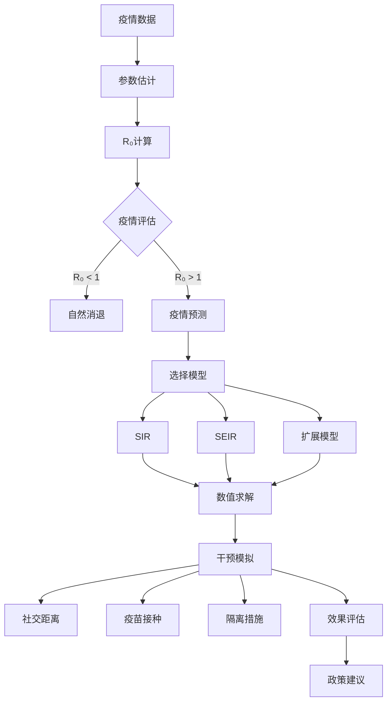

# 流行病学SIR模型族

> SIR模型是传染病动力学的经典数学框架，通过将人群划分为不同仓室来描述疾病传播动态，为公共卫生决策提供定量依据。

---

## 一、问题背景

### 1.1 流行病学的重要性

| 应用场景 | 数学模型作用 | 决策支持 |
|---------|------------|---------|
| 疫情预测 | 感染人数时间演化 | 医疗资源调配 |
| 干预评估 | 防控措施效果模拟 | 政策制定 |
| 疫苗策略 | 接种覆盖率优化 | 免疫规划 |
| 疾病消除 | 消除条件分析 | 公共卫生目标 |

### 1.2 历史上重大疫情

| 疫情 | 时间 | 死亡人数 | 模型应用 |
|-----|------|---------|---------|
| 黑死病 | 1346-1353 | 7500万-2亿 | - |
| 西班牙流感 | 1918-1919 | 2000-5000万 | Kermack-McKendrick |
| SARS | 2002-2003 | 770+ | 实时建模 |
| COVID-19 | 2020至今 | 数百万 | 复杂网络、机器学习 |


---

## 二、数学模型建立

### 2.1 经典SIR模型

**Kermack-McKendrick (1927)：**

$$\frac{dS}{dt} = -\beta \frac{SI}{N}$$
$$\frac{dI}{dt} = \beta \frac{SI}{N} - \gamma I$$
$$\frac{dR}{dt} = \gamma I$$

其中：
- $S$：易感者(Susceptible)
- $I$：感染者(Infectious)
- $R$：康复者(Recovered)
- $N = S + I + R$：总人口
- $\beta$：传染率
- $\gamma$：恢复率

**基本再生数：**

$$R_0 = \frac{\beta}{\gamma}$$

$R_0$ 表示一个感染者在完全易感人群中平均能传染的人数。

**最终规模方程：**

$$R_\infty = 1 - e^{-R_0 R_\infty}$$

### 2.2 SIR模型变体

**SIS模型**（无免疫，如感冒）：

$$\frac{dS}{dt} = -\beta \frac{SI}{N} + \gamma I$$
$$\frac{dI}{dt} = \beta \frac{SI}{N} - \gamma I$$

**SEIR模型**（潜伏期，如麻疹）：

$$\frac{dS}{dt} = -\beta \frac{SI}{N}$$
$$\frac{dE}{dt} = \beta \frac{SI}{N} - \sigma E$$
$$\frac{dI}{dt} = \sigma E - \gamma I$$
$$\frac{dR}{dt} = \gamma I$$

其中 $E$ 为暴露者(Exposed)，$1/\sigma$ 为平均潜伏期。

**SIRS模型**（临时免疫）：

添加 $R \to S$ 的转移：$\frac{dR}{dt} = \gamma I - \omega R$

其中 $1/\omega$ 为免疫持续时间。

### 2.3 干预措施建模

**疫苗接种：**

初始条件修改为：$S(0) = (1-p)N$，其中 $p$ 为接种率。

**群体免疫阈值：**

$$p_c = 1 - \frac{1}{R_0}$$

**隔离措施：**

$$\frac{dI}{dt} = \beta \frac{SI}{N} - \gamma I - qI$$

其中 $q$ 为隔离率。

---

## 三、理论分析与推导

### 3.1 稳定性分析

**无病平衡点：** $(S, I, R) = (N, 0, 0)$

Jacobian矩阵：

$$J = \begin{bmatrix} 0 & -\beta & 0 \\ 0 & \beta - \gamma & 0 \\ 0 & \gamma & 0 \end{bmatrix}$$

特征值：$\lambda_1 = 0$, $\lambda_2 = \beta - \gamma$, $\lambda_3 = 0$

**稳定性条件：**
- 当 $R_0 = \beta/\gamma < 1$：无病平衡点稳定
- 当 $R_0 > 1$：疾病持续

### 3.2 峰值分析

**感染峰值时刻：** 当 $dI/dt = 0$ 时，$S = N/R_0$

**峰值感染人数：**

$$I_{max} = N - \frac{N}{R_0}\left(1 + \ln R_0\right)$$

### 3.3 Python实现

```python
import numpy as np
from scipy.integrate import odeint
import matplotlib.pyplot as plt

class EpidemicModels:
    """流行病学模型"""
    
    def __init__(self, N=1000000):
        self.N = N  # 总人口
    
    @staticmethod
    def sir_model(y, t, N, beta, gamma):
        """SIR模型"""
        S, I, R = y
        dSdt = -beta * S * I / N
        dIdt = beta * S * I / N - gamma * I
        dRdt = gamma * I
        return [dSdt, dIdt, dRdt]
    
    @staticmethod
    def seir_model(y, t, N, beta, sigma, gamma):
        """SEIR模型"""
        S, E, I, R = y
        dSdt = -beta * S * I / N
        dEdt = beta * S * I / N - sigma * E
        dIdt = sigma * E - gamma * I
        dRdt = gamma * I
        return [dSdt, dEdt, dIdt, dRdt]
    
    @staticmethod
    def sir_vaccine_model(y, t, N, beta, gamma, v):
        """带疫苗接种的SIR模型"""
        S, I, R, V = y
        dSdt = -beta * S * I / N - v * S
        dIdt = beta * S * I / N - gamma * I
        dRdt = gamma * I
        dVdt = v * S
        return [dSdt, dIdt, dRdt, dVdt]
    
    def solve_sir(self, S0, I0, R0, t, beta, gamma):
        """求解SIR模型"""
        y0 = [S0, I0, R0]
        solution = odeint(self.sir_model, y0, t, args=(self.N, beta, gamma))
        return solution
    
    def solve_seir(self, S0, E0, I0, R0, t, beta, sigma, gamma):
        """求解SEIR模型"""
        y0 = [S0, E0, I0, R0]
        solution = odeint(self.seir_model, y0, t, args=(self.N, beta, sigma, gamma))
        return solution
    
    def calculate_r0(self, beta, gamma):
        """计算基本再生数"""
        return beta / gamma
    
    def herd_immunity_threshold(self, beta, gamma):
        """计算群体免疫阈值"""
        r0 = self.calculate_r0(beta, gamma)
        return 1 - 1/r0 if r0 > 1 else 0

# 示例1：SIR模型基础分析
epi = EpidemicModels(N=1000000)

# 参数设置
beta = 0.5  # 传染率
gamma = 0.1  # 恢复率
R0 = epi.calculate_r0(beta, gamma)

# 初始条件
I0 = 100  # 初始感染者
S0 = epi.N - I0
R0_init = 0

# 时间点
t = np.linspace(0, 160, 1000)

# 求解
solution = epi.solve_sir(S0, I0, R0_init, t, beta, gamma)
S, I, R = solution[:, 0], solution[:, 1], solution[:, 2]

# 找到峰值
peak_idx = np.argmax(I)
t_peak = t[peak_idx]
I_peak = I[peak_idx]

# 可视化
fig, axes = plt.subplots(1, 2, figsize=(14, 5))

# 时序图
axes[0].plot(t, S, 'b-', linewidth=2, label='易感者 S')
axes[0].plot(t, I, 'r-', linewidth=2, label='感染者 I')
axes[0].plot(t, R, 'g-', linewidth=2, label='康复者 R')
axes[0].axvline(x=t_peak, color='purple', linestyle='--', alpha=0.5, label=f'峰值时刻 t={t_peak:.1f}')
axes[0].axhline(y=I_peak, color='purple', linestyle='--', alpha=0.5, label=f'峰值感染数={I_peak:.0f}')
axes[0].set_xlabel('时间 (天)')
axes[0].set_ylabel('人数')
axes[0].set_title(f'SIR模型 (R₀={R0:.2f})')
axes[0].legend()
axes[0].grid(True)

# 相轨迹图
axes[1].plot(S/epi.N, I/epi.N, 'purple', linewidth=2)
axes[1].plot(S[0]/epi.N, I[0]/epi.N, 'go', markersize=10, label='初始点')
axes[1].plot(S[peak_idx]/epi.N, I[peak_idx]/epi.N, 'ro', markersize=10, label='峰值点')
axes[1].axvline(x=1/R0, color='orange', linestyle='--', alpha=0.5, label=f'S=N/R₀')
axes[1].set_xlabel('易感者比例 S/N')
axes[1].set_ylabel('感染者比例 I/N')
axes[1].set_title('相轨迹图')
axes[1].legend()
axes[1].grid(True)
axes[1].set_xlim([0, 1])
axes[1].set_ylim([0, max(I/epi.N)*1.1])

plt.tight_layout()
plt.savefig('sir_model.png', dpi=150)
plt.show()

print("SIR模型分析结果:")
print(f"  基本再生数 R₀ = {R0:.2f}")
print(f"  群体免疫阈值 = {epi.herd_immunity_threshold(beta, gamma):.2%}")
print(f"  感染峰值时刻 = {t_peak:.1f} 天")
print(f"  峰值感染人数 = {I_peak:.0f} ({I_peak/epi.N*100:.2f}%)")
print(f"  最终感染人数 ≈ {R[-1]:.0f} ({R[-1]/epi.N*100:.2f}%)")
```

### 3.4 SEIR模型实现

```python
# 示例2：SEIR模型（考虑潜伏期）
beta_seir = 0.8
sigma = 0.2  # 潜伏期率（平均潜伏期5天）
gamma_seir = 0.1

E0 = 500  # 初始暴露者
I0_seir = 50
S0_seir = epi.N - E0 - I0_seir
R0_seir = 0

t_seir = np.linspace(0, 200, 1000)
solution_seir = epi.solve_seir(S0_seir, E0, I0_seir, R0_seir, t_seir, beta_seir, sigma, gamma_seir)
S_seir, E_seir, I_seir, R_seir = (solution_seir[:, 0], solution_seir[:, 1], 
                                   solution_seir[:, 2], solution_seir[:, 3])

# SEIR可视化
plt.figure(figsize=(12, 6))
plt.plot(t_seir, S_seir/epi.N, 'b-', linewidth=2, label='易感者 S')
plt.plot(t_seir, E_seir/epi.N, 'orange', linewidth=2, label='暴露者 E')
plt.plot(t_seir, I_seir/epi.N, 'r-', linewidth=2, label='感染者 I')
plt.plot(t_seir, R_seir/epi.N, 'g-', linewidth=2, label='康复者 R')
plt.xlabel('时间 (天)')
plt.ylabel('人口比例')
plt.title(f'SEIR模型 (β={beta_seir}, σ={sigma}, γ={gamma_seir})')
plt.legend()
plt.grid(True)
plt.savefig('seir_model.png', dpi=150)
plt.show()

R0_seir = beta_seir / gamma_seir
print(f"\nSEIR模型分析:")
print(f"  基本再生数 R₀ = {R0_seir:.2f}")
print(f"  平均潜伏期 = {1/sigma:.1f} 天")
print(f"  平均感染期 = {1/gamma_seir:.1f} 天")
print(f"  峰值感染比例 = {np.max(I_seir)/epi.N*100:.2f}%")
```

---

## 四、数值实验

### 4.1 R₀敏感性分析

```python
def r0_sensitivity_analysis():
    """分析R₀对疫情发展的影响"""
    
    r0_values = [1.5, 2.0, 2.5, 3.0, 4.0, 5.0]
    gamma_fixed = 0.1
    
    fig, axes = plt.subplots(2, 3, figsize=(15, 10))
    axes = axes.flatten()
    
    for idx, r0 in enumerate(r0_values):
        beta = r0 * gamma_fixed
        
        solution = epi.solve_sir(epi.N - 100, 100, 0, t, beta, gamma_fixed)
        S, I, R = solution[:, 0], solution[:, 1], solution[:, 2]
        
        ax = axes[idx]
        ax.plot(t, I/epi.N, 'r-', linewidth=2, label='感染者')
        ax.fill_between(t, 0, I/epi.N, alpha=0.3, color='red')
        ax.set_xlabel('时间 (天)')
        ax.set_ylabel('感染比例')
        ax.set_title(f'R₀ = {r0}\n峰值={np.max(I)/epi.N*100:.1f}%, 最终={R[-1]/epi.N*100:.1f}%')
        ax.grid(True)
        ax.set_ylim([0, 0.4])
    
    plt.suptitle('基本再生数R₀的影响', fontsize=14)
    plt.tight_layout()
    plt.savefig('r0_sensitivity.png', dpi=150)
    plt.show()
    
    print("R₀敏感性分析:")
    print(f"{'R₀':<8} {'峰值感染%':<12} {'最终感染%':<12} {'群体免疫%':<12}")
    print("-" * 44)
    for r0 in r0_values:
        herd = (1 - 1/r0) * 100 if r0 > 1 else 0
        beta = r0 * gamma_fixed
        solution = epi.solve_sir(epi.N - 100, 100, 0, t, beta, gamma_fixed)
        I_max = np.max(solution[:, 1]) / epi.N * 100
        R_final = solution[-1, 2] / epi.N * 100
        print(f"{r0:<8.1f} {I_max:<12.1f} {R_final:<12.1f} {herd:<12.1f}")

r0_sensitivity_analysis()
```

### 4.2 干预措施效果模拟

```python
def intervention_scenarios():
    """模拟不同干预措施的效果"""
    
    scenarios = [
        {'name': '无干预', 'beta_factor': 1.0, 'start': 0},
        {'name': '早期干预 (第10天)', 'beta_factor': 0.6, 'start': 10},
        {'name': '中期干预 (第30天)', 'beta_factor': 0.6, 'start': 30},
        {'name': '晚期干预 (第50天)', 'beta_factor': 0.6, 'start': 50},
        {'name': '强力干预 (β减半)', 'beta_factor': 0.5, 'start': 20},
    ]
    
    beta_base = 0.5
    gamma = 0.1
    
    plt.figure(figsize=(12, 8))
    
    for scenario in scenarios:
        # 分段求解
        t1 = np.linspace(0, scenario['start'], 100)
        t2 = np.linspace(scenario['start'], 160, 500)
        
        # 第一阶段
        sol1 = odeint(epi.sir_model, [epi.N-100, 100, 0], t1, args=(epi.N, beta_base, gamma))
        
        # 第二阶段
        beta_new = beta_base * scenario['beta_factor']
        sol2 = odeint(epi.sir_model, sol1[-1], t2, args=(epi.N, beta_new, gamma))
        
        # 合并
        I_total = np.concatenate([sol1[:, 1], sol2[:, 1]])
        t_total = np.concatenate([t1, t2])
        
        plt.plot(t_total, I_total/epi.N*100, linewidth=2, label=scenario['name'])
    
    plt.xlabel('时间 (天)')
    plt.ylabel('感染人数比例 (%)')
    plt.title('干预措施效果对比')
    plt.legend()
    plt.grid(True)
    plt.savefig('intervention_comparison.png', dpi=150)
    plt.show()
    
    # 计算干预效果
    print("\n干预措施效果:")
    print(f"{'措施':<25} {'峰值%':<10} {'峰值时间':<12} {'总感染%':<10}")
    print("-" * 57)
    
    for scenario in scenarios:
        t1 = np.linspace(0, scenario['start'], 100)
        t2 = np.linspace(scenario['start'], 160, 500)
        
        sol1 = odeint(epi.sir_model, [epi.N-100, 100, 0], t1, args=(epi.N, beta_base, gamma))
        beta_new = beta_base * scenario['beta_factor']
        sol2 = odeint(epi.sir_model, sol1[-1], t2, args=(epi.N, beta_new, gamma))
        
        I_total = np.concatenate([sol1[:, 1], sol2[:, 1]])
        t_total = np.concatenate([t1, t2])
        
        peak_idx = np.argmax(I_total)
        print(f"{scenario['name']:<25} {I_total[peak_idx]/epi.N*100:<10.1f} "
              f"{t_total[peak_idx]:<12.1f} {sol2[-1, 2]/epi.N*100:<10.1f}")

intervention_scenarios()
```

---

## 五、模型结构流程图



---

## 六、相关数学概念

- [常微分方程](../05-微分方程/常微分方程.md) - 仓室模型基础
- [动力系统](../05-微分方程/动力系统.md) - 稳定性分析
- [随机过程](../06-概率统计/随机过程.md) - 随机流行病模型
- [网络科学](../09-组合数学与离散数学/图论.md) - 接触网络传播
- [统计推断](../06-概率统计/统计推断.md) - 参数估计
- [元胞自动机](../08-计算数学/元胞自动机.md) - 空间传播模拟

---

> **公共卫生建模实践提示**：
> - 模型参数需要通过实际数据校准
> - 模型预测不确定性应通过敏感性分析量化
> - 实时数据同化可提高预测准确性
> - 干预措施的社会经济成本需要综合考虑
> - 模型应随新证据不断更新完善
