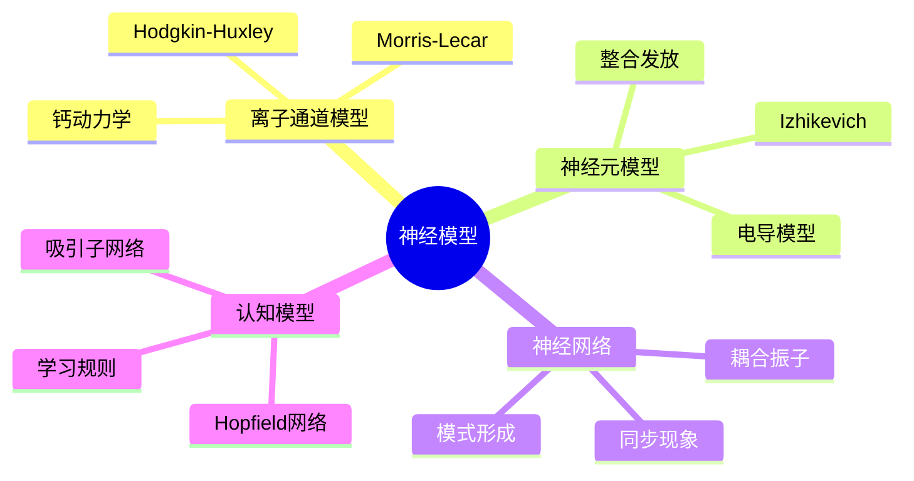
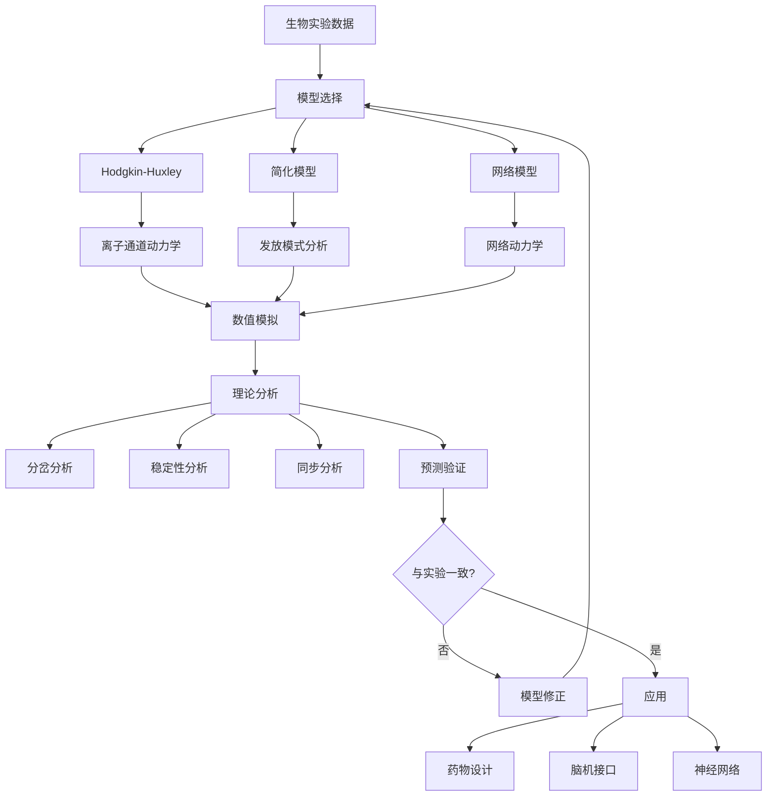

# 神经科学的数学模型

> 神经科学中的数学模型从离子通道到神经网络多个尺度描述神经系统的功能，为理解大脑信息处理机制和神经系统疾病治疗提供理论基础。

---

## 一、问题背景

### 1.1 神经建模的多尺度特征

| 尺度 | 模型类型 | 关键现象 |
|-----|---------|---------|
| 分子 | Hodgkin-Huxley方程 | 动作电位产生 |
| 细胞 | 整合发放模型 | 神经元兴奋性 |
| 网络 | 耦合振子 | 同步振荡 |
| 系统 | 神经网络 | 信息编码、记忆 |

### 1.2 历史里程碑

- **1952年**：Hodgkin-Huxley模型获诺贝尔奖
- **1961年**：Fitzhugh-Nagumo模型简化
- **1980s**：神经网络模型复兴
- **2000s至今**：计算神经科学蓬勃发展



---

## 二、数学模型建立

### 2.1 Hodgkin-Huxley模型

**离子电流方程：**

$$C_m \frac{dV}{dt} = -g_{Na}m^3h(V-E_{Na}) - g_K n^4(V-E_K) - g_L(V-E_L) + I_{ext}$$

**门控变量动力学：**

$$\frac{dm}{dt} = \alpha_m(V)(1-m) - \beta_m(V)m$$
$$\frac{dh}{dt} = \alpha_h(V)(1-h) - \beta_h(V)h$$
$$\frac{dn}{dt} = \alpha_n(V)(1-n) - \beta_n(V)n$$

**速率常数：**

$$\alpha_n(V) = \frac{0.01(V+55)}{1 - e^{-(V+55)/10}}$$
$$\beta_n(V) = 0.125 e^{-(V+65)/80}$$

### 2.2 整合发放模型

**Leaky Integrate-and-Fire：**

$$\tau \frac{dV}{dt} = -(V - V_{rest}) + RI(t)$$

当 $V \geq V_{threshold}$ 时，发放动作电位并重置：

$$V \to V_{reset}$$

**指数整合发放(ExpIF)：**

$$\tau \frac{dV}{dt} = -(V - V_{rest}) + \Delta_T e^{(V - \vartheta)/\Delta_T} + RI(t)$$

### 2.3 Izhikevich模型

**二维简化模型：**

$$\frac{dv}{dt} = 0.04v^2 + 5v + 140 - u + I$$
$$\frac{du}{dt} = a(bv - u)$$

**重置条件：**

如果 $v \geq 30$ mV，则：
$$v \leftarrow c, \quad u \leftarrow u + d$$

---

## 三、理论分析与推导

### 3.1 兴奋性类型

| 类型 | 特征 |  bifurcation |
|-----|------|-------------|
| I型 | 任意低频率发放 | 鞍结分岔 |
| II型 | 有限最低频率 | Hopf分岔 |

**分岔分析：**

使用慢变量近似分析系统的分岔结构，确定神经元从静息到发放的转变机制。

### 3.2 同步现象

**Kuramoto模型：**

$$\frac{d\theta_i}{dt} = \omega_i + \frac{K}{N}\sum_{j=1}^N \sin(\theta_j - \theta_i)$$

**序参量：**

$$re^{i\psi} = \frac{1}{N}\sum_{j=1}^N e^{i\theta_j}$$

当 $r \approx 1$ 时表示完全同步。

### 3.3 Python实现

```python
import numpy as np
from scipy.integrate import odeint
import matplotlib.pyplot as plt

class NeuronModels:
    """神经元模型集合"""
    
    def __init__(self):
        # Hodgkin-Huxley参数
        self.C_m = 1.0
        self.g_Na = 120.0
        self.g_K = 36.0
        self.g_L = 0.3
        self.E_Na = 50.0
        self.E_K = -77.0
        self.E_L = -54.387
    
    def alpha_n(self, V):
        return 0.01 * (V + 55) / (1 - np.exp(-(V + 55) / 10))
    
    def beta_n(self, V):
        return 0.125 * np.exp(-(V + 65) / 80)
    
    def alpha_m(self, V):
        return 0.1 * (V + 40) / (1 - np.exp(-(V + 40) / 10))
    
    def beta_m(self, V):
        return 4.0 * np.exp(-(V + 65) / 18)
    
    def alpha_h(self, V):
        return 0.07 * np.exp(-(V + 65) / 20)
    
    def beta_h(self, V):
        return 1 / (1 + np.exp(-(V + 35) / 10))
    
    def hodgkin_huxley(self, state, t, I_ext):
        """Hodgkin-Huxley方程"""
        V, m, h, n = state
        
        dVdt = (I_ext - self.g_Na * m**3 * h * (V - self.E_Na) 
                - self.g_K * n**4 * (V - self.E_K) 
                - self.g_L * (V - self.E_L)) / self.C_m
        
        dmdt = self.alpha_m(V) * (1 - m) - self.beta_m(V) * m
        dhdt = self.alpha_h(V) * (1 - h) - self.beta_h(V) * h
        dndt = self.alpha_n(V) * (1 - n) - self.beta_n(V) * n
        
        return [dVdt, dmdt, dhdt, dndt]
    
    def izhikevich(self, state, t, I, a=0.02, b=0.2, c=-65, d=8):
        """Izhikevich模型"""
        v, u = state
        
        if v >= 30:
            v = c
            u = u + d
        
        dvdt = 0.04 * v**2 + 5 * v + 140 - u + I
        dudt = a * (b * v - u)
        
        return [dvdt, dudt]
    
    def solve_hh(self, I_ext, t, V0=-65):
        """求解Hodgkin-Huxley方程"""
        m0 = self.alpha_m(V0) / (self.alpha_m(V0) + self.beta_m(V0))
        h0 = self.alpha_h(V0) / (self.alpha_h(V0) + self.beta_h(V0))
        n0 = self.alpha_n(V0) / (self.alpha_n(V0) + self.beta_n(V0))
        
        state0 = [V0, m0, h0, n0]
        solution = odeint(self.hodgkin_huxley, state0, t, args=(I_ext,))
        return solution

# 示例1：Hodgkin-Huxley动作电位
neuron = NeuronModels()

# 时间
T = 50
dt = 0.01
t = np.arange(0, T, dt)

# 恒定电流刺激
I_stim = 10  # μA/cm²

# 求解
solution = neuron.solve_hh(I_stim, t)
V, m, h, n = solution[:, 0], solution[:, 1], solution[:, 2], solution[:, 3]

# 可视化
fig, axes = plt.subplots(2, 2, figsize=(14, 10))

# 膜电位
axes[0, 0].plot(t, V, 'b-', linewidth=1.5)
axes[0, 0].set_xlabel('时间 (ms)')
axes[0, 0].set_ylabel('膜电位 V (mV)')
axes[0, 0].set_title(f'Hodgkin-Huxley: 动作电位 (I={I_stim}μA/cm²)')
axes[0, 0].grid(True)
axes[0, 0].axhline(y=-65, color='gray', linestyle='--', alpha=0.5, label='静息电位')
axes[0, 0].legend()

# 门控变量
axes[0, 1].plot(t, m, 'r-', label='m (激活)', linewidth=1.5)
axes[0, 1].plot(t, h, 'g-', label='h (失活)', linewidth=1.5)
axes[0, 1].plot(t, n, 'b-', label='n (K激活)', linewidth=1.5)
axes[0, 1].set_xlabel('时间 (ms)')
axes[0, 1].set_ylabel('门控变量')
axes[0, 1].set_title('离子通道门控变量')
axes[0, 1].legend()
axes[0, 1].grid(True)

# 不同刺激强度
I_values = [0, 5, 6.3, 10, 20]
colors = plt.cm.viridis(np.linspace(0, 1, len(I_values)))

for I_val, color in zip(I_values, colors):
    sol = neuron.solve_hh(I_val, t)
    axes[1, 0].plot(t, sol[:, 0], color=color, label=f'I={I_val}', linewidth=1.5)

axes[1, 0].set_xlabel('时间 (ms)')
axes[1, 0].set_ylabel('膜电位 V (mV)')
axes[1, 0].set_title('不同刺激强度的响应')
axes[1, 0].legend()
axes[1, 0].grid(True)

# 电流-频率关系
I_range = np.linspace(0, 30, 30)
frequencies = []

for I_test in I_range:
    sol = neuron.solve_hh(I_test, t)
    V_test = sol[:, 0]
    
    # 检测峰
    peaks = np.where((V_test[1:-1] > V_test[:-2]) & (V_test[1:-1] > V_test[2:]) & (V_test[1:-1] > 0))[0]
    if len(peaks) > 1:
        freq = len(peaks) / (T / 1000)  # Hz
    else:
        freq = 0
    frequencies.append(freq)

axes[1, 1].plot(I_range, frequencies, 'ko-', linewidth=2)
axes[1, 1].set_xlabel('刺激电流 I (μA/cm²)')
axes[1, 1].set_ylabel('发放频率 (Hz)')
axes[1, 1].set_title('f-I曲线')
axes[1, 1].grid(True)
axes[1, 1].axhline(y=0, color='r', linestyle='--', alpha=0.5)
axes[1, 1].axvline(x=6.3, color='gray', linestyle='--', alpha=0.5, label='阈值≈6.3')
axes[1, 1].legend()

plt.tight_layout()
plt.savefig('hodgkin_huxley.png', dpi=150)
plt.show()

print("Hodgkin-Huxley模型分析:")
print(f"  阈值电流: 约6.3 μA/cm²")
print(f"  动作电位幅度: 约{np.max(V) - np.min(V):.1f} mV")
print(f"  在I={I_stim}μA/cm²时的发放频率: 约{frequencies[np.argmin(np.abs(I_range - I_stim))]:.1f} Hz")
```

### 3.4 Izhikevich模型示例

```python
# Izhikevich模型模拟不同发放模式
def izhikevich_simulation(a, b, c, d, I, T=1000, dt=0.25):
    """Izhikevich模型模拟"""
    t = np.arange(0, T, dt)
    n = len(t)
    
    v = np.zeros(n)
    u = np.zeros(n)
    
    v[0] = -65
    u[0] = b * v[0]
    
    spikes = []
    
    for i in range(n-1):
        v[i+1] = v[i] + dt * (0.04 * v[i]**2 + 5 * v[i] + 140 - u[i] + I[i])
        u[i+1] = u[i] + dt * a * (b * v[i] - u[i])
        
        if v[i+1] >= 30:
            v[i] = 30  # 峰值
            v[i+1] = c
            u[i+1] = u[i+1] + d
            spikes.append(t[i])
    
    return t, v, u, spikes

# 不同神经元类型的参数
neuron_types = [
    {'name': '常规发放 (RS)', 'a': 0.02, 'b': 0.2, 'c': -65, 'd': 8, 'I': 10},
    {'name': '快速发放 (FS)', 'a': 0.1, 'b': 0.2, 'c': -65, 'd': 2, 'I': 10},
    {'name': '爆发发放 (CH)', 'a': 0.02, 'b': 0.2, 'c': -50, 'd': 2, 'I': 10},
]

fig, axes = plt.subplots(3, 1, figsize=(12, 10))

for idx, neuron_type in enumerate(neuron_types):
    I = np.ones(int(1000/0.25)) * neuron_type['I']
    t, v, u, spikes = izhikevich_simulation(
        neuron_type['a'], neuron_type['b'], neuron_type['c'], neuron_type['d'], I
    )
    
    axes[idx].plot(t, v, 'b-', linewidth=1)
    axes[idx].set_ylabel('V (mV)')
    axes[idx].set_title(f"{neuron_type['name']}: a={neuron_type['a']}, b={neuron_type['b']}, "
                        f"c={neuron_type['c']}, d={neuron_type['d']}")
    axes[idx].grid(True)
    axes[idx].set_ylim([-90, 40])
    
    if idx == len(neuron_types) - 1:
        axes[idx].set_xlabel('时间 (ms)')

plt.tight_layout()
plt.savefig('izhikevich_types.png', dpi=150)
plt.show()
```

---

## 四、数值实验

### 4.1 耦合神经元同步

```python
def coupled_neurons(K=0.1, N=2, T=500):
    """耦合神经元网络"""
    dt = 0.1
    t = np.arange(0, T, dt)
    n_steps = len(t)
    
    # 初始化
    v = np.random.uniform(-70, -60, (N, n_steps))
    u = np.zeros((N, n_steps))
    
    a, b, c, d = 0.02, 0.2, -65, 8
    I_base = 10
    
    for i in range(N):
        u[i, 0] = b * v[i, 0]
    
    spikes = [[] for _ in range(N)]
    
    for step in range(n_steps - 1):
        for i in range(N):
            # 耦合项
            coupling = K * np.sum(v[:, step] - v[i, step]) / N
            I = I_base + coupling
            
            v[i, step+1] = v[i, step] + dt * (0.04 * v[i, step]**2 + 5 * v[i, step] + 140 - u[i, step] + I)
            u[i, step+1] = u[i, step] + dt * a * (b * v[i, step] - u[i, step])
            
            if v[i, step+1] >= 30:
                v[i, step] = 30
                v[i, step+1] = c
                u[i, step+1] += d
                spikes[i].append(t[step])
    
    return t, v, spikes

# 不同耦合强度
coupling_strengths = [0, 0.05, 0.1, 0.2]

fig, axes = plt.subplots(2, 2, figsize=(14, 10))
axes = axes.flatten()

for idx, K in enumerate(coupling_strengths):
    t, v, spikes = coupled_neurons(K=K, N=2, T=300)
    
    axes[idx].plot(t, v[0], 'b-', label='神经元1', linewidth=1.5)
    axes[idx].plot(t, v[1], 'r-', label='神经元2', linewidth=1.5)
    axes[idx].set_title(f'耦合强度 K = {K}')
    axes[idx].set_ylabel('膜电位 (mV)')
    axes[idx].legend()
    axes[idx].grid(True)
    axes[idx].set_ylim([-90, 40])
    
    if idx >= 2:
        axes[idx].set_xlabel('时间 (ms)')

plt.suptitle('耦合神经元的同步现象', fontsize=14)
plt.tight_layout()
plt.savefig('coupled_neurons.png', dpi=150)
plt.show()
```

---

## 五、模型结构流程图



---

## 六、相关数学概念

- [常微分方程](../05-微分方程/常微分方程.md) - 神经元动力学
- [动力系统](../05-微分方程/动力系统.md) - 分岔分析
- [偏微分方程](../05-微分方程/偏微分方程.md) - 神经场模型
- [随机过程](../06-概率统计/随机过程.md) - 噪声效应
- [图论](../09-组合数学与离散数学/图论.md) - 神经网络结构
- [优化理论](../21-最优化/) - 神经学习规则

---

> **神经建模实践提示**：
> - 复杂性与计算效率间需要权衡
> - 参数应基于实验数据校准
> - 噪声在神经系统中起重要作用
> - 多尺度建模是当前挑战
> - 理论预测需要实验验证
