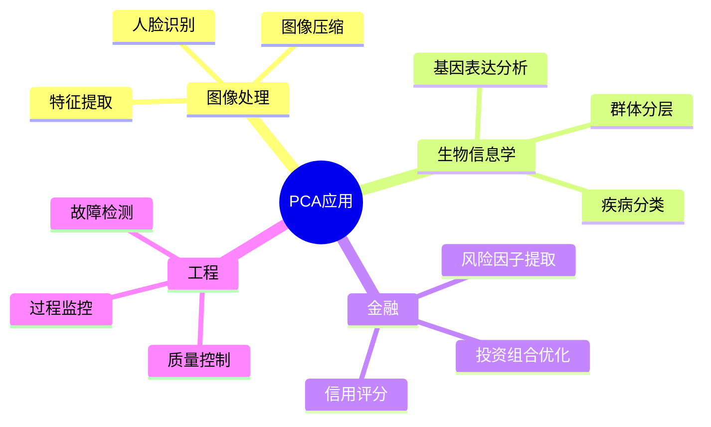
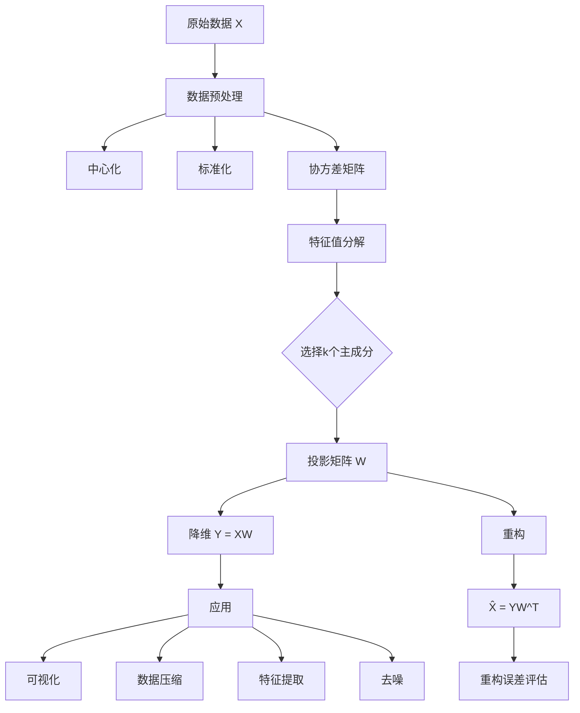

# 主成分分析的数学原理

> 主成分分析(PCA)是一种经典的降维技术，通过线性变换将数据投影到方差最大的方向，在数据压缩、可视化和特征提取等领域有广泛应用。

---

## 一、问题背景

### 1.1 高维数据挑战

| 问题 | 描述 | PCA解决方案 |
|-----|------|-----------|
| 维度灾难 | 高维空间中数据稀疏 | 降低维度 |
| 可视化困难 | 超过3维难以直观展示 | 降至2D/3D |
| 噪声累积 | 高维中噪声影响大 | 保留主要信号 |
| 冗余信息 | 特征间高度相关 | 提取不相关主成分 |

### 1.2 应用领域



---

## 二、数学模型建立

### 2.1 问题描述

给定 $n$ 个 $d$ 维数据点：$\mathbf{x}_1, \mathbf{x}_2, ..., \mathbf{x}_n \in \mathbb{R}^d$

寻找投影矩阵 $W \in \mathbb{R}^{d \times k}$，使得：

$$\mathbf{y}_i = W^T \mathbf{x}_i$$

在降维后的 $k$ 维空间中保持最大方差。

### 2.2 优化目标

**最大方差视角：**

$$\max_{\mathbf{w}} \mathbf{w}^T \Sigma \mathbf{w}, \quad \text{s.t.} \quad \|\mathbf{w}\| = 1$$

其中 $\Sigma$ 是数据的协方差矩阵。

**最小重构误差视角：**

$$\min_W \sum_{i=1}^n \|\mathbf{x}_i - WW^T\mathbf{x}_i\|^2$$

### 2.3 求解方法

**协方差矩阵：**

$$\Sigma = \frac{1}{n} \sum_{i=1}^n (\mathbf{x}_i - \bar{\mathbf{x}})(\mathbf{x}_i - \bar{\mathbf{x}})^T$$

**特征值分解：**

$$\Sigma \mathbf{w}_j = \lambda_j \mathbf{w}_j, \quad \lambda_1 \geq \lambda_2 \geq ... \geq \lambda_d$$

**主成分：** 取前 $k$ 个最大特征值对应的特征向量。

---

## 三、理论分析与推导

### 3.1 数学推导

**拉格朗日函数：**

$$\mathcal{L} = \mathbf{w}^T \Sigma \mathbf{w} - \lambda(\mathbf{w}^T\mathbf{w} - 1)$$

**最优条件：**

$$\frac{\partial \mathcal{L}}{\partial \mathbf{w}} = 2\Sigma\mathbf{w} - 2\lambda\mathbf{w} = 0$$

$$\Rightarrow \Sigma\mathbf{w} = \lambda\mathbf{w}$$

**最大方差：**

$$\text{Var} = \mathbf{w}^T \Sigma \mathbf{w} = \lambda$$

### 3.2 方差解释率

**总方差：**

$$\text{Total Variance} = \sum_{j=1}^d \lambda_j = \text{tr}(\Sigma)$$

**第 $j$ 主成分的方差贡献率：**

$$\text{Explained Variance Ratio}_j = \frac{\lambda_j}{\sum_{i=1}^d \lambda_i}$$

**累积方差解释率：**

$$\text{Cumulative} = \frac{\sum_{j=1}^k \lambda_j}{\sum_{i=1}^d \lambda_i}$$

### 3.3 与SVD的关系

数据矩阵 $X \in \mathbb{R}^{n \times d}$（中心化后）的SVD分解：

$$X = U \Sigma V^T$$

PCA的主成分即为 $V$ 的列向量。

### 3.4 Python实现

```python
import numpy as np
import matplotlib.pyplot as plt
from sklearn.datasets import load_iris, fetch_openml
from sklearn.preprocessing import StandardScaler

class PCA:
    """主成分分析实现"""
    
    def __init__(self, n_components=None):
        """
        n_components: 保留的主成分个数
        """
        self.n_components = n_components
        self.components_ = None
        self.explained_variance_ = None
        self.explained_variance_ratio_ = None
        self.mean_ = None
        
    def fit(self, X):
        """拟合PCA模型"""
        # 中心化
        self.mean_ = np.mean(X, axis=0)
        X_centered = X - self.mean_
        
        # 计算协方差矩阵
        n_samples = X.shape[0]
        cov_matrix = np.dot(X_centered.T, X_centered) / (n_samples - 1)
        
        # 特征值分解
        eigenvalues, eigenvectors = np.linalg.eigh(cov_matrix)
        
        # 按特征值降序排列
        idx = eigenvalues.argsort()[::-1]
        eigenvalues = eigenvalues[idx]
        eigenvectors = eigenvectors[:, idx]
        
        # 存储结果
        self.explained_variance_ = eigenvalues
        self.explained_variance_ratio_ = eigenvalues / eigenvalues.sum()
        self.components_ = eigenvectors.T
        
        if self.n_components is not None:
            self.components_ = self.components_[:self.n_components]
            self.explained_variance_ = self.explained_variance_[:self.n_components]
            self.explained_variance_ratio_ = self.explained_variance_ratio_[:self.n_components]
        
        return self
    
    def transform(self, X):
        """将数据投影到主成分空间"""
        X_centered = X - self.mean_
        return np.dot(X_centered, self.components_.T)
    
    def fit_transform(self, X):
        """拟合并转换数据"""
        self.fit(X)
        return self.transform(X)
    
    def inverse_transform(self, X_transformed):
        """重构原始数据"""
        return np.dot(X_transformed, self.components_) + self.mean_
    
    def get_reconstruction_error(self, X):
        """计算重构误差"""
        X_transformed = self.transform(X)
        X_reconstructed = self.inverse_transform(X_transformed)
        return np.mean((X - X_reconstructed) ** 2)

# 示例1：鸢尾花数据集
iris = load_iris()
X = iris.data
y = iris.target
target_names = iris.target_names

# 标准化
scaler = StandardScaler()
X_scaled = scaler.fit_transform(X)

# PCA
pca = PCA(n_components=2)
X_pca = pca.fit_transform(X_scaled)

print("=== PCA分析结果 (鸢尾花数据集) ===")
print(f"原始维度: {X.shape[1]}")
print(f"降维后维度: {X_pca.shape[1]}")
print(f"\n各主成分方差解释率:")
for i, ratio in enumerate(pca.explained_variance_ratio_):
    print(f"  PC{i+1}: {ratio:.4f} ({ratio*100:.2f}%)")
print(f"累积方差解释率: {pca.explained_variance_ratio_.sum():.4f} "
      f"({pca.explained_variance_ratio_.sum()*100:.2f}%)")

# 可视化
fig, axes = plt.subplots(1, 2, figsize=(14, 5))

colors = ['navy', 'turquoise', 'darkorange']

# 原始数据（前两个特征）
for color, i, target_name in zip(colors, [0, 1, 2], target_names):
    axes[0].scatter(X_scaled[y == i, 0], X_scaled[y == i, 1], color=color, alpha=.8, 
                    lw=2, label=target_name)
axes[0].set_xlabel('特征 1 (标准化)')
axes[0].set_ylabel('特征 2 (标准化)')
axes[0].set_title('原始数据 (前两个特征)')
axes[0].legend()
axes[0].grid(True)

# PCA投影
for color, i, target_name in zip(colors, [0, 1, 2], target_names):
    axes[1].scatter(X_pca[y == i, 0], X_pca[y == i, 1], color=color, alpha=.8,
                    lw=2, label=target_name)
axes[1].set_xlabel(f'PC1 ({pca.explained_variance_ratio_[0]*100:.1f}%)')
axes[1].set_ylabel(f'PC2 ({pca.explained_variance_ratio_[1]*100:.1f}%)')
axes[1].set_title('PCA投影')
axes[1].legend()
axes[1].grid(True)

plt.tight_layout()
plt.savefig('pca_iris.png', dpi=150)
plt.show()
```

---

## 四、数值实验

### 4.1 方差解释率分析

```python
def explained_variance_analysis():
    """分析不同主成分个数的方差解释"""
    
    # 生成高维数据
    np.random.seed(42)
    n_samples = 500
    n_features = 50
    
    # 低秩数据（大部分方差在前几个维度）
    true_dim = 5
    X_lowrank = np.random.randn(n_samples, true_dim) @ np.random.randn(true_dim, n_features)
    X_lowrank += 0.1 * np.random.randn(n_samples, n_features)  # 添加噪声
    
    X_scaled = StandardScaler().fit_transform(X_lowrank)
    
    # 完整PCA
    pca_full = PCA()
    pca_full.fit(X_scaled)
    
    # 可视化
    fig, axes = plt.subplots(1, 2, figsize=(14, 5))
    
    # 特征值（Scree图）
    axes[0].plot(range(1, len(pca_full.explained_variance_)+1), 
                 pca_full.explained_variance_, 'bo-', linewidth=2)
    axes[0].axvline(x=true_dim, color='r', linestyle='--', 
                    label=f'真实维度={true_dim}')
    axes[0].set_xlabel('主成分序号')
    axes[0].set_ylabel('特征值（方差）')
    axes[0].set_title('Scree图')
    axes[0].legend()
    axes[0].grid(True)
    
    # 累积方差解释率
    cumsum_ratio = np.cumsum(pca_full.explained_variance_ratio_)
    axes[1].plot(range(1, len(cumsum_ratio)+1), cumsum_ratio, 'go-', linewidth=2)
    axes[1].axhline(y=0.95, color='r', linestyle='--', label='95%阈值')
    axes[1].axvline(x=true_dim, color='orange', linestyle='--', 
                    label=f'真实维度={true_dim}')
    axes[1].set_xlabel('主成分个数')
    axes[1].set_ylabel('累积方差解释率')
    axes[1].set_title('累积方差解释')
    axes[1].legend()
    axes[1].grid(True)
    
    # 找到达到95%方差解释所需的主成分数
    n_95 = np.argmax(cumsum_ratio >= 0.95) + 1
    axes[1].axvline(x=n_95, color='purple', linestyle=':', 
                    label=f'95%需要{n_95}个PC')
    axes[1].legend()
    
    plt.tight_layout()
    plt.savefig('explained_variance.png', dpi=150)
    plt.show()
    
    print(f"\n方差解释分析:")
    print(f"  真实数据维度: {true_dim}")
    print(f"  前{true_dim}个主成分解释方差: {cumsum_ratio[true_dim-1]*100:.2f}%")
    print(f"  达到95%方差需要: {n_95}个主成分")
    
    return cumsum_ratio

cumsum_ratio = explained_variance_analysis()
```

### 4.2 图像压缩应用

```python
def image_compression_demo():
    """使用PCA进行图像压缩演示"""
    
    # 创建测试图像（模拟人脸数据）
    np.random.seed(42)
    image_size = 64
    n_samples = 400
    
    # 生成结构化数据（模拟人脸）
    X_faces = np.zeros((n_samples, image_size**2))
    for i in range(n_samples):
        # 创建椭圆形状（模拟脸）
        img = np.zeros((image_size, image_size))
        center = (image_size//2, image_size//2)
        
        # 随机变换
        angle = np.random.uniform(0, 2*np.pi)
        scale = np.random.uniform(0.8, 1.2)
        
        for y in range(image_size):
            for x in range(image_size):
                dx = (x - center[0]) / scale
                dy = (y - center[1]) / scale
                if dx**2 + (dy/1.3)**2 < (image_size//3)**2:
                    img[y, x] = 1
        
        # 添加眼睛
        eye_offset = image_size//6
        img[center[1]-eye_offset//2, center[0]-eye_offset] = 0.5
        img[center[1]-eye_offset//2, center[0]+eye_offset] = 0.5
        
        X_faces[i] = img.flatten()
    
    # PCA压缩
    n_components_list = [10, 50, 100, 200]
    
    fig, axes = plt.subplots(2, len(n_components_list)+1, figsize=(16, 8))
    
    # 原始图像
    axes[0, 0].imshow(X_faces[0].reshape(image_size, image_size), cmap='gray')
    axes[0, 0].set_title('原始图像')
    axes[0, 0].axis('off')
    
    axes[1, 0].imshow(X_faces[1].reshape(image_size, image_size), cmap='gray')
    axes[1, 0].set_title('原始图像')
    axes[1, 0].axis('off')
    
    for idx, n_comp in enumerate(n_components_list, 1):
        pca_img = PCA(n_components=n_comp)
        X_compressed = pca_img.fit_transform(X_faces)
        X_reconstructed = pca_img.inverse_transform(X_compressed)
        
        # 计算压缩比
        original_size = X_faces.shape[1]
        compressed_size = n_comp * (1 + X_faces.shape[1])  # 成分 + 均值
        compression_ratio = original_size / compressed_size
        
        # 重构误差
        mse = np.mean((X_faces - X_reconstructed) ** 2)
        
        axes[0, idx].imshow(X_reconstructed[0].reshape(image_size, image_size), cmap='gray')
        axes[0, idx].set_title(f'{n_comp} PCs\n压缩比: {compression_ratio:.1f}x\nMSE: {mse:.4f}')
        axes[0, idx].axis('off')
        
        axes[1, idx].imshow(X_reconstructed[1].reshape(image_size, image_size), cmap='gray')
        axes[1, idx].set_title(f'{n_comp} PCs')
        axes[1, idx].axis('off')
    
    plt.suptitle('PCA图像压缩', fontsize=14)
    plt.tight_layout()
    plt.savefig('pca_compression.png', dpi=150)
    plt.show()

image_compression_demo()
```

### 4.3 核PCA非线性降维

```python
def kernel_pca_demo():
    """核PCA演示（非线性数据）"""
    from sklearn.decomposition import PCA as SklearnPCA
    from sklearn.decomposition import KernelPCA
    
    # 生成同心圆数据
    np.random.seed(42)
    n_samples = 500
    
    # 内圆
    theta = np.random.uniform(0, 2*np.pi, n_samples//2)
    r = np.random.normal(1, 0.1, n_samples//2)
    X_inner = np.column_stack([r*np.cos(theta), r*np.sin(theta)])
    y_inner = np.zeros(n_samples//2)
    
    # 外圆
    theta = np.random.uniform(0, 2*np.pi, n_samples//2)
    r = np.random.normal(3, 0.1, n_samples//2)
    X_outer = np.column_stack([r*np.cos(theta), r*np.sin(theta)])
    y_outer = np.ones(n_samples//2)
    
    X = np.vstack([X_inner, X_outer])
    y = np.hstack([y_inner, y_outer])
    
    # 标准PCA
    pca_linear = SklearnPCA(n_components=2)
    X_pca_linear = pca_linear.fit_transform(X)
    
    # 核PCA (RBF核)
    kpca = KernelPCA(n_components=2, kernel='rbf', gamma=0.5)
    X_kpca = kpca.fit_transform(X)
    
    # 可视化
    fig, axes = plt.subplots(1, 3, figsize=(15, 5))
    
    # 原始数据
    axes[0].scatter(X[y==0, 0], X[y==0, 1], c='blue', alpha=0.6, label='Class 0')
    axes[0].scatter(X[y==1, 0], X[y==1, 1], c='red', alpha=0.6, label='Class 1')
    axes[0].set_xlabel('X1')
    axes[0].set_ylabel('X2')
    axes[0].set_title('原始数据（同心圆）')
    axes[0].legend()
    axes[0].set_aspect('equal')
    axes[0].grid(True)
    
    # 线性PCA
    axes[1].scatter(X_pca_linear[y==0, 0], X_pca_linear[y==0, 1], c='blue', alpha=0.6, label='Class 0')
    axes[1].scatter(X_pca_linear[y==1, 0], X_pca_linear[y==1, 1], c='red', alpha=0.6, label='Class 1')
    axes[1].set_xlabel('PC1')
    axes[1].set_ylabel('PC2')
    axes[1].set_title('线性PCA')
    axes[1].legend()
    axes[1].grid(True)
    
    # 核PCA
    axes[2].scatter(X_kpca[y==0, 0], X_kpca[y==0, 1], c='blue', alpha=0.6, label='Class 0')
    axes[2].scatter(X_kpca[y==1, 0], X_kpca[y==1, 1], c='red', alpha=0.6, label='Class 1')
    axes[2].set_xlabel('PC1')
    axes[2].set_ylabel('PC2')
    axes[2].set_title('核PCA (RBF)')
    axes[2].legend()
    axes[2].grid(True)
    
    plt.tight_layout()
    plt.savefig('kernel_pca.png', dpi=150)
    plt.show()

kernel_pca_demo()
```

---

## 五、模型结构流程图



---

## 六、相关数学概念

- [线性代数](../02-代数学/线性代数基础.md) - 特征值分解
- [矩阵论](../02-代数学/矩阵分析.md) - SVD分解
- [统计学](../06-概率统计/多元统计分析.md) - 协方差矩阵
- [优化理论](../21-最优化/) - 约束优化
- [机器学习](../29-数据科学/) - 降维技术
- [信息论](../23-信息论/) - 信息压缩

---

> **PCA实践提示**：
> - 数据标准化对结果影响重大，通常需要先标准化
> - 选择主成分个数需权衡信息保留和降维程度
> - 对非线性数据考虑使用核PCA或t-SNE
> - 解释主成分需要结合领域知识
> - PCA对异常值敏感，需要数据清洗
