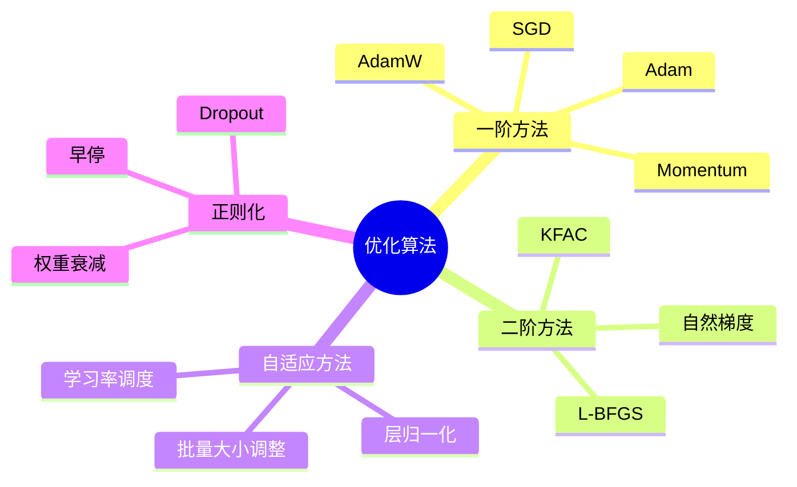

# 神经网络优化的数学基础

> 神经网络的训练本质上是一个高维非凸优化问题，理解其数学基础对于设计高效优化算法、理解模型行为和改进训练过程至关重要。

---

## 一、问题背景

### 1.1 优化问题的挑战

| 挑战 | 描述 | 影响 |
|-----|------|------|
| 非凸性 | 损失函数存在多个局部极小值 | 可能陷入次优解 |
| 高维性 | 参数量可达数十亿 | 计算和内存开销大 |
| 病态条件 | Hessian矩阵条件数大 | 收敛速度慢 |
| 鞍点 | 高维空间中存在大量鞍点 | 优化停滞 |
| 梯度消失/爆炸 | 深层网络中梯度衰减或增长 | 训练困难 |

### 1.2 优化算法的演进



---

## 二、数学模型建立

### 2.1 神经网络优化问题

**目标函数：**

$$\min_{\theta} L(\theta) = \frac{1}{n} \sum_{i=1}^n \ell(f(x_i; \theta), y_i) + \lambda R(\theta)$$

其中：
- $\theta$：网络参数
- $f(x; \theta)$：网络输出
- $\ell$：损失函数
- $R(\theta)$：正则化项

**梯度下降：**

$$\theta_{t+1} = \theta_t - \eta \nabla_\theta L(\theta_t)$$

### 2.2 损失函数的 landscapes

**局部极小值：**

$$\nabla L(\theta^*) = 0, \quad H(\theta^*) \succ 0$$

**鞍点：**

$$\nabla L(\theta^*) = 0, \quad H(\theta^*) \text{ 有正有负特征值}$$

**理论结果：**
- 高维空间中鞍点数量远多于局部极小值
- 随机梯度下降能以高概率逃离鞍点

### 2.3 收敛性分析

**凸函数收敛：**

对于凸且L-光滑的函数：

$$L(\theta_T) - L^* \leq \frac{\|\theta_0 - \theta^*\|^2}{2\eta T}$$

**非凸函数收敛：**

$$\min_{t=0,...,T} \|\nabla L(\theta_t)\|^2 \leq \frac{L(\theta_0) - L^*}{\eta T}$$

---

## 三、理论分析与推导

### 3.1 随机梯度下降(SGD)

**算法：**

$$\theta_{t+1} = \theta_t - \eta_t \nabla_\theta \ell(f(x_{i_t}; \theta_t), y_{i_t})$$

**与批量梯度的关系：**

$$\mathbb{E}[\nabla_\theta \ell_i] = \nabla_\theta L$$

**方差减少：**

$$\text{Var}(\nabla_\theta \ell_i) = \frac{1}{n}\sum_{i=1}^n \|\nabla_\theta \ell_i - \nabla_\theta L\|^2$$

### 3.2 动量方法

**Polyak动量：**

$$v_{t+1} = \mu v_t + \nabla_\theta L(\theta_t)$$
$$\theta_{t+1} = \theta_t - \eta v_{t+1}$$

**Nesterov加速梯度：**

$$v_{t+1} = \mu v_t - \eta \nabla_\theta L(\theta_t + \mu v_t)$$
$$\theta_{t+1} = \theta_t + v_{t+1}$$

**物理解释：** 动量项累积梯度历史，加速一致方向的移动，抑制振荡。

### 3.3 自适应学习率方法

**AdaGrad：**

$$r_t = r_{t-1} + g_t \odot g_t$$
$$\theta_{t+1} = \theta_t - \frac{\eta}{\sqrt{r_t} + \epsilon} \odot g_t$$

**RMSprop：**

$$r_t = \rho r_{t-1} + (1-\rho) g_t \odot g_t$$

**Adam：**

$$m_t = \beta_1 m_{t-1} + (1-\beta_1) g_t$$
$$v_t = \beta_2 v_{t-1} + (1-\beta_2) g_t^2$$
$$\hat{m}_t = \frac{m_t}{1-\beta_1^t}, \quad \hat{v}_t = \frac{v_t}{1-\beta_2^t}$$
$$\theta_{t+1} = \theta_t - \frac{\eta \hat{m}_t}{\sqrt{\hat{v}_t} + \epsilon}$$

### 3.4 Python实现

```python
import numpy as np
import matplotlib.pyplot as plt
from matplotlib import cm

class Optimizers:
    """优化算法实现"""
    
    def __init__(self, lr=0.01):
        self.lr = lr
        self.history = {'params': [], 'loss': []}
    
    def reset_history(self):
        self.history = {'params': [], 'loss': []}
    
    def sgd(self, grad_fn, theta0, n_iters=100):
        """随机梯度下降"""
        theta = theta0.copy()
        self.reset_history()
        
        for t in range(n_iters):
            grad = grad_fn(theta)
            theta = theta - self.lr * grad
            
            self.history['params'].append(theta.copy())
            self.history['loss'].append(self.loss_fn(theta))
        
        return theta
    
    def momentum(self, grad_fn, theta0, n_iters=100, beta=0.9):
        """带动量的SGD"""
        theta = theta0.copy()
        v = np.zeros_like(theta)
        self.reset_history()
        
        for t in range(n_iters):
            grad = grad_fn(theta)
            v = beta * v + grad
            theta = theta - self.lr * v
            
            self.history['params'].append(theta.copy())
            self.history['loss'].append(self.loss_fn(theta))
        
        return theta
    
    def adam(self, grad_fn, theta0, n_iters=100, beta1=0.9, beta2=0.999, eps=1e-8):
        """Adam优化器"""
        theta = theta0.copy()
        m = np.zeros_like(theta)
        v = np.zeros_like(theta)
        self.reset_history()
        
        for t in range(1, n_iters+1):
            grad = grad_fn(theta)
            
            m = beta1 * m + (1 - beta1) * grad
            v = beta2 * v + (1 - beta2) * (grad ** 2)
            
            m_hat = m / (1 - beta1 ** t)
            v_hat = v / (1 - beta2 ** t)
            
            theta = theta - self.lr * m_hat / (np.sqrt(v_hat) + eps)
            
            self.history['params'].append(theta.copy())
            self.history['loss'].append(self.loss_fn(theta))
        
        return theta
    
    def loss_fn(self, theta):
        """损失函数（在子类中定义）"""
        raise NotImplementedError

# 测试函数：Rosenbrock函数（优化中的经典测试函数）
class RosenbrockOptimizer(Optimizers):
    """Rosenbrock函数优化"""
    
    def __init__(self, a=1, b=100, lr=0.001):
        super().__init__(lr)
        self.a = a
        self.b = b
    
    def loss_fn(self, theta):
        x, y = theta[0], theta[1]
        return (self.a - x)**2 + self.b * (y - x**2)**2
    
    def grad_fn(self, theta):
        x, y = theta[0], theta[1]
        dx = -2*(self.a - x) - 4*self.b*x*(y - x**2)
        dy = 2*self.b*(y - x**2)
        return np.array([dx, dy])

# 可视化优化轨迹
def visualize_optimization():
    """可视化不同优化算法的轨迹"""
    
    # 创建Rosenbrock函数表面
    x = np.linspace(-2, 2, 100)
    y = np.linspace(-1, 3, 100)
    X, Y = np.meshgrid(x, y)
    Z = (1 - X)**2 + 100 * (Y - X**2)**2
    
    # 初始点
    theta0 = np.array([-1.5, 2.5])
    
    # 运行优化
    opt_rosen = RosenbrockOptimizer(lr=0.001)
    
    # SGD
    opt_rosen.lr = 0.001
    theta_sgd = opt_rosen.sgd(opt_rosen.grad_fn, theta0, n_iters=2000)
    traj_sgd = np.array(opt_rosen.history['params'])
    
    # Momentum
    opt_rosen.lr = 0.001
    theta_mom = opt_rosen.momentum(opt_rosen.grad_fn, theta0, n_iters=2000, beta=0.9)
    traj_mom = np.array(opt_rosen.history['params'])
    
    # Adam
    opt_rosen.lr = 0.05
    theta_adam = opt_rosen.adam(opt_rosen.grad_fn, theta0, n_iters=2000)
    traj_adam = np.array(opt_rosen.history['params'])
    
    # 可视化
    fig, axes = plt.subplots(1, 2, figsize=(14, 6))
    
    # 损失曲线
    axes[0].plot(opt_rosen.history['loss'], label='Adam', linewidth=2)
    
    opt_rosen.lr = 0.001
    opt_rosen.momentum(opt_rosen.grad_fn, theta0, n_iters=2000, beta=0.9)
    axes[0].plot(opt_rosen.history['loss'], label='Momentum', linewidth=2)
    
    opt_rosen.sgd(opt_rosen.grad_fn, theta0, n_iters=2000)
    axes[0].plot(opt_rosen.history['loss'], label='SGD', linewidth=2)
    
    axes[0].set_xlabel('迭代次数')
    axes[0].set_ylabel('损失值')
    axes[0].set_title('收敛速度对比 (Rosenbrock函数)')
    axes[0].legend()
    axes[0].set_yscale('log')
    axes[0].grid(True)
    
    # 优化轨迹
    axes[1].contour(X, Y, Z, levels=np.logspace(-1, 3, 20), cmap='viridis', alpha=0.6)
    axes[1].plot(traj_sgd[:, 0], traj_sgd[:, 1], 'b.-', label='SGD', alpha=0.7, markersize=2)
    axes[1].plot(traj_mom[:, 0], traj_mom[:, 1], 'g.-', label='Momentum', alpha=0.7, markersize=2)
    axes[1].plot(traj_adam[:, 0], traj_adam[:, 1], 'r.-', label='Adam', alpha=0.7, markersize=2)
    axes[1].plot(1, 1, 'k*', markersize=15, label='全局最优')
    axes[1].plot(theta0[0], theta0[1], 'ko', markersize=10, label='起点')
    axes[1].set_xlabel('x')
    axes[1].set_ylabel('y')
    axes[1].set_title('优化轨迹')
    axes[1].legend()
    axes[1].set_xlim([-2, 2])
    axes[1].set_ylim([-1, 3])
    
    plt.tight_layout()
    plt.savefig('optimization_comparison.png', dpi=150)
    plt.show()
    
    print("优化结果:")
    print(f"  SGD:     最终损失 = {opt_rosen.loss_fn(theta_sgd):.6f}, 终点 = ({theta_sgd[0]:.4f}, {theta_sgd[1]:.4f})")
    print(f"  Momentum: 最终损失 = {opt_rosen.loss_fn(theta_mom):.6f}, 终点 = ({theta_mom[0]:.4f}, {theta_mom[1]:.4f})")
    print(f"  Adam:    最终损失 = {opt_rosen.loss_fn(theta_adam):.6f}, 终点 = ({theta_adam[0]:.4f}, {theta_adam[1]:.4f})")

visualize_optimization()
```

---

## 四、数值实验

### 4.1 学习率调度

```python
def learning_rate_schedules():
    """学习率调度策略对比"""
    
    n_epochs = 100
    initial_lr = 0.1
    
    epochs = np.arange(n_epochs)
    
    # 不同调度策略
    schedules = {
        'Constant': np.ones(n_epochs) * initial_lr,
        'Step Decay': initial_lr * (0.5 ** (epochs // 30)),
        'Exponential': initial_lr * np.exp(-0.03 * epochs),
        'Cosine Annealing': initial_lr * (0.5 * (1 + np.cos(np.pi * epochs / n_epochs))),
        'Warmup + Cosine': np.concatenate([
            np.linspace(0, initial_lr, 10),
            initial_lr * (0.5 * (1 + np.cos(np.pi * np.arange(n_epochs-10) / (n_epochs-10))))
        ])
    }
    
    plt.figure(figsize=(10, 6))
    for name, lr in schedules.items():
        plt.plot(epochs, lr, linewidth=2, label=name)
    
    plt.xlabel('Epoch')
    plt.ylabel('Learning Rate')
    plt.title('学习率调度策略')
    plt.legend()
    plt.grid(True)
    plt.savefig('lr_schedules.png', dpi=150)
    plt.show()

learning_rate_schedules()
```

### 4.2 批量大小影响

```python
def batch_size_analysis():
    """分析批量大小对优化的影响"""
    
    # 模拟不同批量大小的梯度方差
    true_grad = 1.0
    batch_sizes = [1, 4, 16, 64, 256, 1024]
    
    # 梯度估计的方差（近似与批量大小成反比）
    variances = [1.0 / bs for bs in batch_sizes]
    
    # 每个epoch的更新次数
    n_samples = 10000
    updates_per_epoch = [n_samples / bs for bs in batch_sizes]
    
    fig, axes = plt.subplots(1, 2, figsize=(14, 5))
    
    axes[0].bar(range(len(batch_sizes)), variances, color='skyblue', edgecolor='navy')
    axes[0].set_xticks(range(len(batch_sizes)))
    axes[0].set_xticklabels(batch_sizes)
    axes[0].set_xlabel('批量大小')
    axes[0].set_ylabel('梯度方差')
    axes[0].set_title('梯度估计方差 vs 批量大小')
    axes[0].set_yscale('log')
    axes[0].grid(True, alpha=0.3)
    
    axes[1].bar(range(len(batch_sizes)), updates_per_epoch, color='lightcoral', edgecolor='darkred')
    axes[1].set_xticks(range(len(batch_sizes)))
    axes[1].set_xticklabels(batch_sizes)
    axes[1].set_xlabel('批量大小')
    axes[1].set_ylabel('每Epoch更新次数')
    axes[1].set_title('更新频率 vs 批量大小')
    axes[1].set_yscale('log')
    axes[1].grid(True, alpha=0.3)
    
    plt.tight_layout()
    plt.savefig('batch_size_analysis.png', dpi=150)
    plt.show()
    
    print("批量大小权衡:")
    print(f"{'批量大小':<12} {'梯度方差':<12} {'更新次数':<12}")
    print("-" * 36)
    for bs, var, upd in zip(batch_sizes, variances, updates_per_epoch):
        print(f"{bs:<12} {var:<12.4f} {upd:<12.0f}")

batch_size_analysis()
```

---

## 五、模型结构流程图

```mermaid
flowchart TD
    A[损失函数 L(θ)] --> B[计算梯度 ∇L]
    B --> C[选择优化器]
    
    C --> C1[SGD]
    C --> C2[Momentum]
    C --> C3[Adam]
    C --> C4[二阶方法]
    
    C1 --> D[参数更新]
    C2 --> D
    C3 --> D
    C4 --> D
    
    D --> E[学习率调度]
    E --> E1[固定]
    E --> E2[衰减]
    E --> E3[自适应]
    
    E --> F{收敛?}
    F -->|否| B
    F -->|是| G[训练完成]
    
    G --> H[模型评估]
    H --> I{性能满意?}
    I -->|否| J[调整超参]
    J --> C
    I -->|是| K[部署应用]
```

---

## 六、相关数学概念

- [优化理论](../21-最优化/) - 优化算法基础
- [凸优化](../21-最优化/凸优化.md) - 凸问题理论
- [随机优化](../21-最优化/随机优化.md) - 随机梯度方法
- [数值分析](../07-数值分析/) - 数值计算
- [概率论](../06-概率统计/) - 随机性分析
- [泛函分析](../03-分析学/泛函分析.md) - 无限维优化

---

> **深度学习优化实践提示**：
> - Adam是大多数情况下的默认选择，收敛快且稳定
> - 对于大规模训练，考虑使用LARS/LAMB等层自适应方法
> - 学习率是最重要的超参数，需要仔细调优
> - 批归一化可以显著改善训练稳定性
> - 梯度裁剪对于防止梯度爆炸至关重要
