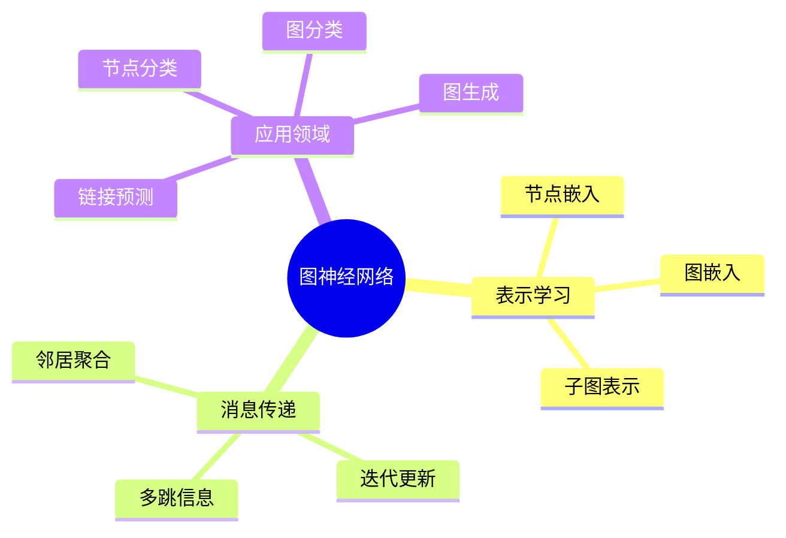

# 图神经网络与谱图理论

> 图神经网络(GNN)将深度学习扩展到非欧几里得结构数据，谱图理论为其提供了坚实的数学基础，在社交网络、分子设计、推荐系统等领域展现出强大能力。

---

## 一、问题背景

### 1.1 图数据的重要性

| 应用领域 | 图结构 | 节点/边含义 |
|---------|--------|-----------|
| 社交网络 | 用户关系图 | 用户/关注关系 |
| 分子化学 | 分子图 | 原子/化学键 |
| 知识图谱 | 实体关系图 | 实体/关系 |
| 推荐系统 | 用户-物品图 | 用户、物品/交互 |
| 计算机视觉 | 场景图 | 物体/空间关系 |
| 交通网络 | 路网图 | 路口/道路 |

### 1.2 图神经网络的优势



---

## 二、数学模型建立

### 2.1 图的基本表示

**图定义：**

$$G = (V, E, A)$$

其中：
- $V$：节点集合，$|V| = n$
- $E$：边集合
- $A \in \mathbb{R}^{n \times n}$：邻接矩阵

**拉普拉斯矩阵：**

$$L = D - A$$

其中 $D$ 为度矩阵，$D_{ii} = \sum_j A_{ij}$

**归一化拉普拉斯：**

$$L_{sym} = D^{-1/2} L D^{-1/2} = I - D^{-1/2} A D^{-1/2}$$

**随机游走拉普拉斯：**

$$L_{rw} = D^{-1} L = I - D^{-1} A$$

### 2.2 谱图理论基础

**特征分解：**

$$L = U \Lambda U^T$$

其中：
- $\Lambda = \text{diag}(\lambda_1, ..., \lambda_n)$，$0 = \lambda_1 \leq \lambda_2 \leq ... \leq \lambda_n$
- $U$：特征向量矩阵

**图谱的意义：**
- $\lambda_2$（代数连通度）：图的连通性
- 特征向量：傅里叶基

**图傅里叶变换：**

$$\hat{x} = U^T x$$
$$x = U \hat{x}$$

### 2.3 谱域图卷积

**谱卷积定义：**

$$x *_G g = U g_\theta U^T x$$

其中 $g_\theta$ 为滤波器。

**ChebyNet近似：**

$$g_\theta(L) \approx \sum_{k=0}^{K-1} \theta_k T_k(\tilde{L})$$

其中 $T_k$ 为Chebyshev多项式，$\tilde{L} = 2L/\lambda_{max} - I$

---

## 三、理论分析与推导

### 3.1 消息传递框架

**一般形式：**

$$h_i^{(l+1)} = \text{UPDATE}\left(h_i^{(l)}, \text{AGGREGATE}\left(\{h_j^{(l)}: j \in \mathcal{N}(i)\}\right)\right)$$

**常用聚合函数：**

| 方法 | 聚合函数 | 特点 |
|-----|---------|------|
| GCN | Mean | 简单高效 |
| GraphSAGE | Mean/Max/LSTM | 归纳学习 |
| GAT | Attention | 自适应权重 |
| GIN | Sum | 表达能力最强 |

### 3.2 图注意力网络(GAT)

**注意力机制：**

$$e_{ij} = \text{LeakyReLU}(a^T [Wh_i \| Wh_j])$$

$$\alpha_{ij} = \frac{\exp(e_{ij})}{\sum_{k \in \mathcal{N}(i)} \exp(e_{ik})}$$

**多头注意力：**

$$h_i' = \|_{k=1}^K \sigma\left(\sum_{j \in \mathcal{N}(i)} \alpha_{ij}^k W^k h_j\right)$$

### 3.3 Python实现

```python
import numpy as np
import matplotlib.pyplot as plt
import networkx as nx

class GraphNeuralNetwork:
    """图神经网络基础实现"""
    
    def __init__(self, adj_matrix, features):
        """
        adj_matrix: 邻接矩阵 (n x n)
        features: 节点特征 (n x d)
        """
        self.A = adj_matrix
        self.X = features
        self.n_nodes = adj_matrix.shape[0]
        
        # 计算拉普拉斯矩阵
        self.D = np.diag(np.sum(adj_matrix, axis=1))
        self.L = self.D - self.A
        
        # 归一化拉普拉斯
        D_inv_sqrt = np.diag(1.0 / np.sqrt(np.sum(adj_matrix, axis=1) + 1e-8))
        self.L_sym = D_inv_sqrt @ self.L @ D_inv_sqrt
    
    def graph_fourier_transform(self, x):
        """图傅里叶变换"""
        eigenvalues, eigenvectors = np.linalg.eigh(self.L_sym)
        self.U = eigenvectors
        self.lambdas = eigenvalues
        return self.U.T @ x
    
    def inverse_gft(self, x_hat):
        """逆图傅里叶变换"""
        return self.U @ x_hat
    
    def spectral_convolution(self, x, filter_coeffs):
        """谱域图卷积"""
        # x: (n, d_in), filter_coeffs: 滤波器系数
        x_hat = self.graph_fourier_transform(x)
        
        # 频域滤波
        filtered = x_hat * filter_coeffs.reshape(-1, 1)
        
        return self.inverse_gft(filtered)
    
    def gcn_layer(self, X, W, activation=np.relu):
        """GCN层"""
        # 归一化邻接矩阵: A_hat = D^{-1/2} (A + I) D^{-1/2}
        A_tilde = self.A + np.eye(self.n_nodes)
        D_tilde = np.diag(np.sum(A_tilde, axis=1))
        D_inv_sqrt = np.diag(1.0 / np.sqrt(np.diag(D_tilde) + 1e-8))
        A_hat = D_inv_sqrt @ A_tilde @ D_inv_sqrt
        
        # GCN传播: H = activation(A_hat X W)
        Z = A_hat @ X @ W
        return activation(Z)

# 创建示例图
np.random.seed(42)

# Karate Club图
G = nx.karate_club_graph()
n_nodes = G.number_of_nodes()
A = nx.adjacency_matrix(G).toarray().astype(float)

# 节点特征（度特征+随机特征）
degrees = np.array([G.degree(i) for i in range(n_nodes)])
X = np.column_stack([
    degrees,
    np.random.randn(n_nodes),
    np.random.randn(n_nodes)
])

# 创建GNN
gnn = GraphNeuralNetwork(A, X)

# 可视化
fig, axes = plt.subplots(1, 3, figsize=(18, 5))

# 原始图
pos = nx.spring_layout(G, seed=42)
node_colors = [G.nodes[i]['club'] == 'Mr. Hi' for i in G.nodes()]
nx.draw(G, pos, ax=axes[0], node_color=node_colors, cmap='coolwarm',
        node_size=300, with_labels=True, font_size=8)
axes[0].set_title('Karate Club网络')

# 拉普拉斯特征值
axes[1].plot(gnn.lambdas, 'bo-', markersize=6)
axes[1].set_xlabel('特征值序号')
axes[1].set_ylabel('特征值')
axes[1].set_title('拉普拉斯特征值谱')
axes[1].grid(True)

# GCN前向传播示例
W1 = np.random.randn(3, 4) * 0.01
H1 = gnn.gcn_layer(X, W1)

# 可视化第一层表示（用PCA降维到2D）
from sklearn.decomposition import PCA
pca = PCA(n_components=2)
H1_2d = pca.fit_transform(H1)

scatter = axes[2].scatter(H1_2d[:, 0], H1_2d[:, 1], c=node_colors, cmap='coolwarm', s=100)
axes[2].set_xlabel('PC1')
axes[2].set_ylabel('PC2')
axes[2].set_title('GCN第一层输出 (PCA投影)')
axes[2].grid(True)

plt.tight_layout()
plt.savefig('gnn_basics.png', dpi=150)
plt.show()

print("图神经网络基础分析:")
print(f"  节点数: {n_nodes}")
print(f"  边数: {G.number_of_edges()}")
print(f"  代数连通度 λ₂: {gnn.lambdas[1]:.4f}")
print(f"  最大特征值: {gnn.lambdas[-1]:.4f}")
print(f"  GCN输出维度: {H1.shape}")
```

---

## 四、数值实验

### 4.1 图滤波可视化

```python
def visualize_graph_filtering():
    """可视化图滤波效果"""
    
    # 创建网格图
    G_grid = nx.grid_2d_graph(10, 10)
    G_grid = nx.convert_node_labels_to_integers(G_grid)
    A_grid = nx.adjacency_matrix(G_grid).toarray().astype(float)
    
    n_nodes = A_grid.shape[0]
    gnn_grid = GraphNeuralNetwork(A_grid, np.zeros((n_nodes, 1)))
    
    # 创建脉冲信号（中心节点）
    signal = np.zeros(n_nodes)
    center = 55  # 中心节点
    signal[center] = 1.0
    
    # 不同阶数的Chebyshev滤波
    fig, axes = plt.subplots(2, 3, figsize=(15, 10))
    axes = axes.flatten()
    
    for idx, K in enumerate([0, 1, 2, 3, 5, 10]):
        if K == 0:
            filtered = signal.copy()
            title = '原始信号'
        else:
            # 简单低通滤波（扩散）
            filtered = signal.copy()
            A_norm = A_grid / (np.sum(A_grid, axis=1, keepdims=True) + 1e-8)
            current = signal.copy()
            for _ in range(K):
                current = A_norm @ current
            filtered = current
            title = f'{K}阶扩散'
        
        # 将信号reshape为网格
        grid_signal = filtered.reshape(10, 10)
        
        im = axes[idx].imshow(grid_signal, cmap='hot', interpolation='nearest')
        axes[idx].set_title(title)
        axes[idx].axis('off')
        plt.colorbar(im, ax=axes[idx], fraction=0.046, pad=0.04)
    
    plt.suptitle('图上的信号扩散（低通滤波）', fontsize=14)
    plt.tight_layout()
    plt.savefig('graph_filtering.png', dpi=150)
    plt.show()

visualize_graph_filtering()
```

### 4.2 图同构测试

```python
def graph_isomorphism_demo():
    """演示图同构与GNN表达能力"""
    
    # 创建两个不同但WL测试可能难以区分的图
    # 图1: 两个三角形
    G1 = nx.Graph()
    G1.add_edges_from([(0,1), (1,2), (2,0), (3,4), (4,5), (5,3), (0,3)])
    
    # 图2: 六边形
    G2 = nx.Graph()
    G2.add_edges_from([(0,1), (1,2), (2,3), (3,4), (4,5), (5,0)])
    
    fig, axes = plt.subplots(1, 2, figsize=(12, 5))
    
    # 绘制图1
    pos1 = nx.spring_layout(G1, seed=42)
    nx.draw(G1, pos1, ax=axes[0], with_labels=True, node_color='lightblue',
            node_size=500, font_size=10, font_weight='bold')
    axes[0].set_title('图1: 两个三角形')
    
    # 绘制图2
    pos2 = nx.spring_layout(G2, seed=42)
    nx.draw(G2, pos2, ax=axes[1], with_labels=True, node_color='lightgreen',
            node_size=500, font_size=10, font_weight='bold')
    axes[1].set_title('图2: 六边形')
    
    plt.tight_layout()
    plt.savefig('graph_isomorphism.png', dpi=150)
    plt.show()
    
    # WL测试
    print("\nWL图同构测试:")
    print(f"  图1节点数: {G1.number_of_nodes()}, 边数: {G1.number_of_edges()}")
    print(f"  图2节点数: {G2.number_of_nodes()}, 边数: {G2.number_of_edges()}")
    print(f"  度数序列图1: {sorted([d for n, d in G1.degree()])}")
    print(f"  度数序列图2: {sorted([d for n, d in G2.degree()])}")
    print(f"  是否同构: {nx.is_isomorphic(G1, G2)}")

graph_isomorphism_demo()
```

---

## 五、模型结构流程图

```mermaid
flowchart TD
    A[图数据 G=(V,E,X)] --> B[图编码]
    B --> C[消息传递]
    
    C --> C1[邻居聚合]
    C1 --> C2[特征更新]
    C2 --> C3{多层?}
    
    C3 -->|是| C
    C3 -->|否| D[图读出]
    
    D --> D1[节点表示]
    D --> D2[图表示]
    D --> D3[子图表示]
    
    D --> E[下游任务]
    E --> E1[节点分类]
    E --> E2[链接预测]
    E --> E3[图分类]
    E --> E4[图生成]
    
    E --> F[损失计算]
    F --> G[反向传播]
    G --> H[参数更新]
    H --> C
```

---

## 六、相关数学概念

- [图论](../09-组合数学与离散数学/图论.md) - 图的结构理论
- [谱图理论](../02-代数学/矩阵分析.md) - 图谱分析
- [线性代数](../02-代数学/线性代数基础.md) - 矩阵计算
- [傅里叶分析](../03-分析学/傅里叶分析.md) - 图傅里叶变换
- [机器学习](../29-数据科学/) - 表示学习
- [随机游走](../06-概率统计/马尔可夫链.md) - 图上的随机过程

---

> **图神经网络实践提示**：
> - 图归一化对性能影响很大，常用对称归一化
> - 深层GNN可能面临过平滑问题，需适当设计
> - 注意力机制可以提高对重要邻居的关注
> - 对于大图，考虑使用采样或聚类方法
> - 图数据增强可以提高模型泛化能力
