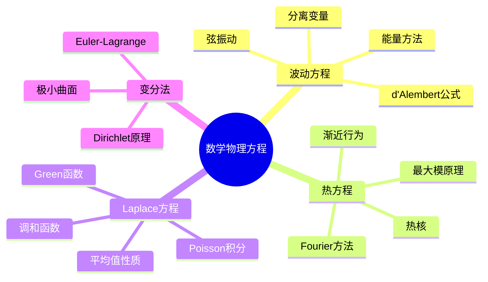

# 数学物理方程习题精解

---

## 1. 波动方程

### 习题1：弦振动方程的分离变量法

**题目**：求解波动方程初边值问题：
$$\begin{cases} u_{tt} = c^2 u_{xx}, & 0 < x < L, t > 0 \\ u(0,t) = u(L,t) = 0 \\ u(x,0) = f(x), u_t(x,0) = g(x) \end{cases}$$

**解答**：

**步骤1：分离变量**

设 $u(x,t) = X(x)T(t)$，代入方程：
$$X T'' = c^2 X'' T$$
$$\frac{T''}{c^2 T} = \frac{X''}{X} = -\lambda$$

**步骤2：空间方程**
$$X'' + \lambda X = 0, \quad X(0) = X(L) = 0$$

特征值：$\lambda_n = (\frac{n\pi}{L})^2$，特征函数：$X_n(x) = \sin(\frac{n\pi x}{L})$

**步骤3：时间方程**
$$T_n'' + (\frac{n\pi c}{L})^2 T_n = 0$$
$$T_n(t) = A_n \cos(\frac{n\pi c t}{L}) + B_n \sin(\frac{n\pi c t}{L})$$

**步骤4：叠加与系数**
$$u(x,t) = \sum_{n=1}^\infty \left[A_n \cos(\frac{n\pi c t}{L}) + B_n \sin(\frac{n\pi c t}{L})\right] \sin(\frac{n\pi x}{L})$$

由初值：
$$A_n = \frac{2}{L} \int_0^L f(x) \sin(\frac{n\pi x}{L}) dx$$
$$B_n = \frac{2}{n\pi c} \int_0^L g(x) \sin(\frac{n\pi x}{L}) dx$$

∎

---

### 习题2：d'Alembert公式

**题目**：用d'Alembert公式求解初值问题：
$$\begin{cases} u_{tt} = c^2 u_{xx}, & x \in \mathbb{R}, t > 0 \\ u(x,0) = \phi(x), u_t(x,0) = \psi(x) \end{cases}$$

**解答**：

**d'Alembert公式**：
$$u(x,t) = \frac{\phi(x+ct) + \phi(x-ct)}{2} + \frac{1}{2c} \int_{x-ct}^{x+ct} \psi(s) ds$$

**验证**：

- **初值**：$t=0$ 时
  $$u(x,0) = \frac{\phi(x) + \phi(x)}{2} + 0 = \phi(x)$$
  $$u_t(x,0) = \frac{c\phi'(x) - c\phi'(x)}{2} + \frac{1}{2c}(c\psi(x) + c\psi(x)) = \psi(x)$$

- **方程**：直接计算验证 $u_{tt} = c^2 u_{xx}$

**物理意义**：

- $\frac{\phi(x+ct) + \phi(x-ct)}{2}$：初始位移分裂为左右传播波
- $\frac{1}{2c} \int_{x-ct}^{x+ct} \psi(s) ds$：初始速度的影响

∎

---

## 2. 热传导方程

### 习题3：热方程的Fourier变换解法

**题目**：求解初值问题：
$$\begin{cases} u_t = k u_{xx}, & x \in \mathbb{R}, t > 0 \\ u(x,0) = f(x) \end{cases}$$

**解答**：

**Fourier变换**：
设 $\hat{u}(\xi, t) = \int_{-\infty}^\infty u(x,t) e^{-i\xi x} dx$

方程变为：
$$\frac{\partial \hat{u}}{\partial t} = -k\xi^2 \hat{u}$$
$$\hat{u}(\xi, t) = \hat{f}(\xi) e^{-k\xi^2 t}$$

**逆变换**：
$$u(x,t) = \frac{1}{2\pi} \int_{-\infty}^\infty \hat{f}(\xi) e^{-k\xi^2 t} e^{i\xi x} d\xi$$

**卷积形式**（热核）：
$$u(x,t) = \int_{-\infty}^\infty f(y) G(x-y, t) dy$$

其中热核：
$$G(x,t) = \frac{1}{\sqrt{4\pi k t}} e^{-\frac{x^2}{4kt}}$$

**性质**：

- $G_t = k G_{xx}$（热核满足热方程）
- $\int_{-\infty}^\infty G(x,t) dx = 1$（质量守恒）

∎

---

### 习题4：最大模原理

**题目**：设 $u$ 在有界区域 $D \subset \mathbb{R}^n \times [0,T]$ 上满足热方程 $u_t = \Delta u$。证明：
$$\max_{\bar{D}} u = \max_{\partial_p D} u$$

其中 $\partial_p D$ 是抛物边界。

**解答**：

**反证法**：

设 $M = \max_{\bar{D}} u$，$m = \max_{\partial_p D} u$，假设 $M > m$。

设 $(x_0, t_0)$ 是内点使 $u(x_0, t_0) = M$。

在该点：

- $\nabla u = 0$，$\Delta u \leq 0$（极大值）
- $u_t \geq 0$（若 $t_0 < T$，需 $u_t = 0$；若考虑最大值首次达到，矛盾）

故 $u_t - \Delta u \geq 0$，但方程要求 $= 0$，故 $u_t = \Delta u = 0$。

通过扰动论证可得矛盾。

**物理意义**：热量不会在内点累积达到最大，最大值必在边界或初始时刻达到。∎

---

## 3. Laplace方程与调和函数

### 习题5：Poisson积分公式

**题目**：求解圆盘上的Dirichlet问题：
$$\begin{cases} \Delta u = 0, & x^2 + y^2 < R^2 \\ u = f, & x^2 + y^2 = R^2 \end{cases}$$

**解答**：

**Poisson积分公式**（极坐标）：
$$u(r, \theta) = \frac{1}{2\pi} \int_0^{2\pi} \frac{R^2 - r^2}{R^2 - 2Rr\cos(\theta-\phi) + r^2} f(\phi) d\phi$$

或等价地：
$$u(r, \theta) = \sum_{n=0}^\infty \left(\frac{r}{R}\right)^n (a_n \cos n\theta + b_n \sin n\theta)$$

其中：
$$a_n = \frac{1}{\pi} \int_0^{2\pi} f(\phi) \cos n\phi d\phi$$
$$b_n = \frac{1}{\pi} \int_0^{2\pi} f(\phi) \sin n\phi d\phi$$

**验证调和性**：
在极坐标下，$\Delta u = u_{rr} + \frac{1}{r}u_r + \frac{1}{r^2}u_{\theta\theta}$

直接计算验证每一项满足调和方程。∎

---

### 习题6：平均值性质

**题目**：证明调和函数满足球面平均值和体积平均值性质。

**解答**：

**球面平均值**：设 $u$ 在 $B_R(x_0)$ 上调和，则：
$$u(x_0) = \frac{1}{|\partial B_R|} \int_{\partial B_R(x_0)} u(y) dS(y)$$

**证明**：由Poisson公式或直接验证 $u(x_0)$ 等于平均值。

**体积平均值**：
$$u(x_0) = \frac{1}{|B_R|} \int_{B_R(x_0)} u(y) dy$$

由球面平均值积分得体积平均值。

**逆定理**：满足平均值性质的连续函数必调和（证明用Poisson核的卷积）。∎

---

## 4. 变分法

### 习题7：Euler-Lagrange方程

**题目**：推导泛函 $J[u] = \int_a^b F(x, u, u') dx$ 的Euler-Lagrange方程。

**解答**：

**变分**：设 $u_\varepsilon = u + \varepsilon \eta$，$\eta(a) = \eta(b) = 0$

$$\frac{d}{d\varepsilon} J[u_\varepsilon]\big|_{\varepsilon=0} = 0$$

**计算**：
$$\int_a^b \left(\frac{\partial F}{\partial u} \eta + \frac{\partial F}{\partial u'} \eta'\right) dx = 0$$

分部积分：
$$\int_a^b \left(\frac{\partial F}{\partial u} - \frac{d}{dx}\frac{\partial F}{\partial u'}\right) \eta dx = 0$$

由 $\eta$ 任意性：
$$\frac{\partial F}{\partial u} - \frac{d}{dx}\frac{\partial F}{\partial u'} = 0$$

**Euler-Lagrange方程**：
$$\frac{\partial F}{\partial u} = \frac{d}{dx}\frac{\partial F}{\partial u'}$$

∎

---

## 5. 思维导图：数学物理方程知识体系

---

## 参考文献

1. Evans, L.C. *Partial Differential Equations*.
2. Strauss, W.A. *Partial Differential Equations: An Introduction*.
3. John, F. *Partial Differential Equations*.
4. 谷超豪等. *数学物理方程*.

---

*本文档为数学物理方程核心习题精解*
*质量等级：A（系统性+物理直观）*
