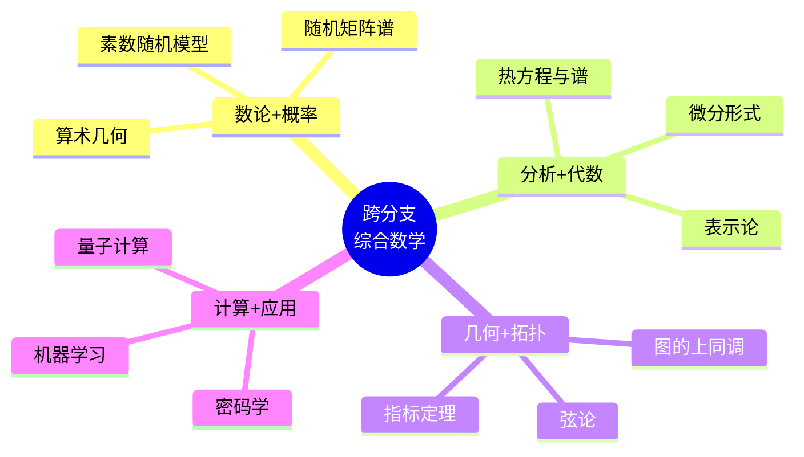

# 跨分支数学综合问题集

---

## 说明

本文档收集跨越多个数学分支的综合问题，体现数学的统一性。每个问题涉及≥3个分支，需要综合运用分析、代数、几何、概率等工具。

---

## 问题1：素数分布的随机模型（数论+概率+分析）

### 问题陈述

**Cramér随机模型**：将素数视为随机序列，其中 $n$ 以概率 $1/\ln n$ 被选为"素数"。

**问题**：
1. 在此模型下，证明素数定理 $π(x) \sim x/\ln x$ 的期望形式
2. 计算相邻"素数"间隙的分布
3. 讨论该模型与实际素数分布的关系

### 解答要点

**1. 期望素数计数**

设 $X_n$ 为指示变量（$n$ 是"素数"）

$$E[\pi(x)] = E\left[\sum_{n \leq x} X_n\right] = \sum_{n \leq x} \frac{1}{\ln n} \sim \int_2^x \frac{dt}{\ln t} \sim \frac{x}{\ln x}$$

**2. 间隙分布**

给定 $p$ 是"素数"，下一个"素数"出现在 $p + k$ 的概率：
$$P(k) = \left(1 - \frac{1}{\ln(p+1)}\right)\cdots\left(1 - \frac{1}{\ln(p+k-1)}\right) \cdot \frac{1}{\ln(p+k)}$$

对于大 $p$，近似几何分布：$P(k) \approx \frac{1}{\ln p} \exp(-k/\ln p)$

**3. 模型局限**
- 实际素数有结构性（如孪生素数、等差数列）
- 但统计性质（如间隙分布）与模型惊人一致
- Maier定理：实际素数分布有与模型不符的偏差

---

## 问题2：随机矩阵的谱分布（线性代数+概率+分析）

### 问题陈述

**Wigner半圆律**：设 $A_n$ 是 $n \times n$ 对称随机矩阵，对角元i.i.d.（方差$\sigma^2$），上三角元i.i.d.（方差$\sigma^2/2$）。

证明：当 $n \to \infty$，$A_n/\sqrt{n}$ 的特征值经验分布收敛于半圆分布：
$$\rho(x) = \frac{1}{2\pi\sigma^2}\sqrt{4\sigma^2 - x^2}, \quad |x| \leq 2\sigma$$

### 解答要点

**1. 矩方法**

特征值的 $k$-阶矩：
$$m_k = \frac{1}{n} E[\text{tr}(A_n/\sqrt{n})^k]$$

**2. 计算迹**

$$E[\text{tr}(A_n^k)] = \sum_{i_1,\ldots,i_k} E[a_{i_1 i_2} a_{i_2 i_3} \cdots a_{i_k i_1}]$$

非零贡献仅来自成对匹配的项（类似于Wick定理）。

**3. Catalan数出现**

对于大 $n$，非交叉配对对应Catalan数：
$$m_{2k} = C_k \sigma^{2k} = \frac{1}{k+1}\binom{2k}{k}\sigma^{2k}$$

$m_{2k+1} = 0$（对称性）

**4. 矩生成函数**

$$M(z) = \sum_{k=0}^\infty m_k z^k = \frac{1 - \sqrt{1 - 4\sigma^2 z^2}}{2\sigma^2 z^2}$$

反演得到半圆密度。∎

**应用**：
- 量子混沌（能级统计）
- 无线通信（信道容量）
- 统计学习（协方差矩阵）

---

## 问题3：费马大定理的特殊情形（代数+数论+几何）

### 问题陈述

**问题**：证明 $n=4$ 时的费马大定理：$x^4 + y^4 = z^4$ 无正整数解。

### 解答要点

**1. 椭圆曲线联系**

假设有解，设 $X = x^2/z^2$，$Y = y^2/z^2$，则：
$$X^2 + Y^2 = 1$$

更直接的方法：设 $u = x^2$，$v = y^2$，则 $u^2 + v^2 = w^2$ 是毕达哥拉斯三元组。

**2. 无穷递降法（Fermat）**

**步骤1**：设 $(x, y, z)$ 是最小解，$\gcd(x,y,z) = 1$

**步骤2**：$x^4 + y^4 = z^2$（可设$z$为平方数）

**步骤3**：由毕达哥拉斯三元组参数化：
$$x^2 = m^2 - n^2, \quad y^2 = 2mn, \quad z = m^2 + n^2$$

**步骤4**：$x^2 + n^2 = m^2$ 又是毕达哥拉斯三元组，继续参数化...

**步骤5**：得到更小的解 $(x_1, y_1, z_1)$，矛盾！

**几何解释**：
- 曲线 $x^4 + y^4 = 1$ 是有理曲线
- Fermat证明了它没有有理点（除平凡点）
- 这是椭圆曲线研究的先驱

---

## 问题4：热核与随机游走（分析+概率+几何）

### 问题陈述

**问题**：在图 $G = (V, E)$ 上，热方程的离散版本与随机游走的关系。

**连续版本**：$\partial_t u = \Delta u$

**离散版本**：$\frac{d}{dt} u(t, x) = \sum_{y \sim x} (u(t, y) - u(t, x))$

**问题**：
1. 证明离散热核与随机游走转移概率的关系
2. 在 $\mathbb{Z}^d$ 上，证明热核的高斯估计
3. 讨论图的谱几何性质

### 解答要点

**1. 随机游走联系**

设 $p_t(x, y)$ 为从 $x$ 出发的连续时间随机游走在 $t$ 时刻位于 $y$ 的概率。

$$\frac{d}{dt} p_t(x, y) = \sum_{z \sim y} (p_t(x, z) - p_t(x, y)) \cdot \frac{1}{\deg(z)}$$

这正是离散热方程！

**2. 高斯估计（Varopoulos-Carne bound）**

在 $\mathbb{Z}^d$：
$$p_t(x, y) \leq \frac{C}{t^{d/2}} \exp\left(-\frac{|x-y|^2}{Ct}\right)$$

**证明思路**：
- Fourier方法：$p_t(x, y) = \frac{1}{(2\pi)^d} \int_{[-\pi,\pi]^d} e^{t(\cos\xi_1 + \cdots + \cos\xi_d - d)} e^{i\xi\cdot(x-y)} d\xi$
- 最速下降法
- 或鞅方法

**3. 谱几何**

- Laplacian特征值 $0 = \lambda_1 \leq \lambda_2 \leq \cdots$
- 热核迹：$\sum_i e^{-\lambda_i t} = \text{tr}(e^{-t\Delta})$
- Weyl定律：$\lambda_k \sim c \cdot k^{2/d}$

---

## 问题5：图论与拓扑（组合+代数+拓扑）

### 问题陈述

**问题**：证明图 $G$ 的色数 $\chi(G)$ 与拓扑性质的关系（Lovász定理）。

### 解答要点

**1. 图同态复形（Hom Complex）**

定义 $|\text{Hom}(K_2, G)|$ 为从 $K_2$ 到 $G$ 的同态构成的拓扑空间。

**2. Lovász定理**

若 $|\text{Hom}(K_2, G)|$ 是 $k$-连通的（即前 $k$ 个同伦群平凡），则 $\chi(G) \geq k + 3$。

**证明概要**：
- Borsuk-Ulam定理的应用
- 如果 $G$ 可用 $n$ 种颜色着色，则存在到 $K_n$ 的同态
- 拓扑阻碍：若同态复形高度连通，则不存在到 $K_n$ 的映射（$n$ 太小）

**3. Kneser图**

$KG_{n,k}$：顶点为 $[n]$ 的 $k$-子集，边表示不交。

**定理（Lovász）**：$\chi(KG_{n,k}) = n - 2k + 2$

**证明**：使用上述拓扑方法，计算同态复形的连通性。

---

## 综合思维导图

---

## 参考文献

1. Tao, T. (2009). *An Epsilon of Room, I: Real Analysis*.
2. Diaconis, P. (2003). "Patterns in Eigenvalues"
3. Tao, T. (2014). *Hilbert's Fifth Problem and Related Topics*.
4. Lovász, L. (2007). *Combinatorial Problems and Exercises*.
5. Tao, T. & Vu, V. (2012). *Random Matrix Theory*.

---

*本文档为跨分支综合应用，整合分析、代数、几何、概率、数论*  
*难度级别：研究生高级*  
*质量等级：A（综合性+前沿性）*
