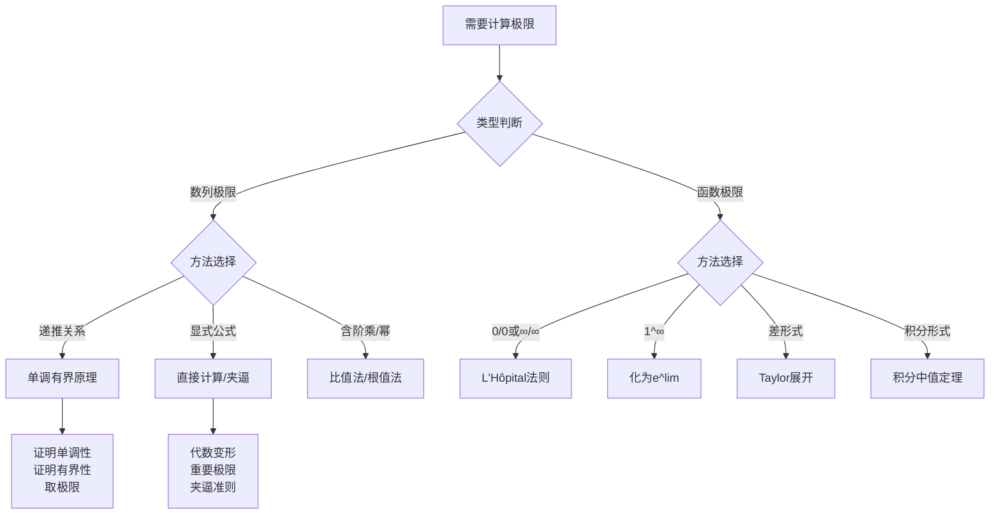
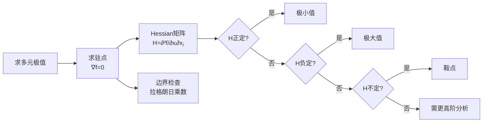
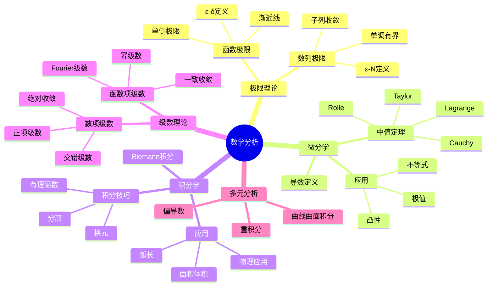

# 数学分析技巧与解题策略

---

## 说明

本文档系统梳理数学分析中的核心解题技巧，提供决策树和策略矩阵，帮助学习者建立系统的解题思维。

---

## 1. 极限计算决策树



---

## 2. 连续性证明策略矩阵

| 情形 | 策略 | 关键定理 | 示例 |
|-----|------|---------|------|
| **点连续** | ε-δ定义 | $|x-a|<\delta \Rightarrow |f(x)-f(a)|<\epsilon$ | 多项式、指数函数 |
| **区间连续** | 每点连续 | 四则运算保持连续性 | 有理函数（分母非零） |
| **一致连续** | Cantor定理 | 闭区间+连续 ⟹ 一致连续 | $[a,b]$上的连续函数 |
| **间断点分类** | 左右极限 | 可去/跳跃/第二类 | 分段函数 |

---

## 3. 微分中值定理应用模式

### 3.1 证明等式/不等式

**模式识别**：

| 待证形式 | 选择定理 | 辅助函数构造 |
|---------|---------|-------------|
| $f'(c) = k$ | Lagrange中值 | $g(x) = f(x) - kx$ |
| $f'(c) = 0$ | Rolle定理 | 直接使用 $f$ |
| $\frac{f'(c)}{g'(c)} = k$ | Cauchy中值 | 直接使用 $f, g$ |
| $f^{(n)}(c) = 0$ | 多次Rolle | 逐次应用中值定理 |

### 3.2 典型例题

**例题1**：设 $f$ 在 $[0,1]$ 二阶可导，$f(0)=f(1)=0$，$\min f = -1$。证明存在 $c$ 使 $f''(c) \geq 8$。

**策略**：
1. 设最小值点在 $x_0$，则 $f(x_0) = -1$，$f'(x_0) = 0$
2. 在 $[0, x_0]$ 和 $[x_0, 1]$ 分别用Taylor展开
3. 得到两个等式，消去 $f'(x_0)$
4. 得到 $f''(c_1) + f''(c_2) = \frac{2}{x_0^2} + \frac{2}{(1-x_0)^2} \geq 16$
5. 因此至少一个 $\geq 8$

---

## 4. 积分计算技巧矩阵

| 被积函数特征 | 策略 | 公式/方法 |
|-------------|------|----------|
| $R(\sin x, \cos x)$ | 万能代换 | $t = \tan(x/2)$ |
| $R(x, \sqrt{ax^2+bx+c})$ | Euler代换 | 根据判别式选择 |
| $P(x)e^{ax}$ | 分部积分 | 表格法 |
| $e^{ax}\sin bx$ | 两次分部 | 解方程法 |
| 有理函数 | 部分分式 | Heaviside方法 |
| 对称区间 | 奇偶性 | $f_{even}$ 加倍，$f_{odd}$ 为零 |

---

## 5. 级数敛散性判定决策树

```mermaid
flowchart TD
    A[判断级数敛散性] --> B{级数类型}
    
    B -->|正项级数| C{比较对象}
    B -->|交错级数| D[Leibniz判别法]
    B -->|一般项级数| E{绝对收敛?}
    
    C -->|p级数| F[比较于∑1/n^p]
    C -->|几何级数| G[比较于∑r^n]
    C -->|含阶乘| H[比值法]
    C -->|含n次幂| I[根值法]
    
    D --> J{|aₙ|递减?<br/>aₙ→0?}
    
    E -->|是| K[判绝对收敛]
    E -->|否| L[Abel/Dirichlet判别法]
    
    F --> M[p>1收敛<br/>p≤1发散]
    G --> N{|r|<1收敛<br/>|r|≥1发散}
```

---

## 6. 一致收敛证明策略

| 待证目标 | 方法 | 关键技巧 |
|---------|------|---------|
| **逐点收敛** | 直接计算 | 对每个x求极限 |
| **一致收敛** | 上确界趋于0 | $\sup|f_n-f| \to 0$ |
| **内闭一致收敛** | Weierstrass M判别 | 找控制级数 |
| **不一致收敛** | 找反例点列 | $x_n$ 使 $|f_n(x_n)-f(x_n)| \not\to 0$ |

### 典型反例构造

**不一致收敛的经典例子**：
- $f_n(x) = x^n$ 在 $[0,1]$：在 $x_n = 1 - 1/n$ 处 $f_n(x_n) \to 1/e \neq 0$
- $f_n(x) = \frac{nx}{1+n^2x^2}$：在 $x_n = 1/n$ 处取最大值 $1/2$

---

## 7. 多元极值问题求解流程



---

## 8. 解题思维检查清单

### 8.1 开始前
- [ ] 明确问题类型（计算/证明/判断）
- [ ] 识别已知条件和待求目标
- [ ] 判断是否需要分类讨论

### 8.2 执行中
- [ ] 选择合适定理/公式
- [ ] 检查定理适用条件
- [ ] 考虑特殊情况/边界

### 8.3 验证时
- [ ] 结果合理性检查（量纲/极限情况）
- [ ] 能否用不同方法验证
- [ ] 反例检验（对否命题）

---

## 9. 常见错误与避免策略

| 错误类型 | 典型案例 | 避免策略 |
|---------|---------|---------|
| **条件遗漏** | L'Hôpital法则未验证0/0 | 先检验分子分母极限 |
| **范围扩大** | 积分变量替换未调限 | 明确上下限变化 |
| **一致性问题** | 极限与积分交换未验证 | 检查一致收敛条件 |
| **多值问题** | 复数开方取错分支 | 明确主值范围 |

---

## 10. 经典习题精讲

### 习题1：极限计算
计算 $\lim_{n\to\infty} \frac{1}{n} \sqrt[n]{n!}$

**解答**：
取对数：$\ln L = \lim \frac{1}{n} \sum_{k=1}^n \ln \frac{k}{n} = \int_0^1 \ln x dx = -1$

因此 $L = e^{-1} = 1/e$

### 习题2：不等式证明
证明 $e^x > 1 + x + \frac{x^2}{2}$ 对 $x > 0$

**解答**：
设 $f(x) = e^x - 1 - x - \frac{x^2}{2}$，则 $f(0) = 0$
$f'(x) = e^x - 1 - x > 0$（由 $e^x > 1+x$）
因此 $f$ 递增，$f(x) > f(0) = 0$

### 习题3：级数求和
求 $\sum_{n=1}^\infty \frac{1}{n^2}$

**解答**：
经典结果：$\frac{\pi^2}{6}$

证明思路：
- Fourier级数：$x^2$ 在 $[-\pi,\pi]$ 展开
- 或 $\sin x$ 的无穷乘积公式取对数展开

---

## 思维导图：分析学知识体系



---

## 参考文献

1. 裴礼文. *数学分析中的典型问题与方法*.
2. 谢惠民. *数学分析习题课讲义*.
3. Rudin, W. *Principles of Mathematical Analysis*.
4. 华罗庚. *高等数学引论*.

---

*本文档为解题策略指南，配合主线文档使用*  
*质量等级：A（实用性+系统性）*
