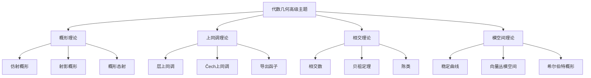

# 11.1 代数几何高级主题 / Advanced Topics in Algebraic Geometry

**主题编号**: B.11.01
**创建日期**: 2025年11月21日
**最后更新**: 2025年11月21日

---

## 目录

- [11.1 代数几何高级主题 / Advanced Topics in Algebraic Geometry](#111-代数几何高级主题--advanced-topics-in-algebraic-geometry)
  - [目录](#目录)
  - [11.1.1 概述 / Overview (编号: B.11.01.01)](#1111-概述--overview-编号-b110101)
    - [11.1.1.1 核心概念](#11111-核心概念)
  - [11.1.2 概形理论 / Scheme Theory (编号: B.11.01.02)](#1112-概形理论--scheme-theory-编号-b110102)
    - [11.1.2.1 仿射概形 / Affine Schemes](#11121-仿射概形--affine-schemes)
    - [11.1.2.2 射影概形 / Projective Schemes](#11122-射影概形--projective-schemes)
    - [11.1.2.3 概形态射 / Scheme Morphisms](#11123-概形态射--scheme-morphisms)
  - [11.1.3 上同调理论 / Cohomology Theory (编号: B.11.01.03)](#1113-上同调理论--cohomology-theory-编号-b110103)
    - [11.1.3.1 层上同调 / Sheaf Cohomology](#11131-层上同调--sheaf-cohomology)
    - [11.1.3.2 Čech上同调 / Čech Cohomology](#11132-čech上同调--čech-cohomology)
    - [11.1.3.3 导出函子 / Derived Functors](#11133-导出函子--derived-functors)
  - [11.1.4 相交理论 / Intersection Theory (编号: B.11.01.04)](#1114-相交理论--intersection-theory-编号-b110104)
    - [11.1.4.1 相交数 / Intersection Numbers](#11141-相交数--intersection-numbers)
    - [11.1.4.2 贝祖定理 / Bézout's Theorem](#11142-贝祖定理--bézouts-theorem)
    - [11.1.4.3 陈类 / Chern Classes](#11143-陈类--chern-classes)
  - [11.1.5 模空间 / Moduli Spaces (编号: B.11.01.05)](#1115-模空间--moduli-spaces-编号-b110105)
    - [11.1.5.1 稳定曲线 / Stable Curves](#11151-稳定曲线--stable-curves)
    - [11.1.5.2 向量丛模空间 / Vector Bundle Moduli](#11152-向量丛模空间--vector-bundle-moduli)
    - [11.1.5.3 希尔伯特概形 / Hilbert Schemes](#11153-希尔伯特概形--hilbert-schemes)
  - [11.1.6 形式化实现 / Formal Implementation (编号: B.11.01.06)](#1116-形式化实现--formal-implementation-编号-b110106)
    - [11.1.6.1 Lean 4 实现](#11161-lean-4-实现)
    - [11.1.6.2 Haskell 实现](#11162-haskell-实现)
  - [11.1.7 总结 / Summary](#1117-总结--summary)
    - [11.1.7.1 核心要点](#11171-核心要点)
    - [11.1.7.2 知识关联](#11172-知识关联)
    - [11.1.7.3 进一步学习](#11173-进一步学习)
    - [11.1.7.4 进一步阅读与扩展链接](#11174-进一步阅读与扩展链接)
  - [交互与补充资源 / Interactive \& Supplementary Resources](#交互与补充资源--interactive--supplementary-resources)
    - [交互式图表增强](#交互式图表增强)
    - [定理证明补充](#定理证明补充)
    - [反例与特殊情况补充](#反例与特殊情况补充)
    - [历史背景补充](#历史背景补充)

## 11.1.1 概述 / Overview (编号: B.11.01.01)

代数几何高级主题涵盖了现代代数几何的核心理论，包括概形理论、上同调理论、相交理论和模空间理论。
这些理论为现代数学提供了强大的工具和深刻的洞察。

### 11.1.1.1 核心概念



## 11.1.2 概形理论 / Scheme Theory (编号: B.11.01.02)

### 11.1.2.1 仿射概形 / Affine Schemes

**定义**: 设 $A$ 是一个交换环，$X = \text{Spec}(A)$ 是 $A$ 的素谱，配备扎里斯基拓扑。

**结构层**: $\mathcal{O}_X$ 是 $X$ 上的结构层，满足：
$$\mathcal{O}_X(U) = \lim_{\substack{\longleftarrow \\ f \in A, D(f) \subset U}} A_f$$

**形式化实现**:

```lean
-- Lean 4: 仿射概形定义
structure AffineScheme where
  ring : CommRing
  spectrum : Type := Spec ring
  topology : Topology spectrum := ZariskiTopology ring
  structure_sheaf : Sheaf spectrum CommRing := StructureSheaf ring

-- 结构层定义
def StructureSheaf (A : CommRing) : Sheaf (Spec A) CommRing where
  sections U := lim A_f where f ∈ A and D(f) ⊆ U
  restriction U V h := -- 限制映射实现
```

### 11.1.2.2 射影概形 / Projective Schemes

**定义**: 设 $S$ 是概形，$\mathcal{E}$ 是 $S$ 上的局部自由层，射影概形定义为：
$$\mathbb{P}(\mathcal{E}) = \text{Proj}(\text{Sym}(\mathcal{E}))$$

**性质**:

- 射影概形是分离的
- 射影概形是固有的
- 射影概形具有丰富的几何结构

### 11.1.2.3 概形态射 / Scheme Morphisms

**定义**: 概形之间的态射是保持结构层的连续映射。

**重要类型**:

1. **分离态射**: 对角映射是闭嵌入
2. **固有态射**: 既分离又紧致
3. **平坦态射**: 保持维数
4. **光滑态射**: 局部可微

## 11.1.3 上同调理论 / Cohomology Theory (编号: B.11.01.03)

### 11.1.3.1 层上同调 / Sheaf Cohomology

**定义**: 设 $X$ 是拓扑空间，$\mathcal{F}$ 是 $X$ 上的阿贝尔群层，上同调群定义为：
$$H^i(X, \mathcal{F}) = R^i\Gamma(X, \mathcal{F})$$

**性质**:

- $H^0(X, \mathcal{F}) = \Gamma(X, \mathcal{F})$
- 长正合序列
- 切除定理

### 11.1.3.2 Čech上同调 / Čech Cohomology

**定义**: 设 $\mathcal{U} = \{U_i\}$ 是 $X$ 的开覆盖，Čech复形定义为：
$$C^p(\mathcal{U}, \mathcal{F}) = \prod_{i_0 < \cdots < i_p} \mathcal{F}(U_{i_0} \cap \cdots \cap U_{i_p})$$

**微分**: $d^p: C^p \to C^{p+1}$ 定义为：
$$(d^p \alpha)_{i_0 \cdots i_{p+1}} = \sum_{k=0}^{p+1} (-1)^k \alpha_{i_0 \cdots \hat{i_k} \cdots i_{p+1}}$$

### 11.1.3.3 导出函子 / Derived Functors

**定义**: 设 $F: \mathcal{A} \to \mathcal{B}$ 是左正合函子，右导出函子定义为：
$$R^i F(A) = H^i(F(I^\bullet))$$
其中 $I^\bullet$ 是 $A$ 的内射分解。

## 11.1.4 相交理论 / Intersection Theory (编号: B.11.01.04)

### 11.1.4.1 相交数 / Intersection Numbers

**定义**: 设 $X$ 是光滑代数簇，$V, W$ 是 $X$ 的子簇，相交数定义为：
$$(V \cdot W)_p = \dim_k \mathcal{O}_{X,p}/(I_V + I_W)$$

**性质**:

- 双线性性
- 对称性
- 局部性

### 11.1.4.2 贝祖定理 / Bézout's Theorem

**定理**: 设 $C, D$ 是射影平面中的曲线，次数分别为 $d, e$，则：
$$\sum_{p \in C \cap D} (C \cdot D)_p = de$$

### 11.1.4.3 陈类 / Chern Classes

**定义**: 设 $E$ 是向量丛，陈类定义为：
$$c(E) = 1 + c_1(E) + c_2(E) + \cdots$$

**性质**:

- 自然性
- 惠特尼求和公式
- 分裂原理

## 11.1.5 模空间 / Moduli Spaces (编号: B.11.01.05)

### 11.1.5.1 稳定曲线 / Stable Curves

**定义**: 设 $C$ 是代数曲线，$C$ 是稳定的当且仅当：

1. $C$ 是约化的
2. $C$ 的奇点都是节点
3. 每个不可约分支的亏格至少为2，或者有至少3个标记点

**模空间**: $\overline{\mathcal{M}}_{g,n}$ 是亏格 $g$ 有 $n$ 个标记点的稳定曲线的模空间。

### 11.1.5.2 向量丛模空间 / Vector Bundle Moduli

**定义**: 设 $X$ 是代数簇，$E$ 是 $X$ 上的向量丛，模空间 $\mathcal{M}(E)$ 参数化所有与 $E$ 同构的向量丛。

### 11.1.5.3 希尔伯特概形 / Hilbert Schemes

**定义**: 设 $X$ 是射影概形，希尔伯特概形 $\text{Hilb}_X$ 参数化 $X$ 的所有闭子概形。

## 11.1.6 形式化实现 / Formal Implementation (编号: B.11.01.06)

### 11.1.6.1 Lean 4 实现

```lean
-- 概形定义
structure Scheme where
  carrier : Type
  topology : Topology carrier
  structure_sheaf : Sheaf carrier CommRing
  local_affine : ∀ x, ∃ U, IsOpen U ∧ x ∈ U ∧ IsAffine U

-- 上同调群
def CohomologyGroup (X : TopologicalSpace) (F : Sheaf X AbGroup) (i : ℕ) : AbGroup :=
  DerivedFunctor i (GlobalSections X) F

-- 相交数
def IntersectionNumber {X : SmoothVariety} (V W : SubVariety X) (p : X) : ℕ :=
  dim (LocalRing X p / (Ideal V p + Ideal W p))
```

### 11.1.6.2 Haskell 实现

```haskell
-- 概形类型类
class Scheme s where
  carrier :: s -> Type
  topology :: s -> Topology (carrier s)
  structureSheaf :: s -> Sheaf (carrier s) CommRing

-- 上同调计算
cohomology :: (Scheme s, Sheaf s AbGroup) => s -> Sheaf s AbGroup -> Int -> AbGroup
cohomology space sheaf i = derivedFunctor i globalSections sheaf

-- 相交数计算
intersectionNumber :: SmoothVariety v => SubVariety v -> SubVariety v -> Point v -> Integer
intersectionNumber v w p = dimension (localRing p `quotient` (ideal v p + ideal w p))
```

## 11.1.7 总结 / Summary

### 11.1.7.1 核心要点

1. **概形理论** 为代数几何提供了统一的语言
2. **上同调理论** 提供了强大的计算工具
3. **相交理论** 建立了几何与代数的桥梁
4. **模空间理论** 参数化了几何对象的族

### 11.1.7.2 知识关联

- 与[代数几何](../04-几何学/05-代数几何.md)的基础理论相联系
- 与[同调论](../05-拓扑学/05-同调论.md)的理论框架相呼应
- 与[范畴论](../02-代数结构/范畴论/06-范畴论.md)的抽象方法相结合

### 11.1.7.3 进一步学习

1. **更高级的主题**:
   - 导出代数几何
   - 稳定映射理论
   - 镜像对称

2. **应用领域**:
   - 数论几何
   - 物理几何
   - 计算代数几何

### 11.1.7.4 进一步阅读与扩展链接

- 参见《代数几何：Serre 对偶 - 深度扩展》（docs/11-高级数学/代数几何-Serre对偶-深度扩展.md）
- 关联：层上同调、Riemann–Roch、Grothendieck–Riemann–Roch

---

**相关文档**:

- [代数几何](../04-几何学/05-代数几何.md)
- [同调论](../05-拓扑学/05-同调论.md)
- [范畴论](../02-代数结构/范畴论/06-范畴论.md)

---

## 交互与补充资源 / Interactive & Supplementary Resources

### 交互式图表增强

- [概形可视化器](../交互式图表增强-2025年1月.md#概形可视化器)
- [上同调计算器](../交互式图表增强-2025年1月.md#上同调计算器)
- [相交数可视化](../交互式图表增强-2025年1月.md#相交数可视化器)

### 定理证明补充

- [Serre对偶定理](../定理证明补充-2025年1月.md#Serre对偶定理)
- [Riemann-Roch定理](../定理证明补充-2025年1月.md#Riemann-Roch定理)
- [贝祖定理](../定理证明补充-2025年1月.md#贝祖定理)

### 反例与特殊情况补充

- [非射影概形反例](../反例与特殊情况补充-2025年1月.md#非射影概形反例)
- [病态相交情况](../反例与特殊情况补充-2025年1月.md#病态相交情况)
- [上同调消失反例](../反例与特殊情况补充-2025年1月.md#上同调消失反例)

### 历史背景补充

- [代数几何发展史](../历史背景补充-2025年1月.md#代数几何发展史)
- [Grothendieck贡献](../历史背景补充-2025年1月.md#Grothendieck贡献)
- [现代代数几何发展](../历史背景补充-2025年1月.md#现代代数几何发展)
