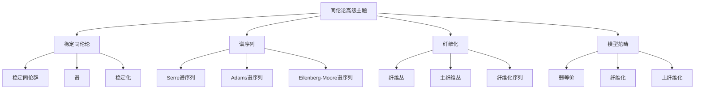

# 11.2 同伦论高级主题 / Advanced Topics in Homotopy Theory

**主题编号**: B.11.02
**创建日期**: 2025年11月21日
**最后更新**: 2025年11月21日

---

## 目录

- [11.2 同伦论高级主题 / Advanced Topics in Homotopy Theory](#112-同伦论高级主题--advanced-topics-in-homotopy-theory)
  - [目录](#目录)
  - [11.2.1 概述 / Overview (编号: B.11.02.01)](#1121-概述--overview-编号-b110201)
    - [11.2.1.1 核心概念](#11211-核心概念)
  - [11.2.2 稳定同伦论 / Stable Homotopy Theory (编号: B.11.02.02)](#1122-稳定同伦论--stable-homotopy-theory-编号-b110202)
    - [11.2.2.1 稳定同伦群 / Stable Homotopy Groups](#11221-稳定同伦群--stable-homotopy-groups)
    - [11.2.2.2 谱 / Spectra](#11222-谱--spectra)
    - [11.2.2.3 稳定化 / Stabilization](#11223-稳定化--stabilization)
  - [11.2.3 谱序列 / Spectral Sequences (编号: B.11.02.03)](#1123-谱序列--spectral-sequences-编号-b110203)
    - [11.2.3.1 Serre谱序列 / Serre Spectral Sequence](#11231-serre谱序列--serre-spectral-sequence)
    - [11.2.3.2 Adams谱序列 / Adams Spectral Sequence](#11232-adams谱序列--adams-spectral-sequence)
    - [11.2.3.3 Eilenberg-Moore谱序列 / Eilenberg-Moore Spectral Sequence](#11233-eilenberg-moore谱序列--eilenberg-moore-spectral-sequence)
  - [11.2.4 纤维化 / Fibrations (编号: B.11.02.04)](#1124-纤维化--fibrations-编号-b110204)
    - [11.2.4.1 纤维丛 / Fiber Bundles](#11241-纤维丛--fiber-bundles)
    - [11.2.4.2 主纤维丛 / Principal Fiber Bundles](#11242-主纤维丛--principal-fiber-bundles)
    - [11.2.4.3 纤维化序列 / Fibration Sequences](#11243-纤维化序列--fibration-sequences)
  - [11.2.5 模型范畴 / Model Categories (编号: B.11.02.05)](#1125-模型范畴--model-categories-编号-b110205)
    - [11.2.5.1 模型范畴定义 / Model Category Definition](#11251-模型范畴定义--model-category-definition)
    - [11.2.5.2 重要例子 / Important Examples](#11252-重要例子--important-examples)
    - [11.2.5.3 同伦极限 / Homotopy Limits](#11253-同伦极限--homotopy-limits)
  - [11.2.6 形式化实现 / Formal Implementation (编号: B.11.02.06)](#1126-形式化实现--formal-implementation-编号-b110206)
    - [11.2.6.1 Lean 4 实现](#11261-lean-4-实现)
    - [11.2.6.2 Haskell 实现](#11262-haskell-实现)
  - [11.2.7 总结 / Summary](#1127-总结--summary)
    - [11.2.7.1 核心要点](#11271-核心要点)
    - [11.2.7.2 知识关联](#11272-知识关联)
    - [11.2.7.3 进一步学习](#11273-进一步学习)
  - [交互与补充资源 / Interactive \& Supplementary Resources](#交互与补充资源--interactive--supplementary-resources)
    - [交互式图表增强](#交互式图表增强)
    - [定理证明补充](#定理证明补充)
    - [反例与特殊情况补充](#反例与特殊情况补充)
    - [历史背景补充](#历史背景补充)

## 11.2.1 概述 / Overview (编号: B.11.02.01)

同伦论高级主题涵盖了现代同伦论的核心理论，包括稳定同伦论、谱序列、纤维化和模型范畴理论。
这些理论为拓扑学和代数几何提供了强大的工具。

### 11.2.1.1 核心概念



## 11.2.2 稳定同伦论 / Stable Homotopy Theory (编号: B.11.02.02)

### 11.2.2.1 稳定同伦群 / Stable Homotopy Groups

**定义**: 设 $X$ 是拓扑空间，稳定同伦群定义为：
$$\pi_n^s(X) = \lim_{k \to \infty} \pi_{n+k}(\Sigma^k X)$$

**性质**:

- 满足弗洛伊登塔尔悬垂定理
- 具有丰富的代数结构
- 与谱理论密切相关

### 11.2.2.2 谱 / Spectra

**定义**: 谱是一个序列 $\{E_n\}_{n \in \mathbb{Z}}$ 和态射 $\sigma_n: \Sigma E_n \to E_{n+1}$，其中 $\Sigma$ 是悬垂函子。

**重要例子**:

1. **球谱**: $S = \{S^n\}_{n \geqqq 0}$
2. **Eilenberg-MacLane谱**: $H\mathbb{Z} = \{K(\mathbb{Z}, n)\}_{n \geqqq 0}$
3. **复配边谱**: $MU = \{MU_{2n}\}_{n \geqqq 0}$

### 11.2.2.3 稳定化 / Stabilization

**定义**: 设 $X$ 是拓扑空间，稳定化定义为：
$$\Sigma^\infty X = \{\Sigma^n X\}_{n \geqqq 0}$$

**性质**:

- 保持同伦类型
- 增加代数结构
- 简化计算

## 11.2.3 谱序列 / Spectral Sequences (编号: B.11.02.03)

### 11.2.3.1 Serre谱序列 / Serre Spectral Sequence

**定理**: 设 $F \to E \to B$ 是纤维化，则存在谱序列：
$$E_2^{p,q} = H^p(B; H^q(F)) \Rightarrow H^{p+q}(E)$$

**应用**:

- 计算纤维丛的同调群
- 研究群的上同调
- 分析代数几何中的层上同调

### 11.2.3.2 Adams谱序列 / Adams Spectral Sequence

**定理**: 设 $X, Y$ 是有限CW复形，则存在谱序列：
$$E_2^{s,t} = \text{Ext}_{\mathcal{A}}^{s,t}(H^*(Y), H^*(X)) \Rightarrow [X, Y]_t^s$$

**应用**:

- 计算稳定同伦群
- 研究球面之间的映射
- 分析谱的同伦群

### 11.2.3.3 Eilenberg-Moore谱序列 / Eilenberg-Moore Spectral Sequence

**定理**: 设 $F \to E \to B$ 是纤维化，$B$ 是单连通的，则存在谱序列：
$$E_2^{p,q} = \text{Tor}_p^{H^*(B)}(H^*(E), \mathbb{F}_p) \Rightarrow H^{p+q}(F)$$

## 11.2.4 纤维化 / Fibrations (编号: B.11.02.04)

### 11.2.4.1 纤维丛 / Fiber Bundles

**定义**: 纤维丛是一个映射 $p: E \to B$，满足局部平凡化条件。

**性质**:

- 具有提升性质
- 保持同伦类型
- 具有丰富的代数结构

### 11.2.4.2 主纤维丛 / Principal Fiber Bundles

**定义**: 设 $G$ 是李群，主 $G$-丛是一个纤维丛 $P \to B$，其中纤维是 $G$。

**性质**:

- 具有 $G$-作用
- 与向量丛密切相关
- 具有示性类理论

### 11.2.4.3 纤维化序列 / Fibration Sequences

**定义**: 纤维化序列是一个长正合序列：
$$\cdots \to \pi_n(F) \to \pi_n(E) \to \pi_n(B) \to \pi_{n-1}(F) \to \cdots$$

**应用**:

- 计算同伦群
- 研究纤维丛的性质
- 分析代数几何中的层

## 11.2.5 模型范畴 / Model Categories (编号: B.11.02.05)

### 11.2.5.1 模型范畴定义 / Model Category Definition

**定义**: 模型范畴是一个范畴 $\mathcal{C}$，配备三类态射：

- 弱等价 (weak equivalences)
- 纤维化 (fibrations)
- 上纤维化 (cofibrations)

**公理**:

1. **MC1**: 有限极限和余极限存在
2. **MC2**: 2-out-of-3性质
3. **MC3**: 闭包性质
4. **MC4**: 提升性质
5. **MC5**: 分解性质

### 11.2.5.2 重要例子 / Important Examples

1. **拓扑空间**: 弱等价是同伦等价，纤维化是Serre纤维化
2. **单纯集合**: 弱等价是几何实现后的同伦等价
3. **链复形**: 弱等价是拟同构

### 11.2.5.3 同伦极限 / Homotopy Limits

**定义**: 设 $F: \mathcal{I} \to \mathcal{C}$ 是函子，同伦极限定义为：
$$\text{holim} F = \text{Map}(\mathcal{I}, F)$$

**性质**:

- 保持弱等价
- 具有普遍性质
- 与普通极限相关

## 11.2.6 形式化实现 / Formal Implementation (编号: B.11.02.06)

### 11.2.6.1 Lean 4 实现

```lean
-- 稳定同伦群
def StableHomotopyGroup (X : TopologicalSpace) (n : ℕ) : AbGroup :=
  lim (fun k => HomotopyGroup (n + k) (Suspension k X))

-- 谱定义
structure Spectrum where
  spaces : ℤ → TopologicalSpace
  structure_maps : ∀ n, Suspension (spaces n) → spaces (n + 1)

-- 谱序列
structure SpectralSequence where
  page : ℕ → Type
  differential : ∀ r, page r → page r
  convergence : ∀ r, page (r + 1) = homology (page r) (differential r)

-- 模型范畴
class ModelCategory (C : Type) where
  weakEquiv : Morphism C → Prop
  fibration : Morphism C → Prop
  cofibration : Morphism C → Prop
  -- 公理实现
```

### 11.2.6.2 Haskell 实现

```haskell
-- 稳定同伦群
stableHomotopyGroup :: TopologicalSpace -> Int -> AbGroup
stableHomotopyGroup x n = limit $ \k -> homotopyGroup (n + k) (suspension k x)

-- 谱类型
data Spectrum = Spectrum
  { spaces :: Int -> TopologicalSpace
  , structureMaps :: Int -> Morphism (Suspension (spaces n)) (spaces (n + 1))
  }

-- 谱序列
data SpectralSequence = SpectralSequence
  { page :: Int -> Type
  , differential :: Int -> page r -> page r
  , convergence :: Int -> page (r + 1) -> Homology (page r) (differential r)
  }

-- 模型范畴类型类
class ModelCategory c where
  weakEquiv :: Morphism c -> Bool
  fibration :: Morphism c -> Bool
  cofibration :: Morphism c -> Bool
```

## 11.2.7 总结 / Summary

### 11.2.7.1 核心要点

1. **稳定同伦论** 提供了强大的计算工具
2. **谱序列** 是研究复杂空间的重要方法
3. **纤维化** 建立了几何与代数的桥梁
4. **模型范畴** 为同伦论提供了抽象框架

### 11.2.7.2 知识关联

- 与[同伦论](../05-拓扑学/04-同伦论.md)的基础理论相联系
- 与[纤维丛理论](../05-拓扑学/06-纤维丛理论.md)的几何结构相呼应
- 与[范畴论](../02-代数结构/范畴论/06-范畴论.md)的抽象方法相结合

### 11.2.7.3 进一步学习

1. **更高级的主题**:
   - 导出范畴
   - 无穷范畴
   - 高阶同伦论

2. **应用领域**:
   - 代数几何
   - 代数拓扑
   - 数学物理

---

**相关文档**:

- [同伦论](../05-拓扑学/04-同伦论.md)
- [纤维丛理论](../05-拓扑学/06-纤维丛理论.md)
- [范畴论](../02-代数结构/范畴论/06-范畴论.md)

---

## 交互与补充资源 / Interactive & Supplementary Resources

### 交互式图表增强

- [同伦群计算器](../交互式图表增强-2025年1月.md#同伦群计算器)
- [谱序列可视化](../交互式图表增强-2025年1月.md#谱序列可视化器)
- [纤维化演示器](../交互式图表增强-2025年1月.md#纤维化演示器)

### 定理证明补充

- [Hurewicz定理](../定理证明补充-2025年1月.md#Hurewicz定理)
- [Whitehead定理](../定理证明补充-2025年1月.md#Whitehead定理)
- [谱序列收敛定理](../定理证明补充-2025年1月.md#谱序列收敛定理)

### 反例与特殊情况补充

- [非稳定同伦群反例](../反例与特殊情况补充-2025年1月.md#非稳定同伦群反例)
- [谱序列不收敛情况](../反例与特殊情况补充-2025年1月.md#谱序列不收敛情况)
- [病态纤维化构造](../反例与特殊情况补充-2025年1月.md#病态纤维化构造)

### 历史背景补充

- [同伦论发展史](../历史背景补充-2025年1月.md#同伦论发展史)
- [重要数学家贡献](../历史背景补充-2025年1月.md#同伦论重要人物)
- [现代同伦论发展](../历史背景补充-2025年1月.md#现代同伦论发展)
