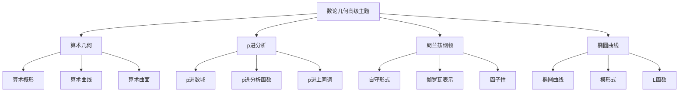

# 3. 数论几何高级主题 / Advanced Topics in Arithmetic Geometry

## 目录

- [3. 数论几何高级主题 / Advanced Topics in Arithmetic Geometry](#3-数论几何高级主题--advanced-topics-in-arithmetic-geometry)
  - [目录](#目录)
  - [3.1 概述 / Overview](#31-概述--overview)
    - [3.1.1 核心概念](#311-核心概念)
  - [3.2 算术几何 / Arithmetic Geometry](#32-算术几何--arithmetic-geometry)
    - [3.2.1 算术概形 / Arithmetic Schemes](#321-算术概形--arithmetic-schemes)
    - [3.2.2 算术曲线 / Arithmetic Curves](#322-算术曲线--arithmetic-curves)
    - [3.2.3 算术曲面 / Arithmetic Surfaces](#323-算术曲面--arithmetic-surfaces)
  - [3.3 p进分析 / p-adic Analysis](#33-p进分析--p-adic-analysis)
    - [3.3.1 p进数域 / p-adic Fields](#331-p进数域--p-adic-fields)
    - [3.3.2 p进分析函数 / p-adic Analytic Functions](#332-p进分析函数--p-adic-analytic-functions)
    - [3.3.3 p进上同调 / p-adic Cohomology](#333-p进上同调--p-adic-cohomology)
  - [3.4 朗兰兹纲领 / Langlands Program](#34-朗兰兹纲领--langlands-program)
    - [3.4.1 自守形式 / Automorphic Forms](#341-自守形式--automorphic-forms)
    - [3.4.2 伽罗瓦表示 / Galois Representations](#342-伽罗瓦表示--galois-representations)
    - [3.4.3 函子性 / Functoriality](#343-函子性--functoriality)
  - [3.5 椭圆曲线 / Elliptic Curves](#35-椭圆曲线--elliptic-curves)
    - [3.5.1 椭圆曲线定义 / Elliptic Curve Definition](#351-椭圆曲线定义--elliptic-curve-definition)
    - [3.5.2 模形式 / Modular Forms](#352-模形式--modular-forms)
    - [3.5.3 L函数 / L-functions](#353-l函数--l-functions)
  - [3.6 形式化实现 / Formal Implementation](#36-形式化实现--formal-implementation)
    - [3.6.1 Lean 4 实现](#361-lean-4-实现)
    - [3.6.2 Haskell 实现](#362-haskell-实现)
  - [3.7 总结 / Summary](#37-总结--summary)
    - [3.7.1 核心要点](#371-核心要点)
    - [3.7.2 知识关联](#372-知识关联)
    - [3.7.3 进一步学习](#373-进一步学习)

## 3.1 概述 / Overview

数论几何高级主题涵盖了现代数论几何的核心理论，包括算术几何、p进分析、朗兰兹纲领和椭圆曲线理论。
这些理论为数论和代数几何提供了深刻的联系。

### 3.1.1 核心概念



## 3.2 算术几何 / Arithmetic Geometry

### 3.2.1 算术概形 / Arithmetic Schemes

**定义**: 算术概形是有限类型概形 $X \to \text{Spec}(\mathbb{Z})$，其中 $\mathbb{Z}$ 是整数环。

**性质**:

- 具有丰富的几何结构
- 与数论问题密切相关
- 具有上同调理论

**例子**:

1. **仿射线**: $\mathbb{A}^1_{\mathbb{Z}} = \text{Spec}(\mathbb{Z}[T])$
2. **射影线**: $\mathbb{P}^1_{\mathbb{Z}}$
3. **椭圆曲线**: $E: y^2 = x^3 + ax + b$ 在 $\mathbb{Z}$ 上的模型

### 3.2.2 算术曲线 / Arithmetic Curves

**定义**: 算术曲线是维数为1的算术概形。

**重要例子**:

1. **数域**: 设 $K$ 是数域，$\mathcal{O}_K$ 是整数环，则 $\text{Spec}(\mathcal{O}_K)$ 是算术曲线
2. **函数域**: 设 $C$ 是代数曲线，则 $C$ 是算术曲线

**性质**:

- 具有有限多个闭点
- 具有丰富的算术信息
- 与类域论密切相关

### 3.2.3 算术曲面 / Arithmetic Surfaces

**定义**: 算术曲面是维数为2的算术概形。

**重要例子**:

1. **椭圆曲线**: 设 $E$ 是椭圆曲线，则 $E$ 的算术模型是算术曲面
2. **模曲线**: 设 $X(N)$ 是模曲线，则 $X(N)$ 是算术曲面

## 3.3 p进分析 / p-adic Analysis

### 3.3.1 p进数域 / p-adic Fields

**定义**: 设 $p$ 是素数，$\mathbb{Q}_p$ 是 $p$ 进数域，定义为 $\mathbb{Q}$ 关于 $p$ 进赋值的完备化。

**性质**:

- $\mathbb{Q}_p$ 是局部紧致的
- $\mathbb{Q}_p$ 具有离散赋值
- $\mathbb{Q}_p$ 的整数环是 $\mathbb{Z}_p$

### 3.3.2 p进分析函数 / p-adic Analytic Functions

**定义**: 设 $K$ 是 $p$ 进数域，$f: K \to K$ 是 $p$ 进解析函数，如果 $f$ 在每点都有收敛的幂级数展开。

**重要例子**:

1. **指数函数**: $\exp(x) = \sum_{n=0}^{\infty} \frac{x^n}{n!}$
2. **对数函数**: $\log(1+x) = \sum_{n=1}^{\infty} (-1)^{n-1} \frac{x^n}{n}$

### 3.3.3 p进上同调 / p-adic Cohomology

**定义**: 设 $X$ 是代数簇，$p$ 进上同调定义为：
$$H^i_{\text{ét}}(X, \mathbb{Q}_p) = H^i(X_{\text{ét}}, \mathbb{Q}_p)$$

**性质**:

- 具有伽罗瓦作用
- 与 $\ell$ 进上同调相关
- 具有韦伊猜想

## 3.4 朗兰兹纲领 / Langlands Program

### 3.4.1 自守形式 / Automorphic Forms

**定义**: 设 $G$ 是代数群，$\Gamma$ 是 $G(\mathbb{Q})$ 的算术子群，自守形式是 $\Gamma \backslash G(\mathbb{R})$ 上的函数，满足某些变换性质。

**重要例子**:

1. **模形式**: 设 $f$ 是权为 $k$ 的模形式，则 $f$ 是自守形式
2. **Maass形式**: 设 $f$ 是Maass形式，则 $f$ 是自守形式

### 3.4.2 伽罗瓦表示 / Galois Representations

**定义**: 设 $K$ 是数域，$\bar{K}$ 是 $K$ 的代数闭包，伽罗瓦表示是连续同态：
$$\rho: \text{Gal}(\bar{K}/K) \to \text{GL}_n(\mathbb{Q}_\ell)$$

**重要例子**:

1. **Tate模**: 设 $E$ 是椭圆曲线，$T_\ell(E)$ 是 $E$ 的Tate模
2. **$\ell$ 进表示**: 设 $\rho$ 是 $\ell$ 进表示，则 $\rho$ 是伽罗瓦表示

### 3.4.3 函子性 / Functoriality

**朗兰兹猜想**: 设 $G, H$ 是代数群，$^L G, ^L H$ 是它们的L群，则存在自然的对应：
$$\text{Automorphic representations of } G \leftrightarrow \text{Galois representations for } ^L G$$

## 3.5 椭圆曲线 / Elliptic Curves

### 3.5.1 椭圆曲线定义 / Elliptic Curve Definition

**定义**: 椭圆曲线是亏格为1的光滑代数曲线，具有一个基点。

**韦尔斯特拉斯形式**: $y^2 = x^3 + ax + b$，其中 $4a^3 + 27b^2 \neq 0$

**性质**:

- 具有群结构
- 具有丰富的算术性质
- 与模形式密切相关

### 3.5.2 模形式 / Modular Forms

**定义**: 设 $k$ 是整数，权为 $k$ 的模形式是上半平面上的全纯函数 $f$，满足：
$$f\left(\frac{az + b}{cz + d}\right) = (cz + d)^k f(z)$$
对所有 $\begin{pmatrix} a & b \\ c & d \end{pmatrix} \in \text{SL}_2(\mathbb{Z})$

**重要例子**:

1. **艾森斯坦级数**: $E_k(z) = \sum_{(m,n) \neq (0,0)} \frac{1}{(mz + n)^k}$
2. **判别式**: $\Delta(z) = q \prod_{n=1}^{\infty} (1 - q^n)^{24}$

### 3.5.3 L函数 / L-functions

**定义**: 设 $E$ 是椭圆曲线，$L(E, s)$ 是 $E$ 的L函数，定义为：
$$L(E, s) = \prod_p \frac{1}{1 - a_p p^{-s} + p^{1-2s}}$$

**性质**:

- 具有函数方程
- 满足黎曼猜想
- 与模形式相关

## 3.6 形式化实现 / Formal Implementation

### 3.6.1 Lean 4 实现

```lean
-- 算术概形
structure ArithmeticScheme where
  base : CommRing := ℤ
  scheme : Scheme
  morphism : scheme → Spec base

-- p进数域
structure PAdicField (p : ℕ) [Fact (Prime p)] where
  field : Field
  valuation : Valuation field ℤₚ
  completeness : Complete field valuation

-- 椭圆曲线
structure EllipticCurve where
  field : Field
  equation : y² = x³ + a * x + b
  discriminant : 4 * a³ + 27 * b² ≠ 0
  base_point : Point curve

-- 模形式
structure ModularForm (k : ℤ) where
  function : ℍ → ℂ
  transformation : ∀ γ ∈ SL₂(ℤ), f(γz) = (cz + d)^k * f(z)
  holomorphic : Holomorphic f
  growth_condition : Bounded f
```

### 3.6.2 Haskell 实现

```haskell
-- 算术概形类型类
class ArithmeticScheme s where
  base :: s -> CommRing
  scheme :: s -> Scheme
  morphism :: s -> Morphism (scheme s) (Spec (base s))

-- p进数域
data PAdicField p = PAdicField
  { field :: Field
  , valuation :: Valuation field (PAdicInteger p)
  , completeness :: Complete field valuation
  }

-- 椭圆曲线
data EllipticCurve = EllipticCurve
  { field :: Field
  , equation :: Equation
  , discriminant :: NonZero (4 * a^3 + 27 * b^2)
  , basePoint :: Point curve
  }

-- 模形式
data ModularForm k = ModularForm
  { function :: UpperHalfPlane -> Complex
  , transformation :: SL2Z -> Transformation k
  , holomorphic :: Holomorphic function
  , growthCondition :: Bounded function
  }
```

## 3.7 总结 / Summary

### 3.7.1 核心要点

1. **算术几何** 为数论提供了几何视角
2. **p进分析** 提供了强大的局部工具
3. **朗兰兹纲领** 建立了深刻的对应关系
4. **椭圆曲线** 是数论几何的核心对象

### 3.7.2 知识关联

- 与[代数数论](../06-数论/02-代数数论.md)的理论框架相联系
- 与[代数几何](../04-几何学/05-代数几何.md)的几何方法相呼应
- 与[解析数论](../06-数论/03-解析数论.md)的分析工具相结合

### 3.7.3 进一步学习

1. **更高级的主题**:
   - 导出代数几何
   - 稳定映射理论
   - 镜像对称

2. **应用领域**:
   - 密码学
   - 数学物理
   - 计算数论

---

**相关文档**:

- [代数数论](../06-数论/02-代数数论.md)
- [代数几何](../04-几何学/05-代数几何.md)
- [解析数论](../06-数论/03-解析数论.md)
