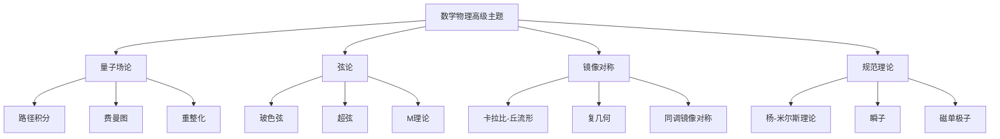

# 11.4 数学物理高级主题 / Advanced Topics in Mathematical Physics

**主题编号**: B.11.04
**创建日期**: 2025年11月21日
**最后更新**: 2025年11月21日

---

## 目录

- [11.4 数学物理高级主题 / Advanced Topics in Mathematical Physics](#114-数学物理高级主题--advanced-topics-in-mathematical-physics)
  - [目录](#目录)
  - [11.4.1 概述 / Overview](#1141-概述--overview)
    - [11.4.1.1 核心概念](#11411-核心概念)
  - [11.4.2 量子场论 / Quantum Field Theory](#1142-量子场论--quantum-field-theory)
    - [11.4.2.1 路径积分 / Path Integral](#11421-路径积分--path-integral)
    - [11.4.2.2 费曼图 / Feynman Diagrams](#11422-费曼图--feynman-diagrams)
    - [11.4.2.3 重整化 / Renormalization](#11423-重整化--renormalization)
  - [11.4.3 弦论 / String Theory](#1143-弦论--string-theory)
    - [11.4.3.1 玻色弦 / Bosonic String](#11431-玻色弦--bosonic-string)
    - [11.4.3.2 超弦 / Superstring](#11432-超弦--superstring)
    - [11.4.3.3 M理论 / M-Theory](#11433-m理论--m-theory)
  - [11.4.4 镜像对称 / Mirror Symmetry](#1144-镜像对称--mirror-symmetry)
    - [11.4.4.1 卡拉比-丘流形 / Calabi-Yau Manifolds](#11441-卡拉比-丘流形--calabi-yau-manifolds)
    - [11.4.4.2 复几何 / Complex Geometry](#11442-复几何--complex-geometry)
    - [11.4.4.3 同调镜像对称 / Homological Mirror Symmetry](#11443-同调镜像对称--homological-mirror-symmetry)
  - [11.4.5 规范理论 / Gauge Theory](#1145-规范理论--gauge-theory)
    - [11.4.5.1 杨-米尔斯理论 / Yang-Mills Theory](#11451-杨-米尔斯理论--yang-mills-theory)
    - [11.4.5.2 瞬子 / Instantons](#11452-瞬子--instantons)
    - [11.4.5.3 磁单极子 / Magnetic Monopoles](#11453-磁单极子--magnetic-monopoles)
  - [11.4.6 形式化实现 / Formal Implementation](#1146-形式化实现--formal-implementation)
    - [11.4.6.1 Lean 4 实现](#11461-lean-4-实现)
    - [11.4.6.2 Haskell 实现](#11462-haskell-实现)
  - [11.4.7 总结 / Summary](#1147-总结--summary)
    - [11.4.7.1 核心要点](#11471-核心要点)
    - [11.4.7.2 知识关联](#11472-知识关联)
    - [11.4.7.3 进一步学习](#11473-进一步学习)

## 11.4.1 概述 / Overview (编号: B.11.04.01)

数学物理高级主题涵盖了现代数学物理的核心理论，包括量子场论、弦论、镜像对称和规范理论。
这些理论为数学和物理提供了深刻的联系。

### 11.4.1.1 核心概念



## 11.4.2 量子场论 / Quantum Field Theory (编号: B.11.04.02)

### 11.4.2.1 路径积分 / Path Integral

**定义**: 设 $\phi$ 是场，$S[\phi]$ 是作用量，路径积分定义为：
$$Z = \int \mathcal{D}\phi \, e^{iS[\phi]/\hbar}$$

**性质**:

- 满足量子力学原理
- 具有规范不变性
- 与经典极限相关

**重要例子**:

1. **自由标量场**: $S[\phi] = \int d^4x \, \frac{1}{2}(\partial_\mu \phi)^2 - \frac{1}{2}m^2\phi^2$
2. **$\phi^4$ 理论**: $S[\phi] = \int d^4x \, \frac{1}{2}(\partial_\mu \phi)^2 - \frac{1}{2}m^2\phi^2 - \frac{\lambda}{4!}\phi^4$

### 11.4.2.2 费曼图 / Feynman Diagrams

**定义**: 费曼图是量子场论中表示散射过程的图形方法。

**规则**:

1. **传播子**: 每条内线对应传播子 $\frac{i}{p^2 - m^2 + i\epsilon}$
2. **顶点**: 每个顶点对应耦合常数
3. **积分**: 对未确定的动量积分

**例子**:

- **树图**: 没有圈的费曼图
- **一圈图**: 有一个圈的费曼图
- **多圈图**: 有多个圈的费曼图

### 11.4.2.3 重整化 / Renormalization

**定义**: 重整化是处理量子场论中无穷大的方法。

**步骤**:

1. **正规化**: 引入截断参数
2. **重整化**: 重新定义参数
3. **取极限**: 去掉截断

**重要例子**:

1. **维数正规化**: 在 $d = 4 - \epsilon$ 维中计算
2. **泡利-维拉斯正规化**: 引入质量截断

## 11.4.3 弦论 / String Theory (编号: B.11.04.03)

### 11.4.3.1 玻色弦 / Bosonic String

**作用量**: 玻色弦的作用量定义为：
$$S = -\frac{T}{2} \int d\tau d\sigma \, \sqrt{-\det(g_{\alpha\beta})}$$

其中 $g_{\alpha\beta} = \partial_\alpha X^\mu \partial_\beta X_\mu$ 是诱导度量。

**性质**:

- 具有共形不变性
- 需要26维时空
- 包含快子态

### 11.4.3.2 超弦 / Superstring

**作用量**: 超弦的作用量包含费米子项：
$$S = S_{\text{bosonic}} + S_{\text{fermionic}}$$

**类型**:

1. **I型超弦**: 具有开弦和闭弦
2. **IIA型超弦**: 只有闭弦，无手性
3. **IIB型超弦**: 只有闭弦，有手性
4. **杂化弦**: 左移和右移不同的对称性

### 11.4.3.3 M理论 / M-Theory

**定义**: M理论是11维的超引力理论，是各种弦论的统一。

**性质**:

- 11维时空
- 包含2-膜和5-膜
- 与各种弦论相关

## 11.4.4 镜像对称 / Mirror Symmetry (编号: B.11.04.04)

### 11.4.4.1 卡拉比-丘流形 / Calabi-Yau Manifolds

**定义**: 卡拉比-丘流形是紧致的凯勒流形，具有平凡的第一陈类。

**性质**:

- 具有SU(n) 的完整群
- 具有非平凡的3-形式
- 在弦论中很重要

### 11.4.4.2 复几何 / Complex Geometry

**定义**: 复几何研究复流形的几何性质。

**重要概念**:

1. **凯勒流形**: 具有凯勒形式的复流形
2. **辛流形**: 具有辛形式的流形
3. **复辛流形**: 同时具有复结构和辛结构

### 11.4.4.3 同调镜像对称 / Homological Mirror Symmetry

**猜想**: 设 $X, Y$ 是镜像对称的卡拉比-丘流形，则：
$$D^b(X) \cong D^b(Y)$$

其中 $D^b(X)$ 是 $X$ 的有界导出范畴。

## 11.4.5 规范理论 / Gauge Theory (编号: B.11.04.05)

### 11.4.5.1 杨-米尔斯理论 / Yang-Mills Theory

**作用量**: 杨-米尔斯作用量定义为：
$$S = -\frac{1}{4g^2} \int d^4x \, \text{Tr}(F_{\mu\nu} F^{\mu\nu})$$

其中 $F_{\mu\nu} = \partial_\mu A_\nu - \partial_\nu A_\mu + [A_\mu, A_\nu]$ 是场强张量。

**性质**:

- 具有规范不变性
- 具有渐近自由性
- 具有禁闭性质

### 11.4.5.2 瞬子 / Instantons

**定义**: 瞬子是欧几里得空间中的自对偶解。

**性质**:

- 具有拓扑荷
- 在量子隧穿中重要
- 与瞬子数相关

### 11.4.5.3 磁单极子 / Magnetic Monopoles

**定义**: 磁单极子是具有磁荷的粒子。

**性质**:

- 在规范理论中存在
- 具有拓扑性质
- 与瞬子相关

## 11.4.6 形式化实现 / Formal Implementation (编号: B.11.04.06)

### 11.4.6.1 Lean 4 实现

```lean
-- 路径积分
def PathIntegral (S : Action) (ϕ : Field) : Complex :=
  ∫ 𝒟ϕ * exp (i * S[ϕ] / ℏ)

-- 费曼图
structure FeynmanDiagram where
  vertices : List Vertex
  edges : List Edge
  external_lines : List ExternalLine
  amplitude : Complex

-- 卡拉比-丘流形
structure CalabiYauManifold where
  manifold : ComplexManifold
  kahler_form : KahlerForm manifold
  ricci_flat : RicciFlat manifold
  chern_class : FirstChernClass manifold = 0

-- 杨-米尔斯理论
structure YangMillsTheory where
  gauge_group : LieGroup
  connection : Connection gauge_group
  field_strength : FieldStrength connection
  action : Action field_strength
```

### 11.4.6.2 Haskell 实现

```haskell
-- 路径积分类型
type PathIntegral = Action -> Field -> Complex
pathIntegral s phi = integrate (measure phi) (exp (i * s phi / hbar))

-- 费曼图
data FeynmanDiagram = FeynmanDiagram
  { vertices :: [Vertex]
  , edges :: [Edge]
  , externalLines :: [ExternalLine]
  , amplitude :: Complex
  }

-- 卡拉比-丘流形
data CalabiYauManifold = CalabiYauManifold
  { manifold :: ComplexManifold
  , kahlerForm :: KahlerForm manifold
  , ricciFlat :: RicciFlat manifold
  , chernClass :: FirstChernClass manifold
  }

-- 杨-米尔斯理论
data YangMillsTheory = YangMillsTheory
  { gaugeGroup :: LieGroup
  , connection :: Connection gaugeGroup
  , fieldStrength :: FieldStrength connection
  , action :: Action fieldStrength
  }
```

## 11.4.7 总结 / Summary

### 11.4.7.1 核心要点

1. **量子场论** 为粒子物理提供了理论框架
2. **弦论** 统一了量子力学和广义相对论
3. **镜像对称** 建立了深刻的几何对应
4. **规范理论** 描述了基本相互作用

### 11.4.7.2 知识关联

- 与[微分几何](../04-几何学/03-微分几何.md)的几何方法相联系
- 与[李代数](../02-代数结构/05-李代数.md)的代数结构相呼应
- 与[泛函分析](../03-分析学/03-泛函分析/03-泛函分析.md)的分析工具相结合

### 11.4.7.3 进一步学习

1. **更高级的主题**:
   - 导出代数几何
   - 稳定映射理论
   - 无穷范畴

2. **应用领域**:
   - 粒子物理
   - 凝聚态物理
   - 宇宙学

---

**相关文档**:

- [微分几何](../04-几何学/03-微分几何.md)
- [李代数](../02-代数结构/05-李代数.md)
- [泛函分析](../03-分析学/03-泛函分析/03-泛函分析.md)
