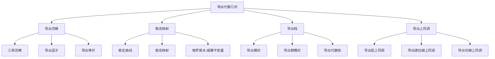

# 11.5 导出代数几何 / Derived Algebraic Geometry

**主题编号**: B.11.05
**创建日期**: 2025年11月21日
**最后更新**: 2025年11月21日

---

## 目录

- [11.5 导出代数几何 / Derived Algebraic Geometry](#115-导出代数几何--derived-algebraic-geometry)
  - [目录](#目录)
  - [5.1 概述 / Overview](#51-概述--overview)
    - [5.1.1 核心概念](#511-核心概念)
  - [5.2 导出范畴 / Derived Categories](#52-导出范畴--derived-categories)
    - [5.2.1 三角范畴 / Triangulated Categories](#521-三角范畴--triangulated-categories)
    - [5.2.2 导出函子 / Derived Functors](#522-导出函子--derived-functors)
    - [5.2.3 导出等价 / Derived Equivalence](#523-导出等价--derived-equivalence)
  - [5.3 稳定映射 / Stable Maps](#53-稳定映射--stable-maps)
    - [5.3.1 稳定曲线 / Stable Curves](#531-稳定曲线--stable-curves)
    - [5.3.2 稳定映射 / Stable Maps](#532-稳定映射--stable-maps)
    - [5.3.3 格罗莫夫-威滕不变量 / Gromov-Witten Invariants](#533-格罗莫夫-威滕不变量--gromov-witten-invariants)
  - [5.4 导出栈 / Derived Stacks](#54-导出栈--derived-stacks)
    - [5.4.1 导出概形 / Derived Schemes](#541-导出概形--derived-schemes)
    - [5.4.2 导出群概形 / Derived Group Schemes](#542-导出群概形--derived-group-schemes)
    - [5.4.3 导出代数栈 / Derived Algebraic Stacks](#543-导出代数栈--derived-algebraic-stacks)
  - [5.5 导出上同调 / Derived Cohomology](#55-导出上同调--derived-cohomology)
    - [5.5.1 导出层上同调 / Derived Sheaf Cohomology](#551-导出层上同调--derived-sheaf-cohomology)
    - [5.5.2 导出德拉姆上同调 / Derived de Rham Cohomology](#552-导出德拉姆上同调--derived-de-rham-cohomology)
    - [5.5.3 导出切赫上同调 / Derived Čech Cohomology](#553-导出切赫上同调--derived-čech-cohomology)
  - [5.6 形式化实现 / Formal Implementation](#56-形式化实现--formal-implementation)
    - [5.6.1 Lean 4 实现](#561-lean-4-实现)
    - [5.6.2 Haskell 实现](#562-haskell-实现)
  - [5.7 总结 / Summary](#57-总结--summary)
    - [5.7.1 核心要点](#571-核心要点)
    - [5.7.2 知识关联](#572-知识关联)
    - [5.7.3 进一步学习](#573-进一步学习)

## 5.1 概述 / Overview (编号: B.11.05.01)

导出代数几何是现代代数几何的重要分支，它将传统的代数几何与同伦论相结合，为研究几何对象提供了更强大的工具。
导出代数几何使用导出范畴、稳定映射和导出栈等概念，为现代数学提供了深刻的洞察。

### 5.1.1 核心概念



## 5.2 导出范畴 / Derived Categories (编号: B.11.05.02)

### 5.2.1 三角范畴 / Triangulated Categories

**定义**: 三角范畴是一个加法范畴 $\mathcal{T}$，配备一个自等价 $[1]: \mathcal{T} \to \mathcal{T}$ 和一族三角：
$$X \to Y \to Z \to X[1]$$

**公理**:

1. **TR1**: 每个态射 $f: X \to Y$ 可以嵌入到三角中
2. **TR2**: 三角的旋转也是三角
3. **TR3**: 三角之间的态射可以提升
4. **TR4**: 八面体公理

### 5.2.2 导出函子 / Derived Functors

**定义**: 设 $F: \mathcal{A} \to \mathcal{B}$ 是左正合函子，右导出函子定义为：
$$R^i F(A) = H^i(F(I^\bullet))$$
其中 $I^\bullet$ 是 $A$ 的内射分解。

**重要例子**:

1. **Ext函子**: $\text{Ext}^i(A, B) = R^i \text{Hom}(A, B)$
2. **Tor函子**: $\text{Tor}_i(A, B) = L_i(A \otimes B)$

### 5.2.3 导出等价 / Derived Equivalence

**定义**: 设 $\mathcal{A}, \mathcal{B}$ 是阿贝尔范畴，导出等价是三角等价：
$$D^b(\mathcal{A}) \cong D^b(\mathcal{B})$$

**重要例子**:

1. **傅里叶-穆凯变换**: 在射影空间上的导出等价
2. **镜像对称**: 卡拉比-丘流形之间的导出等价

## 5.3 稳定映射 / Stable Maps (编号: B.11.05.03)

### 5.3.1 稳定曲线 / Stable Curves

**定义**: 设 $C$ 是代数曲线，$C$ 是稳定的当且仅当：

1. $C$ 是约化的
2. $C$ 的奇点都是节点
3. 每个不可约分支的亏格至少为2，或者有至少3个标记点

**模空间**: $\overline{\mathcal{M}}_{g,n}$ 是亏格 $g$ 有 $n$ 个标记点的稳定曲线的模空间。

### 5.3.2 稳定映射 / Stable Maps

**定义**: 设 $X$ 是代数簇，稳定映射是映射 $f: C \to X$，其中 $C$ 是稳定曲线，满足某些稳定性条件。

**模空间**: $\overline{\mathcal{M}}_{g,n}(X, \beta)$ 是亏格 $g$ 有 $n$ 个标记点，同伦类为 $\beta$ 的稳定映射的模空间。

### 5.3.3 格罗莫夫-威滕不变量 / Gromov-Witten Invariants

**定义**: 设 $X$ 是代数簇，$\beta \in H_2(X, \mathbb{Z})$，格罗莫夫-威滕不变量定义为：
$$\langle \gamma_1, \ldots, \gamma_n \rangle_{g,n,\beta} = \int_{[\overline{\mathcal{M}}_{g,n}(X, \beta)]^{\text{vir}}} \prod_{i=1}^n \text{ev}_i^* \gamma_i$$

**性质**:

- 满足WDVV方程
- 具有拓扑递归关系
- 与镜像对称相关

## 5.4 导出栈 / Derived Stacks (编号: B.11.05.04)

### 5.4.1 导出概形 / Derived Schemes

**定义**: 导出概形是概形的同伦理论推广，使用导出代数几何的方法。

**性质**:

- 具有丰富的几何结构
- 与传统的概形理论兼容
- 为研究奇点提供新工具

### 5.4.2 导出群概形 / Derived Group Schemes

**定义**: 导出群概形是群概形的同伦理论推广。

**重要例子**:

1. **导出代数群**: 李代数的导出版本
2. **导出有限群**: 有限群的导出版本

### 5.4.3 导出代数栈 / Derived Algebraic Stacks

**定义**: 导出代数栈是代数栈的同伦理论推广。

**性质**:

- 具有丰富的几何结构
- 为研究模空间提供新工具
- 与传统的代数栈理论兼容

## 5.5 导出上同调 / Derived Cohomology (编号: B.11.05.05)

### 5.5.1 导出层上同调 / Derived Sheaf Cohomology

**定义**: 设 $X$ 是拓扑空间，$\mathcal{F}$ 是 $X$ 上的阿贝尔群层，导出层上同调定义为：
$$R\Gamma(X, \mathcal{F}) = \Gamma(X, I^\bullet)$$
其中 $I^\bullet$ 是 $\mathcal{F}$ 的内射分解。

**性质**:

- 具有长正合序列
- 满足切除定理
- 与传统的层上同调兼容

### 5.5.2 导出德拉姆上同调 / Derived de Rham Cohomology

**定义**: 设 $X$ 是光滑代数簇，导出德拉姆上同调定义为：
$$R\Gamma_{\text{dR}}(X) = R\Gamma(X, \Omega_X^\bullet)$$

**性质**:

- 具有霍奇分解
- 与奇异上同调相关
- 具有庞加莱对偶

### 5.5.3 导出切赫上同调 / Derived Čech Cohomology

**定义**: 设 $\mathcal{U} = \{U_i\}$ 是 $X$ 的开覆盖，导出切赫上同调定义为：
$$R\check{H}^i(\mathcal{U}, \mathcal{F}) = H^i(C^\bullet(\mathcal{U}, \mathcal{F}))$$

**性质**:

- 与传统的切赫上同调兼容
- 具有谱序列
- 满足梅耶-维托里斯序列

## 5.6 形式化实现 / Formal Implementation (编号: B.11.05.06)

### 5.6.1 Lean 4 实现

```lean
-- 三角范畴
class TriangulatedCategory (C : Type) where
  shift : C → C
  triangle : C → C → C → C → Prop
  -- 三角公理实现

-- 导出函子
def DerivedFunctor (F : Functor A B) (i : ℕ) : A → B :=
  fun A => homology i (F (injective_resolution A))

-- 稳定映射
structure StableMap where
  curve : StableCurve
  target : AlgebraicVariety
  morphism : curve → target
  stability : StabilityCondition morphism

-- 导出栈
structure DerivedStack where
  underlying : Type
  structure_sheaf : DerivedSheaf underlying
  local_affine : ∀ x, ∃ U, IsOpen U ∧ x ∈ U ∧ IsDerivedAffine U
```

### 5.6.2 Haskell 实现

```haskell
-- 三角范畴类型类
class TriangulatedCategory c where
  shift :: c -> c
  triangle :: c -> c -> c -> c -> Bool
  -- 三角公理实现

-- 导出函子
derivedFunctor :: (Functor f, AbelianCategory a, AbelianCategory b) => f a b -> Int -> a -> b
derivedFunctor f i a = homology i (f (injectiveResolution a))

-- 稳定映射
data StableMap = StableMap
  { curve :: StableCurve
  , target :: AlgebraicVariety
  , morphism :: Morphism curve target
  , stability :: StabilityCondition morphism
  }

-- 导出栈
data DerivedStack = DerivedStack
  { underlying :: Type
  , structureSheaf :: DerivedSheaf underlying
  , localAffine :: Point -> Maybe OpenSet
  }
```

## 5.7 总结 / Summary

### 5.7.1 核心要点

1. **导出范畴** 为代数几何提供了同伦理论框架
2. **稳定映射** 为研究几何对象提供了强大工具
3. **导出栈** 为模空间理论提供了新视角
4. **导出上同调** 为几何研究提供了新方法

### 5.7.2 知识关联

- 与[代数几何高级主题](01-代数几何高级主题.md)的概形理论相联系
- 与[同伦论高级主题](02-同伦论高级主题.md)的稳定同伦论相呼应
- 与[数学物理高级主题](04-数学物理高级主题.md)的镜像对称相结合

### 5.7.3 进一步学习

1. **更高级的主题**:
   - 无穷范畴
   - 高阶代数几何
   - 导出代数几何的应用

2. **应用领域**:
   - 数学物理
   - 代数几何
   - 拓扑学

---

**相关文档**:

- [代数几何高级主题](01-代数几何高级主题.md)
- [同伦论高级主题](02-同伦论高级主题.md)
- [数学物理高级主题](04-数学物理高级主题.md)
