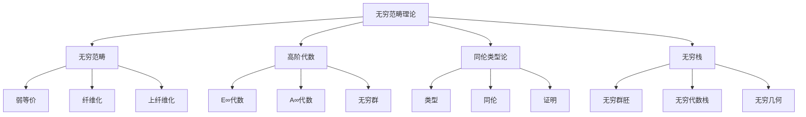

# 6. 无穷范畴理论 / Infinity Category Theory

## 目录

- [6. 无穷范畴理论 / Infinity Category Theory](#6-无穷范畴理论--infinity-category-theory)
  - [目录](#目录)
  - [6.1 概述 / Overview](#61-概述--overview)
    - [6.1.1 核心概念](#611-核心概念)
  - [6.2 无穷范畴 / Infinity Categories](#62-无穷范畴--infinity-categories)
    - [6.2.1 弱等价 / Weak Equivalences](#621-弱等价--weak-equivalences)
    - [6.2.2 纤维化 / Fibrations](#622-纤维化--fibrations)
    - [6.2.3 上纤维化 / Cofibrations](#623-上纤维化--cofibrations)
  - [6.3 高阶代数 / Higher Algebra](#63-高阶代数--higher-algebra)
    - [6.3.1 E∞代数 / E∞ Algebras](#631-e代数--e-algebras)
    - [6.3.2 A∞代数 / A∞ Algebras](#632-a代数--a-algebras)
    - [6.3.3 无穷群 / Infinity Groups](#633-无穷群--infinity-groups)
  - [6.4 同伦类型论 / Homotopy Type Theory](#64-同伦类型论--homotopy-type-theory)
    - [6.4.1 类型 / Types](#641-类型--types)
    - [6.4.2 同伦 / Homotopy](#642-同伦--homotopy)
    - [6.4.3 证明 / Proofs](#643-证明--proofs)
  - [6.5 无穷栈 / Infinity Stacks](#65-无穷栈--infinity-stacks)
    - [6.5.1 无穷群胚 / Infinity Groupoids](#651-无穷群胚--infinity-groupoids)
    - [6.5.2 无穷代数栈 / Infinity Algebraic Stacks](#652-无穷代数栈--infinity-algebraic-stacks)
    - [6.5.3 无穷几何 / Infinity Geometry](#653-无穷几何--infinity-geometry)
  - [6.6 形式化实现 / Formal Implementation](#66-形式化实现--formal-implementation)
    - [6.6.1 Lean 4 实现](#661-lean-4-实现)
    - [6.6.2 Haskell 实现](#662-haskell-实现)
  - [6.7 总结 / Summary](#67-总结--summary)
    - [6.7.1 核心要点](#671-核心要点)
    - [6.7.2 知识关联](#672-知识关联)
    - [6.7.3 进一步学习](#673-进一步学习)

## 6.1 概述 / Overview

无穷范畴理论是现代数学的重要分支，它将传统的范畴论推广到无穷维，为研究复杂的数学结构提供了强大的工具。无穷范畴理论包括无穷范畴、高阶代数、同伦类型论等概念，为现代数学提供了深刻的洞察。

### 6.1.1 核心概念



## 6.2 无穷范畴 / Infinity Categories

### 6.2.1 弱等价 / Weak Equivalences

**定义**: 在无穷范畴中，弱等价是保持同伦类型的态射。

**性质**:

- 满足2-out-of-3性质
- 与同伦等价相关
- 在局部化中重要

**例子**:

1. **拓扑空间**: 弱等价是同伦等价
2. **单纯集合**: 弱等价是几何实现后的同伦等价
3. **链复形**: 弱等价是拟同构

### 6.2.2 纤维化 / Fibrations

**定义**: 在无穷范畴中，纤维化是具有提升性质的态射。

**性质**:

- 具有提升性质
- 与纤维化序列相关
- 在同伦论中重要

**例子**:

1. **Serre纤维化**: 在拓扑空间中的纤维化
2. **Kan纤维化**: 在单纯集合中的纤维化

### 6.2.3 上纤维化 / Cofibrations

**定义**: 在无穷范畴中，上纤维化是具有提升性质的态射。

**性质**:

- 具有提升性质
- 与上纤维化序列相关
- 在模型范畴中重要

## 6.3 高阶代数 / Higher Algebra

### 6.3.1 E∞代数 / E∞ Algebras

**定义**: E∞代数是具有交换性的无穷代数结构。

**性质**:

- 具有交换性
- 与同伦论相关
- 在代数几何中重要

**例子**:

1. **交换环**: 传统的交换环
2. **E∞环谱**: 在稳定同伦论中的E∞代数

### 6.3.2 A∞代数 / A∞ Algebras

**定义**: A∞代数是具有结合性的无穷代数结构。

**性质**:

- 具有结合性
- 与同伦论相关
- 在代数几何中重要

**例子**:

1. **结合代数**: 传统的结合代数
2. **A∞环谱**: 在稳定同伦论中的A∞代数

### 6.3.3 无穷群 / Infinity Groups

**定义**: 无穷群是具有群结构的无穷代数对象。

**性质**:

- 具有群结构
- 与同伦论相关
- 在代数几何中重要

**例子**:

1. **李群**: 传统的李群
2. **无穷李群**: 在无穷几何中的李群

## 6.4 同伦类型论 / Homotopy Type Theory

### 6.4.1 类型 / Types

**定义**: 在同伦类型论中，类型是基本的数学对象。

**性质**:

- 具有丰富的结构
- 与同伦论相关
- 在形式化证明中重要

**例子**:

1. **集合类型**: 传统的集合
2. **同伦类型**: 在同伦论中的类型

### 6.4.2 同伦 / Homotopy

**定义**: 在同伦类型论中，同伦是类型之间的等价关系。

**性质**:

- 具有等价性
- 与同伦论相关
- 在形式化证明中重要

**例子**:

1. **路径同伦**: 在拓扑空间中的同伦
2. **类型同伦**: 在同伦类型论中的同伦

### 6.4.3 证明 / Proofs

**定义**: 在同伦类型论中，证明是类型之间的映射。

**性质**:

- 具有构造性
- 与形式化证明相关
- 在计算机科学中重要

**例子**:

1. **构造性证明**: 在直觉逻辑中的证明
2. **同伦证明**: 在同伦类型论中的证明

## 6.5 无穷栈 / Infinity Stacks

### 6.5.1 无穷群胚 / Infinity Groupoids

**定义**: 无穷群胚是具有群胚结构的无穷代数对象。

**性质**:

- 具有群胚结构
- 与同伦论相关
- 在代数几何中重要

**例子**:

1. **群胚**: 传统的群胚
2. **无穷群胚**: 在无穷几何中的群胚

### 6.5.2 无穷代数栈 / Infinity Algebraic Stacks

**定义**: 无穷代数栈是代数栈的无穷维推广。

**性质**:

- 具有丰富的几何结构
- 与代数几何相关
- 在模空间理论中重要

**例子**:

1. **代数栈**: 传统的代数栈
2. **无穷代数栈**: 在无穷几何中的代数栈

### 6.5.3 无穷几何 / Infinity Geometry

**定义**: 无穷几何是几何学的无穷维推广。

**性质**:

- 具有丰富的几何结构
- 与代数几何相关
- 在数学物理中重要

**例子**:

1. **代数几何**: 传统的代数几何
2. **无穷代数几何**: 在无穷几何中的代数几何

## 6.6 形式化实现 / Formal Implementation

### 6.6.1 Lean 4 实现

```lean
-- 无穷范畴
class InfinityCategory (C : Type) where
  objects : Type
  morphisms : objects → objects → Type
  composition : ∀ {X Y Z}, morphisms Y Z → morphisms X Y → morphisms X Z
  identity : ∀ X, morphisms X X
  associativity : ∀ {W X Y Z} (f : morphisms Y Z) (g : morphisms X Y) (h : morphisms W X),
    composition f (composition g h) = composition (composition f g) h

-- 高阶代数
structure EInfinityAlgebra where
  carrier : Type
  multiplication : carrier → carrier → carrier
  commutativity : ∀ a b, multiplication a b = multiplication b a
  associativity : ∀ a b c, multiplication (multiplication a b) c = multiplication a (multiplication b c)

-- 同伦类型论
structure HomotopyType where
  type : Type
  path : type → type → Type
  reflexivity : ∀ x, path x x
  symmetry : ∀ {x y}, path x y → path y x
  transitivity : ∀ {x y z}, path x y → path y z → path x z
```

### 6.6.2 Haskell 实现

```haskell
-- 无穷范畴类型类
class InfinityCategory c where
  objects :: Type
  morphisms :: objects -> objects -> Type
  composition :: morphisms y z -> morphisms x y -> morphisms x z
  identity :: objects -> morphisms x x
  associativity :: morphisms y z -> morphisms x y -> morphisms w x -> Bool

-- 高阶代数
data EInfinityAlgebra = EInfinityAlgebra
  { carrier :: Type
  , multiplication :: carrier -> carrier -> carrier
  , commutativity :: carrier -> carrier -> Bool
  , associativity :: carrier -> carrier -> carrier -> Bool
  }

-- 同伦类型论
data HomotopyType = HomotopyType
  { type_ :: Type
  , path :: type_ -> type_ -> Type
  , reflexivity :: type_ -> path x x
  , symmetry :: path x y -> path y x
  , transitivity :: path x y -> path y z -> path x z
  }
```

## 6.7 总结 / Summary

### 6.7.1 核心要点

1. **无穷范畴** 为数学提供了统一的同伦理论框架
2. **高阶代数** 为代数结构提供了无穷维推广
3. **同伦类型论** 为形式化证明提供了新方法
4. **无穷栈** 为几何学提供了新视角

### 6.7.2 知识关联

- 与[导出代数几何](05-导出代数几何.md)的导出范畴相联系
- 与[同伦论高级主题](02-同伦论高级主题.md)的稳定同伦论相呼应
- 与[数学物理高级主题](04-数学物理高级主题.md)的镜像对称相结合

### 6.7.3 进一步学习

1. **更高级的主题**:
   - 高阶同伦论
   - 无穷几何
   - 同伦类型论的应用

2. **应用领域**:
   - 计算机科学
   - 数学物理
   - 代数几何

---

**相关文档**:

- [导出代数几何](05-导出代数几何.md)
- [同伦论高级主题](02-同伦论高级主题.md)
- [数学物理高级主题](04-数学物理高级主题.md)
