# 6. 无穷范畴理论 / Infinity Category Theory

## 目录

- [6. 无穷范畴理论 / Infinity Category Theory](#6-无穷范畴理论--infinity-category-theory)
  - [目录](#目录)
  - [6.1 概述 / Overview](#61-概述--overview)
    - [6.1.1 核心概念](#611-核心概念)
    - [6.1.2 历史背景](#612-历史背景)
    - [6.1.3 与经典范畴论的关系](#613-与经典范畴论的关系)
  - [6.2 无穷范畴 / Infinity Categories](#62-无穷范畴--infinity-categories)
    - [6.2.1 弱等价 / Weak Equivalences](#621-弱等价--weak-equivalences)
    - [6.2.2 纤维化 / Fibrations](#622-纤维化--fibrations)
    - [6.2.3 上纤维化 / Cofibrations](#623-上纤维化--cofibrations)
    - [6.2.4 模型范畴 / Model Categories](#624-模型范畴--model-categories)
    - [6.2.5 局部化 / Localization](#625-局部化--localization)
  - [6.3 高阶代数 / Higher Algebra](#63-高阶代数--higher-algebra)
    - [6.3.1 E∞代数 / E∞ Algebras](#631-e代数--e-algebras)
    - [6.3.2 A∞代数 / A∞ Algebras](#632-a代数--a-algebras)
    - [6.3.3 无穷群 / Infinity Groups](#633-无穷群--infinity-groups)
    - [6.3.4 高阶代数结构 / Higher Algebraic Structures](#634-高阶代数结构--higher-algebraic-structures)
  - [6.4 同伦类型论 / Homotopy Type Theory](#64-同伦类型论--homotopy-type-theory)
    - [6.4.1 类型 / Types](#641-类型--types)
    - [6.4.2 同伦 / Homotopy](#642-同伦--homotopy)
    - [6.4.3 证明 / Proofs](#643-证明--proofs)
    - [6.4.4 单值公理 / Univalence Axiom](#644-单值公理--univalence-axiom)
    - [6.4.5 高阶归纳类型 / Higher Inductive Types](#645-高阶归纳类型--higher-inductive-types)
  - [6.5 无穷栈 / Infinity Stacks](#65-无穷栈--infinity-stacks)
    - [6.5.1 无穷群胚 / Infinity Groupoids](#651-无穷群胚--infinity-groupoids)
    - [6.5.2 无穷代数栈 / Infinity Algebraic Stacks](#652-无穷代数栈--infinity-algebraic-stacks)
    - [6.5.3 无穷几何 / Infinity Geometry](#653-无穷几何--infinity-geometry)
    - [6.5.4 无穷几何栈 / Infinity Geometric Stacks](#654-无穷几何栈--infinity-geometric-stacks)
  - [6.6 无穷范畴的构造 / Constructions in Infinity Categories](#66-无穷范畴的构造--constructions-in-infinity-categories)
    - [6.6.1 极限与余极限 / Limits and Colimits](#661-极限与余极限--limits-and-colimits)
    - [6.6.2 伴随函子 / Adjunctions](#662-伴随函子--adjunctions)
    - [6.6.3 幺半范畴 / Monoidal Categories](#663-幺半范畴--monoidal-categories)
    - [6.6.4 无穷幺半范畴 / Infinity Monoidal Categories](#664-无穷幺半范畴--infinity-monoidal-categories)
  - [6.7 无穷范畴的应用 / Applications of Infinity Categories](#67-无穷范畴的应用--applications-of-infinity-categories)
    - [6.7.1 代数几何中的应用 / Applications in Algebraic Geometry](#671-代数几何中的应用--applications-in-algebraic-geometry)
    - [6.7.2 拓扑学中的应用 / Applications in Topology](#672-拓扑学中的应用--applications-in-topology)
    - [6.7.3 数学物理中的应用 / Applications in Mathematical Physics](#673-数学物理中的应用--applications-in-mathematical-physics)
  - [6.8 形式化实现 / Formal Implementation](#68-形式化实现--formal-implementation)
    - [6.8.1 Lean 4 实现](#681-lean-4-实现)
    - [6.8.2 Haskell 实现](#682-haskell-实现)
    - [6.8.3 Rust 实现](#683-rust-实现)
  - [6.9 总结 / Summary](#69-总结--summary)
    - [6.9.1 核心要点](#691-核心要点)
    - [6.9.2 知识关联](#692-知识关联)
    - [6.9.3 进一步学习](#693-进一步学习)

## 6.1 概述 / Overview

无穷范畴理论是现代数学的重要分支，它将传统的范畴论推广到无穷维，为研究复杂的数学结构提供了强大的工具。
无穷范畴理论包括无穷范畴、高阶代数、同伦类型论等概念，为现代数学提供了深刻的洞察。
它不仅统一了不同数学分支的语言，还为理解复杂的几何和代数结构提供了新的视角。

### 6.1.1 核心概念

```mermaid
graph TD
    A[无穷范畴理论] --> B[无穷范畴]
    A --> C[高阶代数]
    A --> D[同伦类型论]
    A --> E[无穷栈]
    A --> F[无穷范畴构造]
    A --> G[无穷范畴应用]
    
    B --> H[弱等价]
    B --> I[纤维化]
    B --> J[上纤维化]
    B --> K[模型范畴]
    B --> L[局部化]
    
    C --> M[E∞代数]
    C --> N[A∞代数]
    C --> O[无穷群]
    C --> P[高阶代数结构]
    
    D --> Q[类型]
    D --> R[同伦]
    D --> S[证明]
    D --> T[单值公理]
    D --> U[高阶归纳类型]
    
    E --> V[无穷群胚]
    E --> W[无穷代数栈]
    E --> X[无穷几何]
    E --> Y[无穷几何栈]
    
    F --> Z[极限与余极限]
    F --> AA[伴随函子]
    F --> BB[幺半范畴]
    F --> CC[无穷幺半范畴]
    
    G --> DD[代数几何应用]
    G --> EE[拓扑学应用]
    G --> FF[数学物理应用]
```



### 6.1.2 历史背景

无穷范畴理论的发展经历了几个重要阶段：

1. **起源阶段** (1960-1980)
   - 奎伦引入模型范畴概念
   - 德沃德建立同伦论基础
   - 格罗滕迪克发展代数几何

2. **发展阶段** (1980-2000)
   - 雅各布·卢里建立无穷范畴理论
   - 高阶代数理论发展
   - 同伦类型论建立

3. **现代阶段** (2000至今)
   - 无穷几何理论
   - 数学物理应用
   - 计算机科学应用

### 6.1.3 与经典范畴论的关系

**经典范畴论**: 主要研究有限维的范畴结构：

$$\text{Hom}_{\mathcal{C}}(X, Y) = \text{Set}$$

**无穷范畴论**: 研究无穷维的范畴结构：

$$\text{Map}_{\mathcal{C}}(X, Y) = \text{Space}$$

**关系**: 无穷范畴论是经典范畴论的自然推广，但引入了更丰富的同伦结构。

## 6.2 无穷范畴 / Infinity Categories

### 6.2.1 弱等价 / Weak Equivalences

**定义**: 在无穷范畴中，弱等价是保持同伦类型的态射。

**形式化定义**: 设 $\mathcal{C}$ 是无穷范畴，$f: X \to Y$ 是态射，$f$ 是弱等价如果：

$$\text{Map}_{\mathcal{C}}(Z, X) \xrightarrow{f_*} \text{Map}_{\mathcal{C}}(Z, Y)$$

是同伦等价对所有对象 $Z$。

**性质**:

1. **2-out-of-3性质**: 如果 $f$ 和 $g$ 是弱等价，则 $g \circ f$ 是弱等价
2. **与同伦等价相关**: 弱等价在同伦论中对应同伦等价
3. **在局部化中重要**: 弱等价是局部化的核心概念

**例子**:

1. **拓扑空间**: 弱等价是同伦等价
2. **单纯集合**: 弱等价是几何实现后的同伦等价
3. **链复形**: 弱等价是拟同构

### 6.2.2 纤维化 / Fibrations

**定义**: 在无穷范畴中，纤维化是具有提升性质的态射。

**形式化定义**: 设 $\mathcal{C}$ 是无穷范畴，$f: X \to Y$ 是态射，$f$ 是纤维化如果对于每个交换图：

$$
\begin{array}{ccc}
A & \to & X \\
\downarrow & & \downarrow f \\
B & \to & Y
\end{array}
$$

存在提升 $B \to X$ 使得图交换。

**性质**:

1. **提升性质**: 具有右提升性质
2. **与纤维化序列相关**: 纤维化构成纤维化序列
3. **在同伦论中重要**: 纤维化在同伦论中起重要作用

**例子**:

1. **Serre纤维化**: 在拓扑空间中的纤维化
2. **Kan纤维化**: 在单纯集合中的纤维化
3. **代数纤维化**: 在代数几何中的纤维化

### 6.2.3 上纤维化 / Cofibrations

**定义**: 在无穷范畴中，上纤维化是具有提升性质的态射。

**形式化定义**: 设 $\mathcal{C}$ 是无穷范畴，$f: X \to Y$ 是态射，$f$ 是上纤维化如果对于每个交换图：

$$
\begin{array}{ccc}
X & \to & A \\
\downarrow f & & \downarrow \\
Y & \to & B
\end{array}
$$

存在提升 $Y \to A$ 使得图交换。

**性质**:

1. **提升性质**: 具有左提升性质
2. **与上纤维化序列相关**: 上纤维化构成上纤维化序列
3. **在模型范畴中重要**: 上纤维化在模型范畴中起重要作用

### 6.2.4 模型范畴 / Model Categories

**定义**: 模型范畴是配备了三类特殊态射的范畴：弱等价、纤维化和上纤维化。

**形式化定义**: 模型范畴 $\mathcal{M}$ 是配备了三类态射的范畴：

1. **弱等价** $W$: 满足2-out-of-3性质
2. **纤维化** $F$: 具有右提升性质
3. **上纤维化** $C$: 具有左提升性质

**性质**:

1. **因子化**: 每个态射可以因子化为上纤维化后接纤维化
2. **提升性质**: 上纤维化相对于纤维化具有提升性质
3. **局部化**: 模型范畴可以局部化得到无穷范畴

### 6.2.5 局部化 / Localization

**定义**: 局部化是将弱等价变为同构的过程。

**形式化定义**: 设 $\mathcal{C}$ 是范畴，$W$ 是弱等价类，局部化 $\mathcal{C}[W^{-1}]$ 是范畴，其中：

$$\text{Hom}_{\mathcal{C}[W^{-1}]}(X, Y) = \text{colim}_{X' \xrightarrow{w} X} \text{Hom}_{\mathcal{C}}(X', Y)$$

其中 $w$ 是弱等价。

**性质**:

1. **泛性质**: 局部化满足泛性质
2. **同伦不变性**: 局部化保持同伦不变量
3. **计算性**: 局部化提供了计算同伦不变量的方法

## 6.3 高阶代数 / Higher Algebra

### 6.3.1 E∞代数 / E∞ Algebras

**定义**: E∞代数是具有交换性的无穷代数结构。

**形式化定义**: E∞代数 $A$ 是配备了一系列运算的代数对象：

$$\mu_n: A^{\otimes n} \to A$$

满足高阶交换性条件。

**性质**:

1. **交换性**: 满足高阶交换性
2. **与同伦论相关**: E∞代数与同伦论密切相关
3. **在代数几何中重要**: E∞代数在代数几何中起重要作用

**例子**:

1. **交换环**: 传统的交换环
2. **E∞环谱**: 在稳定同伦论中的E∞代数
3. **交换微分分次代数**: 在代数几何中的E∞代数

### 6.3.2 A∞代数 / A∞ Algebras

**定义**: A∞代数是具有结合性的无穷代数结构。

**形式化定义**: A∞代数 $A$ 是配备了一系列运算的代数对象：

$$m_n: A^{\otimes n} \to A$$

满足高阶结合性条件：

$$\sum_{i+j+k=n} (-1)^{i+jk} m_{i+1+k} \circ (1^{\otimes i} \otimes m_j \otimes 1^{\otimes k}) = 0$$

**性质**:

1. **结合性**: 满足高阶结合性
2. **与同伦论相关**: A∞代数与同伦论密切相关
3. **在代数几何中重要**: A∞代数在代数几何中起重要作用

**例子**:

1. **结合代数**: 传统的结合代数
2. **A∞环谱**: 在稳定同伦论中的A∞代数
3. **微分分次代数**: 在代数几何中的A∞代数

### 6.3.3 无穷群 / Infinity Groups

**定义**: 无穷群是具有群结构的无穷代数对象。

**形式化定义**: 无穷群 $G$ 是配备了一系列运算的代数对象：

$$\mu: G \times G \to G, \quad e: * \to G, \quad \iota: G \to G$$

满足群公理的同伦版本。

**性质**:

1. **群结构**: 满足群公理的同伦版本
2. **与同伦论相关**: 无穷群与同伦论密切相关
3. **在代数几何中重要**: 无穷群在代数几何中起重要作用

**例子**:

1. **李群**: 传统的李群
2. **无穷李群**: 在无穷几何中的李群
3. **代数群**: 在代数几何中的群

### 6.3.4 高阶代数结构 / Higher Algebraic Structures

**定义**: 高阶代数结构是传统代数结构的无穷维推广。

**主要类型**:

1. **高阶环**: 具有高阶乘法和加法的结构
2. **高阶模**: 在高阶环上的模
3. **高阶代数**: 具有高阶运算的代数结构

**性质**:

1. **高阶性**: 具有高阶运算
2. **同伦不变性**: 在同伦下保持不变
3. **计算性**: 具有丰富的计算性质

## 6.4 同伦类型论 / Homotopy Type Theory

### 6.4.1 类型 / Types

**定义**: 在同伦类型论中，类型是基本的数学对象。

**形式化定义**: 类型 $A$ 是配备了一系列构造子的数学对象：

1. **形成规则**: 如何构造类型
2. **引入规则**: 如何构造类型的元素
3. **消除规则**: 如何使用类型的元素
4. **计算规则**: 如何计算类型的元素

**性质**:

1. **构造性**: 类型具有构造性
2. **与同伦论相关**: 类型与同伦论密切相关
3. **在形式化证明中重要**: 类型在形式化证明中起重要作用

**例子**:

1. **集合类型**: 传统的集合
2. **同伦类型**: 在同伦论中的类型
3. **高阶类型**: 具有高阶结构的类型

### 6.4.2 同伦 / Homotopy

**定义**: 在同伦类型论中，同伦是类型之间的等价关系。

**形式化定义**: 设 $A$ 和 $B$ 是类型，$f, g: A \to B$ 是函数，同伦 $H: f \simeq g$ 是类型：

$$H: \prod_{x:A} f(x) = g(x)$$

**性质**:

1. **等价性**: 同伦是等价关系
2. **与同伦论相关**: 同伦与同伦论密切相关
3. **在形式化证明中重要**: 同伦在形式化证明中起重要作用

**例子**:

1. **路径同伦**: 在拓扑空间中的同伦
2. **类型同伦**: 在同伦类型论中的同伦
3. **高阶同伦**: 具有高阶结构的同伦

### 6.4.3 证明 / Proofs

**定义**: 在同伦类型论中，证明是类型之间的映射。

**形式化定义**: 设 $A$ 是类型，证明 $p: A$ 是 $A$ 的元素。

**性质**:

1. **构造性**: 证明具有构造性
2. **与形式化证明相关**: 证明与形式化证明密切相关
3. **在计算机科学中重要**: 证明在计算机科学中起重要作用

**例子**:

1. **构造性证明**: 在直觉逻辑中的证明
2. **同伦证明**: 在同伦类型论中的证明
3. **高阶证明**: 具有高阶结构的证明

### 6.4.4 单值公理 / Univalence Axiom

**定义**: 单值公理是同伦类型论的核心公理。

**内容**: 对于类型 $A$ 和 $B$，类型 $A \simeq B$ 等价于类型 $A = B$。

**形式化定义**:

$$(A \simeq B) \simeq (A = B)$$

**意义**:

1. **同伦等价**: 同伦等价等于类型相等
2. **结构不变性**: 保持结构不变性
3. **计算性**: 具有计算性质

### 6.4.5 高阶归纳类型 / Higher Inductive Types

**定义**: 高阶归纳类型是具有高阶构造子的归纳类型。

**形式化定义**: 高阶归纳类型 $X$ 是配备了一系列构造子的类型：

1. **点构造子**: $c: X$
2. **路径构造子**: $p: x = y$
3. **高阶路径构造子**: $h: p = q$

**例子**:

1. **圆**: $S^1$ 是高阶归纳类型
2. **球面**: $S^n$ 是高阶归纳类型
3. **环面**: $T^n$ 是高阶归纳类型

## 6.5 无穷栈 / Infinity Stacks

### 6.5.1 无穷群胚 / Infinity Groupoids

**定义**: 无穷群胚是具有群胚结构的无穷代数对象。

**形式化定义**: 无穷群胚 $G$ 是配备了一系列运算的代数对象：

1. **对象**: $G_0$
2. **态射**: $G_1$
3. **高阶态射**: $G_n$ ($n \geq 2$)

**性质**:

1. **群胚结构**: 满足群胚公理
2. **与同伦论相关**: 无穷群胚与同伦论密切相关
3. **在代数几何中重要**: 无穷群胚在代数几何中起重要作用

**例子**:

1. **群胚**: 传统的群胚
2. **无穷群胚**: 在无穷几何中的群胚
3. **代数群胚**: 在代数几何中的群胚

### 6.5.2 无穷代数栈 / Infinity Algebraic Stacks

**定义**: 无穷代数栈是代数栈的无穷维推广。

**形式化定义**: 无穷代数栈 $X$ 是配备了一系列结构的代数对象：

1. **概形结构**: $X$ 是概形
2. **群胚结构**: $X$ 具有群胚结构
3. **无穷结构**: $X$ 具有无穷结构

**性质**:

1. **丰富的几何结构**: 具有丰富的几何结构
2. **与代数几何相关**: 无穷代数栈与代数几何密切相关
3. **在模空间理论中重要**: 无穷代数栈在模空间理论中起重要作用

**例子**:

1. **代数栈**: 传统的代数栈
2. **无穷代数栈**: 在无穷几何中的代数栈
3. **几何栈**: 在几何学中的栈

### 6.5.3 无穷几何 / Infinity Geometry

**定义**: 无穷几何是几何学的无穷维推广。

**形式化定义**: 无穷几何是研究无穷几何对象的数学分支。

**性质**:

1. **丰富的几何结构**: 具有丰富的几何结构
2. **与代数几何相关**: 无穷几何与代数几何密切相关
3. **在数学物理中重要**: 无穷几何在数学物理中起重要作用

**例子**:

1. **代数几何**: 传统的代数几何
2. **无穷代数几何**: 在无穷几何中的代数几何
3. **几何学**: 在几何学中的几何

### 6.5.4 无穷几何栈 / Infinity Geometric Stacks

**定义**: 无穷几何栈是几何栈的无穷维推广。

**形式化定义**: 无穷几何栈 $X$ 是配备了一系列结构的几何对象：

1. **几何结构**: $X$ 具有几何结构
2. **群胚结构**: $X$ 具有群胚结构
3. **无穷结构**: $X$ 具有无穷结构

**性质**:

1. **丰富的几何结构**: 具有丰富的几何结构
2. **与几何学相关**: 无穷几何栈与几何学密切相关
3. **在数学物理中重要**: 无穷几何栈在数学物理中起重要作用

## 6.6 无穷范畴的构造 / Constructions in Infinity Categories

### 6.6.1 极限与余极限 / Limits and Colimits

**定义**: 在无穷范畴中，极限和余极限是重要的构造。

**极限**: 设 $F: I \to \mathcal{C}$ 是函子，极限 $\lim F$ 是配备了一系列态射的对象：

$$\lim F \to F(i)$$

满足泛性质。

**余极限**: 设 $F: I \to \mathcal{C}$ 是函子，余极限 $\text{colim} F$ 是配备了一系列态射的对象：

$$F(i) \to \text{colim} F$$

满足泛性质。

**性质**:

1. **存在性**: 在某些条件下存在
2. **唯一性**: 在同伦意义下唯一
3. **计算性**: 具有丰富的计算性质

### 6.6.2 伴随函子 / Adjunctions

**定义**: 在无穷范畴中，伴随函子是重要的概念。

**形式化定义**: 设 $F: \mathcal{C} \to \mathcal{D}$ 和 $G: \mathcal{D} \to \mathcal{C}$ 是函子，$F$ 左伴随于 $G$ 如果：

$$\text{Map}_{\mathcal{D}}(F(X), Y) \simeq \text{Map}_{\mathcal{C}}(X, G(Y))$$

**性质**:

1. **泛性质**: 伴随函子满足泛性质
2. **同伦不变性**: 伴随函子在同伦下保持不变
3. **计算性**: 伴随函子具有丰富的计算性质

### 6.6.3 幺半范畴 / Monoidal Categories

**定义**: 在无穷范畴中，幺半范畴是重要的代数结构。

**形式化定义**: 幺半范畴 $\mathcal{C}$ 是配备了一系列结构的范畴：

1. **张量积**: $\otimes: \mathcal{C} \times \mathcal{C} \to \mathcal{C}$
2. **单位对象**: $I \in \mathcal{C}$
3. **结合律**: $\alpha: (X \otimes Y) \otimes Z \simeq X \otimes (Y \otimes Z)$
4. **单位律**: $\lambda: I \otimes X \simeq X$, $\rho: X \otimes I \simeq X$

**性质**:

1. **结合性**: 满足结合律
2. **单位性**: 满足单位律
3. **计算性**: 具有丰富的计算性质

### 6.6.4 无穷幺半范畴 / Infinity Monoidal Categories

**定义**: 无穷幺半范畴是幺半范畴的无穷维推广。

**形式化定义**: 无穷幺半范畴 $\mathcal{C}$ 是配备了一系列结构的无穷范畴：

1. **张量积**: $\otimes: \mathcal{C} \times \mathcal{C} \to \mathcal{C}$
2. **单位对象**: $I \in \mathcal{C}$
3. **高阶结合律**: 满足高阶结合律
4. **高阶单位律**: 满足高阶单位律

**性质**:

1. **高阶性**: 具有高阶结构
2. **同伦不变性**: 在同伦下保持不变
3. **计算性**: 具有丰富的计算性质

## 6.7 无穷范畴的应用 / Applications of Infinity Categories

### 6.7.1 代数几何中的应用 / Applications in Algebraic Geometry

**概形理论**: 无穷范畴为概形理论提供了新视角。

**应用**:

1. **导出代数几何**: 使用无穷范畴研究导出代数几何
2. **无穷栈**: 使用无穷栈研究代数几何
3. **无穷几何**: 使用无穷几何研究代数几何

**例子**:

1. **导出概形**: 使用无穷范畴定义的概形
2. **无穷代数栈**: 使用无穷栈定义的代数栈
3. **无穷几何栈**: 使用无穷几何定义的几何栈

### 6.7.2 拓扑学中的应用 / Applications in Topology

**同伦论**: 无穷范畴为同伦论提供了统一框架。

**应用**:

1. **稳定同伦论**: 使用无穷范畴研究稳定同伦论
2. **谱理论**: 使用无穷范畴研究谱理论
3. **同伦类型论**: 使用同伦类型论研究拓扑学

**例子**:

1. **无穷谱**: 使用无穷范畴定义的谱
2. **无穷同伦群**: 使用无穷范畴定义的同伦群
3. **无穷同调群**: 使用无穷范畴定义的同调群

### 6.7.3 数学物理中的应用 / Applications in Mathematical Physics

**量子场论**: 无穷范畴为量子场论提供了数学基础。

**应用**:

1. **拓扑量子场论**: 使用无穷范畴研究拓扑量子场论
2. **弦论**: 使用无穷范畴研究弦论
3. **镜像对称**: 使用无穷范畴研究镜像对称

**例子**:

1. **无穷量子场论**: 使用无穷范畴定义的量子场论
2. **无穷弦论**: 使用无穷范畴定义的弦论
3. **无穷镜像对称**: 使用无穷范畴定义的镜像对称

## 6.8 形式化实现 / Formal Implementation

### 6.8.1 Lean 4 实现

```lean
-- 无穷范畴
class InfinityCategory (C : Type) where
  objects : Type
  morphisms : objects → objects → Type
  composition : ∀ {X Y Z}, morphisms Y Z → morphisms X Y → morphisms X Z
  identity : ∀ X, morphisms X X
  associativity : ∀ {W X Y Z} (f : morphisms Y Z) (g : morphisms X Y) (h : morphisms W X),
    composition f (composition g h) = composition (composition f g) h
  homotopy_equivalence : ∀ {X Y}, morphisms X Y → morphisms Y X → Prop

-- 高阶代数
structure EInfinityAlgebra where
  carrier : Type
  multiplication : carrier → carrier → carrier
  commutativity : ∀ a b, multiplication a b = multiplication b a
  associativity : ∀ a b c, multiplication (multiplication a b) c = multiplication a (multiplication b c)
  higher_operations : ∀ n, carrier^⊗ⁿ → carrier

-- 同伦类型论
structure HomotopyType where
  type : Type
  path : type → type → Type
  reflexivity : ∀ x, path x x
  symmetry : ∀ {x y}, path x y → path y x
  transitivity : ∀ {x y z}, path x y → path y z → path x z
  univalence : ∀ {A B}, (A ≃ B) ≃ (A = B)

-- 无穷栈
structure InfinityStack where
  objects : Type
  morphisms : objects → objects → Type
  groupoid_structure : ∀ x y, morphisms x y → morphisms y x → Prop
  infinity_structure : ∀ n, objects^⊗ⁿ → objects

-- 模型范畴
structure ModelCategory where
  objects : Type
  weak_equivalences : objects → objects → Type
  fibrations : objects → objects → Type
  cofibrations : objects → objects → Type
  factorization : ∀ f, ∃ g h, cofibrations g ∧ fibrations h ∧ f = h ∘ g
```

### 6.8.2 Haskell 实现

```haskell
-- 无穷范畴类型类
class InfinityCategory c where
  objects :: Type
  morphisms :: objects -> objects -> Type
  composition :: morphisms y z -> morphisms x y -> morphisms x z
  identity :: objects -> morphisms x x
  associativity :: morphisms y z -> morphisms x y -> morphisms w x -> Bool
  homotopyEquivalence :: morphisms x y -> morphisms y x -> Bool

-- 高阶代数
data EInfinityAlgebra = EInfinityAlgebra
  { carrier :: Type
  , multiplication :: carrier -> carrier -> carrier
  , commutativity :: carrier -> carrier -> Bool
  , associativity :: carrier -> carrier -> carrier -> Bool
  , higherOperations :: Natural -> TensorPower carrier -> carrier
  }

-- 同伦类型论
data HomotopyType = HomotopyType
  { type_ :: Type
  , path :: type_ -> type_ -> Type
  , reflexivity :: type_ -> path x x
  , symmetry :: path x y -> path y x
  , transitivity :: path x y -> path y z -> path x z
  , univalence :: (type_ ≃ type_) ≃ (type_ = type_)
  }

-- 无穷栈
data InfinityStack = InfinityStack
  { objects :: Type
  , morphisms :: objects -> objects -> Type
  , groupoidStructure :: objects -> objects -> morphisms x y -> morphisms y x -> Bool
  , infinityStructure :: Natural -> TensorPower objects -> objects
  }

-- 模型范畴
data ModelCategory = ModelCategory
  { objects :: Type
  , weakEquivalences :: objects -> objects -> Type
  , fibrations :: objects -> objects -> Type
  , cofibrations :: objects -> objects -> Type
  , factorization :: (objects -> objects) -> (objects -> objects, objects -> objects)
  }
```

### 6.8.3 Rust 实现

```rust
// 无穷范畴
pub trait InfinityCategory {
    type Object;
    type Morphism;
    
    fn composition(&self, f: &Self::Morphism, g: &Self::Morphism) -> Self::Morphism;
    fn identity(&self, x: &Self::Object) -> Self::Morphism;
    fn associativity(&self, f: &Self::Morphism, g: &Self::Morphism, h: &Self::Morphism) -> bool;
    fn homotopy_equivalence(&self, f: &Self::Morphism, g: &Self::Morphism) -> bool;
}

// 高阶代数
pub struct EInfinityAlgebra<A> {
    pub carrier: Vec<A>,
    pub multiplication: Box<dyn Fn(&A, &A) -> A>,
    pub commutativity: Box<dyn Fn(&A, &A) -> bool>,
    pub associativity: Box<dyn Fn(&A, &A, &A) -> bool>,
    pub higher_operations: HashMap<u32, Box<dyn Fn(&TensorPower<A>) -> A>>,
}

// 同伦类型论
pub struct HomotopyType<T> {
    pub type_: Vec<T>,
    pub path: Box<dyn Fn(&T, &T) -> Vec<T>>,
    pub reflexivity: Box<dyn Fn(&T) -> Vec<T>>,
    pub symmetry: Box<dyn Fn(&Vec<T>) -> Vec<T>>,
    pub transitivity: Box<dyn Fn(&Vec<T>, &Vec<T>) -> Vec<T>>,
    pub univalence: Box<dyn Fn(&T, &T) -> bool>,
}

// 无穷栈
pub struct InfinityStack<O, M> {
    pub objects: Vec<O>,
    pub morphisms: Box<dyn Fn(&O, &O) -> Vec<M>>,
    pub groupoid_structure: Box<dyn Fn(&O, &O, &M, &M) -> bool>,
    pub infinity_structure: HashMap<u32, Box<dyn Fn(&TensorPower<O>) -> O>>,
}

// 模型范畴
pub struct ModelCategory<O> {
    pub objects: Vec<O>,
    pub weak_equivalences: Box<dyn Fn(&O, &O) -> bool>,
    pub fibrations: Box<dyn Fn(&O, &O) -> bool>,
    pub cofibrations: Box<dyn Fn(&O, &O) -> bool>,
    pub factorization: Box<dyn Fn(&O, &O) -> (O, O)>,
}
```

## 6.9 总结 / Summary

### 6.9.1 核心要点

无穷范畴理论是现代数学的重要分支，具有以下核心要点：

1. **无穷范畴**: 将传统范畴论推广到无穷维，提供统一的同伦理论框架
2. **高阶代数**: 为代数结构提供无穷维推广，包括E∞代数、A∞代数等
3. **同伦类型论**: 将同伦论与类型论结合，为形式化证明提供新方法
4. **无穷栈**: 为几何学提供新视角，包括无穷群胚、无穷代数栈等
5. **无穷范畴构造**: 包括极限、余极限、伴随函子、幺半范畴等
6. **应用广泛**: 在代数几何、拓扑学、数学物理等领域有重要应用

### 6.9.2 知识关联

无穷范畴理论与以下领域密切相关：

- **[导出代数几何](05-导出代数几何.md)**: 导出范畴理论
- **[同伦论高级主题](02-同伦论高级主题.md)**: 稳定同伦论
- **[数学物理高级主题](04-数学物理高级主题.md)**: 镜像对称
- **[同伦类型论](15-同伦类型论.md)**: 同伦类型论
- **[高阶同伦论](07-高阶同伦论.md)**: 高阶同伦论
- **[量子几何朗兰兹纲领](13-量子几何朗兰兹纲领.md)**: 量子化理论

### 6.9.3 进一步学习

为进一步学习无穷范畴理论，建议：

1. **理论基础**: 深入学习经典范畴论和同伦论
2. **技术工具**: 掌握模型范畴、局部化等技术
3. **应用领域**: 了解在代数几何、拓扑学、数学物理中的应用
4. **前沿发展**: 关注最新的研究进展和未解决问题

---

**相关链接**:

- [导出代数几何](05-导出代数几何.md)
- [同伦论高级主题](02-同伦论高级主题.md)
- [数学物理高级主题](04-数学物理高级主题.md)
- [同伦类型论](15-同伦类型论.md)
- [高阶同伦论](07-高阶同伦论.md)
- [量子几何朗兰兹纲领](13-量子几何朗兰兹纲领.md)
